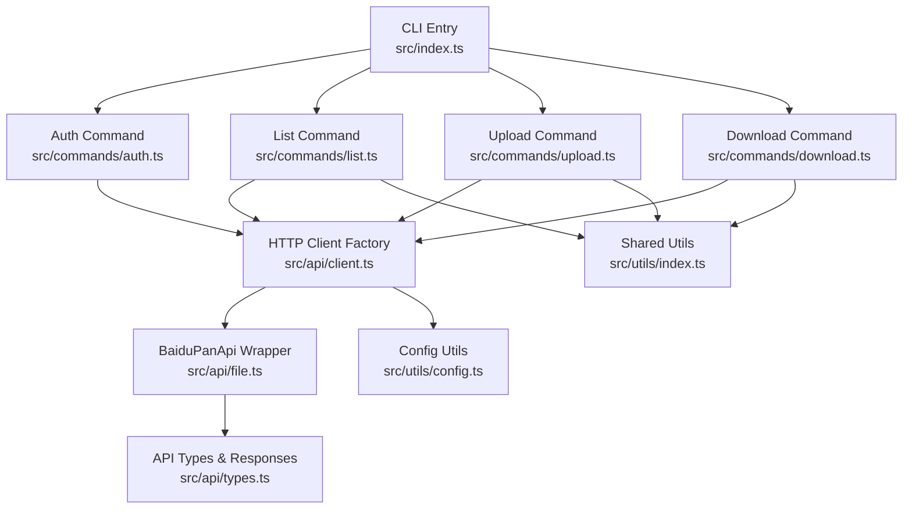
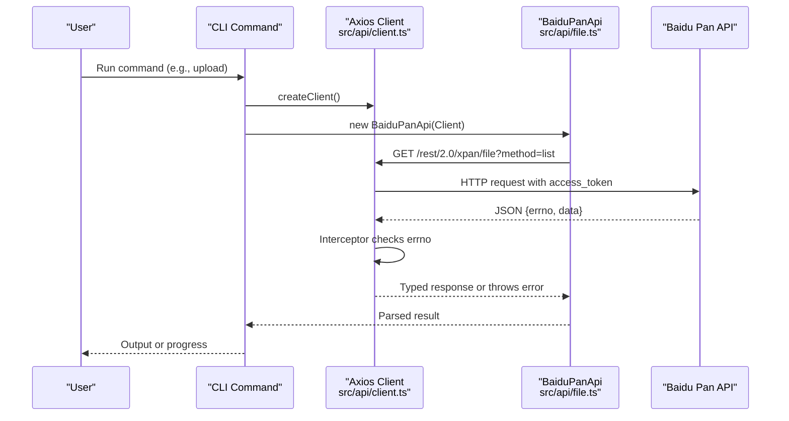
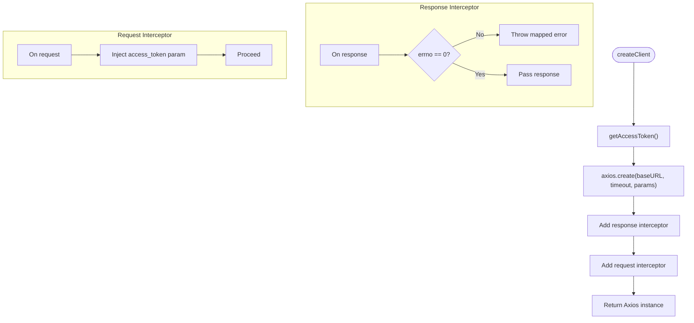
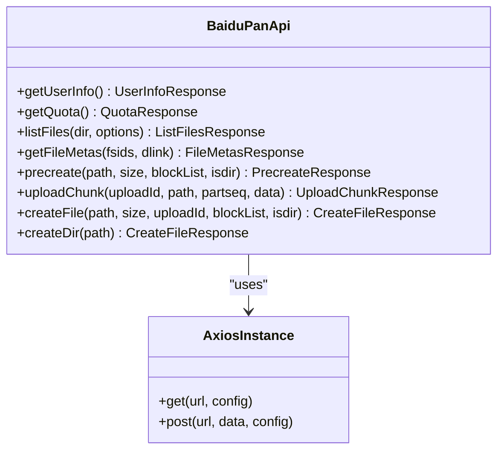
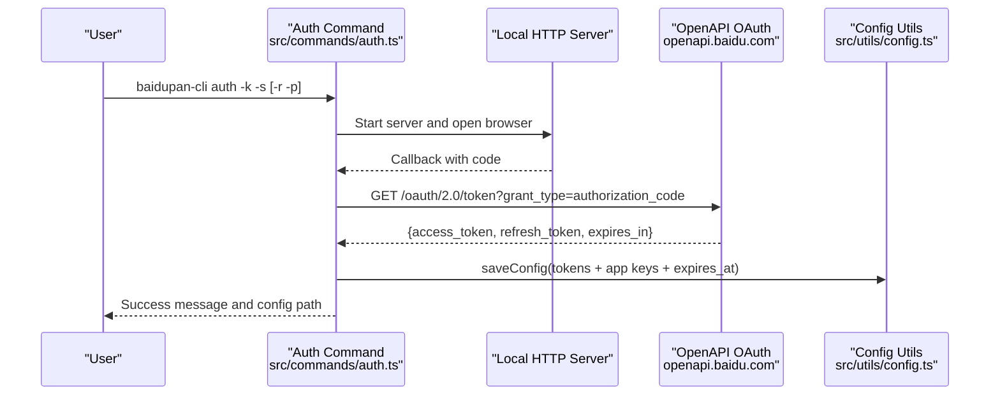
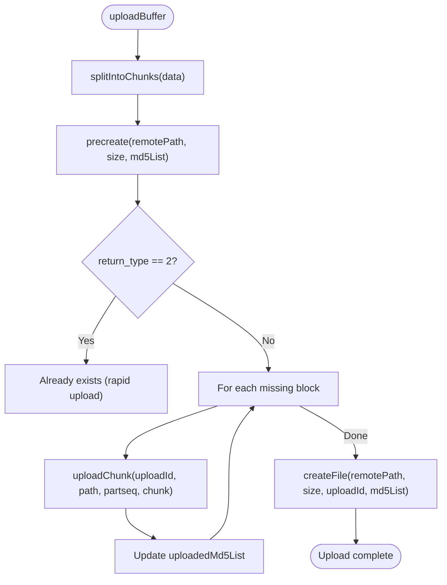
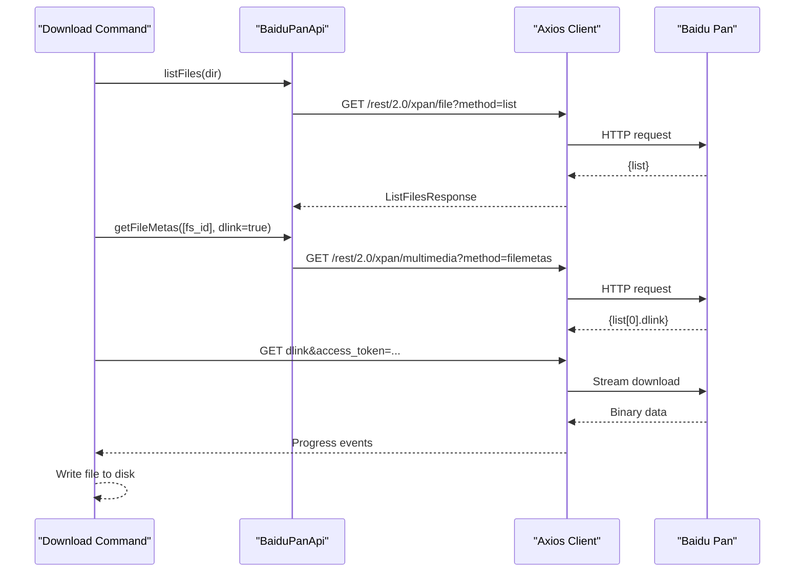
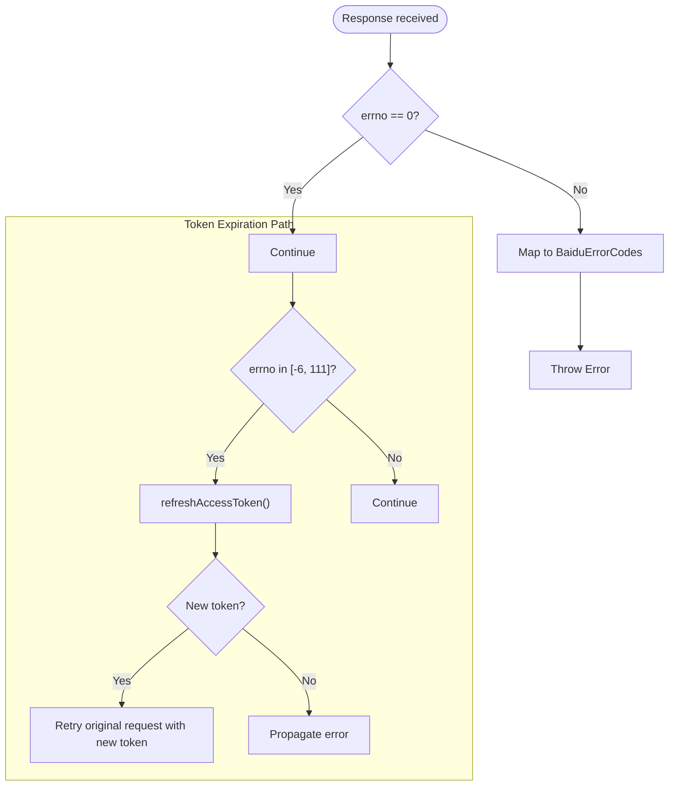
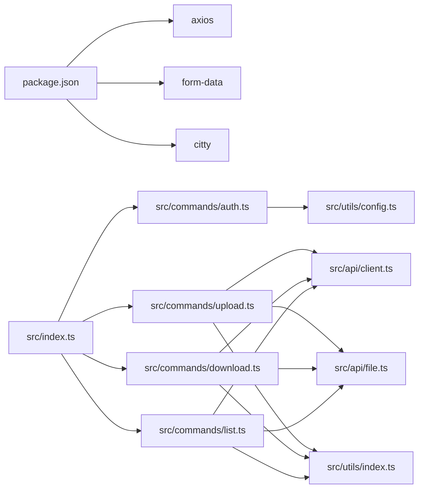

# API Integration

<cite>
**Referenced Files in This Document**
- [src/api/client.ts](file://src/api/client.ts)
- [src/api/file.ts](file://src/api/file.ts)
- [src/api/types.ts](file://src/api/types.ts)
- [src/commands/auth.ts](file://src/commands/auth.ts)
- [src/commands/upload.ts](file://src/commands/upload.ts)
- [src/commands/download.ts](file://src/commands/download.ts)
- [src/commands/list.ts](file://src/commands/list.ts)
- [src/utils/config.ts](file://src/utils/config.ts)
- [src/utils/index.ts](file://src/utils/index.ts)
- [src/index.ts](file://src/index.ts)
- [package.json](file://package.json)
- [README.md](file://README.md)
</cite>

## Table of Contents
1. [Introduction](#introduction)
2. [Project Structure](#project-structure)
3. [Core Components](#core-components)
4. [Architecture Overview](#architecture-overview)
5. [Detailed Component Analysis](#detailed-component-analysis)
6. [Dependency Analysis](#dependency-analysis)
7. [Performance Considerations](#performance-considerations)
8. [Troubleshooting Guide](#troubleshooting-guide)
9. [Conclusion](#conclusion)
10. [Appendices](#appendices)

## Introduction
This document provides comprehensive API integration documentation for the Baidu Pan API client implementation. It covers the HTTP client architecture, request/response handling, error management, authentication headers, rate limiting considerations, request/response transformation layers, data serialization formats, and API versioning approach. It also includes examples of direct API usage, custom endpoint extensions, integration patterns, retry mechanisms, timeout handling, network error recovery strategies, and performance optimization for high-volume operations.

## Project Structure
The project is organized around a CLI entry point and modular API clients:
- CLI entry initializes subcommands for auth, list, upload, and download.
- API client encapsulates HTTP communication and token management.
- Command modules orchestrate API usage for specific tasks.
- Utilities handle configuration persistence and shared helpers.

**Diagram sources**
- [src/index.ts](file://src/index.ts#L1-L26)
- [src/commands/auth.ts](file://src/commands/auth.ts#L1-L258)
- [src/commands/list.ts](file://src/commands/list.ts#L1-L81)
- [src/commands/upload.ts](file://src/commands/upload.ts#L1-L144)
- [src/commands/download.ts](file://src/commands/download.ts#L1-L104)
- [src/api/client.ts](file://src/api/client.ts#L1-L171)
- [src/api/file.ts](file://src/api/file.ts#L1-L201)
- [src/api/types.ts](file://src/api/types.ts#L1-L108)
- [src/utils/config.ts](file://src/utils/config.ts#L1-L62)
- [src/utils/index.ts](file://src/utils/index.ts#L1-L110)

**Section sources**
- [src/index.ts](file://src/index.ts#L1-L26)
- [package.json](file://package.json#L1-L81)

## Core Components
- HTTP Client Factory: Creates Axios instances with base URLs, timeouts, and interceptors for token injection and error handling.
- BaiduPanApi Wrapper: Encapsulates Baidu Pan REST endpoints for user info, quotas, file listing, metadata retrieval, and multipart upload workflow.
- Types and Responses: Strongly typed API response models and error code mapping.
- Commands: Orchestrate client usage for auth, list, upload, and download operations.
- Configuration Utilities: Persist and load tokens and app credentials locally.

Key responsibilities:
- Authentication: Fetch tokens from environment or config, auto-refresh on expiration, and inject access_token into requests.
- Request/Response Transformation: Convert raw API responses to typed models; map errno to user-friendly errors.
- Upload Pipeline: Precreate, chunk upload, and create file steps with MD5-based block verification.
- Download Pipeline: Resolve download links and stream content to disk with progress reporting.

**Section sources**
- [src/api/client.ts](file://src/api/client.ts#L1-L171)
- [src/api/file.ts](file://src/api/file.ts#L1-L201)
- [src/api/types.ts](file://src/api/types.ts#L1-L108)
- [src/utils/config.ts](file://src/utils/config.ts#L1-L62)

## Architecture Overview
The system follows a layered architecture:
- CLI Layer: Subcommands parse arguments and invoke API operations.
- API Client Layer: Provides Axios instances with interceptors for token management and error translation.
- API Wrapper Layer: Exposes typed methods for Baidu Pan endpoints.
- Utility Layer: Handles configuration, path normalization, and progress reporting.

**Diagram sources**
- [src/commands/upload.ts](file://src/commands/upload.ts#L1-L144)
- [src/api/client.ts](file://src/api/client.ts#L112-L161)
- [src/api/file.ts](file://src/api/file.ts#L39-L60)

## Detailed Component Analysis

### HTTP Client and Token Management
- Base URLs: Uses pan.baidu.com for main API and openapi.baidu.com for OAuth token exchange.
- Access Token Resolution: Environment variables take precedence; otherwise, reads from local config.
- Refresh Logic: On token expiration error, exchanges refresh_token for a new access_token and persists it.
- Interceptors:
  - Response interceptor: Checks errno and throws mapped errors.
  - Request interceptor: Injects current access_token into request params.
- Open API Client: Dedicated Axios instance for OAuth endpoints.

**Diagram sources**
- [src/api/client.ts](file://src/api/client.ts#L112-L161)
- [src/api/client.ts](file://src/api/client.ts#L124-L158)

**Section sources**
- [src/api/client.ts](file://src/api/client.ts#L1-L171)
- [src/utils/config.ts](file://src/utils/config.ts#L1-L62)

### BaiduPanApi Wrapper and Endpoint Methods
- User Info: GET /rest/2.0/xpan/nas?method=uinfo
- Quota: GET /api/quota?checkfree=1&checkexpire=1
- List Files: GET /rest/2.0/xpan/file?method=list with dir, order, desc, start, limit
- File Metas: GET /rest/2.0/xpan/multimedia?method=filemetas with fsids and dlink flag
- Precreate: POST /rest/2.0/xpan/file?method=precreate with form-encoded body
- Upload Chunk: POST https://d.pcs.baidu.com/rest/2.0/pcs/superfile2?method=upload with multipart/form-data
- Create File: POST /rest/2.0/xpan/file?method=create with form-encoded body
- Directory Creation: Convenience wrapper around createFile with isdir=true

**Diagram sources**
- [src/api/file.ts](file://src/api/file.ts#L16-L175)

**Section sources**
- [src/api/file.ts](file://src/api/file.ts#L1-L201)
- [src/api/types.ts](file://src/api/types.ts#L1-L108)

### Authentication Workflow
- OAuth Authorization Code Flow:
  - Starts a local HTTP server to receive the authorization code callback.
  - Opens browser to authorize URL with configured redirect URI.
  - Exchanges code for tokens via openapi.baidu.com/oauth/2.0/token.
  - Saves tokens and app credentials to local config with expiration timestamp.
- Token Refresh:
  - Detects token expiration via errno -6 or 111.
  - Calls refresh_token endpoint and updates in-memory and persisted config.

**Diagram sources**
- [src/commands/auth.ts](file://src/commands/auth.ts#L46-L91)
- [src/commands/auth.ts](file://src/commands/auth.ts#L93-L159)
- [src/commands/auth.ts](file://src/commands/auth.ts#L161-L192)
- [src/utils/config.ts](file://src/utils/config.ts#L35-L45)

**Section sources**
- [src/commands/auth.ts](file://src/commands/auth.ts#L1-L258)
- [src/utils/config.ts](file://src/utils/config.ts#L1-L62)
- [src/api/client.ts](file://src/api/client.ts#L63-L104)

### Upload Pipeline
- Chunking: Splits buffers into 4 MB chunks and computes MD5 per chunk.
- Precreate: Requests upload session and identifies missing blocks.
- Chunk Upload: Iterates over missing blocks and uploads each chunk.
- Create File: Finalizes file creation with aggregated MD5 list.

**Diagram sources**
- [src/commands/upload.ts](file://src/commands/upload.ts#L98-L144)
- [src/api/file.ts](file://src/api/file.ts#L107-L167)
- [src/api/file.ts](file://src/api/file.ts#L187-L198)

**Section sources**
- [src/commands/upload.ts](file://src/commands/upload.ts#L1-L144)
- [src/api/file.ts](file://src/api/file.ts#L1-L201)

### Download Pipeline
- Resolves remote file by listing directory and matching filename/fs_id.
- Retrieves file metadata with download link (dlink).
- Streams download using axios with access_token appended to dlink and progress reporting.

**Diagram sources**
- [src/commands/download.ts](file://src/commands/download.ts#L25-L103)
- [src/api/file.ts](file://src/api/file.ts#L62-L74)

**Section sources**
- [src/commands/download.ts](file://src/commands/download.ts#L1-L104)
- [src/api/file.ts](file://src/api/file.ts#L1-L201)

### Error Handling and Retry Strategies
- Error Codes: Mapped errno values to descriptive messages, including token invalid/expired (-6, 111), access denied (-7), file not found (-9), parameter error (2), and rate limiting (31034).
- Token Expiration Handling: Response interceptor detects token errors and triggers automatic refresh; if successful, retries the original request with new token.
- HTTP Error Handling: Non-2xx responses are translated to user-friendly errors.
- Rate Limiting: The client recognizes errno 31034 and surfaces it as a known error; no automatic retry is implemented for throttling.

**Diagram sources**
- [src/api/client.ts](file://src/api/client.ts#L124-L150)
- [src/api/client.ts](file://src/api/client.ts#L106-L110)
- [src/api/client.ts](file://src/api/client.ts#L63-L104)
- [src/api/types.ts](file://src/api/types.ts#L99-L107)

**Section sources**
- [src/api/client.ts](file://src/api/client.ts#L1-L171)
- [src/api/types.ts](file://src/api/types.ts#L1-L108)

### Data Serialization and API Versioning
- Query Parameters: Most endpoints use query parameters (e.g., method, dir, order, limit).
- Form-Encoded Bodies: Precreate and Create File endpoints accept application/x-www-form-urlencoded payloads.
- Multipart Upload: Upload Chunk endpoint uses multipart/form-data with Content-Type derived from form boundaries.
- API Versioning: Endpoints include versioned paths such as /rest/2.0/xpan/file and /rest/2.0/xpan/nas, indicating API versioning by path segment.

**Section sources**
- [src/api/file.ts](file://src/api/file.ts#L84-L101)
- [src/api/file.ts](file://src/api/file.ts#L158-L166)
- [src/api/file.ts](file://src/api/file.ts#L120-L136)

### Authentication Headers and Credentials
- Access Token Injection: The request interceptor appends access_token to all requests.
- OAuth Exchange: Authorization code exchange uses query parameters and sets a specific User-Agent header.
- App Credentials: App Key and Secret Key can be provided via environment variables or stored in config.

**Section sources**
- [src/api/client.ts](file://src/api/client.ts#L153-L158)
- [src/commands/auth.ts](file://src/commands/auth.ts#L167-L180)
- [src/utils/config.ts](file://src/utils/config.ts#L1-L62)

### Rate Limiting Considerations
- Known Error Code: Errno 31034 corresponds to “Request too frequent.”
- Mitigation Strategy: No automatic retry is implemented; applications should throttle requests or implement exponential backoff externally.

**Section sources**
- [src/api/types.ts](file://src/api/types.ts#L106-L107)

### Request/Response Transformation Layers
- Response Parsing: All API responses conform to a common envelope with errno, request_id, errmsg, and data payload.
- Type Safety: Strongly typed interfaces for responses and models reduce runtime errors.
- Error Translation: errno is checked and mapped to descriptive messages; token expiration triggers refresh and retry.

**Section sources**
- [src/api/types.ts](file://src/api/types.ts#L3-L8)
- [src/api/client.ts](file://src/api/client.ts#L124-L132)

### Integration Patterns and Examples
- Direct API Usage:
  - Initialize client and wrap with BaiduPanApi.
  - Call listFiles, getFileMetas, precreate, uploadChunk, createFile.
- Custom Endpoint Extensions:
  - Extend BaiduPanApi with new methods by adding new endpoints and typed response interfaces.
  - Use createClient for consistent token injection and error handling.
- Example Workflows:
  - Upload: splitIntoChunks -> precreate -> uploadChunk loop -> createFile.
  - Download: listFiles -> getFileMetas -> axios.get(dlink&access_token).

**Section sources**
- [src/api/file.ts](file://src/api/file.ts#L1-L201)
- [src/commands/upload.ts](file://src/commands/upload.ts#L98-L144)
- [src/commands/download.ts](file://src/commands/download.ts#L25-L103)

## Dependency Analysis
External dependencies:
- axios: HTTP client for REST calls and streaming downloads.
- form-data: Multipart form support for chunk uploads.
- citty: CLI framework for command definitions.
- node:* modules: File system, path, URL, child_process, and HTTP server for OAuth.

Internal dependencies:
- CLI entry depends on subcommand modules.
- Commands depend on API client factory and BaiduPanApi wrapper.
- API client depends on configuration utilities for token persistence.
- Upload/Download/List commands depend on shared utilities for path normalization and progress reporting.

**Diagram sources**
- [package.json](file://package.json#L49-L53)
- [src/index.ts](file://src/index.ts#L1-L26)
- [src/commands/auth.ts](file://src/commands/auth.ts#L1-L258)
- [src/commands/list.ts](file://src/commands/list.ts#L1-L81)
- [src/commands/upload.ts](file://src/commands/upload.ts#L1-L144)
- [src/commands/download.ts](file://src/commands/download.ts#L1-L104)
- [src/api/client.ts](file://src/api/client.ts#L1-L171)
- [src/api/file.ts](file://src/api/file.ts#L1-L201)
- [src/utils/config.ts](file://src/utils/config.ts#L1-L62)
- [src/utils/index.ts](file://src/utils/index.ts#L1-L110)

**Section sources**
- [package.json](file://package.json#L1-L81)
- [src/index.ts](file://src/index.ts#L1-L26)

## Performance Considerations
- Chunk Size: 4 MB chunks balance throughput and memory usage; adjust based on network conditions.
- Concurrency: The upload pipeline uploads missing blocks sequentially; consider parallelizing within limits to reduce total time while respecting rate limits.
- Streaming Downloads: Use axios responseType arraybuffer and onDownloadProgress for efficient memory usage and progress feedback.
- Token Caching: Access tokens are cached in memory; avoid unnecessary client recreation to minimize overhead.
- Retry Strategy: Automatic retry only applies to token expiration; implement external backoff for rate-limiting scenarios.

[No sources needed since this section provides general guidance]

## Troubleshooting Guide
Common issues and resolutions:
- Missing Access Token:
  - Ensure tokens are present in environment variables or config file; run the auth command to obtain tokens.
- Token Expired:
  - The client auto-refreshes on errno -6 or 111; if refresh fails, re-authenticate.
- Authorization Failures:
  - Verify App Key/Secret Key correctness and redirect URI alignment with the Open Platform settings.
- Network Errors:
  - Confirm connectivity to pan.baidu.com and openapi.baidu.com; disable proxies if necessary.
- Rate Limiting:
  - Expect errno 31034; implement client-side throttling or exponential backoff.
- Large File Uploads:
  - Monitor progress and ensure sufficient disk space; verify chunk MD5 aggregation.

**Section sources**
- [src/api/client.ts](file://src/api/client.ts#L34-L37)
- [src/api/client.ts](file://src/api/client.ts#L98-L104)
- [src/commands/auth.ts](file://src/commands/auth.ts#L51-L63)
- [src/api/types.ts](file://src/api/types.ts#L106-L107)

## Conclusion
The Baidu Pan API client provides a robust, typed, and resilient HTTP layer with automatic token management, structured error handling, and a clear upload/download pipeline. By leveraging interceptors, strongly typed models, and modular commands, it enables reliable integration for file operations. For high-volume usage, combine client-side throttling with careful chunk sizing and progress monitoring.

[No sources needed since this section summarizes without analyzing specific files]

## Appendices

### API Endpoint Reference
- User Info: GET /rest/2.0/xpan/nas?method=uinfo
- Quota: GET /api/quota?checkfree=1&checkexpire=1
- List Files: GET /rest/2.0/xpan/file?method=list&dir={dir}&order={name|time|size}&desc={0|1}&start={start}&limit={limit}&web=1
- File Metas: GET /rest/2.0/xpan/multimedia?method=filemetas&fsids={JSON}&dlink={0|1}
- Precreate: POST /rest/2.0/xpan/file?method=precreate (form-encoded)
- Upload Chunk: POST https://d.pcs.baidu.com/rest/2.0/pcs/superfile2?method=upload (multipart/form-data)
- Create File: POST /rest/2.0/xpan/file?method=create (form-encoded)
- Directory Create: POST /rest/2.0/xpan/file?method=create (isdir=1)

**Section sources**
- [src/api/file.ts](file://src/api/file.ts#L19-L175)

### Configuration and Environment Variables
- Config File Location: ~/.baidupan-cli/config.json
- Environment Variables:
  - BAIDU_APP_KEY, BAIDU_SECRET_KEY
  - BAIDU_ACCESS_TOKEN, BAIDU_REFRESH_TOKEN

**Section sources**
- [src/utils/config.ts](file://src/utils/config.ts#L5-L61)
- [src/commands/auth.ts](file://src/commands/auth.ts#L24-L45)

### Example Usage Patterns
- Listing Files:
  - baidupan-cli list /
  - baidupan-cli list /path -o time -d
  - baidupan-cli list / --json
- Uploading Files:
  - baidupan-cli upload ./local-file.txt /remote-file.txt
  - baidupan-cli upload ./local-dir /remote-dir/
  - echo "data" | baidupan-cli upload - /remote/stdin.txt
- Downloading Files:
  - baidupan-cli download /remote/file.txt
  - baidupan-cli download /remote/file.txt ./local-file.txt
  - baidupan-cli download /remote/file.txt ./downloads/

**Section sources**
- [README.md](file://README.md#L43-L115)
