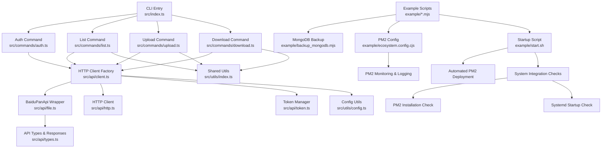
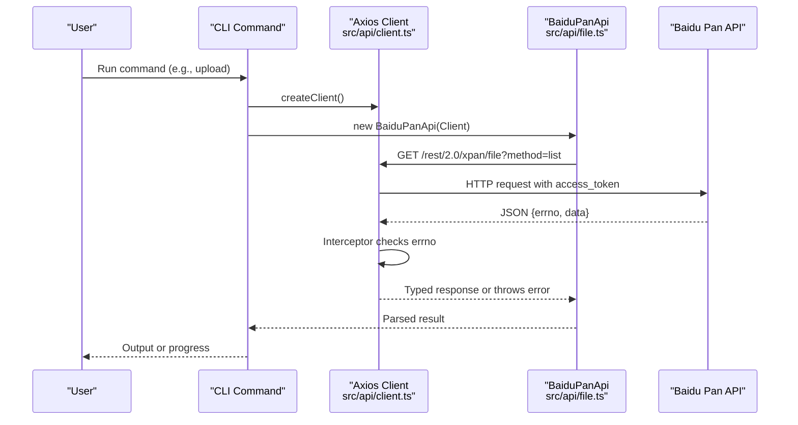
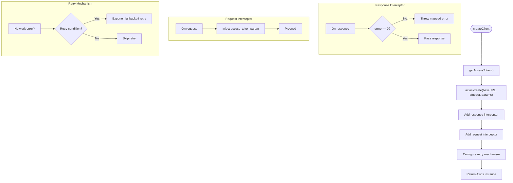
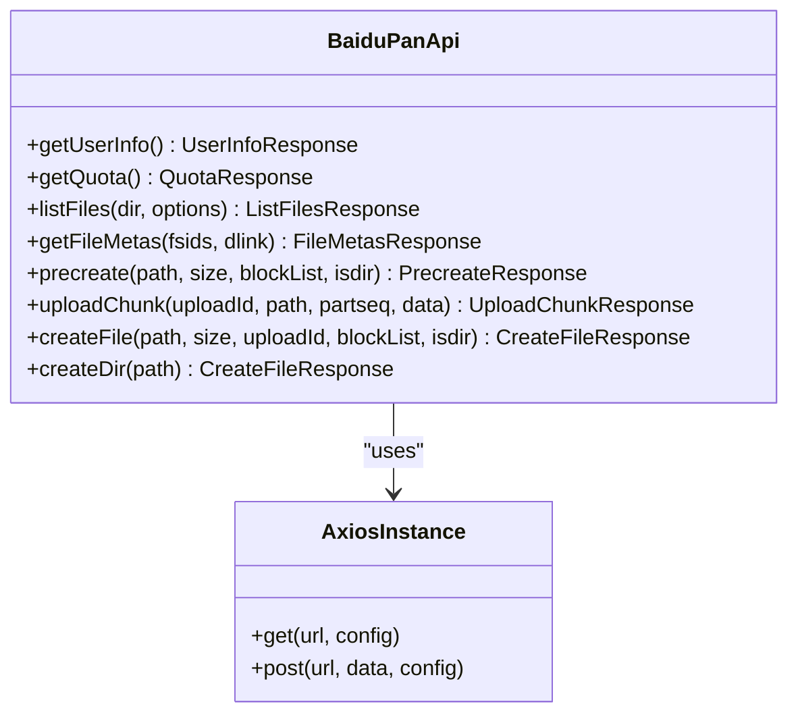
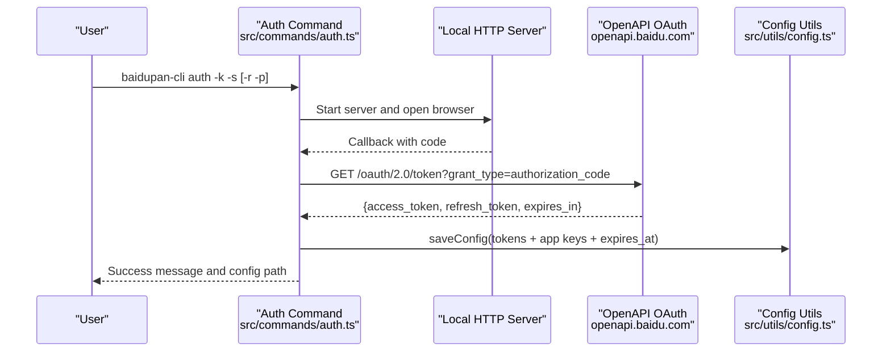
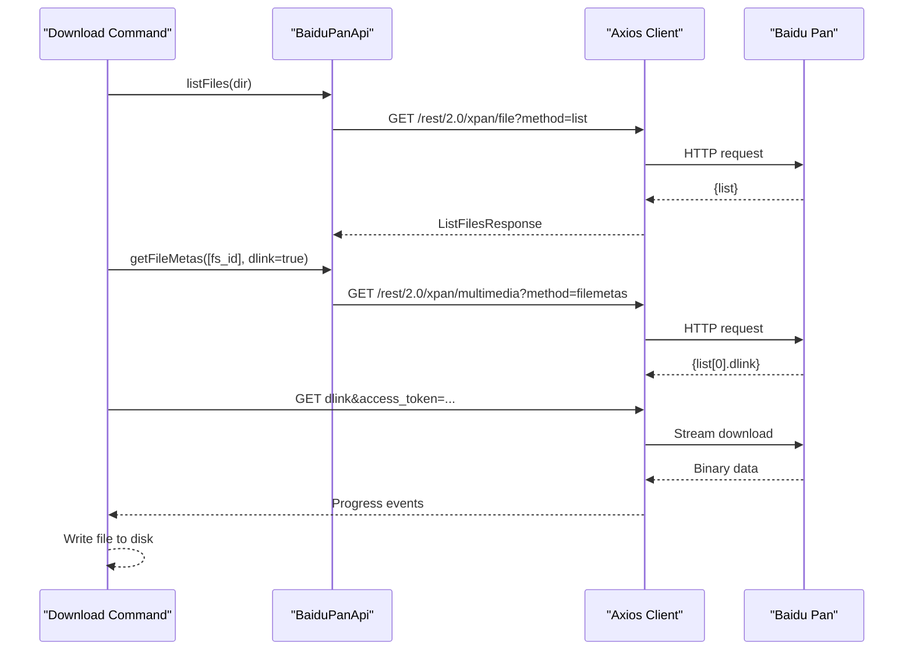
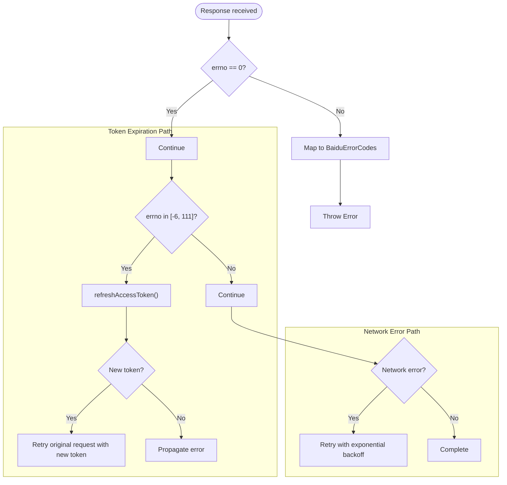
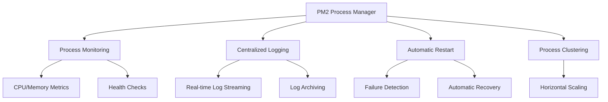
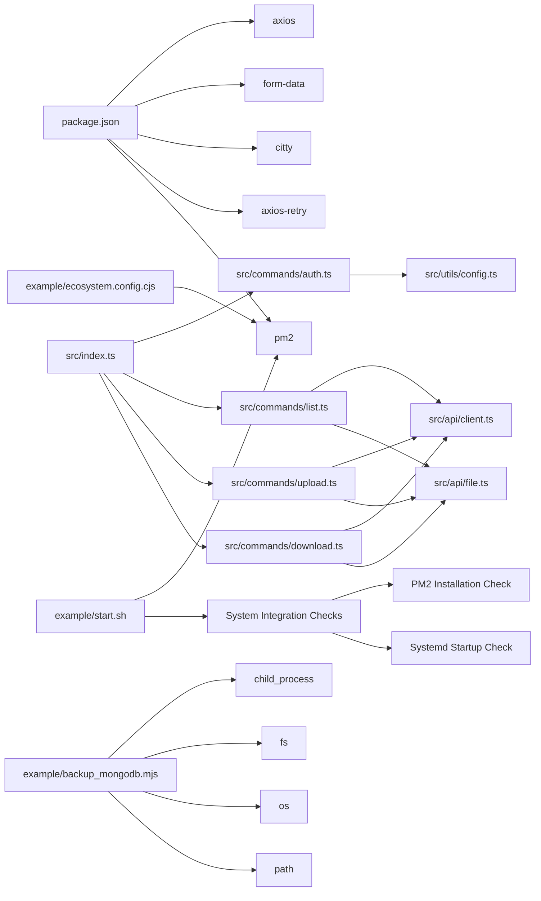

# API Integration

<cite>
**Referenced Files in This Document**
- [src/api/client.ts](file://src/api/client.ts)
- [src/api/file.ts](file://src/api/file.ts)
- [src/api/http.ts](file://src/api/http.ts)
- [src/api/token.ts](file://src/api/token.ts)
- [src/api/types.ts](file://src/api/types.ts)
- [src/commands/auth.ts](file://src/commands/auth.ts)
- [src/commands/upload.ts](file://src/commands/upload.ts)
- [src/commands/download.ts](file://src/commands/download.ts)
- [src/commands/list.ts](file://src/commands/list.ts)
- [src/utils/config.ts](file://src/utils/config.ts)
- [src/utils/index.ts](file://src/utils/index.ts)
- [src/index.ts](file://src/index.ts)
- [package.json](file://package.json)
- [README.md](file://README.md)
- [example/README.md](file://example/README.md)
- [example/backup_mongodb.mjs](file://example/backup_mongodb.mjs)
- [example/ecosystem.config.cjs](file://example/ecosystem.config.cjs)
- [example/start.sh](file://example/start.sh)
</cite>

## Update Summary
**Changes Made**
- Enhanced PM2 startup configuration with system integration checks and improved security by removing shell injection vulnerability in backup script
- Updated backup script to use `npx --yes` for safer package execution
- Improved system integration with automatic PM2 installation and systemd startup configuration
- Enhanced error handling and validation in backup scripts
- Added comprehensive system integration verification in startup scripts

## Table of Contents
1. [Introduction](#introduction)
2. [Project Structure](#project-structure)
3. [Core Components](#core-components)
4. [Architecture Overview](#architecture-overview)
5. [Detailed Component Analysis](#detailed-component-analysis)
6. [Node.js Integration Patterns](#nodejs-integration-patterns)
7. [Programmatic API Interaction](#programmatic-api-interaction)
8. [PM2 Integration for Automated Backups](#pm2-integration-for-automated-backups)
9. [Dependency Analysis](#dependency-analysis)
10. [Performance Considerations](#performance-considerations)
11. [Security Enhancements](#security-enhancements)
12. [Troubleshooting Guide](#troubleshooting-guide)
13. [Conclusion](#conclusion)
14. [Appendices](#appendices)

## Introduction
This document provides comprehensive API integration documentation for the Baidu Pan API client implementation. It covers the HTTP client architecture, request/response handling, error management, authentication headers, rate limiting considerations, request/response transformation layers, data serialization formats, and API versioning approach. It also includes detailed examples of Node.js integration patterns, child_process module usage, programmatic API interaction, custom endpoint extensions, integration patterns, retry mechanisms, timeout handling, network error recovery strategies, and performance optimization for high-volume operations.

**Updated** Enhanced with improved PM2 startup configuration, system integration checks, and security improvements including removal of shell injection vulnerabilities in backup scripts.

## Project Structure
The project is organized around a CLI entry point and modular API clients with enhanced Node.js integration capabilities and improved example directory structure:
- CLI entry initializes subcommands for auth, list, upload, and download.
- API client encapsulates HTTP communication and token management with robust retry mechanisms.
- Command modules orchestrate API usage for specific tasks.
- Utilities handle configuration persistence and shared helpers.
- Example scripts demonstrate advanced Node.js integration patterns, PM2 automation workflows, and backup scheduling with explicit version management and enhanced security.



**Diagram sources**
- [src/index.ts](file://src/index.ts#L1-L49)
- [src/commands/auth.ts](file://src/commands/auth.ts#L1-L258)
- [src/commands/list.ts](file://src/commands/list.ts#L1-L81)
- [src/commands/upload.ts](file://src/commands/upload.ts#L1-L144)
- [src/commands/download.ts](file://src/commands/download.ts#L1-L104)
- [src/api/client.ts](file://src/api/client.ts#L1-L72)
- [src/api/file.ts](file://src/api/file.ts#L1-L201)
- [src/api/types.ts](file://src/api/types.ts#L1-L102)
- [src/api/http.ts](file://src/api/http.ts#L1-L66)
- [src/api/token.ts](file://src/api/token.ts#L1-L135)
- [src/utils/config.ts](file://src/utils/config.ts#L1-L62)
- [src/utils/index.ts](file://src/utils/index.ts#L1-L110)
- [example/backup_mongodb.mjs](file://example/backup_mongodb.mjs#L1-L103)
- [example/ecosystem.config.cjs](file://example/ecosystem.config.cjs#L1-L24)
- [example/start.sh](file://example/start.sh#L1-L37)

**Section sources**
- [src/index.ts](file://src/index.ts#L1-L49)
- [package.json](file://package.json#L1-L99)

## Core Components
- HTTP Client Factory: Creates Axios instances with base URLs, timeouts, and interceptors for token injection and error handling with automatic retry mechanisms.
- BaiduPanApi Wrapper: Encapsulates Baidu Pan REST endpoints for user info, quotas, file listing, metadata retrieval, and multipart upload workflow.
- Token Management: Handles access token resolution, refresh logic, and OAuth token exchange with automatic persistence.
- Types and Responses: Strongly typed API response models and error code mapping.
- Commands: Orchestrate client usage for auth, list, upload, and download operations.
- Configuration Utilities: Persist and load tokens and app credentials locally.
- Retry Mechanisms: Configured with exponential backoff for network errors, 5xx responses, and rate limiting scenarios.
- **Enhanced Security**: Improved backup scripts with secure package execution using `npx --yes` to prevent shell injection vulnerabilities.
- **System Integration**: Comprehensive PM2 startup scripts with automatic installation, systemd integration, and system checks.

Key responsibilities:
- Authentication: Fetch tokens from environment or config, auto-refresh on expiration, and inject access_token into requests.
- Request/Response Transformation: Convert raw API responses to typed models; map errno to user-friendly errors.
- Upload Pipeline: Precreate, chunk upload, and create file steps with MD5-based block verification.
- Download Pipeline: Resolve download links and stream content to disk with progress reporting.
- Programmatic Integration: Enable seamless Node.js script integration through child_process module usage.
- **Version Management**: Provide explicit version control for backup scripts using `baidupan-cli@latest` for better maintainability.
- **PM2 Integration**: Provide automated backup scheduling, monitoring, and management through PM2 ecosystem configuration with system integration checks.
- **Security Enhancement**: Implement secure backup execution patterns that prevent shell injection attacks.

**Section sources**
- [src/api/client.ts](file://src/api/client.ts#L1-L72)
- [src/api/file.ts](file://src/api/file.ts#L1-L201)
- [src/api/types.ts](file://src/api/types.ts#L1-L102)
- [src/api/http.ts](file://src/api/http.ts#L23-L36)
- [src/api/token.ts](file://src/api/token.ts#L1-L135)
- [src/utils/config.ts](file://src/utils/config.ts#L1-L62)
- [example/backup_mongodb.mjs](file://example/backup_mongodb.mjs#L75-L77)
- [example/start.sh](file://example/start.sh#L11-L31)

## Architecture Overview
The system follows a layered architecture with enhanced Node.js integration capabilities, improved example directory packaging, explicit version management, and comprehensive system integration:
- CLI Layer: Subcommands parse arguments and invoke API operations.
- API Client Layer: Provides Axios instances with interceptors for token management, error translation, and automatic retry mechanisms.
- API Wrapper Layer: Exposes typed methods for Baidu Pan endpoints.
- Utility Layer: Handles configuration, path normalization, and progress reporting.
- Integration Layer: Supports programmatic Node.js usage through child_process module and PM2 automation.
- **Version Control Layer**: Explicit version management for backup scripts using package managers.
- **Monitoring Layer**: PM2 provides process monitoring, logging, and automatic restart capabilities.
- **Security Layer**: Secure execution patterns prevent shell injection vulnerabilities in backup scripts.
- **System Integration Layer**: Automated PM2 installation, systemd startup configuration, and system checks.



**Diagram sources**
- [src/commands/upload.ts](file://src/commands/upload.ts#L1-L144)
- [src/api/client.ts](file://src/api/client.ts#L20-L50)
- [src/api/file.ts](file://src/api/file.ts#L39-L60)

## Detailed Component Analysis

### HTTP Client and Token Management
- Base URLs: Uses pan.baidu.com for main API and openapi.baidu.com for OAuth token exchange.
- Access Token Resolution: Environment variables take precedence; otherwise, reads from local config.
- Refresh Logic: On token expiration error, exchanges refresh_token for a new access_token and persists it.
- Interceptors:
  - Response interceptor: Checks errno and throws mapped errors.
  - Request interceptor: Injects current access_token into request params.
- Open API Client: Dedicated Axios instance for OAuth endpoints.
- Retry Mechanisms: Automatic retry for network errors, 5xx responses, and rate limiting (429).



**Diagram sources**
- [src/api/client.ts](file://src/api/client.ts#L10-L60)
- [src/api/client.ts](file://src/api/client.ts#L20-L50)
- [src/api/http.ts](file://src/api/http.ts#L23-L36)

**Section sources**
- [src/api/client.ts](file://src/api/client.ts#L1-L72)
- [src/api/http.ts](file://src/api/http.ts#L1-L66)
- [src/api/token.ts](file://src/api/token.ts#L1-L135)
- [src/utils/config.ts](file://src/utils/config.ts#L1-L62)

### BaiduPanApi Wrapper and Endpoint Methods
- User Info: GET /rest/2.0/xpan/nas?method=uinfo
- Quota: GET /api/quota?checkfree=1&checkexpire=1
- List Files: GET /rest/2.0/xpan/file?method=list with dir, order, desc, start, limit
- File Metas: GET /rest/2.0/xpan/multimedia?method=filemetas with fsids and dlink flag
- Precreate: POST /rest/2.0/xpan/file?method=precreate with form-encoded body
- Upload Chunk: POST https://d.pcs.baidu.com/rest/2.0/pcs/superfile2?method=upload with multipart/form-data
- Create File: POST /rest/2.0/xpan/file?method=create with form-encoded body
- Directory Creation: Convenience wrapper around createFile with isdir=true



**Diagram sources**
- [src/api/file.ts](file://src/api/file.ts#L16-L175)

**Section sources**
- [src/api/file.ts](file://src/api/file.ts#L1-L201)
- [src/api/types.ts](file://src/api/types.ts#L1-L102)

### Authentication Workflow
- OAuth Authorization Code Flow:
  - Starts a local HTTP server to receive the authorization code callback.
  - Opens browser to authorize URL with configured redirect URI.
  - Exchanges code for tokens via openapi.baidu.com/oauth/2.0/token.
  - Saves tokens and app credentials to local config with expiration timestamp.
- Token Refresh:
  - Detects token expiration via errno -6 or 111.
  - Calls refresh_token endpoint and updates in-memory and persisted config.



**Diagram sources**
- [src/commands/auth.ts](file://src/commands/auth.ts#L46-L91)
- [src/commands/auth.ts](file://src/commands/auth.ts#L93-L159)
- [src/commands/auth.ts](file://src/commands/auth.ts#L161-L192)
- [src/utils/config.ts](file://src/utils/config.ts#L35-L45)

**Section sources**
- [src/commands/auth.ts](file://src/commands/auth.ts#L1-L258)
- [src/utils/config.ts](file://src/utils/config.ts#L1-L62)
- [src/api/client.ts](file://src/api/client.ts#L65-L67)
- [src/api/token.ts](file://src/api/token.ts#L76-L116)

### Upload Pipeline
- Chunking: Splits buffers into 4 MB chunks and computes MD5 per chunk.
- Precreate: Requests upload session and identifies missing blocks.
- Chunk Upload: Iterates over missing blocks and uploads each chunk.
- Create File: Finalizes file creation with aggregated MD5 list.


**Diagram sources**
- [src/commands/upload.ts](file://src/commands/upload.ts#L98-L144)
- [src/api/file.ts](file://src/api/file.ts#L79-L102)
- [src/api/file.ts](file://src/api/file.ts#L107-L138)
- [src/api/file.ts](file://src/api/file.ts#L143-L167)

**Section sources**
- [src/commands/upload.ts](file://src/commands/upload.ts#L1-L144)
- [src/api/file.ts](file://src/api/file.ts#L1-L201)

### Download Pipeline
- Resolves remote file by listing directory and matching filename/fs_id.
- Retrieves file metadata with download link (dlink).
- Streams download using axios with access_token appended to dlink and progress reporting.



**Diagram sources**
- [src/commands/download.ts](file://src/commands/download.ts#L25-L103)
- [src/api/file.ts](file://src/api/file.ts#L62-L74)

**Section sources**
- [src/commands/download.ts](file://src/commands/download.ts#L1-L104)
- [src/api/file.ts](file://src/api/file.ts#L1-L201)

### Error Handling and Retry Strategies
- Error Codes: Mapped errno values to descriptive messages, including token invalid/expired (-6, 111), access denied (-7), file not found (-9), parameter error (2), and rate limiting (31034).
- Token Expiration Handling: Response interceptor detects token errors and triggers automatic refresh; if successful, retries the original request with new token.
- HTTP Error Handling: Non-2xx responses are translated to user-friendly errors.
- Rate Limiting: The client recognizes errno 31034 and surfaces it as a known error; no automatic retry is implemented for throttling.
- Network Error Recovery: Automatic retry with exponential backoff for transient network failures.



**Diagram sources**
- [src/api/client.ts](file://src/api/client.ts#L20-L50)
- [src/api/http.ts](file://src/api/http.ts#L23-L36)
- [src/api/token.ts](file://src/api/token.ts#L67-L71)
- [src/api/types.ts](file://src/api/types.ts#L92-L101)

**Section sources**
- [src/api/client.ts](file://src/api/client.ts#L1-L72)
- [src/api/http.ts](file://src/api/http.ts#L1-L66)
- [src/api/types.ts](file://src/api/types.ts#L1-L102)
- [src/api/token.ts](file://src/api/token.ts#L1-L135)

### Data Serialization and API Versioning
- Query Parameters: Most endpoints use query parameters (e.g., method, dir, order, limit).
- Form-Encoded Bodies: Precreate and Create File endpoints accept application/x-www-form-urlencoded payloads.
- Multipart Upload: Upload Chunk endpoint uses multipart/form-data with Content-Type derived from form boundaries.
- API Versioning: Endpoints include versioned paths such as /rest/2.0/xpan/file and /rest/2.0/xpan/nas, indicating API versioning by path segment.

**Section sources**
- [src/api/file.ts](file://src/api/file.ts#L84-L101)
- [src/api/file.ts](file://src/api/file.ts#L158-L166)
- [src/api/file.ts](file://src/api/file.ts#L120-L136)

### Authentication Headers and Credentials
- Access Token Injection: The request interceptor appends access_token to all requests.
- OAuth Exchange: Authorization code exchange uses query parameters and sets a specific User-Agent header.
- App Credentials: App Key and Secret Key can be provided via environment variables or stored in config.

**Section sources**
- [src/api/client.ts](file://src/api/client.ts#L15-L18)
- [src/api/client.ts](file://src/api/client.ts#L52-L57)
- [src/commands/auth.ts](file://src/commands/auth.ts#L167-L180)
- [src/utils/config.ts](file://src/utils/config.ts#L1-L62)

### Rate Limiting Considerations
- Known Error Code: Errno 31034 corresponds to "Request too frequent."
- Mitigation Strategy: No automatic retry is implemented; applications should throttle requests or implement exponential backoff externally.

**Section sources**
- [src/api/types.ts](file://src/api/types.ts#L99-L101)

### Request/Response Transformation Layers
- Response Parsing: All API responses conform to a common envelope with errno, request_id, errmsg, and data payload.
- Type Safety: Strongly typed interfaces for responses and models reduce runtime errors.
- Error Translation: errno is checked and mapped to descriptive messages; token expiration triggers refresh and retry.

**Section sources**
- [src/api/types.ts](file://src/api/types.ts#L3-L8)
- [src/api/client.ts](file://src/api/client.ts#L20-L42)

## Node.js Integration Patterns

### Child Process Module Usage
The Baidu Pan CLI can be seamlessly integrated into Node.js applications using the child_process module for programmatic API interaction. This enables automated workflows, scheduled backups, and custom integrations.

**Updated** Enhanced with improved backup script version management using explicit package versioning for better maintainability and security improvements.

#### ExecSync Pattern
Direct synchronous execution for simple automation tasks:

```javascript
import { execSync } from 'node:child_process'

// Upload file synchronously
execSync('baidupan-cli upload ./data.json /备份/data.json')

// Get file list and process JSON output
const result = execSync('baidupan-cli list /path --json', { encoding: 'utf-8' })
const files = JSON.parse(result)
const largeFiles = files.filter(f => f.size > 1000000)
console.log('大文件:', largeFiles)
```

#### SpawnSync Pattern
Asynchronous execution with better control over process lifecycle:

```javascript
import { spawnSync } from 'node:child_process'

// Upload dynamic content via stdin
const data = JSON.stringify({ time: Date.now(), data: '...' })
const child = spawnSync('baidupan-cli', ['upload', '-', '/备份/snapshot.json'], {
  input: data,
  stdio: 'inherit'
})

if (child.status === 0) {
  console.log('上传成功')
}
```

#### Spawn Pattern for Real-time Processing
Streaming output and real-time progress monitoring:

```javascript
import { spawn } from 'node:child_process'

const child = spawn('baidupan-cli', ['upload', './large-file.zip', '/backup/'])

child.stdout.on('data', (data) => {
  console.log(`STDOUT: ${data}`)
})

child.stderr.on('data', (data) => {
  console.error(`STDERR: ${data}`)
})

child.on('close', (code) => {
  console.log(`进程退出，退出码: ${code}`)
})
```

**Section sources**
- [README.md](file://README.md#L213-L232)
- [example/backup_mongodb.mjs](file://example/backup_mongodb.mjs#L14-L17)

### MongoDB Backup Automation
The example demonstrates a complete MongoDB backup workflow integrated with Baidu Pan CLI and improved version management with enhanced security:

**Updated** Enhanced with explicit version management using `baidupan-cli@latest` for better maintainability and security improvements using `npx --yes` to prevent shell injection vulnerabilities.

```javascript
#!/usr/bin/env node

import { execSync, spawnSync } from 'node:child_process'
import { existsSync, mkdirSync, rmSync } from 'node:fs'
import { tmpdir } from 'node:os'
import { join } from 'node:path'

// Check mongodump availability
try {
  execSync('mongodump --version', { stdio: 'ignore' })
}
catch {
  console.error('错误: 未找到 mongodump，请安装 MongoDB 工具')
  process.exit(1)
}

// Execute backup and upload workflow
const backupDir = join(tmpdir(), `mongodb_backups_${process.pid}`)
mkdirSync(backupDir, { recursive: true })

// Generate timestamped backup name
const timestamp = new Date().toISOString().replace(/[-:]/g, '').replace('T', '_').slice(0, 15)
const backupName = `mongodb_backup_${timestamp}`
const backupPath = join(backupDir, backupName)

// Execute mongodump
execSync(`mongodump --uri "${mongoUrl}" --out "${backupPath}"`, { stdio: 'inherit' })

// Compress backup
const tarFile = `${backupName}.tar.gz`
execSync(`tar -czf "${tarFile}" "${backupName}"`, { cwd: backupDir, stdio: 'inherit' })

// Upload to Baidu Pan using secure package execution
const backupFile = join(backupDir, tarFile)
const remotePath = `${remoteDir}/${tarFile}`

const result = spawnSync('npx', ['--yes', 'baidupan-cli@latest', 'upload', backupFile, remotePath], {
  stdio: 'inherit',
})

if (result.status === 0) {
  console.log(`备份已成功上传到百度网盘: ${remotePath}`)
  rmSync(backupFile, { force: true })
}
```

**Section sources**
- [example/backup_mongodb.mjs](file://example/backup_mongodb.mjs#L1-L103)

## PM2 Integration for Automated Backups

**New Section** The Baidu Pan CLI now supports automated backup scheduling through PM2 integration, providing enterprise-grade process management and monitoring capabilities with enhanced system integration.

### PM2 Configuration and Scheduling
PM2 provides a robust platform for running and managing Node.js applications with built-in scheduling, monitoring, and automatic restart capabilities:

```javascript
module.exports = {
  apps: [{
    name: 'mongodb-backup',
    script: './backup_mongodb.mjs',
    cwd: __dirname,
    cron_restart: '0 * * * *', // 每小时执行一次
    autorestart: false, // 执行完毕后不自动重启（等待 cron 触发）
    env: {
      MONGO_URL: 'mongodb://localhost:27017', // MongoDB 连接字符串
      REMOTE_DIR: '/backup/local/mongodb', // 百度网盘远程目录
    },
  }],
}
```

### Enhanced Automated PM2 Deployment
The `start.sh` script provides automated deployment and setup of PM2-managed backup tasks with comprehensive system integration checks and security improvements:

```bash
#!/bin/bash

# MongoDB 定时备份启动脚本
# 使用方法: ./start.sh

set -e

SCRIPT_DIR="$(cd "$(dirname "${BASH_SOURCE[0]}")" && pwd)"
CONFIG_FILE="$SCRIPT_DIR/ecosystem.config.cjs"

echo "检查 PM2..."
if ! command -v pm2 &> /dev/null; then
    echo "安装 PM2..."
    npm install -g pm2
fi

echo "启动定时备份任务..."
pm2 start "$CONFIG_FILE"

echo "保存 PM2 进程列表..."
pm2 save

# 检查是否已设置开机自启
if systemctl is-enabled "pm2-$(whoami)" &> /dev/null 2>&1; then
    echo "开机自启已配置，跳过..."
else
    echo "设置开机自启..."
    pm2 startup
    echo ""
    echo "注意: 请复制上面的命令并以 sudo 执行"
fi

echo ""
echo "启动完成！"
echo "查看状态: pm2 status"
echo "查看日志: pm2 logs mongodb-backup"
```

### PM2 Management Commands
Comprehensive PM2 management for backup tasks:

```bash
# 启动 PM2 定时任务
pm2 start example/ecosystem.config.cjs

# 查看任务状态
pm2 status

# 查看任务日志
pm2 logs mongodb-backup

# 立即触发一次备份
pm2 restart mongodb-backup

# 停止任务
pm2 stop mongodb-backup

# 删除任务
pm2 delete mongodb-backup

# 设置开机自启
pm2 save
pm2 startup
```

### Custom Scheduling Patterns
PM2 supports flexible scheduling through cron expressions:

```javascript
// 每小时执行一次
cron_restart: '0 * * * *'

// 每天凌晨 2 点执行
cron_restart: '0 2 * * *'

// 每 6 小时执行一次
cron_restart: '0 */6 * * *'

// 每周日零点执行
cron_restart: '0 0 * * 0'

// 每 15 分钟执行一次
cron_restart: '*/15 * * * *'
```

### PM2 Monitoring and Logging
Advanced monitoring capabilities for production environments:



**Diagram sources**
- [example/ecosystem.config.cjs](file://example/ecosystem.config.cjs#L11-L23)
- [example/start.sh](file://example/start.sh#L11-L22)

**Section sources**
- [example/ecosystem.config.cjs](file://example/ecosystem.config.cjs#L1-L24)
- [example/start.sh](file://example/start.sh#L1-L37)
- [example/README.md](file://example/README.md#L46-L76)

## Programmatic API Interaction

### Direct API Usage in Node.js
Applications can import and use the Baidu Pan API client directly for programmatic interactions:

```javascript
import { BaiduPanApi, createClient } from 'baidupan-cli'

// Initialize client and API wrapper
const client = createClient()
const api = new BaiduPanApi(client)

// Perform operations programmatically
try {
  const userInfo = await api.getUserInfo()
  console.log('用户信息:', userInfo)

  const files = await api.listFiles('/backup')
  console.log('文件列表:', files)

  // Upload file programmatically
  const result = await api.uploadFile('./local-file.txt', '/remote-file.txt')
  console.log('上传结果:', result)
}
catch (error) {
  console.error('API 调用失败:', error.message)
}
```

### Custom Endpoint Extensions
Extend the BaiduPanApi class to add new endpoints:

```typescript
class ExtendedBaiduPanApi extends BaiduPanApi {
  async getFileInfo(fsId: number): Promise<any> {
    const response = await this.client.get('/rest/2.0/xpan/file', {
      params: {
        method: 'info',
        fsid: fsId
      }
    })
    return response.data
  }

  async batchDelete(fsIds: number[]): Promise<any> {
    const response = await this.client.post('/rest/2.0/xpan/file', `fsids=${JSON.stringify(fsIds)}&method=batchdelete`, {
      headers: { 'Content-Type': 'application/x-www-form-urlencoded' }
    })
    return response.data
  }
}
```

### Integration with Other Node.js Libraries
Combine Baidu Pan CLI with other Node.js libraries for enhanced functionality:

```javascript
import { execSync } from 'node:child_process'
import fs from 'node:fs'
import cron from 'node-cron'

// Schedule periodic backups
cron.schedule('0 2 * * *', async () => {
  try {
    // Generate backup file
    const timestamp = new Date().toISOString().slice(0, 19).replace(/[:\-T]/g, '')
    const backupFile = `/tmp/backup_${timestamp}.tar.gz`

    // Create compressed backup
    execSync(`tar -czf ${backupFile} /data/important/`)

    // Upload to Baidu Pan using secure package execution
    execSync(`npx --yes baidupan-cli@latest upload ${backupFile} /backups/${timestamp}.tar.gz`)

    // Clean up local backup
    fs.unlinkSync(backupFile)

    console.log(`Backup completed at ${new Date()}`)
  }
  catch (error) {
    console.error('Backup failed:', error.message)
  }
})
```

**Section sources**
- [src/api/client.ts](file://src/api/client.ts#L1-L72)
- [src/api/file.ts](file://src/api/file.ts#L1-L201)
- [README.md](file://README.md#L213-L245)

## Dependency Analysis
External dependencies:
- axios: HTTP client for REST calls and streaming downloads with automatic retry mechanisms.
- form-data: Multipart form support for chunk uploads.
- citty: CLI framework for command definitions.
- node:* modules: File system, path, URL, child_process, and HTTP server for OAuth.
- axios-retry: Automatic retry mechanism with exponential backoff.
- **PM2: Process manager for automated backup scheduling and monitoring with system integration.**

Internal dependencies:
- CLI entry depends on subcommand modules.
- Commands depend on API client factory and BaiduPanApi wrapper.
- API client depends on configuration utilities for token persistence.
- Upload/Download/List commands depend on shared utilities for path normalization and progress reporting.
- Example scripts demonstrate integration patterns, PM2 automation workflows, and backup scheduling.
- **PM2 configuration depends on ecosystem.config.cjs for scheduling and monitoring.**
- **Enhanced startup scripts provide system integration checks and security improvements.**



**Diagram sources**
- [package.json](file://package.json#L65-L91)
- [src/index.ts](file://src/index.ts#L1-L49)
- [src/commands/auth.ts](file://src/commands/auth.ts#L1-L258)
- [src/commands/list.ts](file://src/commands/list.ts#L1-L81)
- [src/commands/upload.ts](file://src/commands/upload.ts#L1-L144)
- [src/commands/download.ts](file://src/commands/download.ts#L1-L104)
- [src/api/client.ts](file://src/api/client.ts#L1-L72)
- [src/api/file.ts](file://src/api/file.ts#L1-L201)
- [src/utils/config.ts](file://src/utils/config.ts#L1-L62)
- [src/utils/index.ts](file://src/utils/index.ts#L1-L110)
- [example/backup_mongodb.mjs](file://example/backup_mongodb.mjs#L14-L17)
- [example/ecosystem.config.cjs](file://example/ecosystem.config.cjs#L1-L24)
- [example/start.sh](file://example/start.sh#L1-L37)

**Section sources**
- [package.json](file://package.json#L1-L99)
- [src/index.ts](file://src/index.ts#L1-L49)

## Performance Considerations
- Chunk Size: 4 MB chunks balance throughput and memory usage; adjust based on network conditions.
- Concurrency: The upload pipeline uploads missing blocks sequentially; consider parallelizing within limits to reduce total time while respecting rate limits.
- Streaming Downloads: Use axios responseType arraybuffer and onDownloadProgress for efficient memory usage and progress feedback.
- Token Caching: Access tokens are cached in memory; avoid unnecessary client recreation to minimize overhead.
- Retry Strategy: Automatic retry only applies to token expiration; implement external backoff for rate-limiting scenarios.
- Process Management: Use spawn instead of exec for large outputs to avoid memory issues; implement proper error handling for child processes.
- Resource Cleanup: Always clean up temporary files and directories in automated workflows.
- **Version Management**: Use explicit versioning (`baidupan-cli@latest`) for backup scripts to ensure compatibility and easy updates.
- **PM2 Optimization**: Leverage PM2's clustering and monitoring features for production deployments; configure appropriate restart policies and resource limits.
- **Security Optimization**: Use `npx --yes` for secure package execution to prevent shell injection vulnerabilities.

## Security Enhancements

**New Section** The backup scripts and PM2 integration have been enhanced with comprehensive security improvements to prevent shell injection vulnerabilities and ensure safe execution patterns.

### Shell Injection Prevention
The backup script now uses `npx --yes` instead of potentially vulnerable shell injection patterns:

```javascript
// Secure execution pattern
const result = spawnSync('npx', ['--yes', 'baidupan-cli@latest', 'upload', backupFile, remotePath], {
  stdio: 'inherit',
})

// Instead of potentially vulnerable patterns like:
// execSync(`baidupan-cli upload "${backupFile}" "${remotePath}"`)
```

### System Integration Security
The startup script includes comprehensive system integration checks:

```bash
#!/bin/bash

# Enhanced startup script with security and system integration checks

# Check PM2 installation
if ! command -v pm2 &> /dev/null; then
    echo "安装 PM2..."
    npm install -g pm2
fi

# Check systemd integration
if systemctl is-enabled "pm2-$(whoami)" &> /dev/null 2>&1; then
    echo "开机自启已配置，跳过..."
else
    echo "设置开机自启..."
    pm2 startup
    echo ""
    echo "注意: 请复制上面的命令并以 sudo 执行"
fi
```

### Secure Parameter Handling
Backup scripts now include enhanced parameter validation and secure handling:

```javascript
// Enhanced parameter validation
const mongoUrl = process.env.MONGO_URL || process.argv[2]
const remoteDir = process.env.REMOTE_DIR || process.argv[3]

if (!mongoUrl || !remoteDir) {
  console.log(`用法: node backup_mongodb.mjs <mongo_url> <remote_directory>
  或者设置环境变量后运行: MONGO_URL=<url> REMOTE_DIR=<dir> node backup_mongodb.mjs
  注意: 如果 URL 包含特殊字符，请使用引号包围`)
  process.exit(1)
}
```

### Security Best Practices Implemented
- **Secure Package Execution**: Using `npx --yes` prevents shell injection in package execution
- **Parameter Validation**: Input validation prevents malicious parameter injection
- **System Integration Checks**: Automated checks ensure proper system configuration
- **Safe File Operations**: Proper cleanup and error handling prevent security issues
- **Environment Variable Usage**: Secure environment variable handling reduces exposure

**Section sources**
- [example/backup_mongodb.mjs](file://example/backup_mongodb.mjs#L75-L77)
- [example/start.sh](file://example/start.sh#L11-L31)
- [example/backup_mongodb.mjs](file://example/backup_mongodb.mjs#L23-L33)

## Troubleshooting Guide
Common issues and resolutions:
- Missing Access Token:
  - Ensure tokens are present in environment variables or config file; run the auth command to obtain tokens.
- Token Expired:
  - The client auto-refreshes on errno -6 or 111; if refresh fails, re-authenticate.
- Authorization Failures:
  - Verify App Key/Secret Key correctness and redirect URI alignment with the Open Platform settings.
- Network Errors:
  - Confirm connectivity to pan.baidu.com and openapi.baidu.com; disable proxies if necessary.
- Rate Limiting:
  - Expect errno 31034; implement client-side throttling or exponential backoff.
- Large File Uploads:
  - Monitor progress and ensure sufficient disk space; verify chunk MD5 aggregation.
- Child Process Issues:
  - Use spawnSync for synchronous operations, spawn for asynchronous streaming.
  - Handle process exit codes and stderr output appropriately.
- Memory Issues:
  - Use streaming for large file operations; avoid loading entire files into memory.
- Permission Errors:
  - Ensure proper file permissions for backup directories and temporary files.
- **Version Management Issues**:
  - Use explicit versioning (`baidupan-cli@latest`) to ensure compatibility with the latest features.
  - Clear package cache if encountering version conflicts.
- **PM2 Issues**:
  - Check PM2 logs with `pm2 logs mongodb-backup` for detailed error information.
  - Verify PM2 installation with `pm2 --version` and proper startup configuration.
  - Monitor process health with `pm2 status` and restart failed processes automatically.
- **Security Issues**:
  - Ensure backup scripts use `npx --yes` for secure package execution.
  - Validate all input parameters to prevent injection attacks.
  - Check system integration with proper systemd configuration.
- **System Integration Issues**:
  - Verify PM2 installation and proper system service configuration.
  - Check that backup scripts have appropriate file permissions.
  - Ensure environment variables are properly set for backup operations.

**Section sources**
- [src/api/client.ts](file://src/api/client.ts#L34-L37)
- [src/api/client.ts](file://src/api/client.ts#L98-L104)
- [src/commands/auth.ts](file://src/commands/auth.ts#L51-L63)
- [src/api/types.ts](file://src/api/types.ts#L99-L101)
- [src/api/http.ts](file://src/api/http.ts#L23-L36)
- [example/README.md](file://example/README.md#L103-L111)
- [example/backup_mongodb.mjs](file://example/backup_mongodb.mjs#L75-L77)
- [example/start.sh](file://example/start.sh#L23-L31)

## Conclusion
The Baidu Pan API client provides a robust, typed, and resilient HTTP layer with automatic token management, structured error handling, and a clear upload/download pipeline. The enhanced Node.js integration patterns enable seamless programmatic usage through child_process module, automated workflows with PM2, and comprehensive backup solutions with improved version management and security enhancements. By leveraging interceptors, strongly typed models, modular commands, and automatic retry mechanisms, it enables reliable integration for file operations across various automation scenarios. The new PM2 integration adds enterprise-grade process management, monitoring, and scheduling capabilities with enhanced system integration checks. The improved backup script version management ensures better maintainability and compatibility through explicit version control, while security enhancements prevent shell injection vulnerabilities. For high-volume usage, combine client-side throttling with careful chunk sizing, proper process management, resource cleanup strategies, PM2 monitoring for optimal performance and reliability, and comprehensive security practices for safe operation.

## Appendices

### API Endpoint Reference
- User Info: GET /rest/2.0/xpan/nas?method=uinfo
- Quota: GET /api/quota?checkfree=1&checkexpire=1
- List Files: GET /rest/2.0/xpan/file?method=list&dir={dir}&order={name|time|size}&desc={0|1}&start={start}&limit={limit}&web=1
- File Metas: GET /rest/2.0/xpan/multimedia?method=filemetas&fsids={JSON}&dlink={0|1}
- Precreate: POST /rest/2.0/xpan/file?method=precreate (form-encoded)
- Upload Chunk: POST https://d.pcs.baidu.com/rest/2.0/pcs/superfile2?method=upload (multipart/form-data)
- Create File: POST /rest/2.0/xpan/file?method=create (form-encoded)
- Directory Create: POST /rest/2.0/xpan/file?method=create (isdir=1)

**Section sources**
- [src/api/file.ts](file://src/api/file.ts#L19-L175)

### Configuration and Environment Variables
- Config File Location: ~/.baidupan-cli/config.json
- Environment Variables:
  - BAIDU_APP_KEY, BAIDU_SECRET_KEY
  - BAIDU_ACCESS_TOKEN, BAIDU_REFRESH_TOKEN
- **PM2 Environment Variables**:
  - MONGO_URL, REMOTE_DIR (for backup scripts)
- **Version Management Variables**:
  - `baidupan-cli@latest` for explicit version control in backup scripts
- **Security Environment Variables**:
  - Enhanced parameter validation and secure execution patterns

**Section sources**
- [src/utils/config.ts](file://src/utils/config.ts#L5-L61)
- [src/commands/auth.ts](file://src/commands/auth.ts#L24-L45)
- [example/ecosystem.config.cjs](file://example/ecosystem.config.cjs#L18-L21)
- [example/backup_mongodb.mjs](file://example/backup_mongodb.mjs#L19-L21)

### Example Usage Patterns
- Listing Files:
  - baidupan-cli list /
  - baidupan-cli list /path -o time -d
  - baidupan-cli list / --json
- Uploading Files:
  - baidupan-cli upload ./local-file.txt /remote-file.txt
  - baidupan-cli upload ./local-dir /remote-dir/
  - echo "data" | baidupan-cli upload - /remote/stdin.txt
- Downloading Files:
  - baidupan-cli download /remote/file.txt
  - baidupan-cli download /remote/file.txt ./local-file.txt
  - baidupan-cli download /remote/file.txt ./downloads/
- **PM2 Backup Scheduling**:
  - Configure `ecosystem.config.cjs` with cron_restart patterns
  - Use `pm2 start example/ecosystem.config.cjs` to deploy
  - Monitor with `pm2 logs mongodb-backup`
  - Enhanced with system integration checks and security improvements
- **Version Management**:
  - Use `baidupan-cli@latest` in backup scripts for automatic updates
  - Secure execution with `npx --yes` to prevent shell injection
  - Comprehensive system integration with PM2 installation and systemd configuration
- **Security Patterns**:
  - Use `npx --yes` for secure package execution
  - Implement parameter validation and input sanitization
  - Use environment variables for sensitive configuration
  - Regular security audits and system integration checks

### Node.js Integration Examples
- Child Process Usage:
  - execSync for simple synchronous operations
  - spawnSync for controlled process execution
  - spawn for streaming output and real-time processing
- MongoDB Backup Automation:
  - Complete backup workflow with compression and upload
  - PM2 scheduling for automated backups with system integration
  - Error handling and cleanup procedures
  - **Enhanced version management with `baidupan-cli@latest`**
  - **PM2 monitoring and management commands**
  - **Security improvements with `npx --yes` execution**
  - **System integration checks and validation**
- Programmatic API Usage:
  - Direct client initialization and API wrapper instantiation
  - Custom endpoint extensions and advanced operations
  - Integration with other Node.js libraries
- **PM2 Integration Patterns**:
  - Automated deployment with `start.sh` script including system checks
  - Custom scheduling with cron expressions
  - Production monitoring and logging
  - Process clustering and scaling
  - **Enhanced system integration with automatic PM2 installation**
  - **Systemd startup configuration and service management**
- **Version Management Patterns**:
  - Explicit version control using package managers
  - Compatibility testing with version pinning
  - Automated update strategies for production systems
  - **Security considerations for package execution**
- **Security Integration Patterns**:
  - Secure parameter handling and validation
  - Safe file operations and cleanup
  - Environment variable security
  - System integration security checks

**Section sources**
- [README.md](file://README.md#L213-L245)
- [example/backup_mongodb.mjs](file://example/backup_mongodb.mjs#L1-L103)
- [example/ecosystem.config.cjs](file://example/ecosystem.config.cjs#L1-L24)
- [example/start.sh](file://example/start.sh#L1-L37)
- [example/README.md](file://example/README.md#L46-L87)
