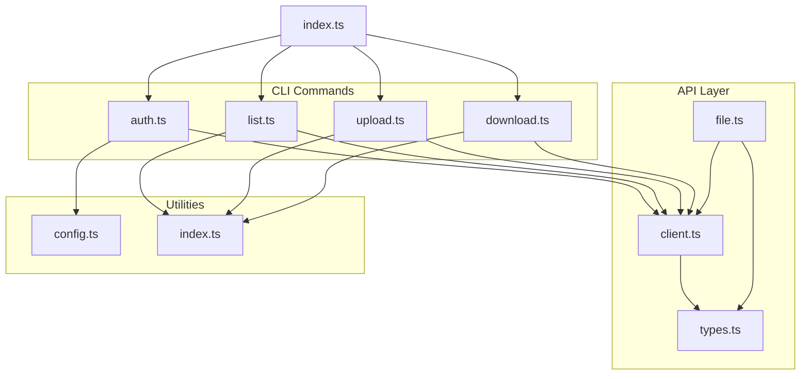
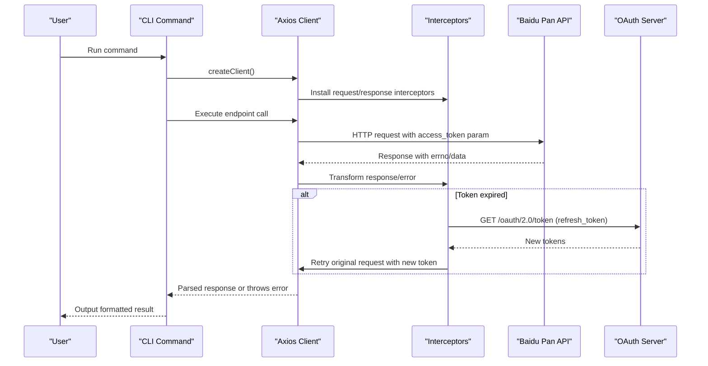
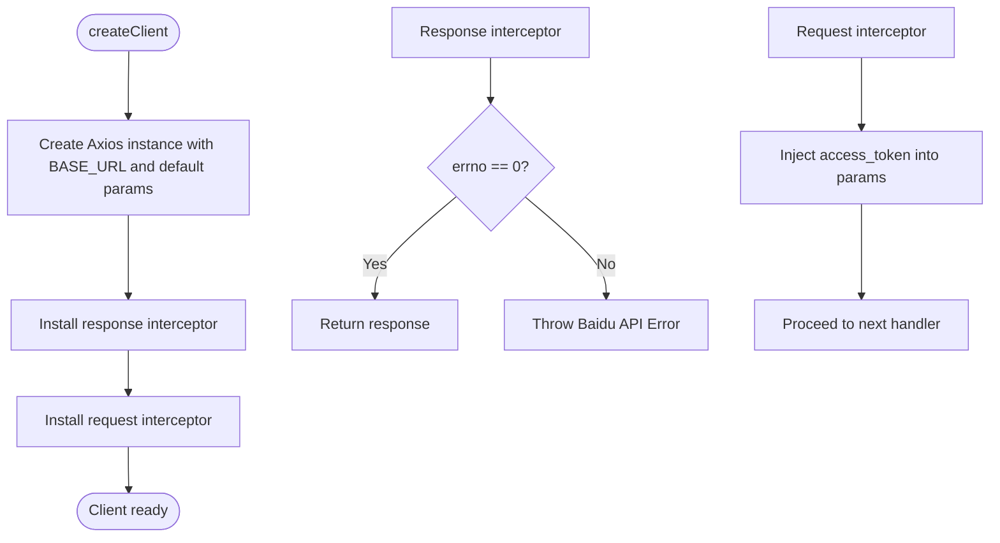
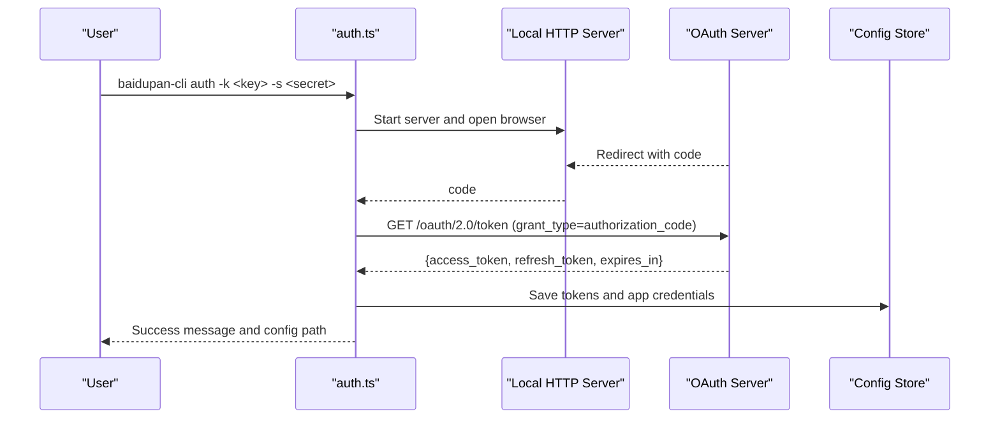
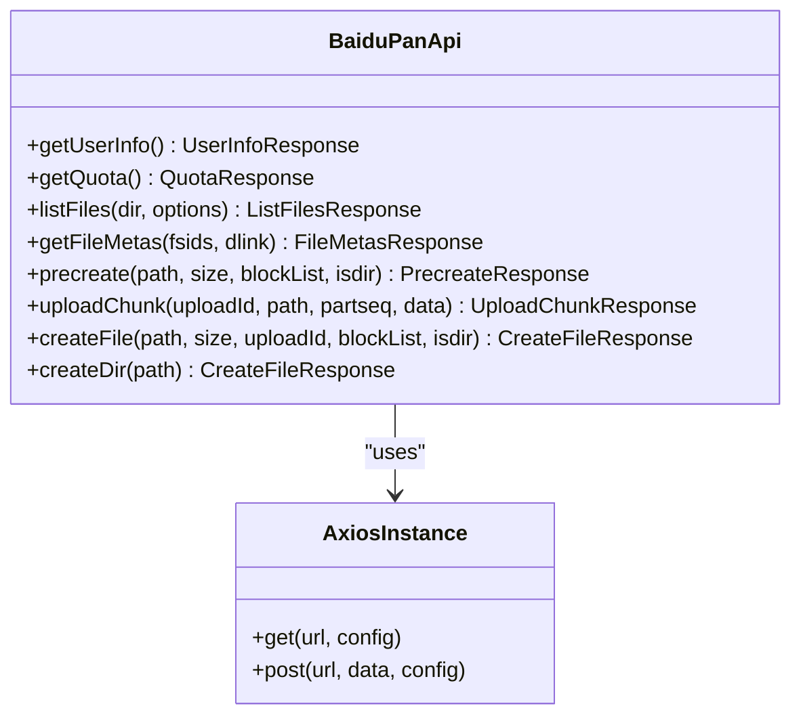
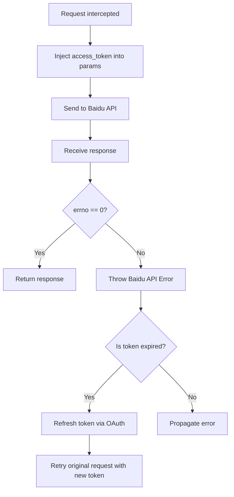
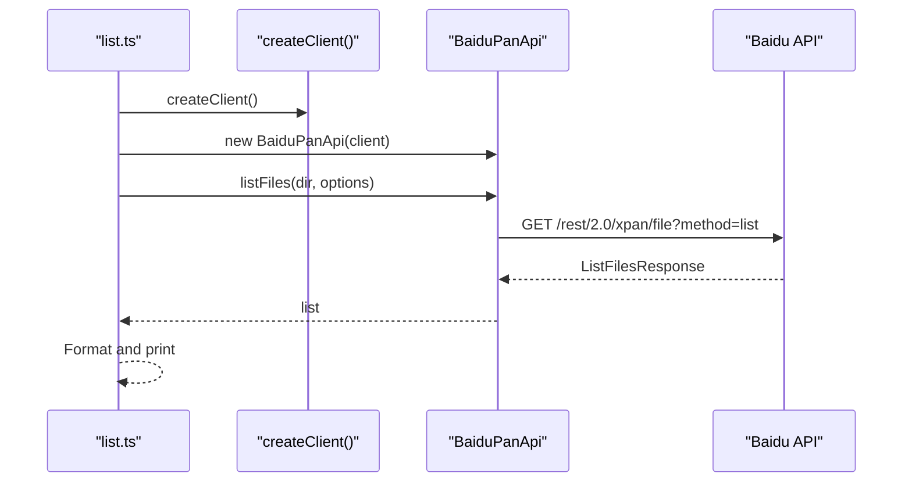
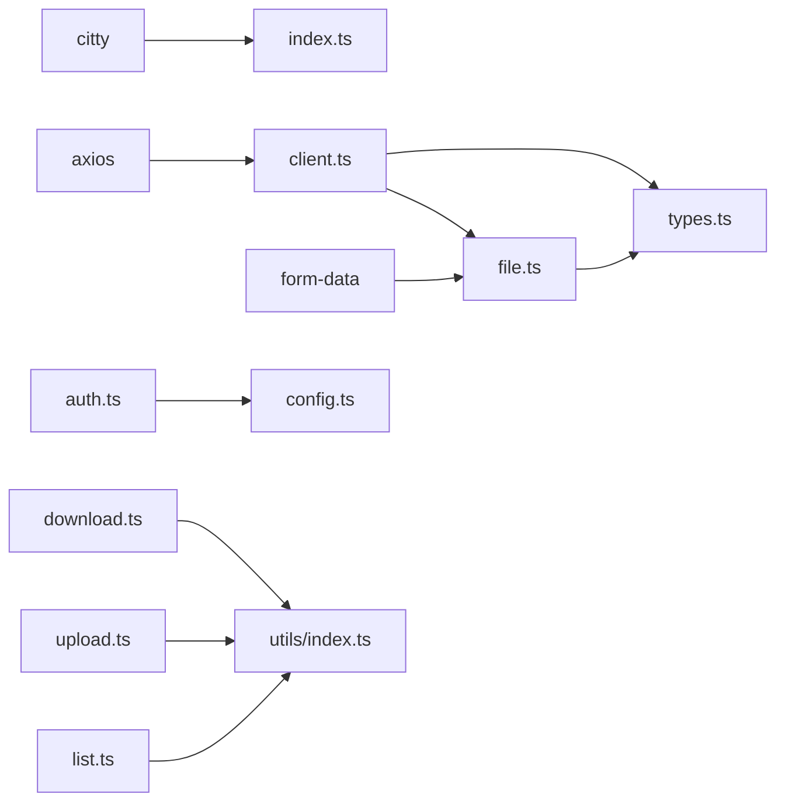

# Endpoint Communication

<cite>
**Referenced Files in This Document**
- [client.ts](file://src/api/client.ts)
- [types.ts](file://src/api/types.ts)
- [file.ts](file://src/api/file.ts)
- [config.ts](file://src/utils/config.ts)
- [auth.ts](file://src/commands/auth.ts)
- [list.ts](file://src/commands/list.ts)
- [download.ts](file://src/commands/download.ts)
- [upload.ts](file://src/commands/upload.ts)
- [index.ts](file://src/index.ts)
- [index.ts](file://src/utils/index.ts)
- [package.json](file://package.json)
</cite>

## Table of Contents
1. [Introduction](#introduction)
2. [Project Structure](#project-structure)
3. [Core Components](#core-components)
4. [Architecture Overview](#architecture-overview)
5. [Detailed Component Analysis](#detailed-component-analysis)
6. [Dependency Analysis](#dependency-analysis)
7. [Performance Considerations](#performance-considerations)
8. [Troubleshooting Guide](#troubleshooting-guide)
9. [Conclusion](#conclusion)

## Introduction
This document explains the endpoint communication patterns and API integration strategies used by the CLI tool to interact with Baidu Pan services. It covers configuration of base URLs, OAuth endpoint integration, parameter injection, request/response transformation, API versioning considerations, and endpoint-specific handling. It also provides examples for authenticated requests, handling different response formats, extending the client for new endpoints, and strategies for rate limiting and performance optimization.

## Project Structure
The CLI is organized around a small set of modules:
- API client and service abstractions for Baidu Pan endpoints
- Command-line commands that orchestrate operations
- Utilities for configuration, path normalization, and progress reporting
- OAuth authorization flow for obtaining and refreshing tokens

**Diagram sources**
- [index.ts](file://src/index.ts#L1-L26)
- [client.ts](file://src/api/client.ts#L1-L171)
- [file.ts](file://src/api/file.ts#L1-L201)
- [types.ts](file://src/api/types.ts#L1-L108)
- [config.ts](file://src/utils/config.ts#L1-L62)
- [auth.ts](file://src/commands/auth.ts#L1-L258)
- [list.ts](file://src/commands/list.ts#L1-L81)
- [download.ts](file://src/commands/download.ts#L1-L104)
- [upload.ts](file://src/commands/upload.ts#L1-L144)
- [index.ts](file://src/utils/index.ts#L1-L110)

**Section sources**
- [index.ts](file://src/index.ts#L1-L26)
- [client.ts](file://src/api/client.ts#L1-L171)
- [file.ts](file://src/api/file.ts#L1-L201)
- [types.ts](file://src/api/types.ts#L1-L108)
- [config.ts](file://src/utils/config.ts#L1-L62)
- [auth.ts](file://src/commands/auth.ts#L1-L258)
- [list.ts](file://src/commands/list.ts#L1-L81)
- [download.ts](file://src/commands/download.ts#L1-L104)
- [upload.ts](file://src/commands/upload.ts#L1-L144)
- [index.ts](file://src/utils/index.ts#L1-L110)

## Core Components
- Base URL configuration: The API client is configured with two base URLs:
  - BASE_URL for the primary Baidu Pan API
  - OPENAPI_URL for OAuth endpoints
- Token management: Access and refresh tokens are loaded from environment variables or a local config file, with automatic refresh when expired.
- Request/response transformation: Axios interceptors transform Baidu’s errno-based responses into thrown errors and retry requests after token refresh.
- Endpoint abstraction: A dedicated class encapsulates endpoint-specific calls (list, metadata, upload workflow, quotas, user info).
- OAuth integration: A local HTTP server handles OAuth callbacks, exchanges authorization codes for tokens, and persists credentials.

**Section sources**
- [client.ts](file://src/api/client.ts#L6-L171)
- [types.ts](file://src/api/types.ts#L1-L108)
- [file.ts](file://src/api/file.ts#L16-L175)
- [auth.ts](file://src/commands/auth.ts#L1-L258)
- [config.ts](file://src/utils/config.ts#L1-L62)

## Architecture Overview
The CLI composes a layered architecture:
- Command layer: Parses arguments and orchestrates operations
- API client layer: Provides authenticated Axios instances with interceptors
- Service layer: Encapsulates endpoint-specific logic
- Utility layer: Handles configuration, path normalization, and progress reporting
- OAuth layer: Manages authorization and token lifecycle

**Diagram sources**
- [client.ts](file://src/api/client.ts#L112-L161)
- [client.ts](file://src/api/client.ts#L124-L150)
- [auth.ts](file://src/commands/auth.ts#L161-L192)

## Detailed Component Analysis

### Client and Token Management
- Base URLs:
  - BASE_URL: primary API host for Baidu Pan endpoints
  - OPENAPI_URL: OAuth host for authorization and token exchange
- Token resolution:
  - Access token is prioritized from environment variables, then from the config file
  - Refresh token and app credentials are similarly resolved
- Automatic refresh:
  - On token expiration errors, the client refreshes tokens via OAuth and retries the original request
- Interceptors:
  - Response interceptor checks errno and throws descriptive errors
  - Request interceptor injects the current access_token into request params

**Diagram sources**
- [client.ts](file://src/api/client.ts#L112-L161)
- [client.ts](file://src/api/client.ts#L124-L158)

**Section sources**
- [client.ts](file://src/api/client.ts#L6-L171)
- [config.ts](file://src/utils/config.ts#L1-L62)

### OAuth Authorization Flow
- Local callback server:
  - Starts a local HTTP server to receive OAuth callbacks
  - Validates redirect path and extracts authorization code
- Authorization URL construction:
  - Uses OPENAPI_URL/oauth/2.0/authorize with client_id, redirect_uri, and scope
- Token exchange:
  - Exchanges authorization code for access/refresh tokens via OPENAPI_URL/oauth/2.0/token
  - Persists tokens and app credentials to config file
- Browser automation:
  - Attempts to open the authorization URL automatically based on platform

**Diagram sources**
- [auth.ts](file://src/commands/auth.ts#L93-L159)
- [auth.ts](file://src/commands/auth.ts#L161-L192)
- [config.ts](file://src/utils/config.ts#L35-L54)

**Section sources**
- [auth.ts](file://src/commands/auth.ts#L1-L258)
- [config.ts](file://src/utils/config.ts#L1-L62)

### Endpoint Abstraction and Versioning
- Endpoint class:
  - BaiduPanApi encapsulates endpoint-specific calls:
    - User info: /rest/2.0/xpan/nas?method=uinfo
    - Quota: /api/quota?checkfree=1&checkexpire=1
    - List files: /rest/2.0/xpan/file?method=list
    - File metadata: /rest/2.0/xpan/multimedia?method=filemetas
    - Precreate: /rest/2.0/xpan/file?method=precreate
    - Upload chunk: https://d.pcs.baidu.com/rest/2.0/pcs/superfile2?method=upload
    - Create file: /rest/2.0/xpan/file?method=create
- Versioning considerations:
  - Endpoints use explicit versioned paths (e.g., /rest/2.0/xpan/...)
  - The client sets access_token as a query parameter for all requests
- Upload workflow:
  - Precreate returns uploadid and block_list
  - Upload chunks to PCS endpoint with form data
  - Create file with uploadid and aggregated block MD5 list

**Diagram sources**
- [file.ts](file://src/api/file.ts#L16-L175)

**Section sources**
- [file.ts](file://src/api/file.ts#L1-L201)
- [types.ts](file://src/api/types.ts#L1-L108)

### Parameter Injection and Request/Response Transformation
- Parameter injection:
  - Access token injected into request params via request interceptor
  - Endpoint-specific parameters passed in query or body depending on endpoint
- Response transformation:
  - Response interceptor checks errno and throws descriptive errors
  - Token expiration triggers automatic refresh and retry
- Error mapping:
  - errno values mapped to user-friendly messages

**Diagram sources**
- [client.ts](file://src/api/client.ts#L124-L150)
- [client.ts](file://src/api/client.ts#L106-L110)
- [types.ts](file://src/api/types.ts#L99-L107)

**Section sources**
- [client.ts](file://src/api/client.ts#L106-L158)
- [types.ts](file://src/api/types.ts#L99-L107)

### Command Integration Patterns
- Listing files:
  - Creates client, constructs BaiduPanApi, lists files, prints formatted output or JSON
- Uploading files:
  - Reads local data, splits into chunks, performs precreate, uploads chunks, creates file
- Downloading files:
  - Resolves remote file, retrieves metadata with download link, downloads via direct link with access_token

**Diagram sources**
- [list.ts](file://src/commands/list.ts#L36-L79)
- [file.ts](file://src/api/file.ts#L42-L60)

**Section sources**
- [list.ts](file://src/commands/list.ts#L1-L81)
- [upload.ts](file://src/commands/upload.ts#L98-L143)
- [download.ts](file://src/commands/download.ts#L25-L101)
- [file.ts](file://src/api/file.ts#L16-L175)

### Extending the Client for New Endpoints
To add a new endpoint:
1. Define the response type in types.ts
2. Add a method to BaiduPanApi with appropriate params and headers
3. Use the existing client instance for HTTP calls
4. Handle response transformation and error propagation consistently

Example extension points:
- Add a new method in BaiduPanApi for the target endpoint
- Import the new response type from types.ts
- Use client.get/post with endpoint path and method parameters
- Rely on interceptors for token injection and error handling

**Section sources**
- [types.ts](file://src/api/types.ts#L1-L108)
- [file.ts](file://src/api/file.ts#L16-L175)
- [client.ts](file://src/api/client.ts#L112-L161)

## Dependency Analysis
- External libraries:
  - axios: HTTP client with interceptors
  - citty: CLI framework for command definitions
  - form-data: Form encoding for multipart uploads
- Internal dependencies:
  - config.ts provides token persistence and credential loading
  - utils/index.ts provides shared helpers for formatting and I/O
  - index.ts wires commands into the CLI

**Diagram sources**
- [package.json](file://package.json#L49-L52)
- [client.ts](file://src/api/client.ts#L1-L5)
- [file.ts](file://src/api/file.ts#L1-L11)
- [auth.ts](file://src/commands/auth.ts#L1-L6)
- [index.ts](file://src/index.ts#L1-L6)
- [index.ts](file://src/utils/index.ts#L1-L110)

**Section sources**
- [package.json](file://package.json#L49-L72)
- [client.ts](file://src/api/client.ts#L1-L5)
- [file.ts](file://src/api/file.ts#L1-L11)
- [auth.ts](file://src/commands/auth.ts#L1-L6)
- [index.ts](file://src/index.ts#L1-L6)
- [index.ts](file://src/utils/index.ts#L1-L110)

## Performance Considerations
- Chunked uploads:
  - Uploads use 4 MB chunks to balance throughput and memory usage
  - MD5 calculation per chunk enables fast deduplication and resume capability
- Streaming and progress:
  - Progress bars are printed during upload operations
  - Download uses streaming with progress events
- Rate limiting and throttling:
  - The codebase does not implement explicit rate limiting or throttling
  - Baidu’s “Request too frequent” error is handled as a transient condition
  - Recommendations:
    - Introduce exponential backoff on repeated 31034 errors
    - Add concurrency limits for parallel uploads
    - Cache frequently accessed metadata to reduce API calls
    - Respect server-side hints and adjust polling intervals

[No sources needed since this section provides general guidance]

## Troubleshooting Guide
Common issues and resolutions:
- Missing access token:
  - Ensure tokens are present in environment variables or config file
  - Run the auth command to obtain and persist tokens
- Token expired:
  - The client automatically refreshes tokens and retries
  - Verify app credentials and refresh token validity
- OAuth callback failures:
  - Confirm redirect URI matches the registered application
  - Ensure the local port is available and accessible
- Download failures:
  - Verify the file exists and has a valid download link
  - Check network connectivity and proxy settings
- Upload failures:
  - Validate chunk sizes and MD5 calculations
  - Confirm sufficient quota and permissions

**Section sources**
- [client.ts](file://src/api/client.ts#L15-L37)
- [client.ts](file://src/api/client.ts#L133-L149)
- [auth.ts](file://src/commands/auth.ts#L51-L63)
- [auth.ts](file://src/commands/auth.ts#L161-L192)
- [types.ts](file://src/api/types.ts#L106-L107)

## Conclusion
The CLI integrates with Baidu Pan through a clean separation of concerns: a robust client with interceptors, a typed service layer for endpoints, and a streamlined OAuth flow. The design supports versioned endpoints, automatic token refresh, and consistent error handling. Extensibility is straightforward by adding new methods to the service class and updating types. For production usage, consider adding rate limiting, retry backoff, and caching to improve reliability and performance.
