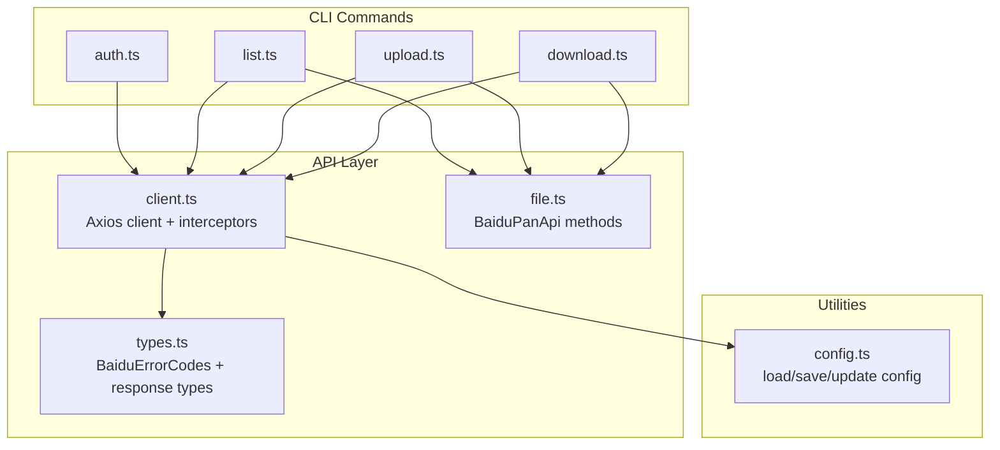
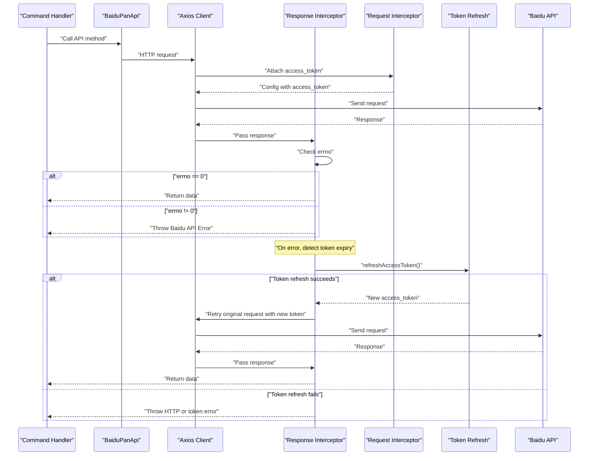
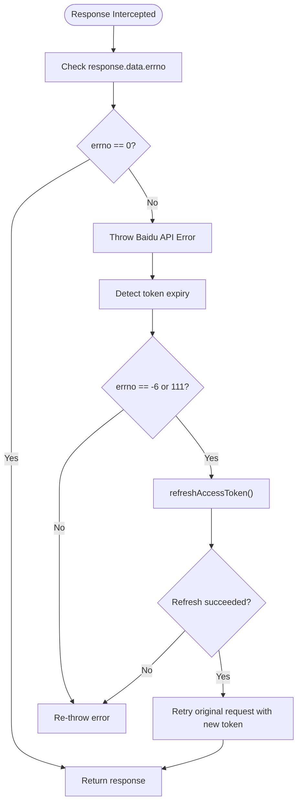
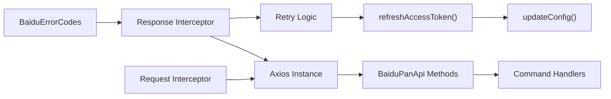

# Error Handling & Response Processing

<cite>
**Referenced Files in This Document**
- [client.ts](file://src/api/client.ts)
- [types.ts](file://src/api/types.ts)
- [file.ts](file://src/api/file.ts)
- [auth.ts](file://src/commands/auth.ts)
- [list.ts](file://src/commands/list.ts)
- [upload.ts](file://src/commands/upload.ts)
- [download.ts](file://src/commands/download.ts)
- [config.ts](file://src/utils/config.ts)
- [index.ts](file://src/index.ts)
</cite>

## Table of Contents
1. [Introduction](#introduction)
2. [Project Structure](#project-structure)
3. [Core Components](#core-components)
4. [Architecture Overview](#architecture-overview)
5. [Detailed Component Analysis](#detailed-component-analysis)
6. [Dependency Analysis](#dependency-analysis)
7. [Performance Considerations](#performance-considerations)
8. [Troubleshooting Guide](#troubleshooting-guide)
9. [Conclusion](#conclusion)

## Introduction
This document explains the error handling and response processing mechanisms in the Baidu Pan CLI. It covers:
- The BaiduErrorCodes mapping system
- Error response parsing and interpretation
- Automatic token expiration detection and retry logic
- Interceptor-based error handling and HTTP status code processing
- Practical examples of error scenarios, recovery strategies, and debugging techniques
- Patterns for handling network errors, API errors, and application-level errors

## Project Structure
The CLI is organized around a central HTTP client with Axios interceptors, typed API responses, and command handlers that wrap API calls with robust error reporting.

**Diagram sources**
- [client.ts](file://src/api/client.ts#L112-L161)
- [file.ts](file://src/api/file.ts#L16-L175)
- [types.ts](file://src/api/types.ts#L99-L108)
- [auth.ts](file://src/commands/auth.ts#L46-L91)
- [list.ts](file://src/commands/list.ts#L36-L80)
- [upload.ts](file://src/commands/upload.ts#L33-L96)
- [download.ts](file://src/commands/download.ts#L25-L103)
- [config.ts](file://src/utils/config.ts#L19-L54)

**Section sources**
- [index.ts](file://src/index.ts#L8-L23)
- [client.ts](file://src/api/client.ts#L112-L161)
- [file.ts](file://src/api/file.ts#L16-L175)
- [types.ts](file://src/api/types.ts#L99-L108)
- [config.ts](file://src/utils/config.ts#L19-L54)

## Core Components
- Central Axios client with request and response interceptors
- Typed Baidu API response model and error code mapping
- Command handlers that orchestrate API calls and surface errors
- Token lifecycle management (access/refresh) with auto-refresh and persistence

Key responsibilities:
- Parse Baidu API responses and raise structured errors for non-zero errno
- Detect token expiration and automatically refresh tokens
- Retry failed requests after token refresh
- Provide user-friendly error messages and exit codes

**Section sources**
- [client.ts](file://src/api/client.ts#L112-L161)
- [types.ts](file://src/api/types.ts#L99-L108)
- [file.ts](file://src/api/file.ts#L16-L175)
- [auth.ts](file://src/commands/auth.ts#L46-L91)

## Architecture Overview
The error handling pipeline centers on the Axios client’s response interceptor, which inspects Baidu API responses for errno and throws a standardized error. The request interceptor ensures the latest access token is attached to every outgoing request. When a token-expired error is detected, the system refreshes the token and retries the original request transparently.

**Diagram sources**
- [client.ts](file://src/api/client.ts#L124-L150)
- [client.ts](file://src/api/client.ts#L152-L158)
- [client.ts](file://src/api/client.ts#L63-L104)
- [file.ts](file://src/api/file.ts#L42-L60)

## Detailed Component Analysis

### BaiduErrorCodes Mapping System
- Purpose: Provide human-readable error messages for Baidu API errno values
- Coverage: Success, invalid token, access denied, file not found, parameter errors, token expired, rate limiting
- Usage: Response interceptor maps errno to a message and throws a descriptive error

Implementation highlights:
- Mapping stored as a record keyed by errno
- Used in response interceptor to enrich error messages

**Section sources**
- [types.ts](file://src/api/types.ts#L99-L108)
- [client.ts](file://src/api/client.ts#L127-L129)

### Error Response Parsing
- Response interceptor checks response.data.errno
- Non-zero errno triggers a standardized error with code and message
- HTTP-level errors are surfaced with status and statusText

Processing logic:
- If response.data.errno is present and non-zero, throw a Baidu API error
- If error.response exists, throw an HTTP error with status and statusText
- Otherwise, rethrow the original error

**Section sources**
- [client.ts](file://src/api/client.ts#L124-L150)

### Automatic Token Expiration Detection and Retry
- Detection: isTokenExpiredError returns true for errno -6 (invalid token) and 111 (expired)
- Refresh flow: refreshAccessToken calls the OAuth endpoint with refresh_token and saves new tokens
- Retry: On token expiry, the response interceptor retries the original request with the new access_token

**Diagram sources**
- [client.ts](file://src/api/client.ts#L106-L110)
- [client.ts](file://src/api/client.ts#L133-L149)
- [client.ts](file://src/api/client.ts#L63-L104)

**Section sources**
- [client.ts](file://src/api/client.ts#L106-L110)
- [client.ts](file://src/api/client.ts#L133-L149)
- [client.ts](file://src/api/client.ts#L63-L104)

### Interceptor-Based Error Handling
- Request interceptor: Ensures access_token is attached to every request param
- Response interceptor: Parses Baidu API responses, detects token expiry, and handles retries

Behavior:
- Request: Merge current access_token into config.params
- Response: Map errno to error, handle HTTP errors, detect token expiry, refresh and retry

**Section sources**
- [client.ts](file://src/api/client.ts#L152-L158)
- [client.ts](file://src/api/client.ts#L124-L150)

### HTTP Status Code Processing
- When error.response exists, the interceptor throws an HTTP error including status and statusText
- This distinguishes network-level failures (e.g., timeouts, DNS resolution) from API-level errors

**Section sources**
- [client.ts](file://src/api/client.ts#L145-L148)

### Command-Level Error Handling Patterns
- All commands wrap API calls in try/catch and log a user-friendly error before exiting with code 1
- Examples:
  - Authorization command validates inputs and handles OAuth server errors
  - List command prints formatted file listings or empty directory messages
  - Upload command handles stdin, directory recursion, chunked uploads, and creates files
  - Download command resolves file metadata, constructs download URLs, and writes files

**Section sources**
- [auth.ts](file://src/commands/auth.ts#L46-L91)
- [list.ts](file://src/commands/list.ts#L36-L80)
- [upload.ts](file://src/commands/upload.ts#L33-L96)
- [download.ts](file://src/commands/download.ts#L25-L103)

### Token Lifecycle Management
- Access token retrieval: Environment variables take precedence over config file
- Refresh token retrieval: Environment variables or config file
- App credentials: Environment variables or config file
- Auto-refresh: Triggered on token-expiry errors; new tokens saved to config

**Section sources**
- [client.ts](file://src/api/client.ts#L15-L44)
- [client.ts](file://src/api/client.ts#L63-L104)
- [config.ts](file://src/utils/config.ts#L19-L54)

## Dependency Analysis
The error handling mechanism depends on:
- Axios interceptors for transparent request/response processing
- BaiduErrorCodes mapping for consistent error messaging
- Token refresh flow for resilience against expiration
- Command handlers for orchestrating API calls and surfacing errors

**Diagram sources**
- [types.ts](file://src/api/types.ts#L99-L108)
- [client.ts](file://src/api/client.ts#L124-L150)
- [client.ts](file://src/api/client.ts#L63-L104)
- [config.ts](file://src/utils/config.ts#L50-L54)
- [file.ts](file://src/api/file.ts#L16-L175)
- [list.ts](file://src/commands/list.ts#L36-L80)

**Section sources**
- [client.ts](file://src/api/client.ts#L112-L161)
- [types.ts](file://src/api/types.ts#L99-L108)
- [config.ts](file://src/utils/config.ts#L50-L54)
- [file.ts](file://src/api/file.ts#L16-L175)

## Performance Considerations
- Token refresh is performed only on detected token expiry to minimize overhead
- Requests are retried once with a fresh token; subsequent failures are surfaced immediately
- Network timeouts are configured at the client level to prevent hanging requests
- Chunked uploads leverage streaming and MD5 computation; ensure adequate memory for large files

[No sources needed since this section provides general guidance]

## Troubleshooting Guide

Common error scenarios and recovery strategies:
- Invalid access token or expired token
  - Symptom: Baidu API error with errno -6 or 111
  - Recovery: Auto-refresh and retry; if refresh fails, re-authenticate using the authorization command
  - Evidence: Response interceptor detects token expiry and invokes refreshAccessToken()

- API error with known errno
  - Symptom: Baidu API error mapped to a specific message
  - Recovery: Inspect errno mapping and adjust parameters or permissions accordingly
  - Evidence: Response interceptor throws a Baidu API error with errno and message

- HTTP error (network-level)
  - Symptom: HTTP status and statusText in error
  - Recovery: Check connectivity, proxy settings, and service availability
  - Evidence: Response interceptor throws HTTP error when error.response exists

- Missing access token at startup
  - Symptom: Immediate exit with guidance to authenticate
  - Recovery: Run the authorization command to obtain tokens
  - Evidence: Access token retrieval logs an error and exits when missing

- Authorization failure during OAuth
  - Symptom: Authorization server returns an error parameter
  - Recovery: Verify app credentials, redirect URI, and browser launch
  - Evidence: Authorization command handles error query parameter and exits with error

Debugging techniques:
- Enable verbose logging in commands to trace request/response flow
- Inspect errno mapping to understand API error causes
- Manually trigger token refresh by invoking the refresh flow
- Verify configuration file permissions and content
- Use network debugging tools to inspect request headers and body

**Section sources**
- [client.ts](file://src/api/client.ts#L106-L110)
- [client.ts](file://src/api/client.ts#L127-L129)
- [client.ts](file://src/api/client.ts#L145-L148)
- [client.ts](file://src/api/client.ts#L34-L37)
- [auth.ts](file://src/commands/auth.ts#L98-L108)
- [auth.ts](file://src/commands/auth.ts#L182-L189)

## Conclusion
The CLI implements a robust, interceptor-driven error handling system that:
- Parses Baidu API responses and maps errno to actionable messages
- Automatically detects token expiration and refreshes tokens transparently
- Retries failed requests once with renewed credentials
- Surfaces clear, user-friendly errors at the command level
- Provides practical recovery strategies and debugging guidance

This design minimizes manual error handling in command code while ensuring consistent, resilient behavior across network and API failures.
