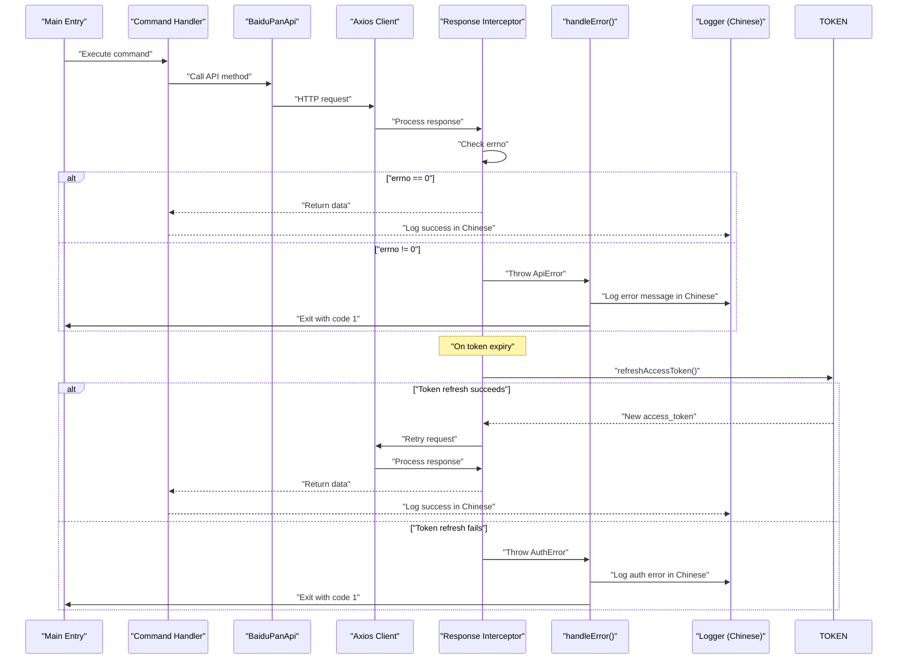
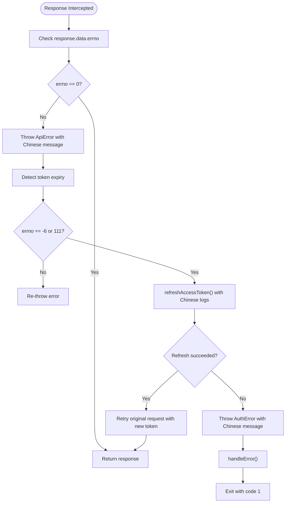
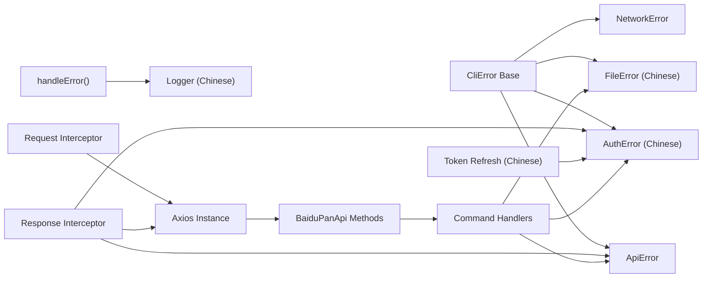

# Error Handling & Response Processing

<cite>
**Referenced Files in This Document**
- [index.ts](file://src/index.ts)
- [client.ts](file://src/api/client.ts)
- [types.ts](file://src/api/types.ts)
- [token.ts](file://src/api/token.ts)
- [file.ts](file://src/api/file.ts)
- [auth.ts](file://src/commands/auth.ts)
- [list.ts](file://src/commands/list.ts)
- [upload.ts](file://src/commands/upload.ts)
- [download.ts](file://src/commands/download.ts)
- [config.ts](file://src/utils/config.ts)
- [index.ts](file://src/errors/index.ts)
- [types.ts](file://src/errors/types.ts)
- [logger.ts](file://src/logger.ts)
</cite>

## Update Summary
**Changes Made**
- Enhanced API error handling with improved token expiration detection and automatic token refresh
- Added comprehensive Chinese error messages and standardized logging through unified logger interface
- Implemented intelligent retry logic for expired tokens with proper error propagation
- Updated error handling architecture to use specialized error classes (CliError, AuthError, ApiError, FileError, NetworkError)
- Integrated centralized error handling with structured exit codes and descriptive messages

## Table of Contents
1. [Introduction](#introduction)
2. [Project Structure](#project-structure)
3. [Core Components](#core-components)
4. [Architecture Overview](#architecture-overview)
5. [Detailed Component Analysis](#detailed-component-analysis)
6. [Dependency Analysis](#dependency-analysis)
7. [Performance Considerations](#performance-considerations)
8. [Troubleshooting Guide](#troubleshooting-guide)
9. [Conclusion](#conclusion)

## Introduction
This document explains the comprehensive error handling and response processing mechanisms in the Baidu Pan CLI. The system has been redesigned with specialized error classes and structured error reporting, featuring enhanced Chinese error messages and standardized logging through a unified logger interface. It covers:
- Specialized error classes (CliError, AuthError, ApiError, FileError, NetworkError)
- Structured error reporting with appropriate exit codes and descriptive messages
- The BaiduErrorCodes mapping system with Chinese error descriptions
- Error response parsing and interpretation
- Automatic token expiration detection and intelligent retry logic
- Interceptor-based error handling and HTTP status code processing
- Practical examples of error scenarios, recovery strategies, and debugging techniques
- Patterns for handling network errors, API errors, and application-level errors

## Project Structure
The CLI now features a centralized error handling system with specialized error classes and structured reporting. The architecture centers around a unified error handling mechanism that processes all errors consistently across the application with comprehensive Chinese error messages.

```mermaid
graph TB
subgraph "Error Handling System"
ERRORBASE["errors/types.ts<br/>CliError, AuthError, ApiError, FileError, NetworkError"]
HANDLE["errors/index.ts<br/>handleError()"]
LOGGER["logger.ts<br/>Consola logger with Chinese messages"]
END
subgraph "CLI Commands"
AUTH["auth.ts<br/>AuthError usage with Chinese messages"]
LIST["list.ts<br/>API calls"]
UPLOAD["upload.ts<br/>FileError usage with Chinese messages"]
DOWNLOAD["download.ts<br/>FileError usage with Chinese messages"]
END
subgraph "API Layer"
CLIENT["client.ts<br/>Axios client + interceptors"]
TOKEN["token.ts<br/>TokenManager with AuthError + Chinese logs"]
FILEAPI["file.ts<br/>BaiduPanApi methods"]
TYPES["types.ts<br/>BaiduErrorCodes + response types"]
END
subgraph "Utilities"
CONFIG["config.ts<br/>load/save/update config"]
MAIN["index.ts<br/>Global error handler"]
END
ERRORBASE --> HANDLE
HANDLE --> LOGGER
HANDLE --> MAIN
AUTH --> ERRORBASE
UPLOAD --> ERRORBASE
DOWNLOAD --> ERRORBASE
CLIENT --> ERRORBASE
TOKEN --> ERRORBASE
CLIENT --> TOKEN
CLIENT --> TYPES
AUTH --> CLIENT
UPLOAD --> CLIENT
DOWNLOAD --> CLIENT
LIST --> CLIENT
```

**Diagram sources**
- [index.ts](file://src/errors/index.ts#L7-L20)
- [types.ts](file://src/errors/types.ts#L4-L55)
- [client.ts](file://src/api/client.ts#L20-L47)
- [token.ts](file://src/api/token.ts#L15-L135)
- [auth.ts](file://src/commands/auth.ts#L45-L85)
- [upload.ts](file://src/commands/upload.ts#L61-L98)
- [download.ts](file://src/commands/download.ts#L53-L156)
- [index.ts](file://src/index.ts#L8-L48)

**Section sources**
- [index.ts](file://src/index.ts#L1-L49)
- [index.ts](file://src/errors/index.ts#L1-L23)
- [types.ts](file://src/errors/types.ts#L1-L56)

## Core Components
The error handling system is built around five specialized error classes that inherit from a common base class, all with comprehensive Chinese error messages:

- **CliError**: Base error class with exit code support
- **AuthError**: Authentication-related errors with exit code 1 and Chinese error messages
- **ApiError**: Baidu API-related errors with errno support and exit code 1
- **FileError**: File operation-related errors with exit code 1
- **NetworkError**: Network-related errors with exit code 1

Key responsibilities:
- Centralized error handling with structured exit codes
- Specialized error classes for different error categories with Chinese messages
- Automatic error propagation and consistent error messages
- Token expiration detection and automatic refresh with Chinese logging
- Unified error reporting across all command handlers with standardized logging

**Section sources**
- [types.ts](file://src/errors/types.ts#L4-L55)
- [index.ts](file://src/errors/index.ts#L7-L20)
- [client.ts](file://src/api/client.ts#L20-L47)

## Architecture Overview
The error handling pipeline has been redesigned with a centralized approach using a unified logger interface. All errors are processed through the `handleError()` function which determines the appropriate exit code and logging strategy. The system now uses specialized error classes that provide structured error information and consistent exit codes with comprehensive Chinese error messages.



**Diagram sources**
- [client.ts](file://src/api/client.ts#L20-L47)
- [client.ts](file://src/api/client.ts#L32-L40)
- [token.ts](file://src/api/token.ts#L78-L118)
- [index.ts](file://src/errors/index.ts#L7-L20)

## Detailed Component Analysis

### Specialized Error Classes Architecture
The new error handling system introduces five specialized error classes that provide structured error information with comprehensive Chinese error messages:

- **CliError**: Base class with customizable exit codes
- **AuthError**: Authentication failures with exit code 1 and Chinese error messages
- **ApiError**: Baidu API errors with errno and exit code 1
- **FileError**: File operation errors with exit code 1
- **NetworkError**: Network-related errors with exit code 1

Each error class provides:
- Descriptive error messages in Chinese
- Appropriate exit codes for different error categories
- Type-specific information (e.g., errno for API errors)
- Consistent error handling across the application with standardized logging

**Section sources**
- [types.ts](file://src/errors/types.ts#L4-L55)

### Centralized Error Handling
The `handleError()` function serves as the central error processing mechanism with standardized logging:

```typescript
export function handleError(error: unknown): never {
  if (error instanceof CliError) {
    logger.error(error.message)
    process.exit(error.exitCode)
  }

  if (error instanceof Error) {
    logger.error(error.message)
    process.exit(1)
  }

  logger.error(String(error))
  process.exit(1)
}
```

This function:
- Handles specialized error classes with their custom exit codes
- Falls back to generic error handling for unexpected errors
- Uses structured logging for consistent error reporting
- Ensures proper process termination with appropriate exit codes

**Section sources**
- [index.ts](file://src/errors/index.ts#L7-L20)

### Enhanced Token Expiration Handling with Chinese Logging
The token management system now uses specialized error classes for better error reporting with comprehensive Chinese error messages:

- **AuthError** is thrown when access tokens are not found with Chinese error message
- **AuthError** is thrown when token refresh fails with Chinese error message
- **ApiError** is thrown for Baidu API errors during token refresh
- **Chinese logging** throughout the token refresh process

The token manager provides:
- Automatic token refresh on expiration with Chinese log messages
- Proper error propagation with descriptive messages in Chinese
- Config file updates on successful token refresh with Chinese success message
- Graceful fallback for authentication failures with Chinese guidance

**Section sources**
- [token.ts](file://src/api/token.ts#L41-L43)
- [token.ts](file://src/api/token.ts#L111-L113)
- [token.ts](file://src/api/token.ts#L84-L85)
- [token.ts](file://src/api/token.ts#L106-L107)

### BaiduErrorCodes Mapping System with Chinese Messages
The BaiduErrorCodes mapping system provides comprehensive Chinese error messages for Baidu API errno values:

- **Purpose**: Provide human-readable Chinese error messages for Baidu API errno values
- **Coverage**: Success, invalid token, access denied, file not found, parameter errors, token expired, rate limiting
- **Usage**: Response interceptor maps errno to a Chinese message and throws a structured ApiError

Implementation highlights:
- Mapping stored as a record keyed by errno with Chinese messages
- Used in response interceptor to enrich error messages with Chinese descriptions
- Integrated with the new ApiError class for structured error reporting

**Section sources**
- [types.ts](file://src/api/types.ts#L93-L101)
- [client.ts](file://src/api/client.ts#L38-L39)

### Error Response Parsing with Structured Errors
The response interceptor now throws specialized error classes with comprehensive Chinese error messages:

- **ApiError**: Thrown for Baidu API errors with errno and Chinese descriptive messages
- **ApiError**: Thrown for HTTP errors with status and statusText
- **AuthError**: Thrown for authentication-related failures

Processing logic:
- If response.data.errno is present and non-zero, throw a structured ApiError with Chinese error message
- If error.response exists, throw a structured ApiError with HTTP status
- Otherwise, rethrow the original error for generic handling

**Section sources**
- [client.ts](file://src/api/client.ts#L26-L40)
- [client.ts](file://src/api/client.ts#L45-L47)

### Automatic Token Expiration Detection and Intelligent Retry
Enhanced token expiration detection with improved error handling and Chinese logging:

- **Detection**: isTokenExpiredError returns true for errno -6 (invalid token) and 111 (expired)
- **Refresh Flow**: refreshAccessToken calls the OAuth endpoint with refresh_token and saves new tokens with Chinese logging
- **Retry Logic**: On token expiry, the response interceptor retries the original request with the new access_token
- **Error Propagation**: Proper error handling for refresh failures using AuthError with Chinese error messages



**Diagram sources**
- [client.ts](file://src/api/client.ts#L32-L40)
- [token.ts](file://src/api/token.ts#L78-L118)
- [index.ts](file://src/errors/index.ts#L7-L20)

**Section sources**
- [client.ts](file://src/api/client.ts#L32-L40)
- [token.ts](file://src/api/token.ts#L67-L71)
- [token.ts](file://src/api/token.ts#L76-L118)

### Interceptor-Based Error Handling with Specialized Classes
Enhanced interceptor-based error handling now uses specialized error classes with Chinese error messages:

- **Request interceptor**: Ensures access_token is attached to every request param
- **Response interceptor**: Parses Baidu API responses, detects token expiry, and handles retries with structured error reporting and Chinese error messages

Behavior:
- Request: Merge current access_token into config.params
- Response: Map errno to ApiError with Chinese messages, handle HTTP errors, detect token expiry, refresh and retry with proper error propagation

**Section sources**
- [client.ts](file://src/api/client.ts#L52-L57)
- [client.ts](file://src/api/client.ts#L20-L50)

### HTTP Status Code Processing with Structured Errors
Enhanced HTTP status code processing with Chinese error messages:

- When error.response exists, the interceptor throws a structured ApiError including status and statusText
- This distinguishes network-level failures (e.g., timeouts, DNS resolution) from API-level errors
- Uses the new ApiError class for consistent error reporting with Chinese error messages

**Section sources**
- [client.ts](file://src/api/client.ts#L45-L47)

### Command-Level Error Handling with Specialized Classes
All commands now use specialized error classes for better error reporting with comprehensive Chinese error messages:

- **AuthError**: Authorization command validates inputs and handles OAuth server errors with Chinese error messages
- **FileError**: Upload and download commands handle file operation errors with Chinese error messages
- **ApiError**: All API calls throw structured errors for Baidu API failures

Examples:
- Authorization command validates inputs and handles OAuth server errors with AuthError and Chinese guidance
- Upload command handles stdin, directory recursion, chunked uploads, and creates files with FileError and Chinese progress messages
- Download command resolves file metadata, constructs download URLs, and writes files with FileError and Chinese download messages

**Section sources**
- [auth.ts](file://src/commands/auth.ts#L45-L85)
- [upload.ts](file://src/commands/upload.ts#L61-L98)
- [download.ts](file://src/commands/download.ts#L53-L156)

### Token Lifecycle Management with Enhanced Error Handling
Enhanced token lifecycle management with proper error reporting and Chinese logging:

- **Access token retrieval**: Environment variables take precedence over config file, with AuthError for missing tokens and Chinese error message
- **Refresh token retrieval**: Environment variables or config file, with AuthError for missing refresh tokens and Chinese error message
- **App credentials**: Environment variables or config file, with AuthError for missing credentials and Chinese error message
- **Auto-refresh**: Triggered on token-expiry errors; new tokens saved to config with Chinese success message
- **Error propagation**: Token refresh failures are handled with descriptive AuthError messages in Chinese

**Section sources**
- [token.ts](file://src/api/token.ts#L22-L44)
- [token.ts](file://src/api/token.ts#L76-L118)
- [config.ts](file://src/utils/config.ts#L19-L54)

## Dependency Analysis
The enhanced error handling mechanism depends on:
- Specialized error classes for structured error reporting with Chinese messages
- Centralized error handling with appropriate exit codes
- Axios interceptors for transparent request/response processing
- BaiduErrorCodes mapping for consistent Chinese error messaging
- Token refresh flow for resilience against expiration with Chinese logging
- Command handlers for orchestrating API calls and surfacing errors



**Diagram sources**
- [types.ts](file://src/errors/types.ts#L4-L55)
- [index.ts](file://src/errors/index.ts#L7-L20)
- [client.ts](file://src/api/client.ts#L20-L50)
- [token.ts](file://src/api/token.ts#L76-L118)
- [auth.ts](file://src/commands/auth.ts#L45-L85)
- [upload.ts](file://src/commands/upload.ts#L61-L98)
- [download.ts](file://src/commands/download.ts#L53-L156)

**Section sources**
- [index.ts](file://src/errors/index.ts#L1-L23)
- [types.ts](file://src/errors/types.ts#L1-L56)
- [client.ts](file://src/api/client.ts#L1-L72)
- [token.ts](file://src/api/token.ts#L1-L135)

## Performance Considerations
- Token refresh is performed only on detected token expiry to minimize overhead
- Requests are retried once with a fresh token; subsequent failures are surfaced immediately
- Network timeouts are configured at the client level to prevent hanging requests
- Chunked uploads leverage streaming and MD5 computation; ensure adequate memory for large files
- Specialized error classes provide efficient error type checking without performance overhead
- Centralized error handling reduces code duplication across command handlers
- Chinese logging messages have minimal performance impact compared to internationalization libraries

## Troubleshooting Guide

Common error scenarios and recovery strategies with enhanced error reporting and Chinese messages:

### Specialized Error Categories
- **AuthError**: Authentication failures with exit code 1 and Chinese error messages
  - Symptom: Access token not found or authentication failures with Chinese guidance
  - Recovery: Run authorization command to obtain tokens
  - Evidence: AuthError thrown with descriptive Chinese message and exit code 1

- **ApiError**: Baidu API errors with errno and exit code 1
  - Symptom: Baidu API error with specific errno
  - Recovery: Inspect errno mapping and adjust parameters or permissions
  - Evidence: ApiError thrown with errno and Chinese descriptive message

- **FileError**: File operation errors with exit code 1 and Chinese error messages
  - Symptom: File not found, permission issues, or file system errors with Chinese messages
  - Recovery: Verify file paths, permissions, and disk space
  - Evidence: FileError thrown for upload/download operations with Chinese messages

- **NetworkError**: Network-related errors with exit code 1
  - Symptom: Connection timeouts, DNS resolution failures, or network unreachable
  - Recovery: Check network connectivity and proxy settings
  - Evidence: NetworkError thrown for network-level failures

### Enhanced Error Scenarios
- **Invalid access token or expired token**
  - Symptom: Baidu API error with errno -6 or 111
  - Recovery: Auto-refresh and retry with Chinese logging; if refresh fails, re-authenticate using the authorization command
  - Evidence: Response interceptor detects token expiry and invokes refreshAccessToken() with Chinese log messages

- **API error with known errno**
  - Symptom: Baidu API error mapped to a specific Chinese message
  - Recovery: Inspect errno mapping and adjust parameters or permissions accordingly
  - Evidence: Response interceptor throws structured ApiError with errno and Chinese message

- **HTTP error (network-level)**
  - Symptom: HTTP status and statusText in error
  - Recovery: Check connectivity, proxy settings, and service availability
  - Evidence: Response interceptor throws structured ApiError when error.response exists

- **Missing access token at startup**
  - Symptom: Immediate exit with AuthError and Chinese guidance to authenticate
  - Recovery: Run the authorization command to obtain tokens
  - Evidence: Access token retrieval throws AuthError with Chinese message and exits with code 1

- **Authorization failure during OAuth**
  - Symptom: Authorization server returns an error parameter
  - Recovery: Verify app credentials, redirect URI, and browser launch
  - Evidence: Authorization command handles error query parameter with AuthError and Chinese error message

### Debugging Techniques with Enhanced Error Reporting
- Enable verbose logging in commands to trace request/response flow with Chinese messages
- Inspect errno mapping to understand API error causes with Chinese descriptions
- Use structured error messages to identify error categories quickly with Chinese error messages
- Monitor exit codes to determine error severity (exit code 1 for most errors)
- Manually trigger token refresh by invoking the refresh flow with Chinese logging
- Verify configuration file permissions and content
- Use network debugging tools to inspect request headers and body
- Check specialized error class names to understand error types
- Review Chinese log messages for detailed error context and recovery guidance

**Section sources**
- [types.ts](file://src/errors/types.ts#L4-L55)
- [index.ts](file://src/errors/index.ts#L7-L20)
- [client.ts](file://src/api/client.ts#L32-L40)
- [client.ts](file://src/api/client.ts#L45-L47)
- [token.ts](file://src/api/token.ts#L41-L43)
- [auth.ts](file://src/commands/auth.ts#L78-L85)
- [upload.ts](file://src/commands/upload.ts#L61-L62)
- [download.ts](file://src/commands/download.ts#L53-L54)

## Conclusion
The CLI now implements a comprehensive, interceptor-driven error handling system with specialized error classes that provides:

- **Structured Error Reporting**: Five specialized error classes (CliError, AuthError, ApiError, FileError, NetworkError) with appropriate exit codes
- **Centralized Error Handling**: Unified error processing through handleError() function with consistent exit codes
- **Enhanced Token Management**: Improved token expiration detection with proper error propagation using AuthError and Chinese logging
- **Robust API Error Handling**: Structured ApiError instances with errno support for Baidu API failures
- **Specialized File Operations**: Dedicated FileError class for file operation failures with Chinese error messages
- **Network Error Support**: NetworkError class for network-related failures
- **Comprehensive Chinese Error Messages**: Descriptive error messages with proper categorization in Chinese
- **Standardized Logging Interface**: Unified logger with Chinese messages for consistent error reporting
- **Improved Debugging**: Better error classification and exit codes for easier troubleshooting with Chinese guidance
- **Intelligent Retry Logic**: Automatic token refresh with proper error handling and Chinese logging

This redesign provides better error reporting, more consistent error handling across the application, and improved user experience through structured error messages and appropriate exit codes. The system maintains backward compatibility while providing a more robust foundation for error handling in the Baidu Pan CLI with comprehensive Chinese error messages and standardized logging.
