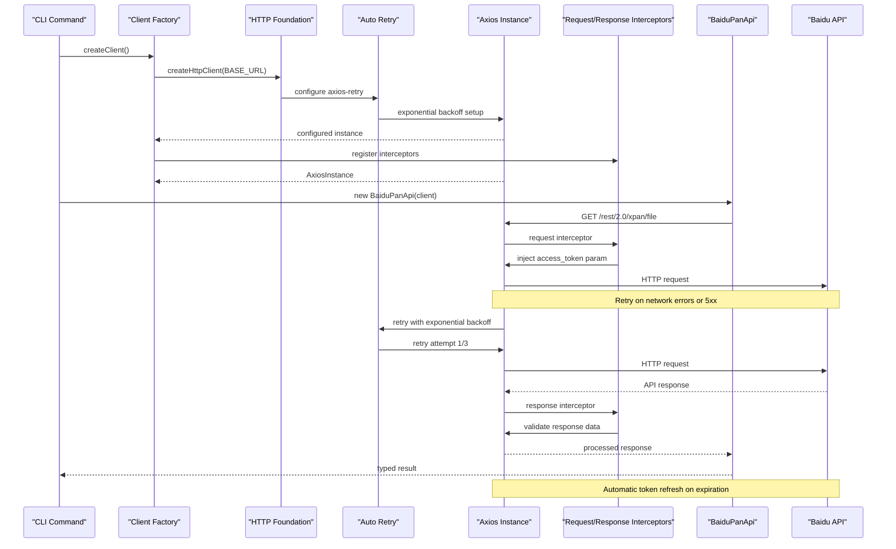
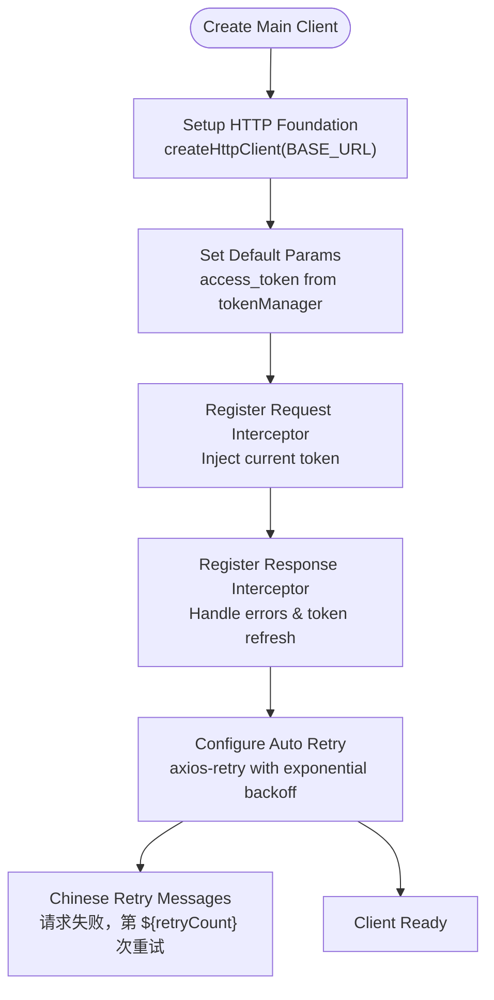
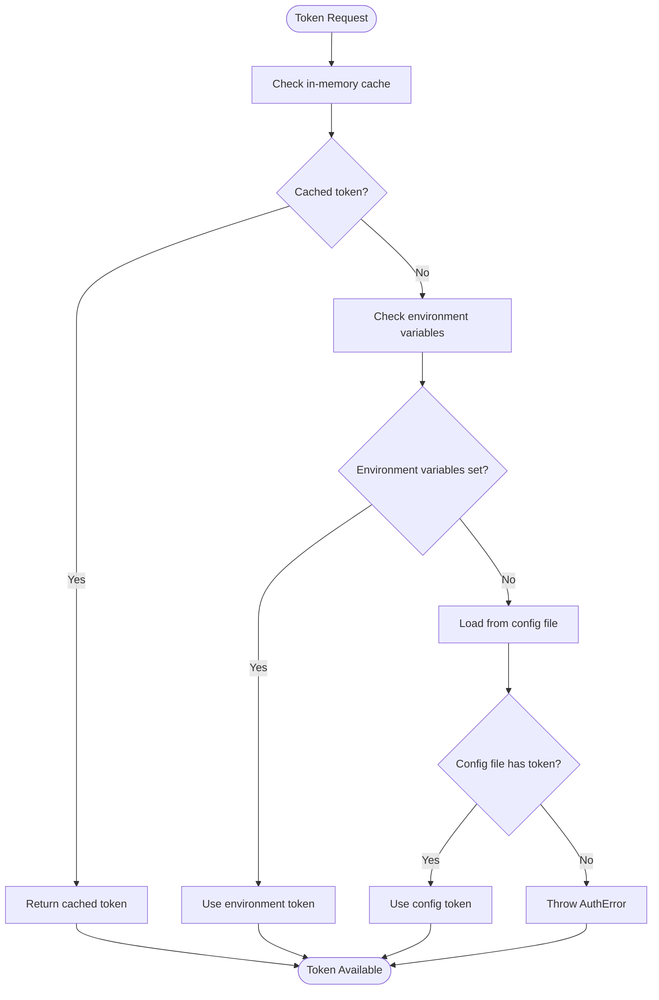
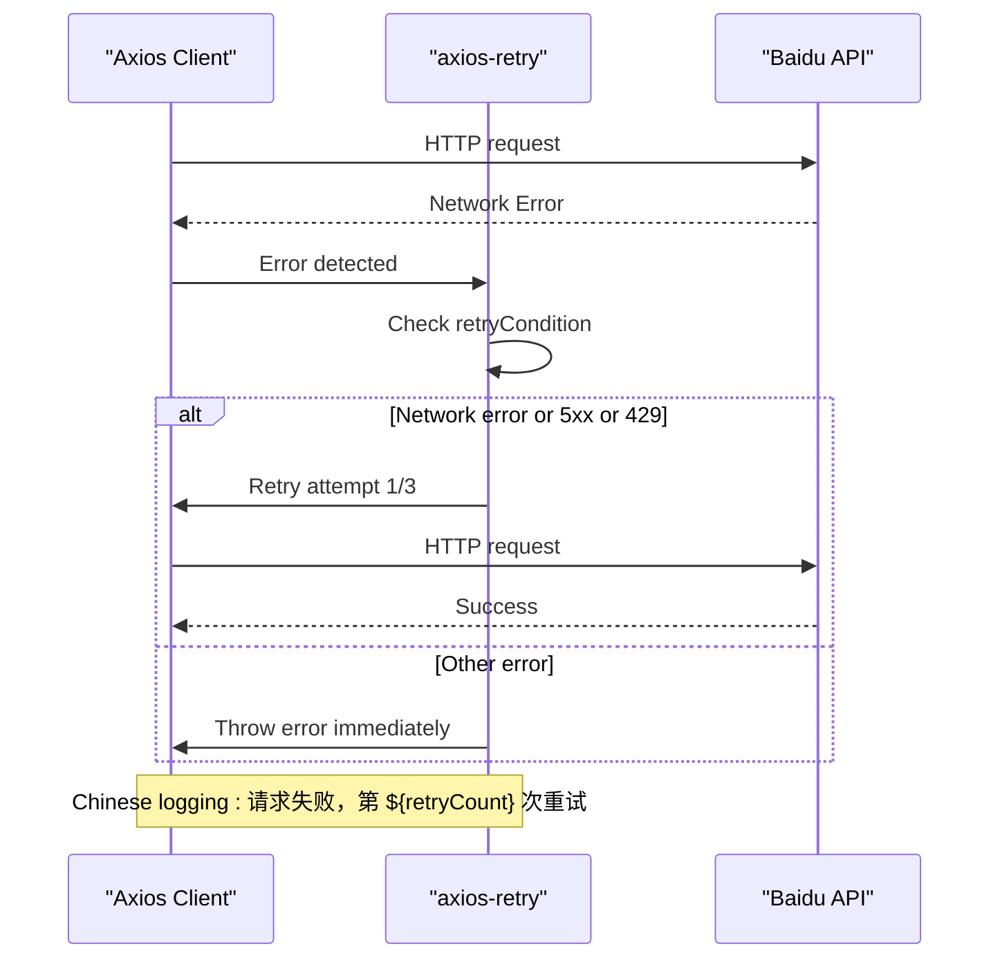
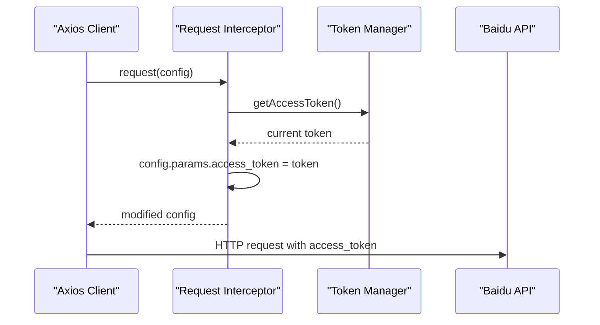
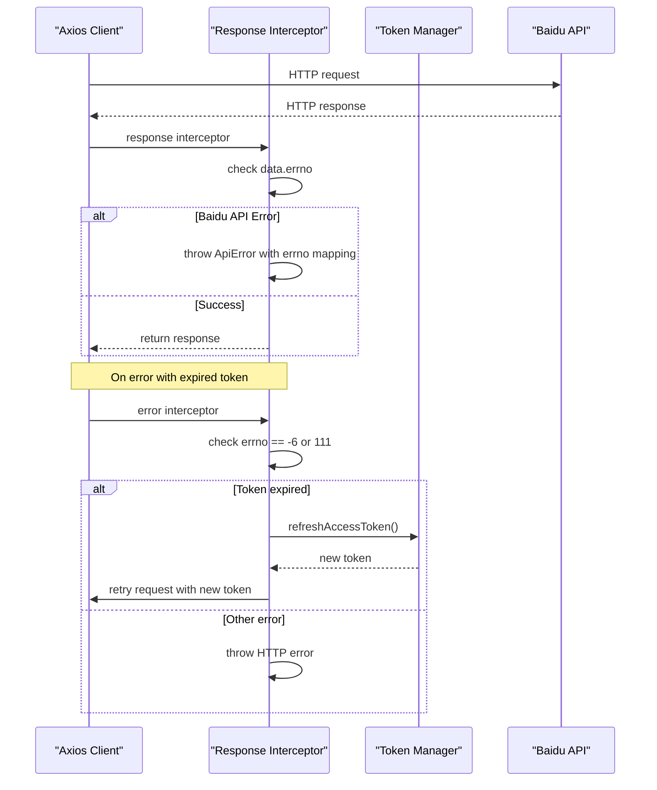
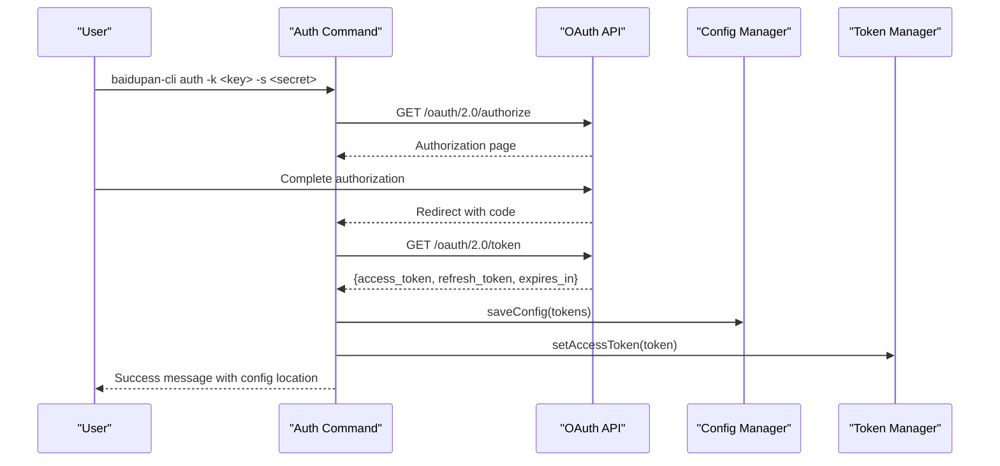
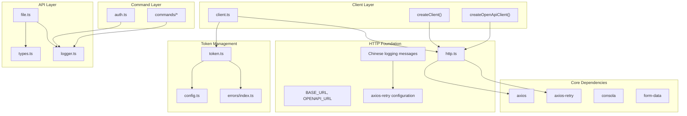

# HTTP Client Architecture

<cite>
**Referenced Files in This Document**
- [http.ts](file://src/api/http.ts)
- [client.ts](file://src/api/client.ts)
- [token.ts](file://src/api/token.ts)
- [config.ts](file://src/utils/config.ts)
- [types.ts](file://src/api/types.ts)
- [file.ts](file://src/api/file.ts)
- [auth.ts](file://src/commands/auth.ts)
- [download.ts](file://src/commands/download.ts)
- [upload.ts](file://src/commands/upload.ts)
- [list.ts](file://src/commands/list.ts)
- [index.ts](file://src/index.ts)
- [errors/index.ts](file://src/errors/index.ts)
- [logger.ts](file://src/logger.ts)
- [package.json](file://package.json)
</cite>

## Update Summary
**Changes Made**
- Enhanced HTTP retry logging with Chinese messages like '请求失败，第 ${retryCount} 次重试'
- Improved error handling and logging consistency across the HTTP client layer
- Unified Chinese messaging for retry attempts and error tracking
- Maintained dual-language approach with English fallback for createHttpClient function

## Table of Contents
1. [Introduction](#introduction)
2. [Project Structure](#project-structure)
3. [Core Components](#core-components)
4. [Architecture Overview](#architecture-overview)
5. [Detailed Component Analysis](#detailed-component-analysis)
6. [Dependency Analysis](#dependency-analysis)
7. [Performance Considerations](#performance-considerations)
8. [Troubleshooting Guide](#troubleshooting-guide)
9. [Conclusion](#conclusion)

## Introduction
This document provides comprehensive documentation for the HTTP client architecture implementation used by the Baidu Pan CLI tool. The architecture centers around a major architectural enhancement with a new HTTP client foundation featuring centralized axios configuration with automatic retry mechanisms powered by axios-retry. The implementation now includes exponential backoff retry logic for network errors, 5xx responses, and rate limiting scenarios, providing robust error recovery and improved reliability for API operations.

**Updated** Enhanced with unified Chinese logging for retry attempts and improved error handling consistency across the HTTP client layer.

## Project Structure
The HTTP client architecture is organized across several key modules with a new centralized HTTP foundation:

```mermaid
graph TB
subgraph "HTTP Foundation Layer"
HttpFoundation["HTTP Foundation<br/>(http.ts)"]
RetryMechanism["Auto Retry Mechanism<br/>(axios-retry)"]
BaseConfig["Base Configuration<br/>(BASE_URL, OPENAPI_URL)"]
ChineseLogging["Chinese Logging<br/>(请求失败，第 ${retryCount} 次重试)"]
end
subgraph "Client Layer"
ClientFactory["Client Factory<br/>(client.ts)"]
MainClient["Main API Client<br/>(createClient)"]
OAuthClient["OAuth Client<br/>(createOpenApiClient)"]
end
subgraph "Token Management"
TokenManager["Token Manager<br/>(token.ts)"]
TokenStorage["Token Storage<br/>(config.ts)"]
ErrorHandling["Error Handling<br/>(errors/index.ts)"]
end
subgraph "API Abstraction"
BaiduPanApi["BaiduPanApi Class<br/>(file.ts)"]
TypeDefinitions["Type Definitions<br/>(types.ts)"]
end
subgraph "Command Layer"
AuthCmd["OAuth Authentication<br/>(auth.ts)"]
ListCmd["File Listing<br/>(list.ts)"]
UploadCmd["File Upload<br/>(upload.ts)"]
DownloadCmd["File Download<br/>(download.ts)"]
end
subgraph "Application Layer"
Logger["Structured Logging<br/>(logger.ts)"]
EntryPoint["Main Entry Point<br/>(index.ts)"]
End
HttpFoundation --> ClientFactory
ClientFactory --> MainClient
ClientFactory --> OAuthClient
ClientFactory --> TokenManager
TokenManager --> TokenStorage
TokenManager --> ErrorHandling
MainClient --> BaiduPanApi
OAuthClient --> AuthCmd
BaiduPanApi --> TypeDefinitions
AuthCmd --> Logger
EntryPoint --> Logger
ChineseLogging --> RetryMechanism
```

**Diagram sources**
- [http.ts](file://src/api/http.ts#L1-L66)
- [client.ts](file://src/api/client.ts#L1-L69)
- [token.ts](file://src/api/token.ts#L1-L137)
- [file.ts](file://src/api/file.ts#L1-L201)
- [auth.ts](file://src/commands/auth.ts#L1-L196)
- [logger.ts](file://src/logger.ts#L1-L23)
- [index.ts](file://src/index.ts#L1-L49)

**Section sources**
- [http.ts](file://src/api/http.ts#L1-L66)
- [client.ts](file://src/api/client.ts#L1-L69)
- [token.ts](file://src/api/token.ts#L1-L137)
- [file.ts](file://src/api/file.ts#L1-L201)
- [auth.ts](file://src/commands/auth.ts#L1-L196)
- [logger.ts](file://src/logger.ts#L1-L23)
- [index.ts](file://src/index.ts#L1-L49)

## Core Components
The HTTP client architecture consists of five primary components that work together to provide a robust, maintainable, and resilient API communication layer:

### HTTP Foundation Module
The centralized HTTP foundation module provides base axios configuration with automatic retry mechanisms and shared configuration constants. This module serves as the cornerstone for all HTTP client implementations in the application.

**Updated** Enhanced with unified Chinese logging for retry attempts with messages like '请求失败，第 ${retryCount} 次重试'.

### Client Factory Pattern
The client factory provides two specialized Axios instances designed for different API domains and use cases. The factory encapsulates all HTTP client configuration, interceptors, and token management logic in a centralized location with enhanced retry capabilities.

### Enhanced Token Management System
A sophisticated token management system handles access token retrieval, refresh token operations, and automatic token persistence. The system supports multiple credential sources with priority-based resolution and automatic token refresh when expiration is detected, integrated with the new retry mechanism.

### Automatic Retry Mechanism
The axios-retry integration provides exponential backoff retry logic for network errors, 5xx responses, and rate limiting scenarios. This mechanism significantly improves the reliability of API operations by automatically handling transient failures.

**Updated** Improved logging consistency with unified Chinese messaging for retry attempts across the HTTP client layer.

### Structured Error Handling
Enhanced error handling with structured logging provides detailed information about retry attempts, error conditions, and recovery actions. The system distinguishes between recoverable and non-recoverable errors with appropriate handling strategies.

**Section sources**
- [http.ts](file://src/api/http.ts#L1-L66)
- [client.ts](file://src/api/client.ts#L1-L69)
- [token.ts](file://src/api/token.ts#L1-L137)
- [errors/index.ts](file://src/errors/index.ts#L1-L23)

## Architecture Overview
The HTTP client architecture follows a layered approach with clear separation of concerns and enhanced error recovery mechanisms:



**Diagram sources**
- [http.ts](file://src/api/http.ts#L24-L36)
- [client.ts](file://src/api/client.ts#L10-L57)
- [file.ts](file://src/api/file.ts#L16-L175)

The architecture implements several key design patterns:

1. **Factory Pattern**: Centralized client creation with configurable parameters and retry configuration
2. **Interceptor Pattern**: Transparent request/response processing with enhanced error handling
3. **Strategy Pattern**: Dual-client approach for different API domains with specialized retry logic
4. **Singleton Pattern**: Token caching for performance optimization with automatic refresh
5. **Retry Pattern**: Exponential backoff retry mechanism for transient failures

## Detailed Component Analysis

### HTTP Foundation Module
The HTTP foundation module provides centralized configuration and retry mechanisms for all HTTP client instances:

```mermaid
classDiagram
class HttpFoundation {
+BASE_URL : "https : //pan.baidu.com"
+OPENAPI_URL : "https : //openapi.baidu.com"
+DEFAULT_TIMEOUT : 30000ms
+DEFAULT_USER_AGENT : "pan.baidu.com"
+http : AxiosInstance
+createHttpClient(baseURL?) AxiosInstance
}
class RetryMechanism {
+retries : 3
+retryDelay : exponentialDelay
+retryCondition(error) boolean
+onRetry(retryCount, error) void
}
class BaseConfig {
+configureAxios() void
+setupRetry() void
}
class ChineseLogging {
+onRetryMessage : "请求失败，第 ${retryCount} 次重试"
}
HttpFoundation --> RetryMechanism : uses
HttpFoundation --> BaseConfig : provides
HttpFoundation --> ChineseLogging : implements
```

**Diagram sources**
- [http.ts](file://src/api/http.ts#L1-L66)

**Configuration Details:**
- Base URLs: `https://pan.baidu.com` for main API, `https://openapi.baidu.com` for OAuth
- Default timeout: 30 seconds for all requests
- User-Agent: `pan.baidu.com` for all requests
- Proxy: Disabled for direct connections
- Retry configuration: 3 attempts with exponential backoff delay

**Updated** Enhanced retry logging with Chinese messages: '请求失败，第 ${retryCount} 次重试: ${error.message}' for unified error messaging.

**Retry Logic:**
- Network errors: Automatically retried with exponential backoff
- 5xx server errors: Retried up to 3 times
- Rate limiting (429): Retried with exponential backoff
- Idempotent request errors: Retried automatically

**Section sources**
- [http.ts](file://src/api/http.ts#L6-L66)

### Enhanced Client Factory Implementation
The client factory provides two specialized Axios instances with enhanced retry mechanisms and token management:

#### Main API Client (`createClient()`)
The main API client is configured for the primary Baidu Pan service with automatic authentication, error handling, and retry mechanisms:



**Diagram sources**
- [client.ts](file://src/api/client.ts#L10-L57)

**Enhanced Configuration Details:**
- Base URL: `https://pan.baidu.com` for main API operations
- Timeout: 30 seconds for all requests
- Proxy: Disabled for direct connections
- Authentication: Automatic access token injection via request interceptor
- Retry: Automatic retry with exponential backoff for network and server errors
- Error Handling: Comprehensive error processing with token refresh capability
- Logging: Unified Chinese messaging for retry attempts

#### OAuth Client (`createOpenApiClient()`)
The OAuth client is specifically designed for authentication and token management operations with simplified configuration:

**Enhanced Configuration Details:**
- Base URL: `https://openapi.baidu.com` for OAuth endpoints
- Timeout: 30 seconds for OAuth operations
- No authentication parameters injected automatically
- Simplified retry configuration for authentication flows
- Mixed language logging: Chinese for base instance, English for createHttpClient

**Section sources**
- [client.ts](file://src/api/client.ts#L10-L64)

### Enhanced Token Management System
The token management system implements a sophisticated credential resolution and refresh mechanism with improved error handling:



**Diagram sources**
- [token.ts](file://src/api/token.ts#L22-L46)

**Enhanced Credential Resolution Priority:**
1. Environment Variables (highest priority)
2. Configuration File (lower priority)
3. Error Handling (fallback)

**Improved Token Refresh Logic:**
- Automatic refresh on token expiration (-6 or 111 error codes)
- OAuth endpoint integration for token renewal
- Automatic persistence of refreshed tokens
- Graceful fallback for refresh failures

**Section sources**
- [token.ts](file://src/api/token.ts#L15-L137)
- [config.ts](file://src/utils/config.ts#L19-L61)

### Automatic Retry Mechanism
The axios-retry integration provides comprehensive error recovery with exponential backoff:



**Diagram sources**
- [http.ts](file://src/api/http.ts#L24-L36)

**Retry Conditions:**
- Network errors: Automatically retried
- 5xx server errors: Retried up to 3 times
- Rate limiting (429): Retried with exponential backoff
- Idempotent request errors: Automatically retried

**Exponential Backoff Strategy:**
- Delay calculation: `exponentialDelay()`
- Maximum retries: 3 attempts
- Logging: Warning messages for each retry attempt
- Progress tracking: Detailed retry count and error information

**Updated** Enhanced logging with unified Chinese messaging for retry attempts across the HTTP client layer.

**Section sources**
- [http.ts](file://src/api/http.ts#L24-L36)

### Enhanced Request/Response Interceptors
The interceptors provide transparent authentication, error handling, and retry mechanisms:

#### Request Interceptor
The request interceptor automatically injects access tokens into all outgoing requests with real-time token updates:



**Diagram sources**
- [client.ts](file://src/api/client.ts#L49-L54)

#### Enhanced Response Interceptor
The response interceptor handles error processing, automatic token refresh, and comprehensive error categorization:



**Diagram sources**
- [client.ts](file://src/api/client.ts#L20-L47)

**Enhanced Error Handling:**
- Baidu API errors mapped to descriptive messages with errno codes
- HTTP errors with status code information and detailed error messages
- Automatic token refresh for expired/invalid tokens with retry logic
- Structured error logging with retry attempt information

**Section sources**
- [client.ts](file://src/api/client.ts#L20-L47)
- [types.ts](file://src/api/types.ts#L92-L102)
- [errors/index.ts](file://src/errors/index.ts#L1-L23)

### BaiduPanApi Class
The BaiduPanApi class provides a typed interface over the HTTP client with specialized methods for each API operation and enhanced error handling:

```mermaid
classDiagram
class BaiduPanApi {
-client : AxiosInstance
+constructor(client : AxiosInstance)
+getUserInfo() Promise~UserInfoResponse~
+getQuota() Promise~QuotaResponse~
+listFiles(dir, options) Promise~ListFilesResponse~
+getFileMetas(fsids, dlink) Promise~FileMetasResponse~
+precreate(path, size, blockList, isdir) Promise~PrecreateResponse~
+uploadChunk(uploadId, path, partseq, data) Promise~UploadChunkResponse~
+createFile(path, size, uploadId, blockList, isdir) Promise~CreateFileResponse~
+createDir(path) Promise~CreateFileResponse~
}
class FileOperations {
+CHUNK_SIZE : 4MB
+splitIntoChunks(data) { chunks, md5List }
+md5(data) string
}
class RetryIntegration {
+automaticRetry : enabled
+exponentialBackoff : configured
+retryAttempts : 3
}
BaiduPanApi --> FileOperations : uses
BaiduPanApi --> RetryIntegration : inherits
```

**Diagram sources**
- [file.ts](file://src/api/file.ts#L16-L175)

**Enhanced API Methods:**
- User Information: `/rest/2.0/xpan/nas?method=uinfo`
- Quota Information: `/api/quota?checkfree=1&checkexpire=1`
- File Listing: `/rest/2.0/xpan/file?method=list`
- File Metadata: `/rest/2.0/xpan/multimedia?method=filemetas`
- Upload Operations: `/rest/2.0/xpan/file?method=precreate` and chunk uploads with retry support
- Directory Creation: `/rest/2.0/xpan/file?method=create`

**Section sources**
- [file.ts](file://src/api/file.ts#L16-L175)

### OAuth Authentication Flow
The authentication system implements a complete OAuth 2.0 flow with local server callback handling and enhanced error recovery:



**Diagram sources**
- [auth.ts](file://src/commands/auth.ts#L58-L86)
- [auth.ts](file://src/commands/auth.ts#L112-L140)

**Enhanced Authentication Features:**
- Local callback server with configurable port and path
- Automatic browser opening for authorization
- Token persistence to configuration file with automatic refresh setup
- Graceful error handling for authorization failures
- Support for custom redirect URIs with enhanced validation
- Structured logging for authentication flow

**Section sources**
- [auth.ts](file://src/commands/auth.ts#L16-L87)
- [auth.ts](file://src/commands/auth.ts#L89-L140)
- [auth.ts](file://src/commands/auth.ts#L166-L196)

## Dependency Analysis
The HTTP client architecture maintains clear dependency relationships that support modularity, maintainability, and enhanced error recovery:



**Diagram sources**
- [http.ts](file://src/api/http.ts#L1-L4)
- [client.ts](file://src/api/client.ts#L1-L6)
- [token.ts](file://src/api/token.ts#L1-L4)
- [file.ts](file://src/api/file.ts#L1-L12)
- [auth.ts](file://src/commands/auth.ts#L1-L8)
- [package.json](file://package.json#L64-L69)

**Enhanced Dependency Management:**
- Axios: Core HTTP client library with retry integration
- axios-retry: Automatic retry mechanism with exponential backoff
- consola: Structured logging with level control
- form-data: Multipart form data handling for uploads
- Node.js built-ins: File system, path, and HTTP modules

**Section sources**
- [package.json](file://package.json#L64-L69)
- [http.ts](file://src/api/http.ts#L1-L4)
- [client.ts](file://src/api/client.ts#L1-L6)
- [file.ts](file://src/api/file.ts#L1-L12)

## Performance Considerations
The HTTP client architecture incorporates several performance optimizations and considerations with enhanced error recovery mechanisms:

### Enhanced Token Caching
- Access tokens are cached in memory to avoid repeated file system reads
- Token refresh occurs only when necessary, reducing network overhead
- Configuration file access is minimized through lazy loading
- Real-time token updates prevent stale token usage

### Optimized Request Processing
- Shared Axios instances with retry configuration reduce connection overhead
- Automatic parameter injection eliminates redundant code
- Chunked upload operations optimize large file transfers with retry support
- Exponential backoff reduces server load during retry attempts

### Improved Error Recovery
- Automatic retry with exponential backoff reduces failed operation impact
- Graceful degradation for network timeouts and API errors with logging
- Progress reporting for long-running operations with retry tracking
- Structured error logging helps identify and resolve issues quickly

**Updated** Enhanced logging consistency with unified Chinese messaging improves observability and debugging capabilities across retry attempts.

### Advanced Memory Management
- Proper cleanup of local servers after OAuth completion
- Efficient buffer handling for file operations with retry awareness
- Minimal memory footprint for configuration data with caching
- Automatic token refresh prevents memory leaks from expired tokens

### Retry Optimization
- Configurable retry attempts (3) balance reliability and performance
- Exponential backoff prevents thundering herd effects
- Retry condition filtering reduces unnecessary retry attempts
- Detailed logging helps monitor retry effectiveness

## Troubleshooting Guide

### Common Issues and Solutions

#### Authentication Failures
**Problem**: Access token not found or invalid
**Solution**: Run the authentication command to obtain new credentials
- Verify environment variables are set correctly
- Check configuration file permissions and format
- Ensure OAuth redirect URI matches registered application settings
- Check token refresh logs for failures

#### Network Connectivity Issues
**Problem**: Requests timing out or failing with retry attempts
**Solution**: Check network connectivity and proxy settings
- Verify base URLs are reachable
- Check firewall and proxy configurations
- Review timeout settings (30-second default)
- Monitor retry logs for pattern identification

**Updated** Enhanced Chinese logging provides clearer retry attempt information: '请求失败，第 ${retryCount} 次重试: ${error.message}'.

#### Token Expiration Handling
**Problem**: API returns token expired errors with retry failures
**Solution**: Automatic refresh should handle this transparently
- Verify refresh token is present in configuration
- Check OAuth application credentials
- Monitor token refresh logs for failures
- Verify retry mechanism is functioning correctly

#### File Upload Issues
**Problem**: Large file uploads failing with retry attempts
**Solution**: Check chunk size and network stability
- Verify 4MB chunk size compliance
- Monitor upload progress and retry logic
- Check available disk space for temporary operations
- Review retry logs for specific failure patterns

#### Retry Mechanism Issues
**Problem**: Excessive retry attempts or infinite loops
**Solution**: Check retry configuration and error conditions
- Verify retry count (3 attempts maximum)
- Check retry condition logic for proper error detection
- Review exponential backoff configuration
- Monitor retry logs for error patterns

**Updated** Mixed language logging approach: base HTTP instance uses Chinese messages while createHttpClient uses English fallback.

**Section sources**
- [client.ts](file://src/api/client.ts#L32-L40)
- [http.ts](file://src/api/http.ts#L24-L36)
- [auth.ts](file://src/commands/auth.ts#L44-L56)
- [logger.ts](file://src/logger.ts#L12-L22)

### Debugging Techniques
- Enable verbose logging for HTTP requests, responses, and retry attempts
- Monitor token refresh operations and error conditions with detailed logs
- Use network debugging tools to trace API calls and retry behavior
- Check configuration file locations and permissions
- Analyze retry logs to identify patterns and optimize retry strategy

**Updated** Enhanced Chinese logging provides better localization for Chinese-speaking users while maintaining English fallback for international users.

## Conclusion
The HTTP client architecture provides a robust, maintainable, and highly reliable foundation for Baidu Pan API integration. The major architectural enhancement with centralized HTTP foundation, automatic retry mechanisms, and enhanced error handling delivers significant improvements in reliability and user experience.

**Updated** The recent enhancement with unified Chinese logging for retry attempts ('请求失败，第 ${retryCount} 次重试') improves error handling consistency and provides better user experience for Chinese-speaking users. The dual-client approach effectively separates authentication concerns from main API operations, while the factory pattern ensures consistent configuration and behavior across all client instances.

The integration of axios-retry with exponential backoff provides comprehensive error recovery for network errors, server failures, and rate limiting scenarios. The enhanced token management system, combined with automatic error handling and retry logic, delivers a superior user experience despite the complexities of OAuth authentication and API rate limiting.

The modular design allows for easy extension and maintenance, with clear separation between HTTP transport, business logic, and command-line interfaces. The structured logging and comprehensive error handling provide excellent observability and debugging capabilities. Future enhancements could include advanced retry policies, connection pooling, and additional authentication methods while maintaining the current architectural principles with continued emphasis on reliability and user experience.

**Updated** The mixed-language approach (Chinese for base instance, English for createHttpClient) provides flexibility for international users while maintaining consistency within each client type.
