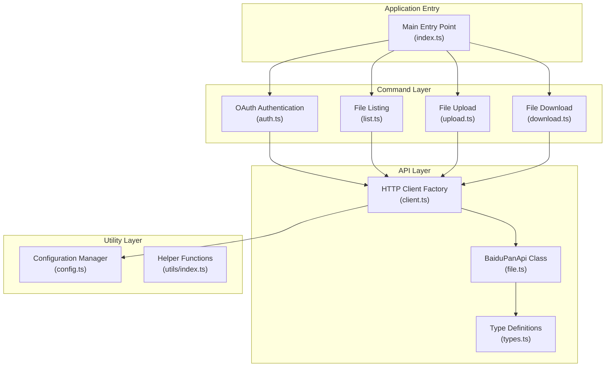
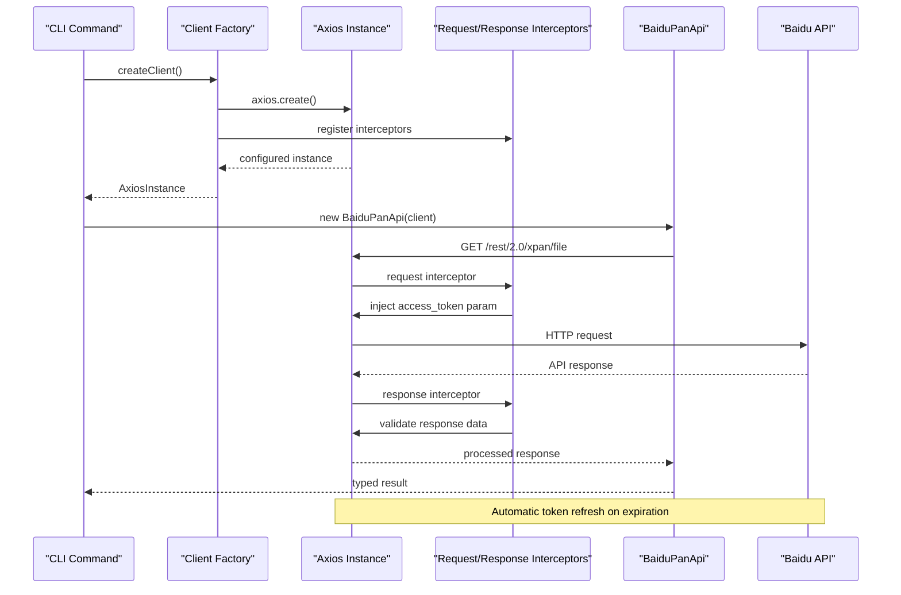
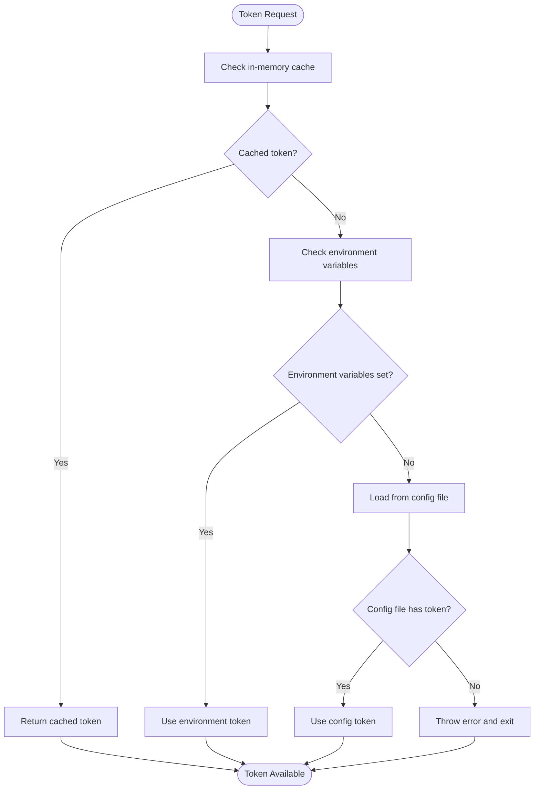
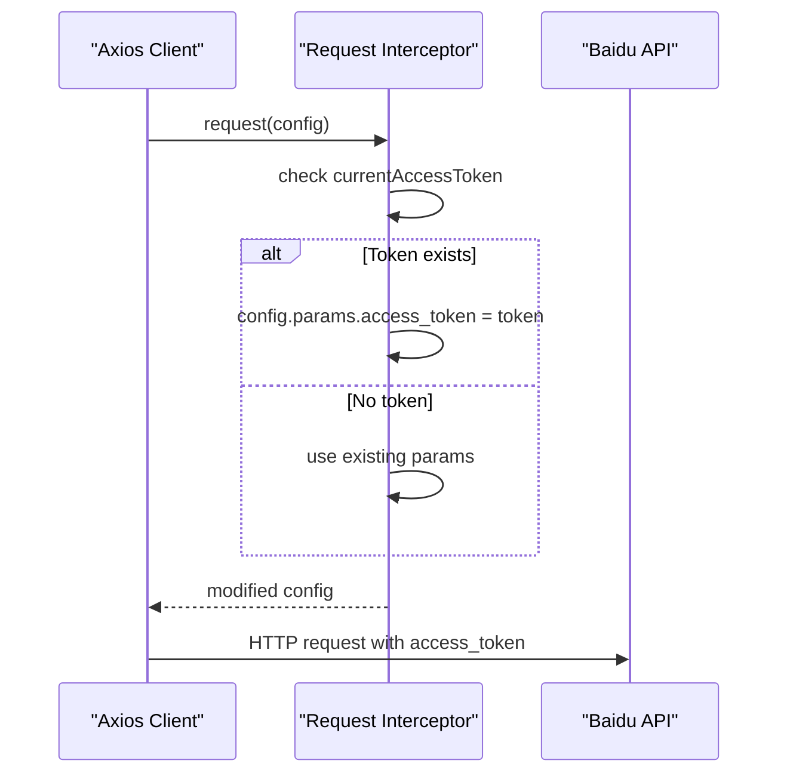
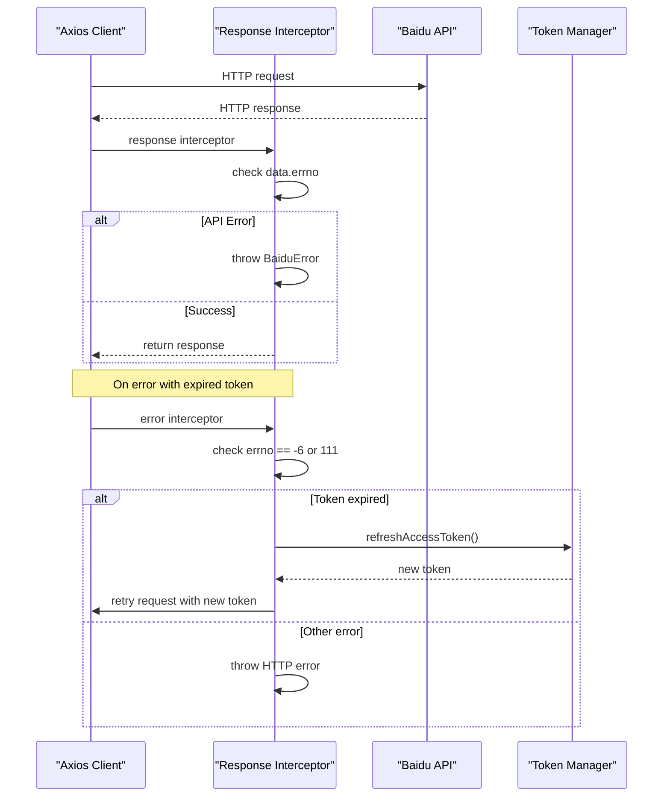
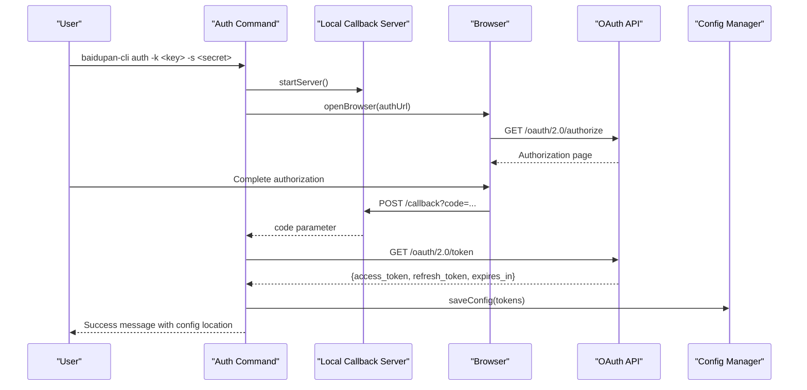
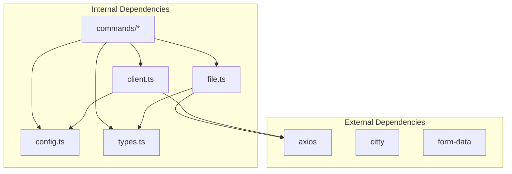

# HTTP Client Architecture

<cite>
**Referenced Files in This Document**
- [client.ts](file://src/api/client.ts)
- [config.ts](file://src/utils/config.ts)
- [types.ts](file://src/api/types.ts)
- [file.ts](file://src/api/file.ts)
- [auth.ts](file://src/commands/auth.ts)
- [download.ts](file://src/commands/download.ts)
- [upload.ts](file://src/commands/upload.ts)
- [list.ts](file://src/commands/list.ts)
- [index.ts](file://src/index.ts)
- [package.json](file://package.json)
</cite>

## Table of Contents
1. [Introduction](#introduction)
2. [Project Structure](#project-structure)
3. [Core Components](#core-components)
4. [Architecture Overview](#architecture-overview)
5. [Detailed Component Analysis](#detailed-component-analysis)
6. [Dependency Analysis](#dependency-analysis)
7. [Performance Considerations](#performance-considerations)
8. [Troubleshooting Guide](#troubleshooting-guide)
9. [Conclusion](#conclusion)

## Introduction
This document provides comprehensive documentation for the HTTP client architecture implementation used by the Baidu Pan CLI tool. The architecture centers around a dual-client approach that separates main API operations from OAuth-related endpoints, with robust token management, automatic token refresh, and standardized error handling. The implementation leverages Axios instances configured with interceptors for authentication header management, parameter injection, and automatic token refresh capabilities.

## Project Structure
The HTTP client architecture is organized across several key modules:



**Diagram sources**
- [client.ts](file://src/api/client.ts#L1-L171)
- [file.ts](file://src/api/file.ts#L1-L201)
- [config.ts](file://src/utils/config.ts#L1-L62)
- [auth.ts](file://src/commands/auth.ts#L1-L258)
- [list.ts](file://src/commands/list.ts#L1-L81)
- [upload.ts](file://src/commands/upload.ts#L1-L144)
- [download.ts](file://src/commands/download.ts#L1-L104)
- [index.ts](file://src/index.ts#L1-L26)

**Section sources**
- [client.ts](file://src/api/client.ts#L1-L171)
- [file.ts](file://src/api/file.ts#L1-L201)
- [config.ts](file://src/utils/config.ts#L1-L62)
- [auth.ts](file://src/commands/auth.ts#L1-L258)
- [list.ts](file://src/commands/list.ts#L1-L81)
- [upload.ts](file://src/commands/upload.ts#L1-L144)
- [download.ts](file://src/commands/download.ts#L1-L104)
- [index.ts](file://src/index.ts#L1-L26)

## Core Components
The HTTP client architecture consists of four primary components that work together to provide a robust and maintainable API communication layer:

### HTTP Client Factory
The client factory provides two distinct Axios instances configured for different API domains and use cases. The factory encapsulates all HTTP client configuration, interceptors, and token management logic in a centralized location.

### Token Management System
A sophisticated token management system handles access token retrieval, refresh token operations, and automatic token persistence. The system supports multiple credential sources with priority-based resolution and automatic token refresh when expiration is detected.

### Request/Response Interceptors
Interceptors handle authentication header injection, error response processing, and automatic token refresh workflows. They provide transparent error handling and retry mechanisms for expired tokens.

### API Abstraction Layer
The BaiduPanApi class provides a clean abstraction over the underlying HTTP client, offering typed methods for all supported Baidu Pan operations while maintaining separation between API logic and HTTP transport concerns.

**Section sources**
- [client.ts](file://src/api/client.ts#L112-L168)
- [config.ts](file://src/utils/config.ts#L8-L54)
- [file.ts](file://src/api/file.ts#L16-L175)

## Architecture Overview
The HTTP client architecture follows a layered approach with clear separation of concerns:



**Diagram sources**
- [client.ts](file://src/api/client.ts#L112-L168)
- [file.ts](file://src/api/file.ts#L16-L175)

The architecture implements several key design patterns:

1. **Factory Pattern**: Centralized client creation with configurable parameters
2. **Interceptor Pattern**: Transparent request/response processing
3. **Strategy Pattern**: Dual-client approach for different API domains
4. **Singleton Pattern**: Token caching for performance optimization

## Detailed Component Analysis

### Client Factory Implementation
The client factory provides two specialized Axios instances designed for different API domains and use cases.

#### Main API Client (`createClient()`)
The main API client is configured for the primary Baidu Pan service with automatic authentication and error handling:

```mermaid
classDiagram
class ClientFactory {
+createClient() AxiosInstance
+createOpenApiClient() AxiosInstance
+getAccessToken() string
+getRefreshToken() string
-refreshAccessToken() Promise~string~
-isTokenExpiredError(errno) boolean
}
class MainAPIClient {
+baseURL : "https : //pan.baidu.com"
+timeout : 30000ms
+params : { access_token }
+interceptors : Request/Response
+proxy : false
}
class OpenAPIClient {
+baseURL : "https : //openapi.baidu.com"
+timeout : 30000ms
+proxy : false
}
ClientFactory --> MainAPIClient : creates
ClientFactory --> OpenAPIClient : creates
```

**Diagram sources**
- [client.ts](file://src/api/client.ts#L112-L168)

**Configuration Details:**
- Base URL: `https://pan.baidu.com` for main API operations
- Timeout: 30 seconds for all requests
- Proxy: Disabled for direct connections
- Authentication: Automatic access token injection via request interceptor

#### OAuth Client (`createOpenApiClient()`)
The OAuth client is specifically designed for authentication and token management operations:

**Configuration Details:**
- Base URL: `https://openapi.baidu.com` for OAuth endpoints
- Timeout: 30 seconds for OAuth operations
- No authentication parameters injected automatically

**Section sources**
- [client.ts](file://src/api/client.ts#L112-L168)

### Token Management System
The token management system implements a sophisticated credential resolution and refresh mechanism:



**Diagram sources**
- [client.ts](file://src/api/client.ts#L15-L37)

**Credential Resolution Priority:**
1. Environment Variables (highest priority)
2. Configuration File (lower priority)
3. Error Handling (fallback)

**Section sources**
- [client.ts](file://src/api/client.ts#L15-L37)
- [config.ts](file://src/utils/config.ts#L19-L30)

### Request/Response Interceptors
The interceptors provide transparent authentication and error handling:

#### Request Interceptor
The request interceptor automatically injects access tokens into all outgoing requests:



**Diagram sources**
- [client.ts](file://src/api/client.ts#L152-L158)

#### Response Interceptor
The response interceptor handles error processing and automatic token refresh:



**Diagram sources**
- [client.ts](file://src/api/client.ts#L124-L150)

**Error Handling:**
- Baidu API errors mapped to descriptive messages
- HTTP errors with status code information
- Automatic token refresh for expired/invalid tokens

**Section sources**
- [client.ts](file://src/api/client.ts#L124-L150)
- [types.ts](file://src/api/types.ts#L99-L107)

### BaiduPanApi Class
The BaiduPanApi class provides a typed interface over the HTTP client with specialized methods for each API operation:

```mermaid
classDiagram
class BaiduPanApi {
-client : AxiosInstance
+constructor(client : AxiosInstance)
+getUserInfo() Promise~UserInfoResponse~
+getQuota() Promise~QuotaResponse~
+listFiles(dir, options) Promise~ListFilesResponse~
+getFileMetas(fsids, dlink) Promise~FileMetasResponse~
+precreate(path, size, blockList, isdir) Promise~PrecreateResponse~
+uploadChunk(uploadId, path, partseq, data) Promise~UploadChunkResponse~
+createFile(path, size, uploadId, blockList, isdir) Promise~CreateFileResponse~
+createDir(path) Promise~CreateFileResponse~
}
class FileOperations {
+CHUNK_SIZE : 4MB
+splitIntoChunks(data) { chunks, md5List }
+md5(data) string
}
BaiduPanApi --> FileOperations : uses
```

**Diagram sources**
- [file.ts](file://src/api/file.ts#L16-L175)

**API Methods:**
- User Information: `/rest/2.0/xpan/nas?method=uinfo`
- Quota Information: `/api/quota?checkfree=1&checkexpire=1`
- File Listing: `/rest/2.0/xpan/file?method=list`
- File Metadata: `/rest/2.0/xpan/multimedia?method=filemetas`
- Upload Operations: `/rest/2.0/xpan/file?method=precreate` and chunk uploads
- Directory Creation: `/rest/2.0/xpan/file?method=create`

**Section sources**
- [file.ts](file://src/api/file.ts#L16-L175)

### OAuth Authentication Flow
The authentication system implements a complete OAuth 2.0 flow with local server callback handling:



**Diagram sources**
- [auth.ts](file://src/commands/auth.ts#L93-L159)
- [auth.ts](file://src/commands/auth.ts#L161-L192)

**Authentication Features:**
- Local callback server with configurable port and path
- Automatic browser opening for authorization
- Token persistence to configuration file
- Graceful error handling for authorization failures
- Support for custom redirect URIs

**Section sources**
- [auth.ts](file://src/commands/auth.ts#L19-L91)
- [auth.ts](file://src/commands/auth.ts#L93-L159)
- [auth.ts](file://src/commands/auth.ts#L161-L192)

## Dependency Analysis
The HTTP client architecture maintains clear dependency relationships that support modularity and maintainability:



**Diagram sources**
- [client.ts](file://src/api/client.ts#L1-L5)
- [file.ts](file://src/api/file.ts#L1-L12)
- [auth.ts](file://src/commands/auth.ts#L1-L6)
- [package.json](file://package.json#L49-L53)

**Dependency Management:**
- Axios: Core HTTP client library
- Citty: Command-line framework
- Form-data: Multipart form data handling for uploads
- Node.js built-ins: File system, path, and HTTP modules

**Section sources**
- [package.json](file://package.json#L49-L53)
- [client.ts](file://src/api/client.ts#L1-L5)
- [file.ts](file://src/api/file.ts#L1-L12)

## Performance Considerations
The HTTP client architecture incorporates several performance optimizations and considerations:

### Token Caching
- Access tokens are cached in memory to avoid repeated file system reads
- Token refresh occurs only when necessary, reducing network overhead
- Configuration file access is minimized through lazy loading

### Request Optimization
- Shared Axios instances reduce connection overhead
- Automatic parameter injection eliminates redundant code
- Chunked upload operations optimize large file transfers

### Error Recovery
- Automatic retry with refreshed tokens reduces failed operation impact
- Graceful degradation for network timeouts and API errors
- Progress reporting for long-running operations

### Memory Management
- Proper cleanup of local servers after OAuth completion
- Efficient buffer handling for file operations
- Minimal memory footprint for configuration data

## Troubleshooting Guide

### Common Issues and Solutions

#### Authentication Failures
**Problem**: Access token not found or invalid
**Solution**: Run the authentication command to obtain new credentials
- Verify environment variables are set correctly
- Check configuration file permissions and format
- Ensure OAuth redirect URI matches registered application settings

#### Network Connectivity Issues
**Problem**: Requests timing out or failing
**Solution**: Check network connectivity and proxy settings
- Verify base URLs are reachable
- Check firewall and proxy configurations
- Review timeout settings (30-second default)

#### Token Expiration Handling
**Problem**: API returns token expired errors
**Solution**: Automatic refresh should handle this transparently
- Verify refresh token is present in configuration
- Check OAuth application credentials
- Monitor token refresh logs for failures

#### File Upload Issues
**Problem**: Large file uploads failing
**Solution**: Check chunk size and network stability
- Verify 4MB chunk size compliance
- Monitor upload progress and retry logic
- Check available disk space for temporary operations

**Section sources**
- [client.ts](file://src/api/client.ts#L34-L37)
- [client.ts](file://src/api/client.ts#L63-L104)
- [auth.ts](file://src/commands/auth.ts#L51-L63)

### Debugging Techniques
- Enable verbose logging for HTTP requests and responses
- Monitor token refresh operations and error conditions
- Use network debugging tools to trace API calls
- Check configuration file locations and permissions

## Conclusion
The HTTP client architecture provides a robust, maintainable foundation for Baidu Pan API integration. The dual-client approach effectively separates authentication concerns from main API operations, while the factory pattern ensures consistent configuration and behavior across all client instances. The comprehensive token management system, combined with automatic error handling and retry logic, delivers a reliable user experience despite the complexities of OAuth authentication and API rate limiting.

The modular design allows for easy extension and maintenance, with clear separation between HTTP transport, business logic, and command-line interfaces. Future enhancements could include connection pooling, advanced retry policies, and additional authentication methods while maintaining the current architectural principles.
