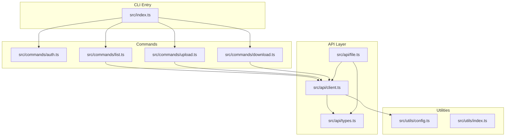
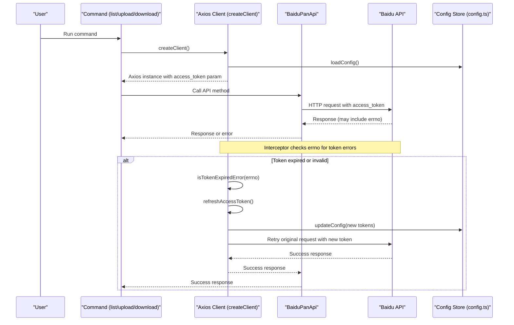
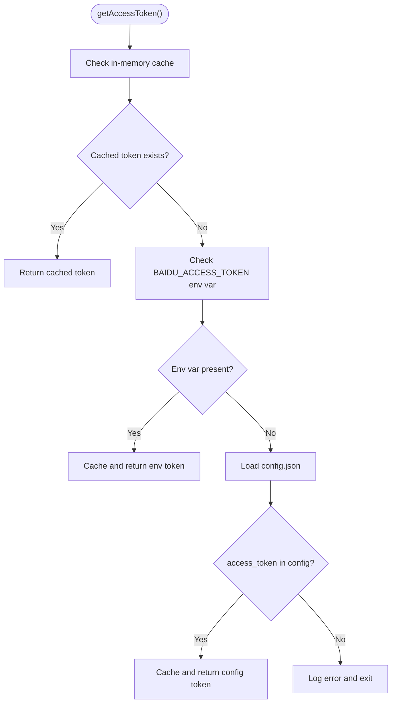
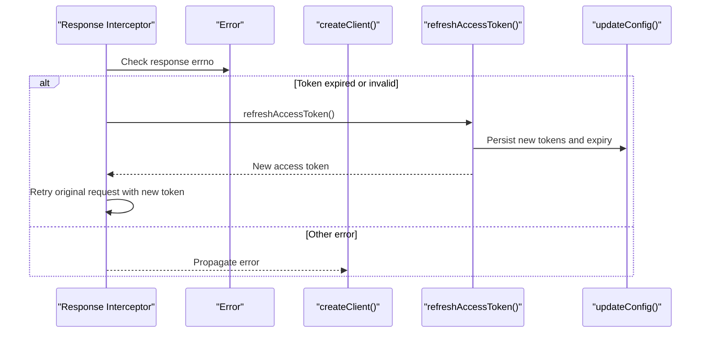
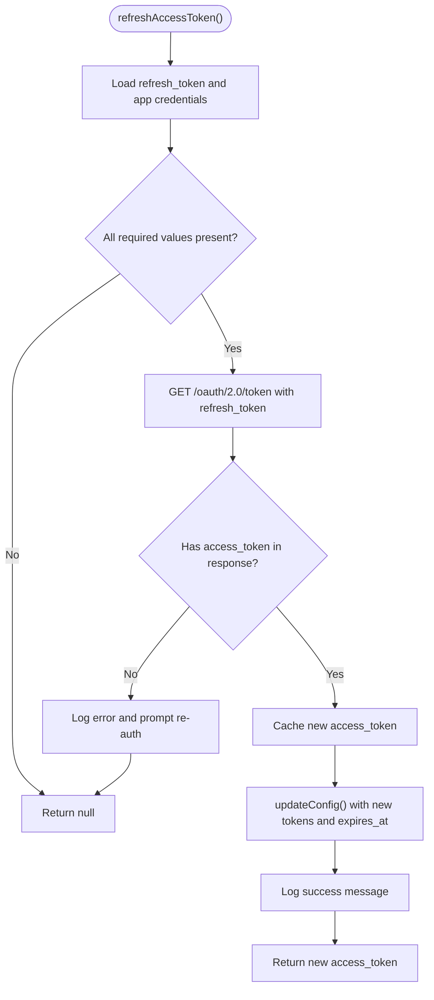
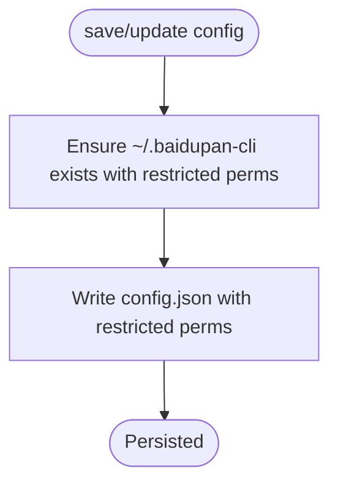
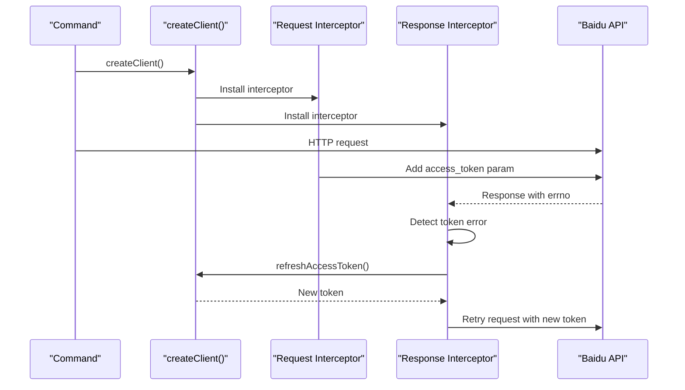
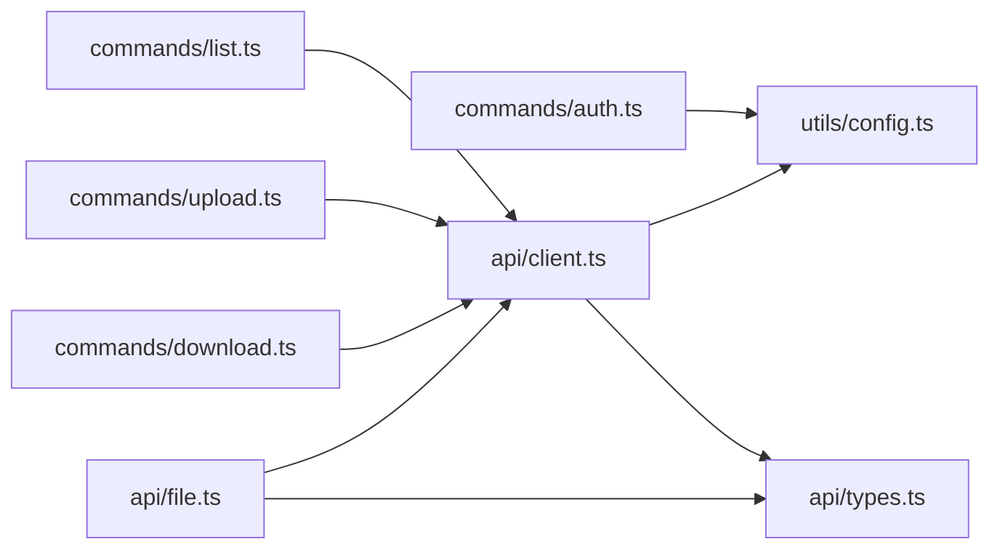

# Token Management

<cite>
**Referenced Files in This Document**
- [src/index.ts](file://src/index.ts)
- [src/api/client.ts](file://src/api/client.ts)
- [src/api/types.ts](file://src/api/types.ts)
- [src/api/file.ts](file://src/api/file.ts)
- [src/commands/auth.ts](file://src/commands/auth.ts)
- [src/commands/download.ts](file://src/commands/download.ts)
- [src/commands/list.ts](file://src/commands/list.ts)
- [src/commands/upload.ts](file://src/commands/upload.ts)
- [src/utils/config.ts](file://src/utils/config.ts)
- [src/utils/index.ts](file://src/utils/index.ts)
- [README.md](file://README.md)
- [package.json](file://package.json)
</cite>

## Table of Contents
1. [Introduction](#introduction)
2. [Project Structure](#project-structure)
3. [Core Components](#core-components)
4. [Architecture Overview](#architecture-overview)
5. [Detailed Component Analysis](#detailed-component-analysis)
6. [Dependency Analysis](#dependency-analysis)
7. [Performance Considerations](#performance-considerations)
8. [Troubleshooting Guide](#troubleshooting-guide)
9. [Conclusion](#conclusion)

## Introduction
This document explains the token management system used by the CLI tool to authenticate with Baidu Pan APIs. It covers:
- Token retrieval priority (environment variables vs config file)
- Access token expiration detection and automatic refresh
- The refreshAccessToken() function and token persistence
- Credential loading from environment variables
- Manual token updates and lifecycle management
- Security considerations for token storage and transmission

## Project Structure
The token management spans several modules:
- Command entry and subcommands
- API client creation and interceptors
- OAuth authorization flow and token persistence
- File operations that rely on the authenticated client
- Utility modules for configuration and helpers

**Diagram sources**
- [src/index.ts](file://src/index.ts#L1-L26)
- [src/commands/auth.ts](file://src/commands/auth.ts#L1-L258)
- [src/commands/list.ts](file://src/commands/list.ts#L1-L81)
- [src/commands/upload.ts](file://src/commands/upload.ts#L1-L144)
- [src/commands/download.ts](file://src/commands/download.ts#L1-L104)
- [src/api/client.ts](file://src/api/client.ts#L1-L171)
- [src/api/file.ts](file://src/api/file.ts#L1-L201)
- [src/api/types.ts](file://src/api/types.ts#L1-L108)
- [src/utils/config.ts](file://src/utils/config.ts#L1-L62)
- [src/utils/index.ts](file://src/utils/index.ts#L1-L110)

**Section sources**
- [src/index.ts](file://src/index.ts#L1-L26)
- [src/api/client.ts](file://src/api/client.ts#L1-L171)
- [src/utils/config.ts](file://src/utils/config.ts#L1-L62)

## Core Components
- Token retrieval priority:
  - Environment variables take precedence over config file values.
  - Access token is cached in memory for the process lifetime.
- Automatic refresh:
  - Interceptors detect known token errors and trigger refreshAccessToken().
  - On success, the new token is stored back to the config file and requests are retried.
- Persistence:
  - Tokens and credentials are persisted to a JSON config file under the user’s home directory.
- Credential loading:
  - App keys and secrets can be loaded from environment variables or config file.
- Error handling:
  - Known Baidu error codes are mapped to user-friendly messages.

**Section sources**
- [src/api/client.ts](file://src/api/client.ts#L11-L37)
- [src/api/client.ts](file://src/api/client.ts#L63-L104)
- [src/api/client.ts](file://src/api/client.ts#L106-L110)
- [src/api/client.ts](file://src/api/client.ts#L112-L161)
- [src/utils/config.ts](file://src/utils/config.ts#L16-L61)
- [src/api/types.ts](file://src/api/types.ts#L99-L108)

## Architecture Overview
The token management architecture integrates environment variables, a persistent config file, and runtime caching. Requests are intercepted to detect token errors and automatically refresh tokens when needed.

**Diagram sources**
- [src/api/client.ts](file://src/api/client.ts#L112-L161)
- [src/api/client.ts](file://src/api/client.ts#L63-L104)
- [src/api/types.ts](file://src/api/types.ts#L99-L108)
- [src/utils/config.ts](file://src/utils/config.ts#L47-L54)

## Detailed Component Analysis

### Token Retrieval Priority and Credential Loading
- Access token priority:
  - If a cached token exists in memory, it is used immediately.
  - Otherwise, the environment variable is checked first.
  - Finally, the config file is consulted.
- Refresh token and app credentials:
  - Refresh token and app credentials are loaded from environment variables or config file.
- Environment variables supported:
  - BAIDU_ACCESS_TOKEN, BAIDU_REFRESH_TOKEN, BAIDU_APP_KEY, BAIDU_SECRET_KEY.

**Diagram sources**
- [src/api/client.ts](file://src/api/client.ts#L11-L37)

**Section sources**
- [src/api/client.ts](file://src/api/client.ts#L11-L37)
- [src/api/client.ts](file://src/api/client.ts#L39-L55)
- [src/utils/config.ts](file://src/utils/config.ts#L16-L30)

### Automatic Token Expiration Detection and Refresh
- Detection:
  - Interceptors inspect the response errno field.
  - Known token error codes are mapped to boolean checks.
- Refresh:
  - refreshAccessToken() retrieves refresh_token and app credentials, calls the OAuth endpoint, and updates the in-memory token and config file.
- Retry:
  - On successful refresh, the original request is retried with the new token.

**Diagram sources**
- [src/api/client.ts](file://src/api/client.ts#L124-L150)
- [src/api/client.ts](file://src/api/client.ts#L106-L110)
- [src/api/client.ts](file://src/api/client.ts#L63-L104)
- [src/utils/config.ts](file://src/utils/config.ts#L47-L54)

**Section sources**
- [src/api/client.ts](file://src/api/client.ts#L106-L110)
- [src/api/client.ts](file://src/api/client.ts#L124-L150)
- [src/api/client.ts](file://src/api/client.ts#L63-L104)
- [src/api/types.ts](file://src/api/types.ts#L99-L108)

### refreshAccessToken() Function
- Purpose: Refresh the access token using the refresh_token and app credentials.
- Inputs:
  - Uses getRefreshToken() and getAppCredentials().
- Behavior:
  - Calls the OAuth token endpoint with grant_type=refresh_token.
  - On success, caches the new access token, persists refresh token and expiry, logs success, and returns the new token.
  - On failure, logs an error and prompts re-authentication.
- Persistence:
  - updateConfig() merges new values into the config file, including expires_at timestamp.

**Diagram sources**
- [src/api/client.ts](file://src/api/client.ts#L63-L104)
- [src/api/client.ts](file://src/api/client.ts#L42-L55)
- [src/utils/config.ts](file://src/utils/config.ts#L47-L54)

**Section sources**
- [src/api/client.ts](file://src/api/client.ts#L63-L104)
- [src/utils/config.ts](file://src/utils/config.ts#L47-L54)

### Token Persistence Strategies
- Storage location:
  - Config file path is derived from the user’s home directory.
- File permissions:
  - Directory is created with restrictive permissions.
  - Config file is written with restrictive permissions.
- Fields persisted:
  - access_token, refresh_token, app_key, secret_key, expires_at.
- Update strategy:
  - updateConfig() merges partial updates into the existing config and writes back atomically.

**Diagram sources**
- [src/utils/config.ts](file://src/utils/config.ts#L35-L45)
- [src/utils/config.ts](file://src/utils/config.ts#L47-L54)

**Section sources**
- [src/utils/config.ts](file://src/utils/config.ts#L5-L14)
- [src/utils/config.ts](file://src/utils/config.ts#L35-L45)
- [src/utils/config.ts](file://src/utils/config.ts#L47-L54)

### Credential Loading from Environment Variables
- App credentials:
  - App key and secret key can be provided via environment variables or config file.
- Access and refresh tokens:
  - Access token can be provided via environment variable or config file.
  - Refresh token can be provided via environment variable or config file.

**Section sources**
- [src/api/client.ts](file://src/api/client.ts#L49-L55)
- [src/api/client.ts](file://src/api/client.ts#L15-L37)
- [src/api/client.ts](file://src/api/client.ts#L42-L44)

### Manual Token Updates and Lifecycle Management
- Initial authorization:
  - The auth command starts a local server, opens the browser for OAuth, exchanges the authorization code for tokens, and saves them to the config file.
- Subsequent runs:
  - The CLI loads tokens from environment variables or config file.
  - If tokens are missing, it exits with guidance to run the auth command.
- Token lifecycle:
  - In-memory caching reduces repeated file reads.
  - Automatic refresh on token errors ensures uninterrupted operation.
  - Persisted expiry timestamp helps with diagnostics and future enhancements.

**Section sources**
- [src/commands/auth.ts](file://src/commands/auth.ts#L46-L91)
- [src/commands/auth.ts](file://src/commands/auth.ts#L161-L192)
- [src/commands/auth.ts](file://src/commands/auth.ts#L218-L257)
- [src/api/client.ts](file://src/api/client.ts#L11-L37)
- [src/api/client.ts](file://src/api/client.ts#L112-L161)

### How Commands Use the Tokenized Client
- Commands create an Axios client configured with the current access token.
- The client’s request interceptor injects the access token into request parameters.
- The response interceptor inspects errno and triggers refresh on token errors.

**Diagram sources**
- [src/commands/list.ts](file://src/commands/list.ts#L36-L47)
- [src/commands/upload.ts](file://src/commands/upload.ts#L33-L40)
- [src/commands/download.ts](file://src/commands/download.ts#L25-L31)
- [src/api/client.ts](file://src/api/client.ts#L112-L161)

**Section sources**
- [src/commands/list.ts](file://src/commands/list.ts#L36-L47)
- [src/commands/upload.ts](file://src/commands/upload.ts#L33-L40)
- [src/commands/download.ts](file://src/commands/download.ts#L25-L31)
- [src/api/client.ts](file://src/api/client.ts#L112-L161)

## Dependency Analysis
- Module coupling:
  - Commands depend on createClient() from the API client module.
  - API client depends on config utilities for persistence and loading.
  - API client depends on error code mapping for token error detection.
- External dependencies:
  - Axios for HTTP requests.
  - Node built-ins for filesystem and OS paths.
- No circular dependencies observed among the analyzed modules.

**Diagram sources**
- [src/commands/auth.ts](file://src/commands/auth.ts#L1-L258)
- [src/commands/list.ts](file://src/commands/list.ts#L1-L81)
- [src/commands/upload.ts](file://src/commands/upload.ts#L1-L144)
- [src/commands/download.ts](file://src/commands/download.ts#L1-L104)
- [src/api/client.ts](file://src/api/client.ts#L1-L171)
- [src/api/file.ts](file://src/api/file.ts#L1-L201)
- [src/api/types.ts](file://src/api/types.ts#L1-L108)
- [src/utils/config.ts](file://src/utils/config.ts#L1-L62)

**Section sources**
- [src/commands/auth.ts](file://src/commands/auth.ts#L1-L258)
- [src/commands/list.ts](file://src/commands/list.ts#L1-L81)
- [src/commands/upload.ts](file://src/commands/upload.ts#L1-L144)
- [src/commands/download.ts](file://src/commands/download.ts#L1-L104)
- [src/api/client.ts](file://src/api/client.ts#L1-L171)
- [src/api/file.ts](file://src/api/file.ts#L1-L201)
- [src/api/types.ts](file://src/api/types.ts#L1-L108)
- [src/utils/config.ts](file://src/utils/config.ts#L1-L62)

## Performance Considerations
- In-memory caching:
  - Access token is cached in memory to avoid repeated file reads.
- Minimal retries:
  - Only token-expired errors trigger a retry; other failures propagate quickly.
- Efficient persistence:
  - Config updates merge partial changes and write atomically.

[No sources needed since this section provides general guidance]

## Troubleshooting Guide
- Symptom: Access token not found
  - Cause: Missing environment variables and config file.
  - Action: Run the auth command to obtain tokens and save them to the config file.
- Symptom: Token expired during operation
  - Cause: Known errno values indicate invalid or expired token.
  - Action: The client attempts automatic refresh; if it fails, re-run the auth command.
- Symptom: Network or proxy issues
  - Cause: External connectivity problems.
  - Action: Verify network access and proxy settings; retry the operation.
- Symptom: Authorization timeout
  - Cause: Local server did not receive the OAuth callback within the timeout window.
  - Action: Ensure the redirect URI matches the app settings and retry authorization.

**Section sources**
- [src/api/client.ts](file://src/api/client.ts#L34-L37)
- [src/api/client.ts](file://src/api/client.ts#L134-L143)
- [src/api/client.ts](file://src/api/client.ts#L63-L104)
- [src/commands/auth.ts](file://src/commands/auth.ts#L153-L158)
- [README.md](file://README.md#L135-L154)

## Security Considerations
- Token storage:
  - Config directory and file are created with restrictive permissions to limit access.
- Transmission:
  - Access tokens are passed as URL parameters; consider rotating tokens and avoiding long-lived sessions when possible.
- Environment variables:
  - Sensitive values can be provided via environment variables to avoid embedding secrets in scripts.
- Least privilege:
  - Use minimal scopes required by the application.

**Section sources**
- [src/utils/config.ts](file://src/utils/config.ts#L37-L40)
- [src/commands/auth.ts](file://src/commands/auth.ts#L247-L256)
- [README.md](file://README.md#L118-L127)

## Conclusion
The token management system provides a robust, secure, and user-friendly mechanism for handling Baidu Pan authentication:
- Clear priority for credential sources
- Automatic detection and refresh of expired tokens
- Secure persistence with restricted file permissions
- Seamless integration across all commands

[No sources needed since this section summarizes without analyzing specific files]