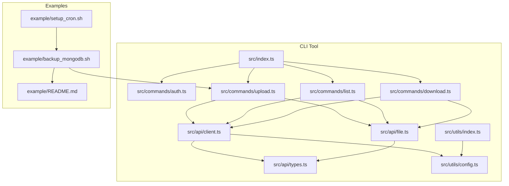
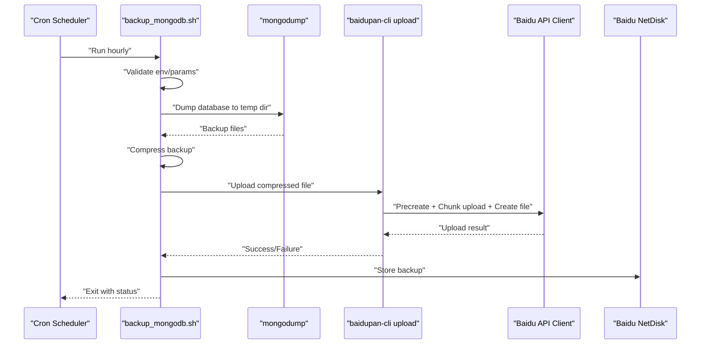
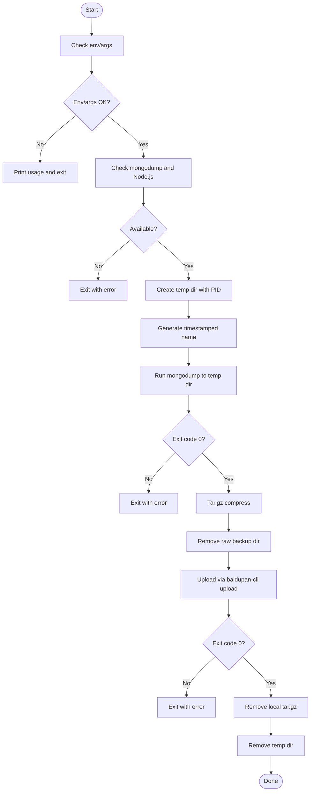
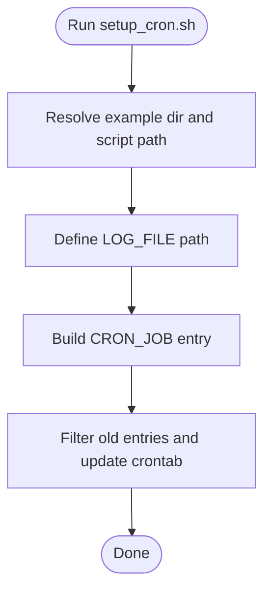
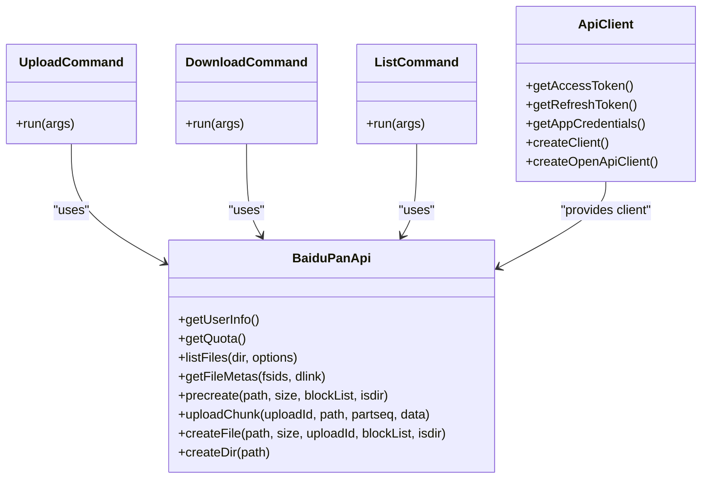
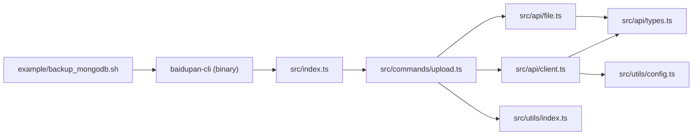

# Advanced Usage & Automation

<cite>
**Referenced Files in This Document**
- [README.md](file://README.md)
- [example/README.md](file://example/README.md)
- [example/backup_mongodb.sh](file://example/backup_mongodb.sh)
- [example/setup_cron.sh](file://example/setup_cron.sh)
- [src/index.ts](file://src/index.ts)
- [src/commands/auth.ts](file://src/commands/auth)
- [src/commands/upload.ts](file://src/commands/upload)
- [src/commands/download.ts](file://src/commands/download)
- [src/commands/list.ts](file://src/commands/list)
- [src/api/client.ts](file://src/api/client)
- [src/api/file.ts](file://src/api/file)
- [src/api/types.ts](file://src/api/types)
- [src/utils/config.ts](file://src/utils/config)
- [src/utils/index.ts](file://src/utils/index)
- [package.json](file://package.json)
</cite>

## Table of Contents
1. [Introduction](#introduction)
2. [Project Structure](#project-structure)
3. [Core Components](#core-components)
4. [Architecture Overview](#architecture-overview)
5. [Detailed Component Analysis](#detailed-component-analysis)
6. [Dependency Analysis](#dependency-analysis)
7. [Performance Considerations](#performance-considerations)
8. [Troubleshooting Guide](#troubleshooting-guide)
9. [Conclusion](#conclusion)
10. [Appendices](#appendices)

## Introduction
This document explains advanced usage patterns and automation capabilities for the project, focusing on:
- Automated MongoDB backups to Baidu NetDisk via cron jobs
- Scheduling strategies and monitoring approaches
- Implementation details of the MongoDB backup script, including connection handling, backup file naming, and error reporting
- Shell script integration patterns, environment variable management, and logging strategies
- Examples of complex workflows combining multiple commands, batch processing, and CI/CD pipeline integration
- Performance optimization for large-scale operations, resource management, and troubleshooting automation failures

## Project Structure
The project is a CLI tool for Baidu NetDisk with a modular command architecture. The example directory provides production-ready automation scripts that orchestrate MongoDB backups and schedule them with cron.

**Diagram sources**
- [src/index.ts](file://src/index.ts#L1-L26)
- [src/commands/auth.ts](file://src/commands/auth.ts#L1-L258)
- [src/commands/list.ts](file://src/commands/list.ts#L1-L81)
- [src/commands/upload.ts](file://src/commands/upload.ts#L1-L144)
- [src/commands/download.ts](file://src/commands/download.ts#L1-L104)
- [src/api/client.ts](file://src/api/client.ts#L1-L171)
- [src/api/file.ts](file://src/api/file.ts#L1-L201)
- [src/api/types.ts](file://src/api/types.ts#L1-L108)
- [src/utils/config.ts](file://src/utils/config.ts#L1-L62)
- [src/utils/index.ts](file://src/utils/index.ts#L1-L110)
- [example/README.md](file://example/README.md#L1-L106)
- [example/backup_mongodb.sh](file://example/backup_mongodb.sh#L1-L91)
- [example/setup_cron.sh](file://example/setup_cron.sh#L1-L17)

**Section sources**
- [README.md](file://README.md#L1-L169)
- [example/README.md](file://example/README.md#L1-L106)
- [src/index.ts](file://src/index.ts#L1-L26)

## Core Components
- CLI entry and subcommands: The CLI exposes commands for auth, list, upload, and download. It is the backbone for automation scripts to integrate with Baidu NetDisk.
- API client and file operations: Provides token management, automatic token refresh, and robust upload/download flows with chunked uploads and progress reporting.
- Utilities: Path normalization, file discovery, size/date formatting, and progress printing support batch processing and reliable automation.
- Example scripts: The backup script orchestrates MongoDB dump, compression, and upload; the cron setup script schedules hourly runs and redirects logs.

**Section sources**
- [src/index.ts](file://src/index.ts#L1-L26)
- [src/commands/upload.ts](file://src/commands/upload.ts#L1-L144)
- [src/commands/download.ts](file://src/commands/download.ts#L1-L104)
- [src/commands/list.ts](file://src/commands/list.ts#L1-L81)
- [src/api/client.ts](file://src/api/client.ts#L1-L171)
- [src/api/file.ts](file://src/api/file.ts#L1-L201)
- [src/utils/index.ts](file://src/utils/index.ts#L1-L110)
- [example/backup_mongodb.sh](file://example/backup_mongodb.sh#L1-L91)
- [example/setup_cron.sh](file://example/setup_cron.sh#L1-L17)

## Architecture Overview
The automation architecture ties together the CLI’s upload command with external tools and scheduling.

**Diagram sources**
- [example/backup_mongodb.sh](file://example/backup_mongodb.sh#L1-L91)
- [src/commands/upload.ts](file://src/commands/upload.ts#L1-L144)
- [src/api/client.ts](file://src/api/client.ts#L112-L161)
- [src/api/file.ts](file://src/api/file.ts#L79-L167)

## Detailed Component Analysis

### MongoDB Backup Script: Implementation and Patterns
- Parameter handling: Supports both environment variables and positional arguments for MongoDB URI and remote directory.
- Prerequisites: Checks for mongodump and Node.js availability.
- Backup lifecycle:
  - Creates a temporary directory with a PID suffix.
  - Generates a timestamped backup name and invokes mongodump with the provided URI.
  - Compresses the backup folder into a .tar.gz archive.
  - Cleans up uncompressed artifacts locally.
  - Uploads the archive to Baidu NetDisk using the CLI’s upload command.
  - Cleans up the local compressed file after successful upload.
  - Removes the temporary directory.
- Error handling: Exits immediately on prerequisites failure or backup/upload errors; logs meaningful messages for diagnostics.

**Diagram sources**
- [example/backup_mongodb.sh](file://example/backup_mongodb.sh#L1-L91)

**Section sources**
- [example/backup_mongodb.sh](file://example/backup_mongodb.sh#L1-L91)

### Cron Job Setup and Monitoring
- The cron setup script:
  - Resolves the example directory and backup script path.
  - Defines a log file path for stdout/stderr redirection.
  - Adds a cron job that runs hourly and redirects output to the log file.
  - Uses crontab manipulation to avoid duplicates by filtering out previous entries for the script.
- Monitoring:
  - Logs are written to a single file for easy tailing and alerting.
  - Cron’s crontab list can be inspected to verify scheduled tasks.

**Diagram sources**
- [example/setup_cron.sh](file://example/setup_cron.sh#L1-L17)

**Section sources**
- [example/setup_cron.sh](file://example/setup_cron.sh#L1-L17)

### Baidu NetDisk CLI Commands and API Integration
- Upload command:
  - Accepts a local path (or stdin) and a remote path.
  - Handles single files, directories (recursive traversal), and stdin streams.
  - Uses chunked upload with MD5 calculation per chunk and precreate/create steps.
  - Provides progress reporting to stderr.
- Download command:
  - Lists directory contents, finds the target file, retrieves a download link, and writes to disk.
  - Supports optional local destination and directory handling.
- List command:
  - Lists directory contents with sorting and JSON output options.
- API client:
  - Manages access tokens via environment variables or config file.
  - Automatically refreshes tokens when encountering expiration errors.
  - Intercepts requests/responses to inject tokens and translate API errors.
- File operations:
  - Implements chunk splitting, MD5 computation, and multipart upload flow.

**Diagram sources**
- [src/commands/upload.ts](file://src/commands/upload.ts#L1-L144)
- [src/commands/download.ts](file://src/commands/download.ts#L1-L104)
- [src/commands/list.ts](file://src/commands/list.ts#L1-L81)
- [src/api/file.ts](file://src/api/file.ts#L1-L201)
- [src/api/client.ts](file://src/api/client.ts#L1-L171)

**Section sources**
- [src/commands/upload.ts](file://src/commands/upload.ts#L1-L144)
- [src/commands/download.ts](file://src/commands/download.ts#L1-L104)
- [src/commands/list.ts](file://src/commands/list.ts#L1-L81)
- [src/api/client.ts](file://src/api/client.ts#L1-L171)
- [src/api/file.ts](file://src/api/file.ts#L1-L201)
- [src/api/types.ts](file://src/api/types.ts#L1-L108)

### Environment Variables and Configuration Management
- Authentication:
  - App credentials and tokens can be provided via environment variables or a local config file.
  - The CLI supports setting BAIDU_APP_KEY, BAIDU_SECRET_KEY, BAIDU_ACCESS_TOKEN, and BAIDU_REFRESH_TOKEN.
- Token lifecycle:
  - On expiration, the client attempts to refresh the token and retries the failing request transparently.
- Configuration persistence:
  - Tokens and credentials are saved to a config file under the user’s home directory with restrictive permissions.

**Section sources**
- [src/api/client.ts](file://src/api/client.ts#L15-L44)
- [src/api/client.ts](file://src/api/client.ts#L63-L104)
- [src/utils/config.ts](file://src/utils/config.ts#L1-L62)
- [README.md](file://README.md#L118-L134)

### Logging Strategies for Automation
- Centralized logging:
  - The cron setup script redirects all stdout/stderr to a single log file for the entire backup pipeline.
- Verbose feedback:
  - The backup script prints actionable messages at each stage (prerequisites, compression, upload).
- Progress reporting:
  - The upload command prints progress to stderr, enabling real-time monitoring of long-running uploads.

**Section sources**
- [example/setup_cron.sh](file://example/setup_cron.sh#L7-L8)
- [example/backup_mongodb.sh](file://example/backup_mongodb.sh#L31-L91)
- [src/commands/upload.ts](file://src/commands/upload.ts#L127-L128)

### Complex Workflows and Batch Processing
- Multi-database backups:
  - Extend the backup script to iterate over multiple MongoDB URIs and push each to separate remote directories.
- Batch upload of multiple archives:
  - Use the upload command to process a list of local archives in sequence, respecting quotas and network conditions.
- Pipeline integration:
  - Combine the backup script with pre/post hooks to notify monitoring systems or trigger downstream actions (e.g., health checks, alerts).
- CI/CD integration:
  - Run the backup script as a scheduled job in CI runners, capturing logs and artifacts for audit.
  - Use environment variables injected by CI to supply MongoDB URIs and Baidu NetDisk credentials.

[No sources needed since this section provides general guidance]

### Scheduling Strategies
- Hourly cadence:
  - The provided script sets a cron job to run hourly, suitable for frequent incremental backups.
- Off-peak scheduling:
  - Adjust cron timing to off-peak hours to reduce impact on MongoDB and network resources.
- Retention and rotation:
  - Integrate retention policies by removing older backups from Baidu NetDisk via the list and delete patterns exposed by the CLI.

[No sources needed since this section provides general guidance]

## Dependency Analysis
The CLI’s upload command depends on the API client and file utilities. The backup script depends on the CLI binary and external tools.

**Diagram sources**
- [example/backup_mongodb.sh](file://example/backup_mongodb.sh#L72-L72)
- [src/index.ts](file://src/index.ts#L1-L26)
- [src/commands/upload.ts](file://src/commands/upload.ts#L1-L144)
- [src/api/client.ts](file://src/api/client.ts#L1-L171)
- [src/api/file.ts](file://src/api/file.ts#L1-L201)
- [src/utils/config.ts](file://src/utils/config.ts#L1-L62)
- [src/utils/index.ts](file://src/utils/index.ts#L1-L110)

**Section sources**
- [package.json](file://package.json#L32-L34)
- [src/index.ts](file://src/index.ts#L1-L26)

## Performance Considerations
- Chunked uploads:
  - The upload flow splits files into 4 MB chunks and computes MD5 per chunk, enabling efficient and resumable transfers.
- Directory traversal:
  - Recursive scanning of directories scales with file count; consider batching or limiting concurrency for very large trees.
- Compression:
  - Compress backups locally before upload to reduce transfer time and storage costs.
- Network and rate limits:
  - Monitor API error codes and throttle requests when encountering rate-limiting scenarios.
- Resource management:
  - Ensure sufficient disk space for temporary backups and avoid holding large buffers in memory.

[No sources needed since this section provides general guidance]

## Troubleshooting Guide
- Authorization failures:
  - Verify app credentials and redirect URI configuration; ensure the local callback server is reachable.
- Token expiration:
  - The client auto-refreshes tokens; if manual intervention is required, re-run the auth command.
- Upload failures:
  - Confirm the remote path exists and is writable; check network connectivity and API quotas.
- Backup script errors:
  - Review the log file for the exact stage of failure; ensure mongodump and Node.js are installed and accessible.
- Cron job issues:
  - Inspect crontab entries and confirm the log file path is writable.

**Section sources**
- [src/commands/auth.ts](file://src/commands/auth.ts#L46-L90)
- [src/api/client.ts](file://src/api/client.ts#L133-L149)
- [src/commands/upload.ts](file://src/commands/upload.ts#L91-L95)
- [example/backup_mongodb.sh](file://example/backup_mongodb.sh#L32-L41)
- [example/setup_cron.sh](file://example/setup_cron.sh#L13-L13)
- [README.md](file://README.md#L135-L154)

## Conclusion
By combining the CLI’s robust upload pipeline with the provided backup and cron scripts, teams can automate reliable, monitored, and scalable backups to Baidu NetDisk. Proper environment management, logging, and scheduling strategies ensure predictable operations, while the chunked upload mechanism and token refresh logic provide resilience against common failure modes.

[No sources needed since this section summarizes without analyzing specific files]

## Appendices

### Appendix A: Backup File Naming Conventions
- Timestamped naming: The backup script generates a timestamped name for each backup, ensuring uniqueness and chronological ordering.
- Archive naming: The compressed archive follows a consistent pattern derived from the timestamped name.

**Section sources**
- [example/backup_mongodb.sh](file://example/backup_mongodb.sh#L48-L51)

### Appendix B: Example Commands and Paths
- Install and configure:
  - Install globally and authorize via the CLI.
- Manual backup:
  - Run the backup script with MongoDB URI and remote directory.
- Set up cron:
  - Execute the cron setup script to schedule hourly backups and capture logs.

**Section sources**
- [README.md](file://README.md#L7-L41)
- [example/README.md](file://example/README.md#L41-L57)
- [example/setup_cron.sh](file://example/setup_cron.sh#L1-L17)
