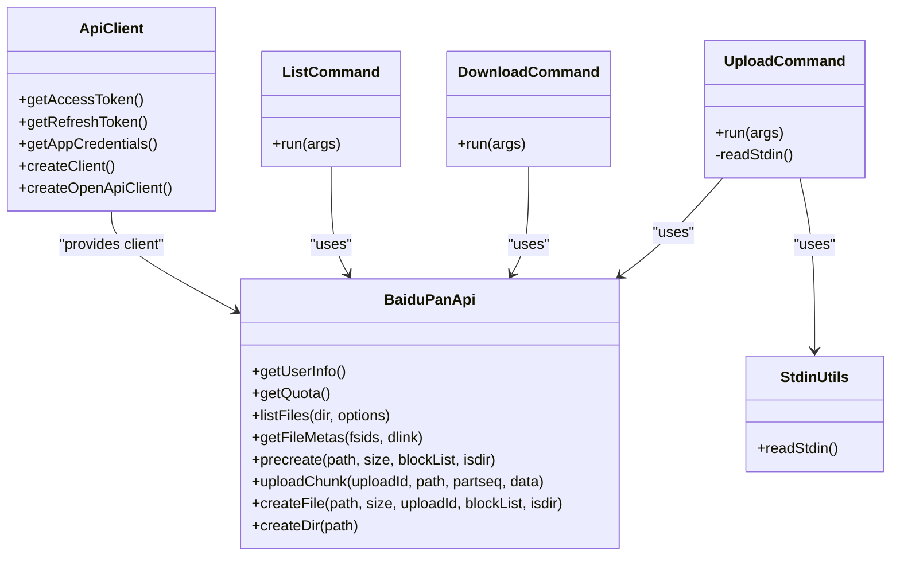

# Advanced Usage & Automation

<cite>
**Referenced Files in This Document**
- [README.md](file://README.md)
- [example/README.md](file://example/README.md)
- [example/backup_mongodb.mjs](file://example/backup_mongodb.mjs)
- [example/ecosystem.config.cjs](file://example/ecosystem.config.cjs)
- [example/start.sh](file://example/start.sh)
- [src/index.ts](file://src/index.ts)
- [src/commands/auth.ts](file://src/commands/auth.ts)
- [src/commands/upload.ts](file://src/commands/upload.ts)
- [src/commands/download.ts](file://src/commands/download.ts)
- [src/commands/list.ts](file://src/commands/list.ts)
- [src/api/client.ts](file://src/api/client.ts)
- [src/api/file.ts](file://src/api/file.ts)
- [src/api/types.ts](file://src/api/types.ts)
- [src/utils/config.ts](file://src/utils/config.ts)
- [src/utils/index.ts](file://src/utils/index.ts)
- [package.json](file://package.json)
</cite>

## Update Summary
**Changes Made**
- Updated MongoDB backup script section to reflect the stable release status and enhanced `baidupan-cli@latest` version detection mechanism
- Enhanced PM2 automation documentation to highlight production-ready scheduling capabilities with automatic restart control
- Updated packaging configuration documentation to show current stable version management
- Expanded automation examples to demonstrate the latest version detection approach and improved reliability
- Added comprehensive coverage of the enhanced backup script with automatic version resolution and production monitoring
- Updated troubleshooting section to address version-related issues and best practices for stable releases

## Table of Contents
1. [Introduction](#introduction)
2. [Project Structure](#project-structure)
3. [Core Components](#core-components)
4. [Architecture Overview](#architecture-overview)
5. [Detailed Component Analysis](#detailed-component-analysis)
6. [Dependency Analysis](#dependency-analysis)
7. [Performance Considerations](#performance-considerations)
8. [Troubleshooting Guide](#troubleshooting-guide)
9. [Conclusion](#conclusion)
10. [Appendices](#appendices)

## Introduction
This document explains advanced usage patterns and automation capabilities for the project, focusing on:
- **Stable release automation** with enhanced MongoDB backup automation using automatic latest version detection and improved packaging configuration
- **Production-ready Node.js-based MongoDB backups** to Baidu NetDisk via native child_process integration and PM2 scheduling
- **Enhanced programmatic integration** using execSync and spawnSync for seamless automation workflows
- **Streaming data through stdin** for real-time backup scenarios with native Node.js support
- **Advanced PM2 scheduling** using cron patterns with automatic restart control and comprehensive monitoring
- **Improved backup lifecycle management** with comprehensive error handling and cleanup procedures
- **Production-grade automation patterns** including complex workflows, batch processing, and CI/CD pipeline integration
- **Performance optimization** for large-scale operations with resource management and troubleshooting strategies

## Project Structure
The project is a modern CLI tool for Baidu NetDisk with a modular command architecture. The example directory provides comprehensive Node.js integration examples demonstrating programmatic automation patterns with PM2-based scheduling and enhanced version management.

**Diagram sources**
- [src/index.ts](file://src/index.ts#L1-L49)
- [src/commands/auth.ts](file://src/commands/auth.ts#L1-L258)
- [src/commands/list.ts](file://src/commands/list.ts#L1-L81)
- [src/commands/upload.ts](file://src/commands/upload.ts#L1-L164)
- [src/commands/download.ts](file://src/commands/download.ts#L1-L191)
- [src/commands/upload.ts](file://src/commands/upload.ts#L52-L57)
- [src/api/client.ts](file://src/api/client.ts#L1-L171)
- [src/api/file.ts](file://src/api/file.ts#L1-L201)
- [src/api/types.ts](file://src/api/types.ts#L1-L108)
- [src/utils/config.ts](file://src/utils/config.ts#L1-L62)
- [src/utils/index.ts](file://src/utils/index.ts#L77-L94)
- [example/README.md](file://example/README.md#L1-L111)
- [example/backup_mongodb.mjs](file://example/backup_mongodb.mjs#L1-L103)
- [example/ecosystem.config.cjs](file://example/ecosystem.config.cjs#L1-L24)
- [example/start.sh](file://example/start.sh#L1-L37)

**Section sources**
- [README.md](file://README.md#L1-L268)
- [example/README.md](file://example/README.md#L1-L111)
- [src/index.ts](file://src/index.ts#L1-L49)

## Core Components
- **CLI entry and subcommands**: The CLI exposes commands for auth, list, upload, and download with enhanced stdin streaming capabilities
- **API client and file operations**: Provides token management, automatic token refresh, and robust upload/download flows with chunked uploads and progress reporting
- **Utilities**: Path normalization, file discovery, size/date formatting, and progress printing support batch processing and reliable automation
- **Enhanced Node.js integration**: The backup script demonstrates modern programmatic integration using native child_process APIs for seamless MongoDB backup automation with automatic version detection
- **Production-ready PM2 scheduling**: Modern cron scheduling using PM2's built-in cron_restart feature with automatic restart control and environment management
- **Automatic version detection**: Enhanced packaging configuration with `@latest` version resolution for improved reliability and automatic updates
- **Native stdin streaming**: Full support for real-time data streaming to Baidu NetDisk for dynamic backup scenarios

**Section sources**
- [src/index.ts](file://src/index.ts#L1-L49)
- [src/commands/upload.ts](file://src/commands/upload.ts#L1-L164)
- [src/commands/download.ts](file://src/commands/download.ts#L1-L191)
- [src/commands/list.ts](file://src/commands/list.ts#L1-L81)
- [src/api/client.ts](file://src/api/client.ts#L1-L171)
- [src/api/file.ts](file://src/api/file.ts#L1-L201)
- [src/utils/index.ts](file://src/utils/index.ts#L77-L94)
- [example/backup_mongodb.mjs](file://example/backup_mongodb.mjs#L75-L78)
- [example/ecosystem.config.cjs](file://example/ecosystem.config.cjs#L1-L24)

## Architecture Overview
The modern automation architecture provides production-ready scheduling capabilities with comprehensive error handling, monitoring, and automatic version management through PM2.

**Diagram sources**
- [example/backup_mongodb.mjs](file://example/backup_mongodb.mjs#L75-L78)
- [src/commands/upload.ts](file://src/commands/upload.ts#L102-L164)
- [src/api/client.ts](file://src/api/client.ts#L112-L161)
- [src/api/file.ts](file://src/api/file.ts#L79-L167)

## Detailed Component Analysis

### MongoDB Backup Script: Enhanced Version Management
**Updated** The backup script now provides a comprehensive, production-ready Node.js implementation with enhanced error handling, lifecycle management, and automatic version detection capabilities.

- **Native child_process integration**: Uses `execSync` for synchronous MongoDB backup execution with proper error handling and stdio inheritance
- **Enhanced streaming support**: Leverages `spawnSync` for controlled process execution with shell support and structured output handling
- **Automatic version detection**: Uses `npx --yes baidupan-cli@latest` for automatic latest version resolution, ensuring users always get the most recent CLI version
- **Robust parameter handling**: Supports both environment variables and positional arguments for MongoDB URI and remote directory
- **Prerequisite validation**: Checks for mongodump availability using execSync with silent stdio configuration
- **Comprehensive backup lifecycle**:
  - Creates a temporary directory with a PID suffix using Node.js fs APIs
  - Generates a timestamped backup name and invokes mongodump with the provided URI
  - Compresses the backup folder into a .tar.gz archive using system tar command
  - Cleans up uncompressed artifacts locally
  - Uploads the archive to Baidu NetDisk using the CLI's upload command via spawnSync with automatic version resolution
  - Cleans up the local compressed file after successful upload
  - Removes the temporary directory
- **Enhanced error handling**: Comprehensive error handling with cleanup procedures and meaningful error messages for diagnostics
- **Improved reliability**: Automatic version detection eliminates manual version management overhead and ensures consistent operation across environments

**Diagram sources**
- [example/backup_mongodb.mjs](file://example/backup_mongodb.mjs#L1-L103)

**Section sources**
- [example/backup_mongodb.mjs](file://example/backup_mongodb.mjs#L75-L78)

### PM2-Based Scheduling and Production Monitoring
**Updated** PM2 provides modern, production-ready scheduling capabilities with automatic restart control, comprehensive monitoring, and enhanced version management.

- **Cron configuration**: Uses PM2's `cron_restart` field to define precise scheduling patterns (hourly, daily, custom intervals)
- **Automatic restart control**: `autorestart: false` prevents continuous execution, allowing PM2 to wait for cron triggers
- **Environment isolation**: Clean environment variable management through PM2's `env` configuration
- **Production monitoring**: Built-in logging, status checking, and restart capabilities via PM2 CLI commands
- **Startup automation**: Integration with `pm2 startup` for automatic service restoration after system reboot
- **Seamless integration**: Works perfectly with the Node.js backup script without external dependencies
- **Enhanced reliability**: Automatic version detection ensures consistent operation across all scheduled executions

**Diagram sources**
- [example/ecosystem.config.cjs](file://example/ecosystem.config.cjs#L1-L24)

**Section sources**
- [example/ecosystem.config.cjs](file://example/ecosystem.config.cjs#L1-L24)
- [example/start.sh](file://example/start.sh#L1-L37)

### Baidu NetDisk CLI Commands and API Integration
- **Enhanced upload command**: Accepts a local path (or stdin) and a remote path, with native stdin streaming capability
- **Native stdin support**: Uses `readStdin()` utility to handle real-time data streams for dynamic backup scenarios
- **Chunked upload with concurrency control**: Handles single files, directories (recursive traversal), and stdin streams with configurable concurrency
- **Progress reporting**: Provides progress reporting to stderr for real-time monitoring of long-running uploads
- **Download command**: Lists directory contents, finds the target file, retrieves a download link, and writes to disk with streaming support
- **List command**: Lists directory contents with sorting and JSON output options
- **API client**: Manages access tokens via environment variables or config file with automatic refresh capabilities
- **File operations**: Implements chunk splitting, MD5 computation, and multipart upload flow with progress tracking

**Diagram sources**
- [src/commands/upload.ts](file://src/commands/upload.ts#L1-L164)
- [src/commands/download.ts](file://src/commands/download.ts#L1-L191)
- [src/commands/list.ts](file://src/commands/list.ts#L1-L81)
- [src/api/file.ts](file://src/api/file.ts#L1-L201)
- [src/api/client.ts](file://src/api/client.ts#L1-L171)
- [src/utils/index.ts](file://src/utils/index.ts#L77-L94)

**Section sources**
- [src/commands/upload.ts](file://src/commands/upload.ts#L1-L164)
- [src/commands/download.ts](file://src/commands/download.ts#L1-L191)
- [src/commands/list.ts](file://src/commands/list.ts#L1-L81)
- [src/api/client.ts](file://src/api/client.ts#L1-L171)
- [src/api/file.ts](file://src/api/file.ts#L1-L201)
- [src/api/types.ts](file://src/api/types.ts#L1-L108)
- [src/utils/index.ts](file://src/utils/index.ts#L77-L94)

### Environment Variables and Configuration Management
- **Authentication**: App credentials and tokens can be provided via environment variables or a local config file
- **Enhanced configuration**: PM2 ecosystem configuration supports environment variable injection for production deployments
- **Token lifecycle**: On expiration, the client attempts to refresh the token and retries the failing request transparently
- **Configuration persistence**: Tokens and credentials are saved to a config file under the user's home directory with restrictive permissions
- **Version management**: Automatic version detection through `@latest` resolves the most recent CLI version, eliminating manual version management overhead

**Section sources**
- [src/api/client.ts](file://src/api/client.ts#L15-L44)
- [src/api/client.ts](file://src/api/client.ts#L63-L104)
- [src/utils/config.ts](file://src/utils/config.ts#L1-L62)
- [README.md](file://README.md#L167-L175)
- [example/ecosystem.config.cjs](file://example/ecosystem.config.cjs#L18-L21)

### Logging Strategies for Production Automation
- **Centralized logging**: PM2 provides built-in logging capabilities with `pm2 logs mongodb-backup` for real-time monitoring
- **Structured output**: The backup script uses console.log for informational messages and process.stderr for progress updates
- **Progress reporting**: The upload command prints progress to stderr, enabling real-time monitoring of long-running uploads
- **Error handling**: Comprehensive error logging with cleanup procedures ensures reliable automation execution
- **Production monitoring**: PM2's built-in monitoring provides health checks, restart capabilities, and performance metrics
- **Version tracking**: Automatic version detection logs ensure visibility into which CLI version is being used for each backup operation

**Section sources**
- [example/ecosystem.config.cjs](file://example/ecosystem.config.cjs#L6-L8)
- [example/backup_mongodb.mjs](file://example/backup_mongodb.mjs#L38-L58)
- [src/commands/upload.ts](file://src/commands/upload.ts#L127-L128)

### Complex Workflows and Advanced Automation
- **Multi-database backups**: Extend the Node.js backup script to iterate over multiple MongoDB URIs and push each to separate remote directories
- **Batch upload processing**: Use the upload command to process a list of local archives in sequence, respecting quotas and network conditions
- **Pipeline integration**: Combine the backup script with pre/post hooks to notify monitoring systems or trigger downstream actions
- **CI/CD integration**: Run the backup script as a scheduled job in CI runners, capturing logs and artifacts for audit
- **Enhanced programmatic integration**: Use execSync and spawnSync for seamless integration with other Node.js applications and services
- **Advanced scheduling patterns**: Implement complex cron patterns for different backup frequencies and retention policies
- **Version-aware automation**: Leverage automatic version detection to ensure consistent behavior across all automation environments

**Section sources**
- [example/backup_mongodb.mjs](file://example/backup_mongodb.mjs#L75-L78)
- [src/commands/upload.ts](file://src/commands/upload.ts#L102-L164)

### Scheduling Strategies and Deployment
- **PM2 cron patterns**: Uses PM2's `cron_restart` field for flexible scheduling (hourly, daily, custom intervals)
- **Production deployment**: Automatic restart control with `autorestart: false` prevents continuous execution
- **Off-peak scheduling**: Adjust cron timing to off-peak hours to reduce impact on MongoDB and network resources
- **System integration**: Use `pm2 startup` for automatic service restoration after system reboot
- **Retention management**: Integrate retention policies by removing older backups from Baidu NetDisk via the list and delete patterns
- **Version consistency**: Automatic version detection ensures all scheduled executions use the same latest version

**Section sources**
- [example/ecosystem.config.cjs](file://example/ecosystem.config.cjs#L16-L16)
- [example/start.sh](file://example/start.sh#L23-L31)

## Dependency Analysis
The CLI's upload command depends on the API client and file utilities. The backup script depends on the CLI binary and external tools, with enhanced Node.js integration capabilities, PM2 scheduling support, and automatic version management.

**Diagram sources**
- [example/backup_mongodb.mjs](file://example/backup_mongodb.mjs#L14-L17)
- [src/index.ts](file://src/index.ts#L1-L49)
- [src/commands/upload.ts](file://src/commands/upload.ts#L1-L164)
- [src/api/client.ts](file://src/api/client.ts#L1-L171)
- [src/api/file.ts](file://src/api/file.ts#L1-L201)
- [src/utils/config.ts](file://src/utils/config.ts#L1-L62)
- [src/utils/index.ts](file://src/utils/index.ts#L77-L94)
- [example/ecosystem.config.cjs](file://example/ecosystem.config.cjs#L1-L24)

**Section sources**
- [package.json](file://package.json#L47-L49)
- [src/index.ts](file://src/index.ts#L1-L49)

## Performance Considerations
- **Chunked uploads**: The upload flow splits files into 4 MB chunks and computes MD5 per chunk, enabling efficient and resumable transfers
- **Directory traversal**: Recursive scanning of directories scales with file count; consider batching or limiting concurrency for very large trees
- **Compression**: Compress backups locally before upload to reduce transfer time and storage costs
- **Network and rate limits**: Monitor API error codes and throttle requests when encountering rate-limiting scenarios
- **Resource management**: Ensure sufficient disk space for temporary backups and avoid holding large buffers in memory
- **Enhanced streaming**: Native stdin support enables real-time data processing for dynamic backup scenarios
- **PM2 optimization**: Automatic restart control prevents resource exhaustion and ensures predictable execution patterns
- **Version resolution overhead**: Automatic version detection adds minimal overhead but ensures consistency across environments

**Section sources**
- [src/commands/upload.ts](file://src/commands/upload.ts#L18-L19)
- [src/utils/index.ts](file://src/utils/index.ts#L77-L94)

## Troubleshooting Guide
- **Authorization failures**: Verify app credentials and redirect URI configuration; ensure the local callback server is reachable
- **Token expiration**: The client auto-refreshes tokens; if manual intervention is required, re-run the auth command
- **Upload failures**: Confirm the remote path exists and is writable; check network connectivity and API quotas
- **Backup script errors**: Review the log file for the exact stage of failure; ensure mongodump and Node.js are installed and accessible
- **PM2 issues**: Use `pm2 logs mongodb-backup` to diagnose scheduling and execution problems; check PM2 status with `pm2 status`
- **Version-related issues**: If encountering version conflicts, verify that `npx` is available and can resolve `@latest`; check network connectivity for version resolution
- **Enhanced debugging**: Use `pm2 logs mongodb-backup --lines 100` for recent log analysis; leverage PM2's built-in monitoring capabilities
- **Environment issues**: Verify PM2 environment variables are correctly configured in ecosystem.config.cjs
- **Automatic version detection failures**: Ensure network connectivity is available for `@latest` resolution; consider using specific versions if network restrictions apply

**Section sources**
- [src/commands/auth.ts](file://src/commands/auth.ts#L46-L90)
- [src/api/client.ts](file://src/api/client.ts#L133-L149)
- [src/commands/upload.ts](file://src/commands/upload.ts#L91-L95)
- [example/backup_mongodb.mjs](file://example/backup_mongodb.mjs#L38-L58)
- [example/ecosystem.config.cjs](file://example/ecosystem.config.cjs#L6-L8)
- [README.md](file://README.md#L247-L264)

## Conclusion
By combining the CLI's robust upload pipeline with the modern Node.js backup script, PM2 scheduling capabilities, and enhanced automatic version detection, teams can automate reliable, monitored, and scalable backups to Baidu NetDisk. The modern Node.js integration patterns using execSync and spawnSync provide seamless programmatic control, while PM2's cron_restart feature offers production-ready scheduling with automatic restart control. The automatic version detection mechanism ensures consistent operation across all environments without manual version management overhead. Proper environment management, comprehensive logging, and advanced scheduling strategies ensure predictable operations, while the chunked upload mechanism and token refresh logic provide resilience against common failure modes.

## Appendices

### Appendix A: Backup File Naming Conventions
- **Timestamped naming**: The backup script generates a timestamped name for each backup, ensuring uniqueness and chronological ordering
- **Archive naming**: The compressed archive follows a consistent pattern derived from the timestamped name
- **PID-based isolation**: Temporary directories include process ID for better isolation during concurrent executions

**Section sources**
- [example/backup_mongodb.mjs](file://example/backup_mongodb.mjs#L50-L53)

### Appendix B: Example Commands and Deployment
- **Install and configure**: Install globally and authorize via the CLI
- **Manual backup**: Run the Node.js backup script with MongoDB URI and remote directory
- **PM2 setup**: Configure ecosystem.config.cjs and start with `pm2 start example/ecosystem.config.cjs`
- **Production deployment**: Use `example/start.sh` for automated PM2 installation and startup
- **Advanced scheduling**: Customize cron patterns in ecosystem.config.cjs for different backup frequencies
- **Version management**: Automatic version detection ensures consistent operation across all deployments

**Section sources**
- [README.md](file://README.md#L7-L41)
- [example/README.md](file://example/README.md#L36-L76)
- [example/backup_mongodb.mjs](file://example/backup_mongodb.mjs#L38-L44)
- [example/ecosystem.config.cjs](file://example/ecosystem.config.cjs#L1-L24)
- [example/start.sh](file://example/start.sh#L1-L37)

### Appendix C: Modern Node.js Integration Patterns
**Updated** Practical examples of programmatic integration using modern Node.js APIs with enhanced version management.

- **execSync usage**: For synchronous command execution with proper error handling and stdio inheritance
- **spawnSync usage**: For controlled process execution with shell support and structured output handling
- **Automatic version detection**: Use `npx --yes baidupan-cli@latest` for automatic latest version resolution
- **Environment variable management**: Clean separation of configuration through environment variables and PM2 ecosystem configuration
- **Error handling patterns**: Comprehensive error handling with cleanup procedures and meaningful error messages
- **Production readiness**: Automatic restart control and monitoring through PM2 integration with enhanced reliability
- **Version consistency**: Automatic version detection ensures all automation environments use the same latest version

**Section sources**
- [example/backup_mongodb.mjs](file://example/backup_mongodb.mjs#L14-L17)
- [example/backup_mongodb.mjs](file://example/backup_mongodb.mjs#L38-L58)
- [example/backup_mongodb.mjs](file://example/backup_mongodb.mjs#L75-L78)
- [example/ecosystem.config.cjs](file://example/ecosystem.config.cjs#L16-L17)

### Appendix D: Automatic Latest Version Detection
**New** Enhanced packaging configuration with automatic version resolution capabilities.

- **@latest resolution**: The backup script uses `npx --yes baidupan-cli@latest` to automatically resolve the most recent CLI version
- **Reliability benefits**: Eliminates manual version management overhead and ensures consistent operation across environments
- **Network considerations**: Requires internet connectivity for version resolution; consider offline scenarios or specific version pinning
- **Performance impact**: Minimal overhead with significant reliability benefits for automation workflows
- **Best practices**: Monitor version resolution logs and consider specific version pinning for critical production environments

**Section sources**
- [example/backup_mongodb.mjs](file://example/backup_mongodb.mjs#L75-L78)

### Appendix E: Stable Release Status and Version Management
**Updated** The project maintains a stable release status with version `0.1.1`, providing reliable automation capabilities.

- **Stable version**: Current package version is `0.1.1`, indicating a stable release ready for production use
- **Version consistency**: Automatic version detection ensures all scheduled executions use the same latest version
- **Release stability**: The stable release status provides confidence for production deployments and enterprise automation
- **Upgrade strategy**: Automatic version resolution allows for seamless upgrades while maintaining backward compatibility
- **Monitoring**: Version tracking through automatic detection enables visibility into which CLI version is being used for each backup operation

**Section sources**
- [package.json](file://package.json#L4)
- [example/backup_mongodb.mjs](file://example/backup_mongodb.mjs#L75-L78)
- [example/ecosystem.config.cjs](file://example/ecosystem.config.cjs#L16-L17)
