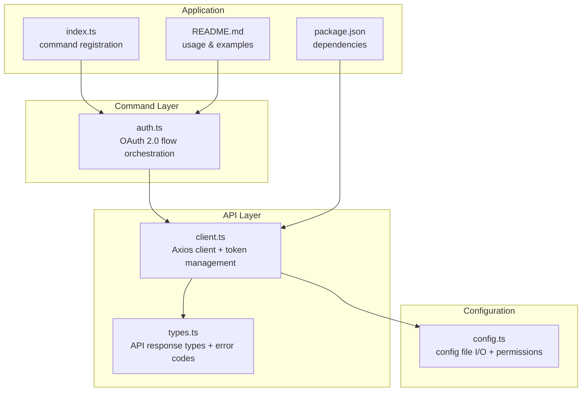
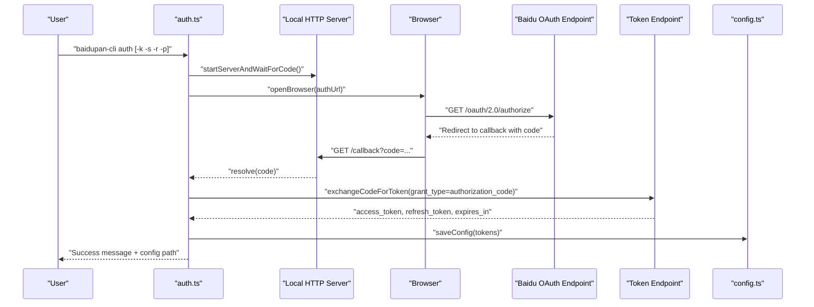
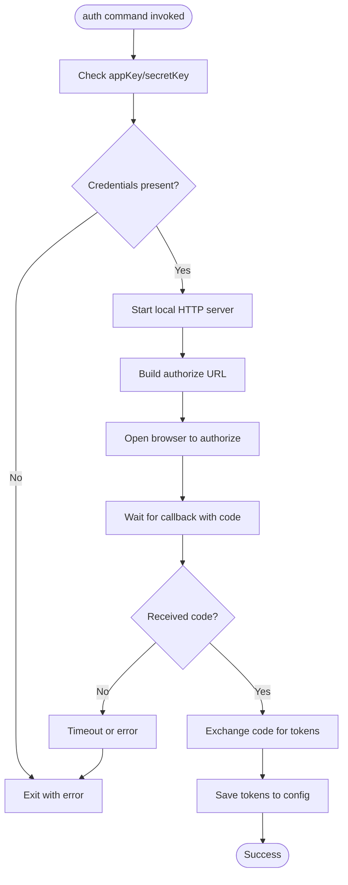
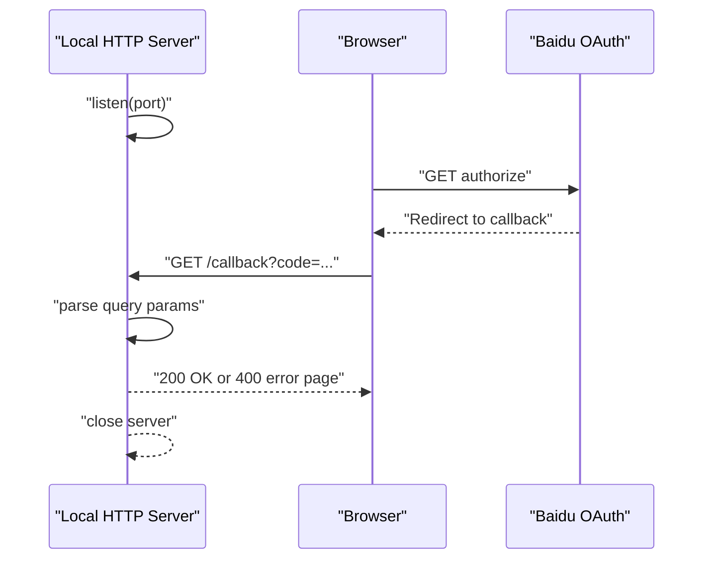
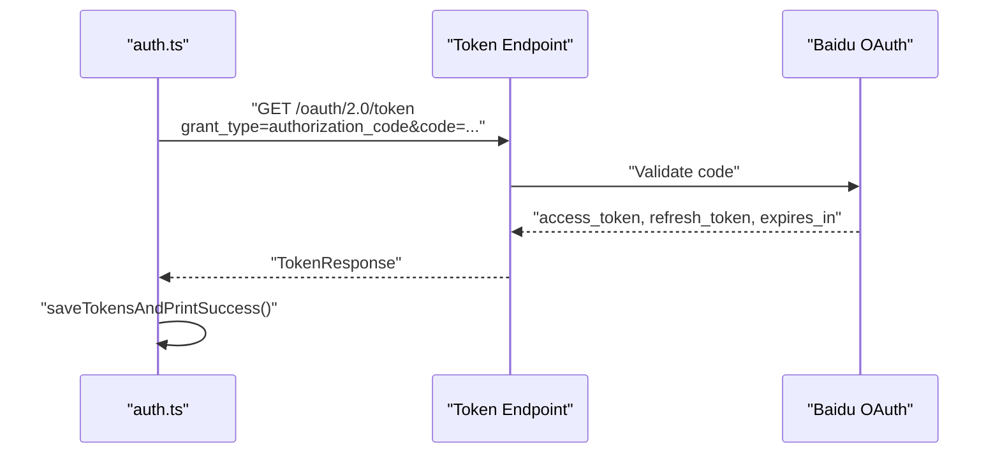
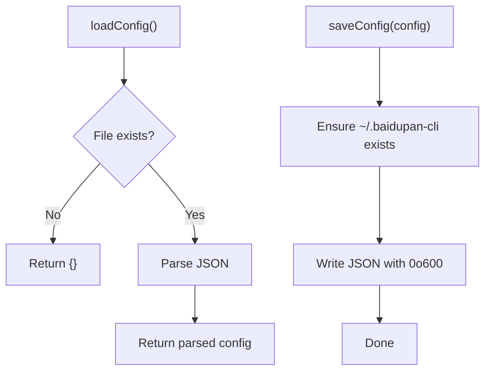
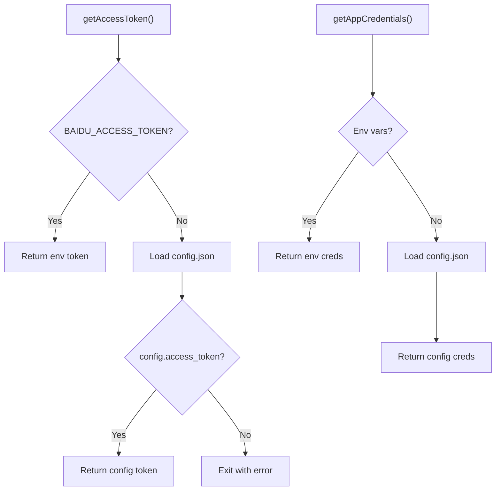
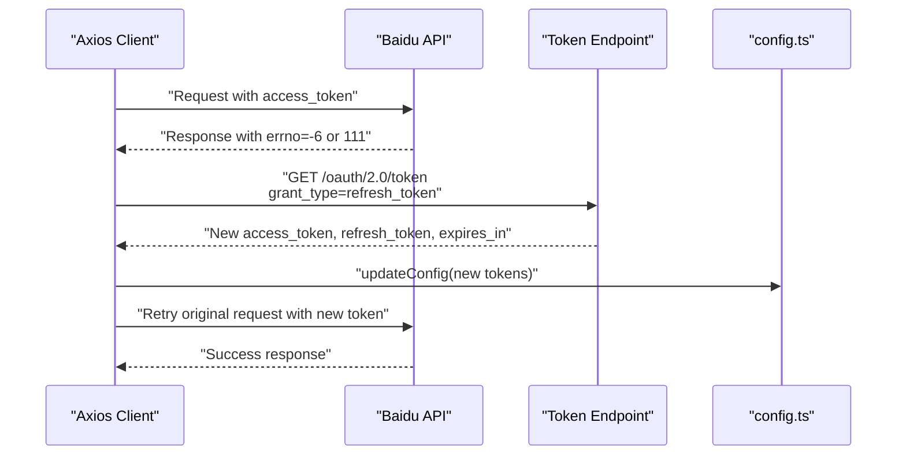
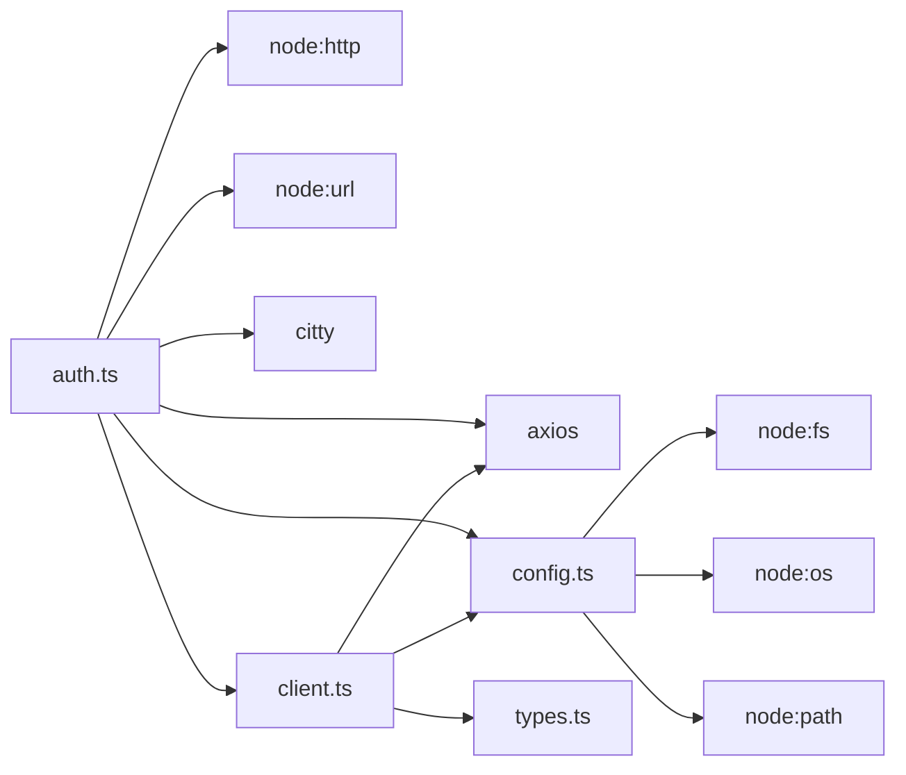

# Authentication System

<cite>
**Referenced Files in This Document**
- [auth.ts](file://src/commands/auth.ts)
- [client.ts](file://src/api/client.ts)
- [config.ts](file://src/utils/config.ts)
- [types.ts](file://src/api/types.ts)
- [index.ts](file://src/index.ts)
- [README.md](file://README.md)
- [package.json](file://package.json)
</cite>

## Table of Contents
1. [Introduction](#introduction)
2. [Project Structure](#project-structure)
3. [Core Components](#core-components)
4. [Architecture Overview](#architecture-overview)
5. [Detailed Component Analysis](#detailed-component-analysis)
6. [Dependency Analysis](#dependency-analysis)
7. [Performance Considerations](#performance-considerations)
8. [Troubleshooting Guide](#troubleshooting-guide)
9. [Conclusion](#conclusion)

## Introduction
This document provides comprehensive documentation for the authentication system component of the baidupan-cli project. It explains the OAuth 2.0 Authorization Code flow implementation, including local server handling for callbacks, token exchange, configuration management for secure storage of access and refresh tokens, environment variable precedence, automatic token refresh, and security considerations. Practical examples and troubleshooting guidance are included for common OAuth issues.

## Project Structure
The authentication system spans several modules:
- Command layer: authentication command handler that orchestrates the OAuth flow
- API client: manages token retrieval, refresh, and request interception
- Configuration utilities: persist and load tokens and credentials
- Type definitions: standardized API response and error codes
- Application entry: registers the authentication command

**Diagram sources**
- [auth.ts](file://src/commands/auth.ts#L1-L258)
- [client.ts](file://src/api/client.ts#L1-L171)
- [config.ts](file://src/utils/config.ts#L1-L62)
- [types.ts](file://src/api/types.ts#L1-L108)
- [index.ts](file://src/index.ts#L1-L26)
- [README.md](file://README.md#L1-L169)
- [package.json](file://package.json#L1-L81)

**Section sources**
- [auth.ts](file://src/commands/auth.ts#L1-L258)
- [client.ts](file://src/api/client.ts#L1-L171)
- [config.ts](file://src/utils/config.ts#L1-L62)
- [types.ts](file://src/api/types.ts#L1-L108)
- [index.ts](file://src/index.ts#L1-L26)
- [README.md](file://README.md#L1-L169)
- [package.json](file://package.json#L1-L81)

## Core Components
- OAuth 2.0 Authorization Code Flow: Implements the authorization endpoint, local callback server, and token exchange using the authorization code grant type.
- Local Callback Server: Starts a small HTTP server to receive the authorization code callback and opens the browser to initiate the authorization request.
- Token Exchange: Exchanges the authorization code for access and refresh tokens via the token endpoint.
- Configuration Management: Stores tokens and credentials in a user-specific config file with strict file permissions.
- Environment Variable Precedence: Supports environment variables for tokens and credentials, overriding stored configuration.
- Automatic Token Refresh: Detects token expiration errors and automatically refreshes tokens using the refresh token.
- Security: Uses HTTPS endpoints, secure file permissions, and avoids proxies for sensitive requests.

**Section sources**
- [auth.ts](file://src/commands/auth.ts#L46-L91)
- [client.ts](file://src/api/client.ts#L15-L104)
- [config.ts](file://src/utils/config.ts#L19-L45)
- [types.ts](file://src/api/types.ts#L99-L108)

## Architecture Overview
The authentication system follows a layered architecture:
- Command Layer: Provides CLI commands and orchestrates the OAuth flow.
- API Layer: Manages token lifecycle, request/response interceptors, and error handling.
- Configuration Layer: Handles secure persistence and retrieval of tokens and credentials.
- External Services: Interacts with Baidu Open Platform OAuth endpoints.

**Diagram sources**
- [auth.ts](file://src/commands/auth.ts#L93-L159)
- [auth.ts](file://src/commands/auth.ts#L161-L192)
- [config.ts](file://src/utils/config.ts#L35-L45)

## Detailed Component Analysis

### OAuth 2.0 Authorization Code Flow
The authentication command implements the Authorization Code grant type:
- Validates app key and secret key from CLI arguments or environment variables.
- Starts a local HTTP server to handle the OAuth callback.
- Opens the browser to the authorization endpoint with required parameters (response_type, client_id, redirect_uri, scope).
- Waits for the authorization code and exchanges it for tokens.
- Persists tokens and prints helpful usage information.

**Diagram sources**
- [auth.ts](file://src/commands/auth.ts#L46-L91)
- [auth.ts](file://src/commands/auth.ts#L93-L159)
- [auth.ts](file://src/commands/auth.ts#L161-L192)

**Section sources**
- [auth.ts](file://src/commands/auth.ts#L46-L91)
- [auth.ts](file://src/commands/auth.ts#L93-L159)
- [auth.ts](file://src/commands/auth.ts#L161-L192)

### Local Server Handling for Callbacks
The local server listens on a configurable port and path, validates the callback, extracts the authorization code, and responds to the browser. It enforces a 5-minute timeout and handles error responses from the OAuth provider.

**Diagram sources**
- [auth.ts](file://src/commands/auth.ts#L93-L159)

**Section sources**
- [auth.ts](file://src/commands/auth.ts#L93-L159)

### Token Exchange Process
The authorization code is exchanged for tokens using the token endpoint with the authorization_code grant type. The response includes access_token, refresh_token, and expires_in. Error handling checks for provider-side errors and throws descriptive messages.

**Diagram sources**
- [auth.ts](file://src/commands/auth.ts#L161-L192)

**Section sources**
- [auth.ts](file://src/commands/auth.ts#L161-L192)

### Configuration Management and Secure Storage
The configuration system persists tokens and credentials in a user-specific JSON file with restrictive permissions:
- Location: ~/.baidupan-cli/config.json (cross-platform)
- Permissions: Directory 0o700, file 0o600
- Fields: access_token, refresh_token, app_key, secret_key, expires_at
- Loading: Safe parsing with error handling
- Saving: Merge updates and write atomically

**Diagram sources**
- [config.ts](file://src/utils/config.ts#L19-L45)

**Section sources**
- [config.ts](file://src/utils/config.ts#L1-L62)

### Environment Variable Configuration Options
Environment variables take precedence over stored configuration:
- BAIDU_APP_KEY, BAIDU_SECRET_KEY: Used for app credentials
- BAIDU_ACCESS_TOKEN, BAIDU_REFRESH_TOKEN: Used for tokens
- getAppCredentials() merges environment and config
- getAccessToken() prioritizes environment variable
- getRefreshToken() prioritizes environment variable

**Diagram sources**
- [client.ts](file://src/api/client.ts#L15-L55)

**Section sources**
- [client.ts](file://src/api/client.ts#L15-L55)

### Token Persistence Mechanism
On successful authorization, tokens are saved with computed expiration timestamp. The save function ensures directory creation and writes with restricted permissions.

**Section sources**
- [auth.ts](file://src/commands/auth.ts#L218-L257)
- [config.ts](file://src/utils/config.ts#L35-L45)

### Automatic Token Refresh Functionality
The API client intercepts responses and detects token expiration errors (-6 or 111). It attempts to refresh the token using the refresh_token grant type and retries the original request with the new token. On success, it updates the in-memory token and persists the new tokens.

**Diagram sources**
- [client.ts](file://src/api/client.ts#L106-L161)
- [client.ts](file://src/api/client.ts#L63-L104)
- [config.ts](file://src/utils/config.ts#L50-L54)

**Section sources**
- [client.ts](file://src/api/client.ts#L106-L161)
- [client.ts](file://src/api/client.ts#L63-L104)
- [types.ts](file://src/api/types.ts#L99-L108)

### Security Considerations
- HTTPS endpoints: All OAuth endpoints use HTTPS.
- Secure file permissions: Config file is written with 0o600; directory with 0o700.
- No proxy for sensitive requests: Requests to OAuth endpoints disable proxy.
- Request/response interceptors: Centralized error handling and token refresh logic.
- Environment variable precedence: Enables secure credential injection without storing secrets in files.

**Section sources**
- [auth.ts](file://src/commands/auth.ts#L175-L180)
- [client.ts](file://src/api/client.ts#L74-L82)
- [config.ts](file://src/utils/config.ts#L37-L41)

## Dependency Analysis
The authentication system relies on:
- Node.js built-ins: http, url, child_process, fs, os, path
- External libraries: axios for HTTP requests, citty for CLI command definition
- Baidu Open Platform endpoints for OAuth

**Diagram sources**
- [auth.ts](file://src/commands/auth.ts#L1-L6)
- [client.ts](file://src/api/client.ts#L1-L4)
- [config.ts](file://src/utils/config.ts#L1-L3)

**Section sources**
- [auth.ts](file://src/commands/auth.ts#L1-L6)
- [client.ts](file://src/api/client.ts#L1-L4)
- [config.ts](file://src/utils/config.ts#L1-L3)
- [package.json](file://package.json#L49-L53)

## Performance Considerations
- Request timeouts: 10 seconds for token exchange, 30 seconds for general API requests.
- Single retry on token refresh failure: Reduces repeated failures and improves resilience.
- Minimal overhead: Local server runs only during authorization; token refresh happens transparently via interceptors.

[No sources needed since this section provides general guidance]

## Troubleshooting Guide
Common OAuth issues and resolutions:
- Invalid credentials (App Key or Secret Key):
  - Verify environment variables or CLI arguments.
  - Confirm credentials match those registered in the Baidu Open Platform.
- Network connectivity problems:
  - Ensure outbound access to Baidu OAuth endpoints.
  - Check for proxy interference; requests bypass proxies for OAuth endpoints.
- Authorization timeout:
  - Increase timeout window or ensure the local port is available.
  - Confirm the redirect URI matches the registered application settings.
- Token expiration errors:
  - Automatic refresh is handled; if manual intervention is needed, re-run the auth command.
- Permission errors saving config:
  - Check home directory permissions and available disk space.

Practical examples:
- First-time authorization with CLI arguments:
  - Run the auth command with app key and secret key parameters.
- Using environment variables:
  - Export BAIDU_APP_KEY and BAIDU_SECRET_KEY, then run the auth command without parameters.
- Copying configuration to another machine:
  - SCP the config file to the target host and export environment variables if desired.

**Section sources**
- [README.md](file://README.md#L135-L154)
- [auth.ts](file://src/commands/auth.ts#L51-L63)
- [auth.ts](file://src/commands/auth.ts#L149-L157)
- [client.ts](file://src/api/client.ts#L98-L101)

## Conclusion
The authentication system provides a robust, secure, and user-friendly OAuth 2.0 Authorization Code flow. It combines a local callback server, automatic token refresh, and secure configuration management with environment variable precedence. The design emphasizes safety through HTTPS, restricted file permissions, and centralized error handling, while maintaining simplicity for end users.