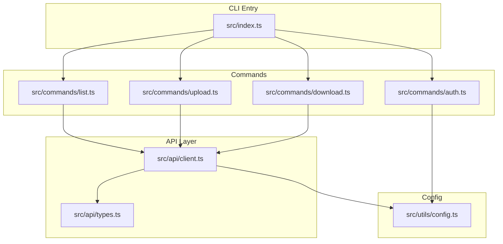
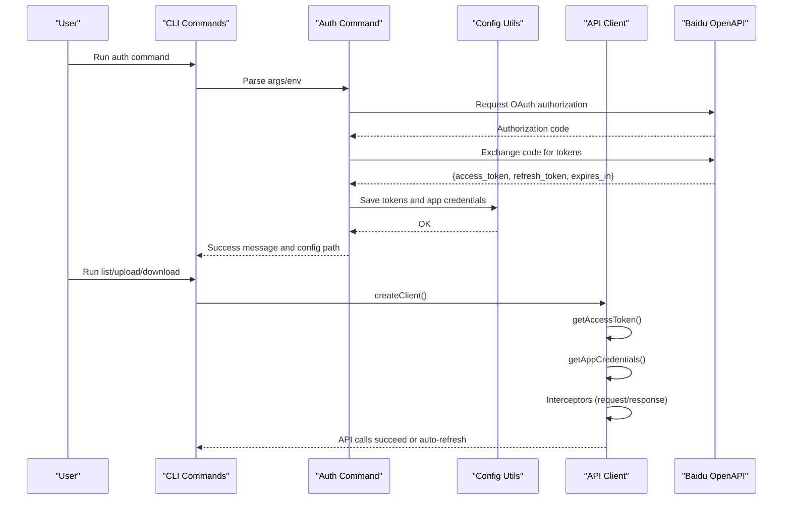
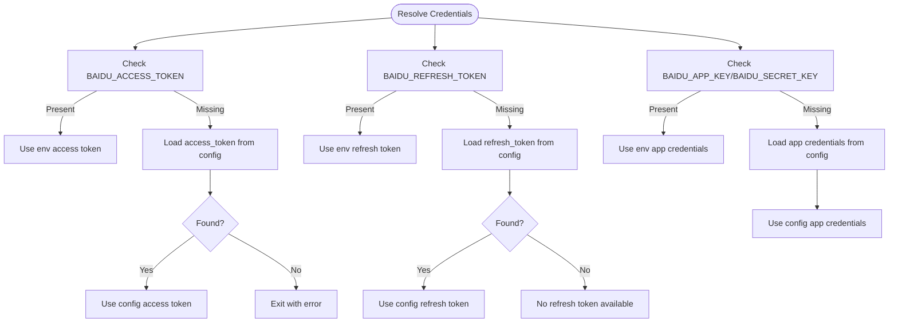
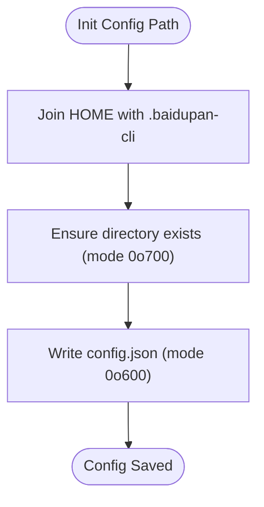
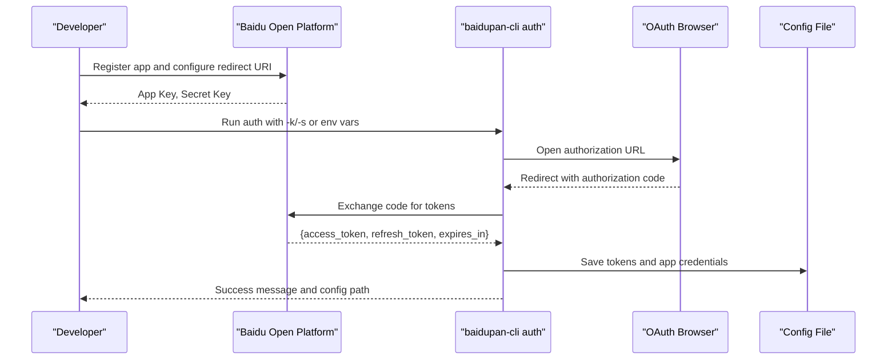
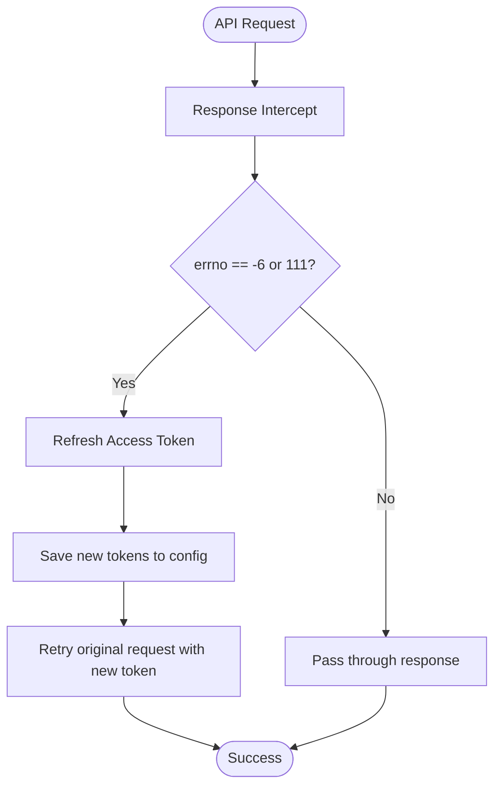
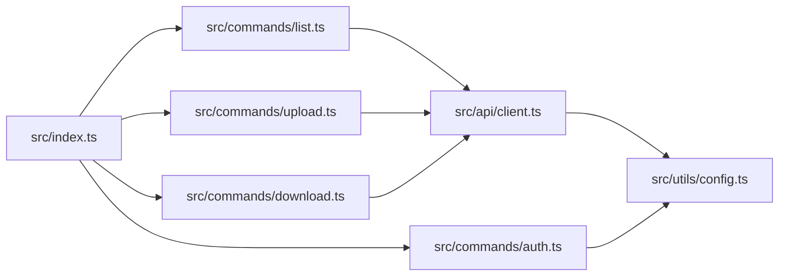

# Configuration and Setup

<cite>
**Referenced Files in This Document**
- [README.md](file://README.md)
- [package.json](file://package.json)
- [src/index.ts](file://src/index.ts)
- [src/api/client.ts](file://src/api/client.ts)
- [src/utils/config.ts](file://src/utils/config.ts)
- [src/commands/auth.ts](file://src/commands/auth.ts)
- [src/commands/list.ts](file://src/commands/list.ts)
- [src/commands/upload.ts](file://src/commands/upload.ts)
- [src/commands/download.ts](file://src/commands/download.ts)
- [src/api/types.ts](file://src/api/types.ts)
- [example/README.md](file://example/README.md)
</cite>

## Table of Contents
1. [Introduction](#introduction)
2. [Project Structure](#project-structure)
3. [Core Components](#core-components)
4. [Architecture Overview](#architecture-overview)
5. [Detailed Component Analysis](#detailed-component-analysis)
6. [Dependency Analysis](#dependency-analysis)
7. [Performance Considerations](#performance-considerations)
8. [Troubleshooting Guide](#troubleshooting-guide)
9. [Conclusion](#conclusion)
10. [Appendices](#appendices)

## Introduction
This document explains the configuration management system for the Baidu Pan CLI tool. It covers environment variable configuration options, the configuration file structure and location, the application setup process for Baidu Pan Open Platform registration and app creation, and the precedence model used to resolve credentials and tokens. It also provides step-by-step setup guides, troubleshooting tips, and best practices for secure configuration management across development and production environments.

## Project Structure
The configuration system spans several modules:
- Command entrypoint defines subcommands and routes to specific commands.
- Authentication command handles OAuth flow and persists tokens to the configuration file.
- API client resolves credentials and tokens from environment variables or the configuration file, with automatic token refresh.
- Configuration utilities manage the local configuration file in the user’s home directory.

**Diagram sources**
- [src/index.ts](file://src/index.ts#L1-L26)
- [src/commands/auth.ts](file://src/commands/auth.ts#L1-L258)
- [src/commands/list.ts](file://src/commands/list.ts#L1-L81)
- [src/commands/upload.ts](file://src/commands/upload.ts#L1-L144)
- [src/commands/download.ts](file://src/commands/download.ts#L1-L104)
- [src/api/client.ts](file://src/api/client.ts#L1-L171)
- [src/api/types.ts](file://src/api/types.ts#L1-L108)
- [src/utils/config.ts](file://src/utils/config.ts#L1-L62)

**Section sources**
- [src/index.ts](file://src/index.ts#L1-L26)
- [src/api/client.ts](file://src/api/client.ts#L1-L171)
- [src/utils/config.ts](file://src/utils/config.ts#L1-L62)

## Core Components
- Environment variables:
  - BAIDU_APP_KEY: Application key for Baidu Pan Open Platform.
  - BAIDU_SECRET_KEY: Application secret for Baidu Pan Open Platform.
  - BAIDU_ACCESS_TOKEN: Access token for API requests.
  - BAIDU_REFRESH_TOKEN: Refresh token used to renew access tokens.
- Configuration file:
  - Location: ~/.baidupan-cli/config.json on Unix-like systems and %USERPROFILE%\.baidupan-cli\config.json on Windows.
  - Fields: access_token, refresh_token, app_key, secret_key, expires_at (timestamp).
- Precedence model:
  - For tokens and app credentials, environment variables take precedence over stored configuration.
  - Tokens are cached in memory during runtime to avoid repeated file reads.

**Section sources**
- [src/api/client.ts](file://src/api/client.ts#L11-L55)
- [src/utils/config.ts](file://src/utils/config.ts#L8-L14)
- [README.md](file://README.md#L118-L134)

## Architecture Overview
The configuration architecture integrates environment variables, a local configuration file, and automatic token refresh. The API client resolves credentials and tokens in a prioritized manner and intercepts requests/responses to handle token expiration transparently.

**Diagram sources**
- [src/commands/auth.ts](file://src/commands/auth.ts#L46-L91)
- [src/api/client.ts](file://src/api/client.ts#L15-L104)
- [src/utils/config.ts](file://src/utils/config.ts#L35-L54)

## Detailed Component Analysis

### Environment Variables and Precedence
- Resolution order:
  - Access token: Environment variable BAIDU_ACCESS_TOKEN takes precedence; otherwise read from configuration file.
  - Refresh token: Environment variable BAIDU_REFRESH_TOKEN takes precedence; otherwise read from configuration file.
  - App credentials: BAIDU_APP_KEY and BAIDU_SECRET_KEY are read from environment variables if present; otherwise from configuration file.
- Behavior:
  - If tokens are missing, the API client prints an error and exits.
  - On token expiration, the client attempts to refresh using the refresh token and saves the new tokens to the configuration file.

**Diagram sources**
- [src/api/client.ts](file://src/api/client.ts#L15-L55)

**Section sources**
- [src/api/client.ts](file://src/api/client.ts#L11-L55)

### Configuration File Structure and Location
- Location:
  - Unix-like systems: ~/.baidupan-cli/config.json
  - Windows: %USERPROFILE%\.baidupan-cli\config.json
- Format:
  - JSON object containing optional fields: access_token, refresh_token, app_key, secret_key, expires_at (timestamp).
- Persistence:
  - The authentication command writes the configuration file with restricted permissions.
  - The API client reads and updates the configuration file when refreshing tokens.

**Diagram sources**
- [src/utils/config.ts](file://src/utils/config.ts#L5-L44)

**Section sources**
- [src/utils/config.ts](file://src/utils/config.ts#L5-L62)
- [README.md](file://README.md#L129-L134)

### Application Setup: Baidu Pan Open Platform Registration
- Steps:
  - Register and create an application on the Baidu Pan Open Platform.
  - Obtain the App Key and Secret Key.
  - Add the redirect URI to the app settings. The default is http://localhost:9876/callback.
- Usage:
  - Provide credentials via command-line arguments or environment variables.
  - Run the auth command to complete OAuth and persist tokens to the configuration file.

**Diagram sources**
- [src/commands/auth.ts](file://src/commands/auth.ts#L46-L91)
- [README.md](file://README.md#L17-L41)

**Section sources**
- [README.md](file://README.md#L17-L41)
- [src/commands/auth.ts](file://src/commands/auth.ts#L46-L91)

### Configuration Scenarios and Migration
- Development machine:
  - Store tokens locally in the configuration file.
  - Optionally export environment variables for convenience.
- CI/CD or shared servers:
  - Prefer environment variables for tokens and app credentials.
  - Copy the configuration file to the target host if needed.
- Migration between environments:
  - Export environment variables on the source machine.
  - Import equivalent environment variables on the destination machine.
  - Alternatively, copy the configuration file to the destination user’s home directory under the same path.

Best practices:
- Never commit secrets to version control.
- Use separate environment variables per environment (development, staging, production).
- Restrict file permissions on the configuration file to prevent unauthorized access.

**Section sources**
- [README.md](file://README.md#L118-L134)
- [src/commands/auth.ts](file://src/commands/auth.ts#L242-L256)
- [src/utils/config.ts](file://src/utils/config.ts#L35-L44)

### Automatic Token Refresh and Error Handling
- Token refresh:
  - When access token expires, the client attempts to refresh using the refresh token and app credentials.
  - On success, the new tokens are saved to the configuration file and reused for subsequent requests.
- Error handling:
  - The API client intercepts responses and throws errors for known Baidu API error codes.
  - On token expiration, it retries the original request with the new token.

**Diagram sources**
- [src/api/client.ts](file://src/api/client.ts#L124-L150)
- [src/api/client.ts](file://src/api/client.ts#L63-L104)
- [src/api/types.ts](file://src/api/types.ts#L99-L107)

**Section sources**
- [src/api/client.ts](file://src/api/client.ts#L124-L150)
- [src/api/client.ts](file://src/api/client.ts#L63-L104)
- [src/api/types.ts](file://src/api/types.ts#L99-L107)

## Dependency Analysis
- CLI entrypoint registers subcommands for auth, list, upload, and download.
- Commands depend on the API client to create authenticated clients.
- The API client depends on configuration utilities to load and update tokens.
- The authentication command depends on configuration utilities to persist tokens.

**Diagram sources**
- [src/index.ts](file://src/index.ts#L8-L23)
- [src/commands/list.ts](file://src/commands/list.ts#L1-L81)
- [src/commands/upload.ts](file://src/commands/upload.ts#L1-L144)
- [src/commands/download.ts](file://src/commands/download.ts#L1-L104)
- [src/api/client.ts](file://src/api/client.ts#L1-L171)
- [src/utils/config.ts](file://src/utils/config.ts#L1-L62)

**Section sources**
- [src/index.ts](file://src/index.ts#L8-L23)
- [src/api/client.ts](file://src/api/client.ts#L1-L171)
- [src/utils/config.ts](file://src/utils/config.ts#L1-L62)

## Performance Considerations
- Token caching:
  - Access tokens are cached in memory to reduce repeated file reads.
- File permissions:
  - Configuration files are written with restrictive permissions to protect sensitive data.
- Network timeouts:
  - Requests include timeouts and bypass proxies to ensure predictable behavior.

[No sources needed since this section provides general guidance]

## Troubleshooting Guide
Common issues and resolutions:
- Missing app credentials:
  - Ensure BAIDU_APP_KEY and BAIDU_SECRET_KEY are set via environment variables or provided as command-line arguments.
- Missing access token:
  - Run the auth command to obtain and persist tokens.
- Redirect URI mismatch:
  - Confirm the redirect URI configured in Baidu Pan Open Platform matches the one used by the CLI (default: http://localhost:9876/callback).
- Port conflicts:
  - Change the local port used by the auth command if 9876 is occupied.
- Token expiration:
  - The client automatically refreshes tokens when encountering expiration errors.

**Section sources**
- [README.md](file://README.md#L135-L154)
- [src/commands/auth.ts](file://src/commands/auth.ts#L51-L63)
- [src/api/client.ts](file://src/api/client.ts#L134-L143)

## Conclusion
The configuration management system provides a robust, layered approach to credential resolution with environment variables taking precedence over stored configuration. It supports seamless authentication, automatic token refresh, and secure storage of sensitive data. By following the setup steps and best practices outlined here, you can reliably configure the CLI for development and production environments.

[No sources needed since this section summarizes without analyzing specific files]

## Appendices

### Environment Variable Reference
- BAIDU_APP_KEY: Application key for Baidu Pan Open Platform.
- BAIDU_SECRET_KEY: Application secret for Baidu Pan Open Platform.
- BAIDU_ACCESS_TOKEN: Access token for API requests.
- BAIDU_REFRESH_TOKEN: Refresh token used to renew access tokens.

**Section sources**
- [src/api/client.ts](file://src/api/client.ts#L20-L54)
- [README.md](file://README.md#L118-L127)

### Configuration File Reference
- Location:
  - Unix-like systems: ~/.baidupan-cli/config.json
  - Windows: %USERPROFILE%\.baidupan-cli\config.json
- Fields:
  - access_token: Persisted access token.
  - refresh_token: Persisted refresh token.
  - app_key: Application key.
  - secret_key: Application secret.
  - expires_at: Expiration timestamp.

**Section sources**
- [src/utils/config.ts](file://src/utils/config.ts#L5-L14)
- [README.md](file://README.md#L129-L134)

### Example Usage References
- Initial setup and environment variables:
  - [README.md](file://README.md#L17-L41)
  - [README.md](file://README.md#L118-L127)
- Example scripts and configuration verification:
  - [example/README.md](file://example/README.md#L29-L40)
  - [example/README.md](file://example/README.md#L103-L105)
