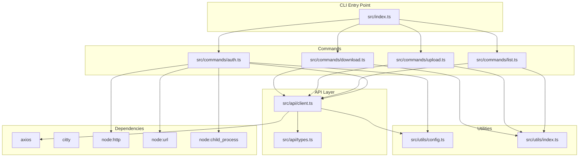
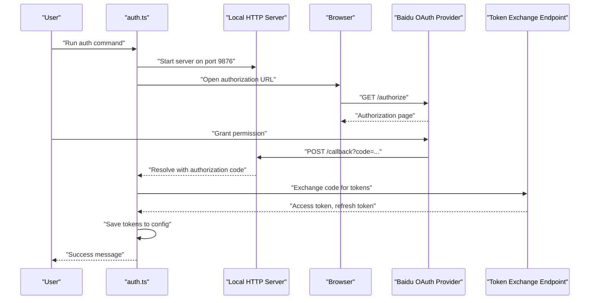
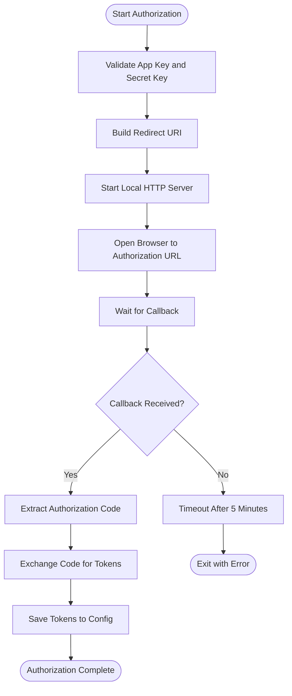
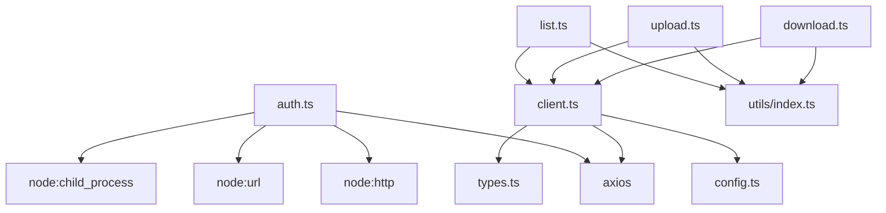

# OAuth 2.0 Flow Implementation

<cite>
**Referenced Files in This Document**
- [src/commands/auth.ts](file://src/commands/auth.ts)
- [src/api/client.ts](file://src/api/client.ts)
- [src/utils/config.ts](file://src/utils/config.ts)
- [src/index.ts](file://src/index.ts)
- [src/api/types.ts](file://src/api/types.ts)
- [src/commands/download.ts](file://src/commands/download.ts)
- [src/commands/list.ts](file://src/commands/list.ts)
- [src/commands/upload.ts](file://src/commands/upload.ts)
- [src/utils/index.ts](file://src/utils/index.ts)
- [package.json](file://package.json)
- [README.md](file://README.md)
</cite>

## Table of Contents
1. [Introduction](#introduction)
2. [Project Structure](#project-structure)
3. [Core Components](#core-components)
4. [Architecture Overview](#architecture-overview)
5. [Detailed Component Analysis](#detailed-component-analysis)
6. [Dependency Analysis](#dependency-analysis)
7. [Performance Considerations](#performance-considerations)
8. [Troubleshooting Guide](#troubleshooting-guide)
9. [Conclusion](#conclusion)

## Introduction
This document explains the OAuth 2.0 authorization flow implementation for the Baidu Pan CLI tool. It covers the authorization code grant type workflow, including the three main phases: authorization request, callback handling, and token exchange. It also documents the local server implementation for handling OAuth callbacks, browser automation across platforms, and practical examples of the complete OAuth flow from initiation to successful authorization.

## Project Structure
The project follows a modular structure with clear separation of concerns:
- Command-line interface entry point defines subcommands for authentication, file listing, uploading, and downloading.
- Authentication command implements the OAuth 2.0 flow using a local HTTP server and browser automation.
- API client manages access tokens, refreshes expired tokens automatically, and handles Baidu Pan API requests.
- Configuration utilities persist and load authentication credentials securely.
- Supporting utilities provide file operations and formatting helpers.

**Diagram sources**
- [src/index.ts](file://src/index.ts#L1-L26)
- [src/commands/auth.ts](file://src/commands/auth.ts#L1-L258)
- [src/api/client.ts](file://src/api/client.ts#L1-L171)
- [src/utils/config.ts](file://src/utils/config.ts#L1-L62)
- [src/utils/index.ts](file://src/utils/index.ts#L1-L110)
- [src/api/types.ts](file://src/api/types.ts#L1-L108)

**Section sources**
- [src/index.ts](file://src/index.ts#L1-L26)
- [package.json](file://package.json#L1-L81)

## Core Components
- OAuth 2.0 Authorization Command: Implements the authorization code grant flow, including local server setup, browser automation, callback handling, and token exchange.
- API Client: Manages access tokens, refreshes expired tokens automatically, and intercepts requests/responses to handle token lifecycle.
- Configuration Manager: Persists and loads authentication credentials securely to a user-specific configuration file.
- Supporting Utilities: Provide file operations, path normalization, and progress reporting.

**Section sources**
- [src/commands/auth.ts](file://src/commands/auth.ts#L1-L258)
- [src/api/client.ts](file://src/api/client.ts#L1-L171)
- [src/utils/config.ts](file://src/utils/config.ts#L1-L62)
- [src/utils/index.ts](file://src/utils/index.ts#L1-L110)

## Architecture Overview
The OAuth 2.0 flow is orchestrated by the authentication command, which:
1. Starts a local HTTP server to receive the authorization callback.
2. Opens the browser to the authorization endpoint with configured parameters.
3. Waits for the callback containing the authorization code.
4. Exchanges the authorization code for access and refresh tokens.
5. Saves tokens to the configuration file and prints success information.

**Diagram sources**
- [src/commands/auth.ts](file://src/commands/auth.ts#L93-L159)
- [src/commands/auth.ts](file://src/commands/auth.ts#L161-L192)
- [src/api/client.ts](file://src/api/client.ts#L112-L161)
- [src/utils/config.ts](file://src/utils/config.ts#L35-L54)

## Detailed Component Analysis

### OAuth 2.0 Authorization Command
The authorization command implements the authorization code grant type workflow:
- Validates required parameters (App Key and Secret Key) and supports environment variables.
- Configures redirect URI either as a custom URL or the default localhost callback.
- Starts a local HTTP server to listen for the authorization callback.
- Opens the browser to the authorization endpoint with required parameters.
- Handles callback errors and extracts the authorization code.
- Exchanges the authorization code for tokens and saves them to the configuration file.
- Implements a five-minute timeout for the authorization process.

**Diagram sources**
- [src/commands/auth.ts](file://src/commands/auth.ts#L46-L91)
- [src/commands/auth.ts](file://src/commands/auth.ts#L93-L159)
- [src/commands/auth.ts](file://src/commands/auth.ts#L161-L192)
- [src/utils/config.ts](file://src/utils/config.ts#L35-L54)

**Section sources**
- [src/commands/auth.ts](file://src/commands/auth.ts#L1-L258)

### Local Server Implementation
The local server handles OAuth callbacks with the following characteristics:
- Default host and port configuration for the callback endpoint.
- Path-based routing to match the redirect path.
- Extraction of authorization code and error parameters from the callback URL.
- Immediate response to the browser upon receiving the code or error.
- Graceful shutdown of the server after successful authorization or error.
- Five-minute timeout to prevent indefinite waiting.

Security considerations:
- The server listens locally and responds only to the configured redirect path.
- The authorization code is extracted from the query parameters and not persisted.
- The server closes immediately after receiving the callback to minimize exposure.

**Section sources**
- [src/commands/auth.ts](file://src/commands/auth.ts#L8-L11)
- [src/commands/auth.ts](file://src/commands/auth.ts#L93-L159)

### Browser Automation Across Platforms
The browser automation opens the authorization URL using platform-specific commands:
- macOS: Uses the `open` command.
- Windows: Uses the `start` command.
- Linux and others: Uses `xdg-open`.

Fallback behavior:
- If automatic browser opening fails, the command logs the authorization URL for manual access.
- The authorization URL is constructed with the required parameters and printed to the console.

**Section sources**
- [src/commands/auth.ts](file://src/commands/auth.ts#L194-L216)

### Token Exchange and Storage
The token exchange process:
- Sends a GET request to the token endpoint with the authorization code, client credentials, and redirect URI.
- Sets a timeout for the token exchange request.
- Parses the response to extract access and refresh tokens.
- Handles error responses from the OAuth provider.
- Saves tokens to the configuration file with expiration timestamp.

Automatic token refresh:
- The API client checks for token expiration errors and attempts to refresh tokens automatically.
- On successful refresh, it retries the original request with the new token.

**Section sources**
- [src/commands/auth.ts](file://src/commands/auth.ts#L161-L192)
- [src/api/client.ts](file://src/api/client.ts#L63-L104)
- [src/api/client.ts](file://src/api/client.ts#L112-L161)
- [src/utils/config.ts](file://src/utils/config.ts#L35-L54)

### Practical OAuth Flow Examples
Complete end-to-end example:
- Initialize the authorization command with App Key and Secret Key.
- The command starts a local server and opens the browser to the authorization URL.
- The user grants permission on the OAuth provider page.
- The provider redirects to the local callback URL with an authorization code.
- The command exchanges the code for tokens and saves them to the configuration file.
- Subsequent commands automatically use the saved tokens for API requests.

Common scenarios:
- Successful authorization: The command prints success information and token details.
- Authorization failure: The command displays the error message from the OAuth provider and exits.
- Timeout: The command exits with a timeout error after five minutes.
- Network connectivity issues: The command reports HTTP errors or timeouts during token exchange.

**Section sources**
- [src/commands/auth.ts](file://src/commands/auth.ts#L76-L91)
- [src/commands/auth.ts](file://src/commands/auth.ts#L102-L107)
- [src/commands/auth.ts](file://src/commands/auth.ts#L154-L157)
- [src/commands/auth.ts](file://src/commands/auth.ts#L167-L192)

### Error Handling and Security Considerations
Error handling:
- Missing App Key or Secret Key: The command exits with an error message and usage instructions.
- Authorization failures: The command reads the error parameter from the callback and rejects the promise.
- Token exchange errors: The command parses error responses and throws descriptive errors.
- Network errors: The command catches HTTP errors and timeouts during token exchange.

Security considerations:
- Tokens are stored in a user-specific configuration file with restricted permissions.
- Environment variables can override stored credentials for flexible deployment.
- The local server only accepts the configured redirect path and closes after use.

**Section sources**
- [src/commands/auth.ts](file://src/commands/auth.ts#L51-L63)
- [src/commands/auth.ts](file://src/commands/auth.ts#L102-L107)
- [src/commands/auth.ts](file://src/commands/auth.ts#L182-L189)
- [src/utils/config.ts](file://src/utils/config.ts#L35-L54)

## Dependency Analysis
The OAuth implementation relies on several key dependencies and internal modules:
- axios: Used for HTTP requests to the OAuth provider and Baidu Pan APIs.
- citty: Provides command definition and argument parsing.
- node:http and node:url: Used to create and parse the local HTTP server and URLs.
- node:child_process: Used to open the browser on different platforms.

**Diagram sources**
- [src/commands/auth.ts](file://src/commands/auth.ts#L1-L6)
- [src/api/client.ts](file://src/api/client.ts#L1-L4)
- [src/utils/index.ts](file://src/utils/index.ts#L1-L110)

**Section sources**
- [package.json](file://package.json#L49-L72)
- [src/commands/auth.ts](file://src/commands/auth.ts#L1-L6)
- [src/api/client.ts](file://src/api/client.ts#L1-L4)

## Performance Considerations
- Local server startup and callback handling are lightweight and synchronous, minimizing overhead.
- Token exchange uses a short timeout to prevent hanging requests.
- Automatic token refresh avoids repeated authorization prompts and reduces latency for subsequent API calls.
- File operations leverage streaming and chunked uploads to handle large files efficiently.

## Troubleshooting Guide
Common issues and resolutions:
- Invalid credentials: Ensure App Key and Secret Key are correct and match the application settings.
- Redirect URI mismatch: Verify the redirect URI matches the configured value in the OAuth provider settings.
- Port conflicts: Change the local server port if port 9876 is occupied.
- Browser automation failures: Manually open the authorization URL printed to the console.
- Network connectivity: Confirm access to the OAuth provider and Baidu Pan APIs; disable conflicting proxies.
- Token expiration: The client automatically refreshes tokens; if refresh fails, re-run the authorization command.

**Section sources**
- [README.md](file://README.md#L135-L149)
- [src/commands/auth.ts](file://src/commands/auth.ts#L51-L63)
- [src/commands/auth.ts](file://src/commands/auth.ts#L154-L157)
- [src/api/client.ts](file://src/api/client.ts#L63-L104)

## Conclusion
The OAuth 2.0 implementation provides a robust, cross-platform authorization flow with secure token storage and automatic refresh capabilities. The local server and browser automation simplify the user experience while maintaining security through controlled callback handling and prompt error reporting. The modular architecture ensures maintainability and extensibility for future enhancements.
