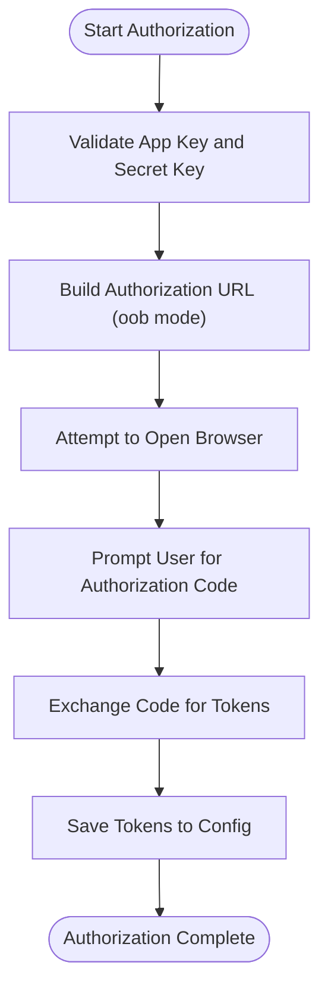

# OAuth 2.0 Flow Implementation

<cite>
**Referenced Files in This Document**
- [src/commands/auth.ts](file://src/commands/auth.ts)
- [src/api/client.ts](file://src/api/client.ts)
- [src/api/token.ts](file://src/api/token.ts)
- [src/api/http.ts](file://src/api/http.ts)
- [src/utils/config.ts](file://src/utils/config.ts)
- [src/index.ts](file://src/index.ts)
- [src/api/types.ts](file://src/api/types.ts)
- [src/commands/download.ts](file://src/commands/download.ts)
- [src/commands/list.ts](file://src/commands/list.ts)
- [src/commands/upload.ts](file://src/commands/upload.ts)
- [src/utils/index.ts](file://src/utils/index.ts)
- [package.json](file://package.json)
</cite>

## Update Summary
**Changes Made**
- Updated OAuth flow documentation to reflect the simplified OOB (out-of-band) authorization approach
- Removed references to local HTTP server implementation and automatic callback handling
- Updated browser automation section to reflect the current manual authorization process
- Revised practical examples to show the streamlined authorization workflow
- Updated troubleshooting guide to address OOB-specific scenarios

## Table of Contents
1. [Introduction](#introduction)
2. [Project Structure](#project-structure)
3. [Core Components](#core-components)
4. [Architecture Overview](#architecture-overview)
5. [Detailed Component Analysis](#detailed-component-analysis)
6. [Dependency Analysis](#dependency-analysis)
7. [Performance Considerations](#performance-considerations)
8. [Troubleshooting Guide](#troubleshooting-guide)
9. [Conclusion](#conclusion)

## Introduction
This document explains the OAuth 2.0 authorization flow implementation for the Baidu Pan CLI tool. The implementation uses the simplified out-of-band (OOB) authorization flow, where users manually authorize the application and copy the authorization code. This approach eliminates the complexity of setting up a local HTTP server and automatic callback handling, providing a more straightforward authorization experience.

## Project Structure
The project follows a modular structure with clear separation of concerns:
- Command-line interface entry point defines subcommands for authentication, file listing, uploading, and downloading.
- Authentication command implements the OAuth 2.0 flow using manual authorization with 'oob' mode.
- API client manages access tokens, refreshes expired tokens automatically, and handles Baidu Pan API requests.
- Configuration utilities persist and load authentication credentials securely.
- Supporting utilities provide file operations and formatting helpers.

```mermaid
graph TB
subgraph "CLI Entry Point"
IDX["src/index.ts"]
end
subgraph "Commands"
AUTH["src/commands/auth.ts"]
LIST["src/commands/list.ts"]
UPLOAD["src/commands/upload.ts"]
DOWNLOAD["src/commands/download.ts"]
end
subgraph "API Layer"
CLIENT["src/api/client.ts"]
TOKEN["src/api/token.ts"]
HTTP["src/api/http.ts"]
TYPES["src/api/types.ts"]
end
subgraph "Utilities"
CONFIG["src/utils/config.ts"]
UTILS["src/utils/index.ts"]
end
subgraph "Dependencies"
AXIOS["axios"]
CITTY["citty"]
NODE_CHILD["node:child_process"]
ENDPOINTS["Baidu OAuth Endpoints"]
ENDPOINTS --> HTTP
ENDPOINTS --> TOKEN
ENDPOINTS --> AUTH
```

**Diagram sources**
- [src/index.ts](file://src/index.ts#L1-L49)
- [src/commands/auth.ts](file://src/commands/auth.ts#L1-L196)
- [src/api/client.ts](file://src/api/client.ts#L1-L69)
- [src/api/token.ts](file://src/api/token.ts#L1-L137)
- [src/api/http.ts](file://src/api/http.ts#L1-L66)
- [src/utils/config.ts](file://src/utils/config.ts#L1-L62)
- [src/utils/index.ts](file://src/utils/index.ts#L1-L111)

**Section sources**
- [src/index.ts](file://src/index.ts#L1-L49)
- [package.json](file://package.json#L1-L98)

## Core Components
- OAuth 2.0 Authorization Command: Implements the simplified OOB authorization flow, including browser automation, manual code collection, and token exchange.
- API Client: Manages access tokens, refreshes expired tokens automatically, and intercepts requests/responses to handle token lifecycle.
- Token Manager: Handles token retrieval, refresh logic, and automatic token persistence.
- Configuration Manager: Persists and loads authentication credentials securely to a user-specific configuration file.
- Supporting Utilities: Provide file operations, path normalization, and progress reporting.

**Section sources**
- [src/commands/auth.ts](file://src/commands/auth.ts#L1-L196)
- [src/api/client.ts](file://src/api/client.ts#L1-L69)
- [src/api/token.ts](file://src/api/token.ts#L1-L137)
- [src/utils/config.ts](file://src/utils/config.ts#L1-L62)
- [src/utils/index.ts](file://src/utils/index.ts#L1-L111)

## Architecture Overview
The OAuth 2.0 flow is orchestrated by the authentication command, which:
1. Generates an authorization URL with 'oob' redirect URI.
2. Attempts to automatically open the browser to the authorization endpoint.
3. Prompts the user to grant permission and copy the authorization code.
4. Exchanges the authorization code for access and refresh tokens.
5. Saves tokens to the configuration file and prints success information.


**Diagram sources**
- [src/commands/auth.ts](file://src/commands/auth.ts#L58-L86)
- [src/commands/auth.ts](file://src/commands/auth.ts#L112-L140)
- [src/commands/auth.ts](file://src/commands/auth.ts#L166-L195)
- [src/api/token.ts](file://src/api/token.ts#L78-L118)

## Detailed Component Analysis

### OAuth 2.0 Authorization Command
The authorization command implements the simplified OOB authorization flow:
- Validates required parameters (App Key and Secret Key) and supports environment variables.
- Configures redirect URI as 'oob' (out-of-band) mode for manual authorization.
- Generates the authorization URL with required parameters (response_type, client_id, redirect_uri, scope).
- Attempts to automatically open the browser to the authorization endpoint.
- Prompts the user to manually enter the authorization code after granting permission.
- Exchanges the authorization code for tokens and saves them to the configuration file.

**Updated** Simplified from complex local server implementation to streamlined OOB flow with manual code entry.



**Diagram sources**
- [src/commands/auth.ts](file://src/commands/auth.ts#L38-L86)
- [src/commands/auth.ts](file://src/commands/auth.ts#L89-L96)
- [src/commands/auth.ts](file://src/commands/auth.ts#L112-L140)
- [src/commands/auth.ts](file://src/commands/auth.ts#L166-L195)

**Section sources**
- [src/commands/auth.ts](file://src/commands/auth.ts#L1-L196)

### Browser Automation and Manual Authorization
The browser automation attempts to open the authorization URL using platform-specific commands:
- macOS: Uses the `open` command.
- Windows: Uses the `start` command.
- Linux and others: Uses `xdg-open`.

Fallback behavior:
- If automatic browser opening fails, the command logs the authorization URL for manual access.
- The authorization URL is constructed with the required parameters and printed to the console.
- Users manually copy the authorization code from the OAuth provider page after granting permission.

**Updated** Maintains browser automation but removes local server callback handling in favor of manual code entry.

**Section sources**
- [src/commands/auth.ts](file://src/commands/auth.ts#L142-L164)
- [src/commands/auth.ts](file://src/commands/auth.ts#L68-L76)

### Token Exchange and Storage
The token exchange process:
- Sends a GET request to the token endpoint with the authorization code, client credentials, and 'oob' redirect URI.
- Parses the response to extract access and refresh tokens.
- Handles error responses from the OAuth provider.
- Saves tokens to the configuration file with expiration timestamp and application credentials.

Automatic token refresh:
- The API client checks for token expiration errors and attempts to refresh tokens automatically.
- On successful refresh, it retries the original request with the new token.
- Token manager handles environment variable precedence and automatic persistence.

**Section sources**
- [src/commands/auth.ts](file://src/commands/auth.ts#L112-L140)
- [src/api/token.ts](file://src/api/token.ts#L78-L118)
- [src/utils/config.ts](file://src/utils/config.ts#L35-L54)

### Practical OAuth Flow Examples
Complete end-to-end example:
- Initialize the authorization command with App Key and Secret Key.
- The command generates an authorization URL with 'oob' redirect URI.
- The command attempts to open the browser automatically to the authorization URL.
- The user grants permission on the OAuth provider page and copies the authorization code.
- The user enters the authorization code when prompted by the CLI.
- The command exchanges the code for tokens and saves them to the configuration file.
- Subsequent commands automatically use the saved tokens for API requests.

Common scenarios:
- Successful authorization: The command prints success information and token details.
- Authorization failure: The command displays the error message from the OAuth provider and exits.
- Invalid authorization code: The command validates the code and rejects empty inputs.
- Network connectivity issues: The command reports HTTP errors or timeouts during token exchange.

**Updated** Simplified from complex callback handling to manual code entry workflow.

**Section sources**
- [src/commands/auth.ts](file://src/commands/auth.ts#L61-L86)
- [src/commands/auth.ts](file://src/commands/auth.ts#L112-L140)
- [src/commands/auth.ts](file://src/commands/auth.ts#L166-L195)

### Error Handling and Security Considerations
Error handling:
- Missing App Key or Secret Key: The command exits with an error message and usage instructions.
- Authorization failures: The command reads the error parameter from the OAuth provider response and throws descriptive errors.
- Token exchange errors: The command parses error responses and throws descriptive errors.
- Network errors: The command catches HTTP errors and timeouts during token exchange.

Security considerations:
- Tokens are stored in a user-specific configuration file with restricted permissions.
- Environment variables can override stored credentials for flexible deployment.
- The 'oob' redirect URI prevents unauthorized access and simplifies security.
- Authorization codes are handled as temporary values and not persisted.

**Updated** Removed local server security considerations in favor of OOB mode security model.

**Section sources**
- [src/commands/auth.ts](file://src/commands/auth.ts#L44-L56)
- [src/commands/auth.ts](file://src/commands/auth.ts#L130-L137)
- [src/utils/config.ts](file://src/utils/config.ts#L35-L54)

## Dependency Analysis
The OAuth implementation relies on several key dependencies and internal modules:
- axios: Used for HTTP requests to the OAuth provider and Baidu Pan APIs.
- citty: Provides command definition and argument parsing.
- node:child_process: Used to open the browser on different platforms.
- axios-retry: Provides automatic retry logic for HTTP requests.


**Diagram sources**
- [src/commands/auth.ts](file://src/commands/auth.ts#L1-L7)
- [src/api/client.ts](file://src/api/client.ts#L1-L6)
- [src/api/token.ts](file://src/api/token.ts#L1-L4)
- [src/utils/index.ts](file://src/utils/index.ts#L1-L111)

**Section sources**
- [package.json](file://package.json#L64-L89)
- [src/commands/auth.ts](file://src/commands/auth.ts#L1-L7)
- [src/api/client.ts](file://src/api/client.ts#L1-L6)

## Performance Considerations
- Browser automation is lightweight and asynchronous, minimizing overhead.
- Token exchange uses a short timeout to prevent hanging requests.
- Automatic token refresh avoids repeated authorization prompts and reduces latency for subsequent API calls.
- File operations leverage streaming and chunked uploads to handle large files efficiently.
- OOB flow eliminates local server startup overhead and callback processing delays.

**Updated** Removed local server performance considerations in favor of OOB flow benefits.

## Troubleshooting Guide
Common issues and resolutions:
- Invalid credentials: Ensure App Key and Secret Key are correct and match the application settings.
- Authorization failures: Check the OAuth provider error messages and verify application configuration.
- Invalid authorization code: Ensure the code is copied correctly from the OAuth provider page.
- Browser automation failures: Manually open the authorization URL printed to the console.
- Network connectivity: Confirm access to the OAuth provider and Baidu Pan APIs; disable conflicting proxies.
- Token expiration: The client automatically refreshes tokens; if refresh fails, re-run the authorization command.
- Permission issues: Verify the application has the required scopes (basic, netdisk).

**Updated** Added OOB-specific troubleshooting scenarios and removed local server-related issues.

**Section sources**
- [src/commands/auth.ts](file://src/commands/auth.ts#L44-L56)
- [src/commands/auth.ts](file://src/commands/auth.ts#L78-L80)
- [src/api/token.ts](file://src/api/token.ts#L78-L118)

## Conclusion
The OAuth 2.0 implementation provides a robust, cross-platform authorization flow with secure token storage and automatic refresh capabilities. The simplified OOB authorization approach eliminates the complexity of local server setup while maintaining security through controlled authorization flows and prompt error reporting. The streamlined architecture ensures maintainability and provides a better user experience through reduced setup complexity and fewer points of failure.
