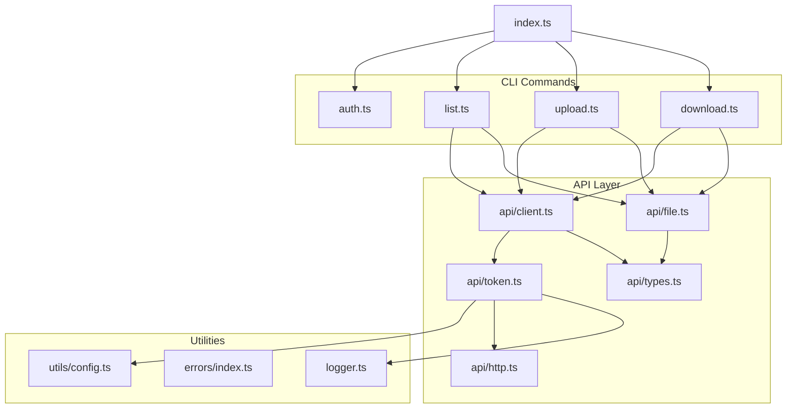
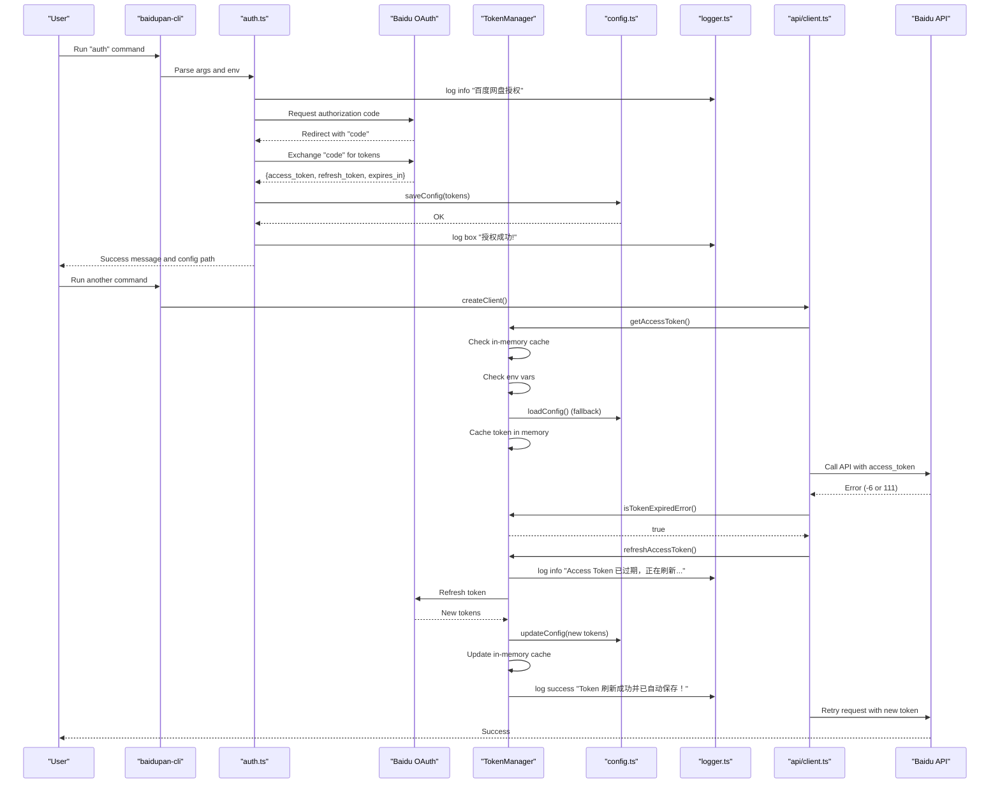
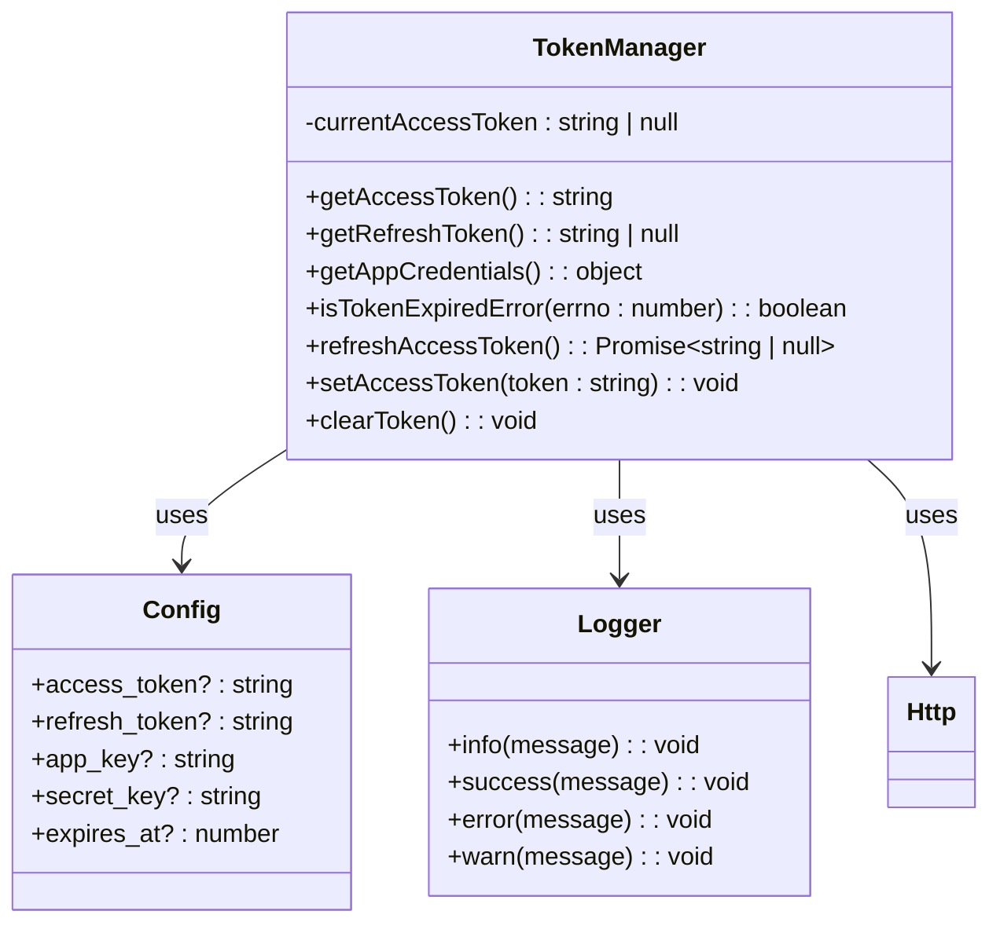
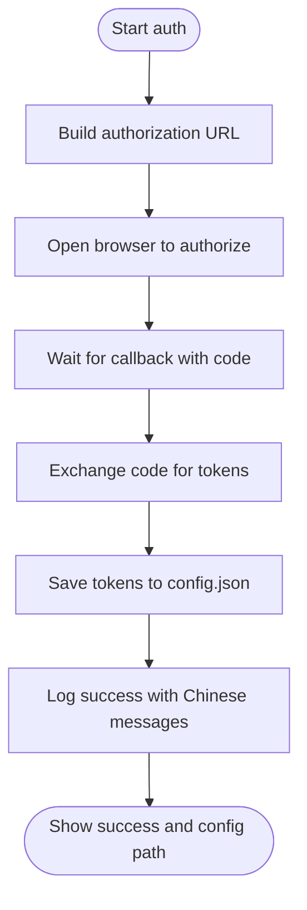
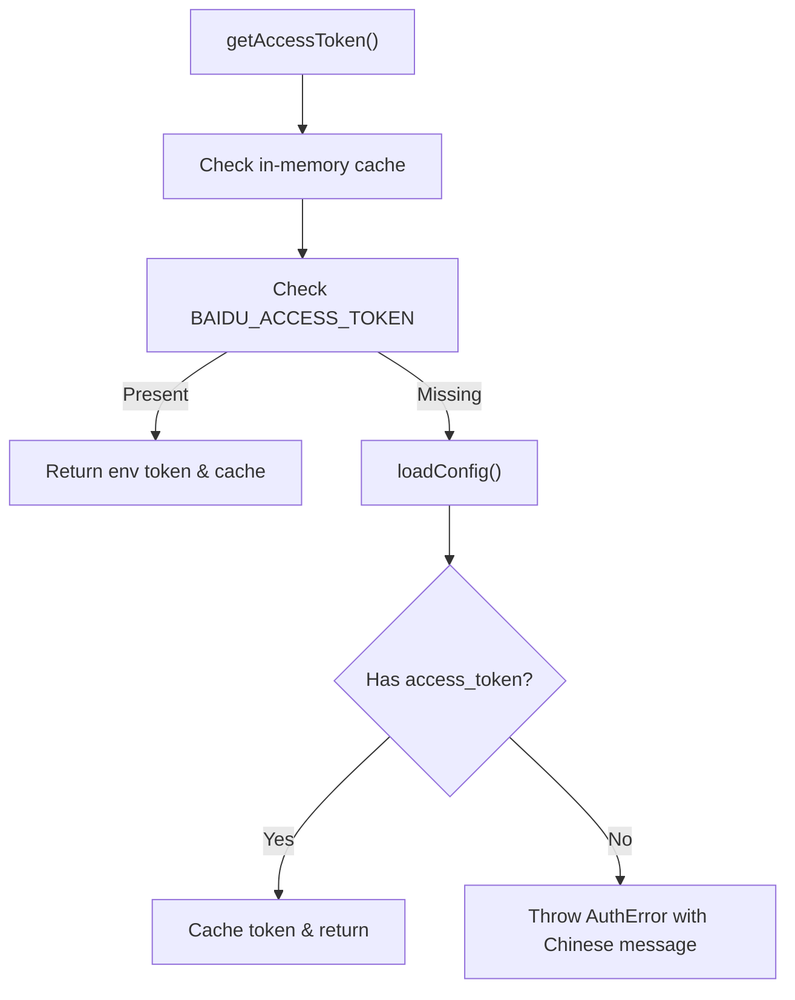
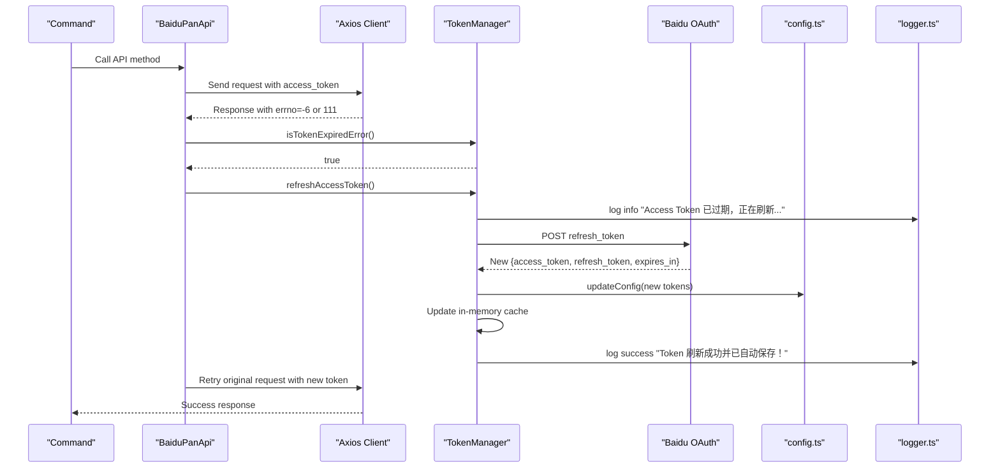
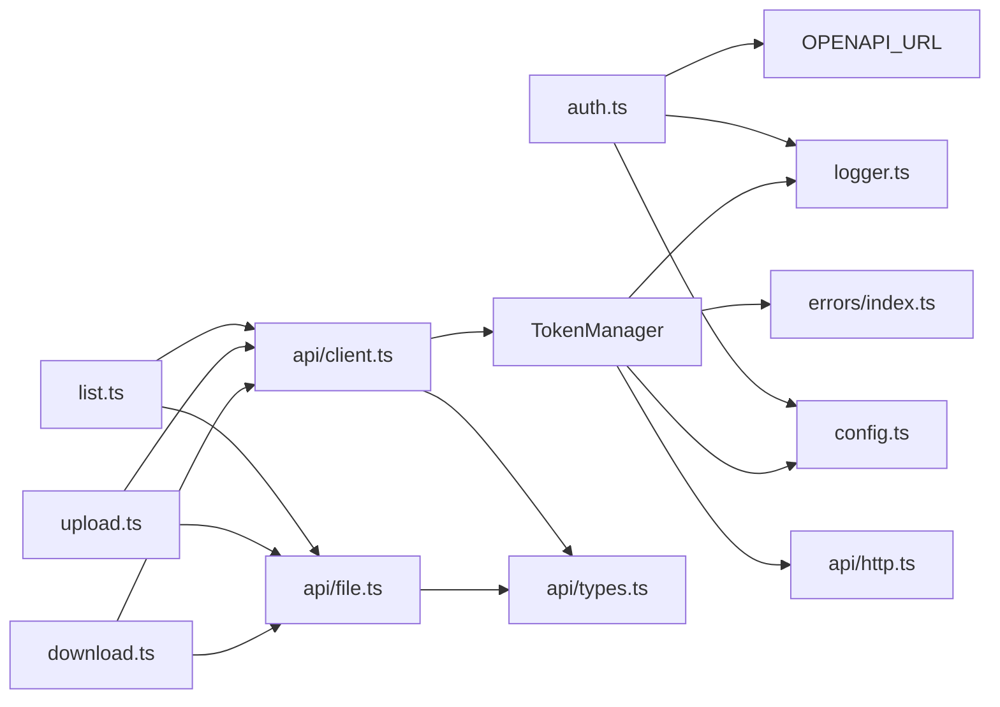

# Token Management and Persistence

<cite>
**Referenced Files in This Document**
- [src/index.ts](file://src/index.ts)
- [src/commands/auth.ts](file://src/commands/auth.ts)
- [src/commands/download.ts](file://src/commands/download.ts)
- [src/commands/list.ts](file://src/commands/list.ts)
- [src/commands/upload.ts](file://src/commands/upload.ts)
- [src/api/client.ts](file://src/api/client.ts)
- [src/api/file.ts](file://src/api/file.ts)
- [src/api/http.ts](file://src/api/http.ts)
- [src/api/token.ts](file://src/api/token.ts)
- [src/api/types.ts](file://src/api/types.ts)
- [src/utils/config.ts](file://src/utils/config.ts)
- [src/utils/index.ts](file://src/utils/index.ts)
- [src/errors/index.ts](file://src/errors/index.ts)
- [src/errors/types.ts](file://src/errors/types.ts)
- [src/logger.ts](file://src/logger.ts)
- [package.json](file://package.json)
- [README.md](file://README.md)
</cite>

## Update Summary
**Changes Made**
- Updated token management architecture to reflect the new dedicated TokenManager class
- Added documentation for enhanced Chinese error messages and improved logging system
- Revised token lifecycle to show the new modular approach with separate token handling
- Updated error handling and logging improvements in the new token management system
- Enhanced security considerations for the new token caching mechanism
- Added documentation for localized error messages including Chinese support

## Table of Contents
1. [Introduction](#introduction)
2. [Project Structure](#project-structure)
3. [Core Components](#core-components)
4. [Architecture Overview](#architecture-overview)
5. [Detailed Component Analysis](#detailed-component-analysis)
6. [Dependency Analysis](#dependency-analysis)
7. [Performance Considerations](#performance-considerations)
8. [Troubleshooting Guide](#troubleshooting-guide)
9. [Conclusion](#conclusion)
10. [Appendices](#appendices)

## Introduction
This document explains the token management and persistence system used by the CLI tool. The system has been redesigned with a dedicated TokenManager class that implements a singleton pattern, providing improved modularity, automatic refresh capabilities, and enhanced error handling. It covers the token lifecycle (acquisition, refresh, and expiration handling), the persistence mechanism using JSON configuration files, and the dual-storage approach combining local configuration files and environment variables. The system now includes comprehensive Chinese error messages and improved logging for better user experience.

## Project Structure
The token management has been modularized into distinct components:
- Command layer: Authorization command and other commands that use the API client
- API layer: HTTP client creation, token retrieval via TokenManager, and automatic refresh
- Token management: Dedicated TokenManager class with singleton pattern
- Utilities: Configuration file management and shared helpers
- Types: API response and error code definitions
- Errors: Enhanced error handling with localized messages
- Logger: Consistent logging interface with different message levels

**Diagram sources**
- [src/index.ts](file://src/index.ts#L1-L49)
- [src/commands/auth.ts](file://src/commands/auth.ts#L1-L196)
- [src/commands/list.ts](file://src/commands/list.ts#L1-L77)
- [src/commands/upload.ts](file://src/commands/upload.ts#L1-L164)
- [src/commands/download.ts](file://src/commands/download.ts#L1-L191)
- [src/api/client.ts](file://src/api/client.ts#L1-L72)
- [src/api/token.ts](file://src/api/token.ts#L1-L137)
- [src/api/file.ts](file://src/api/file.ts#L1-L201)
- [src/api/http.ts](file://src/api/http.ts#L1-L66)
- [src/api/types.ts](file://src/api/types.ts#L1-L102)
- [src/utils/config.ts](file://src/utils/config.ts#L1-L62)
- [src/errors/index.ts](file://src/errors/index.ts#L1-L23)
- [src/logger.ts](file://src/logger.ts#L1-L23)

**Section sources**
- [src/index.ts](file://src/index.ts#L1-L49)
- [src/commands/auth.ts](file://src/commands/auth.ts#L1-L196)
- [src/api/client.ts](file://src/api/client.ts#L1-L72)
- [src/api/token.ts](file://src/api/token.ts#L1-L137)
- [src/utils/config.ts](file://src/utils/config.ts#L1-L62)
- [src/logger.ts](file://src/logger.ts#L1-L23)

## Core Components
- **Dedicated TokenManager class**: A singleton class that encapsulates all token-related operations including acquisition, caching, refresh, and validation.
- **Automatic token refresh**: Intelligent refresh mechanism that detects expired tokens and automatically obtains new ones using refresh tokens.
- **Dual storage approach**: Environment variables take precedence over configuration file values with automatic fallback mechanisms.
- **Enhanced error handling**: Improved error detection and recovery with detailed logging and graceful degradation.
- **Token caching**: In-memory caching of access tokens to minimize file system operations and improve performance.
- **Localized error messages**: Comprehensive Chinese error messages for better user experience including token management notifications.
- **Structured logging**: Consistent logging interface with different message levels (info, success, error, warn) for better debugging.

**Updated** The previous monolithic token handling has been replaced with a dedicated TokenManager class that implements a singleton pattern, providing better separation of concerns and improved maintainability. The system now includes enhanced Chinese error messages and structured logging for better user experience.

**Section sources**
- [src/api/token.ts](file://src/api/token.ts#L15-L137)
- [src/api/client.ts](file://src/api/client.ts#L10-L60)
- [src/utils/config.ts](file://src/utils/config.ts#L19-L61)
- [src/logger.ts](file://src/logger.ts#L1-L23)

## Architecture Overview
The token lifecycle now integrates through the dedicated TokenManager class with automatic refresh capabilities and intelligent caching. The system provides comprehensive logging with localized messages for better user experience.

**Diagram sources**
- [src/commands/auth.ts](file://src/commands/auth.ts#L61-L66)
- [src/commands/auth.ts](file://src/commands/auth.ts#L180-L183)
- [src/api/token.ts](file://src/api/token.ts#L22-L46)
- [src/api/token.ts](file://src/api/token.ts#L78-L118)
- [src/api/client.ts](file://src/api/client.ts#L20-L57)
- [src/utils/config.ts](file://src/utils/config.ts#L35-L54)
- [src/logger.ts](file://src/logger.ts#L1-L23)

## Detailed Component Analysis

### TokenManager Class Architecture
The TokenManager class serves as the central hub for all token operations with a singleton pattern ensuring consistent state management across the application. It now includes comprehensive logging with localized Chinese messages for better user experience.

**Diagram sources**
- [src/api/token.ts](file://src/api/token.ts#L15-L137)
- [src/utils/config.ts](file://src/utils/config.ts#L8-L14)
- [src/logger.ts](file://src/logger.ts#L1-L23)

**Section sources**
- [src/api/token.ts](file://src/api/token.ts#L15-L137)
- [src/logger.ts](file://src/logger.ts#L1-L23)

### Token Acquisition and Persistence
- **Authorization command**: Exchanges authorization code for tokens and saves them to configuration file with app credentials and expiration timestamp.
- **TokenManager.getAccessToken()**: Implements priority-based token retrieval with in-memory caching for improved performance.
- **Configuration file**: Stores access token, refresh token, app keys, and expiration timestamp with restrictive file permissions.
- **Enhanced logging**: Comprehensive Chinese messages for authorization success and configuration information.

**Diagram sources**
- [src/commands/auth.ts](file://src/commands/auth.ts#L89-L196)
- [src/utils/config.ts](file://src/utils/config.ts#L35-L54)
- [src/logger.ts](file://src/logger.ts#L1-L23)

**Section sources**
- [src/commands/auth.ts](file://src/commands/auth.ts#L89-L196)
- [src/api/token.ts](file://src/api/token.ts#L22-L46)
- [src/utils/config.ts](file://src/utils/config.ts#L19-L61)
- [src/logger.ts](file://src/logger.ts#L1-L23)

### Token Retrieval and Precedence
- **Priority-based retrieval**: TokenManager checks environment variables first, then configuration file, with in-memory caching for subsequent requests.
- **Credential resolution**: App credentials are resolved by checking environment variables first, then the configuration file.
- **Error handling**: Throws AuthError with clear guidance when tokens are not found, including localized error messages.

**Diagram sources**
- [src/api/token.ts](file://src/api/token.ts#L22-L46)

**Section sources**
- [src/api/token.ts](file://src/api/token.ts#L22-L46)
- [src/api/token.ts](file://src/api/token.ts#L58-L64)
- [src/api/token.ts](file://src/api/token.ts#L41-L43)

### Automatic Token Refresh and Transparent Handling
- **Expiration detection**: TokenManager.isTokenExpiredError() method checks for specific error codes (-6 and 111) indicating token expiration.
- **Intelligent refresh**: Automatically refreshes tokens using refresh tokens and app credentials, with automatic persistence to configuration file.
- **Retry logic**: Client interceptors detect token expiration and automatically retry failed requests with new tokens.
- **Enhanced logging**: Comprehensive Chinese messages for token refresh operations including progress and success notifications.

**Diagram sources**
- [src/api/token.ts](file://src/api/token.ts#L69-L73)
- [src/api/token.ts](file://src/api/token.ts#L78-L118)
- [src/api/client.ts](file://src/api/client.ts#L20-L57)
- [src/logger.ts](file://src/logger.ts#L1-L23)

**Section sources**
- [src/api/token.ts](file://src/api/token.ts#L69-L73)
- [src/api/token.ts](file://src/api/token.ts#L78-L118)
- [src/api/client.ts](file://src/api/client.ts#L20-L57)
- [src/api/types.ts](file://src/api/types.ts#L93-L101)
- [src/logger.ts](file://src/logger.ts#L1-L23)

### Enhanced Error Handling and Logging
- **Improved error detection**: Specific error code handling for token expiration and invalid access tokens.
- **Detailed logging**: Comprehensive logging for token operations including refresh attempts and failures with localized Chinese messages.
- **Graceful degradation**: Automatic fallback mechanisms prevent application crashes on token-related errors.
- **Structured message levels**: Different log levels (info, success, error, warn) for better debugging and user feedback.
- **Localized messages**: Chinese error messages for better user experience including token management notifications.

**Section sources**
- [src/api/token.ts](file://src/api/token.ts#L112-L118)
- [src/api/token.ts](file://src/api/token.ts#L43-L46)
- [src/errors/index.ts](file://src/errors/index.ts#L7-L20)
- [src/errors/types.ts](file://src/errors/types.ts#L1-L56)
- [src/logger.ts](file://src/logger.ts#L1-L23)

### Token Persistence Mechanism
- **File location**: Under the user's home directory in a hidden folder with restrictive permissions (0o700 for directory, 0o600 for file).
- **Structure**: JSON object containing access token, refresh token, app keys, and expiration timestamp.
- **Security considerations**: Automatic permission setting prevents unauthorized access to sensitive token data.

**Section sources**
- [src/utils/config.ts](file://src/utils/config.ts#L5-L6)
- [src/utils/config.ts](file://src/utils/config.ts#L35-L54)
- [README.md](file://README.md#L129-L134)

### Practical Examples
- **Token storage locations**: Windows: under the user profile directory in a hidden folder, macOS/Linux: under the home directory in a hidden folder.
- **Configuration file format**: Fields include access token, refresh token, app keys, and expiration timestamp.
- **Manual token management**: Copy the configuration file to another machine or set environment variables for cross-environment usage.
- **Chinese error messages**: The system now provides localized Chinese error messages for better user experience.

**Section sources**
- [README.md](file://README.md#L129-L134)
- [src/commands/auth.ts](file://src/commands/auth.ts#L166-L196)
- [src/api/token.ts](file://src/api/token.ts#L84-L85)
- [src/api/token.ts](file://src/api/token.ts#L106-L107)
- [src/api/token.ts](file://src/api/token.ts#L111-L112)

## Dependency Analysis
The token management system now has a clean separation of concerns with the TokenManager class as the central dependency and enhanced error handling with localized messages.

**Diagram sources**
- [src/commands/auth.ts](file://src/commands/auth.ts#L1-L8)
- [src/commands/list.ts](file://src/commands/list.ts#L1-L7)
- [src/commands/upload.ts](file://src/commands/upload.ts#L1-L17)
- [src/commands/download.ts](file://src/commands/download.ts#L1-L11)
- [src/api/client.ts](file://src/api/client.ts#L1-L7)
- [src/api/token.ts](file://src/api/token.ts#L1-L5)
- [src/api/file.ts](file://src/api/file.ts#L1-L12)
- [src/api/http.ts](file://src/api/http.ts#L1-L66)
- [src/api/types.ts](file://src/api/types.ts#L1-L102)
- [src/utils/config.ts](file://src/utils/config.ts#L1-L62)
- [src/errors/index.ts](file://src/errors/index.ts#L1-L23)
- [src/logger.ts](file://src/logger.ts#L1-L23)

**Section sources**
- [src/commands/auth.ts](file://src/commands/auth.ts#L1-L8)
- [src/api/client.ts](file://src/api/client.ts#L1-L7)
- [src/api/token.ts](file://src/api/token.ts#L1-L5)
- [src/api/file.ts](file://src/api/file.ts#L1-L12)
- [src/api/http.ts](file://src/api/http.ts#L1-L66)
- [src/api/types.ts](file://src/api/types.ts#L1-L102)
- [src/utils/config.ts](file://src/utils/config.ts#L1-L62)
- [src/errors/index.ts](file://src/errors/index.ts#L1-L23)
- [src/logger.ts](file://src/logger.ts#L1-L23)

## Performance Considerations
- **In-memory caching**: TokenManager caches access tokens in memory to minimize file system operations and improve response times.
- **Lazy loading**: Tokens are only loaded from configuration file when environment variables are not available or cache is empty.
- **Efficient refresh**: Automatic refresh occurs only when token expiration is detected, minimizing unnecessary network calls.
- **Logging optimization**: Structured logging with different levels reduces overhead while providing useful information.

## Troubleshooting Guide
- **Missing access token**: Thrown AuthError with guidance to run authorization command when neither environment variables nor configuration file contain tokens. The error message is localized for better user experience.
- **Authorization timeout**: Local server waits for callback; ensure redirect URI matches application settings and port is available.
- **Token expired or invalid**: Automatic detection and refresh through TokenManager.isTokenExpiredError() and refreshAccessToken() methods with comprehensive logging.
- **Network or proxy issues**: Client disables proxy for internal requests; ensure outbound connectivity to Baidu APIs.
- **Token refresh failures**: Detailed logging with Chinese error messages helps diagnose OAuth endpoint issues or invalid refresh tokens.
- **Chinese error messages**: The system provides localized Chinese error messages for better user experience during troubleshooting.

**Section sources**
- [src/api/token.ts](file://src/api/token.ts#L43-L46)
- [src/commands/auth.ts](file://src/commands/auth.ts#L154-L158)
- [src/api/token.ts](file://src/api/token.ts#L69-L73)
- [src/api/token.ts](file://src/api/token.ts#L112-L118)
- [src/api/client.ts](file://src/api/client.ts#L43-L49)
- [src/api/token.ts](file://src/api/token.ts#L84-L85)
- [src/api/token.ts](file://src/api/token.ts#L111-L112)

## Conclusion
The token management system provides a robust, secure, and transparent way to handle authentication for the CLI. The new TokenManager class with singleton pattern offers improved modularity, automatic refresh capabilities, and enhanced error handling. It combines environment-variable-first precedence with persistent configuration storage while providing intelligent caching and automatic token lifecycle management. The system now includes comprehensive Chinese error messages and structured logging for better user experience and debugging capabilities.

## Appendices

### API Error Codes Reference
- -6: Invalid access token
- 111: Access token expired
- Other common codes include access denied, file not found, parameter errors, and rate limiting indicators.

**Section sources**
- [src/api/types.ts](file://src/api/types.ts#L93-L101)

### Example Environment Variables
- App credentials:
  - BAIDU_APP_KEY
  - BAIDU_SECRET_KEY
- Tokens:
  - BAIDU_ACCESS_TOKEN
  - BAIDU_REFRESH_TOKEN

**Section sources**
- [src/api/token.ts](file://src/api/token.ts#L28-L53)
- [src/commands/auth.ts](file://src/commands/auth.ts#L188-L192)
- [README.md](file://README.md#L120-L127)

### TokenManager Methods Reference
- **getAccessToken()**: Returns current access token with priority-based retrieval
- **getRefreshToken()**: Returns refresh token from environment or configuration
- **getAppCredentials()**: Returns app key and secret key with environment precedence
- **isTokenExpiredError(errno)**: Checks if error code indicates token expiration
- **refreshAccessToken()**: Automatically refreshes tokens and persists changes with logging
- **setAccessToken(token)**: Sets access token (used after successful authentication)
- **clearToken()**: Clears cached token

**Section sources**
- [src/api/token.ts](file://src/api/token.ts#L22-L132)

### Enhanced Error Messages and Logging
- **Chinese error messages**: The system now provides localized Chinese error messages including:
  - "未找到 Access Token，请先运行: baidupan-cli auth -k <app-key> -s <secret-key>"
  - "Access Token 已过期，正在刷新..."
  - "Token 刷新成功并已自动保存！"
  - "Token 刷新失败"
- **Logging levels**: Different log levels (info, success, error, warn) for structured messaging
- **Message localization**: Chinese messages for better user experience in token management operations

**Section sources**
- [src/api/token.ts](file://src/api/token.ts#L41-L43)
- [src/api/token.ts](file://src/api/token.ts#L84-L85)
- [src/api/token.ts](file://src/api/token.ts#L106-L107)
- [src/api/token.ts](file://src/api/token.ts#L111-L112)
- [src/logger.ts](file://src/logger.ts#L1-L23)