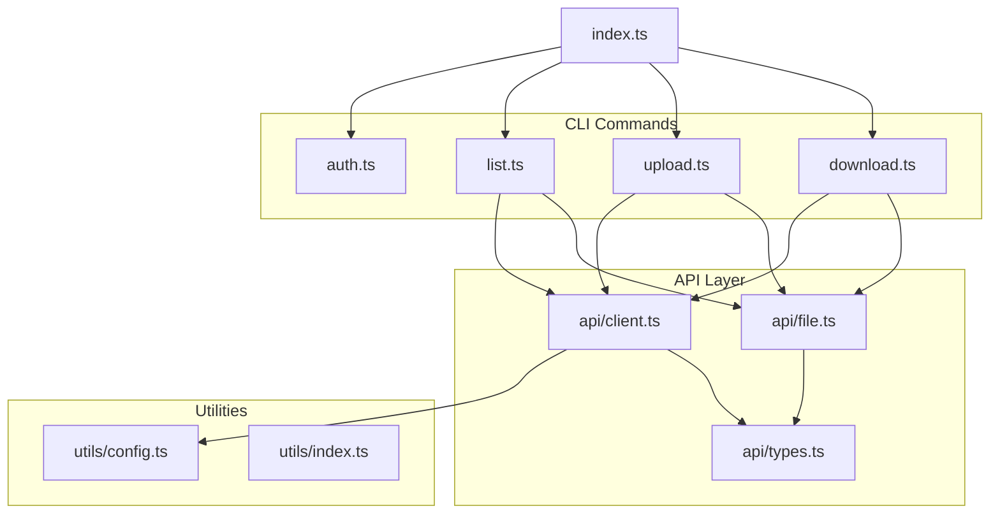
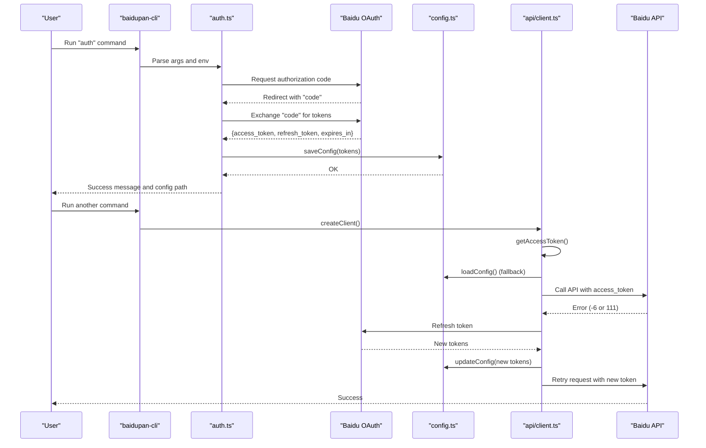
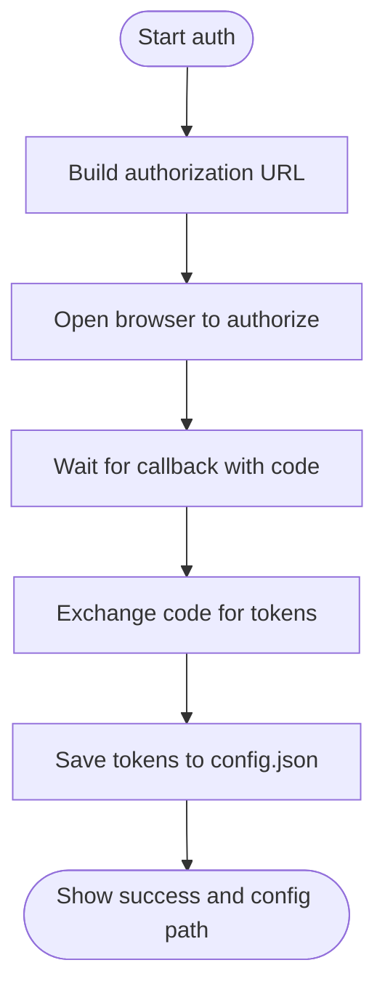
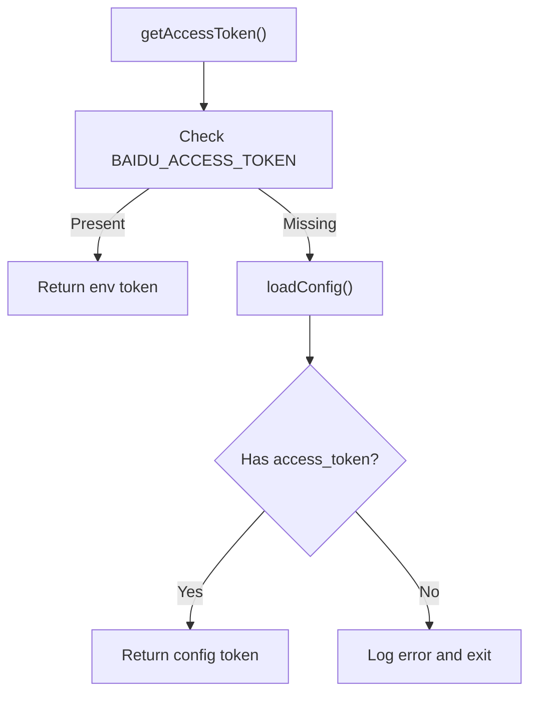
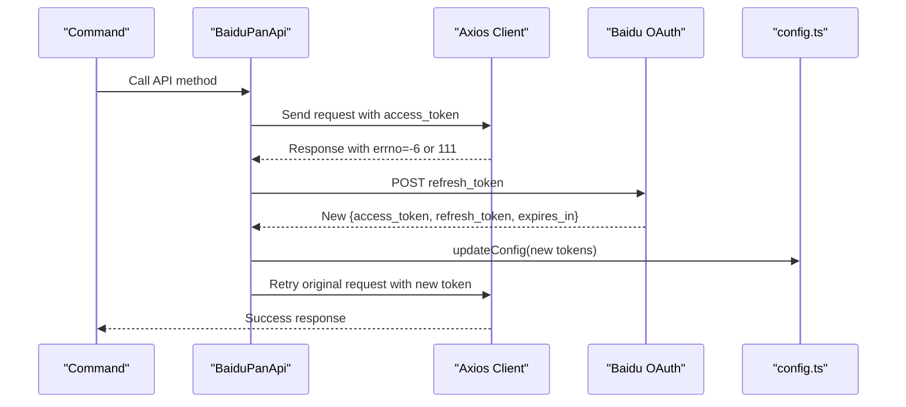
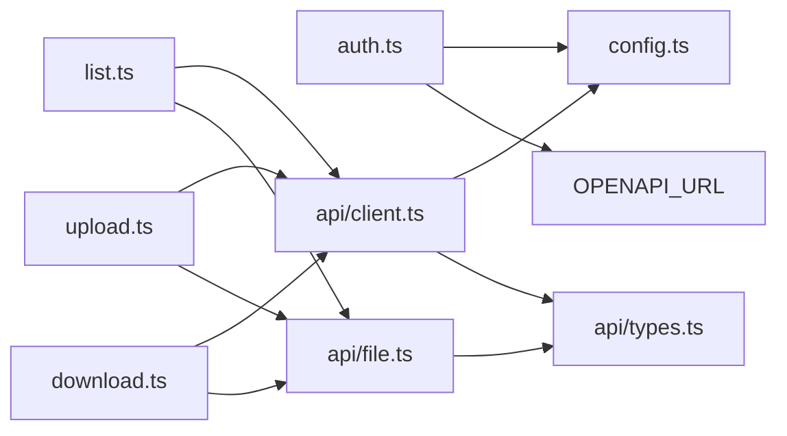

# Token Management and Persistence

<cite>
**Referenced Files in This Document**
- [src/index.ts](file://src/index.ts)
- [src/commands/auth.ts](file://src/commands/auth.ts)
- [src/commands/download.ts](file://src/commands/download.ts)
- [src/commands/list.ts](file://src/commands/list.ts)
- [src/commands/upload.ts](file://src/commands/upload.ts)
- [src/api/client.ts](file://src/api/client.ts)
- [src/api/file.ts](file://src/api/file.ts)
- [src/api/types.ts](file://src/api/types.ts)
- [src/utils/config.ts](file://src/utils/config.ts)
- [src/utils/index.ts](file://src/utils/index.ts)
- [package.json](file://package.json)
- [README.md](file://README.md)
</cite>

## Table of Contents
1. [Introduction](#introduction)
2. [Project Structure](#project-structure)
3. [Core Components](#core-components)
4. [Architecture Overview](#architecture-overview)
5. [Detailed Component Analysis](#detailed-component-analysis)
6. [Dependency Analysis](#dependency-analysis)
7. [Performance Considerations](#performance-considerations)
8. [Troubleshooting Guide](#troubleshooting-guide)
9. [Conclusion](#conclusion)
10. [Appendices](#appendices)

## Introduction
This document explains the token management and persistence system used by the CLI tool. It covers the token lifecycle (acquisition, refresh, and expiration handling), the persistence mechanism using JSON configuration files, and the dual-storage approach combining local configuration files and environment variables. It also documents the automatic refresh behavior, precedence rules, and security best practices for storing and transmitting tokens.

## Project Structure
The token management spans several modules:
- Command layer: Authorization command and other commands that use the API client
- API layer: HTTP client creation, token retrieval, and automatic refresh
- Utilities: Configuration file management and shared helpers
- Types: API response and error code definitions

**Diagram sources**
- [src/index.ts](file://src/index.ts#L1-L26)
- [src/commands/auth.ts](file://src/commands/auth.ts#L1-L258)
- [src/commands/list.ts](file://src/commands/list.ts#L1-L81)
- [src/commands/upload.ts](file://src/commands/upload.ts#L1-L144)
- [src/commands/download.ts](file://src/commands/download.ts#L1-L104)
- [src/api/client.ts](file://src/api/client.ts#L1-L171)
- [src/api/file.ts](file://src/api/file.ts#L1-L201)
- [src/api/types.ts](file://src/api/types.ts#L1-L108)
- [src/utils/config.ts](file://src/utils/config.ts#L1-L62)
- [src/utils/index.ts](file://src/utils/index.ts#L1-L110)

**Section sources**
- [src/index.ts](file://src/index.ts#L1-L26)
- [src/commands/auth.ts](file://src/commands/auth.ts#L1-L258)
- [src/api/client.ts](file://src/api/client.ts#L1-L171)
- [src/utils/config.ts](file://src/utils/config.ts#L1-L62)

## Core Components
- Token acquisition and persistence:
  - Authorization command exchanges an authorization code for tokens and saves them to a JSON configuration file.
  - The configuration file stores access token, refresh token, app keys, and expiration timestamp.
- Token retrieval and precedence:
  - The API client retrieves tokens from environment variables first, then falls back to the configuration file.
- Automatic refresh and transparent handling:
  - On receiving a token-expired error, the client attempts to refresh the token using the refresh token and retries the original request.
  - The refreshed tokens are persisted automatically.
- Dual storage approach:
  - Environment variables take precedence over configuration file values.
  - Configuration file is located under the user’s home directory in a hidden folder.

**Section sources**
- [src/commands/auth.ts](file://src/commands/auth.ts#L161-L192)
- [src/utils/config.ts](file://src/utils/config.ts#L19-L45)
- [src/api/client.ts](file://src/api/client.ts#L15-L44)
- [src/api/client.ts](file://src/api/client.ts#L63-L104)
- [src/api/client.ts](file://src/api/client.ts#L134-L150)

## Architecture Overview
The token lifecycle integrates the authorization flow, persistent storage, and runtime token management.

**Diagram sources**
- [src/commands/auth.ts](file://src/commands/auth.ts#L93-L159)
- [src/commands/auth.ts](file://src/commands/auth.ts#L161-L192)
- [src/utils/config.ts](file://src/utils/config.ts#L35-L54)
- [src/api/client.ts](file://src/api/client.ts#L15-L44)
- [src/api/client.ts](file://src/api/client.ts#L63-L104)
- [src/api/client.ts](file://src/api/client.ts#L134-L150)

## Detailed Component Analysis

### Token Acquisition and Persistence
- Authorization command:
  - Starts a local HTTP server to receive the OAuth callback.
  - Opens the browser to the authorization URL with configured redirect URI.
  - Exchanges the authorization code for tokens and prints success information.
  - Saves tokens to the configuration file with an expiration timestamp.
- Configuration file:
  - Stored under the user’s home directory in a hidden folder.
  - Uses restrictive permissions to protect sensitive data.
  - Contains fields for access token, refresh token, app keys, and expiration timestamp.

**Diagram sources**
- [src/commands/auth.ts](file://src/commands/auth.ts#L131-L159)
- [src/commands/auth.ts](file://src/commands/auth.ts#L161-L192)
- [src/utils/config.ts](file://src/utils/config.ts#L35-L45)

**Section sources**
- [src/commands/auth.ts](file://src/commands/auth.ts#L46-L91)
- [src/commands/auth.ts](file://src/commands/auth.ts#L218-L257)
- [src/utils/config.ts](file://src/utils/config.ts#L5-L14)
- [src/utils/config.ts](file://src/utils/config.ts#L35-L45)

### Token Retrieval and Precedence
- Access token precedence:
  - Environment variable takes priority.
  - If not present, the configuration file is consulted.
  - If still missing, the process exits with an error prompting re-authentication.
- Refresh token and app credentials:
  - Refresh token and app keys can come from environment variables or the configuration file.
  - App credentials are resolved by checking environment variables first, then the configuration file.

**Diagram sources**
- [src/api/client.ts](file://src/api/client.ts#L15-L37)

**Section sources**
- [src/api/client.ts](file://src/api/client.ts#L15-L37)
- [src/api/client.ts](file://src/api/client.ts#L42-L54)

### Automatic Token Refresh and Transparent Handling
- Detection of expired tokens:
  - Intercepts API responses and checks for known error codes indicating invalid or expired access tokens.
- Refresh flow:
  - Retrieves refresh token and app credentials from environment or configuration.
  - Calls the OAuth endpoint to obtain new tokens.
  - Updates the in-memory token and persists the new tokens to the configuration file.
- Retry logic:
  - Retries the original request with the newly acquired token.

**Diagram sources**
- [src/api/client.ts](file://src/api/client.ts#L134-L150)
- [src/api/client.ts](file://src/api/client.ts#L63-L104)
- [src/utils/config.ts](file://src/utils/config.ts#L50-L54)

**Section sources**
- [src/api/client.ts](file://src/api/client.ts#L106-L110)
- [src/api/client.ts](file://src/api/client.ts#L134-L150)
- [src/api/client.ts](file://src/api/client.ts#L63-L104)
- [src/api/types.ts](file://src/api/types.ts#L99-L107)

### Dual Storage Approach: Environment Variables vs Configuration File
- Precedence:
  - Access token: environment variable > configuration file.
  - Refresh token: environment variable > configuration file.
  - App credentials: environment variables > configuration file.
- Fallback mechanisms:
  - If environment variables are not set, the configuration file is loaded.
  - If neither is available, the process exits with guidance to authenticate.
- Practical implications:
  - On CI/CD systems, set environment variables for seamless operation.
  - On developer machines, rely on the configuration file for convenience.

**Section sources**
- [src/api/client.ts](file://src/api/client.ts#L15-L37)
- [src/api/client.ts](file://src/api/client.ts#L42-L54)

### Token Persistence Mechanism
- File location:
  - Under the user’s home directory in a hidden folder.
- Structure:
  - JSON object containing access token, refresh token, app keys, and expiration timestamp.
- Security considerations:
  - Directory and file are created with restrictive permissions.
  - Errors during saving are logged as warnings without crashing the process.
  - The configuration file is intended to be stored locally; for cross-machine usage, copy the file or set environment variables.

**Section sources**
- [src/utils/config.ts](file://src/utils/config.ts#L5-L14)
- [src/utils/config.ts](file://src/utils/config.ts#L35-L45)
- [README.md](file://README.md#L129-L134)

### Practical Examples
- Token storage locations:
  - Windows: under the user profile directory in a hidden folder.
  - macOS/Linux: under the home directory in a hidden folder.
- Configuration file format:
  - Fields include access token, refresh token, app keys, and expiration timestamp.
- Manual token management:
  - Copy the configuration file to another machine or set environment variables for cross-environment usage.
  - The authorization command prints the exact path to the configuration file and example environment variable export commands.

**Section sources**
- [README.md](file://README.md#L129-L134)
- [src/commands/auth.ts](file://src/commands/auth.ts#L230-L257)

## Dependency Analysis
The token management relies on a small set of cohesive modules with clear responsibilities.

**Diagram sources**
- [src/commands/auth.ts](file://src/commands/auth.ts#L5-L6)
- [src/commands/list.ts](file://src/commands/list.ts#L2-L5)
- [src/commands/upload.ts](file://src/commands/upload.ts#L4-L6)
- [src/commands/download.ts](file://src/commands/download.ts#L5-L7)
- [src/api/client.ts](file://src/api/client.ts#L3-L4)
- [src/api/file.ts](file://src/api/file.ts#L1-L12)
- [src/api/types.ts](file://src/api/types.ts#L1-L108)
- [src/utils/config.ts](file://src/utils/config.ts#L1-L62)

**Section sources**
- [src/commands/auth.ts](file://src/commands/auth.ts#L5-L6)
- [src/api/client.ts](file://src/api/client.ts#L3-L4)
- [src/api/file.ts](file://src/api/file.ts#L1-L12)
- [src/api/types.ts](file://src/api/types.ts#L1-L108)
- [src/utils/config.ts](file://src/utils/config.ts#L1-L62)

## Performance Considerations
- Token refresh is performed lazily upon encountering an expired-token error, minimizing unnecessary network calls.
- The configuration file is read only when needed (e.g., on startup or when environment variables are absent).
- Requests are retried with minimal overhead after successful refresh.

[No sources needed since this section provides general guidance]

## Troubleshooting Guide
- Missing access token:
  - Occurs when neither environment variables nor the configuration file contain an access token.
  - Resolution: Run the authorization command to obtain and persist tokens.
- Authorization timeout:
  - The local server waits for a callback; if not received within a time limit, the process exits with an error.
  - Resolution: Ensure the redirect URI matches the application settings and the port is available.
- Token expired or invalid:
  - Detected by specific error codes returned by the API.
  - Resolution: The client attempts to refresh automatically; if it fails, re-authenticate.
- Network or proxy issues:
  - The client disables proxy for internal requests; ensure outbound connectivity to the Baidu APIs.

**Section sources**
- [src/api/client.ts](file://src/api/client.ts#L34-L37)
- [src/commands/auth.ts](file://src/commands/auth.ts#L154-L158)
- [src/api/client.ts](file://src/api/client.ts#L106-L110)
- [src/api/client.ts](file://src/api/client.ts#L145-L149)

## Conclusion
The token management system provides a robust, secure, and transparent way to handle authentication for the CLI. It combines environment-variable-first precedence with persistent configuration storage, supports automatic refresh on expiration, and minimizes operational friction for both interactive and automated usage.

[No sources needed since this section summarizes without analyzing specific files]

## Appendices

### API Error Codes Reference
- -6: Invalid access token
- 111: Access token expired
- Other common codes include access denied, file not found, parameter errors, and rate limiting indicators.

**Section sources**
- [src/api/types.ts](file://src/api/types.ts#L99-L107)

### Example Environment Variables
- App credentials:
  - BAIDU_APP_KEY
  - BAIDU_SECRET_KEY
- Tokens:
  - BAIDU_ACCESS_TOKEN
  - BAIDU_REFRESH_TOKEN

**Section sources**
- [src/api/client.ts](file://src/api/client.ts#L21-L25)
- [src/api/client.ts](file://src/api/client.ts#L42-L44)
- [src/api/client.ts](file://src/api/client.ts#L49-L54)
- [README.md](file://README.md#L120-L127)
