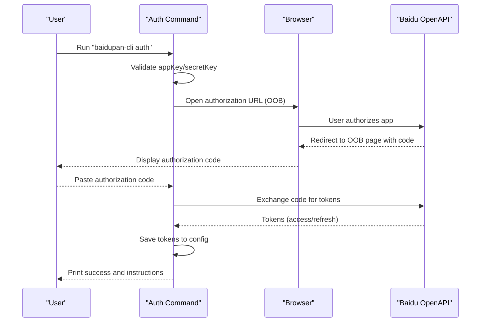
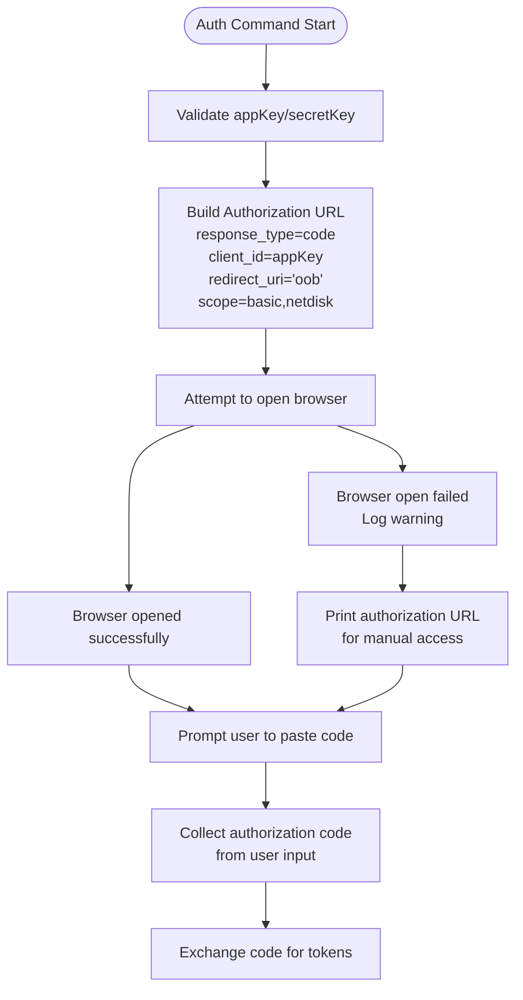
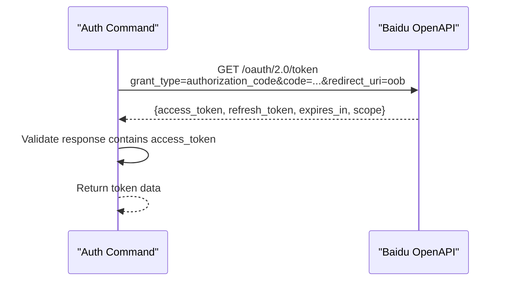
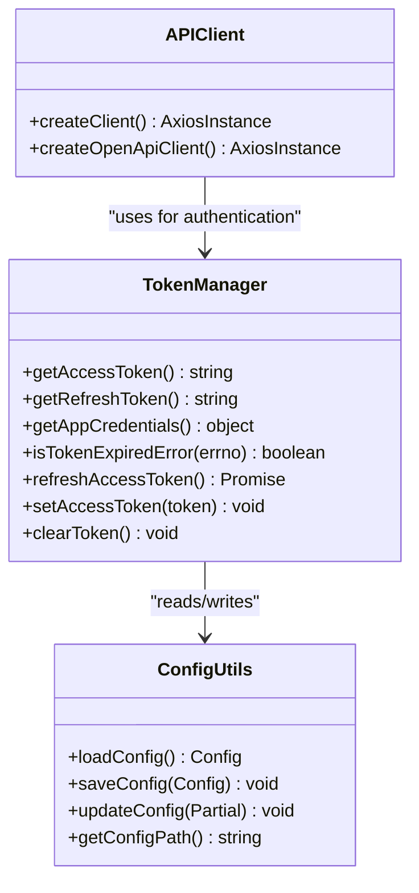
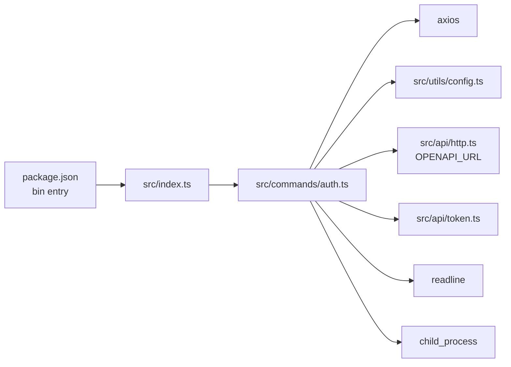

# Auth Command

<cite>
**Referenced Files in This Document**
- [auth.ts](file://src/commands/auth.ts)
- [client.ts](file://src/api/client.ts)
- [config.ts](file://src/utils/config.ts)
- [index.ts](file://src/index.ts)
- [README.md](file://README.md)
- [package.json](file://package.json)
- [http.ts](file://src/api/http.ts)
- [token.ts](file://src/api/token.ts)
</cite>

## Update Summary
**Changes Made**
- Updated OAuth flow documentation to reflect OOB (out-of-band) authorization instead of local HTTP server
- Removed references to configurable ports, custom redirect paths, and automatic browser opening
- Added documentation for manual authorization code collection process
- Updated command syntax to reflect simplified parameter structure
- Revised troubleshooting guide to address OOB flow specific issues

## Table of Contents
1. [Introduction](#introduction)
2. [Project Structure](#project-structure)
3. [Core Components](#core-components)
4. [Architecture Overview](#architecture-overview)
5. [Detailed Component Analysis](#detailed-component-analysis)
6. [Dependency Analysis](#dependency-analysis)
7. [Performance Considerations](#performance-considerations)
8. [Troubleshooting Guide](#troubleshooting-guide)
9. [Conclusion](#conclusion)
10. [Appendices](#appendices)

## Introduction
This document explains the auth command used to authenticate with Baidu Pan via OAuth 2.0 using the simplified out-of-band (OOB) authorization flow. The command supports manual authorization code collection, automatic browser opening, and seamless integration with the Baidu Open API. It covers command syntax, parameters, environment variable alternatives, the streamlined OAuth flow, error handling, practical examples, troubleshooting, and security considerations.

## Project Structure
The auth command is part of a CLI tool that manages Baidu Pan operations. The command is defined in the commands module and integrates with the API client, HTTP utilities, and configuration management systems.

```mermaid
graph TB
subgraph "CLI Entry"
IDX["src/index.ts<br/>Defines subcommands"]
end
subgraph "Auth Command"
AUTH["src/commands/auth.ts<br/>OAuth 2.0 OOB flow"]
end
subgraph "API Layer"
HTTP["src/api/http.ts<br/>HTTP client & constants"]
TOKEN["src/api/token.ts<br/>Token management"]
END
subgraph "Config"
CFG["src/utils/config.ts<br/>Config file I/O"]
end
IDX --> AUTH
AUTH --> HTTP
AUTH --> TOKEN
AUTH --> CFG
HTTP --> TOKEN
```

**Diagram sources**
- [index.ts](file://src/index.ts#L14-L46)
- [auth.ts](file://src/commands/auth.ts#L16-L87)
- [http.ts](file://src/api/http.ts#L6-L7)
- [token.ts](file://src/api/token.ts#L15-L137)
- [config.ts](file://src/utils/config.ts#L19-L45)

**Section sources**
- [index.ts](file://src/index.ts#L1-L49)
- [auth.ts](file://src/commands/auth.ts#L1-L196)
- [http.ts](file://src/api/http.ts#L1-L66)
- [token.ts](file://src/api/token.ts#L1-L137)
- [config.ts](file://src/utils/config.ts#L1-L62)

## Core Components
- Simplified OOB (Out-of-Band) OAuth 2.0 flow implementation
- Manual authorization code collection via terminal input
- Automatic browser opening with manual fallback
- Token exchange with Baidu Open API
- Configuration persistence and environment variable support

Key responsibilities:
- Validate required parameters (appKey, secretKey) or environment variables
- Generate authorization URL with OOB redirect_uri
- Open browser to Baidu authorization endpoint
- Collect authorization code from user input
- Exchange authorization code for access/refresh tokens
- Persist tokens to config and print helpful messages

**Section sources**
- [auth.ts](file://src/commands/auth.ts#L38-L87)
- [auth.ts](file://src/commands/auth.ts#L89-L96)
- [auth.ts](file://src/commands/auth.ts#L98-L110)
- [auth.ts](file://src/commands/auth.ts#L112-L140)
- [auth.ts](file://src/commands/auth.ts#L166-L196)

## Architecture Overview
The auth command orchestrates a simplified OAuth 2.0 flow with the following streamlined steps:
1. Parse arguments and environment variables
2. Generate authorization URL with OOB redirect_uri
3. Open browser to authorization endpoint
4. Prompt user to collect authorization code from browser
5. Exchange the code for tokens via Baidu Open API
6. Save tokens to config and print success information



**Diagram sources**
- [auth.ts](file://src/commands/auth.ts#L38-L87)
- [auth.ts](file://src/commands/auth.ts#L89-L96)
- [auth.ts](file://src/commands/auth.ts#L98-L110)
- [auth.ts](file://src/commands/auth.ts#L112-L140)
- [auth.ts](file://src/commands/auth.ts#L166-L196)

## Detailed Component Analysis

### Command Definition and Arguments
- Command name: auth
- Description: Authorize with Baidu Pan
- Arguments:
  - appKey (-k): Baidu Pan App Key (required)
  - secretKey (-s): Baidu Pan Secret Key (required)
  - redirectUri (-r): Redirect URI configured in Baidu Pan (default: oob)

Environment variable alternatives:
- BAIDU_APP_KEY
- BAIDU_SECRET_KEY

Behavior:
- If appKey or secretKey are missing, throws AuthError with usage instructions
- Uses 'oob' as default redirect_uri for out-of-band authorization
- Prints authorization URL and instructions for manual code collection
- Automatically attempts to open browser to authorization URL

**Section sources**
- [auth.ts](file://src/commands/auth.ts#L16-L37)
- [auth.ts](file://src/commands/auth.ts#L38-L56)
- [auth.ts](file://src/commands/auth.ts#L42)

### Authorization URL Generation and Browser Automation
- Generates authorization URL with parameters:
  - response_type: code
  - client_id: appKey
  - redirect_uri: 'oob' (default) or custom redirectUri
  - scope: basic,netdisk
- Attempts to open browser using platform-specific commands:
  - macOS: open
  - Windows: start
  - Linux: xdg-open
- If automatic opening fails, logs warning and prints authorization URL for manual access



**Diagram sources**
- [auth.ts](file://src/commands/auth.ts#L89-L96)
- [auth.ts](file://src/commands/auth.ts#L142-L164)
- [auth.ts](file://src/commands/auth.ts#L98-L110)

**Section sources**
- [auth.ts](file://src/commands/auth.ts#L89-L96)
- [auth.ts](file://src/commands/auth.ts#L142-L164)
- [auth.ts](file://src/commands/auth.ts#L61-L76)

### Manual Authorization Code Collection
- Prompts user to enter authorization code after completing browser authorization
- Uses readline interface to capture user input from terminal
- Validates that collected code is not empty
- Provides clear instructions for copying code from browser URL or page

**Section sources**
- [auth.ts](file://src/commands/auth.ts#L98-L110)
- [auth.ts](file://src/commands/auth.ts#L71-L76)

### Token Exchange Process
- Sends a GET request to Baidu Open API token endpoint with:
  - grant_type=authorization_code
  - code (collected from user)
  - client_id (appKey)
  - client_secret (secretKey)
  - redirect_uri (must be 'oob' for this flow)
- Sets timeout and disables proxy for reliable token exchange
- Parses the response and validates presence of access_token
- Throws AuthError if response contains error field or access_token is missing



**Diagram sources**
- [auth.ts](file://src/commands/auth.ts#L112-L140)

**Section sources**
- [auth.ts](file://src/commands/auth.ts#L112-L140)

### Configuration Persistence and Success Output
- Saves tokens to the config file with:
  - access_token
  - refresh_token
  - app_key
  - secret_key
  - expires_at (timestamp)
- Prints success banner, config file location, expiration time, and helpful instructions for copying config or setting environment variables
- Provides guidance for using tokens across different environments

**Section sources**
- [auth.ts](file://src/commands/auth.ts#L166-L196)
- [config.ts](file://src/utils/config.ts#L35-L45)

### Integration with API Client and Token Management
- The API client loads tokens from environment variables or config file
- Provides automatic token refresh when access token expires
- Intercepts requests and responses to handle token expiration transparently
- Supports both access token and refresh token management



**Diagram sources**
- [token.ts](file://src/api/token.ts#L15-L137)
- [client.ts](file://src/api/client.ts#L10-L57)
- [config.ts](file://src/utils/config.ts#L19-L61)

**Section sources**
- [token.ts](file://src/api/token.ts#L15-L137)
- [client.ts](file://src/api/client.ts#L10-L57)
- [config.ts](file://src/utils/config.ts#L19-L61)

## Dependency Analysis
- The auth command depends on:
  - Axios for HTTP requests and token exchange
  - Baidu Open API base URL constants
  - Config utilities for saving tokens
  - Child process module for browser automation
  - Readline module for manual code collection
- The CLI entry registers the auth command and exposes it globally via package bin



**Diagram sources**
- [package.json](file://package.json#L47-L49)
- [index.ts](file://src/index.ts#L4-L7)
- [auth.ts](file://src/commands/auth.ts#L1-L7)
- [http.ts](file://src/api/http.ts#L7)
- [token.ts](file://src/api/token.ts#L4)

**Section sources**
- [package.json](file://package.json#L47-L49)
- [index.ts](file://src/index.ts#L4-L7)
- [auth.ts](file://src/commands/auth.ts#L1-L7)
- [http.ts](file://src/api/http.ts#L7)
- [token.ts](file://src/api/token.ts#L4)

## Performance Considerations
- No local server overhead - eliminates port binding and HTTP server startup costs
- Single HTTP request for token exchange with 30-second timeout
- No proxy is used for token exchange to prevent unexpected network interference
- Config file I/O is synchronous and minimal, performed once during success output
- Automatic browser opening is non-blocking and falls back gracefully

## Troubleshooting Guide

Common issues and resolutions:
- Invalid credentials
  - Symptom: Authorization failure or token exchange error
  - Resolution: Verify appKey and secretKey; ensure they match the Baidu developer console
- Network failures
  - Symptom: Timeout or HTTP error during token exchange
  - Resolution: Check connectivity to Baidu Open API; disable conflicting proxies
- Authorization code collection issues
  - Symptom: Empty authorization code or unable to copy code
  - Resolution: Ensure you're copying the code from the OOB page after authorization completes
- Browser automation failures
  - Symptom: Browser doesn't open automatically
  - Resolution: System will log warning and display authorization URL for manual access
- Redirect URI mismatch
  - Symptom: Authorization fails immediately
  - Resolution: For OOB flow, redirect_uri should be 'oob'; custom redirect URIs require different implementation

Security considerations:
- Store app keys and tokens securely; avoid committing them to version control
- Prefer environment variables for CI/CD contexts
- Limit token scopes to the minimum required for operations
- Tokens are automatically refreshed and saved securely to ~/.baidupan-cli/config.json

**Section sources**
- [auth.ts](file://src/commands/auth.ts#L44-L56)
- [auth.ts](file://src/commands/auth.ts#L157-L163)
- [auth.ts](file://src/commands/auth.ts#L170-L176)
- [README.md](file://README.md#L233-L238)

## Conclusion
The auth command provides a streamlined OAuth 2.0 experience for Baidu Pan authentication using the simplified OOB flow. It eliminates the complexity of local server setup while maintaining robust browser automation, manual fallback options, and secure configuration persistence. By following the documented parameters, environment variables, and troubleshooting steps, users can reliably authenticate and operate the CLI.

## Appendices

### Command Syntax and Options
- Syntax: baidupan-cli auth [-k APP_KEY] [-s SECRET_KEY] [-r REDIRECT_URI]
- Aliases:
  - -k for appKey
  - -s for secretKey
  - -r for redirectUri

Environment variables:
- BAIDU_APP_KEY
- BAIDU_SECRET_KEY

Defaults:
- Redirect URI: oob (Out-of-Band)

**Section sources**
- [auth.ts](file://src/commands/auth.ts#L16-L37)
- [README.md](file://README.md#L157-L164)

### Practical Examples
- Basic authentication with parameters:
  - baidupan-cli auth -k YOUR_APP_KEY -s YOUR_SECRET_KEY
- Using environment variables:
  - export BAIDU_APP_KEY=YOUR_APP_KEY
  - export BAIDU_SECRET_KEY=YOUR_SECRET_KEY
  - baidupan-cli auth
- Custom redirect URI (requires different implementation):
  - baidupan-cli auth -k YOUR_APP_KEY -s YOUR_SECRET_KEY -r https://your-domain.com/callback

Notes:
- For OOB flow, redirect_uri defaults to 'oob' and requires manual code collection
- Ensure the redirect URI is added to your Baidu developer console application settings if using custom redirect URIs
- If the browser does not open automatically, follow the printed authorization URL and copy the code from the OOB page

**Section sources**
- [README.md](file://README.md#L29-L47)
- [auth.ts](file://src/commands/auth.ts#L42)
- [auth.ts](file://src/commands/auth.ts#L61-L76)

### Security Best Practices
- Protect app keys and tokens; never share them
- Use environment variables in automated environments
- Limit token scopes to required permissions
- Regularly review and rotate credentials
- Tokens are automatically refreshed and saved securely to ~/.baidupan-cli/config.json
- Access tokens are automatically refreshed when expired without manual intervention

**Section sources**
- [README.md](file://README.md#L423-L442)
- [config.ts](file://src/utils/config.ts#L35-L45)
- [token.ts](file://src/api/token.ts#L78-L118)
