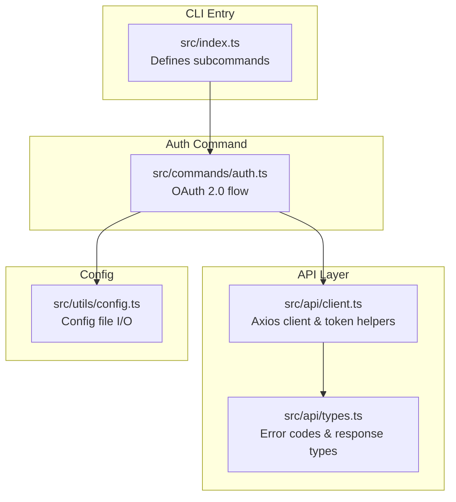
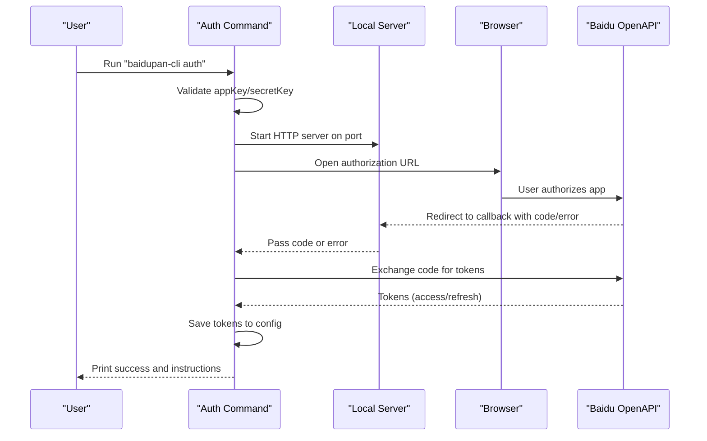
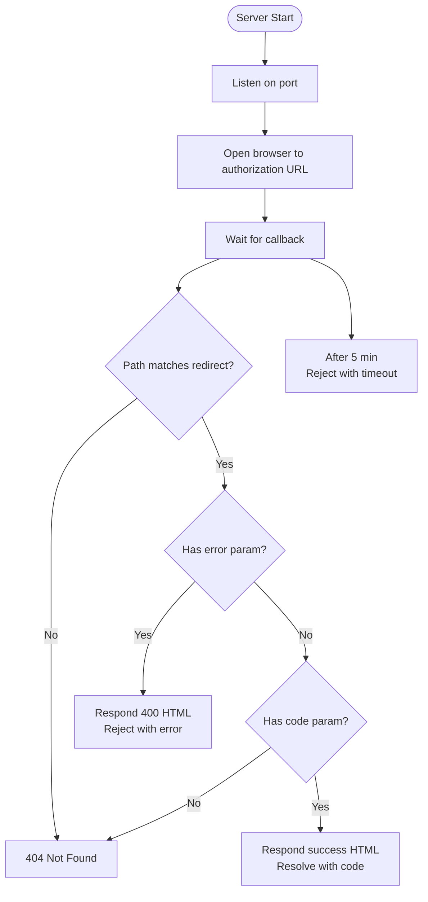
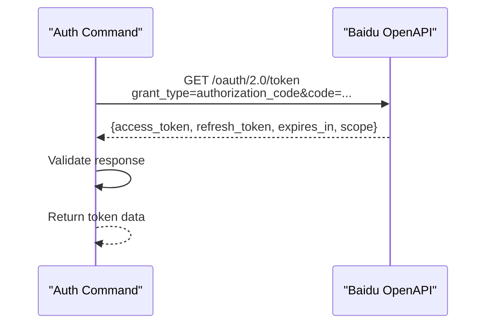
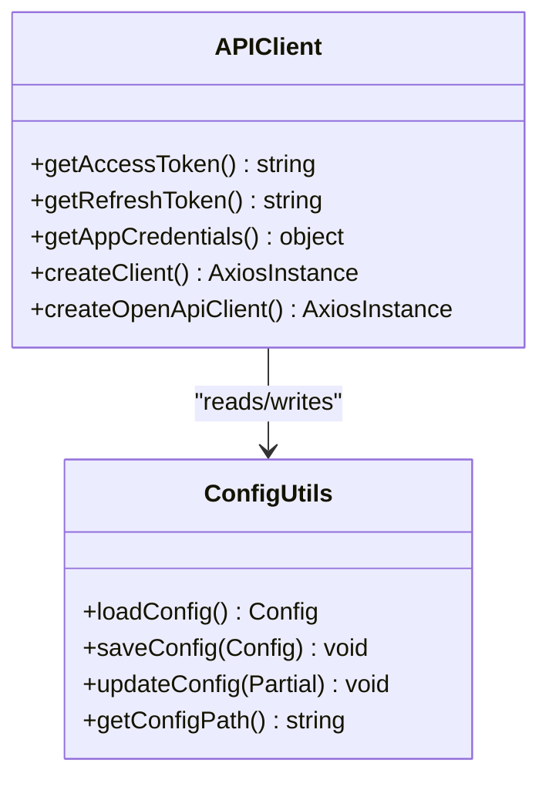
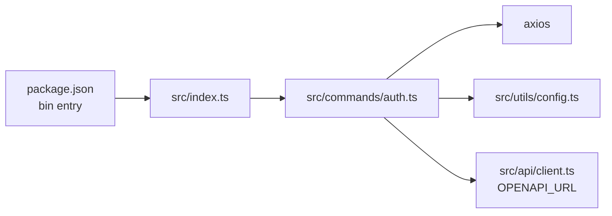

# Auth Command

<cite>
**Referenced Files in This Document**
- [auth.ts](file://src/commands/auth.ts)
- [client.ts](file://src/api/client.ts)
- [config.ts](file://src/utils/config.ts)
- [index.ts](file://src/index.ts)
- [README.md](file://README.md)
- [package.json](file://package.json)
- [types.ts](file://src/api/types.ts)
</cite>

## Table of Contents
1. [Introduction](#introduction)
2. [Project Structure](#project-structure)
3. [Core Components](#core-components)
4. [Architecture Overview](#architecture-overview)
5. [Detailed Component Analysis](#detailed-component-analysis)
6. [Dependency Analysis](#dependency-analysis)
7. [Performance Considerations](#performance-considerations)
8. [Troubleshooting Guide](#troubleshooting-guide)
9. [Conclusion](#conclusion)
10. [Appendices](#appendices)

## Introduction
This document explains the auth command used to authenticate with Baidu Pan via OAuth 2.0. It covers command syntax, parameters, environment variable alternatives, the complete OAuth flow (local server setup, browser authorization, token exchange), automatic browser opening and manual fallback, error handling, practical examples, troubleshooting, and security considerations.

## Project Structure
The auth command is part of a CLI tool that manages Baidu Pan operations. The command is defined in the commands module and integrates with the API client and configuration utilities.

**Diagram sources**
- [index.ts](file://src/index.ts#L8-L23)
- [auth.ts](file://src/commands/auth.ts#L19-L91)
- [client.ts](file://src/api/client.ts#L112-L161)
- [config.ts](file://src/utils/config.ts#L16-L45)
- [types.ts](file://src/api/types.ts#L98-L108)

**Section sources**
- [index.ts](file://src/index.ts#L1-L26)
- [auth.ts](file://src/commands/auth.ts#L1-L258)
- [client.ts](file://src/api/client.ts#L1-L171)
- [config.ts](file://src/utils/config.ts#L1-L62)
- [types.ts](file://src/api/types.ts#L1-L108)

## Core Components
- Auth command definition and argument parsing
- Local HTTP server for OAuth callback handling
- Browser automation for authorization
- Token exchange with Baidu Open API
- Configuration persistence and environment variable support

Key responsibilities:
- Validate required parameters (appKey, secretKey) or environment variables
- Start a local server to receive OAuth callbacks
- Open browser to Baidu authorization endpoint
- Exchange authorization code for access/refresh tokens
- Persist tokens to config and print helpful messages

**Section sources**
- [auth.ts](file://src/commands/auth.ts#L19-L91)
- [auth.ts](file://src/commands/auth.ts#L93-L159)
- [auth.ts](file://src/commands/auth.ts#L161-L192)
- [auth.ts](file://src/commands/auth.ts#L194-L216)
- [auth.ts](file://src/commands/auth.ts#L218-L257)

## Architecture Overview
The auth command orchestrates an OAuth 2.0 flow with the following steps:
1. Parse arguments and environment variables
2. Start a local HTTP server to listen for the authorization callback
3. Build the authorization URL and open the browser
4. Wait for the callback with the authorization code
5. Exchange the code for tokens via Baidu Open API
6. Save tokens to config and print success information

**Diagram sources**
- [auth.ts](file://src/commands/auth.ts#L46-L91)
- [auth.ts](file://src/commands/auth.ts#L93-L159)
- [auth.ts](file://src/commands/auth.ts#L161-L192)
- [auth.ts](file://src/commands/auth.ts#L218-L257)

## Detailed Component Analysis

### Command Definition and Arguments
- Command name: auth
- Description: Authorize with Baidu Pan (auto open browser)
- Arguments:
  - appKey (-k): Baidu Pan App Key (required)
  - secretKey (-s): Baidu Pan Secret Key (required)
  - redirectUri (-r): Custom redirect URI (optional)
  - port (-p): Local server port (default 9876)

Environment variable alternatives:
- BAIDU_APP_KEY
- BAIDU_SECRET_KEY

Behavior:
- If appKey or secretKey are missing, prints usage and exits with error
- If redirectUri is not provided, constructs a default localhost callback URL using the port
- Prints the callback URL and instructions for adding it to the Baidu developer console

**Section sources**
- [auth.ts](file://src/commands/auth.ts#L19-L45)
- [auth.ts](file://src/commands/auth.ts#L46-L74)

### Local Server Setup and Callback Handling
- Creates an HTTP server bound to localhost and the configured port
- Handles GET requests to the redirect path
- Extracts the authorization code from query parameters
- Handles error query parameters from Baidu
- Responds with a success page and resolves the promise with the code
- Rejects with an error if authorization fails or times out
- Starts a 5-minute timeout timer

**Diagram sources**
- [auth.ts](file://src/commands/auth.ts#L93-L159)

**Section sources**
- [auth.ts](file://src/commands/auth.ts#L93-L159)

### Browser Authorization and Manual Fallback
- Opens the browser using platform-specific commands:
  - macOS: open
  - Windows: start
  - Linux: xdg-open
- If automatic opening fails, logs a message and prints the authorization URL for manual access
- After successful authorization, prints a success page and closes the server

**Section sources**
- [auth.ts](file://src/commands/auth.ts#L130-L147)
- [auth.ts](file://src/commands/auth.ts#L194-L216)

### Token Exchange Process
- Sends a GET request to Baidu Open API token endpoint with:
  - grant_type=authorization_code
  - code
  - client_id (appKey)
  - client_secret (secretKey)
  - redirect_uri (must match the registered redirect URI)
- Sets a 10-second timeout and disables proxy
- Parses the response and validates presence of access_token
- Throws an error if the response contains an error field

**Diagram sources**
- [auth.ts](file://src/commands/auth.ts#L161-L192)

**Section sources**
- [auth.ts](file://src/commands/auth.ts#L161-L192)

### Configuration Persistence and Success Output
- Saves tokens to the config file with:
  - access_token
  - refresh_token
  - app_key
  - secret_key
  - expires_at (timestamp)
- Prints success banner, config file location, expiration time, and helpful instructions for copying config or setting environment variables

**Section sources**
- [auth.ts](file://src/commands/auth.ts#L218-L257)
- [config.ts](file://src/utils/config.ts#L35-L45)

### Integration with API Client and Token Management
- The API client loads tokens from environment variables or config file
- Provides automatic token refresh when access token expires
- Intercepts requests and responses to handle token expiration transparently

**Diagram sources**
- [client.ts](file://src/api/client.ts#L15-L55)
- [client.ts](file://src/api/client.ts#L112-L161)
- [config.ts](file://src/utils/config.ts#L16-L61)

**Section sources**
- [client.ts](file://src/api/client.ts#L15-L55)
- [client.ts](file://src/api/client.ts#L63-L104)
- [client.ts](file://src/api/client.ts#L112-L161)
- [config.ts](file://src/utils/config.ts#L16-L61)

## Dependency Analysis
- The auth command depends on:
  - Node HTTP server for local callback handling
  - Axios for token exchange
  - Baidu Open API base URL constants
  - Config utilities for saving tokens
- The CLI entry registers the auth command and exposes it globally via package bin

**Diagram sources**
- [package.json](file://package.json#L32-L34)
- [index.ts](file://src/index.ts#L8-L23)
- [auth.ts](file://src/commands/auth.ts#L1-L7)
- [client.ts](file://src/api/client.ts#L6-L7)
- [config.ts](file://src/utils/config.ts#L1-L6)

**Section sources**
- [package.json](file://package.json#L32-L34)
- [index.ts](file://src/index.ts#L8-L23)
- [auth.ts](file://src/commands/auth.ts#L1-L7)
- [client.ts](file://src/api/client.ts#L6-L7)
- [config.ts](file://src/utils/config.ts#L1-L6)

## Performance Considerations
- Local server timeout: 5 minutes to prevent hanging
- Token exchange timeout: 10 seconds to avoid blocking
- No proxy is used for token exchange to prevent unexpected network interference
- Config file I/O is synchronous and minimal, performed once during success output

[No sources needed since this section provides general guidance]

## Troubleshooting Guide

Common issues and resolutions:
- Invalid credentials
  - Symptom: Authorization failure or token exchange error
  - Resolution: Verify appKey and secretKey; ensure they match the Baidu developer console
- Network failures
  - Symptom: Timeout or HTTP error during token exchange
  - Resolution: Check connectivity to Baidu Open API; disable conflicting proxies
- Authorization timeout
  - Symptom: Server rejects after 5 minutes
  - Resolution: Ensure the callback URL is whitelisted and reachable; avoid firewall restrictions
- Port conflicts
  - Symptom: Cannot start local server
  - Resolution: Change port with the port option or free the port
- Redirect URI mismatch
  - Symptom: Authorization fails immediately
  - Resolution: Add the exact callback URL to the Baidu developer console

Security considerations:
- Store app keys and tokens securely; avoid committing them to version control
- Prefer environment variables for CI/CD contexts
- Limit token scopes to the minimum required for operations

**Section sources**
- [auth.ts](file://src/commands/auth.ts#L51-L63)
- [auth.ts](file://src/commands/auth.ts#L149-L157)
- [auth.ts](file://src/commands/auth.ts#L182-L189)
- [README.md](file://README.md#L135-L149)

## Conclusion
The auth command provides a streamlined OAuth 2.0 experience for Baidu Pan authentication. It handles local callback routing, browser automation, token exchange, and secure configuration persistence. By following the documented parameters, environment variables, and troubleshooting steps, users can reliably authenticate and operate the CLI.

[No sources needed since this section summarizes without analyzing specific files]

## Appendices

### Command Syntax and Options
- Syntax: baidupan-cli auth [-k APP_KEY] [-s SECRET_KEY] [-r REDIRECT_URI] [-p PORT]
- Aliases:
  - -k for appKey
  - -s for secretKey
  - -r for redirectUri
  - -p for port

Environment variables:
- BAIDU_APP_KEY
- BAIDU_SECRET_KEY

Defaults:
- Port: 9876
- Redirect path: /callback
- Redirect host: localhost

**Section sources**
- [auth.ts](file://src/commands/auth.ts#L24-L45)
- [auth.ts](file://src/commands/auth.ts#L8-L10)
- [README.md](file://README.md#L27-L41)

### Practical Examples
- Basic authentication with parameters:
  - baidupan-cli auth -k YOUR_APP_KEY -s YOUR_SECRET_KEY
- Using environment variables:
  - export BAIDU_APP_KEY=YOUR_APP_KEY
  - export BAIDU_SECRET_KEY=YOUR_SECRET_KEY
  - baidupan-cli auth
- Custom redirect URI and port:
  - baidupan-cli auth -k YOUR_APP_KEY -s YOUR_SECRET_KEY -r https://your-domain.com/callback -p 8080

Notes:
- Ensure the redirect URI is added to your Baidu developer console application settings
- If the browser does not open automatically, follow the printed authorization URL

**Section sources**
- [README.md](file://README.md#L27-L41)
- [auth.ts](file://src/commands/auth.ts#L65-L74)
- [auth.ts](file://src/commands/auth.ts#L143-L146)

### Security Best Practices
- Protect app keys and tokens; never share them
- Use environment variables in automated environments
- Limit token scopes to required permissions
- Regularly review and rotate credentials

**Section sources**
- [README.md](file://README.md#L118-L127)
- [config.ts](file://src/utils/config.ts#L35-L45)
