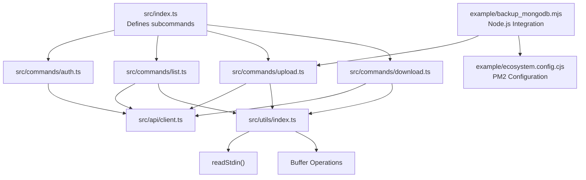
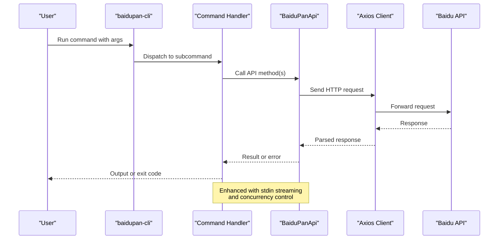
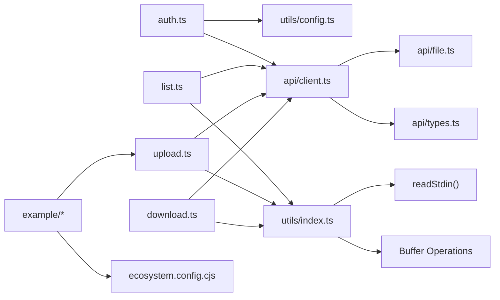

# Command Reference

<cite>
**Referenced Files in This Document**
- [src/index.ts](file://src/index.ts)
- [src/commands/auth.ts](file://src/commands/auth.ts)
- [src/commands/list.ts](file://src/commands/list.ts)
- [src/commands/upload.ts](file://src/commands/upload.ts)
- [src/commands/download.ts](file://src/commands/download.ts)
- [src/api/client.ts](file://src/api/client.ts)
- [src/api/file.ts](file://src/api/file.ts)
- [src/api/types.ts](file://src/api/types.ts)
- [src/utils/config.ts](file://src/utils/config.ts)
- [src/utils/index.ts](file://src/utils/index.ts)
- [example/backup_mongodb.mjs](file://example/backup_mongodb.mjs)
- [example/README.md](file://example/README.md)
- [example/ecosystem.config.cjs](file://example/ecosystem.config.cjs)
- [package.json](file://package.json)
- [README.md](file://README.md)
</cite>

## Update Summary
**Changes Made**
- Enhanced upload command documentation with new stdin streaming capabilities
- Added Node.js integration examples and programmatic usage patterns
- Updated concurrency option documentation for chunk upload control
- Added practical examples for automated backup scenarios

## Table of Contents
1. [Introduction](#introduction)
2. [Project Structure](#project-structure)
3. [Core Components](#core-components)
4. [Architecture Overview](#architecture-overview)
5. [Detailed Command Reference](#detailed-command-reference)
6. [Node.js Integration Examples](#nodejs-integration-examples)
7. [Dependency Analysis](#dependency-analysis)
8. [Performance Considerations](#performance-considerations)
9. [Troubleshooting Guide](#troubleshooting-guide)
10. [Conclusion](#conclusion)
11. [Appendices](#appendices)

## Introduction
This document provides a comprehensive command reference for the Baidu Pan CLI tool. It covers all CLI commands, their syntax, parameters, options, aliases, execution flows, error handling, return codes, and practical usage examples. It targets both beginners and advanced users who want to manage Baidu Pan files efficiently from the command line, including modern Node.js integration patterns.

## Project Structure
The CLI is organized around a central entry point that defines subcommands. Each subcommand encapsulates its own argument parsing and execution logic. Shared functionality resides in API clients and utilities, with enhanced support for Node.js integration through dedicated example scripts.



**Diagram sources**
- [src/index.ts](file://src/index.ts#L8-L23)
- [src/commands/auth.ts](file://src/commands/auth.ts#L19-L91)
- [src/commands/list.ts](file://src/commands/list.ts#L6-L81)
- [src/commands/upload.ts](file://src/commands/upload.ts#L16-L96)
- [src/commands/download.ts](file://src/commands/download.ts#L9-L104)
- [src/api/client.ts](file://src/api/client.ts#L112-L161)
- [src/api/file.ts](file://src/api/file.ts#L16-L175)
- [src/api/types.ts](file://src/api/types.ts#L1-L108)
- [src/utils/config.ts](file://src/utils/config.ts#L1-L62)
- [src/utils/index.ts](file://src/utils/index.ts#L1-L110)
- [example/backup_mongodb.mjs](file://example/backup_mongodb.mjs#L1-L104)
- [example/ecosystem.config.cjs](file://example/ecosystem.config.cjs#L1-L24)

**Section sources**
- [src/index.ts](file://src/index.ts#L1-L26)
- [package.json](file://package.json#L32-L34)

## Core Components
- Subcommand registry: Centralized definition of commands and aliases.
- Command implementations: Each command defines its arguments and execution logic.
- API client: Handles authentication, token refresh, and HTTP requests to Baidu APIs.
- Utilities: Path normalization, file system helpers, progress printing, and enhanced stdin streaming capabilities.
- Node.js integration: Dedicated example scripts demonstrating programmatic usage patterns.

**Section sources**
- [src/index.ts](file://src/index.ts#L8-L23)
- [src/api/client.ts](file://src/api/client.ts#L112-L161)
- [src/utils/index.ts](file://src/utils/index.ts#L25-L110)

## Architecture Overview
The CLI follows a layered architecture with enhanced Node.js integration support:
- Entry point registers subcommands and aliases.
- Commands depend on an API client to communicate with Baidu Pan services.
- API client manages tokens, interceptors, and retries.
- Utilities provide cross-cutting concerns like path normalization, progress reporting, and stdin streaming.
- Example scripts demonstrate programmatic usage patterns for automation and integration.



**Diagram sources**
- [src/index.ts](file://src/index.ts#L8-L23)
- [src/commands/list.ts](file://src/commands/list.ts#L36-L79)
- [src/api/file.ts](file://src/api/file.ts#L42-L60)
- [src/api/client.ts](file://src/api/client.ts#L112-L161)

## Detailed Command Reference

### Command: auth
Purpose: Authorize with Baidu Pan using OAuth. Starts a local server to receive the authorization code and exchanges it for tokens.

- Syntax
  - baidupan-cli auth [-k, --appKey KEY] [-s, --secretKey KEY] [-r, --redirectUri URI] [-p, --port PORT]
- Aliases: None
- Positional arguments: None
- Options
  - -k, --appKey KEY
    - Description: Baidu Pan App Key
    - Environment fallback: BAIDU_APP_KEY
  - -s, --secretKey KEY
    - Description: Baidu Pan Secret Key
    - Environment fallback: BAIDU_SECRET_KEY
  - -r, --redirectUri URI
    - Description: Custom redirect URI (e.g., https://your-domain.com/callback)
    - Default: http://localhost:PORT/callback
  - -p, --port PORT
    - Description: Local server port (default: 9876)
- Execution flow
  - Validates appKey and secretKey (from args or environment).
  - Starts a local HTTP server to listen for the OAuth callback.
  - Opens the browser to the authorization URL.
  - Waits up to 5 minutes for the callback.
  - Exchanges the authorization code for tokens.
  - Saves tokens to the config file and prints success information.
- Error handling and return codes
  - Exits with code 1 on missing credentials, server startup failure, authorization failure, or token exchange errors.
- Practical examples
  - baidupan-cli auth -k YOUR_APP_KEY -s YOUR_SECRET_KEY
  - baidupan-cli auth (with BAIDU_APP_KEY and BAIDU_SECRET_KEY set)
  - baidupan-cli auth -r https://your-domain.com/callback -p 8080
- Notes
  - Ensure the redirect URI is added to your app's redirect URIs in the Baidu Open Platform.

**Section sources**
- [src/commands/auth.ts](file://src/commands/auth.ts#L19-L91)
- [src/commands/auth.ts](file://src/commands/auth.ts#L93-L159)
- [src/commands/auth.ts](file://src/commands/auth.ts#L161-L192)
- [src/commands/auth.ts](file://src/commands/auth.ts#L218-L257)
- [src/api/client.ts](file://src/api/client.ts#L15-L37)
- [README.md](file://README.md#L17-L42)

---

### Command: list
Purpose: List files in a directory with optional sorting and JSON output.

- Syntax
  - baidupan-cli list [PATH] [-o, --order NAME|TIME|SIZE] [-d, --desc] [-j, --json]
- Aliases
  - ls -> list
- Positional arguments
  - PATH
    - Description: Directory path (default: /)
- Options
  - -o, --order NAME|TIME|SIZE
    - Description: Sort by name, time, or size
    - Default: name
  - -d, --desc
    - Description: Sort in descending order
    - Default: false
  - -j, --json
    - Description: Output as JSON
    - Default: false
- Execution flow
  - Normalizes PATH to ensure leading slash.
  - Calls the file listing API with order and desc options.
  - Prints a formatted table unless --json is used.
  - Prints a message for empty directories.
- Error handling and return codes
  - Exits with code 1 on API errors or invalid parameters.
- Practical examples
  - baidupan-cli list /
  - baidupan-cli list /apps -o time -d
  - baidupan-cli list /docs -o size
  - baidupan-cli list /media --json
- Notes
  - Sorting uses the Baidu API's order and desc parameters.

**Section sources**
- [src/commands/list.ts](file://src/commands/list.ts#L6-L81)
- [src/api/file.ts](file://src/api/file.ts#L42-L60)
- [src/utils/index.ts](file://src/utils/index.ts#L25-L33)

---

### Command: upload
Purpose: Upload a single file, a directory (recursively), or data from stdin to Baidu Pan with configurable concurrency control.

- Syntax
  - baidupan-cli upload LOCAL REMOTE [-c, --concurrency N]
- Aliases
  - up -> upload
- Positional arguments
  - LOCAL
    - Description: Local file/directory path; use "-" to read from stdin
    - Required
  - REMOTE
    - Description: Remote path on Baidu Pan
    - Required
  - concurrency
    - Description: Concurrent chunk uploads (default: 3)
    - Alias: -c
- Execution flow
  - Normalizes REMOTE path to ensure leading slash.
  - Handles stdin input if LOCAL is "-".
  - Validates existence of LOCAL path.
  - If LOCAL is a directory, enumerates files recursively and uploads each file individually.
  - For single files or stdin data:
    - Determines final remote path (appends filename if REMOTE ends with "/").
    - Splits data into chunks and calculates MD5 lists.
    - Precreates file, uploads missing chunks with concurrency control, and creates the file.
- Error handling and return codes
  - Exits with code 1 on missing local path, API errors, or upload failures.
- Practical examples
  - baidupan-cli upload ./file.txt /dest/file.txt
  - baidupan-cli upload ./folder /dest/folder/
  - echo "content" | baidupan-cli upload - /dest/stdin.txt
  - baidupan-cli upload ./large-file.zip /backup/ -c 5
- Notes
  - Large files are split into 4 MB chunks; progress is printed during chunk uploads.
  - Concurrency controls the number of simultaneous chunk uploads for optimal performance.

**Updated** Enhanced with stdin streaming capabilities and concurrency control for better performance tuning.

**Section sources**
- [src/commands/upload.ts](file://src/commands/upload.ts#L16-L96)
- [src/commands/upload.ts](file://src/commands/upload.ts#L98-L144)
- [src/api/file.ts](file://src/api/file.ts#L79-L102)
- [src/api/file.ts](file://src/api/file.ts#L107-L138)
- [src/api/file.ts](file://src/api/file.ts#L143-L167)
- [src/utils/index.ts](file://src/utils/index.ts#L35-L55)
- [src/utils/index.ts](file://src/utils/index.ts#L76-L93)
- [src/utils/index.ts](file://src/utils/index.ts#L77-L94)

---

### Command: download
Purpose: Download a file from Baidu Pan to a local path.

- Syntax
  - baidupan-cli download REMOTE [LOCAL]
- Aliases
  - dl -> download
- Positional arguments
  - REMOTE
    - Description: Remote file path on Baidu Pan
    - Required
  - LOCAL
    - Description: Local save path (optional, defaults to current directory)
- Execution flow
  - Normalizes REMOTE path to ensure leading slash.
  - Lists the parent directory to locate the target file by name or path.
  - Retrieves file metadata to obtain the download link (dlink).
  - Determines the local path (current directory or provided path; auto-appends filename if LOCAL is a directory).
  - Downloads the file using the dlink with access_token and writes to disk.
  - Shows progress percentage during download.
- Error handling and return codes
  - Exits with code 1 if file not found, LOCAL path is a directory without a filename, or download link cannot be obtained.
- Practical examples
  - baidupan-cli download /file.txt
  - baidupan-cli download /file.txt ./out.txt
  - baidupan-cli download /file.txt ./downloads/
- Notes
  - Progress is shown on stderr; final save path is printed on stdout.

**Section sources**
- [src/commands/download.ts](file://src/commands/download.ts#L9-L104)
- [src/api/file.ts](file://src/api/file.ts#L65-L74)
- [src/api/client.ts](file://src/api/client.ts#L15-L37)

---

### Command: Aliases
- ls -> list
- up -> upload
- dl -> download

These aliases provide convenient shortcuts for frequently used commands.

**Section sources**
- [src/index.ts](file://src/index.ts#L17-L21)

## Node.js Integration Examples

### Programmatic Usage Patterns
The CLI supports seamless integration with Node.js applications through various approaches demonstrated in the example scripts.

#### Direct Command Execution
The backup script demonstrates spawning the CLI as a child process for automated workflows:

```javascript
const result = spawnSync('npx', ['--yes', 'baidupan-cli', 'upload', backupFile, remotePath], {
  stdio: 'inherit',
  shell: true,
})
```

#### Environment-Based Configuration
Node.js scripts can leverage environment variables for configuration:

```javascript
const mongoUrl = process.env.MONGO_URL || process.argv[2]
const remoteDir = process.env.REMOTE_DIR || process.argv[3]
```

#### PM2 Integration
The ecosystem configuration shows how to schedule automated backups using PM2:

```javascript
module.exports = {
  apps: [{
    cron_restart: '0 * * * *', // Every hour
    autorestart: false, // Wait for cron triggers
    env: {
      MONGO_URL: 'mongodb://localhost:27017/mydb',
      REMOTE_DIR: '/backup/mongodb'
    }
  }],
}
```

### Advanced Upload Patterns
For programmatic control, the upload command exposes stdin streaming and concurrency options:

#### Stdin Streaming
```bash
echo "data" | baidupan-cli upload - /dest/stdin.txt
```

#### Concurrency Control
```bash
baidupan-cli upload ./large-file.zip /backup/ -c 5
```

**Section sources**
- [example/backup_mongodb.mjs](file://example/backup_mongodb.mjs#L1-L104)
- [example/README.md](file://example/README.md#L1-L111)
- [example/ecosystem.config.cjs](file://example/ecosystem.config.cjs#L1-L24)

## Dependency Analysis
The commands depend on shared utilities and the API client. The API client manages authentication and retries, while utilities handle path normalization, progress reporting, and enhanced stdin streaming capabilities for Node.js integration.



**Diagram sources**
- [src/commands/auth.ts](file://src/commands/auth.ts#L1-L10)
- [src/commands/list.ts](file://src/commands/list.ts#L1-L5)
- [src/commands/upload.ts](file://src/commands/upload.ts#L1-L15)
- [src/commands/download.ts](file://src/commands/download.ts#L1-L7)
- [src/api/client.ts](file://src/api/client.ts#L1-L5)
- [src/api/file.ts](file://src/api/file.ts#L1-L12)
- [src/utils/config.ts](file://src/utils/config.ts#L1-L6)
- [src/utils/index.ts](file://src/utils/index.ts#L1-L11)
- [example/backup_mongodb.mjs](file://example/backup_mongodb.mjs#L1-L104)

**Section sources**
- [src/index.ts](file://src/index.ts#L3-L6)
- [src/api/client.ts](file://src/api/client.ts#L112-L161)

## Performance Considerations
- Upload chunk size: Files are split into 4 MB chunks for stability and progress tracking.
- Token refresh: The client automatically refreshes expired tokens and retries failed requests.
- Progress reporting: Both upload and download show progress bars and percentages.
- Network timeouts: Requests have reasonable timeouts; ensure network connectivity and avoid proxies that block Baidu domains.
- Concurrency control: The upload command allows tuning concurrent chunk uploads for optimal performance based on network conditions and system resources.

## Troubleshooting Guide
Common issues and resolutions:
- Authorization failures
  - Verify App Key and Secret Key are correct.
  - Confirm redirect URI matches the Baidu Open Platform configuration.
  - Ensure the local port is available (default 9876).
- Token not found
  - Run the auth command or set BAIDU_ACCESS_TOKEN and related environment variables.
- File not found during download
  - Ensure the remote path is correct and the file exists.
- Permission or path errors
  - Ensure remote paths start with "/" and the user has access to the target directory.
- Network connectivity
  - Confirm access to Baidu API endpoints and absence of blocking proxies.
- Stdin streaming issues
  - Ensure proper pipe redirection and data formatting when using "-" as LOCAL path.
- Concurrency problems
  - Adjust the concurrency parameter based on network bandwidth and system capabilities.

**Section sources**
- [src/api/client.ts](file://src/api/client.ts#L15-L37)
- [src/commands/auth.ts](file://src/commands/auth.ts#L51-L63)
- [src/commands/download.ts](file://src/commands/download.ts#L43-L51)
- [src/commands/upload.ts](file://src/commands/upload.ts#L51-L57)
- [README.md](file://README.md#L135-L155)

## Conclusion
This CLI provides a robust, scriptable interface to Baidu Pan with strong support for listing, uploading, downloading, and authenticating. The enhanced stdin streaming capabilities and Node.js integration examples enable seamless automation and programmatic usage in modern development workflows. Use the provided examples and notes to integrate these commands into automation scripts, backup systems, and production environments.

## Appendices

### Appendix A: Authentication Environment Variables
- BAIDU_APP_KEY
- BAIDU_SECRET_KEY
- BAIDU_ACCESS_TOKEN
- BAIDU_REFRESH_TOKEN

**Section sources**
- [src/api/client.ts](file://src/api/client.ts#L49-L54)
- [src/api/client.ts](file://src/api/client.ts#L15-L37)
- [README.md](file://README.md#L118-L127)

### Appendix B: Configuration File Location
- Windows: %USERPROFILE%\.baidupan-cli\config.json
- macOS/Linux: ~/.baidupan-cli/config.json

**Section sources**
- [src/utils/config.ts](file://src/utils/config.ts#L5-L6)
- [README.md](file://README.md#L129-L134)

### Appendix C: Node.js Integration Examples
- MongoDB backup automation with PM2 scheduling
- Environment-based configuration patterns
- Child process execution for CLI integration
- Stdin streaming for pipeline processing

**Section sources**
- [example/backup_mongodb.mjs](file://example/backup_mongodb.mjs#L1-L104)
- [example/README.md](file://example/README.md#L1-L111)
- [example/ecosystem.config.cjs](file://example/ecosystem.config.cjs#L1-L24)
