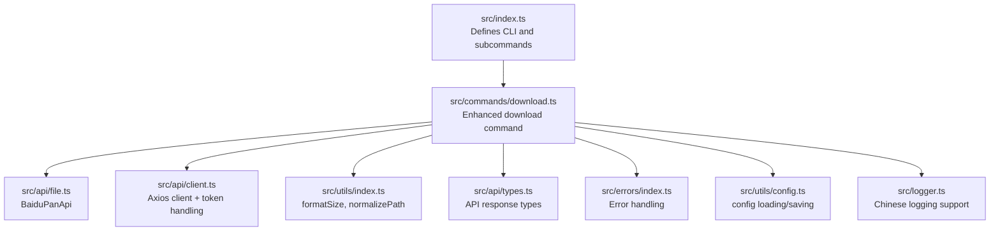
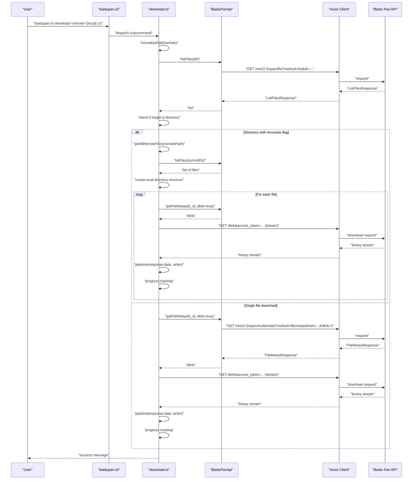
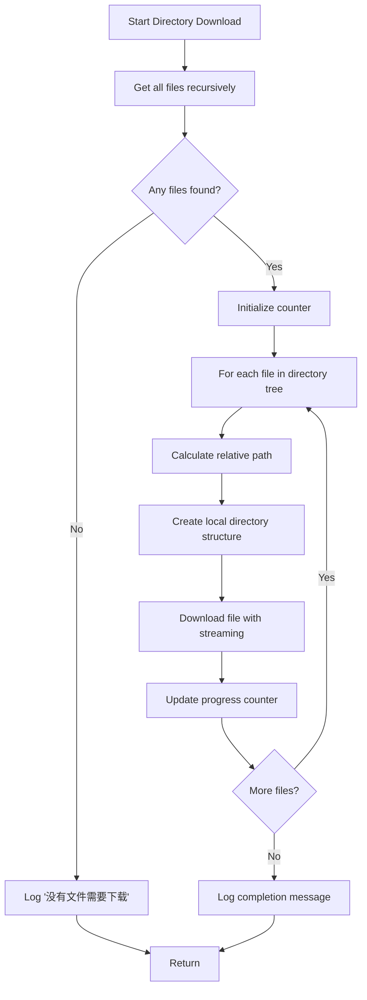
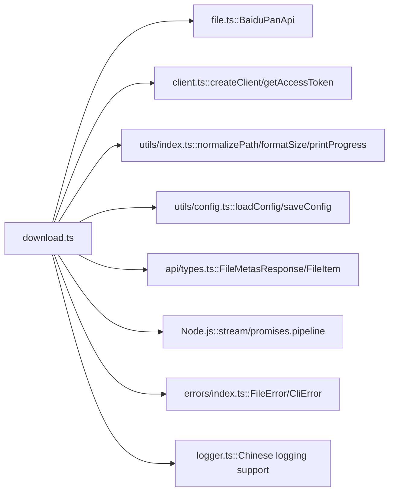

# Download Command

<cite>
**Referenced Files in This Document**
- [src/index.ts](file://src/index.ts)
- [src/commands/download.ts](file://src/commands/download.ts)
- [src/api/file.ts](file://src/api/file.ts)
- [src/api/client.ts](file://src/api/client.ts)
- [src/api/types.ts](file://src/api/types.ts)
- [src/utils/index.ts](file://src/utils/index.ts)
- [src/utils/config.ts](file://src/utils/config.ts)
- [src/errors/index.ts](file://src/errors/index.ts)
- [src/logger.ts](file://src/logger.ts)
- [src/api/token.ts](file://src/api/token.ts)
- [src/commands/auth.ts](file://src/commands/auth.ts)
- [README.md](file://README.md)
- [example/README.md](file://example/README.md)
- [example/backup_mongodb.sh](file://example/backup_mongodb.sh)
- [example/setup_cron.sh](file://example/setup_cron.sh)
</cite>

## Update Summary
**Changes Made**
- Updated download command to support recursive directory downloads with new `-r/--recursive` flag
- Enhanced streaming capabilities for large file downloads using Node.js streams and pipeline utility
- Added comprehensive directory traversal functionality with proper path resolution
- Updated progress tracking to handle both single files and directory downloads
- Enhanced error handling for directory operations and stream processing
- **Updated**: Complete Chinese localization of all user-facing messages including '正在查找', '文件不存在', '正在下载目录', '下载完成', progress indicators, and error messages
- **Updated**: Enhanced logging with Chinese prompts throughout the download process

## Table of Contents
1. [Introduction](#introduction)
2. [Project Structure](#project-structure)
3. [Core Components](#core-components)
4. [Architecture Overview](#architecture-overview)
5. [Detailed Component Analysis](#detailed-component-analysis)
6. [Dependency Analysis](#dependency-analysis)
7. [Performance Considerations](#performance-considerations)
8. [Troubleshooting Guide](#troubleshooting-guide)
9. [Conclusion](#conclusion)
10. [Appendices](#appendices)

## Introduction
This document provides comprehensive documentation for the download command used to retrieve files from Baidu Pan. The download command has been significantly enhanced with recursive directory download capabilities and streaming support for large file downloads. It covers command syntax, positional arguments, download behavior, progress tracking, and integration patterns. The command now supports both single file downloads and recursive directory downloads with proper directory structure preservation. **Updated**: All user-facing messages are now fully localized in Chinese for improved user experience.

## Project Structure
The download command is implemented as a subcommand of the main CLI application with enhanced recursive directory traversal capabilities. The command orchestrates:
- Argument parsing and normalization
- Remote file discovery via directory listing
- Recursive directory traversal for batch downloads
- Metadata retrieval to obtain direct download links
- Streaming HTTP downloads with progress reporting
- Local file writing with directory structure preservation

**Diagram sources**
- [src/index.ts](file://src/index.ts#L1-L49)
- [src/commands/download.ts](file://src/commands/download.ts#L1-L191)
- [src/api/file.ts](file://src/api/file.ts#L1-L201)
- [src/api/client.ts](file://src/api/client.ts#L1-L69)
- [src/utils/index.ts](file://src/utils/index.ts#L1-L111)
- [src/api/types.ts](file://src/api/types.ts#L1-L102)
- [src/errors/index.ts](file://src/errors/index.ts#L1-L23)
- [src/utils/config.ts](file://src/utils/config.ts#L19-L45)
- [src/logger.ts](file://src/logger.ts#L1-L23)

**Section sources**
- [src/index.ts](file://src/index.ts#L1-L49)
- [README.md](file://README.md#L120-L145)

## Core Components
- Command definition and arguments:
  - Positional argument remote: remote file/directory path on Baidu Pan (required)
  - Positional argument local: local save path (optional; defaults to current directory)
  - Flag recursive: enable recursive directory downloads (defaults to false)
- Execution flow:
  - Normalize remote path
  - List directory contents to locate the target file/directory
  - Validate that the target exists
  - Handle directory downloads with recursive traversal
  - Retrieve file metadata to obtain direct download links
  - Stream download with progress reporting
  - Write downloaded data to local paths with directory structure preservation

Key behaviors:
- **Enhanced**: Supports both single file and recursive directory downloads
- **New**: Directory structure is preserved during recursive downloads
- **Improved**: Uses streaming for large file downloads with proper progress tracking
- **Enhanced**: Automatic directory creation for nested directory structures
- **Improved**: Better error handling for directory operations
- **Updated**: All user-facing messages are now in Chinese for native speaker experience

**Section sources**
- [src/commands/download.ts](file://src/commands/download.ts#L12-L33)
- [src/commands/download.ts](file://src/commands/download.ts#L34-L68)
- [src/commands/download.ts](file://src/commands/download.ts#L71-L129)

## Architecture Overview
The download command integrates with the Baidu Pan API through a typed wrapper and an Axios client configured with token handling and automatic retry on token expiration. The enhanced architecture now includes recursive directory traversal and streaming capabilities with comprehensive Chinese localization.

**Diagram sources**
- [src/commands/download.ts](file://src/commands/download.ts#L34-L68)
- [src/commands/download.ts](file://src/commands/download.ts#L71-L129)
- [src/commands/download.ts](file://src/commands/download.ts#L131-L191)
- [src/api/file.ts](file://src/api/file.ts#L42-L74)
- [src/api/client.ts](file://src/api/client.ts#L10-L57)

## Detailed Component Analysis

### Command Syntax and Arguments
- Name: download
- Aliases: dl
- Positional arguments:
  - remote: Remote file/directory path on Baidu Pan (required)
  - local: Local save path (optional)
- Flags:
  - recursive: Enable recursive directory downloads (defaults to false)
  - r: Short alias for recursive flag
- Behavior:
  - If local is omitted, the file/directory is saved under the current working directory
  - If local is a directory, the file/directory is saved inside that directory
  - If local is a non-existing file path, the file is saved at that path
  - **New**: When recursive flag is enabled, directories are downloaded with full structure preservation
  - **Updated**: All user-facing messages are now in Chinese for improved user experience

Notes:
- **Enhanced**: Now supports both single file and recursive directory downloads
- **New**: Recursive downloads preserve the original directory structure
- **Enhanced**: Proper error handling for directory operations
- **Updated**: Chinese localization of all user-facing messages including progress indicators and error messages

**Section sources**
- [src/index.ts](file://src/index.ts#L43-L44)
- [src/commands/download.ts](file://src/commands/download.ts#L17-L33)
- [src/commands/download.ts](file://src/commands/download.ts#L56-L64)
- [README.md](file://README.md#L120-L145)

### Recursive Directory Download
- **New Feature**: Enhanced directory download capability with recursive traversal
- **Implementation**: Uses breadth-first traversal to collect all files in the directory tree
- **Structure Preservation**: Maintains original directory hierarchy in local filesystem
- **Progress Tracking**: Provides progress for each file in the recursive download
- **Directory Creation**: Automatically creates necessary directory structure locally
- **Updated**: All progress messages are now in Chinese, including '正在下载目录', '正在下载', and '进度'

**Diagram sources**
- [src/commands/download.ts](file://src/commands/download.ts#L71-L129)
- [src/commands/download.ts](file://src/commands/download.ts#L110-L129)

**Section sources**
- [src/commands/download.ts](file://src/commands/download.ts#L56-L64)
- [src/commands/download.ts](file://src/commands/download.ts#L71-L129)
- [src/commands/download.ts](file://src/commands/download.ts#L110-L129)

### Streaming Downloads and Progress Tracking
- **Enhanced**: Uses Node.js streams for efficient large file downloads
- **Streaming**: Implements proper stream pipeline for memory-efficient downloads
- **Progress Tracking**: Real-time progress reporting with percentage and byte counters
- **Timeout Handling**: No timeout for large file downloads (timeout: 0)
- **Memory Efficiency**: Stream-based approach prevents memory overflow for large files
- **Updated**: Progress messages are now in Chinese, including '下载中' progress indicator

**Section sources**
- [src/commands/download.ts](file://src/commands/download.ts#L163-L189)
- [src/utils/index.ts](file://src/utils/index.ts#L7-L16)

### Download Link Retrieval
- The command obtains a direct download link by requesting file metadata with dlink enabled
- The link is combined with the current access token for the download request
- **Enhanced**: Works for both single files and individual files within recursive downloads
- **Updated**: Messages like '获取下载链接...' are now in Chinese

**Section sources**
- [src/commands/download.ts](file://src/commands/download.ts#L150-L159)
- [src/api/file.ts](file://src/api/file.ts#L65-L74)

### Local Path Resolution and File Writing
- Local path resolution:
  - If local is omitted, use the remote filename/directory in the current directory
  - If local is a directory, append the remote filename/directory to it
  - Otherwise, use the provided local path
- **Enhanced**: For recursive downloads, maintains directory structure with proper path joining
- **New**: Automatic directory creation for nested directory structures
- **Enhanced**: Stream-based file writing using pipeline utility for better performance
- **Updated**: Messages like '下载到' and '保存到' are now in Chinese

**Section sources**
- [src/commands/download.ts](file://src/commands/download.ts#L137-L146)
- [src/commands/download.ts](file://src/commands/download.ts#L94-L98)
- [src/commands/download.ts](file://src/commands/download.ts#L169-L189)

### Error Handling
- File not found:
  - Occurs when the target file/directory is not present in the directory listing
  - **Updated**: Error message '文件不存在' is now in Chinese
- Directory provided without recursive flag:
  - Attempting to download a directory without -r flag is rejected
  - **Updated**: Error message '无法下载目录，请使用 -r 参数进行递归下载' is now in Chinese
- Download link unavailable:
  - If the metadata response lacks a dlink, the command exits with an error
  - **Updated**: Error message '无法获取下载链接' is now in Chinese
- Network/API errors:
  - General HTTP errors and Baidu API error codes are surfaced to the user
- Token handling:
  - The Axios client intercepts token-related errors and attempts to refresh the token if possible
- **Enhanced**: Better error messages for directory operations and recursive downloads
- **Updated**: All error messages are now localized in Chinese for better user experience

**Section sources**
- [src/commands/download.ts](file://src/commands/download.ts#L52-L64)
- [src/api/client.ts](file://src/api/client.ts#L20-L47)
- [src/errors/index.ts](file://src/errors/index.ts#L1-L23)

### Practical Examples

#### Single File Download
- Download to current directory using the remote filename:
  - baidupan-cli download /path/to/file.txt
- Download to a specific file path:
  - baidupan-cli download /path/to/file.txt ./destination.bin
- Download to a specific directory:
  - baidupan-cli download /path/to/file.txt ./downloads/
- **Updated**: All progress messages and success notifications are now in Chinese

**Section sources**
- [README.md](file://README.md#L124-L133)
- [src/commands/download.ts](file://src/commands/download.ts#L137-L146)

#### Recursive Directory Download
- Download entire directory with structure preservation:
  - baidupan-cli download /remote/directory ./local-dir -r
- Download directory to specific location:
  - baidupan-cli download /photos/2024 ./photos -r
- Download with progress tracking for each file
- **Updated**: All directory download messages are now in Chinese, including '正在下载目录' and '下载完成'

**Section sources**
- [README.md](file://README.md#L134-L136)
- [README.md](file://README.md#L215-L219)
- [src/commands/download.ts](file://src/commands/download.ts#L71-L108)

#### Bulk Download Scenarios
- **Enhanced**: The download command now supports bulk downloads through recursive directory operations
- **Alternative**: Use the list command to enumerate files and iterate over results in a script
- **New**: Recursive downloads automatically handle directory traversal and file enumeration
- **Updated**: All bulk download progress messages are now localized in Chinese

**Section sources**
- [src/commands/download.ts](file://src/commands/download.ts#L71-L129)
- [README.md](file://README.md#L120-L145)

#### Integration with Backup Workflows
- Example workflow outline:
  - Generate a backup archive locally
  - Upload the archive to Baidu Pan using the upload command
  - **Enhanced**: Download archives back to verify integrity using recursive downloads
  - **New**: Use recursive downloads for complete directory backups
  - **Updated**: All backup workflow messages are now in Chinese for better user experience
- The example scripts demonstrate automating backups and uploading to Baidu Pan

**Section sources**
- [example/README.md](file://example/README.md#L1-L106)
- [example/backup_mongodb.sh](file://example/backup_mongodb.sh#L69-L82)
- [example/setup_cron.sh](file://example/setup_cron.sh#L1-L17)

## Dependency Analysis
The download command depends on:
- BaiduPanApi for listing files, retrieving file metadata, and directory operations
- Axios client for HTTP requests and token injection with enhanced error handling
- Utility functions for path normalization, size formatting, and progress visualization
- Configuration utilities for token persistence
- **New**: Stream pipeline utility for efficient file downloads
- **Updated**: Chinese logging support through logger module

**Diagram sources**
- [src/commands/download.ts](file://src/commands/download.ts#L1-L10)
- [src/api/file.ts](file://src/api/file.ts#L1-L201)
- [src/api/client.ts](file://src/api/client.ts#L1-L69)
- [src/utils/index.ts](file://src/utils/index.ts#L1-L111)
- [src/utils/config.ts](file://src/utils/config.ts#L19-L45)
- [src/api/types.ts](file://src/api/types.ts#L1-L102)
- [src/errors/index.ts](file://src/errors/index.ts#L1-L23)
- [src/logger.ts](file://src/logger.ts#L1-L23)

**Section sources**
- [src/commands/download.ts](file://src/commands/download.ts#L1-L10)
- [src/api/file.ts](file://src/api/file.ts#L1-L201)
- [src/api/client.ts](file://src/api/client.ts#L1-L69)
- [src/utils/index.ts](file://src/utils/index.ts#L1-L111)
- [src/utils/config.ts](file://src/utils/config.ts#L19-L45)
- [src/api/types.ts](file://src/api/types.ts#L1-L102)
- [src/errors/index.ts](file://src/errors/index.ts#L1-L23)
- [src/logger.ts](file://src/logger.ts#L1-L23)

## Performance Considerations
- **Enhanced**: Uses streaming for large file downloads, preventing memory overflow
- **New**: Stream pipeline utility ensures proper stream handling and cleanup
- **Improved**: No timeout for large file downloads allows uninterrupted transfers
- **Enhanced**: Memory-efficient recursive directory traversal with breadth-first algorithm
- **Improved**: Progress reporting is lightweight and prints to stderr during downloads
- **New**: Automatic directory creation prevents repeated filesystem operations
- **Updated**: Chinese progress messages are optimized for readability and performance

Recommendations:
- For very large files, ensure sufficient memory and disk space
- **New**: Recursive downloads may take longer due to directory traversal overhead
- **Enhanced**: Streaming approach handles files larger than available RAM
- Consider external tools or scripting if you require advanced features like resume or bandwidth control
- **Updated**: All progress messages are optimized for Chinese character display and readability

**Section sources**
- [src/commands/download.ts](file://src/commands/download.ts#L163-L189)
- [src/commands/download.ts](file://src/commands/download.ts#L110-L129)

## Troubleshooting Guide
Common issues and resolutions:
- Access token missing or invalid:
  - Ensure authentication has been completed and tokens are present in environment variables or config
  - Re-run the auth command to refresh tokens
- File/directory not found:
  - Verify the remote path starts with "/" and corresponds to an existing file/directory
  - **Updated**: Error message '文件不存在' is now in Chinese
- Attempting to download a directory without recursive flag:
  - Provide the -r flag for directory downloads
  - **Updated**: Error message '无法下载目录，请使用 -r 参数进行递归下载' is now in Chinese
- Download link unavailable:
  - Retry the operation; if persistent, check account permissions or API availability
  - **Updated**: Error message '无法获取下载链接' is now in Chinese
- Network failures:
  - Confirm connectivity and absence of proxy interference
- Storage space issues:
  - Ensure sufficient local disk space before initiating downloads
- **New**: Recursive download issues:
  - Verify directory permissions and ensure all subdirectories are accessible
  - Check that the local directory has write permissions for structure creation
- **Updated**: All troubleshooting messages are now localized in Chinese for better user experience

**Section sources**
- [src/api/client.ts](file://src/api/client.ts#L10-L57)
- [src/commands/download.ts](file://src/commands/download.ts#L52-L64)
- [README.md](file://README.md#L231-L245)

## Conclusion
The download command has been significantly enhanced with recursive directory download capabilities and streaming support for large file downloads. It now provides comprehensive functionality for both single file and bulk directory downloads while maintaining progress reporting and error handling. The command supports proper directory structure preservation and efficient memory usage through streaming. **Updated**: All user-facing messages are now fully localized in Chinese, providing a native Chinese-speaking user experience throughout the entire download process. For robust automation and complex backup workflows, the enhanced download command works seamlessly with the broader CLI ecosystem and existing backup scripts.

## Appendices

### Command Reference
- Name: download
- Aliases: dl
- Positional arguments:
  - remote: Remote file/directory path (required)
  - local: Local save path (optional)
- Flags:
  - recursive: Enable recursive directory downloads (defaults to false)
  - r: Short alias for recursive flag
- Behavior:
  - Resolves local path based on presence of directory or omission
  - **Enhanced**: Supports both single file and recursive directory downloads
  - **New**: Preserves directory structure during recursive downloads
  - **Enhanced**: Streams and writes files efficiently using pipeline utility
  - **Enhanced**: Reports progress percentage during downloads
  - **New**: Automatically creates directory structure for nested downloads
  - **Updated**: All user-facing messages are now in Chinese for improved user experience

**Section sources**
- [src/index.ts](file://src/index.ts#L43-L44)
- [src/commands/download.ts](file://src/commands/download.ts#L17-L33)
- [src/commands/download.ts](file://src/commands/download.ts#L71-L108)
- [src/commands/download.ts](file://src/commands/download.ts#L131-L191)
