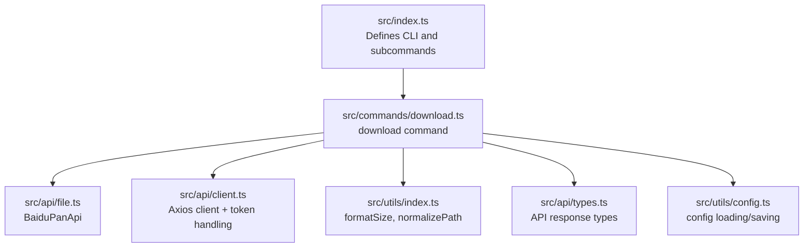
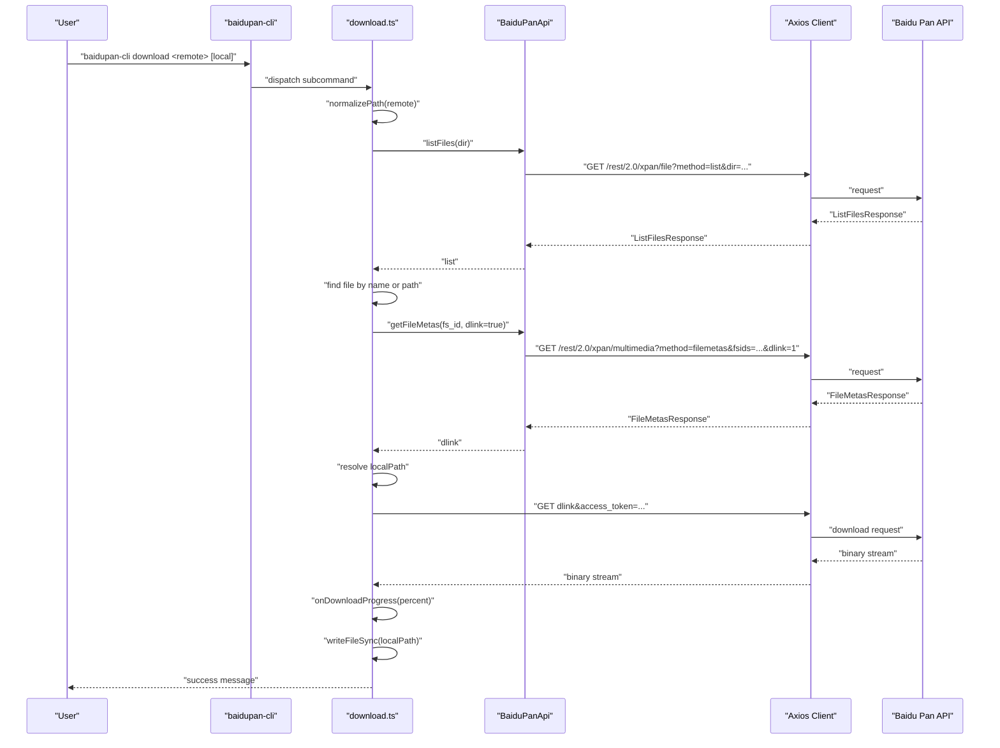
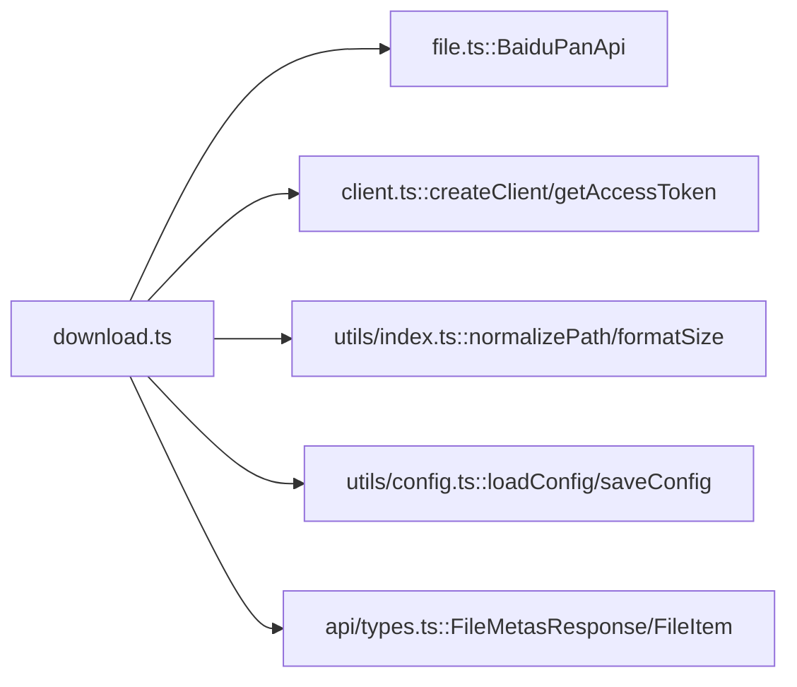

# Download Command

<cite>
**Referenced Files in This Document**
- [src/index.ts](file://src/index.ts)
- [src/commands/download.ts](file://src/commands/download.ts)
- [src/api/file.ts](file://src/api/file.ts)
- [src/api/client.ts](file://src/api/client.ts)
- [src/api/types.ts](file://src/api/types.ts)
- [src/utils/index.ts](file://src/utils/index.ts)
- [src/utils/config.ts](file://src/utils/config.ts)
- [README.md](file://README.md)
- [example/README.md](file://example/README.md)
- [example/backup_mongodb.sh](file://example/backup_mongodb.sh)
- [example/setup_cron.sh](file://example/setup_cron.sh)
</cite>

## Table of Contents
1. [Introduction](#introduction)
2. [Project Structure](#project-structure)
3. [Core Components](#core-components)
4. [Architecture Overview](#architecture-overview)
5. [Detailed Component Analysis](#detailed-component-analysis)
6. [Dependency Analysis](#dependency-analysis)
7. [Performance Considerations](#performance-considerations)
8. [Troubleshooting Guide](#troubleshooting-guide)
9. [Conclusion](#conclusion)
10. [Appendices](#appendices)

## Introduction
This document provides comprehensive documentation for the download command used to retrieve files from Baidu Pan. It covers command syntax, positional arguments, download behavior, progress tracking, and integration patterns. It also explains limitations such as lack of resume capability and bandwidth management, along with practical examples for single-file downloads and integration with automated backup workflows.

## Project Structure
The download command is implemented as a subcommand of the main CLI application. The command orchestrates:
- Argument parsing and normalization
- Remote file discovery via directory listing
- Metadata retrieval to obtain a direct download link
- HTTP download with progress reporting
- Local file writing

**Diagram sources**
- [src/index.ts](file://src/index.ts#L8-L23)
- [src/commands/download.ts](file://src/commands/download.ts#L1-L104)
- [src/api/file.ts](file://src/api/file.ts#L16-L74)
- [src/api/client.ts](file://src/api/client.ts#L112-L161)
- [src/utils/index.ts](file://src/utils/index.ts#L7-L33)
- [src/api/types.ts](file://src/api/types.ts#L3-L50)
- [src/utils/config.ts](file://src/utils/config.ts#L19-L45)

**Section sources**
- [src/index.ts](file://src/index.ts#L1-L26)
- [README.md](file://README.md#L91-L109)

## Core Components
- Command definition and arguments:
  - Positional argument remote: remote file path on Baidu Pan (required)
  - Positional argument local: local save path (optional; defaults to current directory or filename depending on resolution)
- Execution flow:
  - Normalize remote path
  - List directory contents to locate the target file
  - Validate that the target is a file (not a directory)
  - Retrieve file metadata to obtain a direct download link
  - Resolve local path (use provided path or derive from remote filename)
  - Perform HTTP GET with progress reporting
  - Write downloaded data to the local path

Key behaviors:
- Directory creation is not performed automatically by the download command.
- Overwrite behavior is not implemented; the command writes to the resolved local path without explicit overwrite checks.
- Resume capability and bandwidth management are not implemented.

**Section sources**
- [src/commands/download.ts](file://src/commands/download.ts#L9-L24)
- [src/commands/download.ts](file://src/commands/download.ts#L25-L102)
- [src/utils/index.ts](file://src/utils/index.ts#L28-L33)

## Architecture Overview
The download command integrates with the Baidu Pan API through a typed wrapper and an Axios client configured with token handling and automatic retry on token expiration.

**Diagram sources**
- [src/commands/download.ts](file://src/commands/download.ts#L25-L96)
- [src/api/file.ts](file://src/api/file.ts#L42-L74)
- [src/api/client.ts](file://src/api/client.ts#L112-L161)

## Detailed Component Analysis

### Command Syntax and Arguments
- Name: download
- Aliases: dl
- Positional arguments:
  - remote: Remote file path on Baidu Pan (required)
  - local: Local save path (optional)
- Behavior:
  - If local is omitted, the file is saved under the current working directory using the remote filename.
  - If local is a directory, the file is saved inside that directory with the remote filename.
  - If local is a non-existing file path, the file is saved at that path.

Notes:
- The command does not support recursive downloads; it operates on a single file.
- No flags for overwrite, resume, or bandwidth limiting are present.

**Section sources**
- [src/index.ts](file://src/index.ts#L14-L22)
- [src/commands/download.ts](file://src/commands/download.ts#L14-L24)
- [src/commands/download.ts](file://src/commands/download.ts#L67-L74)
- [README.md](file://README.md#L91-L109)

### Progress Tracking
- The download reports progress using a percentage indicator printed to stderr during the HTTP GET operation.
- Progress is computed from loaded vs total bytes when available.

**Section sources**
- [src/commands/download.ts](file://src/commands/download.ts#L85-L91)

### Download Link Retrieval
- The command obtains a direct download link by requesting file metadata with dlink enabled.
- The link is combined with the current access token for the download request.

**Section sources**
- [src/commands/download.ts](file://src/commands/download.ts#L55-L65)
- [src/api/file.ts](file://src/api/file.ts#L65-L74)

### Local Path Resolution and File Writing
- Local path resolution:
  - If local is omitted, use the remote filename in the current directory.
  - If local is a directory, append the remote filename to it.
  - Otherwise, use the provided local path.
- File writing:
  - The downloaded binary data is written synchronously to the resolved local path.

**Section sources**
- [src/commands/download.ts](file://src/commands/download.ts#L67-L96)

### Error Handling
- File not found:
  - Occurs when the target file is not present in the directory listing.
- Directory provided:
  - Attempting to download a directory is rejected.
- Download link unavailable:
  - If the metadata response lacks a dlink, the command exits with an error.
- Network/API errors:
  - General HTTP errors and Baidu API error codes are surfaced to the user.
- Token handling:
  - The Axios client intercepts token-related errors and attempts to refresh the token if possible.

**Section sources**
- [src/commands/download.ts](file://src/commands/download.ts#L43-L62)
- [src/api/client.ts](file://src/api/client.ts#L124-L150)
- [src/api/types.ts](file://src/api/types.ts#L99-L108)

### Practical Examples

#### Single File Download
- Download to current directory using the remote filename:
  - baidupan-cli download /path/to/file.txt
- Download to a specific file path:
  - baidupan-cli download /path/to/file.txt ./destination.bin
- Download to a specific directory:
  - baidupan-cli download /path/to/file.txt ./downloads/

**Section sources**
- [README.md](file://README.md#L95-L104)
- [src/commands/download.ts](file://src/commands/download.ts#L67-L74)

#### Bulk Download Scenarios
- The download command operates on a single file per invocation. To implement bulk downloads:
  - Use the list command to enumerate files and iterate over results in a script.
  - Invoke the download command for each file path.

Note: The repository does not include a built-in bulk downloader; implementers should script around the list and download commands.

**Section sources**
- [src/commands/download.ts](file://src/commands/download.ts#L38-L51)
- [README.md](file://README.md#L43-L71)

#### Integration with Backup Workflows
- Example workflow outline:
  - Generate a backup archive locally.
  - Upload the archive to Baidu Pan using the upload command.
  - Optionally, verify the upload by downloading the file back to a temporary location.
- The example scripts demonstrate automating backups and uploading to Baidu Pan.

**Section sources**
- [example/README.md](file://example/README.md#L1-L106)
- [example/backup_mongodb.sh](file://example/backup_mongodb.sh#L69-L82)
- [example/setup_cron.sh](file://example/setup_cron.sh#L1-L17)

## Dependency Analysis
The download command depends on:
- BaiduPanApi for listing files and retrieving file metadata
- Axios client for HTTP requests and token injection
- Utility functions for path normalization and size formatting
- Configuration utilities for token persistence

**Diagram sources**
- [src/commands/download.ts](file://src/commands/download.ts#L1-L7)
- [src/api/file.ts](file://src/api/file.ts#L16-L74)
- [src/api/client.ts](file://src/api/client.ts#L112-L161)
- [src/utils/index.ts](file://src/utils/index.ts#L7-L33)
- [src/utils/config.ts](file://src/utils/config.ts#L19-L45)
- [src/api/types.ts](file://src/api/types.ts#L3-L50)

**Section sources**
- [src/commands/download.ts](file://src/commands/download.ts#L1-L7)
- [src/api/file.ts](file://src/api/file.ts#L16-L74)
- [src/api/client.ts](file://src/api/client.ts#L112-L161)
- [src/utils/index.ts](file://src/utils/index.ts#L7-L33)
- [src/utils/config.ts](file://src/utils/config.ts#L19-L45)
- [src/api/types.ts](file://src/api/types.ts#L3-L50)

## Performance Considerations
- The download command performs a synchronous write after streaming the entire file, which can consume memory proportional to the file size.
- There is no built-in bandwidth throttling or segmented download mechanism.
- Progress reporting is lightweight and prints to stderr during the download.

Recommendations:
- For very large files, ensure sufficient memory and disk space.
- Consider external tools or scripting if you require advanced features like resume or bandwidth control.

**Section sources**
- [src/commands/download.ts](file://src/commands/download.ts#L78-L96)

## Troubleshooting Guide
Common issues and resolutions:
- Access token missing or invalid:
  - Ensure authentication has been completed and tokens are present in environment variables or config.
  - Re-run the auth command to refresh tokens.
- File not found:
  - Verify the remote path starts with "/" and corresponds to an existing file.
- Attempting to download a directory:
  - Provide a valid file path instead of a directory path.
- Download link unavailable:
  - Retry the operation; if persistent, check account permissions or API availability.
- Network failures:
  - Confirm connectivity and absence of proxy interference.
- Storage space issues:
  - Ensure sufficient local disk space before initiating the download.

**Section sources**
- [src/api/client.ts](file://src/api/client.ts#L15-L37)
- [src/commands/download.ts](file://src/commands/download.ts#L43-L62)
- [README.md](file://README.md#L135-L154)

## Conclusion
The download command provides a straightforward way to fetch individual files from Baidu Pan. It supports progress reporting, resolves local paths flexibly, and integrates with the broader CLI ecosystem. However, it does not offer resume, bandwidth control, or recursive downloads. For robust automation and bulk operations, pair the download command with scripting and the list command.

## Appendices

### Command Reference
- Name: download
- Aliases: dl
- Positional arguments:
  - remote: Remote file path (required)
  - local: Local save path (optional)
- Behavior:
  - Resolves local path based on presence of directory or omission
  - Streams and writes the file synchronously
  - Reports progress percentage during download

**Section sources**
- [src/index.ts](file://src/index.ts#L14-L22)
- [src/commands/download.ts](file://src/commands/download.ts#L14-L24)
- [src/commands/download.ts](file://src/commands/download.ts#L67-L96)
