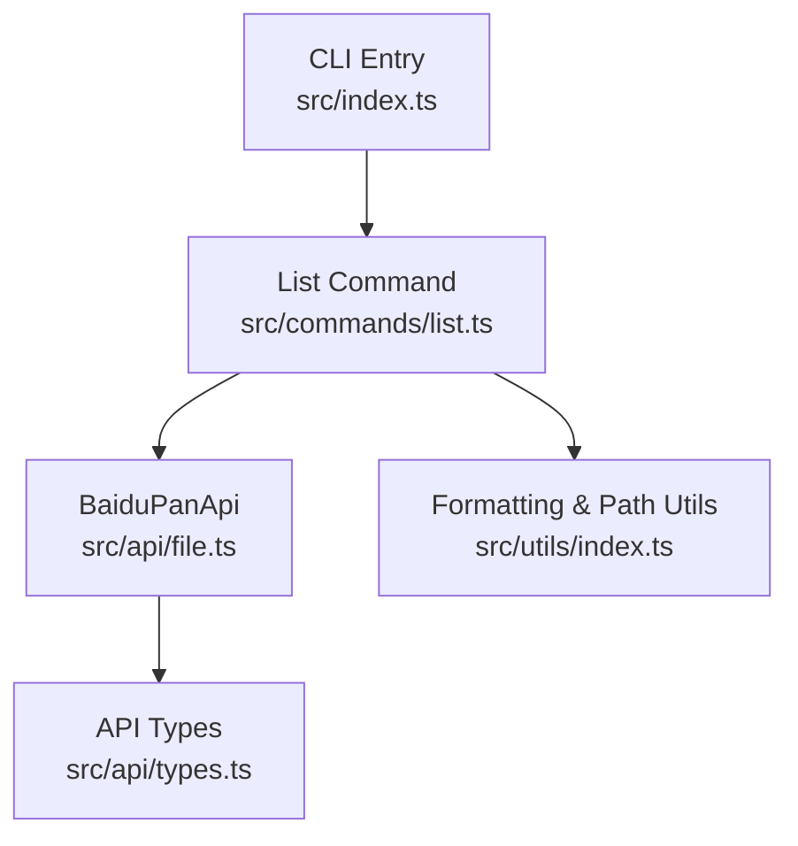
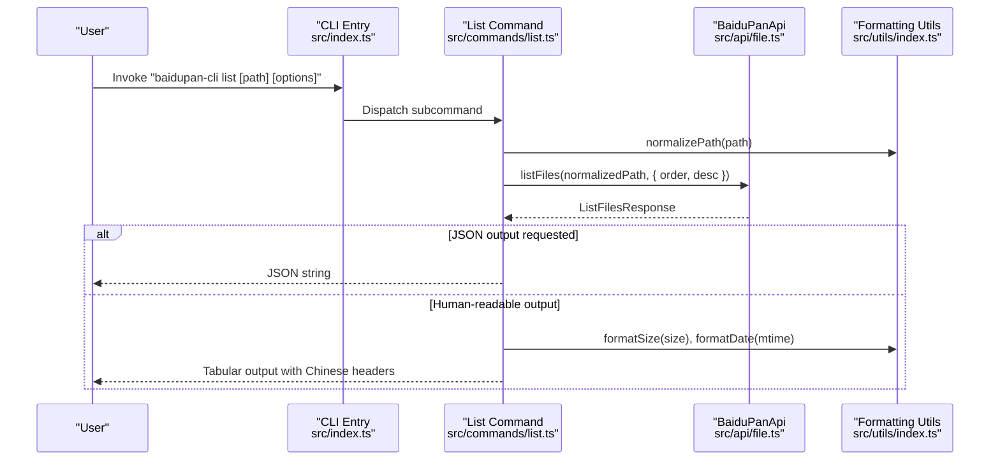
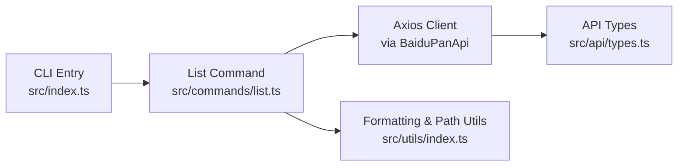

# List Command

<cite>
**Referenced Files in This Document**
- [src/index.ts](file://src/index.ts)
- [src/commands/list.ts](file://src/commands/list.ts)
- [src/api/file.ts](file://src/api/file.ts)
- [src/api/types.ts](file://src/api/types.ts)
- [src/utils/index.ts](file://src/utils/index.ts)
- [src/logger.ts](file://src/logger.ts)
- [README.md](file://README.md)
- [package.json](file://package.json)
</cite>

## Update Summary
**Changes Made**
- Updated table header translations from English to Chinese (Type → 类型, Size → 大小, Modified → 修改时间, Name → 文件名)
- Updated empty directory message from "(empty directory)" to "(空目录)"
- Updated directory type display from "DIR"/"FILE" to "目录"/"文件"
- Updated summary message from "Total: " to "共 " and "items" to "项"
- Enhanced Chinese localization for improved user experience

## Table of Contents
1. [Introduction](#introduction)
2. [Project Structure](#project-structure)
3. [Core Components](#core-components)
4. [Architecture Overview](#architecture-overview)
5. [Detailed Component Analysis](#detailed-component-analysis)
6. [Dependency Analysis](#dependency-analysis)
7. [Performance Considerations](#performance-considerations)
8. [Troubleshooting Guide](#troubleshooting-guide)
9. [Conclusion](#conclusion)
10. [Appendices](#appendices)

## Introduction
This document provides comprehensive documentation for the list command used to browse Baidu Pan directory contents. It explains command syntax, path arguments, sorting options, output formatting, pagination controls, directory listing behavior, file metadata display, and integration with shell pipelines. It also covers error handling for permission issues, network failures, and invalid paths, along with practical examples and performance considerations for large directories.

**Updated** The list command now provides a fully localized Chinese user experience with Chinese table headers, directory messages, and item type indicators for better usability by Chinese-speaking users.

## Project Structure
The list command is implemented as a standalone CLI subcommand. It integrates with the Baidu Pan API client and utility modules for formatting and path normalization. The command is registered in the main CLI entry point and exposed under both the primary name and an alias.

**Diagram sources**
- [src/index.ts](file://src/index.ts#L8-L23)
- [src/commands/list.ts](file://src/commands/list.ts#L1-L77)
- [src/api/file.ts](file://src/api/file.ts#L16-L60)
- [src/utils/index.ts](file://src/utils/index.ts#L1-L111)
- [src/api/types.ts](file://src/api/types.ts#L1-L108)

**Section sources**
- [src/index.ts](file://src/index.ts#L8-L23)
- [README.md](file://README.md#L43-L71)

## Core Components
- Command definition and argument parsing: The list command defines positional path, sorting order, descending flag, and JSON output flag. It defaults to listing the root directory and sorts by name ascending.
- API integration: The command delegates directory listing to the BaiduPanApi listFiles method, passing order and desc options.
- Output formatting: The command prints either a JSON representation or a human-readable table with columns for type, size, modification time, and name. Empty directories are handled explicitly with Chinese messaging.

**Updated** The output formatting now uses Chinese table headers and messages for enhanced localization:
- Headers: "类型" (Type), "大小" (Size), "修改时间" (Modified), "文件名" (Name)
- Empty directory message: "(空目录)"
- Item types: "目录" (Directory) and "文件" (File)
- Summary: "共 X 项" (X items)

Key behaviors:
- Path normalization ensures remote paths start with a leading slash.
- Sorting criteria supported: name, time, size.
- Pagination: The underlying API call sets a default page size; recursive traversal is not implemented in the list command itself.

**Section sources**
- [src/commands/list.ts](file://src/commands/list.ts#L11-L35)
- [src/commands/list.ts](file://src/commands/list.ts#L36-L77)
- [src/api/file.ts](file://src/api/file.ts#L42-L60)
- [src/utils/index.ts](file://src/utils/index.ts#L28-L33)

## Architecture Overview
The list command orchestrates a request to the Baidu Pan API and renders the response according to user preferences with full Chinese localization support.

**Diagram sources**
- [src/index.ts](file://src/index.ts#L8-L23)
- [src/commands/list.ts](file://src/commands/list.ts#L36-L77)
- [src/api/file.ts](file://src/api/file.ts#L42-L60)
- [src/utils/index.ts](file://src/utils/index.ts#L7-L23)

## Detailed Component Analysis

### Command Definition and Arguments
- Positional path argument: Directory path with default root ("").
- Sorting options:
  - order: name, time, size (default: name)
  - desc: boolean flag to sort descending (default: false)
- Output formatting:
  - json: boolean flag to output raw JSON (default: false)

Behavioral notes:
- The command does not expose explicit pagination controls (start/limit) in its CLI interface; these are internal API parameters managed by the API client.

**Section sources**
- [src/commands/list.ts](file://src/commands/list.ts#L11-L35)

### API Integration and Request Construction
- The listFiles method constructs a GET request to the Baidu Pan file list endpoint with parameters:
  - dir: target directory path
  - order: name/time/size
  - desc: 1 for true, 0 for false
  - start: default 0
  - limit: default 1000
  - web: 1

Response model:
- ListFilesResponse includes an array of FileItem entries with metadata such as server_filename, size, isdir, server_mtime, server_ctime, and local timestamps.

**Section sources**
- [src/api/file.ts](file://src/api/file.ts#L42-L60)
- [src/api/types.ts](file://src/api/types.ts#L11-L32)

### Output Formatting and Rendering
- JSON output: When --json is enabled, the command prints the list array as a formatted JSON string.
- Human-readable output: When disabled, the command prints a header row and iterates over items, displaying:
  - Type: "目录" for directories, "文件" otherwise
  - Size: formatted human-readable size for files, "-" for directories
  - Modified: localized timestamp for modification time
  - Name: server_filename
- Empty directory handling: Prints a message indicating an empty directory when the list is empty.

**Updated** All output messages now use Chinese for better user experience:
- Header row: "类型\t大小\t\t修改时间\t\t\t文件名"
- Empty directory: "(空目录)"
- Summary: "共 X 项"

**Section sources**
- [src/commands/list.ts](file://src/commands/list.ts#L49-L77)
- [src/utils/index.ts](file://src/utils/index.ts#L7-L23)

### Path Normalization
- Ensures remote paths start with a leading slash. Paths without a leading slash are prefixed accordingly.

**Section sources**
- [src/utils/index.ts](file://src/utils/index.ts#L28-L33)

### Sorting Criteria and Behavior
- Supported criteria: name, time, size
- Direction: ascending by default; descending when --desc is set
- The API enforces the chosen order and direction via query parameters.

**Section sources**
- [src/commands/list.ts](file://src/commands/list.ts#L17-L28)
- [src/api/file.ts](file://src/api/file.ts#L52-L53)

### Pagination Controls
- The underlying API call uses default pagination parameters (start: 0, limit: 1000).
- The list command does not expose explicit CLI flags for pagination; advanced users can adjust the API client's internal parameters if needed.

**Section sources**
- [src/api/file.ts](file://src/api/file.ts#L54-L55)

### Recursive Directory Traversal
- The list command does not implement recursive traversal. It lists the contents of a single directory at a time. For recursive browsing, combine the command with shell scripting or external tools.

### File Metadata Display
- The command displays:
  - Type: derived from isdir (Chinese: "目录"/"文件")
  - Size: formatted using formatSize
  - Modified: formatted using formatDate
  - Name: server_filename
- Additional metadata (e.g., server_ctime, local timestamps) is available in the API response but not printed by default.

**Section sources**
- [src/commands/list.ts](file://src/commands/list.ts#L63-L70)
- [src/utils/index.ts](file://src/utils/index.ts#L7-L23)
- [src/api/types.ts](file://src/api/types.ts#L11-L28)

### Practical Examples
Common usage scenarios:
- List root directory: baidupan-cli list
- List a specific directory: baidupan-cli list /path/to/dir
- Sort by modification time descending: baidupan-cli list / -o time -d
- Sort by size ascending: baidupan-cli list / -o size
- Output as JSON: baidupan-cli list / --json

Integration with shell pipelines:
- Pipe JSON output to jq for filtering or transformation.
- Combine with find-like shell scripts to simulate recursive listing across multiple directories.

**Section sources**
- [README.md](file://README.md#L49-L73)

## Dependency Analysis
The list command depends on:
- CLI framework for command definition and dispatch
- BaiduPanApi for interacting with the Baidu Pan REST API
- Utility functions for path normalization and formatting

**Diagram sources**
- [src/commands/list.ts](file://src/commands/list.ts#L1-L77)
- [src/api/file.ts](file://src/api/file.ts#L16-L60)
- [src/utils/index.ts](file://src/utils/index.ts#L1-L111)
- [src/index.ts](file://src/index.ts#L8-L23)

**Section sources**
- [src/index.ts](file://src/index.ts#L8-L23)
- [src/commands/list.ts](file://src/commands/list.ts#L1-L77)
- [src/api/file.ts](file://src/api/file.ts#L16-L60)
- [src/utils/index.ts](file://src/utils/index.ts#L1-L111)
- [src/api/types.ts](file://src/api/types.ts#L1-L108)

## Performance Considerations
- Pagination: The default page size is 1000 items. For very large directories, expect multiple requests to the API. Consider batching or filtering externally to reduce payload sizes.
- Output rendering: Human-readable output performs per-item formatting; JSON output avoids per-item transformations and is generally faster for large lists.
- Network latency: API calls are synchronous; consider caching or pre-filtering results when repeatedly listing the same directories.
- Shell pipelines: When piping JSON output to external tools, ensure efficient processing to avoid bottlenecks.

## Troubleshooting Guide
Common issues and resolutions:
- Permission errors:
  - Symptom: Access denied or invalid access token errors.
  - Resolution: Re-authenticate using the auth command and ensure the access token is valid and stored in the configuration.
- Network failures:
  - Symptom: Timeout or connection errors.
  - Resolution: Verify network connectivity and API availability; retry after a short delay.
- Invalid paths:
  - Symptom: Not found or parameter errors.
  - Resolution: Ensure the path starts with a leading slash and corresponds to an existing directory.
- Rate limiting:
  - Symptom: Frequent requests failing with rate-limit-related messages.
  - Resolution: Add delays between requests or reduce request frequency.

Error handling in the list command:
- Catches exceptions during API calls and exits with a non-zero status after printing an error message.

**Section sources**
- [src/commands/list.ts](file://src/commands/list.ts#L75-L77)
- [src/api/types.ts](file://src/api/types.ts#L99-L107)
- [README.md](file://README.md#L135-L154)

## Conclusion
The list command provides a straightforward way to browse Baidu Pan directories with flexible sorting and output options. With full Chinese localization support, it offers an excellent user experience for Chinese-speaking users with Chinese table headers, directory messages, and item type indicators. While it does not implement recursive traversal or explicit pagination flags, it integrates cleanly with shell pipelines and supports JSON output for downstream processing. For large directories, consider using JSON output and external filtering to optimize performance.

## Appendices

### Command Reference
- Name: list
- Aliases: ls
- Positional arguments:
  - path: Directory path (default: /)
- Options:
  - -o, --order: Sort by name, time, or size (default: name)
  - -d, --desc: Sort in descending order (default: false)
  - -j, --json: Output as JSON (default: false)

**Section sources**
- [src/index.ts](file://src/index.ts#L17-L17)
- [src/commands/list.ts](file://src/commands/list.ts#L11-L35)
- [README.md](file://README.md#L66-L73)

### API Endpoint Details
- Endpoint: Baidu Pan file list
- Method: GET
- Parameters:
  - dir: Target directory
  - order: name/time/size
  - desc: 1 or 0
  - start: default 0
  - limit: default 1000
  - web: 1

**Section sources**
- [src/api/file.ts](file://src/api/file.ts#L48-L57)

### Data Model for List Items
- Fields include fs_id, path, server_filename, size, isdir, category, server_mtime, server_ctime, local_mtime, local_ctime, and optional thumbnails.

**Section sources**
- [src/api/types.ts](file://src/api/types.ts#L11-L28)

### Chinese Localization Features
**New** The list command now provides comprehensive Chinese localization:

- **Table Headers**:
  - "类型" (Type) - Chinese for file type indicator
  - "大小" (Size) - Chinese for file size display
  - "修改时间" (Modified) - Chinese for modification timestamp
  - "文件名" (Name) - Chinese for file/folder names

- **Directory Messages**:
  - "(空目录)" - Chinese empty directory notification
  - "共 X 项" - Chinese item count summary

- **Item Type Display**:
  - "目录" - Chinese for directories
  - "文件" - Chinese for files

This localization enhances the user experience for Chinese-speaking users by providing familiar terminology throughout the command output.

**Section sources**
- [src/commands/list.ts](file://src/commands/list.ts#L55-L77)
- [src/utils/index.ts](file://src/utils/index.ts#L7-L23)
