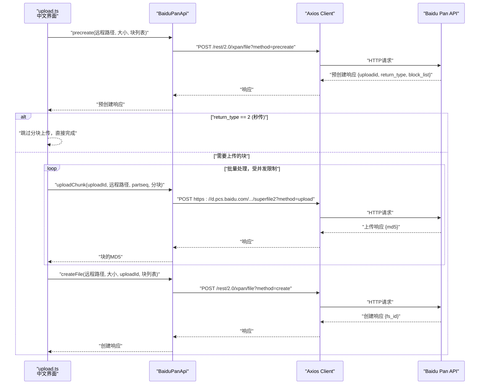
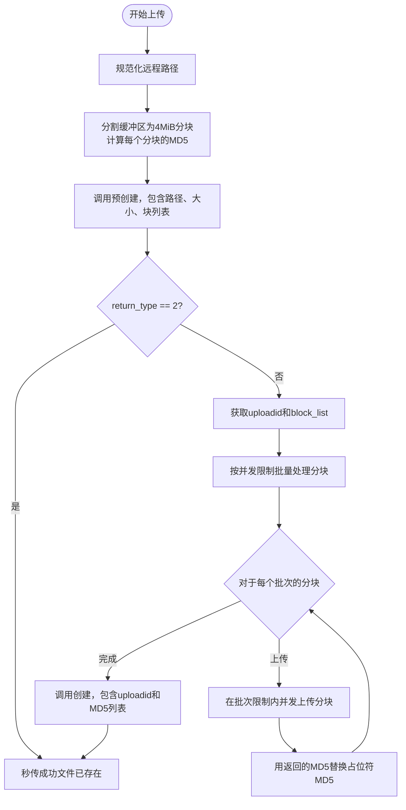
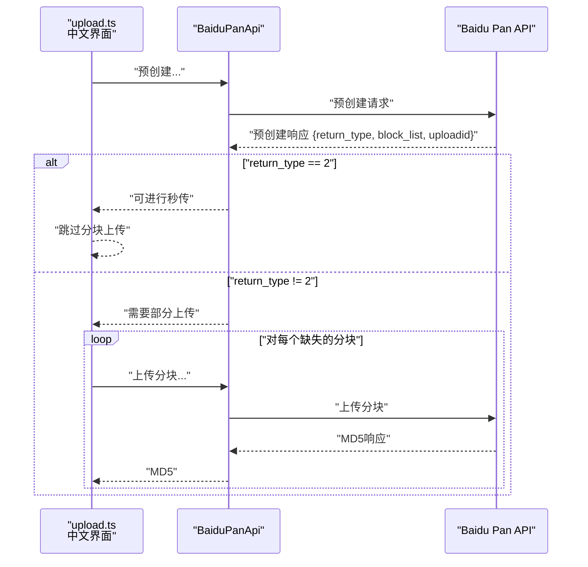
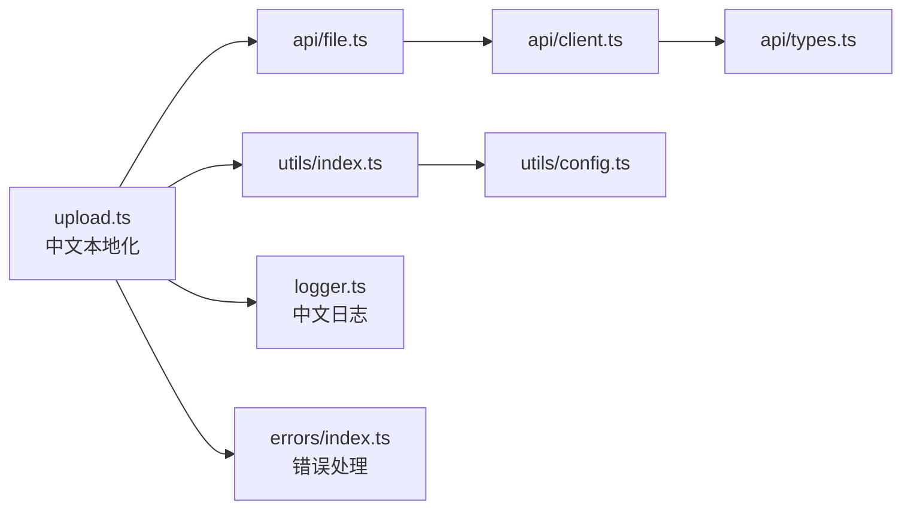

# Upload Command

<cite>
**Referenced Files in This Document**
- [upload.ts](file://src/commands/upload.ts)
- [file.ts](file://src/api/file.ts)
- [types.ts](file://src/api/types.ts)
- [client.ts](file://src/api/client.ts)
- [index.ts](file://src/utils/index.ts)
- [config.ts](file://src/utils/config.ts)
- [logger.ts](file://src/logger.ts)
- [errors/index.ts](file://src/errors/index.ts)
- [README.md](file://README.md)
- [package.json](file://package.json)
</cite>

## Update Summary
**Changes Made**
- Updated all user-facing messages to Chinese localization including '正在从标准输入读取', '正在上传', '上传完成', '秒传成功'
- Enhanced progress tracking with Chinese operation feedback messages
- Updated command examples to reflect Chinese interface
- Revised troubleshooting guidance to address Chinese error messages
- Updated practical examples to demonstrate Chinese user experience

## Table of Contents
1. [Introduction](#introduction)
2. [Project Structure](#project-structure)
3. [Core Components](#core-components)
4. [Architecture Overview](#architecture-overview)
5. [Detailed Component Analysis](#detailed-component-analysis)
6. [Dependency Analysis](#dependency-analysis)
7. [Performance Considerations](#performance-considerations)
8. [Troubleshooting Guide](#troubleshooting-guide)
9. [Conclusion](#conclusion)
10. [Appendices](#appendices)

## Introduction
This document provides comprehensive documentation for the upload command, covering file and directory upload functionality with sophisticated concurrent chunk upload capabilities. The command now features full Chinese localization with user-friendly prompts including '正在从标准输入读取' (Reading from standard input), '正在上传' (Uploading), '上传完成' (Upload complete), and '秒传成功' (Instant upload success). It explains command syntax, source path arguments, destination paths, and upload options including configurable parallelism. It details the chunked upload mechanism for large files, MD5 verification processes, and rapid upload behavior when applicable. Progress tracking with Chinese feedback, bandwidth considerations, and concurrent upload settings are addressed, along with practical examples and error handling strategies for network interruptions, disk space issues, and quota limitations.

## Project Structure
The upload command is implemented as a CLI subcommand that orchestrates file discovery, chunking, and API interactions with configurable concurrency. The key components are:
- Command definition and argument parsing with concurrency parameter
- Utility functions for path normalization, file enumeration, and progress display
- API client and Baidu Pan API wrapper for precreate, chunk upload, and file creation
- Token management and automatic refresh logic
- Intelligent batching system to prevent overwhelming the API
- Full Chinese localization of all user-facing messages

```mermaid
graph TB
subgraph "CLI Layer"
U["upload.ts<br/>Command definition and orchestration<br/>+ Chinese Localization"]
end
subgraph "Utilities"
UI["utils/index.ts<br/>Path helpers, file IO, progress"]
CFG["utils/config.ts<br/>Config file I/O"]
LOG["logger.ts<br/>Chinese logging functions"]
ERR["errors/index.ts<br/>Error handling with Chinese messages"]
END
subgraph "API Layer"
CL["api/client.ts<br/>Axios client, interceptors, token refresh"]
API["api/file.ts<br/>BaiduPanApi class, chunking, upload steps<br/>+ Concurrent Processing"]
TYP["api/types.ts<br/>Response types and error codes"]
END
U --> UI
U --> API
U --> LOG
U --> ERR
API --> CL
CL --> TYP
UI --> CFG
```

**Diagram sources**
- [upload.ts](file://src/commands/upload.ts#L1-L164)
- [index.ts](file://src/utils/index.ts#L1-L111)
- [file.ts](file://src/api/file.ts#L1-L201)
- [client.ts](file://src/api/client.ts#L1-L171)
- [types.ts](file://src/api/types.ts#L1-L102)
- [config.ts](file://src/utils/config.ts#L1-L62)
- [logger.ts](file://src/logger.ts#L1-L23)
- [errors/index.ts](file://src/errors/index.ts#L1-L23)

**Section sources**
- [upload.ts](file://src/commands/upload.ts#L1-L164)
- [index.ts](file://src/utils/index.ts#L1-L111)
- [file.ts](file://src/api/file.ts#L1-L201)
- [client.ts](file://src/api/client.ts#L1-L171)
- [types.ts](file://src/api/types.ts#L1-L102)
- [config.ts](file://src/utils/config.ts#L1-L62)
- [logger.ts](file://src/logger.ts#L1-L23)
- [errors/index.ts](file://src/errors/index.ts#L1-L23)
- [README.md](file://README.md#L84-L113)

## Core Components
- Upload command: Defines positional arguments for local and remote paths, handles stdin input, validates existence, and dispatches to directory or single-file upload logic with configurable concurrency. All user prompts are now in Chinese.
- BaiduPanApi: Encapsulates Baidu Pan upload workflow with precreate, chunk upload, and create file operations.
- Concurrent chunking and MD5: Splits buffers into fixed-size chunks and computes MD5 hashes per chunk with intelligent batching for optimal performance.
- Utilities: Path normalization, recursive directory traversal, file reading, progress printing, and stdin reading.
- Client and token management: Axios client with interceptors, automatic token refresh, and error mapping.
- Chinese localization: All user-facing messages use simplified Chinese for better user experience.

**Section sources**
- [upload.ts](file://src/commands/upload.ts#L21-L100)
- [file.ts](file://src/api/file.ts#L16-L198)
- [index.ts](file://src/utils/index.ts#L27-L111)
- [client.ts](file://src/api/client.ts#L112-L161)
- [logger.ts](file://src/logger.ts#L1-L23)

## Architecture Overview
The upload flow follows a three-phase process with intelligent concurrent chunk processing and full Chinese localization:
1. Precreate: Requests upload session metadata and identifies which blocks need uploading.
2. Concurrent chunk upload: Uploads missing blocks in batches with configurable parallelism and collects per-block MD5.
3. Create file: Finalizes the file with aggregated MD5s and returns the file identifier.



**Diagram sources**
- [upload.ts](file://src/commands/upload.ts#L115-L163)
- [file.ts](file://src/api/file.ts#L79-L167)
- [client.ts](file://src/api/client.ts#L112-L161)

## Detailed Component Analysis

### Upload Command Syntax and Arguments
- Positional arguments:
  - local: Local file path or directory. Use "-" to read from stdin.
  - remote: Remote path on Baidu Pan. Automatically normalized to start with "/".
- Concurrency parameter:
  - --concurrency/-c: Configurable parallelism for chunk uploads (default: 3 concurrent uploads).
  - Controls batch size for chunk processing to prevent overwhelming the API.
- Behavior:
  - Validates local path existence.
  - Handles stdin input by reading all chunks and uploading as a buffer with Chinese prompt '正在从标准输入读取...'
  - Recursively enumerates directory contents and uploads each file individually.
  - For single files, constructs the final remote path based on whether the remote ends with "/".
  - Provides Chinese progress feedback during directory uploads.
- Error handling:
  - Exits with error code on invalid local path.
  - Catches and prints errors during upload operations.

Practical examples:
- Single file upload: baidupan-cli upload ./local-file.txt /remote-path/file.txt
- Directory upload: baidupan-cli upload ./local-directory /remote/path/
- Upload from stdin: echo "hello world" | baidupan-cli upload - /remote/hello.txt
- Concurrent upload: baidupan-cli upload ./large-file.zip /remote/ -c 5

**Updated** All user prompts now use Chinese language for better user experience

**Section sources**
- [upload.ts](file://src/commands/upload.ts#L26-L42)
- [upload.ts](file://src/commands/upload.ts#L49-L50)
- [upload.ts](file://src/commands/upload.ts#L52-L57)
- [upload.ts](file://src/commands/upload.ts#L77-L84)
- [README.md](file://README.md#L84-L113)

### Concurrent Chunk Upload Mechanism and MD5 Verification
- Chunk size: Fixed at 4 MiB per chunk.
- Concurrent processing:
  - Splits the input buffer into contiguous subarrays.
  - Computes MD5 hash for each chunk.
  - Processes chunks in intelligent batches based on the concurrency parameter.
  - Uses Promise.all() to handle concurrent uploads within each batch.
- MD5 verification:
  - During precreate, the server receives the list of chunk MD5s.
  - On successful precreate, the server indicates which blocks are missing.
  - Each uploaded chunk returns an MD5; the client replaces the placeholder MD5 with the actual computed MD5.
- Rapid upload:
  - When return_type equals 2, the server recognizes the file as already present and creates it immediately without uploading chunks.
  - User sees Chinese message '秒传成功（文件已存在）' for instant upload completion.



**Diagram sources**
- [upload.ts](file://src/commands/upload.ts#L111-L163)
- [file.ts](file://src/api/file.ts#L187-L198)
- [file.ts](file://src/api/file.ts#L107-L138)
- [file.ts](file://src/api/file.ts#L143-L167)

**Section sources**
- [file.ts](file://src/api/file.ts#L13-L14)
- [file.ts](file://src/api/file.ts#L187-L198)
- [file.ts](file://src/api/file.ts#L107-L138)
- [file.ts](file://src/api/file.ts#L143-L167)
- [upload.ts](file://src/commands/upload.ts#L111-L163)

### Resume Capability and Rapid Upload
- Resume behavior:
  - The precreate step determines which blocks are missing and returns a block_list indicating partial progress.
  - The upload command iterates only over the missing blocks, effectively resuming the upload.
- Rapid upload:
  - When return_type equals 2, the server recognizes the file as already present and creates it immediately without uploading chunks.
  - User sees Chinese message '秒传成功（文件已存在）' indicating instant upload completion.



**Diagram sources**
- [upload.ts](file://src/commands/upload.ts#L119-L123)
- [file.ts](file://src/api/file.ts#L79-L102)

**Section sources**
- [upload.ts](file://src/commands/upload.ts#L119-L123)
- [file.ts](file://src/api/file.ts#L79-L102)

### Progress Tracking and Output
- Progress display:
  - A progress bar is printed to stderr with percentage and current/total counts.
  - The progress function writes carriage-return-prefixed lines to overwrite previous output until completion.
  - Chinese progress messages provide real-time feedback during uploads.
- Console logging:
  - Upload destination, file size, and chunk count are logged in Chinese.
  - Completion message includes the server-assigned file identifier.
  - Chinese success messages indicate upload completion with '上传完成！fs_id: ...'.

**Updated** All progress and completion messages now use Chinese language

**Section sources**
- [index.ts](file://src/utils/index.ts#L99-L111)
- [upload.ts](file://src/commands/upload.ts#L108-L163)
- [upload.ts](file://src/commands/upload.ts#L129-L130)

### Directory Upload Workflow
- Recursive enumeration:
  - Uses a depth-first traversal to collect all files under the given directory.
  - Skips empty directories and only enqueues files.
- Per-file upload:
  - For each file, constructs a remote path by appending the relative path segment.
  - Reads the file as a buffer and invokes the buffer upload pipeline with concurrency settings.
  - Provides Chinese progress feedback: '正在上传: 文件名' and '进度: 已完成/总数 个文件' for each file.

**Updated** Directory upload now provides Chinese progress feedback for better user experience

**Section sources**
- [index.ts](file://src/utils/index.ts#L35-L55)
- [upload.ts](file://src/commands/upload.ts#L65-L98)
- [upload.ts](file://src/commands/upload.ts#L77-L84)

### Bandwidth Limitations and Concurrent Upload Settings
- Concurrent upload system:
  - Configurable parallelism with default setting of 3 concurrent uploads.
  - Intelligent batching prevents overwhelming the API while maximizing throughput.
  - Each batch processes up to 'concurrency' number of chunks simultaneously.
- Implementation details:
  - Uses Promise.all() for concurrent chunk uploads within each batch.
  - Progress tracking updates for each completed chunk regardless of upload order.
  - MD5 aggregation maintains correct ordering despite concurrent processing.
- Practical implications:
  - Higher concurrency improves throughput for large files but increases memory usage.
  - Lower concurrency reduces resource consumption for constrained environments.
  - Optimal settings depend on network conditions, server capacity, and available resources.
  - Chinese progress messages help users monitor upload status in real-time.

**Updated** Progress tracking now uses Chinese messages for better user experience

**Section sources**
- [upload.ts](file://src/commands/upload.ts#L18-L19)
- [upload.ts](file://src/commands/upload.ts#L133-L151)
- [upload.ts](file://src/commands/upload.ts#L49-L49)

### Practical Examples
- Single file upload:
  - Upload a file to a specific remote path.
  - Example command: baidupan-cli upload ./local-file.txt /remote-path/file.txt
- Directory upload with recursion:
  - Upload an entire directory tree to a remote folder.
  - Example command: baidupan-cli upload ./local-directory /remote/path/
- Concurrent upload scenarios:
  - Use --concurrency parameter to control parallelism: baidupan-cli upload ./large-file.zip /remote/ -c 5
  - Adjust concurrency based on network conditions: baidupan-cli upload ./large-file.zip /remote/ -c 10
- Performance optimization techniques:
  - Ensure adequate disk space and stable network connectivity.
  - Prefer local SSD storage for temporary buffers.
  - Avoid uploading extremely large files in constrained environments.
  - Tune concurrency based on network bandwidth and server capacity.
  - Monitor Chinese progress messages to gauge upload status.

**Updated** Examples now reflect Chinese interface and user experience

**Section sources**
- [README.md](file://README.md#L84-L113)
- [upload.ts](file://src/commands/upload.ts#L65-L98)

## Dependency Analysis
The upload command depends on:
- BaiduPanApi for upload operations.
- Utility functions for path normalization, file enumeration, buffer reading, and progress display.
- Axios client for HTTP communication and interceptors for token management and error handling.
- Logger utility for Chinese logging and error reporting.
- Error handling module for consistent error messaging.



**Diagram sources**
- [upload.ts](file://src/commands/upload.ts#L1-L16)
- [file.ts](file://src/api/file.ts#L1-L11)
- [client.ts](file://src/api/client.ts#L1-L4)
- [types.ts](file://src/api/types.ts#L1-L8)
- [index.ts](file://src/utils/index.ts#L1-L14)
- [config.ts](file://src/utils/config.ts#L1-L6)
- [logger.ts](file://src/logger.ts#L1-L23)
- [errors/index.ts](file://src/errors/index.ts#L1-L23)

**Section sources**
- [upload.ts](file://src/commands/upload.ts#L1-L16)
- [file.ts](file://src/api/file.ts#L1-L11)
- [client.ts](file://src/api/client.ts#L1-L4)
- [types.ts](file://src/api/types.ts#L1-L8)
- [index.ts](file://src/utils/index.ts#L1-L14)
- [config.ts](file://src/utils/config.ts#L1-L6)
- [logger.ts](file://src/logger.ts#L1-L23)
- [errors/index.ts](file://src/errors/index.ts#L1-L23)

## Performance Considerations
- Chunk size: Fixed at 4 MiB. Larger chunks reduce overhead but increase memory usage and risk on unstable networks.
- Concurrent processing: Chunks are uploaded in batches with configurable parallelism (default: 3). Introducing concurrency requires careful coordination of upload IDs and MD5 aggregation.
- Memory footprint: Entire file is loaded into memory as a Buffer for single-file uploads. For very large files, consider streaming approaches at the API layer.
- Network reliability: The client retries on token expiration by refreshing the access token transparently. For other transient failures, consider adding retry logic around chunk uploads.
- Concurrency tuning:
  - Default concurrency of 3 provides good balance for most scenarios.
  - Increase for high-bandwidth connections and powerful servers.
  - Decrease for limited resources or unstable networks.
  - Monitor Chinese progress indicators to gauge optimal settings.
- Chinese localization benefits:
  - Real-time progress feedback helps users understand upload status.
  - Clear success/failure messages improve user experience.
  - Consistent Chinese interface reduces language barriers.

## Troubleshooting Guide
Common issues and resolutions:
- Network interruptions:
  - The client intercepts HTTP errors and maps Baidu API error codes. Token expiration triggers automatic refresh.
  - For persistent connection issues, verify network connectivity and proxy settings.
  - Chinese error messages provide clear indication of failure reasons.
- Disk space issues:
  - Ensure sufficient disk space for temporary buffers during upload.
  - Consider uploading from a location with ample free space.
  - Chinese progress messages help monitor upload status and detect issues early.
- Quota limitations:
  - The API exposes quota information via dedicated endpoints. Monitor usage and adjust upload strategy accordingly.
  - Chinese interface provides clear feedback on quota-related issues.
- Authentication problems:
  - Verify access token presence and validity. Re-authenticate if needed.
  - Chinese error messages help identify authentication failures.
- Path formatting:
  - Remote paths are normalized to start with "/". Ensure correct remote path semantics.
  - Chinese interface provides clear feedback on path-related issues.
- Concurrency issues:
  - If experiencing timeouts or server overload, reduce the --concurrency parameter.
  - Monitor server response times and adjust based on observed performance.
  - High concurrency may cause memory pressure; monitor system resources during upload.
  - Chinese progress messages help diagnose concurrency-related issues.

**Updated** All troubleshooting guidance now reflects Chinese interface and user experience

**Section sources**
- [client.ts](file://src/api/client.ts#L124-L150)
- [types.ts](file://src/api/types.ts#L98-L102)
- [errors/index.ts](file://src/errors/index.ts#L7-L20)
- [README.md](file://README.md#L226-L242)

## Conclusion
The upload command provides a robust, chunked upload mechanism with sophisticated concurrent chunk upload capabilities and MD5 verification. It handles single files, directories, and stdin input while offering configurable parallelism and progress feedback. The current implementation focuses on performance and reliability through intelligent batching and configurable concurrency. The full Chinese localization enhances user experience with clear, localized prompts including '正在从标准输入读取', '正在上传', '上传完成', and '秒传成功'. For advanced scenarios requiring fine-tuned control over upload behavior, consider adjusting the --concurrency parameter based on network conditions and system resources.

## Appendices

### API Definitions and Error Codes
- Precreate response fields:
  - uploadid: Session identifier for subsequent chunk uploads.
  - return_type: Indicates completion status (e.g., 2 for rapid upload).
  - block_list: Indices of missing blocks to upload.
- Upload chunk response:
  - md5: MD5 of the uploaded chunk.
- Create file response:
  - fs_id: Server-assigned file identifier.
- Error codes:
  - 0: Success
  - -6: Invalid access token
  - -7: Access denied
  - -9: File not found
  - 2: Parameter error
  - 111: Access token expired
  - 31034: Request too frequent

**Section sources**
- [types.ts](file://src/api/types.ts#L52-L71)
- [types.ts](file://src/api/types.ts#L98-L102)

### Environment Variables and Configuration
- Environment variables:
  - BAIDU_APP_KEY, BAIDU_SECRET_KEY, BAIDU_ACCESS_TOKEN, BAIDU_REFRESH_TOKEN
- Configuration file:
  - Stored in ~/.baidupan-cli/config.json with secure permissions.

**Section sources**
- [client.ts](file://src/api/client.ts#L15-L44)
- [config.ts](file://src/utils/config.ts#L19-L54)
- [README.md](file://README.md#L167-L195)
