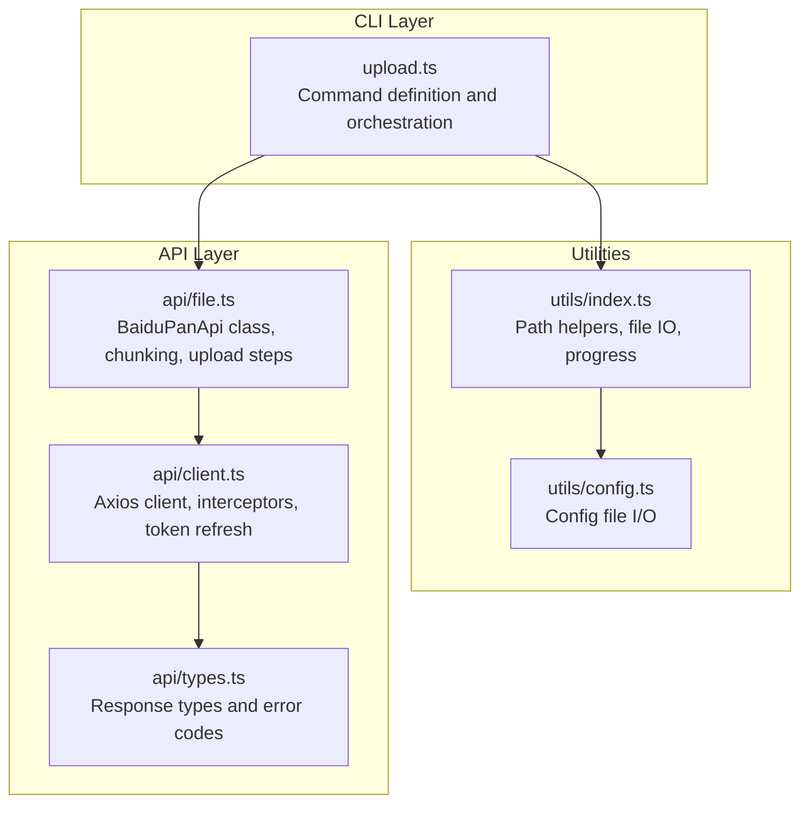
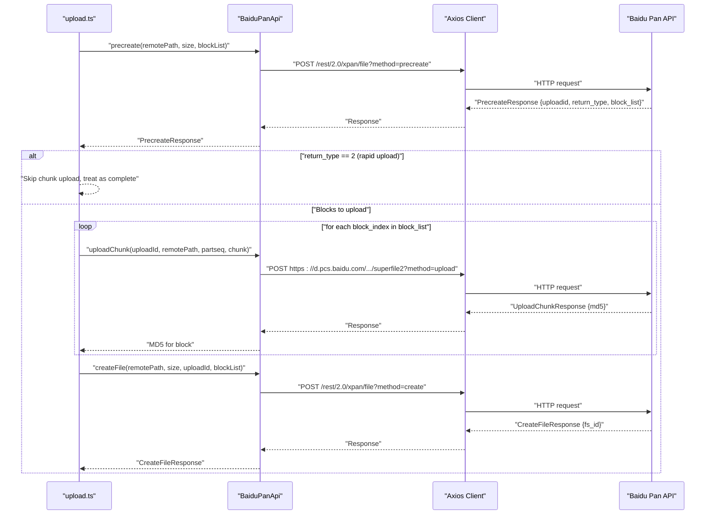
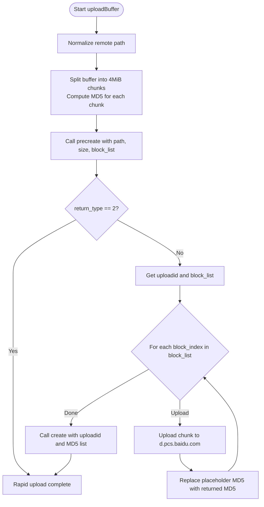
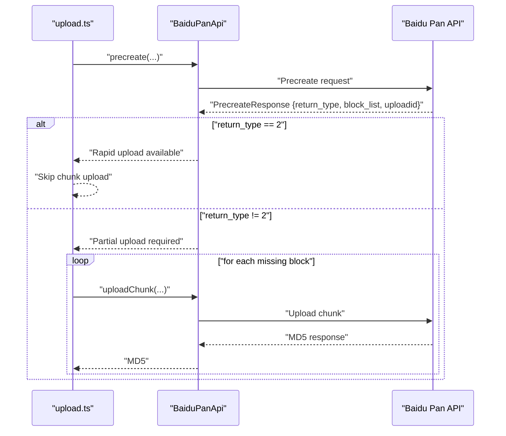
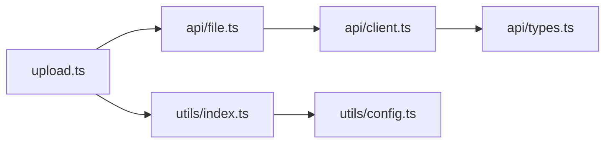

# Upload Command

<cite>
**Referenced Files in This Document**
- [upload.ts](file://src/commands/upload.ts)
- [file.ts](file://src/api/file.ts)
- [types.ts](file://src/api/types.ts)
- [client.ts](file://src/api/client.ts)
- [index.ts](file://src/utils/index.ts)
- [config.ts](file://src/utils/config.ts)
- [README.md](file://README.md)
- [package.json](file://package.json)
</cite>

## Table of Contents
1. [Introduction](#introduction)
2. [Project Structure](#project-structure)
3. [Core Components](#core-components)
4. [Architecture Overview](#architecture-overview)
5. [Detailed Component Analysis](#detailed-component-analysis)
6. [Dependency Analysis](#dependency-analysis)
7. [Performance Considerations](#performance-considerations)
8. [Troubleshooting Guide](#troubleshooting-guide)
9. [Conclusion](#conclusion)
10. [Appendices](#appendices)

## Introduction
This document provides comprehensive documentation for the upload command, covering file and directory upload functionality. It explains command syntax, source path arguments, destination paths, and upload options. It also details the chunked upload mechanism for large files, MD5 verification processes, and rapid upload behavior when applicable. Progress tracking, bandwidth considerations, and concurrency settings are addressed, along with practical examples and error handling strategies for network interruptions, disk space issues, and quota limitations.

## Project Structure
The upload command is implemented as a CLI subcommand that orchestrates file discovery, chunking, and API interactions. The key components are:
- Command definition and argument parsing
- Utility functions for path normalization, file enumeration, and progress display
- API client and Baidu Pan API wrapper for precreate, chunk upload, and file creation
- Token management and automatic refresh logic

**Diagram sources**
- [upload.ts](file://src/commands/upload.ts#L1-L144)
- [index.ts](file://src/utils/index.ts#L1-L110)
- [file.ts](file://src/api/file.ts#L1-L201)
- [client.ts](file://src/api/client.ts#L1-L171)
- [types.ts](file://src/api/types.ts#L1-L108)
- [config.ts](file://src/utils/config.ts#L1-L62)

**Section sources**
- [upload.ts](file://src/commands/upload.ts#L1-L144)
- [index.ts](file://src/utils/index.ts#L1-L110)
- [file.ts](file://src/api/file.ts#L1-L201)
- [client.ts](file://src/api/client.ts#L1-L171)
- [types.ts](file://src/api/types.ts#L1-L108)
- [config.ts](file://src/utils/config.ts#L1-L62)
- [README.md](file://README.md#L72-L90)

## Core Components
- Upload command: Defines positional arguments for local and remote paths, handles stdin input, validates existence, and dispatches to directory or single-file upload logic.
- BaiduPanApi: Encapsulates Baidu Pan upload workflow with precreate, chunk upload, and create file operations.
- Chunking and MD5: Splits buffers into fixed-size chunks and computes MD5 hashes per chunk.
- Utilities: Path normalization, recursive directory traversal, file reading, progress printing, and stdin reading.
- Client and token management: Axios client with interceptors, automatic token refresh, and error mapping.

**Section sources**
- [upload.ts](file://src/commands/upload.ts#L16-L96)
- [file.ts](file://src/api/file.ts#L16-L175)
- [index.ts](file://src/utils/index.ts#L27-L109)
- [client.ts](file://src/api/client.ts#L112-L161)

## Architecture Overview
The upload flow follows a three-phase process:
1. Precreate: Requests upload session metadata and identifies which blocks need uploading.
2. Chunk upload: Uploads missing blocks and collects per-block MD5.
3. Create file: Finalizes the file with aggregated MD5s and returns the file identifier.

**Diagram sources**
- [upload.ts](file://src/commands/upload.ts#L98-L143)
- [file.ts](file://src/api/file.ts#L79-L167)
- [client.ts](file://src/api/client.ts#L112-L161)

## Detailed Component Analysis

### Upload Command Syntax and Arguments
- Positional arguments:
  - local: Local file path or directory. Use "-" to read from stdin.
  - remote: Remote path on Baidu Pan. Automatically normalized to start with "/".
- Behavior:
  - Validates local path existence.
  - Handles stdin input by reading all chunks and uploading as a buffer.
  - Recursively enumerates directory contents and uploads each file individually.
  - For single files, constructs the final remote path based on whether the remote ends with "/".
- Error handling:
  - Exits with error code on invalid local path.
  - Catches and prints errors during upload operations.

Practical examples:
- Single file upload: baidupan-cli upload ./local-file.txt /remote-path/file.txt
- Directory upload: baidupan-cli upload ./local-directory /remote/path/
- Upload from stdin: echo "hello world" | baidupan-cli upload - /remote/hello.txt

**Section sources**
- [upload.ts](file://src/commands/upload.ts#L21-L96)
- [README.md](file://README.md#L72-L90)

### Chunked Upload Mechanism and MD5 Verification
- Chunk size: Fixed at 4 MiB per chunk.
- Chunking:
  - Splits the input buffer into contiguous subarrays.
  - Computes MD5 hash for each chunk.
- MD5 verification:
  - During precreate, the server receives the list of chunk MD5s.
  - On successful precreate, the server indicates which blocks are missing.
  - Each uploaded chunk returns an MD5; the client replaces the placeholder MD5 with the actual computed MD5.
- Rapid upload:
  - If the server determines the file can be created instantly (e.g., identical MD5), it returns a special return_type indicating completion without chunk upload.

**Diagram sources**
- [upload.ts](file://src/commands/upload.ts#L98-L143)
- [file.ts](file://src/api/file.ts#L187-L198)
- [file.ts](file://src/api/file.ts#L107-L138)
- [file.ts](file://src/api/file.ts#L143-L167)

**Section sources**
- [file.ts](file://src/api/file.ts#L13-L14)
- [file.ts](file://src/api/file.ts#L187-L198)
- [file.ts](file://src/api/file.ts#L107-L138)
- [file.ts](file://src/api/file.ts#L143-L167)
- [upload.ts](file://src/commands/upload.ts#L102-L143)

### Resume Capability and Rapid Upload
- Resume behavior:
  - The precreate step determines which blocks are missing and returns a block_list indicating partial progress.
  - The upload command iterates only over the missing blocks, effectively resuming the upload.
- Rapid upload:
  - When return_type equals 2, the server recognizes the file as already present and creates it immediately without uploading chunks.

**Diagram sources**
- [upload.ts](file://src/commands/upload.ts#L106-L114)
- [file.ts](file://src/api/file.ts#L79-L102)

**Section sources**
- [upload.ts](file://src/commands/upload.ts#L106-L114)
- [file.ts](file://src/api/file.ts#L79-L102)

### Progress Tracking and Output
- Progress display:
  - A progress bar is printed to stderr with percentage and current/total counts.
  - The progress function writes carriage-return-prefixed lines to overwrite previous output until completion.
- Console logging:
  - Upload destination, file size, and chunk count are logged.
  - Completion message includes the server-assigned file identifier.

**Section sources**
- [index.ts](file://src/utils/index.ts#L95-L109)
- [upload.ts](file://src/commands/upload.ts#L98-L143)

### Directory Upload Workflow
- Recursive enumeration:
  - Uses a depth-first traversal to collect all files under the given directory.
  - Skips empty directories and only enqueues files.
- Per-file upload:
  - For each file, constructs a remote path by appending the relative path segment.
  - Reads the file as a buffer and invokes the buffer upload pipeline.

**Section sources**
- [index.ts](file://src/utils/index.ts#L35-L55)
- [upload.ts](file://src/commands/upload.ts#L55-L80)

### Bandwidth Limitations and Concurrent Upload Settings
- Current implementation characteristics:
  - Sequential chunk upload per file; no explicit concurrency control.
  - No built-in bandwidth throttling or rate limiting.
  - Chunk size is fixed at 4 MiB.
- Practical implications:
  - Large files will be split into many sequential requests.
  - Network conditions and server-side limits may impact throughput.
- Recommendations:
  - Use smaller batches of files to reduce memory pressure.
  - Monitor network stability; consider retry strategies at higher levels if needed.
  - Adjust chunk size or introduce concurrency at the caller level if extending the implementation.

**Section sources**
- [file.ts](file://src/api/file.ts#L13-L14)
- [file.ts](file://src/api/file.ts#L107-L138)
- [upload.ts](file://src/commands/upload.ts#L119-L131)

### Practical Examples
- Single file upload:
  - Upload a file to a specific remote path.
  - Example command: baidupan-cli upload ./local-file.txt /remote-path/file.txt
- Directory upload with recursion:
  - Upload an entire directory tree to a remote folder.
  - Example command: baidupan-cli upload ./local-directory /remote/path/
- Batch upload scenarios:
  - Use shell loops or scripts to upload multiple files sequentially.
  - Combine with directory enumeration to stage uploads.
- Performance optimization techniques:
  - Ensure adequate disk space and stable network connectivity.
  - Prefer local SSD storage for temporary buffers.
  - Avoid uploading extremely large files in constrained environments.

**Section sources**
- [README.md](file://README.md#L72-L90)
- [upload.ts](file://src/commands/upload.ts#L55-L80)

## Dependency Analysis
The upload command depends on:
- BaiduPanApi for upload operations.
- Utility functions for path normalization, file enumeration, buffer reading, and progress display.
- Axios client for HTTP communication and interceptors for token management and error handling.

**Diagram sources**
- [upload.ts](file://src/commands/upload.ts#L1-L14)
- [file.ts](file://src/api/file.ts#L1-L11)
- [client.ts](file://src/api/client.ts#L1-L4)
- [types.ts](file://src/api/types.ts#L1-L8)
- [index.ts](file://src/utils/index.ts#L1-L14)
- [config.ts](file://src/utils/config.ts#L1-L6)

**Section sources**
- [upload.ts](file://src/commands/upload.ts#L1-L14)
- [file.ts](file://src/api/file.ts#L1-L11)
- [client.ts](file://src/api/client.ts#L1-L4)
- [types.ts](file://src/api/types.ts#L1-L8)
- [index.ts](file://src/utils/index.ts#L1-L14)
- [config.ts](file://src/utils/config.ts#L1-L6)

## Performance Considerations
- Chunk size: Fixed at 4 MiB. Larger chunks reduce overhead but increase memory usage and risk on unstable networks.
- Sequential processing: Chunks are uploaded one-by-one per file. Introducing concurrency would require careful coordination of upload IDs and MD5 aggregation.
- Memory footprint: Entire file is loaded into memory as a Buffer for single-file uploads. For very large files, consider streaming approaches at the API layer.
- Network reliability: The client retries on token expiration by refreshing the access token transparently. For other transient failures, consider adding retry logic around chunk uploads.

[No sources needed since this section provides general guidance]

## Troubleshooting Guide
Common issues and resolutions:
- Network interruptions:
  - The client intercepts HTTP errors and maps Baidu API error codes. Token expiration triggers automatic refresh.
  - For persistent connection issues, verify network connectivity and proxy settings.
- Disk space issues:
  - Ensure sufficient disk space for temporary buffers during upload.
  - Consider uploading from a location with ample free space.
- Quota limitations:
  - The API exposes quota information via dedicated endpoints. Monitor usage and adjust upload strategy accordingly.
- Authentication problems:
  - Verify access token presence and validity. Re-authenticate if needed.
- Path formatting:
  - Remote paths are normalized to start with "/". Ensure correct remote path semantics.

**Section sources**
- [client.ts](file://src/api/client.ts#L124-L150)
- [types.ts](file://src/api/types.ts#L98-L107)
- [README.md](file://README.md#L135-L154)

## Conclusion
The upload command provides a robust, chunked upload mechanism with MD5 verification and rapid upload support. It handles single files, directories, and stdin input while offering progress feedback. The current implementation focuses on simplicity and reliability, with sequential processing and fixed chunk sizes. For advanced scenarios requiring concurrency or bandwidth control, consider extending the implementation with configurable chunk sizes, concurrency limits, and retry policies.

[No sources needed since this section summarizes without analyzing specific files]

## Appendices

### API Definitions and Error Codes
- Precreate response fields:
  - uploadid: Session identifier for subsequent chunk uploads.
  - return_type: Indicates completion status (e.g., 2 for rapid upload).
  - block_list: Indices of missing blocks to upload.
- Upload chunk response:
  - md5: MD5 of the uploaded chunk.
- Create file response:
  - fs_id: Server-assigned file identifier.
- Error codes:
  - 0: Success
  - -6: Invalid access token
  - -7: Access denied
  - -9: File not found
  - 2: Parameter error
  - 111: Access token expired
  - 31034: Request too frequent

**Section sources**
- [types.ts](file://src/api/types.ts#L52-L71)
- [types.ts](file://src/api/types.ts#L98-L107)

### Environment Variables and Configuration
- Environment variables:
  - BAIDU_APP_KEY, BAIDU_SECRET_KEY, BAIDU_ACCESS_TOKEN, BAIDU_REFRESH_TOKEN
- Configuration file:
  - Stored in ~/.baidupan-cli/config.json with secure permissions.

**Section sources**
- [client.ts](file://src/api/client.ts#L15-L44)
- [config.ts](file://src/utils/config.ts#L19-L54)
- [README.md](file://README.md#L118-L134)
