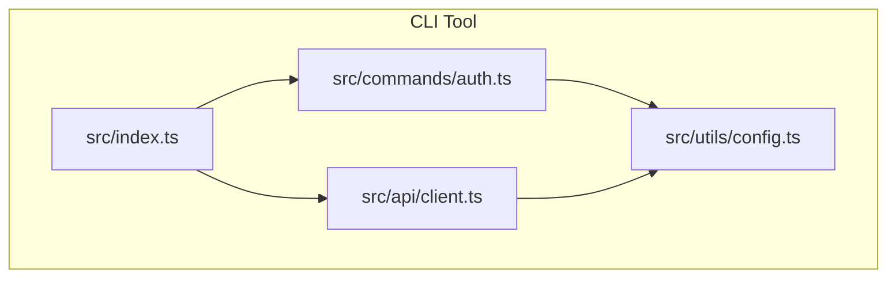
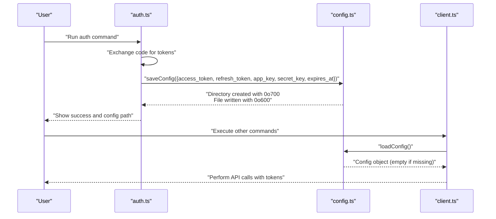
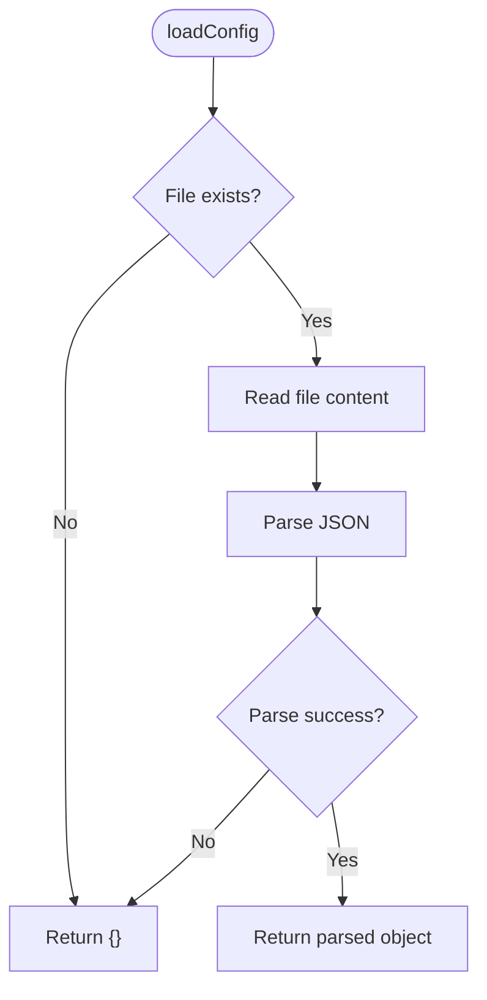
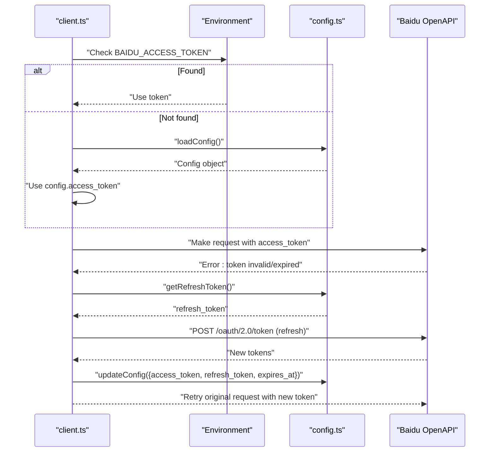
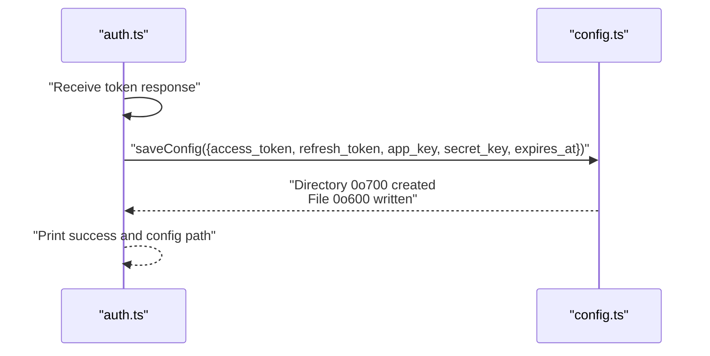
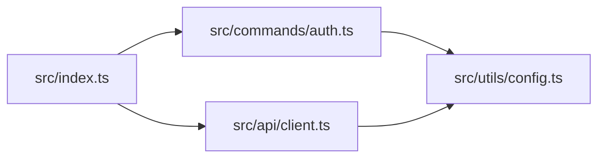

# Configuration File Structure

<cite>
**Referenced Files in This Document**
- [config.ts](file://src/utils/config.ts)
- [client.ts](file://src/api/client.ts)
- [auth.ts](file://src/commands/auth.ts)
- [index.ts](file://src/index.ts)
- [README.md](file://README.md)
- [package.json](file://package.json)
</cite>

## Table of Contents
1. [Introduction](#introduction)
2. [Project Structure](#project-structure)
3. [Core Components](#core-components)
4. [Architecture Overview](#architecture-overview)
5. [Detailed Component Analysis](#detailed-component-analysis)
6. [Dependency Analysis](#dependency-analysis)
7. [Performance Considerations](#performance-considerations)
8. [Troubleshooting Guide](#troubleshooting-guide)
9. [Conclusion](#conclusion)

## Introduction
This document explains the configuration file structure and storage mechanisms used by the CLI tool. It covers the JSON schema format, file locations across operating systems, permission modes, loading and saving behavior, fallback mechanisms, and validation rules for proper JSON formatting.

## Project Structure
The configuration system is implemented in a small set of focused modules:
- A configuration utility module that handles file I/O and permission enforcement
- An API client module that reads configuration for authentication and token management
- An authentication command module that writes configuration after successful authorization
- The main entry point that registers subcommands including authentication

**Diagram sources**
- [index.ts](file://src/index.ts#L1-L26)
- [auth.ts](file://src/commands/auth.ts#L1-L258)
- [client.ts](file://src/api/client.ts#L1-L171)
- [config.ts](file://src/utils/config.ts#L1-L62)

**Section sources**
- [index.ts](file://src/index.ts#L1-L26)
- [config.ts](file://src/utils/config.ts#L1-L62)
- [client.ts](file://src/api/client.ts#L1-L171)
- [auth.ts](file://src/commands/auth.ts#L1-L258)

## Core Components
The configuration system centers around a single JSON file stored under the user's home directory. The file location and permissions are enforced by the configuration utility.

- Configuration file location:
  - Directory: `${HOME}/.baidupan-cli`
  - File: `${HOME}/.baidupan-cli/config.json`
- Permissions:
  - Directory: 0o700 (owner-only read/write/execute)
  - File: 0o600 (owner-only read/write)
- Schema fields:
  - access_token: string (optional)
  - refresh_token: string (optional)
  - app_key: string (optional)
  - secret_key: string (optional)
  - expires_at: number (timestamp, optional)

Behavior highlights:
- Loading: Attempts to read and parse the JSON file; on failure or absence, returns an empty object
- Saving: Creates the directory with restrictive permissions, writes JSON with 2-space indentation, and sets file permissions
- Updating: Merges partial updates into existing configuration and persists

**Section sources**
- [config.ts](file://src/utils/config.ts#L5-L61)
- [README.md](file://README.md#L129-L134)

## Architecture Overview
The configuration lifecycle spans three primary flows:
- Authentication flow: On successful authorization, tokens and keys are written to the configuration file
- Runtime flow: During requests, the API client reads tokens and keys from environment variables or the configuration file
- Automatic refresh flow: When token errors occur, the client attempts to refresh and updates the configuration

**Diagram sources**
- [auth.ts](file://src/commands/auth.ts#L218-L257)
- [config.ts](file://src/utils/config.ts#L19-L45)
- [client.ts](file://src/api/client.ts#L15-L37)

## Detailed Component Analysis

### Configuration Utility Module
Responsibilities:
- Define the configuration directory and file path
- Load configuration from disk with safe parsing
- Save configuration to disk with strict permissions
- Merge partial updates into existing configuration

Key behaviors:
- Safe load: If the file does not exist or JSON parsing fails, returns an empty object
- Safe save: Ensures directory exists with 0o700, writes JSON with 2-space indentation, and sets file mode to 0o600
- Update merge: Reads existing config, merges updates, and persists

**Diagram sources**
- [config.ts](file://src/utils/config.ts#L19-L30)

**Section sources**
- [config.ts](file://src/utils/config.ts#L5-L61)

### API Client Integration
The API client integrates configuration in two ways:
- Access token retrieval: Prefers environment variables, falls back to configuration file
- Refresh flow: On token expiration errors, attempts to refresh using stored refresh token and app credentials, then updates configuration

**Diagram sources**
- [client.ts](file://src/api/client.ts#L15-L104)
- [config.ts](file://src/utils/config.ts#L42-L54)

**Section sources**
- [client.ts](file://src/api/client.ts#L15-L104)
- [config.ts](file://src/utils/config.ts#L42-L54)

### Authentication Command
On successful authorization, the command saves tokens and keys to the configuration file and prints the configuration path.

**Diagram sources**
- [auth.ts](file://src/commands/auth.ts#L218-L257)
- [config.ts](file://src/utils/config.ts#L35-L45)

**Section sources**
- [auth.ts](file://src/commands/auth.ts#L218-L257)
- [config.ts](file://src/utils/config.ts#L35-L45)

## Dependency Analysis
The configuration module is consumed by both the authentication command and the API client. The main entry point registers subcommands that rely on these components.

**Diagram sources**
- [index.ts](file://src/index.ts#L1-L26)
- [auth.ts](file://src/commands/auth.ts#L1-L258)
- [client.ts](file://src/api/client.ts#L1-L171)
- [config.ts](file://src/utils/config.ts#L1-L62)

**Section sources**
- [index.ts](file://src/index.ts#L1-L26)
- [auth.ts](file://src/commands/auth.ts#L1-L258)
- [client.ts](file://src/api/client.ts#L1-L171)
- [config.ts](file://src/utils/config.ts#L1-L62)

## Performance Considerations
- File I/O is minimal and occurs only during initialization, authentication, and token refresh
- JSON serialization uses 2-space indentation for readability; consider that larger configurations will increase file size slightly
- Permission enforcement happens once per save operation; overhead is negligible

## Troubleshooting Guide
Common issues and resolutions:
- Permission denied when writing configuration:
  - Ensure the home directory is writable and the process has permission to create directories and files
  - Verify that the directory is created with 0o700 and the file with 0o600
- JSON parsing errors:
  - Confirm the file is valid JSON; the loader ignores malformed content and falls back to an empty configuration
  - Use a JSON validator to check formatting
- Missing access token:
  - Run the authentication command to obtain tokens and write them to the configuration file
  - Alternatively, set environment variables for tokens and app credentials
- Token expired:
  - The client attempts automatic refresh; if unsuccessful, re-authenticate to update configuration

Validation rules for JSON formatting:
- Must be a valid JSON object
- Field names must match the schema exactly
- Numeric timestamps must be integers representing milliseconds since epoch
- Strings must not contain unescaped control characters

Fallback mechanisms:
- If the configuration file is absent or unreadable, the loader returns an empty object
- Environment variables take precedence over configuration file values
- On token errors, the client attempts to refresh and update configuration automatically

**Section sources**
- [config.ts](file://src/utils/config.ts#L19-L30)
- [client.ts](file://src/api/client.ts#L15-L104)
- [README.md](file://README.md#L129-L134)

## Conclusion
The configuration system provides a simple, secure, and resilient mechanism for storing authentication credentials and tokens. It enforces strict file permissions, gracefully handles missing or malformed configuration, and integrates seamlessly with environment variables and automatic token refresh.
