# Configuration Loading and Validation

<cite>
**Referenced Files in This Document**
- [config.ts](file://src/utils/config.ts)
- [client.ts](file://src/api/client.ts)
- [auth.ts](file://src/commands/auth.ts)
- [download.ts](file://src/commands/download.ts)
- [list.ts](file://src/commands/list.ts)
- [file.ts](file://src/api/file.ts)
- [types.ts](file://src/api/types.ts)
- [index.ts](file://src/index.ts)
- [README.md](file://README.md)
- [package.json](file://package.json)
</cite>

## Table of Contents
1. [Introduction](#introduction)
2. [Project Structure](#project-structure)
3. [Core Components](#core-components)
4. [Architecture Overview](#architecture-overview)
5. [Detailed Component Analysis](#detailed-component-analysis)
6. [Dependency Analysis](#dependency-analysis)
7. [Performance Considerations](#performance-considerations)
8. [Troubleshooting Guide](#troubleshooting-guide)
9. [Conclusion](#conclusion)
10. [Appendices](#appendices)

## Introduction
This document explains the configuration loading and validation system used by the CLI tool. It covers the hierarchical precedence of configuration sources, the implementation of the configuration loader, JSON parsing error handling, graceful fallback to a default empty configuration, and how configuration is consumed across the application. It also documents the validation and type-checking mechanisms, provides examples of configuration loading scenarios, outlines error handling and debugging techniques, and addresses configuration migration and backward compatibility considerations.

## Project Structure
The configuration system spans several modules:
- Configuration persistence and retrieval: utilities
- Authentication and token saving: commands and API client
- Consumption of configuration: API client and commands
- Type definitions and error codes: API types

**Diagram sources**
- [config.ts](file://src/utils/config.ts#L1-L62)
- [client.ts](file://src/api/client.ts#L1-L171)
- [auth.ts](file://src/commands/auth.ts#L1-L258)
- [download.ts](file://src/commands/download.ts#L1-L104)
- [list.ts](file://src/commands/list.ts#L1-L81)
- [file.ts](file://src/api/file.ts#L1-L201)
- [types.ts](file://src/api/types.ts#L1-L108)

**Section sources**
- [config.ts](file://src/utils/config.ts#L1-L62)
- [client.ts](file://src/api/client.ts#L1-L171)
- [auth.ts](file://src/commands/auth.ts#L1-L258)
- [download.ts](file://src/commands/download.ts#L1-L104)
- [list.ts](file://src/commands/list.ts#L1-L81)
- [file.ts](file://src/api/file.ts#L1-L201)
- [types.ts](file://src/api/types.ts#L1-L108)
- [index.ts](file://src/index.ts#L1-L26)
- [README.md](file://README.md#L1-L169)
- [package.json](file://package.json#L1-L81)

## Core Components
- Configuration model and file location:
  - The configuration interface defines optional fields for tokens and keys, plus an expiration timestamp.
  - The configuration file is stored under a dedicated directory in the user’s home folder.
- Configuration loader:
  - Reads the configuration file if present, parses JSON, and returns the parsed object.
  - On any error (missing file, invalid JSON, permission issues), it silently falls back to an empty configuration object.
- Configuration saver and updater:
  - Ensures the configuration directory exists with appropriate permissions and writes the configuration file with safe file modes.
  - Provides a merge-update mechanism that reads existing config, merges in new values, and persists the result.
- Token resolution precedence:
  - Access token resolution follows environment variables first, then the configuration file.
  - Refresh token and app credentials follow similar precedence: environment variables override configuration file values.

**Section sources**
- [config.ts](file://src/utils/config.ts#L8-L30)
- [config.ts](file://src/utils/config.ts#L35-L61)
- [client.ts](file://src/api/client.ts#L15-L55)

## Architecture Overview
The configuration system enforces a strict precedence:
1. Environment variables
2. Local configuration file
3. Command-line parameters (where applicable)

```mermaid
flowchart TD
Start(["Load Configuration"]) --> Env["Check Environment Variables"]
Env --> HasEnv{"Env Values Present?"}
HasEnv --> |Yes| UseEnv["Use Environment Values"]
HasEnv --> |No| File["Read Local Config File"]
File --> Parse{"JSON Parse OK?"}
Parse --> |Yes| UseFile["Use Parsed Config"]
Parse --> |No| Fallback["Fallback to Empty Config {}"]
UseEnv --> End(["Resolved"])
UseFile --> End
Fallback --> End
```

**Diagram sources**
- [client.ts](file://src/api/client.ts#L15-L37)
- [config.ts](file://src/utils/config.ts#L19-L30)

## Detailed Component Analysis

### Configuration Loader Implementation
- File existence check and synchronous read
- JSON parse with try/catch around the entire operation
- Silent failure and graceful fallback to an empty object
- No explicit field validation during load; validation occurs downstream where needed

**Diagram sources**
- [config.ts](file://src/utils/config.ts#L19-L30)

**Section sources**
- [config.ts](file://src/utils/config.ts#L19-L30)

### JSON Parsing Error Handling and Fallback
- Any exception during file read or JSON parsing is caught and ignored.
- The loader returns an empty object, ensuring downstream code receives a valid object shape.
- This design prevents crashes while loading configuration but requires consumers to handle missing fields appropriately.

**Section sources**
- [config.ts](file://src/utils/config.ts#L20-L29)

### Token Resolution and Precedence
- Access token resolution:
  - Environment variable takes priority.
  - If not present, the configuration file is consulted.
  - If still absent, the process exits with an error message instructing the user to authenticate.
- Refresh token and app credentials:
  - Environment variables override configuration file values.
  - If neither is available, the consumer handles the absence (e.g., token refresh is attempted only when both are present).

**Diagram sources**
- [client.ts](file://src/api/client.ts#L15-L37)
- [auth.ts](file://src/commands/auth.ts#L47-L48)
- [index.ts](file://src/index.ts#L2-L6)

**Section sources**
- [client.ts](file://src/api/client.ts#L15-L55)
- [auth.ts](file://src/commands/auth.ts#L47-L63)

### Configuration Validation and Type Checking
- During load, no explicit validation is performed; the loader returns whatever JSON is present.
- Downstream validation occurs implicitly:
  - Token resolution requires presence of access token or app credentials; otherwise, the process exits.
  - API client interceptors validate API responses and raise meaningful errors for known error codes.
- Type safety is enforced via TypeScript interfaces for configuration and API responses.

**Section sources**
- [client.ts](file://src/api/client.ts#L106-L150)
- [types.ts](file://src/api/types.ts#L99-L108)
- [config.ts](file://src/utils/config.ts#L8-L14)

### Saving and Updating Configuration
- Save ensures the configuration directory exists and sets restrictive file permissions.
- Update merges new values into the existing configuration and persists the result.

**Section sources**
- [config.ts](file://src/utils/config.ts#L35-L54)

### Command-Line Parameter Precedence
- Authentication command demonstrates precedence:
  - CLI arguments override environment variables when provided.
  - If required arguments are missing, the process exits with guidance.
- Other commands rely on the API client for token resolution, which follows environment > config file precedence.

**Section sources**
- [auth.ts](file://src/commands/auth.ts#L47-L63)
- [client.ts](file://src/api/client.ts#L15-L37)

## Dependency Analysis
The configuration system has minimal coupling:
- Utilities module provides persistence primitives.
- API client depends on utilities for loading configuration and on environment variables for overrides.
- Commands depend on the API client and optionally on environment variables for initial setup.

**Diagram sources**
- [config.ts](file://src/utils/config.ts#L1-L62)
- [client.ts](file://src/api/client.ts#L1-L171)
- [auth.ts](file://src/commands/auth.ts#L1-L258)
- [file.ts](file://src/api/file.ts#L1-L201)
- [types.ts](file://src/api/types.ts#L1-L108)

**Section sources**
- [config.ts](file://src/utils/config.ts#L1-L62)
- [client.ts](file://src/api/client.ts#L1-L171)
- [auth.ts](file://src/commands/auth.ts#L1-L258)
- [file.ts](file://src/api/file.ts#L1-L201)
- [types.ts](file://src/api/types.ts#L1-L108)

## Performance Considerations
- Synchronous file I/O in the configuration loader is acceptable for a CLI tool due to infrequent invocation.
- Token resolution caches the access token in memory for the process lifetime, reducing repeated file reads.
- JSON parsing is lightweight and only executed when the configuration file exists.

[No sources needed since this section provides general guidance]

## Troubleshooting Guide
Common issues and resolutions:
- Missing access token:
  - Symptom: Process exits with an error requesting authentication.
  - Resolution: Run the authentication command to obtain and save tokens, or set environment variables.
- Invalid or corrupted configuration file:
  - Symptom: Unexpected behavior or silent failures.
  - Resolution: Remove or fix the configuration file; the loader will fall back to an empty configuration.
- Permission errors writing configuration:
  - Symptom: Warning messages when saving configuration.
  - Resolution: Verify write permissions to the configuration directory and file modes.
- Token expired or invalid:
  - Symptom: API errors indicating invalid or expired access token.
  - Resolution: The client attempts to refresh the token using refresh credentials; if unavailable, re-authenticate.

Debugging techniques:
- Inspect the configuration file path and contents using the exposed getter.
- Temporarily set environment variables to bypass configuration file for testing.
- Enable verbose logging in commands to observe token usage and API responses.

**Section sources**
- [client.ts](file://src/api/client.ts#L34-L37)
- [client.ts](file://src/api/client.ts#L63-L104)
- [config.ts](file://src/utils/config.ts#L42-L44)
- [config.ts](file://src/utils/config.ts#L59-L61)
- [types.ts](file://src/api/types.ts#L99-L108)

## Conclusion
The configuration system prioritizes environment variables, followed by the local configuration file, and finally command-line parameters where applicable. The loader is robust against malformed or missing configuration by falling back to an empty object. Token resolution and API client behavior enforce runtime validation and error reporting. While explicit schema validation is not implemented at load time, downstream checks ensure correctness and provide actionable feedback.

[No sources needed since this section summarizes without analyzing specific files]

## Appendices

### Configuration Precedence Summary
- Access token: Environment variable > Configuration file
- Refresh token: Environment variable > Configuration file
- App credentials: Environment variable > Configuration file
- Command-line parameters: Used by specific commands (e.g., auth) when provided

**Section sources**
- [client.ts](file://src/api/client.ts#L15-L55)
- [auth.ts](file://src/commands/auth.ts#L47-L63)

### Configuration Migration and Backward Compatibility
- Current behavior:
  - The configuration interface allows optional fields, enabling gradual addition of new fields without breaking existing configurations.
  - Consumers check for presence of required fields and handle missing ones gracefully.
- Recommendations for future migrations:
  - Introduce a version field in the configuration file to detect and migrate older formats.
  - Provide a migration routine that updates old keys to new keys and removes deprecated fields.
  - Maintain backward-compatible parsing by ignoring unknown fields and setting defaults for missing ones.

**Section sources**
- [config.ts](file://src/utils/config.ts#L8-L14)
- [client.ts](file://src/api/client.ts#L15-L37)
