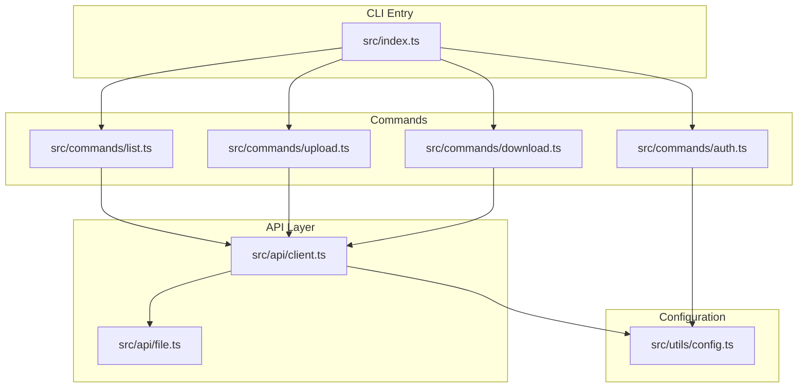
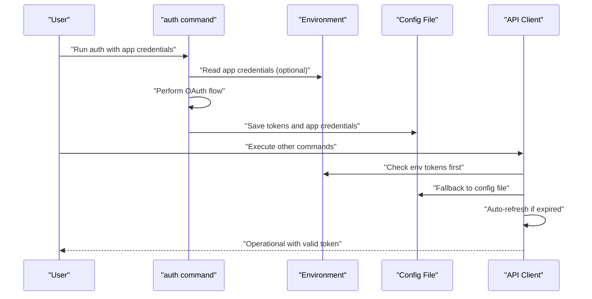
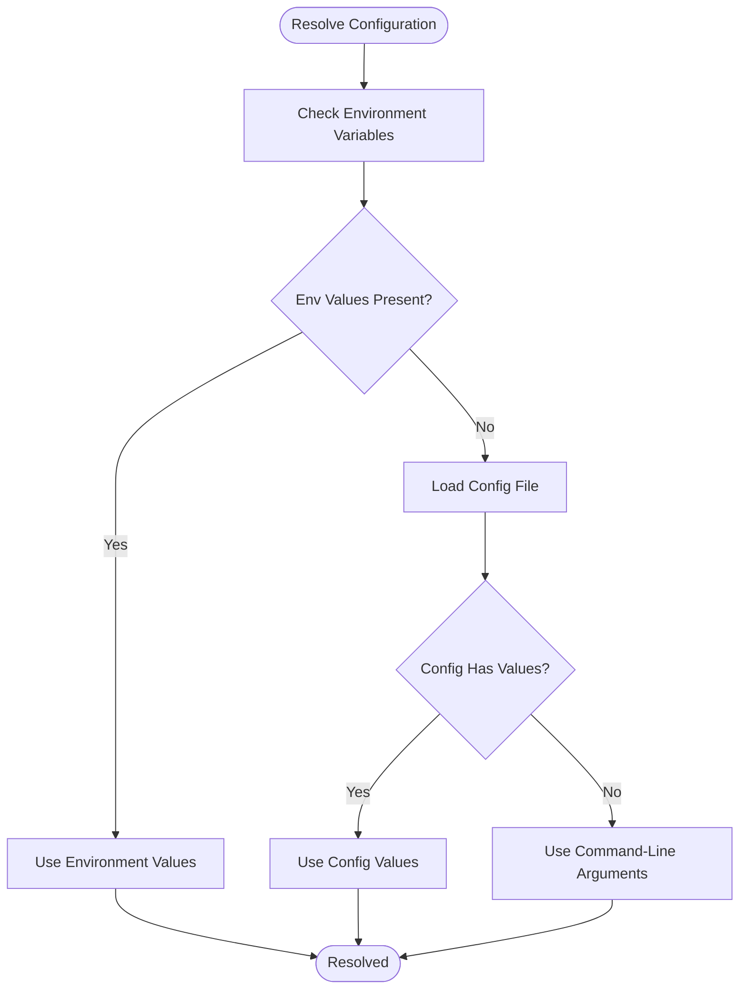
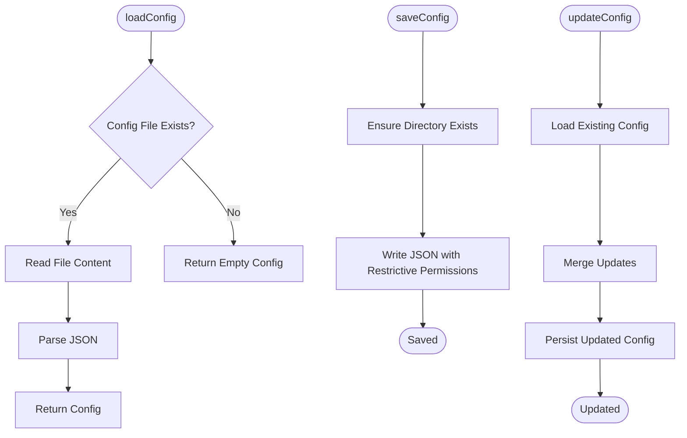
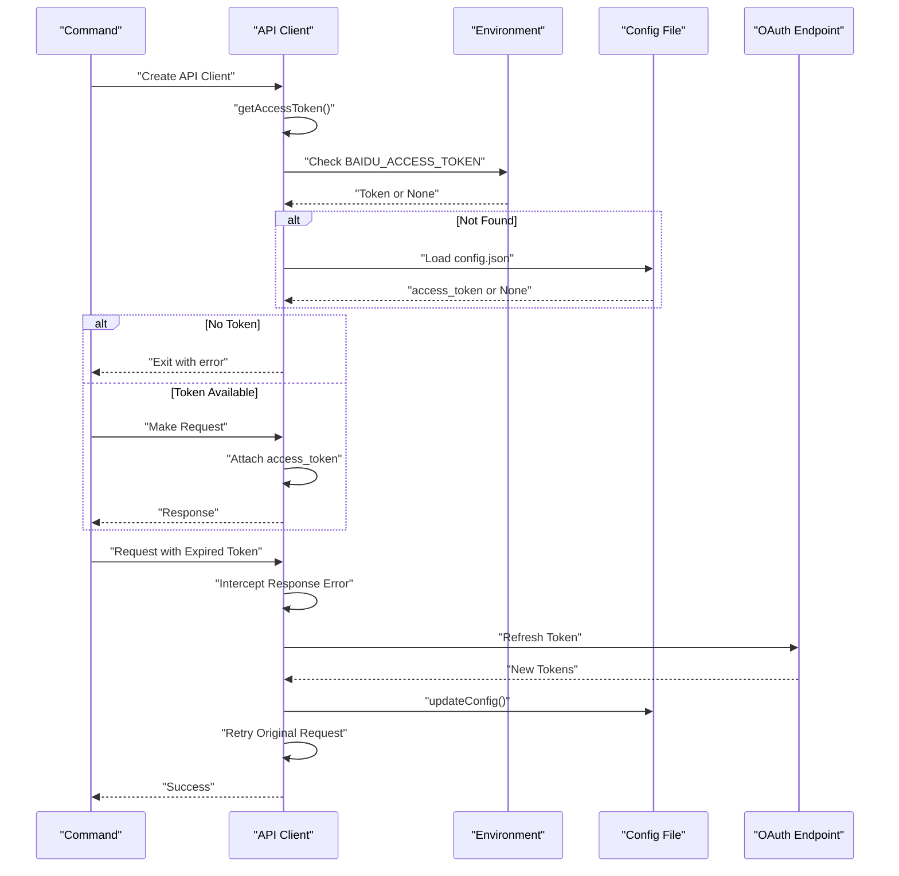
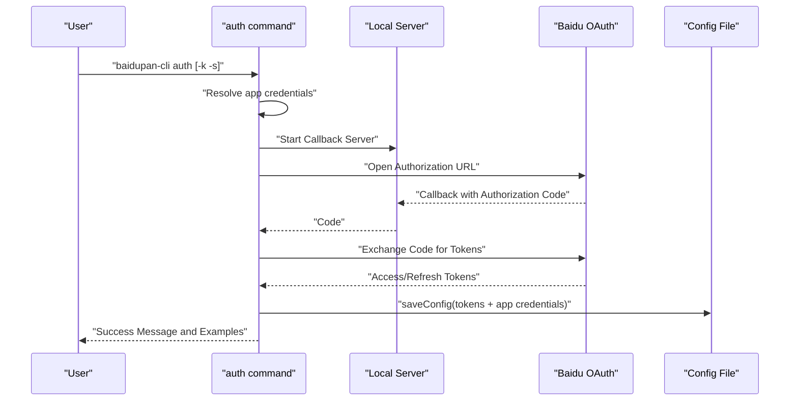
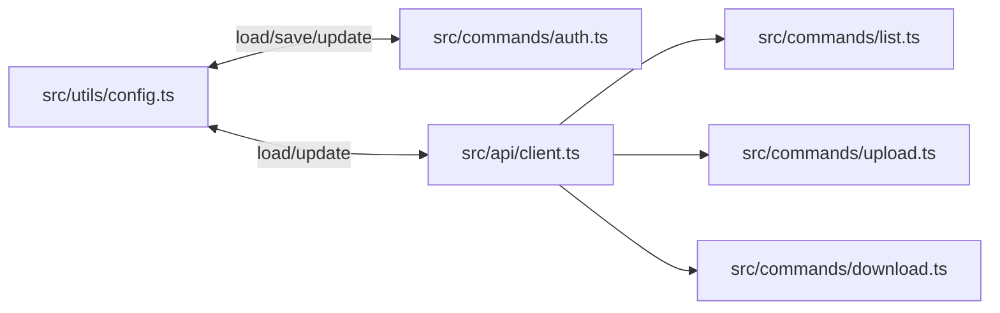
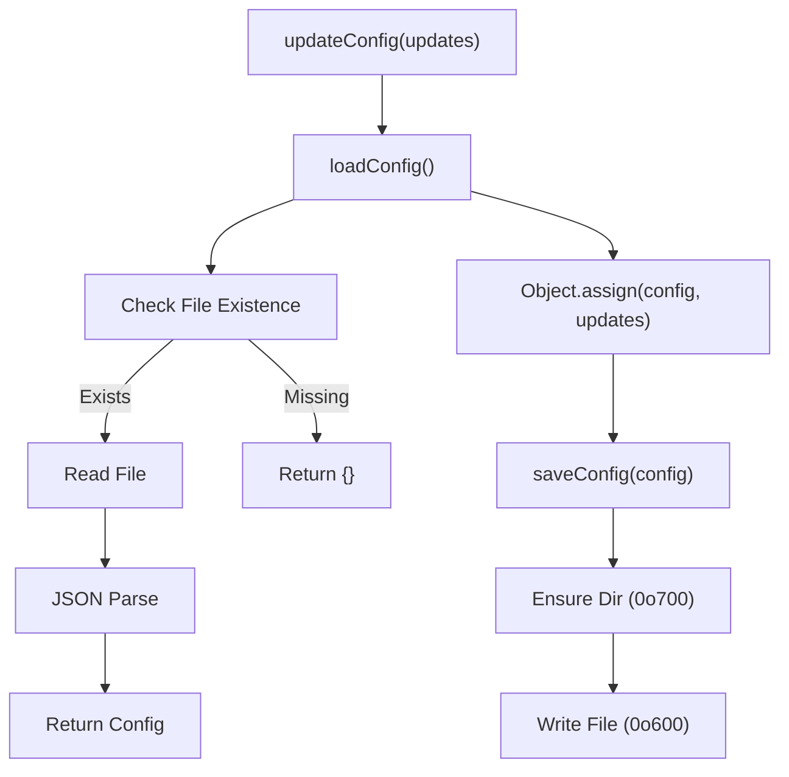

# Configuration Management

<cite>
**Referenced Files in This Document**
- [src/utils/config.ts](file://src/utils/config.ts)
- [src/api/client.ts](file://src/api/client.ts)
- [src/commands/auth.ts](file://src/commands/auth.ts)
- [src/commands/download.ts](file://src/commands/download.ts)
- [src/commands/list.ts](file://src/commands/list.ts)
- [src/commands/upload.ts](file://src/commands/upload.ts)
- [src/api/file.ts](file://src/api/file.ts)
- [src/utils/index.ts](file://src/utils/index.ts)
- [src/index.ts](file://src/index.ts)
- [README.md](file://README.md)
- [package.json](file://package.json)
- [example/README.md](file://example/README.md)
</cite>

## Table of Contents
1. [Introduction](#introduction)
2. [Project Structure](#project-structure)
3. [Core Components](#core-components)
4. [Architecture Overview](#architecture-overview)
5. [Detailed Component Analysis](#detailed-component-analysis)
6. [Dependency Analysis](#dependency-analysis)
7. [Performance Considerations](#performance-considerations)
8. [Security Considerations](#security-considerations)
9. [Manual Configuration Editing](#manual-configuration-editing)
10. [Environment Variables](#environment-variables)
11. [Configuration Loading and Saving Mechanisms](#configuration-loading-and-saving-mechanisms)
12. [Validation Processes](#validation-processes)
13. [Configuration Migration and Compatibility](#configuration-migration-and-compatibility)
14. [Troubleshooting Guide](#troubleshooting-guide)
15. [Conclusion](#conclusion)

## Introduction
This document provides comprehensive documentation for the configuration management system of the Baidu Pan CLI tool. It explains the configuration file structure, locations across operating systems, and the hierarchical precedence used to resolve configuration values. It documents the configuration schema for authentication tokens, app credentials, and operational settings, and details how configuration is loaded, validated, and saved. Security considerations for sensitive data storage are addressed, along with practical examples for manual configuration editing, environment variable usage, and troubleshooting configuration-related issues. Finally, it covers configuration migration and compatibility between versions.

## Project Structure
The configuration management system spans several modules:
- Configuration persistence and retrieval: [src/utils/config.ts](file://src/utils/config.ts)
- Configuration consumption and token lifecycle: [src/api/client.ts](file://src/api/client.ts)
- Authentication command that writes configuration: [src/commands/auth.ts](file://src/commands/auth.ts)
- Commands that consume configuration via the API client: [src/commands/list.ts](file://src/commands/list.ts), [src/commands/upload.ts](file://src/commands/upload.ts), [src/commands/download.ts](file://src/commands/download.ts)
- Supporting utilities: [src/utils/index.ts](file://src/utils/index.ts)
- Entry point and command registration: [src/index.ts](file://src/index.ts)
- Documentation and examples: [README.md](file://README.md), [example/README.md](file://example/README.md)

**Diagram sources**
- [src/index.ts](file://src/index.ts#L1-L26)
- [src/commands/auth.ts](file://src/commands/auth.ts#L1-L258)
- [src/commands/list.ts](file://src/commands/list.ts#L1-L81)
- [src/commands/upload.ts](file://src/commands/upload.ts#L1-L144)
- [src/commands/download.ts](file://src/commands/download.ts#L1-L104)
- [src/api/client.ts](file://src/api/client.ts#L1-L171)
- [src/api/file.ts](file://src/api/file.ts#L1-L201)
- [src/utils/config.ts](file://src/utils/config.ts#L1-L62)

**Section sources**
- [src/index.ts](file://src/index.ts#L1-L26)
- [src/utils/config.ts](file://src/utils/config.ts#L1-L62)
- [src/api/client.ts](file://src/api/client.ts#L1-L171)
- [src/commands/auth.ts](file://src/commands/auth.ts#L1-L258)

## Core Components
- Configuration schema: The configuration object supports optional fields for access_token, refresh_token, app_key, secret_key, and expires_at (timestamp). See [src/utils/config.ts](file://src/utils/config.ts#L8-L14).
- Configuration persistence: Functions to load, save, and update configuration are provided. See [src/utils/config.ts](file://src/utils/config.ts#L19-L61).
- Token resolution and lifecycle: The API client resolves tokens from environment variables first, then falls back to the configuration file. It handles token expiration and automatic refresh, saving refreshed tokens back to the configuration file. See [src/api/client.ts](file://src/api/client.ts#L15-L104).
- Authentication command: Reads app credentials from arguments or environment variables, performs OAuth, and saves tokens to the configuration file. See [src/commands/auth.ts](file://src/commands/auth.ts#L46-L91) and [src/commands/auth.ts](file://src/commands/auth.ts#L218-L257).

**Section sources**
- [src/utils/config.ts](file://src/utils/config.ts#L8-L61)
- [src/api/client.ts](file://src/api/client.ts#L15-L104)
- [src/commands/auth.ts](file://src/commands/auth.ts#L46-L91)
- [src/commands/auth.ts](file://src/commands/auth.ts#L218-L257)

## Architecture Overview
The configuration system follows a layered approach:
- Environment variables provide the highest precedence for sensitive values.
- The configuration file stores persistent tokens and app credentials.
- Command-line parameters are used during authentication to supply app credentials.
- The API client centralizes token resolution and refresh logic, ensuring commands always operate with valid tokens.

**Diagram sources**
- [src/commands/auth.ts](file://src/commands/auth.ts#L46-L91)
- [src/commands/auth.ts](file://src/commands/auth.ts#L218-L257)
- [src/api/client.ts](file://src/api/client.ts#L15-L104)
- [src/utils/config.ts](file://src/utils/config.ts#L19-L61)

## Detailed Component Analysis

### Configuration Schema
The configuration object includes the following fields:
- access_token: Optional string representing the current access token.
- refresh_token: Optional string representing the refresh token used for renewal.
- app_key: Optional string representing the Baidu Pan App Key.
- secret_key: Optional string representing the Baidu Pan Secret Key.
- expires_at: Optional number representing a timestamp when the access token expires.

These fields are persisted to a JSON file and consumed by the API client for authentication and authorization.

**Section sources**
- [src/utils/config.ts](file://src/utils/config.ts#L8-L14)

### Configuration File Locations
- Windows: %USERPROFILE%\.baidupan-cli\config.json
- macOS/Linux: ~/.baidupan-cli/config.json

The configuration directory and file are created with restrictive permissions to protect sensitive data.

**Section sources**
- [src/utils/config.ts](file://src/utils/config.ts#L5-L6)
- [README.md](file://README.md#L129-L134)

### Hierarchical Configuration Precedence
The system resolves configuration values in the following order:
1. Environment variables (highest precedence)
2. Local configuration file
3. Command-line parameters (used during authentication)

This precedence ensures that environment variables override stored configuration, while command-line parameters can be used to supply initial app credentials during authentication.

**Diagram sources**
- [src/api/client.ts](file://src/api/client.ts#L15-L55)
- [src/commands/auth.ts](file://src/commands/auth.ts#L46-L63)
- [src/utils/config.ts](file://src/utils/config.ts#L19-L30)

**Section sources**
- [src/api/client.ts](file://src/api/client.ts#L15-L55)
- [src/commands/auth.ts](file://src/commands/auth.ts#L46-L63)

### Configuration Loading and Saving Mechanisms
- Loading: The loader reads the configuration file if present and parses it as JSON. On failure or absence, it returns an empty configuration object.
- Saving: The saver creates the configuration directory with restrictive permissions and writes the configuration file with restrictive permissions.
- Updating: The updater merges provided updates into the existing configuration and persists the result.

**Diagram sources**
- [src/utils/config.ts](file://src/utils/config.ts#L19-L61)

**Section sources**
- [src/utils/config.ts](file://src/utils/config.ts#L19-L61)

### Token Resolution and Automatic Refresh
The API client resolves tokens with the following logic:
- If a current token is cached in memory, it is returned immediately.
- Otherwise, it checks environment variables for tokens.
- If not found in environment variables, it loads tokens from the configuration file.
- If tokens are missing, the process exits with an error prompting authentication.
- When a request fails due to token expiration, the client attempts to refresh the token using the refresh token and app credentials, then retries the request and persists the refreshed tokens.

**Diagram sources**
- [src/api/client.ts](file://src/api/client.ts#L15-L104)
- [src/utils/config.ts](file://src/utils/config.ts#L50-L54)
- [src/commands/auth.ts](file://src/commands/auth.ts#L218-L257)

**Section sources**
- [src/api/client.ts](file://src/api/client.ts#L15-L104)
- [src/utils/config.ts](file://src/utils/config.ts#L50-L54)
- [src/commands/auth.ts](file://src/commands/auth.ts#L218-L257)

### Authentication Command and Configuration Persistence
The authentication command:
- Accepts app credentials via command-line arguments or environment variables.
- Starts a local server to receive OAuth callbacks.
- Exchanges the authorization code for tokens.
- Saves tokens and app credentials to the configuration file.
- Prints environment variable export examples for cross-machine usage.

**Diagram sources**
- [src/commands/auth.ts](file://src/commands/auth.ts#L46-L91)
- [src/commands/auth.ts](file://src/commands/auth.ts#L218-L257)
- [src/utils/config.ts](file://src/utils/config.ts#L35-L45)

**Section sources**
- [src/commands/auth.ts](file://src/commands/auth.ts#L46-L91)
- [src/commands/auth.ts](file://src/commands/auth.ts#L218-L257)
- [src/utils/config.ts](file://src/utils/config.ts#L35-L45)

### Commands That Consume Configuration
- List command: Creates an API client and lists files in a directory. It respects the resolved access token from the client.
- Upload command: Creates an API client, splits files into chunks, and uploads using the resolved token.
- Download command: Creates an API client, retrieves file metadata, and downloads using the resolved token.

These commands rely on the API client for token resolution and do not directly manage configuration.

**Section sources**
- [src/commands/list.ts](file://src/commands/list.ts#L36-L47)
- [src/commands/upload.ts](file://src/commands/upload.ts#L33-L95)
- [src/commands/download.ts](file://src/commands/download.ts#L25-L96)
- [src/api/client.ts](file://src/api/client.ts#L112-L161)

## Dependency Analysis
The configuration system exhibits clear separation of concerns:
- Configuration utilities handle persistence and retrieval.
- API client encapsulates token resolution, caching, and refresh logic.
- Commands depend on the API client for authenticated operations.
- Authentication command depends on configuration utilities to persist tokens.

**Diagram sources**
- [src/utils/config.ts](file://src/utils/config.ts#L19-L61)
- [src/api/client.ts](file://src/api/client.ts#L15-L104)
- [src/commands/auth.ts](file://src/commands/auth.ts#L218-L257)
- [src/commands/list.ts](file://src/commands/list.ts#L36-L47)
- [src/commands/upload.ts](file://src/commands/upload.ts#L33-L95)
- [src/commands/download.ts](file://src/commands/download.ts#L25-L96)

**Section sources**
- [src/utils/config.ts](file://src/utils/config.ts#L19-L61)
- [src/api/client.ts](file://src/api/client.ts#L15-L104)
- [src/commands/auth.ts](file://src/commands/auth.ts#L218-L257)
- [src/commands/list.ts](file://src/commands/list.ts#L36-L47)
- [src/commands/upload.ts](file://src/commands/upload.ts#L33-L95)
- [src/commands/download.ts](file://src/commands/download.ts#L25-L96)

## Performance Considerations
- Token caching: The API client caches the resolved access token in memory to avoid repeated file reads.
- Minimal disk I/O: Configuration is read on demand and updated only when tokens change (e.g., after refresh).
- Efficient file operations: Configuration directory and file are created with restrictive permissions to prevent unnecessary system calls.

[No sources needed since this section provides general guidance]

## Security Considerations
- File permissions: The configuration directory is created with restrictive permissions, and the configuration file is written with restrictive permissions to limit access.
- Environment variables: Sensitive values can be supplied via environment variables, avoiding exposure in command history or logs.
- Token lifecycle: Automatic refresh and persistence reduce manual handling of tokens, minimizing risk.
- Cross-machine usage: The authentication command prints environment variable export examples for secure cross-machine deployment.

**Section sources**
- [src/utils/config.ts](file://src/utils/config.ts#L37-L44)
- [src/commands/auth.ts](file://src/commands/auth.ts#L247-L253)

## Manual Configuration Editing
Manual editing of the configuration file is supported. The file location varies by operating system:
- Windows: %USERPROFILE%\.baidupan-cli\config.json
- macOS/Linux: ~/.baidupan-cli/config.json

The configuration file contains JSON with optional fields for tokens and app credentials. After editing, subsequent commands will use the updated values according to the precedence rules.

**Section sources**
- [README.md](file://README.md#L129-L134)
- [src/utils/config.ts](file://src/utils/config.ts#L5-L6)
- [src/utils/config.ts](file://src/utils/config.ts#L8-L14)

## Environment Variables
The system recognizes the following environment variables:
- BAIDU_APP_KEY: Baidu Pan App Key
- BAIDU_SECRET_KEY: Baidu Pan Secret Key
- BAIDU_ACCESS_TOKEN: Access token for authentication
- BAIDU_REFRESH_TOKEN: Refresh token for automatic renewal

Environment variables take precedence over configuration file values and are used by the API client and authentication command.

**Section sources**
- [src/api/client.ts](file://src/api/client.ts#L20-L54)
- [src/commands/auth.ts](file://src/commands/auth.ts#L47-L48)
- [README.md](file://README.md#L118-L127)

## Configuration Loading and Saving Mechanisms
- Loading: The loader checks for the existence of the configuration file, reads its content, and parses it as JSON. If parsing fails or the file is absent, it returns an empty configuration object.
- Saving: The saver ensures the configuration directory exists with restrictive permissions, then writes the configuration file with restrictive permissions.
- Updating: The updater merges provided updates into the existing configuration and persists the result.

**Diagram sources**
- [src/utils/config.ts](file://src/utils/config.ts#L19-L61)

**Section sources**
- [src/utils/config.ts](file://src/utils/config.ts#L19-L61)

## Validation Processes
- Token presence: If no access token is found through environment variables or configuration, the process exits with an error message directing the user to authenticate.
- Token expiration: Requests that fail with token-related errors trigger an automatic refresh attempt. If successful, the request is retried with the new token; otherwise, the user is prompted to re-authenticate.
- Parameter validation: The authentication command validates the presence of app credentials and prints usage guidance if missing.

**Section sources**
- [src/api/client.ts](file://src/api/client.ts#L34-L37)
- [src/api/client.ts](file://src/api/client.ts#L106-L110)
- [src/commands/auth.ts](file://src/commands/auth.ts#L51-L63)

## Configuration Migration and Compatibility
- Version alignment: The project version is defined in the package metadata. While explicit migration scripts are not present, the configuration schema remains minimal and stable.
- Backward compatibility: The configuration file format is a simple JSON object. Adding new optional fields should not break existing installations.
- Migration strategy: When introducing new fields, ensure they are optional and gracefully handled by the loader. Maintain the existing precedence rules to preserve user expectations.

**Section sources**
- [package.json](file://package.json#L4-L4)
- [src/utils/config.ts](file://src/utils/config.ts#L8-L14)

## Troubleshooting Guide
Common configuration-related issues and resolutions:
- Missing access token: If the system reports that an access token is not found, run the authentication command to obtain and save tokens.
- Token expiration: The system automatically refreshes tokens when encountering expiration errors. If refresh fails, re-authenticate.
- Permission issues: Ensure the configuration directory and file have restrictive permissions. On Unix-like systems, verify ownership and permissions.
- Environment variable conflicts: Verify that environment variables are exported correctly and take precedence over configuration file values.
- Cross-platform paths: Confirm the correct configuration file path for your operating system.

**Section sources**
- [src/api/client.ts](file://src/api/client.ts#L34-L37)
- [src/api/client.ts](file://src/api/client.ts#L71-L104)
- [README.md](file://README.md#L135-L154)

## Conclusion
The configuration management system provides a robust, layered approach to handling authentication tokens and app credentials. By prioritizing environment variables, supporting persistent configuration files, and offering automatic token refresh, it balances flexibility and security. The documented schema, loading and saving mechanisms, and troubleshooting steps enable reliable operation across platforms and use cases.
