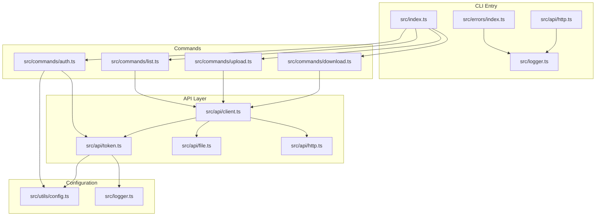
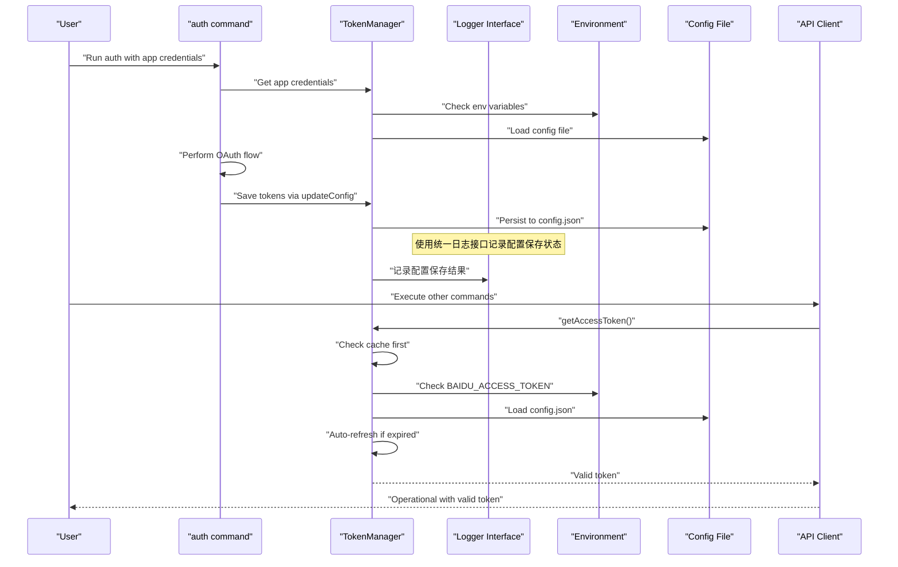
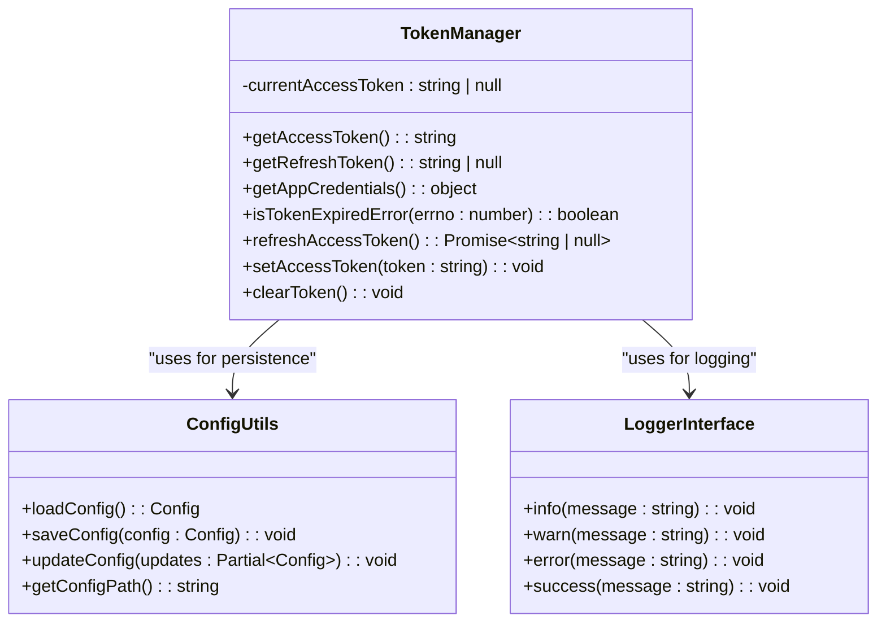
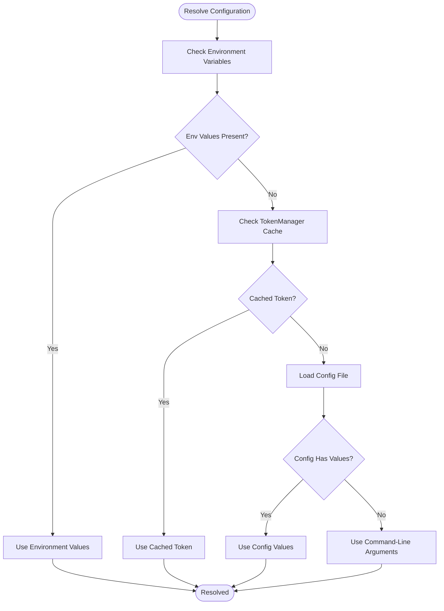
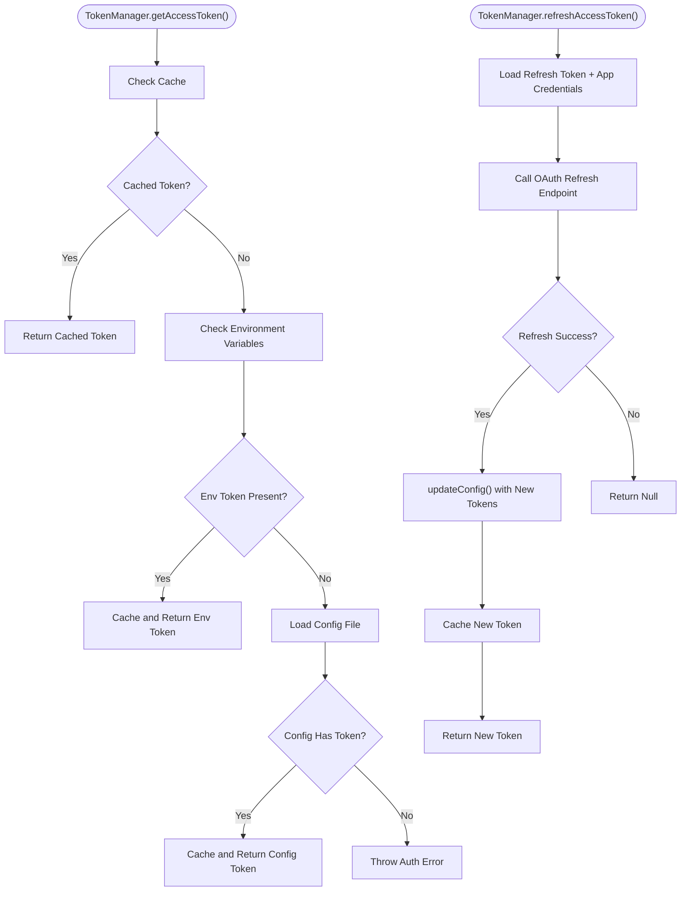
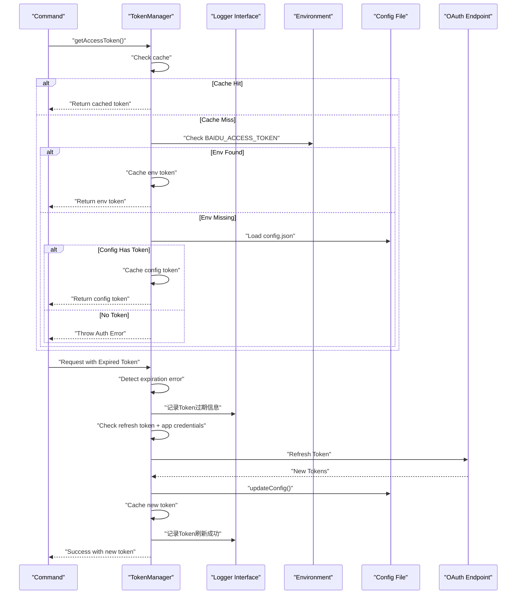
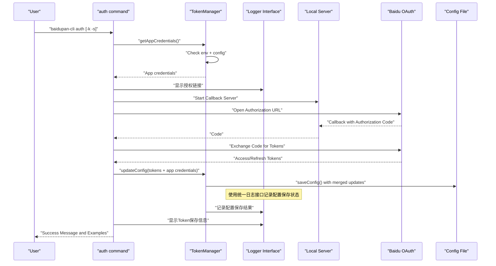
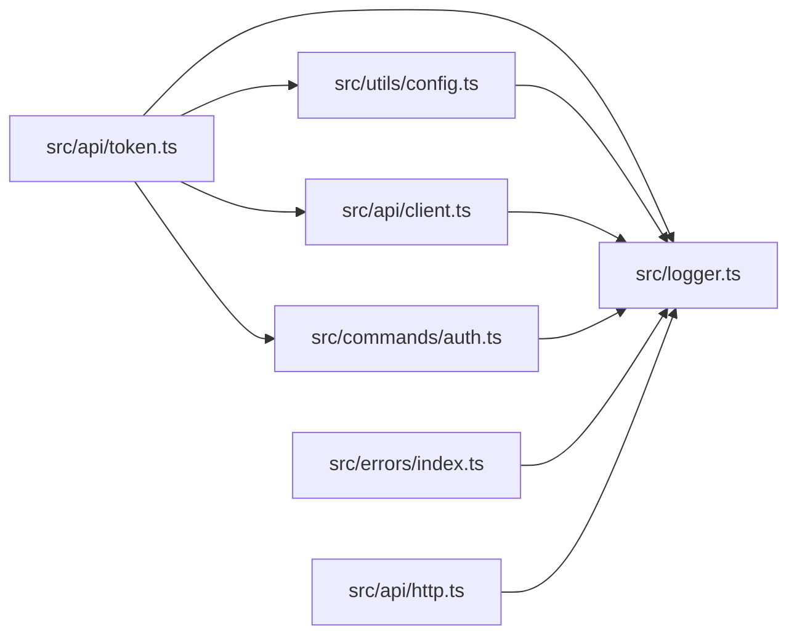
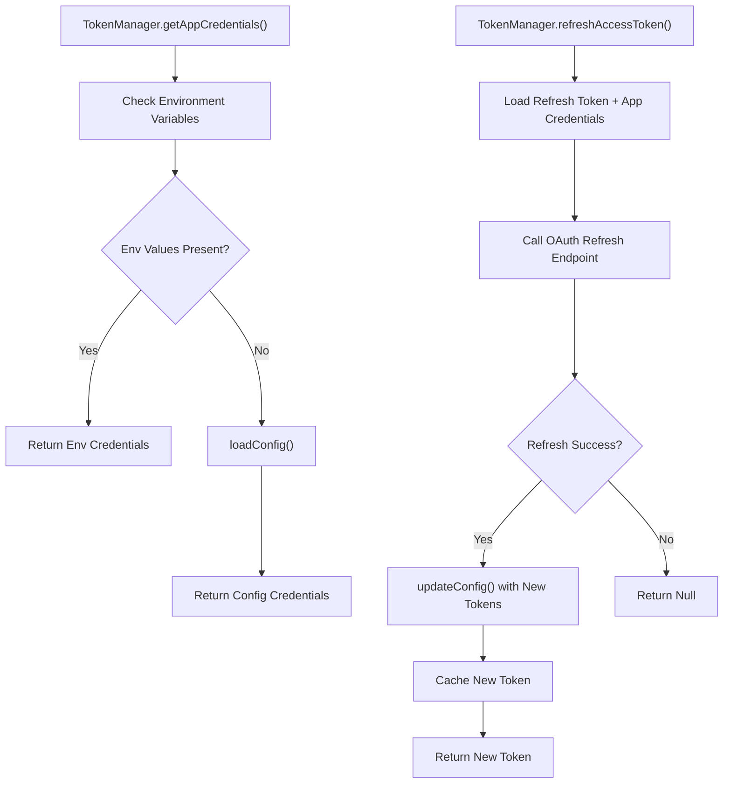

# Configuration Management

<cite>
**Referenced Files in This Document**
- [src/utils/config.ts](file://src/utils/config.ts)
- [src/api/token.ts](file://src/api/token.ts)
- [src/api/client.ts](file://src/api/client.ts)
- [src/commands/auth.ts](file://src/commands/auth.ts)
- [src/commands/download.ts](file://src/commands/download.ts)
- [src/commands/list.ts](file://src/commands/list.ts)
- [src/commands/upload.ts](file://src/commands/upload.ts)
- [src/api/file.ts](file://src/api/file.ts)
- [src/utils/index.ts](file://src/utils/index.ts)
- [src/index.ts](file://src/index.ts)
- [src/logger.ts](file://src/logger.ts)
- [src/api/http.ts](file://src/api/http.ts)
- [src/errors/index.ts](file://src/errors/index.ts)
- [README.md](file://README.md)
- [package.json](file://package.json)
- [example/README.md](file://example/README.md)
</cite>

## Update Summary
**Changes Made**
- Updated configuration error handling section to reflect unified logger interface usage
- Added documentation for Chinese error messages in configuration save failures
- Enhanced logging consistency and security considerations
- Updated troubleshooting section to address new error handling patterns

## Table of Contents
1. [Introduction](#introduction)
2. [Project Structure](#project-structure)
3. [Core Components](#core-components)
4. [Architecture Overview](#architecture-overview)
5. [Detailed Component Analysis](#detailed-component-analysis)
6. [Dependency Analysis](#dependency-analysis)
7. [Performance Considerations](#performance-considerations)
8. [Security Considerations](#security-considerations)
9. [Manual Configuration Editing](#manual-configuration-editing)
10. [Environment Variables](#environment-variables)
11. [Configuration Loading and Saving Mechanisms](#configuration-loading-and-saving-mechanisms)
12. [Validation Processes](#validation-processes)
13. [Configuration Migration and Compatibility](#configuration-migration-and-compatibility)
14. [Troubleshooting Guide](#troubleshooting-guide)
15. [Conclusion](#conclusion)

## Introduction
This document provides comprehensive documentation for the configuration management system of the Baidu Pan CLI tool. The system has evolved from a separate configuration and token management approach to an integrated TokenManager-based architecture. This new approach consolidates configuration handling into a unified token management system that provides seamless authentication, token lifecycle management, and automatic refresh capabilities.

The configuration management system now centers around the TokenManager class, which handles environment variable precedence, configuration file persistence, token caching, and automatic refresh operations. This integration eliminates the previous separation between configuration utilities and token management, creating a more streamlined and secure authentication experience.

**Updated** The system now uses a unified logger interface for all error handling, providing consistent logging patterns and improved security through centralized error management.

## Project Structure
The configuration management system has been restructured around the TokenManager class:
- Integrated token management: [src/api/token.ts](file://src/api/token.ts)
- Configuration persistence and retrieval: [src/utils/config.ts](file://src/utils/config.ts)
- Unified logger interface: [src/logger.ts](file://src/logger.ts)
- API client integration with TokenManager: [src/api/client.ts](file://src/api/client.ts)
- Authentication command with token management: [src/commands/auth.ts](file://src/commands/auth.ts)
- Commands consuming TokenManager for authentication: [src/commands/list.ts](file://src/commands/list.ts), [src/commands/upload.ts](file://src/commands/upload.ts), [src/commands/download.ts](file://src/commands/download.ts)
- Supporting utilities: [src/utils/index.ts](file://src/utils/index.ts)
- Entry point and command registration: [src/index.ts](file://src/index.ts)
- Error handling and logging: [src/errors/index.ts](file://src/errors/index.ts)
- HTTP client with retry logic: [src/api/http.ts](file://src/api/http.ts)
- Documentation and examples: [README.md](file://README.md), [example/README.md](file://example/README.md)

**Diagram sources**
- [src/index.ts](file://src/index.ts#L1-L49)
- [src/commands/auth.ts](file://src/commands/auth.ts#L1-L196)
- [src/commands/list.ts](file://src/commands/list.ts#L1-L77)
- [src/commands/upload.ts](file://src/commands/upload.ts#L1-L164)
- [src/commands/download.ts](file://src/commands/download.ts#L1-L191)
- [src/api/client.ts](file://src/api/client.ts#L1-L72)
- [src/api/file.ts](file://src/api/file.ts#L1-L201)
- [src/api/token.ts](file://src/api/token.ts#L1-L135)
- [src/utils/config.ts](file://src/utils/config.ts#L1-L63)
- [src/logger.ts](file://src/logger.ts#L1-L23)
- [src/errors/index.ts](file://src/errors/index.ts#L1-L23)
- [src/api/http.ts](file://src/api/http.ts#L1-L66)

**Section sources**
- [src/index.ts](file://src/index.ts#L1-L49)
- [src/api/token.ts](file://src/api/token.ts#L1-L135)
- [src/api/client.ts](file://src/api/client.ts#L1-L72)
- [src/commands/auth.ts](file://src/commands/auth.ts#L1-L196)

## Core Components
- **TokenManager class**: A singleton class that encapsulates all token management functionality including caching, environment variable precedence, configuration file integration, and automatic refresh. See [src/api/token.ts](file://src/api/token.ts#L15-L135).
- **Configuration schema**: The configuration object supports optional fields for access_token, refresh_token, app_key, secret_key, and expires_at (timestamp). See [src/utils/config.ts](file://src/utils/config.ts#L9-L15).
- **Unified logger interface**: Centralized logging system using Consola for consistent error handling and formatted output. See [src/logger.ts](file://src/logger.ts#L1-L23).
- **Integrated configuration persistence**: Functions to load, save, and update configuration are provided, now using the unified logger for error reporting. See [src/utils/config.ts](file://src/utils/config.ts#L17-L63).
- **Authentication command**: Now uses TokenManager for credential resolution and token persistence with enhanced error logging. See [src/commands/auth.ts](file://src/commands/auth.ts#L38-L86) and [src/commands/auth.ts](file://src/commands/auth.ts#L166-L196).
- **API client integration**: The API client now delegates all token management to TokenManager, providing transparent authentication for all operations. See [src/api/client.ts](file://src/api/client.ts#L10-L60).

**Updated** The system now uses a unified TokenManager class with centralized logging for all error handling, replacing direct console.error calls with the logger interface.

**Section sources**
- [src/api/token.ts](file://src/api/token.ts#L15-L135)
- [src/utils/config.ts](file://src/utils/config.ts#L9-L63)
- [src/logger.ts](file://src/logger.ts#L1-L23)
- [src/commands/auth.ts](file://src/commands/auth.ts#L38-L86)
- [src/commands/auth.ts](file://src/commands/auth.ts#L166-L196)
- [src/api/client.ts](file://src/api/client.ts#L10-L60)

## Architecture Overview
The configuration system now follows an integrated TokenManager architecture with unified logging:
- **TokenManager singleton**: Centralizes all token-related operations including caching, environment variable precedence, and configuration file integration.
- **Unified logger interface**: Provides consistent logging across all components using the centralized logger system.
- **Environment variables**: Provide the highest precedence for sensitive values, directly accessed by TokenManager.
- **Configuration file**: Stores persistent tokens and app credentials, managed through TokenManager methods with enhanced error reporting.
- **Command-line parameters**: Used during authentication to supply app credentials, processed by TokenManager.
- **Automatic refresh**: Seamless token refresh and persistence handled entirely within TokenManager with improved error logging.

**Diagram sources**
- [src/commands/auth.ts](file://src/commands/auth.ts#L38-L86)
- [src/commands/auth.ts](file://src/commands/auth.ts#L166-L196)
- [src/api/token.ts](file://src/api/token.ts#L22-L44)
- [src/api/token.ts](file://src/api/token.ts#L76-L116)
- [src/utils/config.ts](file://src/utils/config.ts#L36-L46)
- [src/logger.ts](file://src/logger.ts#L1-L23)

## Detailed Component Analysis

### TokenManager Class
The TokenManager class serves as the central hub for all token-related operations:
- **Caching**: Maintains an in-memory cache of the current access token to minimize file I/O operations.
- **Environment precedence**: Checks environment variables first (BAIDU_ACCESS_TOKEN, BAIDU_REFRESH_TOKEN, BAIDU_APP_KEY, BAIDU_SECRET_KEY).
- **Configuration integration**: Falls back to configuration file loading when environment variables are not available.
- **Automatic refresh**: Handles token expiration detection and automatic refresh using refresh tokens.
- **Persistence**: Automatically saves refreshed tokens back to the configuration file with enhanced error logging.
- **Logging integration**: Uses the unified logger interface for all operational messages and error reporting.

**Diagram sources**
- [src/api/token.ts](file://src/api/token.ts#L15-L135)
- [src/utils/config.ts](file://src/utils/config.ts#L17-L63)
- [src/logger.ts](file://src/logger.ts#L1-L23)

**Section sources**
- [src/api/token.ts](file://src/api/token.ts#L15-L135)

### Configuration Schema
The configuration object includes the following fields:
- access_token: Optional string representing the current access token.
- refresh_token: Optional string representing the refresh token used for renewal.
- app_key: Optional string representing the Baidu Pan App Key.
- secret_key: Optional string representing the Baidu Pan Secret Key.
- expires_at: Optional number representing a timestamp when the access token expires.

These fields are persisted to a JSON file and consumed by the TokenManager for authentication and authorization.

**Section sources**
- [src/utils/config.ts](file://src/utils/config.ts#L9-L15)

### Configuration File Locations
- Windows: %USERPROFILE%\.baidupan-cli\config.json
- macOS/Linux: ~/.baidupan-cli/config.json

The configuration directory and file are created with restrictive permissions to protect sensitive data.

**Section sources**
- [src/utils/config.ts](file://src/utils/config.ts#L6-L7)
- [README.md](file://README.md#L186-L187)

### Hierarchical Configuration Precedence
The system resolves configuration values in the following order:
1. **Environment variables** (highest precedence): BAIDU_ACCESS_TOKEN, BAIDU_REFRESH_TOKEN, BAIDU_APP_KEY, BAIDU_SECRET_KEY
2. **TokenManager cache**: In-memory cached tokens for performance
3. **Local configuration file**: Stored tokens and app credentials
4. **Command-line parameters** (used during authentication)

This precedence ensures that environment variables override stored configuration, while command-line parameters can be used to supply initial app credentials during authentication.

**Diagram sources**
- [src/api/token.ts](file://src/api/token.ts#L22-L44)
- [src/commands/auth.ts](file://src/commands/auth.ts#L38-L56)
- [src/utils/config.ts](file://src/utils/config.ts#L20-L31)

**Section sources**
- [src/api/token.ts](file://src/api/token.ts#L22-L44)
- [src/commands/auth.ts](file://src/commands/auth.ts#L38-L56)

### Configuration Loading and Saving Mechanisms
- **Loading**: The TokenManager checks environment variables first, then falls back to configuration file loading through the Config utility functions.
- **Saving**: The TokenManager uses updateConfig() to merge and persist token updates to the configuration file with enhanced error logging.
- **Updating**: The TokenManager automatically handles token refresh and persistence, eliminating manual configuration updates.
- **Error handling**: Configuration save failures are logged using the unified logger interface with Chinese error messages including '配置保存失败'.

**Updated** Configuration save failures now use the unified logger interface with Chinese error messages for improved consistency and security.

**Diagram sources**
- [src/api/token.ts](file://src/api/token.ts#L22-L44)
- [src/api/token.ts](file://src/api/token.ts#L76-L116)
- [src/utils/config.ts](file://src/utils/config.ts#L51-L55)

**Section sources**
- [src/api/token.ts](file://src/api/token.ts#L22-L44)
- [src/api/token.ts](file://src/api/token.ts#L76-L116)
- [src/utils/config.ts](file://src/utils/config.ts#L51-L55)

### Token Resolution and Automatic Refresh
The TokenManager resolves tokens with the following logic:
- **Cache check**: Returns immediately if a token is cached in memory.
- **Environment precedence**: Checks environment variables for tokens first.
- **Configuration fallback**: Loads tokens from the configuration file if environment variables are not found.
- **Error handling**: Throws an authentication error if no tokens are available.
- **Automatic refresh**: Detects token expiration errors and attempts to refresh using refresh tokens and app credentials, then retries the request and persists refreshed tokens with enhanced logging.

**Updated** All token refresh operations now use the unified logger interface for consistent error reporting and user feedback.

**Diagram sources**
- [src/api/token.ts](file://src/api/token.ts#L22-L44)
- [src/api/token.ts](file://src/api/token.ts#L76-L116)
- [src/utils/config.ts](file://src/utils/config.ts#L51-L55)
- [src/logger.ts](file://src/logger.ts#L1-L23)

**Section sources**
- [src/api/token.ts](file://src/api/token.ts#L22-L44)
- [src/api/token.ts](file://src/api/token.ts#L76-L116)
- [src/utils/config.ts](file://src/utils/config.ts#L51-L55)
- [src/commands/auth.ts](file://src/commands/auth.ts#L166-L196)

### Authentication Command and Token Management
The authentication command now integrates seamlessly with TokenManager:
- **Credential resolution**: Uses TokenManager.getAppCredentials() to resolve app credentials from environment variables or configuration.
- **OAuth flow**: Performs the standard OAuth authorization code flow.
- **Token persistence**: Uses TokenManager.updateConfig() to save tokens and app credentials to the configuration file with enhanced error logging.
- **Cross-platform deployment**: Provides environment variable export examples for secure cross-machine usage.
- **Logging integration**: Uses the unified logger interface for all user-facing messages and progress updates.

**Updated** The authentication command now uses the centralized logger interface for all user communication, providing consistent formatting and internationalization support.

**Diagram sources**
- [src/commands/auth.ts](file://src/commands/auth.ts#L38-L86)
- [src/commands/auth.ts](file://src/commands/auth.ts#L166-L196)
- [src/api/token.ts](file://src/api/token.ts#L56-L62)
- [src/utils/config.ts](file://src/utils/config.ts#L51-L55)
- [src/logger.ts](file://src/logger.ts#L1-L23)

**Section sources**
- [src/commands/auth.ts](file://src/commands/auth.ts#L38-L86)
- [src/commands/auth.ts](file://src/commands/auth.ts#L166-L196)
- [src/api/token.ts](file://src/api/token.ts#L56-L62)
- [src/utils/config.ts](file://src/utils/config.ts#L51-L55)

### Commands That Consume TokenManager
- **List command**: Creates an API client that automatically uses TokenManager for token resolution and does not directly manage configuration.
- **Upload command**: Creates an API client and handles chunked uploads using TokenManager-provided tokens.
- **Download command**: Creates an API client, retrieves file metadata, and downloads using TokenManager-provided tokens.

These commands rely on the TokenManager for all authentication operations and do not directly manage configuration.

**Section sources**
- [src/commands/list.ts](file://src/commands/list.ts#L37-L48)
- [src/commands/upload.ts](file://src/commands/upload.ts#L43-L49)
- [src/commands/download.ts](file://src/commands/download.ts#L34-L39)
- [src/api/client.ts](file://src/api/client.ts#L10-L60)

## Dependency Analysis
The configuration system now exhibits a unified TokenManager-centric architecture with centralized logging:
- **TokenManager**: Centralizes all token management operations and depends on configuration utilities for persistence and logger for error reporting.
- **API client**: Delegates all token operations to TokenManager, providing transparent authentication.
- **Commands**: Depend on TokenManager through the API client for authenticated operations.
- **Configuration utilities**: Used exclusively by TokenManager for persistence operations with unified error logging.
- **Logger interface**: Provides consistent logging across all components with configurable verbosity levels.

**Updated** The system now includes centralized error handling through the unified logger interface, replacing direct console.error calls with consistent logging patterns.

**Diagram sources**
- [src/api/token.ts](file://src/api/token.ts#L1-L135)
- [src/utils/config.ts](file://src/utils/config.ts#L1-L63)
- [src/api/client.ts](file://src/api/client.ts#L1-L72)
- [src/commands/auth.ts](file://src/commands/auth.ts#L1-L196)
- [src/logger.ts](file://src/logger.ts#L1-L23)
- [src/errors/index.ts](file://src/errors/index.ts#L1-L23)
- [src/api/http.ts](file://src/api/http.ts#L1-L66)

**Section sources**
- [src/api/token.ts](file://src/api/token.ts#L1-L135)
- [src/utils/config.ts](file://src/utils/config.ts#L1-L63)
- [src/api/client.ts](file://src/api/client.ts#L1-L72)
- [src/commands/auth.ts](file://src/commands/auth.ts#L1-L196)
- [src/logger.ts](file://src/logger.ts#L1-L23)
- [src/errors/index.ts](file://src/errors/index.ts#L1-L23)
- [src/api/http.ts](file://src/api/http.ts#L1-L66)

## Performance Considerations
- **Token caching**: The TokenManager caches resolved access tokens in memory to avoid repeated file reads and environment variable checks.
- **Reduced disk I/O**: Configuration is read on demand and updated only when tokens change (e.g., after refresh), minimizing filesystem operations.
- **Efficient file operations**: Configuration directory and file are created with restrictive permissions to prevent unnecessary system calls.
- **Singleton pattern**: The TokenManager singleton eliminates redundant instances and shared state management overhead.
- **Centralized logging**: The unified logger interface reduces overhead by providing a single point for log formatting and output management.

## Security Considerations
- **File permissions**: The configuration directory is created with restrictive permissions (0o700), and the configuration file is written with restrictive permissions (0o600) to limit access.
- **Environment variables**: Sensitive values can be supplied via environment variables, avoiding exposure in command history or logs.
- **Token lifecycle**: Automatic refresh and persistence reduce manual handling of tokens, minimizing risk exposure.
- **Cross-machine usage**: The authentication command prints environment variable export examples for secure cross-machine deployment.
- **Integrated security**: TokenManager consolidates security logic in one place, reducing the attack surface and ensuring consistent security practices.
- **Unified error handling**: Centralized logging prevents inconsistent error output and potential information leakage through direct console calls.

**Updated** Enhanced security through unified error handling prevents inconsistent error output and provides better control over sensitive information disclosure.

**Section sources**
- [src/utils/config.ts](file://src/utils/config.ts#L38-L41)
- [src/commands/auth.ts](file://src/commands/auth.ts#L188-L194)
- [src/logger.ts](file://src/logger.ts#L1-L23)

## Manual Configuration Editing
Manual editing of the configuration file is supported. The file location varies by operating system:
- Windows: %USERPROFILE%\.baidupan-cli\config.json
- macOS/Linux: ~/.baidupan-cli/config.json

The configuration file contains JSON with optional fields for tokens and app credentials. After editing, subsequent commands will use the updated values according to the precedence rules, with TokenManager checking the cache first before falling back to configuration file values.

**Section sources**
- [README.md](file://README.md#L186-L187)
- [src/utils/config.ts](file://src/utils/config.ts#L6-L7)
- [src/utils/config.ts](file://src/utils/config.ts#L9-L15)

## Environment Variables
The system recognizes the following environment variables:
- BAIDU_APP_KEY: Baidu Pan App Key
- BAIDU_SECRET_KEY: Baidu Pan Secret Key
- BAIDU_ACCESS_TOKEN: Access token for authentication
- BAIDU_REFRESH_TOKEN: Refresh token for automatic renewal

Environment variables take precedence over configuration file values and are used by the TokenManager for all token operations.

**Section sources**
- [src/api/token.ts](file://src/api/token.ts#L28-L50)
- [src/commands/auth.ts](file://src/commands/auth.ts#L39-L40)
- [README.md](file://README.md#L179-L180)

## Configuration Loading and Saving Mechanisms
- **Loading**: The TokenManager checks for environment variables first, then falls back to configuration file loading through loadConfig().
- **Saving**: The TokenManager uses updateConfig() to merge provided updates into the existing configuration and persists the result with enhanced error logging.
- **Updating**: The TokenManager automatically handles token refresh and persistence, eliminating manual configuration updates.
- **Error handling**: Configuration save failures are logged using the unified logger interface with Chinese error messages including '配置保存失败'.

**Updated** Configuration save failures now use the unified logger interface with Chinese error messages for improved consistency and security.

**Diagram sources**
- [src/api/token.ts](file://src/api/token.ts#L56-L62)
- [src/api/token.ts](file://src/api/token.ts#L76-L116)
- [src/utils/config.ts](file://src/utils/config.ts#L17-L63)

**Section sources**
- [src/api/token.ts](file://src/api/token.ts#L56-L62)
- [src/api/token.ts](file://src/api/token.ts#L76-L116)
- [src/utils/config.ts](file://src/utils/config.ts#L17-L63)

## Validation Processes
- **Token presence**: The TokenManager throws an authentication error if no access token is found through environment variables, configuration, or cache.
- **Token expiration**: Requests that fail with token-related errors trigger an automatic refresh attempt through TokenManager. If successful, the request is retried with the new token; otherwise, the user is prompted to re-authenticate.
- **Parameter validation**: The authentication command validates the presence of app credentials and prints usage guidance if missing.
- **Error handling**: TokenManager.isTokenExpiredError() detects specific error codes (-6 for invalid token, 111 for expired token) to trigger automatic refresh.
- **Logging consistency**: All error conditions are handled through the unified logger interface for consistent user experience.

**Updated** All validation errors now use the unified logger interface for consistent error reporting and user feedback.

**Section sources**
- [src/api/token.ts](file://src/api/token.ts#L41-L44)
- [src/api/token.ts](file://src/api/token.ts#L67-L71)
- [src/api/token.ts](file://src/api/token.ts#L108-L116)
- [src/commands/auth.ts](file://src/commands/auth.ts#L44-L56)

## Configuration Migration and Compatibility
- **Version alignment**: The project version is defined in the package metadata. The TokenManager approach maintains backward compatibility with existing configuration files.
- **Backward compatibility**: The configuration file format remains a simple JSON object with optional fields. The TokenManager seamlessly handles existing configurations.
- **Migration strategy**: When introducing new fields, ensure they are optional and gracefully handled by the TokenManager. Maintain the existing precedence rules to preserve user expectations.
- **Seamless transition**: The TokenManager automatically migrates from the old separate configuration and token management approach to the integrated system.
- **Logging migration**: Configuration save failures now use the unified logger interface with Chinese error messages, providing better internationalization support.

**Updated** Configuration migration now includes logging improvements with unified error handling and Chinese error messages.

**Section sources**
- [package.json](file://package.json#L4-L4)
- [src/utils/config.ts](file://src/utils/config.ts#L9-L15)
- [src/api/token.ts](file://src/api/token.ts#L15-L135)

## Troubleshooting Guide
Common configuration-related issues and resolutions:
- **Missing access token**: The TokenManager throws an authentication error with guidance to run the authentication command. Check environment variables and configuration file.
- **Token expiration**: The TokenManager automatically refreshes tokens when encountering expiration errors. If refresh fails, re-authenticate using the auth command.
- **Permission issues**: Ensure the configuration directory and file have restrictive permissions (0o700 for directory, 0o600 for file). On Unix-like systems, verify ownership and permissions.
- **Environment variable conflicts**: Verify that environment variables are exported correctly and take precedence over configuration file values.
- **Cross-platform paths**: Confirm the correct configuration file path for your operating system.
- **Token cache issues**: Use TokenManager.clearToken() to clear cached tokens if experiencing authentication problems.
- **Configuration corruption**: The TokenManager gracefully handles configuration file parsing errors by returning empty configuration and allowing re-authentication.
- **Configuration save failures**: Configuration save failures are now logged using the unified logger interface with Chinese error messages including '配置保存失败'. Check file permissions and disk space if encountering persistent save issues.

**Updated** Added troubleshooting guidance for configuration save failures using the unified logger interface with Chinese error messages.

**Section sources**
- [src/api/token.ts](file://src/api/token.ts#L41-L44)
- [src/api/token.ts](file://src/api/token.ts#L108-L116)
- [src/utils/config.ts](file://src/utils/config.ts#L43-L45)
- [README.md](file://README.md#L237-L244)

## Conclusion
The configuration management system has evolved into a robust, integrated TokenManager-based architecture that provides seamless authentication, token lifecycle management, and automatic refresh capabilities. By consolidating configuration and token management into a unified TokenManager class with centralized logging, the system achieves better security, performance, and maintainability.

**Updated** The recent enhancement of using a unified logger interface for all error handling provides improved consistency, security, and user experience through standardized logging patterns and Chinese error messages including '配置保存失败'.

The documented schema, loading and saving mechanisms, and troubleshooting steps enable reliable operation across platforms and use cases, with the TokenManager serving as the central hub for all authentication operations and the unified logger interface ensuring consistent error reporting and user communication.