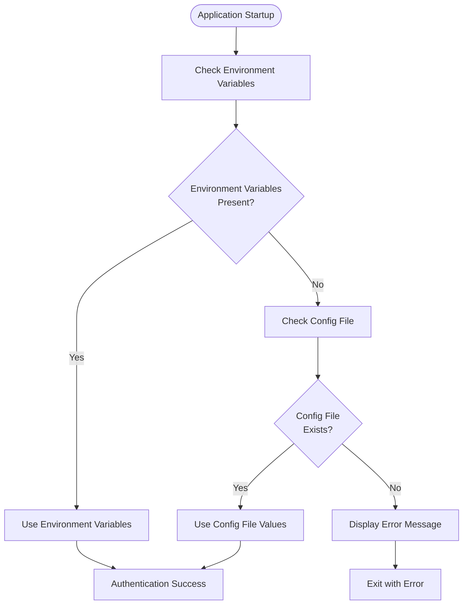
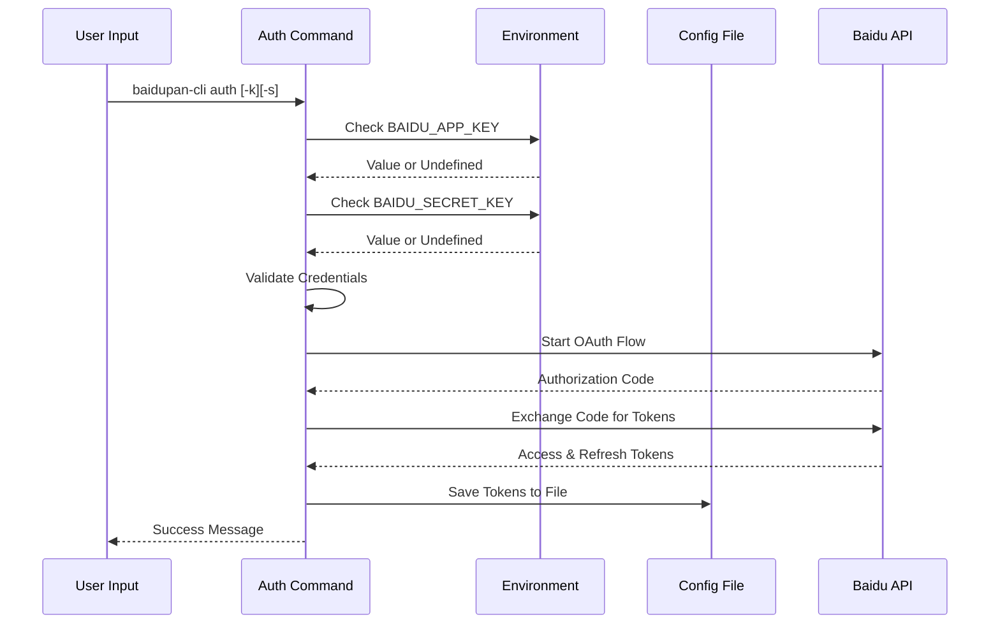
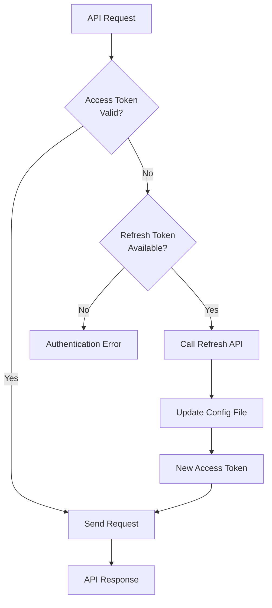

# Environment Variables

<cite>
**Referenced Files in This Document**
- [README.md](file://README.md)
- [src/api/client.ts](file://src/api/client.ts)
- [src/commands/auth.ts](file://src/commands/auth.ts)
- [src/utils/config.ts](file://src/utils/config.ts)
</cite>

## Table of Contents
1. [Introduction](#introduction)
2. [Supported Environment Variables](#supported-environment-variables)
3. [Variable Naming Conventions](#variable-naming-conventions)
4. [Data Types and Validation](#data-types-and-validation)
5. [Precedence and Loading Order](#precedence-and-loading-order)
6. [Startup Processing Flow](#startup-processing-flow)
7. [Practical Setup Examples](#practical-setup-examples)
8. [Security Considerations](#security-considerations)
9. [Troubleshooting Guide](#troubleshooting-guide)
10. [Conclusion](#conclusion)

## Introduction

This document provides comprehensive documentation for the environment variable configuration system used by the Baidu Pan CLI tool. The system supports four primary environment variables that enable seamless authentication and operation without requiring manual credential entry for each command execution.

The environment variable system follows a strict precedence model where environment variables take priority over file-based configuration, ensuring flexibility for different deployment scenarios while maintaining backward compatibility with stored configuration files.

## Supported Environment Variables

The Baidu Pan CLI tool recognizes four specific environment variables that control authentication and authorization behavior:

### Primary Authentication Variables

| Variable Name | Purpose | Required For | Expected Value |
|---------------|---------|--------------|----------------|
| `BAIDU_APP_KEY` | Application identifier for Baidu Pan API | Initial authentication | String (API Key) |
| `BAIDU_SECRET_KEY` | Application secret for API authentication | Initial authentication | String (API Secret) |
| `BAIDU_ACCESS_TOKEN` | User access token for API authorization | Ongoing operations | String (OAuth Token) |
| `BAIDU_REFRESH_TOKEN` | Token used to obtain new access tokens | Automatic token refresh | String (OAuth Refresh Token) |

### Variable Usage Scenarios

- **Initial Setup**: `BAIDU_APP_KEY` and `BAIDU_SECRET_KEY` are required for the first-time authentication process
- **Ongoing Operations**: `BAIDU_ACCESS_TOKEN` enables immediate API operations without re-authentication
- **Automatic Renewal**: `BAIDU_REFRESH_TOKEN` enables transparent token renewal when access tokens expire
- **Cross-Platform Deployment**: Environment variables enable deployment across different systems without local configuration files

**Section sources**
- [README.md](file://README.md#L118-L127)
- [src/api/client.ts](file://src/api/client.ts#L11-L55)
- [src/commands/auth.ts](file://src/commands/auth.ts#L46-L63)

## Variable Naming Conventions

### Case Sensitivity
All environment variables are case-sensitive and must be specified exactly as documented:
- ✅ Correct: `BAIDU_APP_KEY`, `BAIDU_SECRET_KEY`, `BAIDU_ACCESS_TOKEN`, `BAIDU_REFRESH_TOKEN`
- ❌ Incorrect: `baidu_app_key`, `BaIdU_App_KeY`, `BAIDUAPPKEY`

### Prefix Standardization
The system uses a consistent naming convention with the `BAIDU_` prefix indicating:
- Baidu Pan service identification
- Clear separation from other environment variables
- Consistent behavior across different platforms and deployment targets

### Platform Compatibility
Environment variables follow standard platform conventions:
- **Windows**: Case-insensitive variable names but case-sensitive values
- **Linux/macOS**: Case-sensitive variable names and values
- **Container Environments**: Standard Docker/Kubernetes environment variable semantics

**Section sources**
- [src/api/client.ts](file://src/api/client.ts#L20-L54)
- [src/commands/auth.ts](file://src/commands/auth.ts#L46-L48)

## Data Types and Validation

### Expected Data Types

| Variable | Type | Description | Validation |
|----------|------|-------------|------------|
| `BAIDU_APP_KEY` | String | API application identifier | Non-empty string validation |
| `BAIDU_SECRET_KEY` | String | API application secret | Non-empty string validation |
| `BAIDU_ACCESS_TOKEN` | String | OAuth access token | Non-empty string validation |
| `BAIDU_REFRESH_TOKEN` | String | OAuth refresh token | Non-empty string validation |

### Validation Requirements

#### Runtime Validation
- All variables are validated as non-empty strings
- Missing variables trigger appropriate error messages
- Empty string values are treated as missing variables

#### Authentication Validation
- `BAIDU_APP_KEY` and `BAIDU_SECRET_KEY` are required for initial authentication
- `BAIDU_ACCESS_TOKEN` is required for API operations
- `BAIDU_REFRESH_TOKEN` enables automatic token renewal when present

#### Type Safety
- Variables are processed as strings regardless of their original format
- Numeric values (like expiration timestamps) are handled as strings
- No automatic type conversion occurs

**Section sources**
- [src/api/client.ts](file://src/api/client.ts#L15-L37)
- [src/commands/auth.ts](file://src/commands/auth.ts#L51-L63)

## Precedence and Loading Order

### Variable Precedence Model

The system implements a strict precedence order that determines which credentials take priority:



**Diagram sources**
- [src/api/client.ts](file://src/api/client.ts#L15-L37)
- [src/api/client.ts](file://src/api/client.ts#L42-L54)

### Detailed Precedence Rules

#### Access Token Resolution
1. **Primary**: `BAIDU_ACCESS_TOKEN` environment variable
2. **Secondary**: `access_token` from configuration file
3. **Fallback**: Error condition if neither exists

#### Refresh Token Resolution
1. **Primary**: `BAIDU_REFRESH_TOKEN` environment variable
2. **Secondary**: `refresh_token` from configuration file
3. **Fallback**: Null (no automatic refresh capability)

#### Application Credentials Resolution
1. **Primary**: `BAIDU_APP_KEY` and `BAIDU_SECRET_KEY` environment variables
2. **Secondary**: `app_key` and `secret_key` from configuration file
3. **Fallback**: Error condition if neither exists

**Section sources**
- [src/api/client.ts](file://src/api/client.ts#L11-L55)

## Startup Processing Flow

### Authentication Command Processing



**Diagram sources**
- [src/commands/auth.ts](file://src/commands/auth.ts#L46-L90)
- [src/api/client.ts](file://src/api/client.ts#L112-L161)

### Token Refresh Mechanism



**Diagram sources**
- [src/api/client.ts](file://src/api/client.ts#L63-L104)
- [src/api/client.ts](file://src/api/client.ts#L134-L149)

**Section sources**
- [src/commands/auth.ts](file://src/commands/auth.ts#L46-L90)
- [src/api/client.ts](file://src/api/client.ts#L112-L161)

## Practical Setup Examples

### Windows Command Prompt (cmd)

```batch
REM Set all required environment variables
set BAIDU_APP_KEY=your_app_key_here
set BAIDU_SECRET_KEY=your_secret_key_here
set BAIDU_ACCESS_TOKEN=your_access_token_here
set BAIDU_REFRESH_TOKEN=your_refresh_token_here

REM Verify variables are set
echo %BAIDU_APP_KEY%
echo %BAIDU_SECRET_KEY%

REM Run CLI commands
baidupan-cli list
baidupan-cli upload ./file.txt /
```

### Windows PowerShell

```powershell
# Set environment variables for current session
$env:BAIDU_APP_KEY="your_app_key_here"
$env:BAIDU_SECRET_KEY="your_secret_key_here"
$env:BAIDU_ACCESS_TOKEN="your_access_token_here"
$env:BAIDU_REFRESH_TOKEN="your_refresh_token_here"

# Verify variables
Get-ChildItem Env:BAIDU_*

# Run commands
baidupan-cli list
```

### Linux/macOS Shell

```bash
# Temporary session variables
export BAIDU_APP_KEY="your_app_key_here"
export BAIDU_SECRET_KEY="your_secret_key_here"
export BAIDU_ACCESS_TOKEN="your_access_token_here"
export BAIDU_REFRESH_TOKEN="your_refresh_token_here"

# Permanent system-wide (add to ~/.bashrc or ~/.profile)
echo 'export BAIDU_APP_KEY="your_app_key_here"' >> ~/.bashrc
echo 'export BAIDU_SECRET_KEY="your_secret_key_here"' >> ~/.bashrc
echo 'export BAIDU_ACCESS_TOKEN="your_access_token_here"' >> ~/.bashrc
echo 'export BAIDU_REFRESH_TOKEN="your_refresh_token_here"' >> ~/.bashrc

# Reload shell configuration
source ~/.bashrc

# Verify setup
env | grep BAIDU_
```

### Docker Container Environment

```dockerfile
# Dockerfile example
FROM node:18-alpine

# Copy application
COPY . /app
WORKDIR /app

# Install dependencies
RUN npm ci

# Set environment variables
ENV BAIDU_APP_KEY=your_app_key_here
ENV BAIDU_SECRET_KEY=your_secret_key_here
ENV BAIDU_ACCESS_TOKEN=your_access_token_here
ENV BAIDU_REFRESH_TOKEN=your_refresh_token_here

# Run application
CMD ["node", "dist/index.mjs"]
```

```yaml
# docker-compose.yml example
version: '3.8'
services:
  baidupan-cli:
    image: your-image:latest
    environment:
      - BAIDU_APP_KEY=${BAIDU_APP_KEY}
      - BAIDU_SECRET_KEY=${BAIDU_SECRET_KEY}
      - BAIDU_ACCESS_TOKEN=${BAIDU_ACCESS_TOKEN}
      - BAIDU_REFRESH_TOKEN=${BAIDU_REFRESH_TOKEN}
    volumes:
      - ~/.baidupan-cli:/root/.baidupan-cli:rw
```

### Kubernetes Deployment

```yaml
apiVersion: v1
kind: Pod
metadata:
  name: baidupan-cli
spec:
  containers:
  - name: cli
    image: your-image:latest
    env:
    - name: BAIDU_APP_KEY
      valueFrom:
        secretKeyRef:
          name: baidupan-secrets
          key: app-key
    - name: BAIDU_SECRET_KEY
      valueFrom:
        secretKeyRef:
          name: baidupan-secrets
          key: secret-key
    - name: BAIDU_ACCESS_TOKEN
      valueFrom:
        secretKeyRef:
          name: baidupan-secrets
          key: access-token
    - name: BAIDU_REFRESH_TOKEN
      valueFrom:
        secretKeyRef:
          name: baidupan-secrets
          key: refresh-token
```

### CI/CD Pipeline Examples

#### GitHub Actions

```yaml
name: Baidu Pan Backup
on:
  schedule:
    - cron: '0 * * * *'

jobs:
  backup:
    runs-on: ubuntu-latest
    steps:
    - uses: actions/checkout@v4
    
    - name: Setup Node.js
      uses: actions/setup-node@v4
      with:
        node-version: '18'
        
    - name: Install Dependencies
      run: npm ci
      
    - name: Configure Environment
      run: |
        export BAIDU_APP_KEY="${{ secrets.BAIDU_APP_KEY }}"
        export BAIDU_SECRET_KEY="${{ secrets.BAIDU_SECRET_KEY }}"
        export BAIDU_ACCESS_TOKEN="${{ secrets.BAIDU_ACCESS_TOKEN }}"
        export BAIDU_REFRESH_TOKEN="${{ secrets.BAIDU_REFRESH_TOKEN }}"
        
    - name: Run Backup
      run: |
        npm run backup
```

#### GitLab CI/CD

```yaml
variables:
  BAIDU_APP_KEY: $BAIDU_APP_KEY
  BAIDU_SECRET_KEY: $BAIDU_SECRET_KEY
  BAIDU_ACCESS_TOKEN: $BAIDU_ACCESS_TOKEN
  BAIDU_REFRESH_TOKEN: $BAIDU_REFRESH_TOKEN

backup_job:
  stage: backup
  image: node:18-alpine
  script:
    - npm ci
    - npm run backup
  only:
    - schedules
```

**Section sources**
- [README.md](file://README.md#L118-L127)
- [src/commands/auth.ts](file://src/commands/auth.ts#L247-L253)

## Security Considerations

### Sensitive Data Protection

#### Environment Variable Security
- **Scope Limitation**: Environment variables are process-scoped and not inherited by child processes
- **Memory Exposure**: Variables remain in memory until process termination
- **Process Inspection**: Other processes on the same system may potentially inspect environment variables

#### Best Practices for Production

##### 1. Least Privilege Principle
- Grant minimal required permissions for API keys
- Use separate keys for different environments (development, staging, production)
- Restrict access to environment variable storage systems

##### 2. Secure Storage Solutions
- **Docker Secrets**: Use Docker Swarm secrets for containerized deployments
- **Kubernetes Secrets**: Store sensitive data in Kubernetes Secret resources
- **CI/CD Secret Management**: Utilize platform-specific secret management (GitHub Secrets, GitLab CI/CD Variables)
- **Vault Systems**: Consider enterprise secret management solutions

##### 3. Environment Isolation
- **Separate Environments**: Maintain distinct environment configurations for different deployment stages
- **Access Control**: Limit who can modify environment variables
- **Audit Logging**: Monitor access to sensitive environment variables

#### Configuration File Security

The system automatically creates secure configuration files with restricted permissions:

- **Directory Permissions**: `0700` (owner read/write/execute only)
- **File Permissions**: `0600` (owner read/write only)
- **Location**: User home directory under `.baidupan-cli/config.json`

#### Token Management

##### Automatic Refresh Security
- **Transparent Operation**: Token refresh happens without exposing refresh tokens to external processes
- **Secure Storage**: New tokens are immediately saved to encrypted configuration files
- **Error Handling**: Failed refresh attempts trigger appropriate error messages without exposing sensitive data

##### Expiration Handling
- **Graceful Degradation**: Expired tokens trigger automatic refresh attempts
- **Error Recovery**: Failed refresh attempts require manual re-authentication
- **Logging**: Minimal information is logged to prevent sensitive data exposure

**Section sources**
- [src/utils/config.ts](file://src/utils/config.ts#L35-L44)
- [src/api/client.ts](file://src/api/client.ts#L63-L104)

## Troubleshooting Guide

### Common Environment Variable Issues

#### Issue: Variables Not Being Recognized
**Symptoms**: Commands fail with authentication errors despite setting variables
**Solutions**:
1. Verify variable names match exactly: `BAIDU_APP_KEY`, `BAIDU_SECRET_KEY`, `BAIDU_ACCESS_TOKEN`, `BAIDU_REFRESH_TOKEN`
2. Check for typos in variable names
3. Confirm variables are exported (not just set) in your shell
4. Test variable accessibility: `echo $BAIDU_APP_KEY`

#### Issue: Case Sensitivity Problems
**Symptoms**: Variables work locally but fail in CI/CD environments
**Solutions**:
1. Ensure consistent case usage across all environments
2. Test variables in target environment before deployment
3. Use environment variable validation scripts

#### Issue: Permission Denied Errors
**Symptoms**: Configuration file creation fails with permission errors
**Solutions**:
1. Verify write permissions to user home directory
2. Check disk space availability
3. Ensure parent directory `.baidupan-cli` exists with proper permissions

#### Issue: Token Expiration
**Symptoms**: API requests fail with token-related errors
**Solutions**:
1. Verify `BAIDU_REFRESH_TOKEN` is set for automatic renewal
2. Manually re-authenticate using `baidupan-cli auth`
3. Check token expiration timestamps in configuration file

### Debugging Environment Variables

#### Verification Commands
```bash
# Check all Baidu-related environment variables
env | grep BAIDU_

# Verify specific variable
echo $BAIDU_APP_KEY

# Check variable in different contexts
bash -c 'echo $BAIDU_APP_KEY'
```

#### Configuration File Validation
```bash
# Check configuration file location
echo $HOME/.baidupan-cli/config.json

# Validate JSON structure
cat ~/.baidupan-cli/config.json | jq .

# Check file permissions
ls -la ~/.baidupan-cli/
ls -la ~/.baidupan-cli/config.json
```

**Section sources**
- [src/api/client.ts](file://src/api/client.ts#L34-L37)
- [src/utils/config.ts](file://src/utils/config.ts#L19-L30)

## Conclusion

The Baidu Pan CLI environment variable configuration system provides a robust, flexible, and secure mechanism for managing authentication credentials across diverse deployment scenarios. The system's strict precedence model ensures predictable behavior while supporting both interactive and automated usage patterns.

Key benefits of the current implementation include:
- **Consistent Naming**: Standardized `BAIDU_` prefix across all variables
- **Clear Precedence**: Environment variables consistently override file-based configuration
- **Security Focus**: Automatic secure file permissions and minimal sensitive data exposure
- **Cross-Platform Support**: Compatible with Windows, Linux, macOS, containers, and CI/CD pipelines
- **Automatic Renewal**: Transparent token refresh capabilities when refresh tokens are provided

The system successfully balances ease of use with security requirements, enabling seamless deployment across development, testing, and production environments while maintaining strict control over sensitive authentication data.