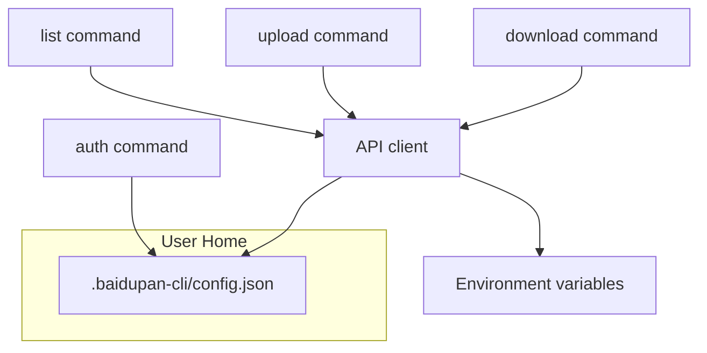
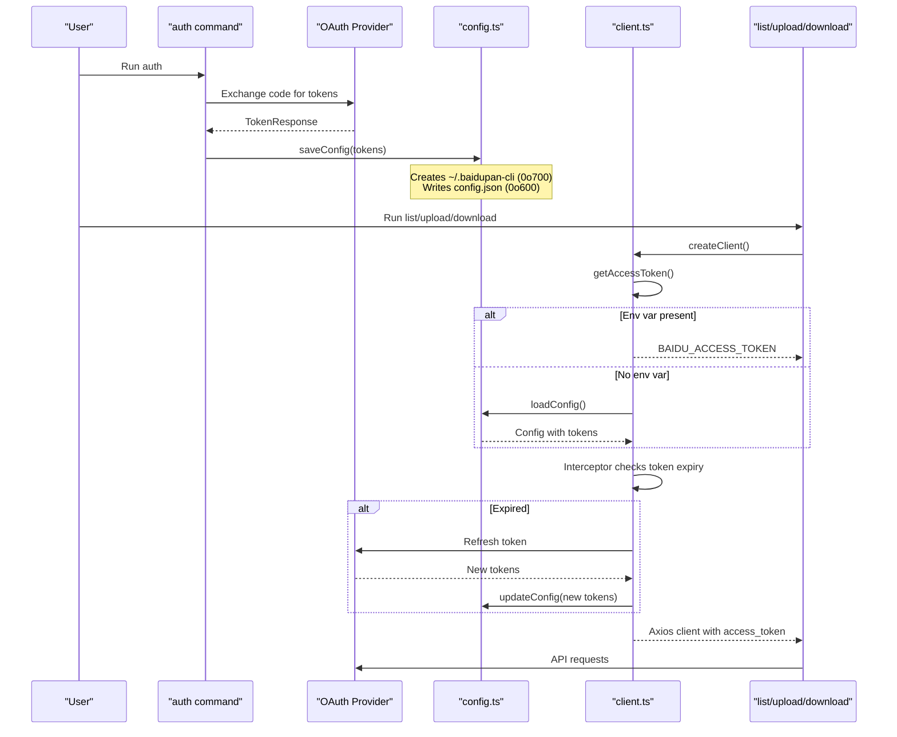
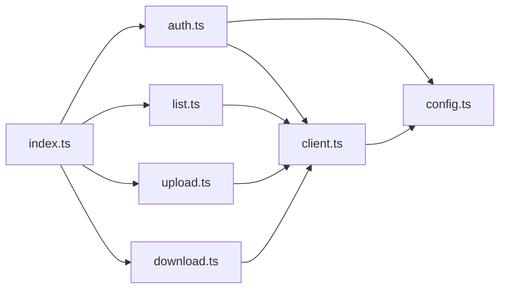

# Security and Persistence

<cite>
**Referenced Files in This Document**
- [config.ts](file://src/utils/config.ts)
- [client.ts](file://src/api/client.ts)
- [auth.ts](file://src/commands/auth.ts)
- [download.ts](file://src/commands/download.ts)
- [upload.ts](file://src/commands/upload.ts)
- [list.ts](file://src/commands/list.ts)
- [index.ts](file://src/index.ts)
- [README.md](file://README.md)
- [package.json](file://package.json)
</cite>

## Table of Contents
1. [Introduction](#introduction)
2. [Project Structure](#project-structure)
3. [Core Components](#core-components)
4. [Architecture Overview](#architecture-overview)
5. [Detailed Component Analysis](#detailed-component-analysis)
6. [Dependency Analysis](#dependency-analysis)
7. [Performance Considerations](#performance-considerations)
8. [Troubleshooting Guide](#troubleshooting-guide)
9. [Conclusion](#conclusion)
10. [Appendices](#appendices)

## Introduction
This document focuses on configuration security and persistence mechanisms within the project. It explains how authentication tokens and application credentials are stored locally, the file permission model used to protect sensitive data, and the secure file writing process. It also covers error handling for write failures, automatic token refresh and persistence, risk assessment of storing OAuth tokens locally, and best practices for secure configuration management in shared environments. Guidance on backup and cleanup procedures, as well as potential security vulnerabilities and mitigation strategies, is included.

## Project Structure
The security-critical parts of the project are organized around:
- Configuration storage and retrieval in a user-specific directory
- Authentication flow that writes tokens to disk
- API client that reads tokens from environment variables or config
- Commands that rely on the API client and therefore on persisted tokens

**Diagram sources**
- [config.ts](file://src/utils/config.ts#L5-L61)
- [client.ts](file://src/api/client.ts#L15-L44)
- [auth.ts](file://src/commands/auth.ts#L218-L228)
- [list.ts](file://src/commands/list.ts#L36-L47)
- [upload.ts](file://src/commands/upload.ts#L33-L40)
- [download.ts](file://src/commands/download.ts#L25-L31)

**Section sources**
- [config.ts](file://src/utils/config.ts#L5-L61)
- [client.ts](file://src/api/client.ts#L15-L44)
- [auth.ts](file://src/commands/auth.ts#L218-L228)
- [index.ts](file://src/index.ts#L8-L23)

## Core Components
- Configuration module: Defines the configuration directory and file, loads and saves configuration with strict file permissions, and merges updates.
- API client: Provides token retrieval precedence (environment variables > config file), refreshes tokens automatically, and persists refreshed tokens.
- Authentication command: Initiates OAuth, exchanges authorization code for tokens, and writes them to the configuration file.
- Commands: List, upload, and download depend on the API client and therefore on persisted tokens.

Key security-relevant behaviors:
- Directory permissions: 0o700 (owner-only read/write/execute)
- File permissions: 0o600 (owner-only read/write)
- Atomic-like write: Directory creation and file write occur in a single operation with explicit modes
- Error handling: Write failures are logged as warnings and do not crash the process
- Automatic refresh: On token expiration, the client refreshes and persists new tokens

**Section sources**
- [config.ts](file://src/utils/config.ts#L35-L45)
- [client.ts](file://src/api/client.ts#L63-L104)
- [auth.ts](file://src/commands/auth.ts#L218-L228)

## Architecture Overview
The configuration and token lifecycle spans several modules:

**Diagram sources**
- [auth.ts](file://src/commands/auth.ts#L76-L84)
- [auth.ts](file://src/commands/auth.ts#L218-L228)
- [config.ts](file://src/utils/config.ts#L35-L54)
- [client.ts](file://src/api/client.ts#L15-L104)

## Detailed Component Analysis

### Configuration Storage and Permissions
- Location: The configuration directory is under the user’s home directory, ensuring isolation per user.
- Directory creation: When saving, the directory is created with 0o700, restricting access to the owner only.
- File creation: The configuration file is written with 0o600, preventing group and world access.
- Atomicity: The directory and file are created in a single write operation with explicit modes, reducing window for partial writes.
- Error handling: Write failures are caught and logged as warnings; the process continues without crashing.

Security implications:
- Strong ownership-based protection reduces risk of unauthorized access on shared systems.
- Even if other users share the machine, they cannot read the tokens due to restrictive permissions.
- Misconfigured umask or inherited permissions are mitigated by explicit mode setting.

Operational notes:
- If the directory already exists, it is still created with 0o700 to ensure correct permissions.
- The file is overwritten atomically with the new JSON content.

**Section sources**
- [config.ts](file://src/utils/config.ts#L35-L45)

### Secure File Writing Process
- Directory creation: Uses recursive creation with explicit mode 0o700.
- File write: Writes JSON stringified configuration with newline formatting and explicit mode 0o600.
- Error handling: Catches exceptions during write and logs a warning message; no stack trace is printed to avoid leaking sensitive details.

Recovery mechanisms:
- If a write fails, subsequent reads will fall back to an empty configuration, prompting the user to re-authenticate.
- Future operations can retry saving after correcting filesystem issues.

**Section sources**
- [config.ts](file://src/utils/config.ts#L35-L45)

### Token Retrieval and Environment Precedence
- Token precedence: Environment variables take priority over the configuration file.
- App credentials: App key and secret key can be provided via environment variables or the configuration file.
- If tokens are missing, the process exits with an error instructing the user to authenticate.

Security benefits:
- Tokens can be supplied via environment variables (e.g., CI/CD secrets) without touching disk.
- Configuration file remains the fallback for interactive use.

**Section sources**
- [client.ts](file://src/api/client.ts#L15-L55)

### Automatic Token Refresh and Persistence
- Expiration detection: The client inspects API responses for known token-expired error codes and triggers refresh.
- Refresh flow: Uses refresh token, app credentials, and secret key to obtain new tokens.
- Persistence: On successful refresh, the client updates the in-memory token and persists new tokens to the configuration file.

Security benefits:
- Reduces manual intervention and avoids exposing tokens in logs.
- Ensures continuous operation with minimal user interaction.

**Section sources**
- [client.ts](file://src/api/client.ts#L63-L104)

### Authentication Command and Token Persistence
- OAuth flow: Starts a local server, opens the browser, waits for the authorization code, exchanges it for tokens, and prints success messages.
- Persistence: Saves tokens and credentials to the configuration file, including expiration timestamp.

Security considerations:
- The success message reveals the configuration file path; users should be mindful of who can observe terminal output.
- The command suggests copying the configuration file to other servers; this should be done securely and with appropriate permissions.

**Section sources**
- [auth.ts](file://src/commands/auth.ts#L76-L84)
- [auth.ts](file://src/commands/auth.ts#L218-L228)

### Commands That Rely on Tokens
- List, upload, and download commands create an API client and use the access token transparently.
- They do not directly handle token storage; they rely on the client’s token resolution and refresh logic.

Security considerations:
- These commands inherit the protections of the client and configuration modules.
- Users should avoid logging sensitive outputs and ensure terminal sessions are protected.

**Section sources**
- [list.ts](file://src/commands/list.ts#L36-L47)
- [upload.ts](file://src/commands/upload.ts#L33-L40)
- [download.ts](file://src/commands/download.ts#L25-L31)

## Dependency Analysis
The configuration and token lifecycle depends on the following relationships:

**Diagram sources**
- [auth.ts](file://src/commands/auth.ts#L6-L8)
- [client.ts](file://src/api/client.ts#L3)
- [config.ts](file://src/utils/config.ts#L5-L6)
- [list.ts](file://src/commands/list.ts#L2-L6)
- [upload.ts](file://src/commands/upload.ts#L4-L14)
- [download.ts](file://src/commands/download.ts#L5-L7)
- [index.ts](file://src/index.ts#L3-L6)

**Section sources**
- [auth.ts](file://src/commands/auth.ts#L6-L8)
- [client.ts](file://src/api/client.ts#L3)
- [config.ts](file://src/utils/config.ts#L5-L6)
- [list.ts](file://src/commands/list.ts#L2-L6)
- [upload.ts](file://src/commands/upload.ts#L4-L14)
- [download.ts](file://src/commands/download.ts#L5-L7)
- [index.ts](file://src/index.ts#L3-L6)

## Performance Considerations
- File I/O: Configuration reads/writes are infrequent and localized to user scope, minimizing overhead.
- Token refresh: Occurs only when necessary, avoiding repeated network calls.
- Error handling: Logging warnings instead of throwing exceptions prevents cascading failures during transient filesystem issues.

[No sources needed since this section provides general guidance]

## Troubleshooting Guide
Common issues and resolutions:
- Permission errors when writing config:
  - Cause: Insufficient permissions or restrictive umask.
  - Resolution: Ensure the user account has write access to the home directory; the module creates directories with 0o700 and files with 0o600.
- Read failures:
  - Cause: Corrupted or unreadable config file.
  - Resolution: Remove or repair the config file; the loader falls back to an empty configuration and requires re-authentication.
- Token refresh failures:
  - Cause: Missing refresh token or invalid app credentials.
  - Resolution: Re-run the authentication command to obtain new tokens.
- Authorization timeouts or browser issues:
  - Cause: Port conflicts or browser automation failures.
  - Resolution: Choose a different port or manually open the authorization URL; ensure the redirect URI matches the provider’s configuration.

**Section sources**
- [config.ts](file://src/utils/config.ts#L19-L30)
- [client.ts](file://src/api/client.ts#L63-L104)
- [auth.ts](file://src/commands/auth.ts#L149-L158)
- [README.md](file://README.md#L135-L154)

## Conclusion
The project implements robust, user-scoped configuration persistence with strong file permission controls (0o700 for directories and 0o600 for files). Token retrieval prioritizes environment variables for secure supply, while the configuration file serves as a reliable fallback. Automatic token refresh and persistence minimize operational burden and reduce exposure risks. Adhering to the best practices outlined below will further strengthen security in shared and automated environments.

## Appendices

### Risk Assessment and Mitigation Strategies
- Local token storage risks:
  - Exposure on compromised machines: Mitigated by restrictive file permissions.
  - Shared environment exposure: Mitigated by per-user isolation and ownership-based restrictions.
  - Log leakage: Avoid printing sensitive data; the code avoids logging raw tokens.
- Encryption considerations:
  - Current implementation stores tokens in plaintext JSON. Consider encrypting the configuration file if regulatory or organizational policies require it.
  - Alternatively, rely on environment variables or OS keychain integration for higher security.
- Best practices for credential protection:
  - Prefer environment variables for CI/CD and ephemeral environments.
  - Limit filesystem access to the user account; avoid sharing the home directory.
  - Regularly review and rotate app keys and tokens.
- Secure configuration management in shared environments:
  - Use environment variables for tokens and credentials.
  - If configuration files must be used, restrict access to the user and remove unnecessary group/world permissions.
  - Audit and monitor access to the configuration directory.
- Backup and cleanup:
  - Back up the configuration directory to encrypted storage or secure offsite locations.
  - Periodically clean up old or unused tokens; the configuration module does not enforce retention policies.
  - When migrating to another host, copy the configuration file and restore permissions (0o700 for directory, 0o600 for file).
- Potential vulnerabilities and mitigations:
  - Insecure temporary files: Not used in this project; ensure any future additions follow secure temporary file practices.
  - Path traversal: The configuration path is derived from the user’s home directory; avoid accepting untrusted paths.
  - Token exposure in process lists: Avoid printing tokens; the code avoids doing so.
  - Network interception: Use HTTPS endpoints; the client uses HTTPS URLs for API communication.

[No sources needed since this section provides general guidance]
