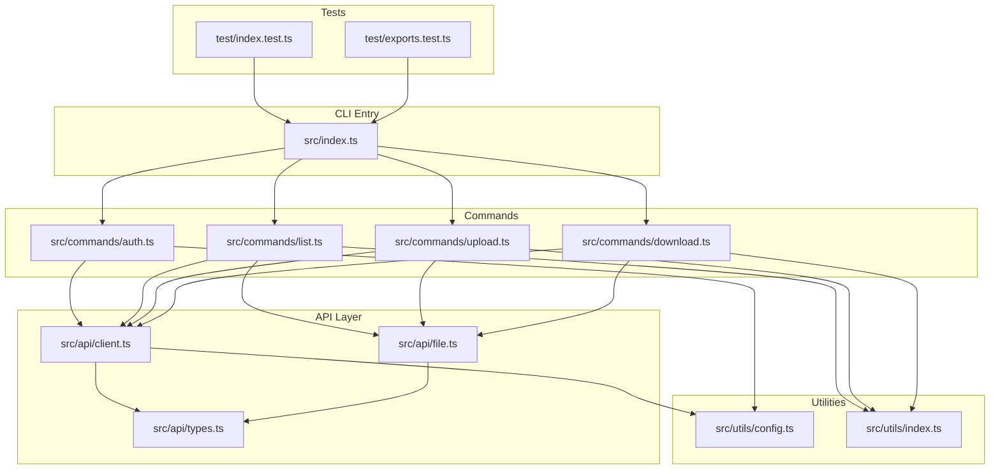
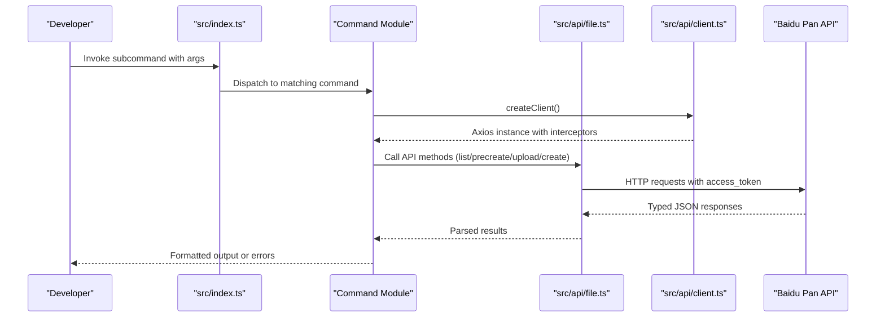
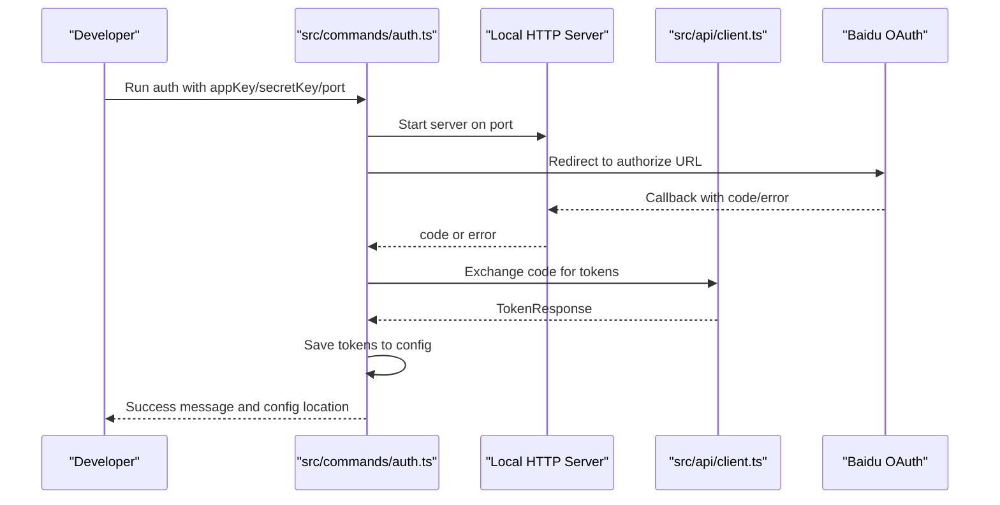
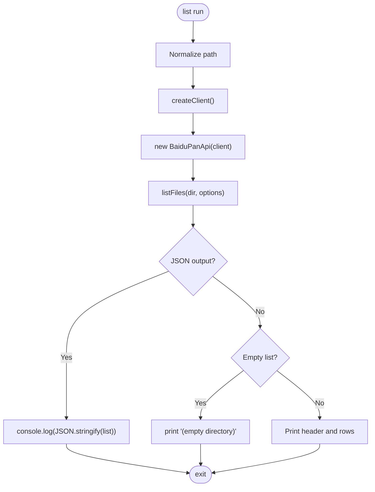
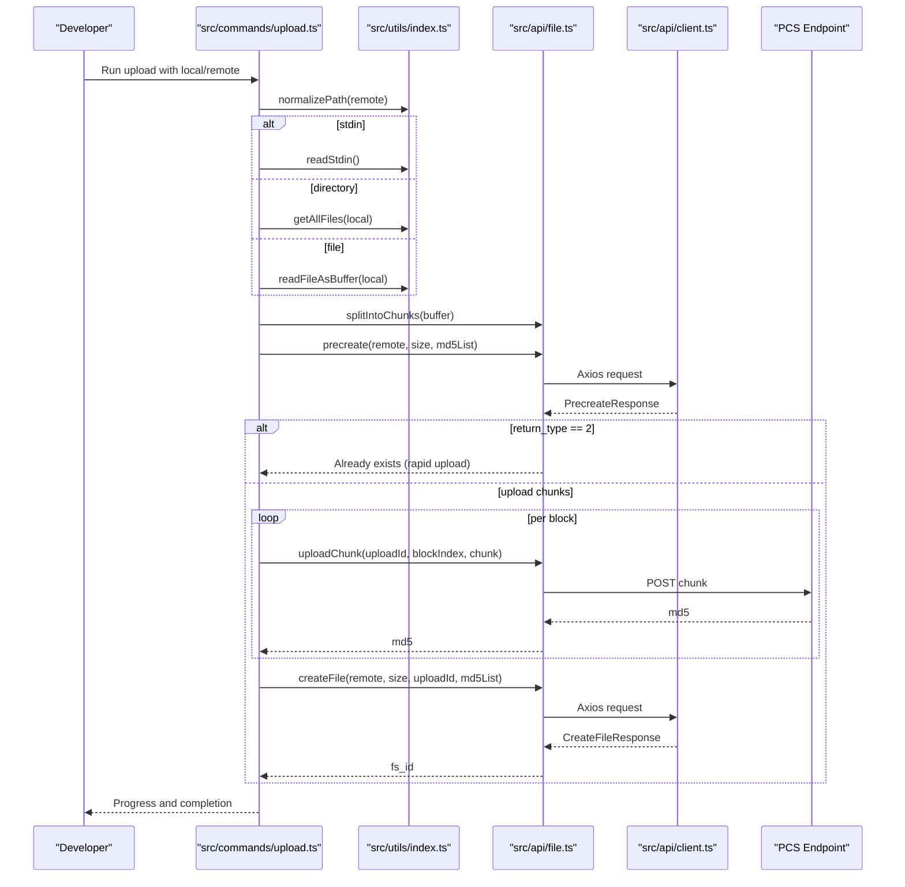
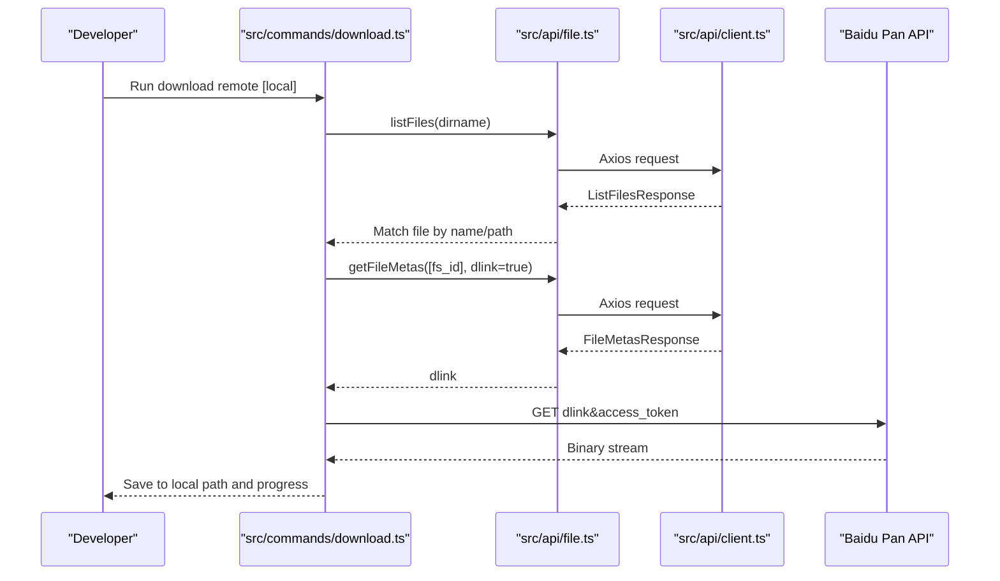
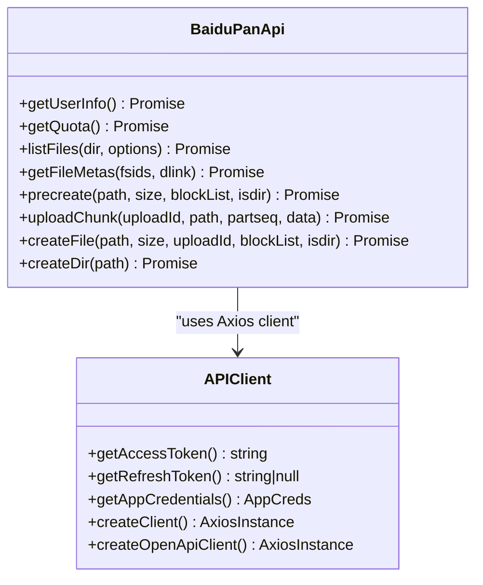
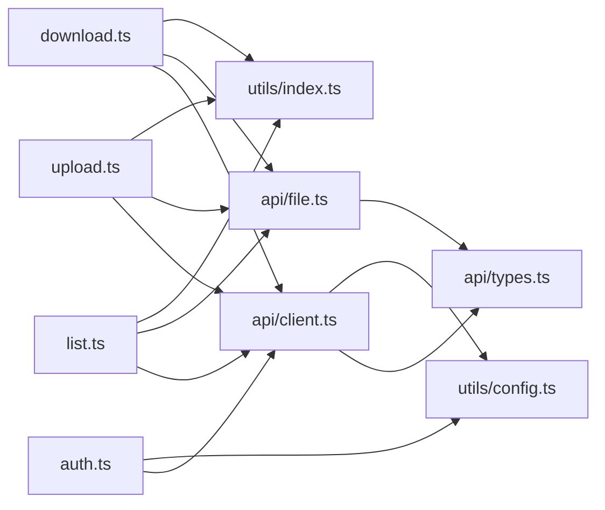

# Development Guide

<cite>
**Referenced Files in This Document**
- [package.json](file://package.json)
- [tsconfig.json](file://tsconfig.json)
- [vitest.config.ts](file://vitest.config.ts)
- [eslint.config.js](file://eslint.config.js)
- [CONTRIBUTING.md](file://CONTRIBUTING.md)
- [README.md](file://README.md)
- [src/index.ts](file://src/index.ts)
- [src/commands/auth.ts](file://src/commands/auth.ts)
- [src/commands/list.ts](file://src/commands/list.ts)
- [src/commands/upload.ts](file://src/commands/upload.ts)
- [src/commands/download.ts](file://src/commands/download.ts)
- [src/api/client.ts](file://src/api/client.ts)
- [src/api/file.ts](file://src/api/file.ts)
- [src/api/types.ts](file://src/api/types.ts)
- [src/utils/config.ts](file://src/utils/config.ts)
- [src/utils/index.ts](file://src/utils/index.ts)
- [test/index.test.ts](file://test/index.test.ts)
- [test/exports.test.ts](file://test/exports.test.ts)
</cite>

## Table of Contents
1. [Introduction](#introduction)
2. [Project Structure](#project-structure)
3. [Core Components](#core-components)
4. [Architecture Overview](#architecture-overview)
5. [Detailed Component Analysis](#detailed-component-analysis)
6. [Dependency Analysis](#dependency-analysis)
7. [Performance Considerations](#performance-considerations)
8. [Troubleshooting Guide](#troubleshooting-guide)
9. [Contribution Workflow](#contribution-workflow)
10. [Release Procedures](#release-procedures)
11. [Testing Strategy](#testing-strategy)
12. [Code Quality Standards](#code-quality-standards)
13. [Examples and Debugging](#examples-and-debugging)
14. [Conclusion](#conclusion)

## Introduction
This document provides comprehensive development guidance for contributors and maintainers of the Baidu Pan CLI project. It covers the project structure, build and development environment setup, TypeScript configuration, linting rules, and the Vitest testing framework. It also explains the contribution workflow, code review process, and release procedures, along with guidelines for adding new commands, extending API functionality, and modifying existing features. Testing strategies, unit test patterns, integration testing approaches, code quality standards, documentation requirements, and performance testing procedures are included, alongside practical examples and debugging techniques.

## Project Structure
The project follows a modular structure organized by concerns:
- src/index.ts: Entry point that defines the CLI and registers subcommands.
- src/commands/: Command implementations for auth, list, upload, and download.
- src/api/: API client and service abstractions for Baidu Pan.
- src/utils/: Shared utilities for configuration, path normalization, formatting, and I/O helpers.
- test/: Unit and export snapshot tests.
- Root configuration files for TypeScript, ESLint, Vitest, and package scripts.

**Diagram sources**
- [src/index.ts](file://src/index.ts#L1-L26)
- [src/commands/auth.ts](file://src/commands/auth.ts#L1-L258)
- [src/commands/list.ts](file://src/commands/list.ts#L1-L81)
- [src/commands/upload.ts](file://src/commands/upload.ts#L1-L144)
- [src/commands/download.ts](file://src/commands/download.ts#L1-L104)
- [src/api/client.ts](file://src/api/client.ts#L1-L171)
- [src/api/file.ts](file://src/api/file.ts#L1-L201)
- [src/api/types.ts](file://src/api/types.ts#L1-L108)
- [src/utils/config.ts](file://src/utils/config.ts#L1-L62)
- [src/utils/index.ts](file://src/utils/index.ts#L1-L110)
- [test/index.test.ts](file://test/index.test.ts#L1-L8)
- [test/exports.test.ts](file://test/exports.test.ts#L1-L27)

**Section sources**
- [src/index.ts](file://src/index.ts#L1-L26)
- [README.md](file://README.md#L1-L169)

## Core Components
- CLI Entry and Subcommands
  - The CLI is defined via a command registry that maps subcommands to their implementations. Aliases are supported for convenience.
  - See [src/index.ts](file://src/index.ts#L8-L23).

- Commands
  - auth: Handles OAuth authorization, local callback server, token exchange, and persistence.
  - list: Lists directory contents with sorting and JSON output support.
  - upload: Supports single file, directory recursion, stdin input, chunked upload, and progress reporting.
  - download: Resolves remote file metadata, obtains a download link, and writes to disk with progress.

- API Layer
  - client: Provides token retrieval, automatic refresh, and Axios interceptors for error handling and retries.
  - file: Implements Baidu Pan REST endpoints for listing, metadata, precreate, chunk upload, and file creation.
  - types: Defines typed API response contracts and error code mappings.

- Utilities
  - config: Manages local configuration storage and retrieval.
  - index: Provides formatting, path normalization, filesystem traversal, I/O helpers, and progress printing.

**Section sources**
- [src/index.ts](file://src/index.ts#L1-L26)
- [src/commands/auth.ts](file://src/commands/auth.ts#L1-L258)
- [src/commands/list.ts](file://src/commands/list.ts#L1-L81)
- [src/commands/upload.ts](file://src/commands/upload.ts#L1-L144)
- [src/commands/download.ts](file://src/commands/download.ts#L1-L104)
- [src/api/client.ts](file://src/api/client.ts#L1-L171)
- [src/api/file.ts](file://src/api/file.ts#L1-L201)
- [src/api/types.ts](file://src/api/types.ts#L1-L108)
- [src/utils/config.ts](file://src/utils/config.ts#L1-L62)
- [src/utils/index.ts](file://src/utils/index.ts#L1-L110)

## Architecture Overview
The CLI architecture separates concerns into:
- Command layer: Parses arguments and orchestrates operations.
- API layer: Encapsulates HTTP interactions and Baidu Pan API specifics.
- Utilities: Provide cross-cutting concerns like configuration, formatting, and I/O.
- Tests: Validate behavior and export manifests.

**Diagram sources**
- [src/index.ts](file://src/index.ts#L1-L26)
- [src/commands/list.ts](file://src/commands/list.ts#L36-L79)
- [src/commands/upload.ts](file://src/commands/upload.ts#L33-L95)
- [src/commands/download.ts](file://src/commands/download.ts#L25-L102)
- [src/api/file.ts](file://src/api/file.ts#L16-L175)
- [src/api/client.ts](file://src/api/client.ts#L112-L161)

## Detailed Component Analysis

### Authentication Flow (auth)
The auth command sets up a local HTTP server to receive OAuth callbacks, exchanges the authorization code for tokens, and persists them to a local config file. It supports environment variables and custom redirect URIs.

**Diagram sources**
- [src/commands/auth.ts](file://src/commands/auth.ts#L46-L91)
- [src/commands/auth.ts](file://src/commands/auth.ts#L93-L159)
- [src/commands/auth.ts](file://src/commands/auth.ts#L161-L192)
- [src/commands/auth.ts](file://src/commands/auth.ts#L218-L257)
- [src/api/client.ts](file://src/api/client.ts#L112-L161)

**Section sources**
- [src/commands/auth.ts](file://src/commands/auth.ts#L1-L258)
- [src/api/client.ts](file://src/api/client.ts#L1-L171)

### Listing Files (list)
The list command normalizes the path, constructs API options, retrieves file listings, and prints either a formatted table or JSON.

**Diagram sources**
- [src/commands/list.ts](file://src/commands/list.ts#L36-L79)
- [src/api/file.ts](file://src/api/file.ts#L42-L60)
- [src/utils/index.ts](file://src/utils/index.ts#L28-L33)

**Section sources**
- [src/commands/list.ts](file://src/commands/list.ts#L1-L81)
- [src/api/file.ts](file://src/api/file.ts#L1-L201)

### Uploading Files (upload)
The upload command supports stdin, single files, and recursive directory uploads. It splits data into chunks, precreates the file, uploads missing chunks, and creates the final file.

**Diagram sources**
- [src/commands/upload.ts](file://src/commands/upload.ts#L33-L95)
- [src/commands/upload.ts](file://src/commands/upload.ts#L98-L143)
- [src/api/file.ts](file://src/api/file.ts#L79-L175)
- [src/utils/index.ts](file://src/utils/index.ts#L38-L93)

**Section sources**
- [src/commands/upload.ts](file://src/commands/upload.ts#L1-L144)
- [src/api/file.ts](file://src/api/file.ts#L1-L201)
- [src/utils/index.ts](file://src/utils/index.ts#L1-L110)

### Downloading Files (download)
The download command resolves the remote file, fetches metadata to obtain a download link, and streams the file to disk while reporting progress.

**Diagram sources**
- [src/commands/download.ts](file://src/commands/download.ts#L25-L102)
- [src/api/file.ts](file://src/api/file.ts#L65-L74)
- [src/api/client.ts](file://src/api/client.ts#L112-L161)

**Section sources**
- [src/commands/download.ts](file://src/commands/download.ts#L1-L104)
- [src/api/file.ts](file://src/api/file.ts#L1-L201)

### API Client and Interceptors
The API client encapsulates token retrieval, refresh logic, and Axios interceptors to handle Baidu error codes and retry on token expiration.

**Diagram sources**
- [src/api/file.ts](file://src/api/file.ts#L16-L175)
- [src/api/client.ts](file://src/api/client.ts#L112-L161)

**Section sources**
- [src/api/client.ts](file://src/api/client.ts#L1-L171)
- [src/api/file.ts](file://src/api/file.ts#L1-L201)

## Dependency Analysis
- Internal dependencies
  - Commands depend on the API client and shared utilities.
  - API client depends on typed responses and configuration utilities.
  - Utilities are used across commands and API layer.
- External dependencies
  - axios for HTTP requests.
  - citty for command definition and dispatch.
  - form-data for multipart uploads.

**Diagram sources**
- [src/commands/auth.ts](file://src/commands/auth.ts#L1-L258)
- [src/commands/list.ts](file://src/commands/list.ts#L1-L81)
- [src/commands/upload.ts](file://src/commands/upload.ts#L1-L144)
- [src/commands/download.ts](file://src/commands/download.ts#L1-L104)
- [src/api/client.ts](file://src/api/client.ts#L1-L171)
- [src/api/file.ts](file://src/api/file.ts#L1-L201)
- [src/api/types.ts](file://src/api/types.ts#L1-L108)
- [src/utils/config.ts](file://src/utils/config.ts#L1-L62)
- [src/utils/index.ts](file://src/utils/index.ts#L1-L110)

**Section sources**
- [package.json](file://package.json#L49-L73)

## Performance Considerations
- Chunked Uploads
  - The upload pipeline splits files into 4 MB chunks to improve reliability and enable resume capability. See [src/api/file.ts](file://src/api/file.ts#L13-L14) and [src/api/file.ts](file://src/api/file.ts#L187-L198).
- Progress Reporting
  - Progress bars are printed to stderr during chunk uploads and downloads. See [src/utils/index.ts](file://src/utils/index.ts#L98-L109) and [src/commands/download.ts](file://src/commands/download.ts#L85-L91).
- Token Caching and Refresh
  - Access tokens are cached in memory and refreshed automatically when expired, reducing redundant network calls. See [src/api/client.ts](file://src/api/client.ts#L15-L44) and [src/api/client.ts](file://src/api/client.ts#L63-L104).
- Request Interceptors
  - Axios interceptors centralize error handling and retries for token expiration. See [src/api/client.ts](file://src/api/client.ts#L124-L150).

[No sources needed since this section provides general guidance]

## Troubleshooting Guide
- Authorization Issues
  - Verify App Key and Secret Key, ensure the redirect URI matches the configured value, and confirm the local port is available. See [src/commands/auth.ts](file://src/commands/auth.ts#L47-L63) and [README.md](file://README.md#L138-L142).
- Network Problems
  - Confirm connectivity to Baidu APIs and absence of proxy interference. See [README.md](file://README.md#L144-L148).
- File Operations
  - Ensure remote paths start with "/", check permissions, and note long upload times for large files. See [README.md](file://README.md#L150-L154).
- Token Management
  - Tokens are persisted locally and auto-refreshed; failures prompt re-authentication. See [src/api/client.ts](file://src/api/client.ts#L34-L37) and [src/api/client.ts](file://src/api/client.ts#L63-L104).

**Section sources**
- [src/commands/auth.ts](file://src/commands/auth.ts#L47-L63)
- [README.md](file://README.md#L138-L154)
- [src/api/client.ts](file://src/api/client.ts#L34-L37)
- [src/api/client.ts](file://src/api/client.ts#L63-L104)

## Contribution Workflow
- Development Setup
  - Fork, clone, install dependencies, and start development watch mode. See [CONTRIBUTING.md](file://CONTRIBUTING.md#L5-L11).
- Coding Standards
  - Use TypeScript, follow ESLint rules, keep code concise, annotate types, and write unit tests. See [CONTRIBUTING.md](file://CONTRIBUTING.md#L28-L34).
- Submitting Changes
  - Create a feature branch, commit with conventional messages, push, and open a Pull Request. See [CONTRIBUTING.md](file://CONTRIBUTING.md#L21-L26).
- Issue Reporting and Feature Requests
  - Provide detailed descriptions, reproducible steps, environment info, and screenshots/logs when applicable. See [CONTRIBUTING.md](file://CONTRIBUTING.md#L36-L49).

**Section sources**
- [CONTRIBUTING.md](file://CONTRIBUTING.md#L1-L50)

## Release Procedures
- Versioning and Publishing
  - Build artifacts are produced via the build script and published on prepublish. See [package.json](file://package.json#L38-L47).
- Release Automation
  - Use the release script to bump versions consistently. See [package.json](file://package.json#L43).
- Export Validation
  - Export snapshots are validated by the test suite to ensure package exports remain stable. See [test/exports.test.ts](file://test/exports.test.ts#L9-L26).

**Section sources**
- [package.json](file://package.json#L38-L47)
- [test/exports.test.ts](file://test/exports.test.ts#L1-L27)

## Testing Strategy
- Unit Tests
  - Located under test/, using Vitest. See [test/index.test.ts](file://test/index.test.ts#L1-L8).
- Export Snapshot Tests
  - Validates package exports manifest across projects. See [test/exports.test.ts](file://test/exports.test.ts#L9-L26).
- Test Configuration
  - Vitest server dependencies are inlined for package exports compatibility. See [vitest.config.ts](file://vitest.config.ts#L1-L12).

**Section sources**
- [test/index.test.ts](file://test/index.test.ts#L1-L8)
- [test/exports.test.ts](file://test/exports.test.ts#L1-L27)
- [vitest.config.ts](file://vitest.config.ts#L1-L12)

## Code Quality Standards
- Linting
  - ESLint is configured with Antfu’s opinionated rules, tuned for Node.js CLI usage. Console output and globals are permitted. See [eslint.config.js](file://eslint.config.js#L1-L25).
- Formatting and Style
  - Enforced by ESLint; adhere to TypeScript strictness and module resolution settings. See [tsconfig.json](file://tsconfig.json#L1-L17).
- Git Hooks
  - Pre-commit hooks install lockfile offline and run lint-staged to fix issues automatically. See [package.json](file://package.json#L74-L79).

**Section sources**
- [eslint.config.js](file://eslint.config.js#L1-L25)
- [tsconfig.json](file://tsconfig.json#L1-L17)
- [package.json](file://package.json#L74-L79)

## Examples and Debugging
- Running Locally
  - Use the start script to run the CLI directly from source. See [package.json](file://package.json#L44).
- Building Artifacts
  - Produce distributable builds with the build script. See [package.json](file://package.json#L39).
- Development Watch Mode
  - Iterate quickly with the dev script. See [package.json](file://package.json#L40).
- Example Scripts
  - Refer to example/ for real-world usage patterns. See [README.md](file://README.md#L156-L164).

**Section sources**
- [package.json](file://package.json#L39-L44)
- [README.md](file://README.md#L156-L164)

## Guidelines for Adding New Commands
- Define the Command
  - Create a new file under src/commands/ and export a citty command with meta, args, and run handler. Follow patterns from existing commands. See [src/commands/list.ts](file://src/commands/list.ts#L6-L35).
- Integrate into CLI
  - Register the new subcommand in the main index file and add aliases if appropriate. See [src/index.ts](file://src/index.ts#L14-L22).
- API Usage
  - Use createClient() and BaiduPanApi methods to interact with Baidu Pan endpoints. See [src/api/client.ts](file://src/api/client.ts#L112-L161) and [src/api/file.ts](file://src/api/file.ts#L16-L175).
- Utilities
  - Reuse path normalization, formatting, and I/O helpers from src/utils. See [src/utils/index.ts](file://src/utils/index.ts#L1-L110).
- Testing
  - Add unit tests under test/ and ensure coverage of error paths and edge cases. See [test/index.test.ts](file://test/index.test.ts#L1-L8).

**Section sources**
- [src/index.ts](file://src/index.ts#L14-L22)
- [src/commands/list.ts](file://src/commands/list.ts#L6-L35)
- [src/api/client.ts](file://src/api/client.ts#L112-L161)
- [src/api/file.ts](file://src/api/file.ts#L16-L175)
- [src/utils/index.ts](file://src/utils/index.ts#L1-L110)
- [test/index.test.ts](file://test/index.test.ts#L1-L8)

## Extending API Functionality
- Add Methods to BaiduPanApi
  - Define new methods in src/api/file.ts with typed parameters and return values. See [src/api/file.ts](file://src/api/file.ts#L16-L175).
- Update Types
  - Extend response interfaces in src/api/types.ts and update error code mappings if needed. See [src/api/types.ts](file://src/api/types.ts#L1-L108).
- Client Interceptors
  - Keep error handling centralized in the client interceptor chain. See [src/api/client.ts](file://src/api/client.ts#L124-L150).

**Section sources**
- [src/api/file.ts](file://src/api/file.ts#L16-L175)
- [src/api/types.ts](file://src/api/types.ts#L1-L108)
- [src/api/client.ts](file://src/api/client.ts#L124-L150)

## Modifying Existing Features
- Path Normalization
  - Ensure remote paths are normalized to absolute paths. See [src/utils/index.ts](file://src/utils/index.ts#L28-L33).
- Token Handling
  - Rely on getAccessToken() and automatic refresh; avoid duplicating token logic. See [src/api/client.ts](file://src/api/client.ts#L15-L44) and [src/api/client.ts](file://src/api/client.ts#L63-L104).
- Error Propagation
  - Preserve meaningful error messages and exit codes from commands. See [src/commands/list.ts](file://src/commands/list.ts#L75-L78).

**Section sources**
- [src/utils/index.ts](file://src/utils/index.ts#L28-L33)
- [src/api/client.ts](file://src/api/client.ts#L15-L44)
- [src/api/client.ts](file://src/api/client.ts#L63-L104)
- [src/commands/list.ts](file://src/commands/list.ts#L75-L78)

## Conclusion
This guide consolidates the development practices, architecture, and operational procedures for contributing to the Baidu Pan CLI. By following the established patterns—command registration, API abstraction, robust utilities, and comprehensive testing—you can confidently extend functionality, maintain code quality, and deliver reliable improvements to the project.
