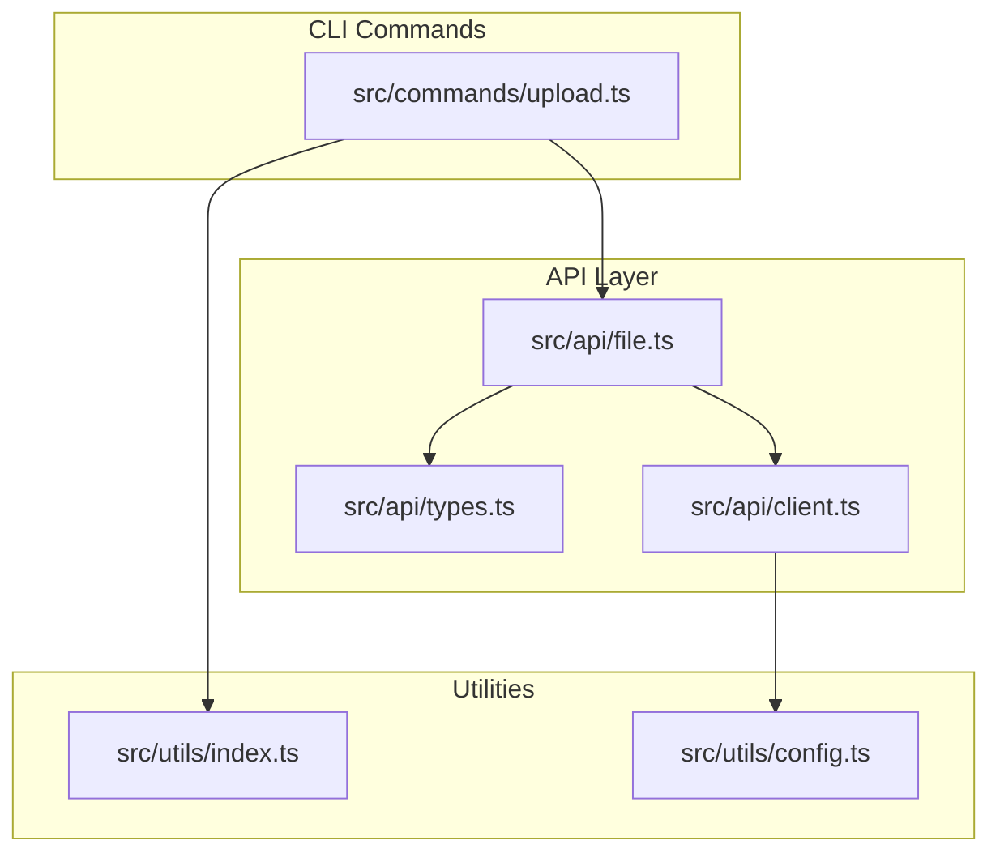
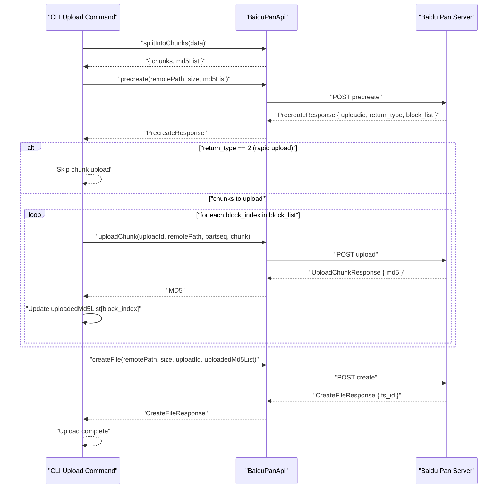
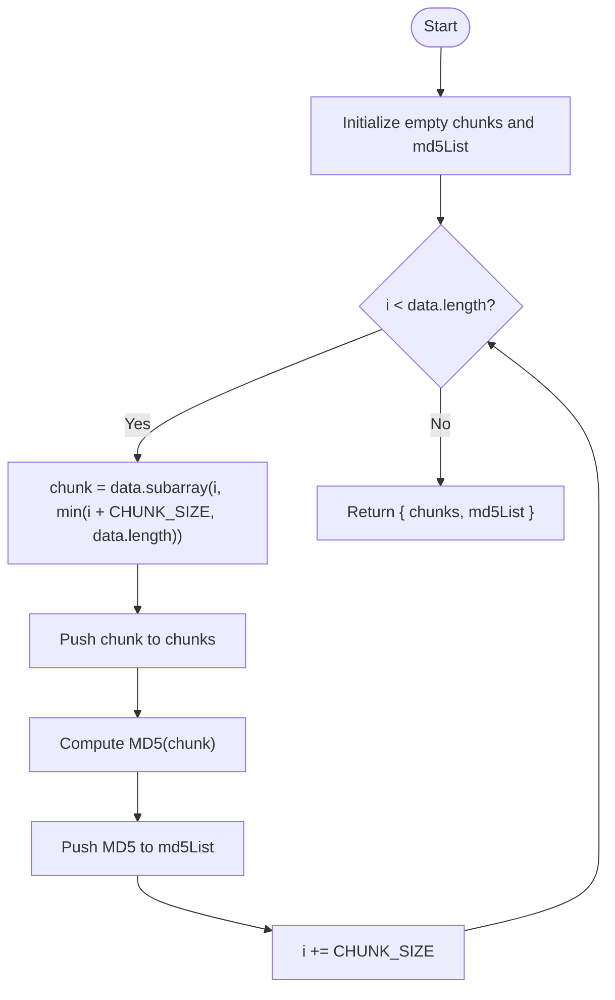
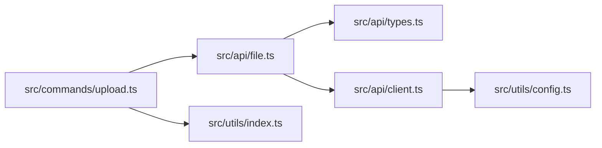

# Chunked Transfer Strategy

<cite>
**Referenced Files in This Document**
- [upload.ts](file://src/commands/upload.ts)
- [file.ts](file://src/api/file.ts)
- [types.ts](file://src/api/types.ts)
- [client.ts](file://src/api/client.ts)
- [index.ts](file://src/utils/index.ts)
- [config.ts](file://src/utils/config.ts)
- [README.md](file://README.md)
</cite>

## Table of Contents
1. [Introduction](#introduction)
2. [Project Structure](#project-structure)
3. [Core Components](#core-components)
4. [Architecture Overview](#architecture-overview)
5. [Detailed Component Analysis](#detailed-component-analysis)
6. [Dependency Analysis](#dependency-analysis)
7. [Performance Considerations](#performance-considerations)
8. [Troubleshooting Guide](#troubleshooting-guide)
9. [Conclusion](#conclusion)
10. [Appendices](#appendices)

## Introduction
This document explains the chunked transfer strategy used by the upload command to reliably upload large files to Baidu Pan. It covers the 4 MB chunk size rationale, buffer splitting algorithms, MD5 calculation for integrity verification, chunk sequence management, missing chunk detection logic, and the upload lifecycle. It also documents the cryptographic hashing implementation, memory management for large files, performance considerations across file sizes, and practical guidance for error recovery and debugging.

## Project Structure
The chunked transfer implementation spans several modules:
- Command layer orchestrates the upload flow and delegates to the API layer.
- API layer encapsulates Baidu Pan service interactions, chunking, and hashing.
- Utilities provide shared helpers for file operations, progress reporting, and configuration.

**Diagram sources**
- [upload.ts](file://src/commands/upload.ts#L1-L144)
- [file.ts](file://src/api/file.ts#L1-L201)
- [types.ts](file://src/api/types.ts#L1-L108)
- [client.ts](file://src/api/client.ts#L1-L171)
- [index.ts](file://src/utils/index.ts#L1-L110)
- [config.ts](file://src/utils/config.ts#L1-L62)

**Section sources**
- [upload.ts](file://src/commands/upload.ts#L1-L144)
- [file.ts](file://src/api/file.ts#L1-L201)
- [index.ts](file://src/utils/index.ts#L1-L110)
- [client.ts](file://src/api/client.ts#L1-L171)
- [types.ts](file://src/api/types.ts#L1-L108)
- [config.ts](file://src/utils/config.ts#L1-L62)

## Core Components
- Chunk size constant and chunking logic: The upload pipeline splits the input buffer into fixed-size chunks and computes per-chunk MD5 digests.
- MD5 hashing: A dedicated function computes MD5 hashes for integrity verification.
- Upload orchestration: The command orchestrates precreate, chunk upload, and file creation steps.
- API interactions: The API class handles precreate, chunk upload, and create requests to Baidu Pan.

Key responsibilities:
- Buffer splitting and MD5 computation are centralized in the API module.
- The command module coordinates the upload lifecycle and manages progress reporting.
- The client module provides authentication and automatic token refresh.

**Section sources**
- [file.ts](file://src/api/file.ts#L13-L201)
- [upload.ts](file://src/commands/upload.ts#L98-L144)
- [client.ts](file://src/api/client.ts#L112-L171)

## Architecture Overview
The chunked transfer follows a three-phase process:
1. Precreate: The client sends the list of chunk MD5s to the server to determine which chunks need uploading.
2. Upload chunks: The client uploads only the missing chunks, collecting the server-returned MD5s.
3. Create file: The client finalizes the file using the complete MD5 list.

**Diagram sources**
- [upload.ts](file://src/commands/upload.ts#L102-L143)
- [file.ts](file://src/api/file.ts#L79-L167)
- [types.ts](file://src/api/types.ts#L53-L71)

## Detailed Component Analysis

### Chunk Size Selection: 4 MB Rationale
- The chunk size is defined as a constant and is used consistently across chunk splitting and upload operations.
- This size balances throughput and memory usage while aligning with typical cloud storage APIs’ expectations for efficient multipart uploads.

Implementation highlights:
- Constant definition and usage in chunk splitting.
- Used in precreate and uploadChunk calls.

**Section sources**
- [file.ts](file://src/api/file.ts#L13-L14)
- [file.ts](file://src/api/file.ts#L187-L198)
- [file.ts](file://src/api/file.ts#L107-L138)

### Buffer Splitting Algorithm
- The splitter iterates over the input buffer in increments equal to the chunk size.
- Each iteration produces a subarray slice representing a chunk.
- MD5 is computed for each chunk immediately during splitting.

Algorithm flow:

**Diagram sources**
- [file.ts](file://src/api/file.ts#L187-L198)

**Section sources**
- [file.ts](file://src/api/file.ts#L187-L198)

### MD5 Calculation for Integrity Verification
- MD5 is computed using Node’s built-in cryptographic hash function.
- The MD5 of each chunk is stored alongside the chunk to enable integrity checks and rapid upload detection.

Implementation details:
- Hash function signature and digest format.
- MD5 computation performed during chunk splitting.

**Section sources**
- [file.ts](file://src/api/file.ts#L177-L182)
- [file.ts](file://src/api/file.ts#L187-L198)

### Chunk Sequence Management and Missing Chunk Detection
- The precreate step returns a block list indicating which chunks are missing.
- The upload command iterates over the returned indices and uploads only those chunks.
- After each successful upload, the client replaces the placeholder MD5 with the server-returned MD5.

Key behaviors:
- The uploaded MD5 list is initialized from the original MD5 list and updated as chunks are uploaded.
- The final create request uses the complete MD5 list.

**Section sources**
- [upload.ts](file://src/commands/upload.ts#L102-L143)
- [file.ts](file://src/api/file.ts#L79-L102)
- [file.ts](file://src/api/file.ts#L107-L138)
- [types.ts](file://src/api/types.ts#L53-L57)

### Parallel Upload Optimization Techniques
- Current implementation uploads chunks sequentially in the order returned by precreate.
- No explicit parallelization is implemented in the upload command.
- Practical recommendation: Introduce concurrency limits (e.g., N simultaneous uploads) to improve throughput while respecting memory constraints.

Note: The current code does not implement parallelism. The recommendation is provided for future enhancement.

**Section sources**
- [upload.ts](file://src/commands/upload.ts#L119-L131)

### Cryptographic Hashing Implementation
- MD5 hashing is performed using Node’s crypto module.
- Digest output is hex-encoded for interoperability with API expectations.

Security note:
- MD5 is used here for integrity verification and rapid upload detection. For stronger cryptographic guarantees, consider SHA-256 in environments requiring collision resistance.

**Section sources**
- [file.ts](file://src/api/file.ts#L177-L182)

### Memory Management for Large Files
- The entire input buffer is loaded into memory before chunking.
- Chunking uses subarray slices to avoid duplicating data, minimizing peak memory overhead.
- For very large files, consider streaming approaches to reduce memory footprint.

Current behavior:
- Single-pass loading and immediate chunk splitting.
- Subarray slicing avoids copying underlying buffers.

Recommendations:
- For extremely large files, implement streaming chunking to avoid loading the entire file into memory.

**Section sources**
- [upload.ts](file://src/commands/upload.ts#L98-L99)
- [file.ts](file://src/api/file.ts#L187-L198)
- [index.ts](file://src/utils/index.ts#L72-L74)

### Performance Considerations Across File Sizes
- Small files (< 4 MB): Rapid upload likely succeeds via precreate without any chunk uploads.
- Medium files (4–16 MB): Single round of chunk uploads; minimal overhead.
- Large files (> 16 MB): Multiple rounds of chunk uploads; throughput depends on network and server capacity.

Optimization tips:
- Adjust chunk size for network conditions (see Appendices).
- Limit concurrent uploads to balance CPU and memory usage.

**Section sources**
- [upload.ts](file://src/commands/upload.ts#L102-L143)
- [file.ts](file://src/api/file.ts#L13-L14)

### Example Optimal Chunk Sizing for Various Network Conditions
- High bandwidth, low latency: Larger chunks (e.g., 8–16 MB) to maximize throughput.
- Moderate bandwidth: Keep 4 MB chunks for balanced reliability.
- Low bandwidth or unstable networks: Smaller chunks (e.g., 2 MB) to reduce impact of partial failures.

Note: The current implementation uses a fixed 4 MB chunk size. Adjustments require changing the chunk size constant and updating callers accordingly.

**Section sources**
- [file.ts](file://src/api/file.ts#L13-L14)

### Error Recovery Strategies
- Token expiration: The client interceptor detects expired tokens and attempts to refresh them automatically.
- API errors: Responses with non-zero errno trigger descriptive errors.
- Rapid upload: If the server reports the file already exists, the upload is skipped.

Operational guidance:
- Monitor return_type from precreate to detect rapid upload scenarios.
- Implement retries with exponential backoff for transient failures.

**Section sources**
- [client.ts](file://src/api/client.ts#L124-L150)
- [client.ts](file://src/api/client.ts#L106-L110)
- [upload.ts](file://src/commands/upload.ts#L110-L114)
- [types.ts](file://src/api/types.ts#L99-L107)

### Debugging Techniques for Chunk Transfer Issues
- Enable verbose logging: The upload command prints chunk count, progress, and completion messages.
- Inspect precreate response: Verify block_list length and return_type.
- Compare MD5 lists: Ensure client-side and server-side MD5s match after uploads.
- Validate remote path normalization: Ensure paths start with a leading slash.

Practical steps:
- Use printProgress to track upload progress.
- Log md5List before and after uploads to identify mismatches.

**Section sources**
- [upload.ts](file://src/commands/upload.ts#L102-L143)
- [index.ts](file://src/utils/index.ts#L98-L109)
- [index.ts](file://src/utils/index.ts#L28-L33)

## Dependency Analysis
The upload command depends on the API module for chunking and MD5 computation, and on the client module for authentication and error handling. The API module depends on the types module for response contracts.

**Diagram sources**
- [upload.ts](file://src/commands/upload.ts#L1-L144)
- [file.ts](file://src/api/file.ts#L1-L201)
- [types.ts](file://src/api/types.ts#L1-L108)
- [client.ts](file://src/api/client.ts#L1-L171)
- [index.ts](file://src/utils/index.ts#L1-L110)
- [config.ts](file://src/utils/config.ts#L1-L62)

**Section sources**
- [upload.ts](file://src/commands/upload.ts#L1-L144)
- [file.ts](file://src/api/file.ts#L1-L201)
- [types.ts](file://src/api/types.ts#L1-L108)
- [client.ts](file://src/api/client.ts#L1-L171)
- [index.ts](file://src/utils/index.ts#L1-L110)
- [config.ts](file://src/utils/config.ts#L1-L62)

## Performance Considerations
- Throughput: Larger chunks increase throughput but raise memory usage and risk of partial failures.
- Reliability: Smaller chunks improve resilience to network interruptions.
- Concurrency: Introducing controlled parallelism can boost performance without excessive memory pressure.
- Memory footprint: Subarray slicing reduces duplication; consider streaming for very large files.

[No sources needed since this section provides general guidance]

## Troubleshooting Guide
Common issues and resolutions:
- Authentication errors: Ensure access token is present and valid; the client auto-refreshes when possible.
- Path formatting: Remote paths must start with a leading slash; use the provided normalization utility.
- Rapid upload: If return_type equals 2, the file already exists and no chunk upload is needed.
- MD5 mismatch: Verify that MD5s are computed consistently and updated after each chunk upload.

**Section sources**
- [client.ts](file://src/api/client.ts#L112-L171)
- [index.ts](file://src/utils/index.ts#L28-L33)
- [upload.ts](file://src/commands/upload.ts#L110-L114)
- [file.ts](file://src/api/file.ts#L177-L198)

## Conclusion
The chunked transfer strategy employs a fixed 4 MB chunk size, deterministic MD5-based integrity checks, and a three-phase upload lifecycle. While the current implementation is reliable and straightforward, introducing controlled parallelism and streaming could further improve performance for large files. Proper error handling, path normalization, and MD5 verification are essential for robust operation.

[No sources needed since this section summarizes without analyzing specific files]

## Appendices

### Appendix A: Upload Lifecycle Summary
- Precreate: Send MD5 list; receive upload ID and missing block indices.
- Upload chunks: Upload only missing blocks; replace placeholders with server MD5s.
- Create file: Finalize with the complete MD5 list.

**Section sources**
- [upload.ts](file://src/commands/upload.ts#L102-L143)
- [file.ts](file://src/api/file.ts#L79-L167)

### Appendix B: Configuration and Environment
- Access tokens are managed centrally; the client injects them into requests and refreshes them when needed.
- Configuration is persisted locally and can be overridden via environment variables.

**Section sources**
- [client.ts](file://src/api/client.ts#L112-L171)
- [config.ts](file://src/utils/config.ts#L1-L62)
- [README.md](file://README.md#L118-L127)
