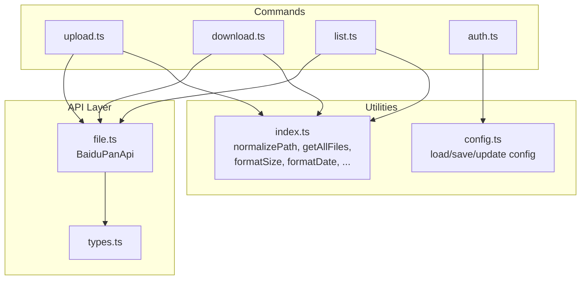
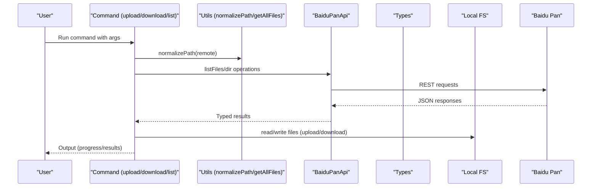
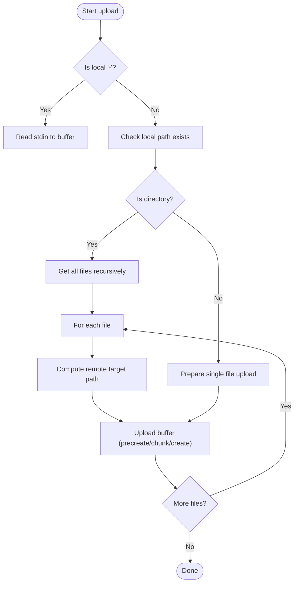
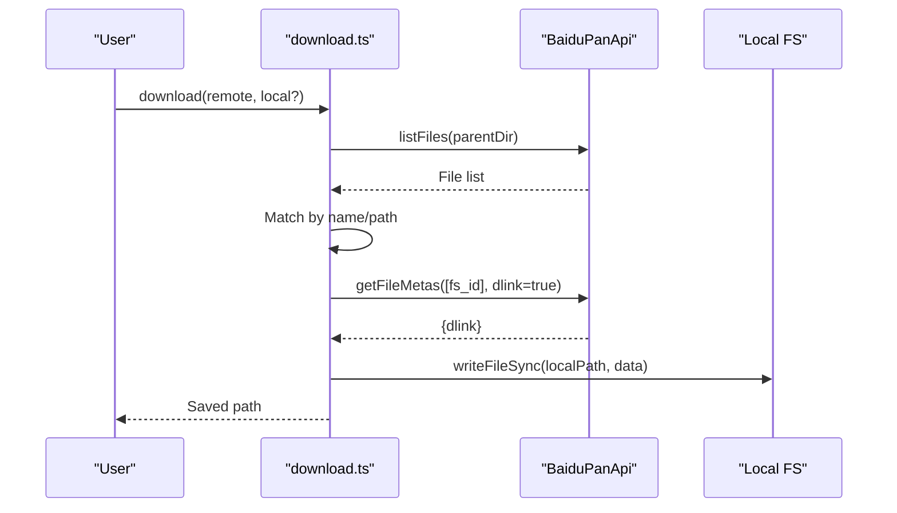
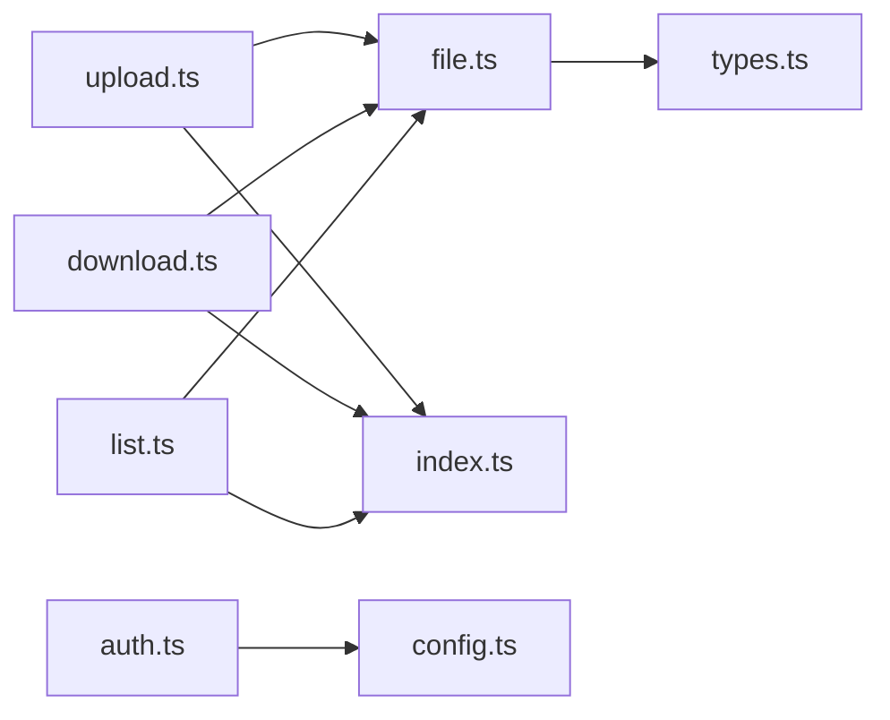

# Directory Operations

<cite>
**Referenced Files in This Document**
- [upload.ts](file://src/commands/upload.ts)
- [download.ts](file://src/commands/download.ts)
- [list.ts](file://src/commands/list.ts)
- [file.ts](file://src/api/file.ts)
- [types.ts](file://src/api/types.ts)
- [index.ts](file://src/utils/index.ts)
- [config.ts](file://src/utils/config.ts)
- [auth.ts](file://src/commands/auth.ts)
- [README.md](file://README.md)
- [package.json](file://package.json)
</cite>

## Table of Contents
1. [Introduction](#introduction)
2. [Project Structure](#project-structure)
3. [Core Components](#core-components)
4. [Architecture Overview](#architecture-overview)
5. [Detailed Component Analysis](#detailed-component-analysis)
6. [Dependency Analysis](#dependency-analysis)
7. [Performance Considerations](#performance-considerations)
8. [Troubleshooting Guide](#troubleshooting-guide)
9. [Conclusion](#conclusion)
10. [Appendices](#appendices)

## Introduction
This document explains directory management operations in the CLI tool for Baidu Pan. It focuses on recursive directory traversal, path normalization, metadata handling, directory creation, directory listing with sorting, and bulk operations. It also covers integration with file listing APIs, directory creation workflows, and path resolution strategies. Practical examples illustrate recursive uploads and downloads, synchronization patterns, and best practices for managing complex folder hierarchies.

## Project Structure
The project is organized around commands, API wrappers, and utilities:
- Commands: upload, download, list, and auth
- API module: BaiduPanApi wrapper for Baidu Pan REST endpoints
- Utilities: path normalization, recursive file discovery, formatting helpers, and configuration management
- Types: response and request type definitions for the Baidu Pan API

**Diagram sources**
- [upload.ts](file://src/commands/upload.ts#L1-L144)
- [download.ts](file://src/commands/download.ts#L1-L104)
- [list.ts](file://src/commands/list.ts#L1-L81)
- [file.ts](file://src/api/file.ts#L1-L201)
- [types.ts](file://src/api/types.ts#L1-L108)
- [index.ts](file://src/utils/index.ts#L1-L110)
- [config.ts](file://src/utils/config.ts#L1-L62)
- [auth.ts](file://src/commands/auth.ts#L1-L258)

**Section sources**
- [package.json](file://package.json#L1-L81)
- [README.md](file://README.md#L1-L169)

## Core Components
- Path normalization: Ensures remote paths start with a leading slash.
- Recursive directory traversal: Discovers all files under a given directory.
- Metadata handling: Uses Baidu Pan API responses to represent files and directories.
- Directory creation: Thin wrapper around createFile with isdir flag.
- Directory listing: Fetches and sorts directory contents by name, time, or size.
- Bulk operations: Iterates over discovered files to upload/download in batches.

**Section sources**
- [index.ts](file://src/utils/index.ts#L25-L55)
- [file.ts](file://src/api/file.ts#L170-L174)
- [file.ts](file://src/api/file.ts#L39-L60)
- [types.ts](file://src/api/types.ts#L10-L32)

## Architecture Overview
The CLI commands depend on the BaiduPanApi to communicate with Baidu Pan endpoints. Utilities provide cross-cutting concerns like path normalization and recursive file discovery. Authentication stores tokens in a local config file.

**Diagram sources**
- [upload.ts](file://src/commands/upload.ts#L33-L96)
- [download.ts](file://src/commands/download.ts#L25-L102)
- [list.ts](file://src/commands/list.ts#L36-L80)
- [file.ts](file://src/api/file.ts#L39-L60)
- [types.ts](file://src/api/types.ts#L10-L32)
- [index.ts](file://src/utils/index.ts#L25-L55)

## Detailed Component Analysis

### Path Normalization
Purpose: Ensure remote paths start with a leading slash so they are treated as absolute paths on Baidu Pan.

Behavior:
- If the path does not start with "/", prepend "/".
- Otherwise, return unchanged.

Usage:
- Applied to remote paths in upload, download, and list commands.

Complexity:
- O(n) time, O(n) space for string concatenation.

Best practices:
- Always normalize remote paths before API calls.
- Avoid double slashes except at the root.

**Section sources**
- [index.ts](file://src/utils/index.ts#L25-L33)
- [upload.ts](file://src/commands/upload.ts#L38-L38)
- [download.ts](file://src/commands/download.ts#L29-L29)
- [list.ts](file://src/commands/list.ts#L40-L40)

### Recursive Directory Traversal
Purpose: Enumerate all files under a directory tree for bulk operations.

Behavior:
- Reads directory entries with stat info.
- Recursively traverses subdirectories.
- Builds relative paths preserving directory structure.
- Skips non-files (e.g., symlinks) unless intended.

Complexity:
- Time: O(n) over all entries.
- Space: O(d) recursion depth plus O(n) output.

Edge cases:
- Handles missing directories gracefully (caller checks existence).
- Ignores non-file entries.

**Section sources**
- [index.ts](file://src/utils/index.ts#L35-L55)
- [upload.ts](file://src/commands/upload.ts#L56-L80)

### Metadata Handling for Folder Structures
Purpose: Represent Baidu Pan file and directory entries consistently.

Key types:
- FileItem: includes identifiers, path, filename, size, isdir flag, timestamps, and optional thumbnails.
- ListFilesResponse: wraps a list of FileItem.
- FileMeta: includes fs_id, path, filename, size, isdir, optional download link, and timestamps.

Usage:
- listFiles returns FileItem[].
- getFileMetas returns FileMeta[] with optional dlink for downloads.

Notes:
- isdir is numeric; convert to boolean when needed.
- Use server_mtime/server_ctime for sorting and display.

**Section sources**
- [types.ts](file://src/api/types.ts#L10-L32)
- [types.ts](file://src/api/types.ts#L34-L50)
- [file.ts](file://src/api/file.ts#L39-L60)
- [file.ts](file://src/api/file.ts#L65-L74)

### Directory Creation Workflow
Purpose: Create empty directories on Baidu Pan.

Implementation:
- createDir delegates to createFile with isdir=true and size=0.
- Uses the same precreate/create pipeline as files.

Integration:
- Called implicitly when uploading to a non-existent remote directory path.

**Section sources**
- [file.ts](file://src/api/file.ts#L170-L174)
- [file.ts](file://src/api/file.ts#L143-L167)

### Directory Listing with Sorting Options
Purpose: Retrieve and present directory contents with flexible sorting.

Options:
- order: name, time, size
- desc: boolean for descending order
- json: output raw JSON

Behavior:
- Calls listFiles with normalized directory path.
- Formats output with human-readable sizes and dates.
- Supports JSON output for scripting.

**Section sources**
- [list.ts](file://src/commands/list.ts#L36-L80)
- [file.ts](file://src/api/file.ts#L39-L60)
- [index.ts](file://src/utils/index.ts#L7-L23)

### Bulk Directory Operations (Upload)
Purpose: Upload an entire directory tree to Baidu Pan.

Workflow:
- Detect stdin input or local path existence.
- If directory: enumerate files recursively.
- For each file: compute remote target path and upload buffer.
- Uses chunked upload with precreate, chunk upload, and createFile.

Chunking:
- Splits buffers into 4 MB chunks.
- Computes MD5 per chunk.
- Resumes upload by uploading only missing blocks.

Progress:
- Reports chunk upload progress and completion.

**Section sources**
- [upload.ts](file://src/commands/upload.ts#L33-L96)
- [upload.ts](file://src/commands/upload.ts#L98-L144)
- [file.ts](file://src/api/file.ts#L187-L198)
- [file.ts](file://src/api/file.ts#L79-L102)
- [file.ts](file://src/api/file.ts#L107-L138)
- [file.ts](file://src/api/file.ts#L143-L167)

### Integration with File Listing APIs
Purpose: Resolve remote paths and locate files before downloading.

Approach:
- Split remote path into parent directory and filename.
- List parent directory contents.
- Match by server_filename or path.
- Validate item is not a directory.

Metadata retrieval:
- getFileMetas with fs_ids to obtain download links.

**Section sources**
- [download.ts](file://src/commands/download.ts#L25-L102)
- [file.ts](file://src/api/file.ts#L39-L60)
- [file.ts](file://src/api/file.ts#L65-L74)

### Path Resolution Strategies
Purpose: Determine final local destination during download and upload.

Upload:
- If remote ends with "/", append basename of local file.
- Otherwise, treat remote as final path.

Download:
- If local argument is omitted, use current directory.
- If local is a directory, join with remote filename.
- Otherwise, use provided local path.

**Section sources**
- [upload.ts](file://src/commands/upload.ts#L83-L89)
- [download.ts](file://src/commands/download.ts#L67-L74)

### Example Workflows

#### Recursive Upload
- Traverse local directory to discover files.
- For each file, compute relative path and construct remote target.
- Upload buffer in chunks; handle rapid upload if applicable.

**Diagram sources**
- [upload.ts](file://src/commands/upload.ts#L33-L96)
- [upload.ts](file://src/commands/upload.ts#L98-L144)
- [index.ts](file://src/utils/index.ts#L35-L55)

#### Recursive Download
- List parent directory and match target file.
- Obtain download link via metadata.
- Write response body to local path with progress reporting.

**Diagram sources**
- [download.ts](file://src/commands/download.ts#L25-L102)
- [file.ts](file://src/api/file.ts#L39-L60)
- [file.ts](file://src/api/file.ts#L65-L74)

#### Directory Synchronization Pattern
- Compare local directory tree with remote directory tree.
- For each mismatch:
  - Upload missing files (recursive).
  - Delete extra remote files.
  - Skip identical files (by size/time comparison).
- Use listFiles with order and desc for deterministic diffs.

[No sources needed since this section provides conceptual workflow]

## Dependency Analysis
- Commands depend on BaiduPanApi for all network operations.
- Utilities are shared across commands for path normalization and file discovery.
- Types define the contract between API responses and command logic.
- Authentication writes tokens to a local config file for subsequent requests.

**Diagram sources**
- [upload.ts](file://src/commands/upload.ts#L1-L144)
- [download.ts](file://src/commands/download.ts#L1-L104)
- [list.ts](file://src/commands/list.ts#L1-L81)
- [file.ts](file://src/api/file.ts#L1-L201)
- [types.ts](file://src/api/types.ts#L1-L108)
- [index.ts](file://src/utils/index.ts#L1-L110)
- [auth.ts](file://src/commands/auth.ts#L1-L258)
- [config.ts](file://src/utils/config.ts#L1-L62)

**Section sources**
- [package.json](file://package.json#L49-L53)

## Performance Considerations
- Chunk size: 4 MB chunks balance throughput and memory usage.
- Rapid upload: precreate returns return_type=2 when eligible; skip chunk upload and create.
- Progress reporting: minimal overhead via stderr updates.
- Recursive traversal: O(n) scan; avoid deep recursion by using iterative alternatives if needed.
- Sorting: server-side ordering reduces client-side overhead.

[No sources needed since this section provides general guidance]

## Troubleshooting Guide
Common issues and resolutions:
- Remote path formatting: Ensure paths start with "/" after normalization.
- Directory vs file: Verify isdir flag before attempting download.
- Missing files: Confirm listFiles results include the target by name or path.
- Authentication: Tokens saved locally; ensure config exists and is readable.
- Network errors: Retry on transient failures; check proxy settings.

**Section sources**
- [index.ts](file://src/utils/index.ts#L25-L33)
- [download.ts](file://src/commands/download.ts#L38-L51)
- [file.ts](file://src/api/file.ts#L39-L60)
- [config.ts](file://src/utils/config.ts#L16-L30)

## Conclusion
The CLI provides robust directory management through:
- Consistent path normalization
- Recursive traversal for bulk operations
- Strong typing for metadata
- Efficient chunked uploads with resume capability
- Flexible directory listing with sorting
These capabilities enable reliable recursive uploads/downloads and synchronization patterns for complex folder hierarchies.

[No sources needed since this section summarizes without analyzing specific files]

## Appendices

### Best Practices for Managing Complex Folder Hierarchies
- Normalize all remote paths before API calls.
- Use listFiles with order=time and desc=true to detect recent changes.
- Prefer directory creation before bulk uploads to minimize API calls.
- Implement idempotent sync: compare sizes/timestamps and skip identical files.
- Stream large downloads to avoid excessive memory usage.

[No sources needed since this section provides general guidance]
