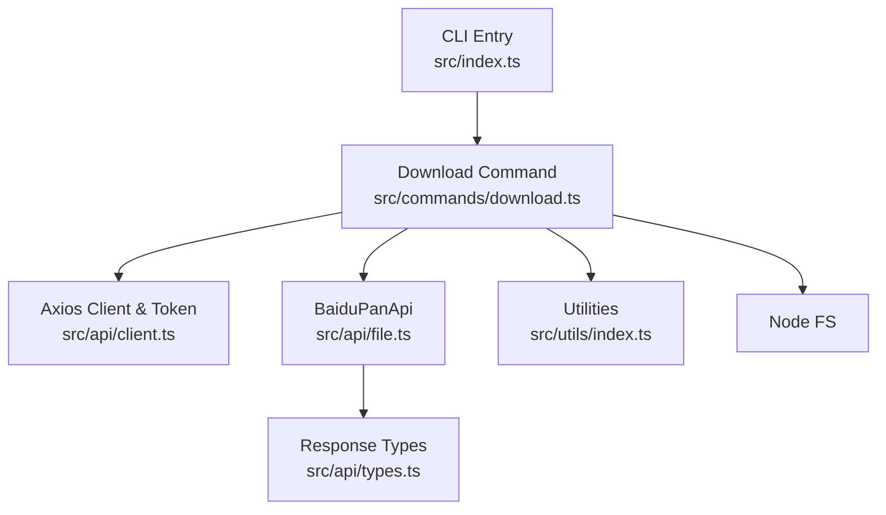
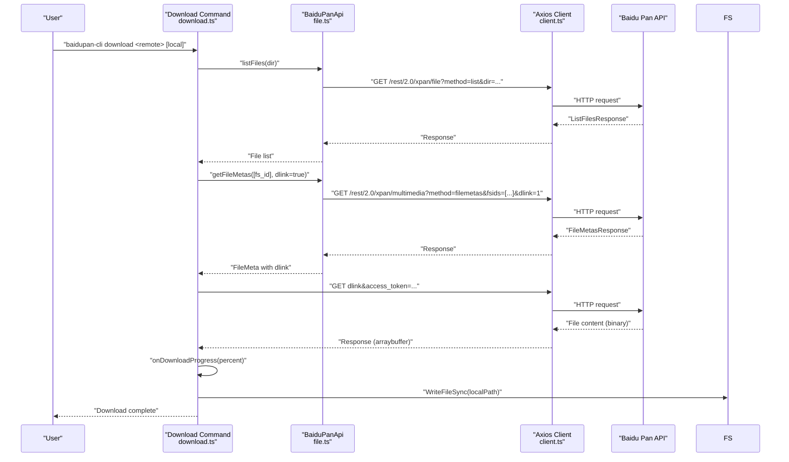
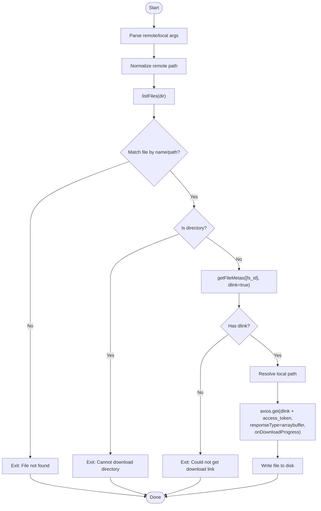
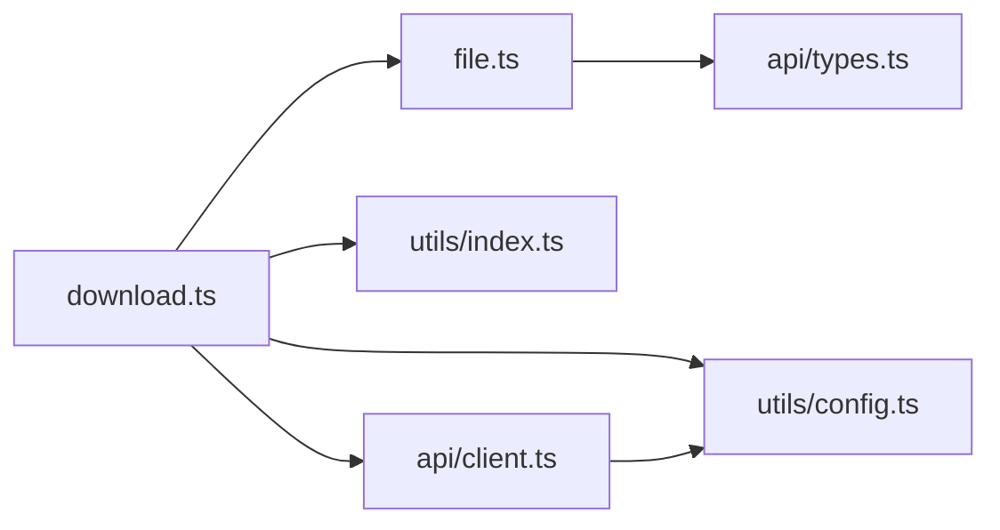

# Download Process

<cite>
**Referenced Files in This Document**
- [src/index.ts](file://src/index.ts)
- [src/commands/download.ts](file://src/commands/download.ts)
- [src/api/file.ts](file://src/api/file.ts)
- [src/api/client.ts](file://src/api/client.ts)
- [src/api/types.ts](file://src/api/types.ts)
- [src/utils/index.ts](file://src/utils/index.ts)
- [src/utils/config.ts](file://src/utils/config.ts)
- [README.md](file://README.md)
- [package.json](file://package.json)
</cite>

## Table of Contents
1. [Introduction](#introduction)
2. [Project Structure](#project-structure)
3. [Core Components](#core-components)
4. [Architecture Overview](#architecture-overview)
5. [Detailed Component Analysis](#detailed-component-analysis)
6. [Dependency Analysis](#dependency-analysis)
7. [Performance Considerations](#performance-considerations)
8. [Troubleshooting Guide](#troubleshooting-guide)
9. [Conclusion](#conclusion)
10. [Appendices](#appendices)

## Introduction
This document explains the download process functionality of the Baidu Pan CLI. It covers how the tool retrieves file metadata, extracts download links, performs progressive downloads with progress tracking, integrates with Baidu Pan endpoints, handles authentication, and recovers from errors. It also outlines strategies for resuming interrupted downloads, concurrent downloads, and bandwidth optimization, along with examples for single-file and batch-style operations.

## Project Structure
The download feature is implemented as a command-line subcommand that orchestrates:
- Command parsing and execution
- File discovery via directory listing
- Metadata retrieval for download links
- HTTP download with progress reporting
- Local file writing

**Diagram sources**
- [src/index.ts](file://src/index.ts#L8-L23)
- [src/commands/download.ts](file://src/commands/download.ts#L25-L102)
- [src/api/client.ts](file://src/api/client.ts#L112-L161)
- [src/api/file.ts](file://src/api/file.ts#L16-L74)
- [src/utils/index.ts](file://src/utils/index.ts#L1-L110)
- [src/api/types.ts](file://src/api/types.ts#L1-L108)

**Section sources**
- [src/index.ts](file://src/index.ts#L8-L23)
- [README.md](file://README.md#L91-L114)

## Core Components
- Download command: parses arguments, resolves target file, fetches metadata, downloads, and writes to disk.
- BaiduPanApi: wraps Baidu Pan REST endpoints, including file listing and metadata retrieval.
- Axios client: manages base URL, access token injection, and automatic token refresh on expiration.
- Utilities: path normalization, size formatting, progress printing, and directory traversal helpers.

Key responsibilities:
- File discovery: list directory contents and match the target file by name or path.
- Metadata retrieval: request file metadata with download link generation.
- Download execution: stream download with progress callback and write to local file.
- Authentication: inject access token into requests and refresh when needed.

**Section sources**
- [src/commands/download.ts](file://src/commands/download.ts#L25-L102)
- [src/api/file.ts](file://src/api/file.ts#L42-L74)
- [src/api/client.ts](file://src/api/client.ts#L112-L161)
- [src/utils/index.ts](file://src/utils/index.ts#L28-L109)

## Architecture Overview
The download pipeline integrates CLI commands, API clients, and Baidu Pan endpoints. The flow below maps the actual code paths.

**Diagram sources**
- [src/commands/download.ts](file://src/commands/download.ts#L38-L96)
- [src/api/file.ts](file://src/api/file.ts#L42-L74)
- [src/api/client.ts](file://src/api/client.ts#L112-L161)

## Detailed Component Analysis

### Download Command Workflow
The command orchestrates discovery, metadata retrieval, download, and persistence.

**Diagram sources**
- [src/commands/download.ts](file://src/commands/download.ts#L25-L102)

**Section sources**
- [src/commands/download.ts](file://src/commands/download.ts#L25-L102)

### File Metadata Retrieval (getFileMetas)
- Purpose: Retrieve file metadata including the direct download link (dlink).
- Endpoint: GET /rest/2.0/xpan/multimedia?method=filemetas&fsids=[...]&dlink=1.
- Response: FileMetasResponse with list of FileMeta items containing dlink.

Behavior:
- Accepts an array of fs_id values.
- Returns dlink when enabled via dlink parameter.

**Section sources**
- [src/api/file.ts](file://src/api/file.ts#L65-L74)
- [src/api/types.ts](file://src/api/types.ts#L48-L50)

### Download Link Extraction and Authentication
- The command obtains dlink from getFileMetas and appends the access token as a query parameter.
- The Axios client injects the access token globally and refreshes it automatically when encountering token-related errors.

Key points:
- Access token resolution order: environment variable > config file.
- Token refresh uses the OpenAPI OAuth endpoint with stored refresh token and app credentials.

**Section sources**
- [src/commands/download.ts](file://src/commands/download.ts#L79-L89)
- [src/api/client.ts](file://src/api/client.ts#L15-L44)
- [src/api/client.ts](file://src/api/client.ts#L112-L161)

### Progressive Download and Progress Tracking
- Axios supports onDownloadProgress with loaded/total metrics.
- The command computes percentage and writes to stderr to avoid interfering with stdout logs.

Implementation highlights:
- Uses responseType: 'arraybuffer' to receive binary data.
- Writes progress percentage to stderr during download.

**Section sources**
- [src/commands/download.ts](file://src/commands/download.ts#L79-L91)

### Resume Capability
Current implementation:
- Single-shot download with no built-in resume logic.
- No local checkpointing or partial file handling.

Recommended enhancements (conceptual):
- Verify local file size against total and compare with Content-Range if supported.
- Use Range requests to resume from last byte.
- Maintain a temporary resume marker until completion.

[No sources needed since this section proposes conceptual enhancements]

### Concurrent Download Strategies
Current implementation:
- Single file download per invocation.

Recommended enhancements (conceptual):
- Parallelize independent file downloads with bounded concurrency.
- Use worker pools to manage concurrent requests and backpressure.
- Implement retry with exponential backoff per file.

[No sources needed since this section proposes conceptual enhancements]

### Bandwidth Optimization Techniques
Current implementation:
- No explicit throttling or adaptive bitrate.

Recommended enhancements (conceptual):
- Introduce rate limiting or chunked reads to cap memory usage.
- Adjust chunk sizes dynamically based on network conditions.
- Enable compression negotiation if supported by endpoints.

[No sources needed since this section proposes conceptual enhancements]

### Integration with Baidu Pan Endpoints
- Base URL: https://pan.baidu.com
- File listing: /rest/2.0/xpan/file?method=list
- File metadata: /rest/2.0/xpan/multimedia?method=filemetas
- Token refresh: https://openapi.baidu.com/oauth/2.0/token

Error handling:
- Intercepts Baidu API error codes and maps them to user-friendly messages.
- Automatically retries failed requests after token refresh.

**Section sources**
- [src/api/client.ts](file://src/api/client.ts#L6-L7)
- [src/api/client.ts](file://src/api/client.ts#L112-L161)
- [src/api/types.ts](file://src/api/types.ts#L99-L107)

### Error Recovery Mechanisms
- Token expiration detection and automatic refresh.
- Request retry with updated token.
- Graceful exit on fatal errors (file not found, invalid directory, missing dlink).

Operational guidance:
- Ensure access token is present via environment or config.
- Confirm network connectivity and absence of proxies blocking requests.

**Section sources**
- [src/api/client.ts](file://src/api/client.ts#L134-L149)
- [src/commands/download.ts](file://src/commands/download.ts#L43-L62)

### Examples

#### Single File Download
- Download to current directory: baidupan-cli download /remote/file.txt
- Download to a specific file path: baidupan-cli download /remote/file.txt ./local-file.txt
- Download to a directory (filename preserved): baidupan-cli download /remote/file.txt ./downloads/

Notes:
- Remote path must start with "/".
- Local directory resolution is handled automatically.

**Section sources**
- [README.md](file://README.md#L95-L104)
- [src/commands/download.ts](file://src/commands/download.ts#L67-L74)

#### Batch Download Operations
- The current command operates on a single file per invocation.
- To achieve batch-like behavior, invoke the command multiple times or wrap it in a shell loop.

Recommendation:
- Iterate over a list of remote paths and call the download command for each item.
- Optionally, introduce a new batch subcommand that orchestrates multiple downloads with concurrency limits.

[No sources needed since this section proposes conceptual enhancements]

### Performance Tuning for Large File Transfers
- Monitor progress via stderr to estimate throughput.
- Avoid proxy interference by setting proxy: false in Axios configuration.
- Keep access token fresh to prevent repeated authentication failures.
- For future enhancements, consider chunked streaming and backpressure controls.

**Section sources**
- [src/commands/download.ts](file://src/commands/download.ts#L84-L91)
- [src/api/client.ts](file://src/api/client.ts#L112-L122)

## Dependency Analysis
The download command depends on:
- BaiduPanApi for listing files and retrieving metadata.
- Axios client for HTTP transport and token management.
- Utilities for path normalization and size formatting.
- Node FS for writing downloaded content.

**Diagram sources**
- [src/commands/download.ts](file://src/commands/download.ts#L5-L7)
- [src/api/file.ts](file://src/api/file.ts#L1-L11)
- [src/api/types.ts](file://src/api/types.ts#L1-L10)
- [src/utils/index.ts](file://src/utils/index.ts#L1-L10)
- [src/utils/config.ts](file://src/utils/config.ts#L1-L14)
- [src/api/client.ts](file://src/api/client.ts#L1-L4)

**Section sources**
- [src/commands/download.ts](file://src/commands/download.ts#L5-L7)
- [src/api/file.ts](file://src/api/file.ts#L1-L11)
- [src/api/types.ts](file://src/api/types.ts#L1-L10)
- [src/utils/index.ts](file://src/utils/index.ts#L1-L10)
- [src/utils/config.ts](file://src/utils/config.ts#L1-L14)
- [src/api/client.ts](file://src/api/client.ts#L1-L4)

## Performance Considerations
- Progress reporting is lightweight and avoids heavy computation.
- Binary downloads use arraybuffer; consider streaming for very large files if extending functionality.
- Token refresh is automatic but adds overhead on expiration; keep tokens valid to minimize refresh attempts.
- Network timeouts and proxy settings are configured at the client level to ensure predictable behavior.

[No sources needed since this section provides general guidance]

## Troubleshooting Guide
Common issues and resolutions:
- Access token not found: Provide BAIDU_ACCESS_TOKEN via environment or configure via auth command.
- Token expired or invalid: The client automatically refreshes; ensure BAIDU_REFRESH_TOKEN and app credentials are set.
- File not found: Verify remote path format and existence in the specified directory.
- Directory provided: The command refuses to download directories; specify a file path.
- Network errors: Ensure no proxy is blocking requests; confirm base URL accessibility.

**Section sources**
- [src/api/client.ts](file://src/api/client.ts#L15-L44)
- [src/api/client.ts](file://src/api/client.ts#L134-L149)
- [src/commands/download.ts](file://src/commands/download.ts#L43-L51)

## Conclusion
The download process leverages Baidu Pan’s file metadata endpoint to obtain a direct download link, authenticates via an access token, and streams content to disk while reporting progress. While the current implementation focuses on single-file downloads, the underlying architecture supports extension for resume, concurrency, and bandwidth optimization. Proper configuration of tokens and awareness of error handling ensure reliable operation across diverse environments.

[No sources needed since this section summarizes without analyzing specific files]

## Appendices

### API Definitions and Contracts
- File listing: GET /rest/2.0/xpan/file?method=list&dir={path}
- File metadata: GET /rest/2.0/xpan/multimedia?method=filemetas&fsids=[...]&dlink=1
- Token refresh: GET https://openapi.baidu.com/oauth/2.0/token?grant_type=refresh_token&...

**Section sources**
- [src/api/file.ts](file://src/api/file.ts#L42-L74)
- [src/api/client.ts](file://src/api/client.ts#L74-L104)

### Environment Variables and Configuration
- BAIDU_APP_KEY, BAIDU_SECRET_KEY, BAIDU_ACCESS_TOKEN, BAIDU_REFRESH_TOKEN
- Config file location: platform-specific home directory under .baidupan-cli/config.json

**Section sources**
- [src/api/client.ts](file://src/api/client.ts#L21-L32)
- [src/utils/config.ts](file://src/utils/config.ts#L5-L61)
