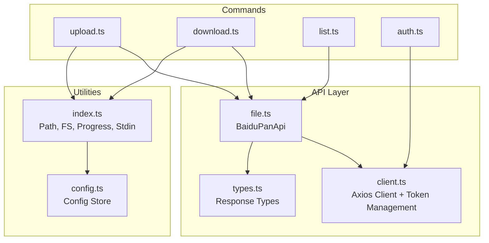
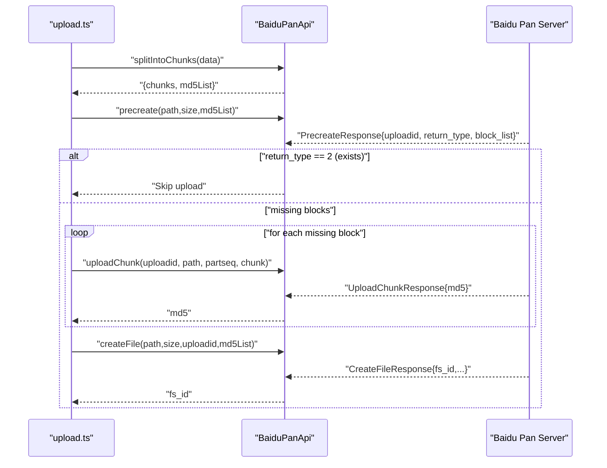
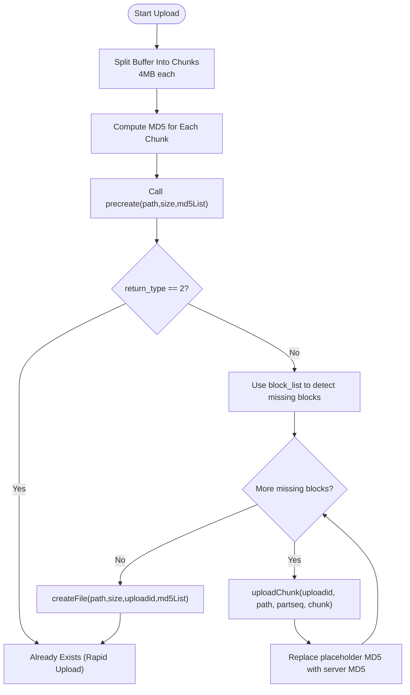
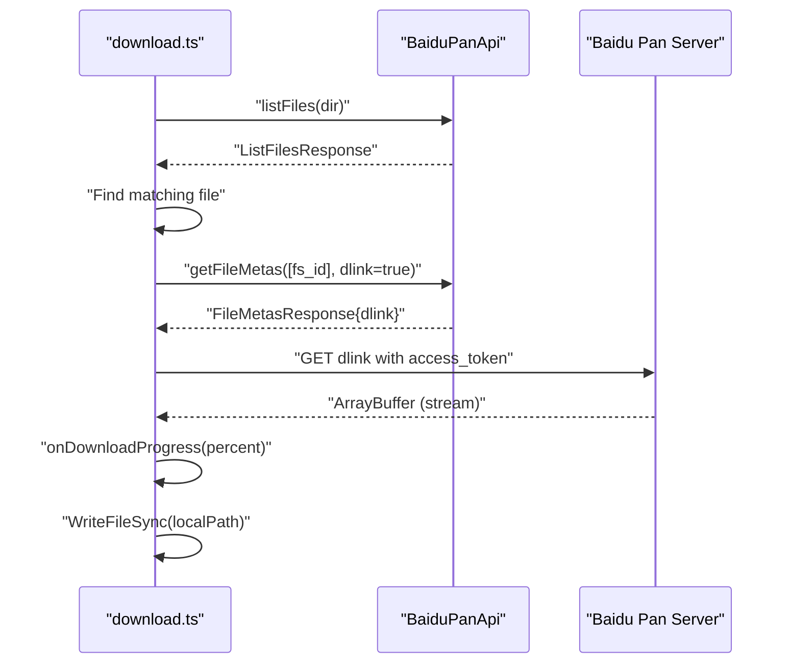
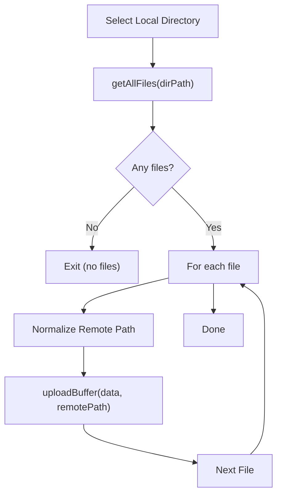
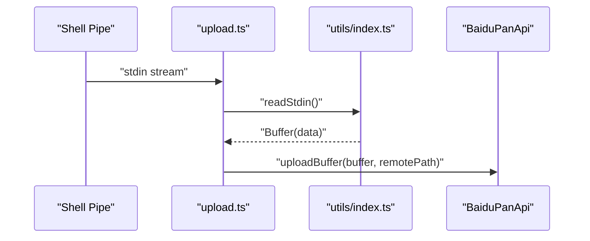
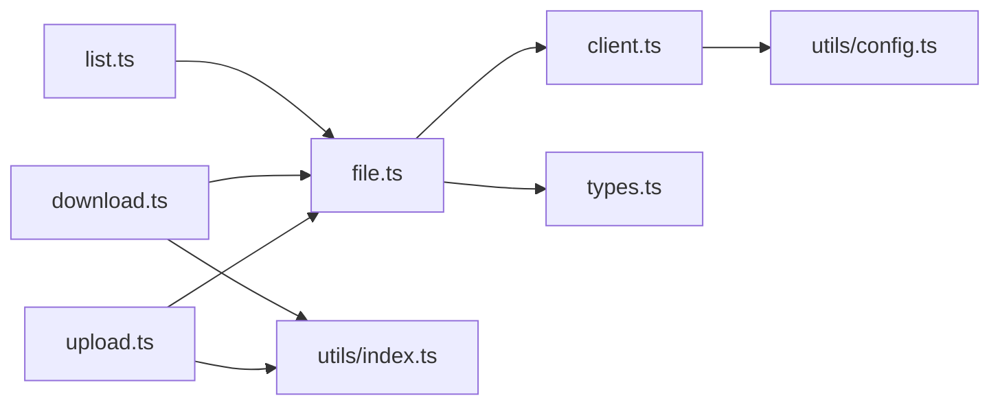

# File Operations

<cite>
**Referenced Files in This Document**
- [upload.ts](file://src/commands/upload.ts)
- [download.ts](file://src/commands/download.ts)
- [file.ts](file://src/api/file.ts)
- [client.ts](file://src/api/client.ts)
- [index.ts](file://src/utils/index.ts)
- [types.ts](file://src/api/types.ts)
- [config.ts](file://src/utils/config.ts)
- [list.ts](file://src/commands/list.ts)
- [auth.ts](file://src/commands/auth.ts)
- [README.md](file://README.md)
</cite>

## Table of Contents
1. [Introduction](#introduction)
2. [Project Structure](#project-structure)
3. [Core Components](#core-components)
4. [Architecture Overview](#architecture-overview)
5. [Detailed Component Analysis](#detailed-component-analysis)
6. [Dependency Analysis](#dependency-analysis)
7. [Performance Considerations](#performance-considerations)
8. [Troubleshooting Guide](#troubleshooting-guide)
9. [Conclusion](#conclusion)
10. [Appendices](#appendices)

## Introduction
This document explains the file operation capabilities of the CLI tool, focusing on:
- Chunked upload mechanism for large files, including 4 MB chunk size strategy, precreate API usage, missing chunk detection, and MD5 verification process
- Download process with progress tracking and resume capability
- Directory operations including recursive uploads/downloads, path normalization, and metadata handling
- File system integration patterns, standard input handling for pipe operations
- Performance optimization techniques
- Examples of bulk operations, error recovery mechanisms, and best practices for managing large files and directories

## Project Structure
The file operation logic is organized around:
- Commands: upload, download, list, auth
- API layer: BaiduPanApi with typed responses
- Utilities: path normalization, recursive file discovery, progress printing, stdin handling
- Client: Axios instance with token management and automatic refresh

**Diagram sources**
- [upload.ts](file://src/commands/upload.ts#L1-L144)
- [download.ts](file://src/commands/download.ts#L1-L104)
- [file.ts](file://src/api/file.ts#L1-L201)
- [client.ts](file://src/api/client.ts#L1-L171)
- [index.ts](file://src/utils/index.ts#L1-L110)
- [types.ts](file://src/api/types.ts#L1-L108)
- [config.ts](file://src/utils/config.ts#L1-L62)

**Section sources**
- [upload.ts](file://src/commands/upload.ts#L1-L144)
- [download.ts](file://src/commands/download.ts#L1-L104)
- [file.ts](file://src/api/file.ts#L1-L201)
- [client.ts](file://src/api/client.ts#L1-L171)
- [index.ts](file://src/utils/index.ts#L1-L110)
- [types.ts](file://src/api/types.ts#L1-L108)
- [config.ts](file://src/utils/config.ts#L1-L62)

## Core Components
- BaiduPanApi: Implements upload precreate, chunk upload, file creation, directory creation, file listing, and metadata retrieval
- Upload command: Orchestrates chunked upload, handles stdin, directories, and prints progress
- Download command: Resolves remote file, retrieves metadata with download link, streams with progress, and writes to disk
- Utilities: Path normalization, recursive file discovery, progress bar, stdin buffering
- Client: Axios instance with interceptors for token retrieval, refresh, and error mapping

**Section sources**
- [file.ts](file://src/api/file.ts#L16-L175)
- [upload.ts](file://src/commands/upload.ts#L33-L143)
- [download.ts](file://src/commands/download.ts#L25-L101)
- [index.ts](file://src/utils/index.ts#L27-L109)
- [client.ts](file://src/api/client.ts#L112-L161)

## Architecture Overview
The upload flow follows a three-stage pipeline:
1) Precreate: server responds with upload ID and list of missing blocks
2) Upload chunks: iterate over missing blocks and upload each chunk
3) Create file: finalize with combined MD5 list

**Diagram sources**
- [upload.ts](file://src/commands/upload.ts#L98-L143)
- [file.ts](file://src/api/file.ts#L79-L167)
- [file.ts](file://src/api/file.ts#L187-L198)

**Section sources**
- [upload.ts](file://src/commands/upload.ts#L98-L143)
- [file.ts](file://src/api/file.ts#L79-L167)
- [file.ts](file://src/api/file.ts#L187-L198)

## Detailed Component Analysis

### Chunked Upload Mechanism
- 4 MB chunk size: enforced via constant and chunk splitting
- MD5 calculation per chunk: used for precreate and verification
- Precreate API: requests server to initialize upload and return missing blocks
- Missing chunk detection: server returns block_list indicating which parts need uploading
- MD5 verification: server validates each uploaded chunk and returns MD5; client replaces placeholder MD5 with server-provided MD5

**Diagram sources**
- [file.ts](file://src/api/file.ts#L13-L14)
- [file.ts](file://src/api/file.ts#L187-L198)
- [file.ts](file://src/api/file.ts#L79-L102)
- [file.ts](file://src/api/file.ts#L107-L138)
- [file.ts](file://src/api/file.ts#L143-L167)
- [upload.ts](file://src/commands/upload.ts#L106-L140)

**Section sources**
- [file.ts](file://src/api/file.ts#L13-L14)
- [file.ts](file://src/api/file.ts#L187-L198)
- [file.ts](file://src/api/file.ts#L79-L102)
- [file.ts](file://src/api/file.ts#L107-L138)
- [file.ts](file://src/api/file.ts#L143-L167)
- [upload.ts](file://src/commands/upload.ts#L106-L140)

### Download Process with Progress Tracking
- Resolve remote file by listing directory and matching filename or path
- Retrieve file metadata with download link (dlink)
- Stream download with progress percentage printed to stderr
- Write to local path (auto-append filename if destination is a directory)

**Diagram sources**
- [download.ts](file://src/commands/download.ts#L25-L96)
- [file.ts](file://src/api/file.ts#L42-L60)
- [file.ts](file://src/api/file.ts#L65-L74)

**Section sources**
- [download.ts](file://src/commands/download.ts#L25-L96)
- [file.ts](file://src/api/file.ts#L42-L60)
- [file.ts](file://src/api/file.ts#L65-L74)

### Directory Operations
- Recursive upload: discover all files under a directory and upload each file individually
- Path normalization: ensure remote paths start with "/"
- Metadata handling: list files, match by name or path, and extract fs_id for metadata retrieval

**Diagram sources**
- [upload.ts](file://src/commands/upload.ts#L56-L80)
- [index.ts](file://src/utils/index.ts#L38-L55)
- [index.ts](file://src/utils/index.ts#L28-L33)

**Section sources**
- [upload.ts](file://src/commands/upload.ts#L56-L80)
- [index.ts](file://src/utils/index.ts#L38-L55)
- [index.ts](file://src/utils/index.ts#L28-L33)

### Standard Input Handling for Pipe Operations
- Read stdin until EOF, concatenate chunks into a single Buffer
- Treat stdin input as a single file upload with provided remote path
- Supports piping data from external tools into the CLI

**Diagram sources**
- [upload.ts](file://src/commands/upload.ts#L42-L47)
- [index.ts](file://src/utils/index.ts#L79-L93)
- [upload.ts](file://src/commands/upload.ts#L98-L143)

**Section sources**
- [upload.ts](file://src/commands/upload.ts#L42-L47)
- [index.ts](file://src/utils/index.ts#L79-L93)
- [upload.ts](file://src/commands/upload.ts#L98-L143)

### Resume Capability
- The upload flow uses precreate to detect missing blocks and only uploads what is needed
- MD5 verification ensures integrity; server returns MD5 per chunk
- No explicit resume across separate runs is implemented; however, the precreate mechanism avoids redundant uploads for partially uploaded files

**Section sources**
- [file.ts](file://src/api/file.ts#L79-L102)
- [file.ts](file://src/api/file.ts#L107-L138)
- [upload.ts](file://src/commands/upload.ts#L110-L140)

### Bulk Operations
- Directory upload: enumerate files recursively and upload each file sequentially
- File listing: list directory contents with sorting and pagination support
- Example usage patterns are documented in the project README

**Section sources**
- [upload.ts](file://src/commands/upload.ts#L56-L80)
- [list.ts](file://src/commands/list.ts#L36-L79)
- [README.md](file://README.md#L72-L104)

## Dependency Analysis
- upload.ts depends on BaiduPanApi for chunked upload orchestration and on utilities for path normalization and progress
- download.ts depends on BaiduPanApi for listing and metadata retrieval, and on axios for streaming downloads
- BaiduPanApi depends on Axios client for HTTP requests and on typed response interfaces
- client.ts manages token lifecycle and retries for expired tokens
- utils/index.ts provides cross-cutting concerns for filesystem and I/O operations

**Diagram sources**
- [upload.ts](file://src/commands/upload.ts#L1-L14)
- [download.ts](file://src/commands/download.ts#L1-L7)
- [list.ts](file://src/commands/list.ts#L1-L4)
- [file.ts](file://src/api/file.ts#L1-L11)
- [client.ts](file://src/api/client.ts#L1-L4)
- [index.ts](file://src/utils/index.ts#L1-L2)
- [config.ts](file://src/utils/config.ts#L1-L3)

**Section sources**
- [upload.ts](file://src/commands/upload.ts#L1-L14)
- [download.ts](file://src/commands/download.ts#L1-L7)
- [list.ts](file://src/commands/list.ts#L1-L4)
- [file.ts](file://src/api/file.ts#L1-L11)
- [client.ts](file://src/api/client.ts#L1-L4)
- [index.ts](file://src/utils/index.ts#L1-L2)
- [config.ts](file://src/utils/config.ts#L1-L3)

## Performance Considerations
- 4 MB chunk size reduces overhead while enabling efficient parallelization and retry strategies
- MD5 computation per chunk enables fast duplicate detection and integrity checks
- Streaming downloads with progress reduce memory footprint during transfers
- Recursive directory traversal is synchronous; consider asynchronous traversal for very large directory trees
- Token refresh is automatic; ensure network connectivity and token validity to avoid retries

[No sources needed since this section provides general guidance]

## Troubleshooting Guide
- Authentication failures: verify access token presence and refresh token availability; the client attempts automatic refresh and retry
- Token expiration errors: the interceptor detects specific error codes and triggers token refresh
- File not found: ensure remote path normalization and correct directory listing before resolving target file
- Network issues: confirm connectivity to Baidu Pan endpoints and absence of proxy interference
- Large file uploads: monitor progress and ensure sufficient time for completion; precreate helps avoid redundant uploads

**Section sources**
- [client.ts](file://src/api/client.ts#L134-L149)
- [client.ts](file://src/api/client.ts#L106-L110)
- [download.ts](file://src/commands/download.ts#L38-L46)
- [README.md](file://README.md#L135-L154)

## Conclusion
The CLI provides robust file operations leveraging Baidu Pan’s chunked upload protocol. It supports:
- Reliable chunked uploads with precreate and MD5 verification
- Progress tracking and resume-friendly behavior via missing block detection
- Directory recursion and path normalization
- Standard input handling for pipe-based workflows
- Strong error handling and token lifecycle management

These capabilities enable efficient and resilient management of large files and directories.

[No sources needed since this section summarizes without analyzing specific files]

## Appendices

### API Workflow Reference
- Upload: precreate -> uploadChunk x N -> create
- Download: listFiles -> getFileMetas -> GET dlink -> write file

**Section sources**
- [file.ts](file://src/api/file.ts#L79-L167)
- [download.ts](file://src/commands/download.ts#L38-L96)

### Best Practices
- Normalize remote paths to ensure leading slash
- Use directory upload for bulk operations to leverage recursive discovery
- Prefer piping from stdin for ephemeral data or continuous streams
- Monitor progress and handle interruptions gracefully; rely on precreate for minimal re-upload

**Section sources**
- [index.ts](file://src/utils/index.ts#L28-L33)
- [upload.ts](file://src/commands/upload.ts#L56-L80)
- [upload.ts](file://src/commands/upload.ts#L42-L47)