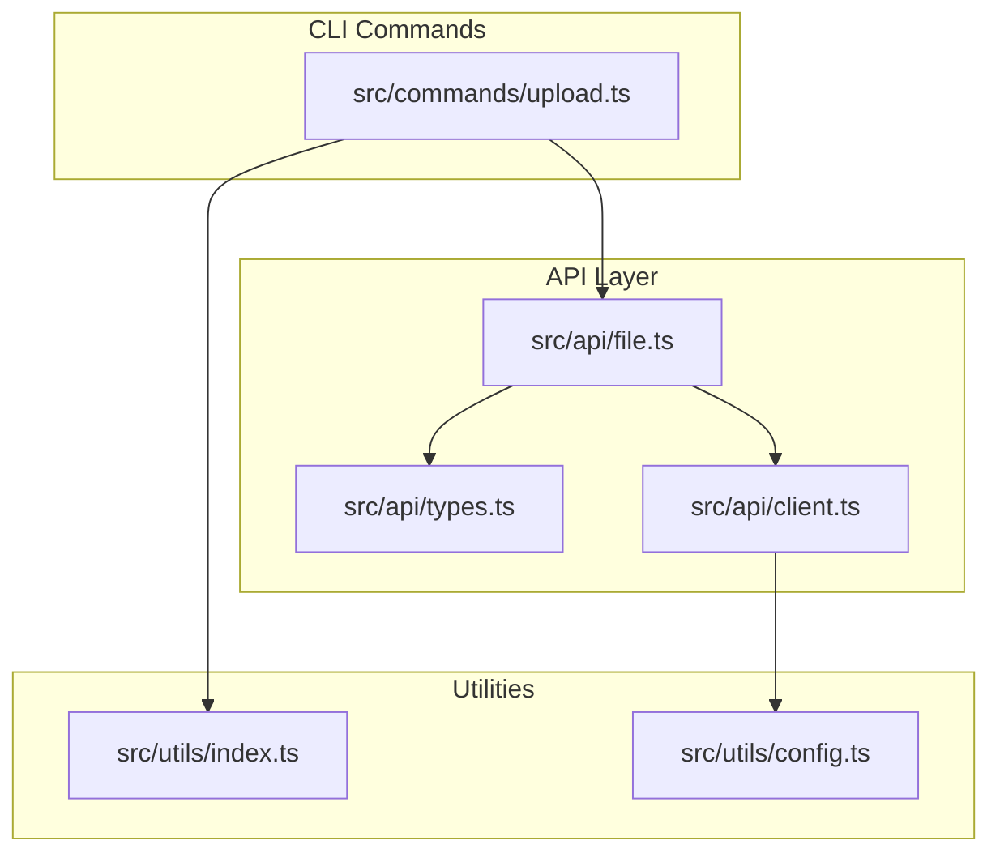
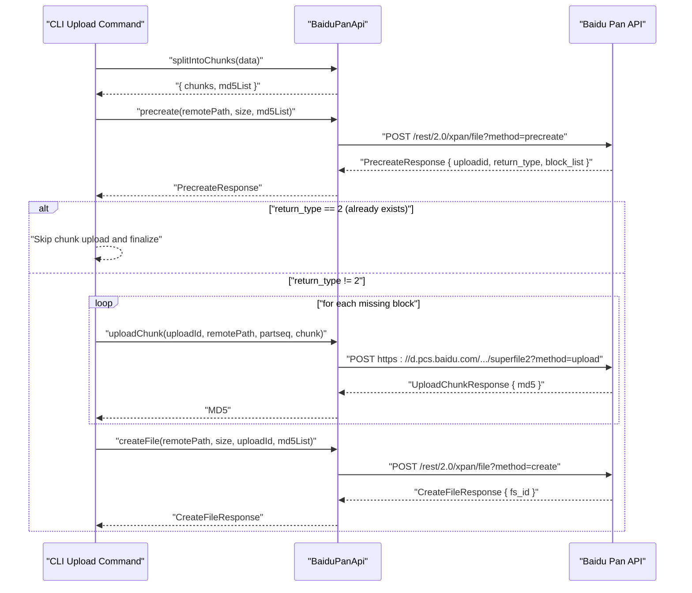
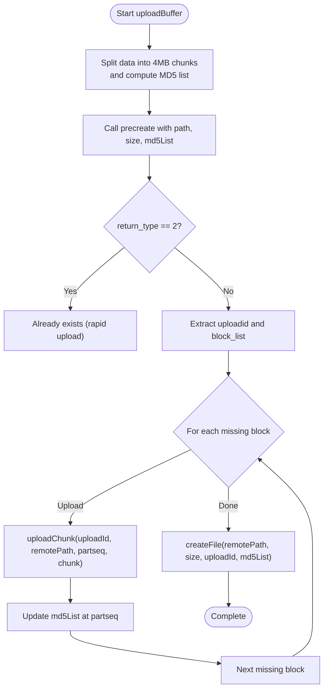
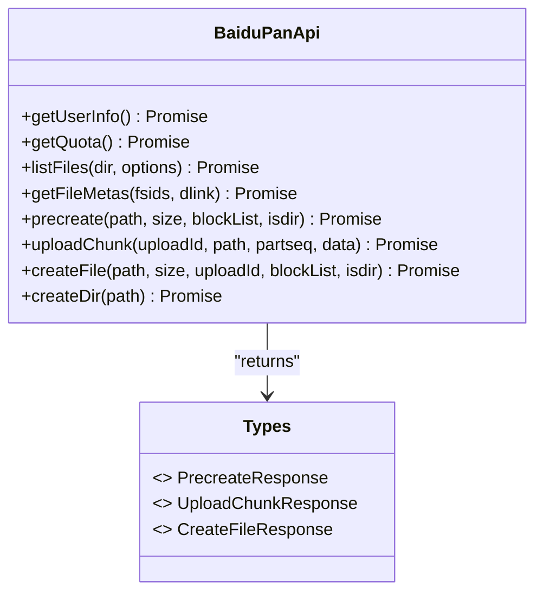
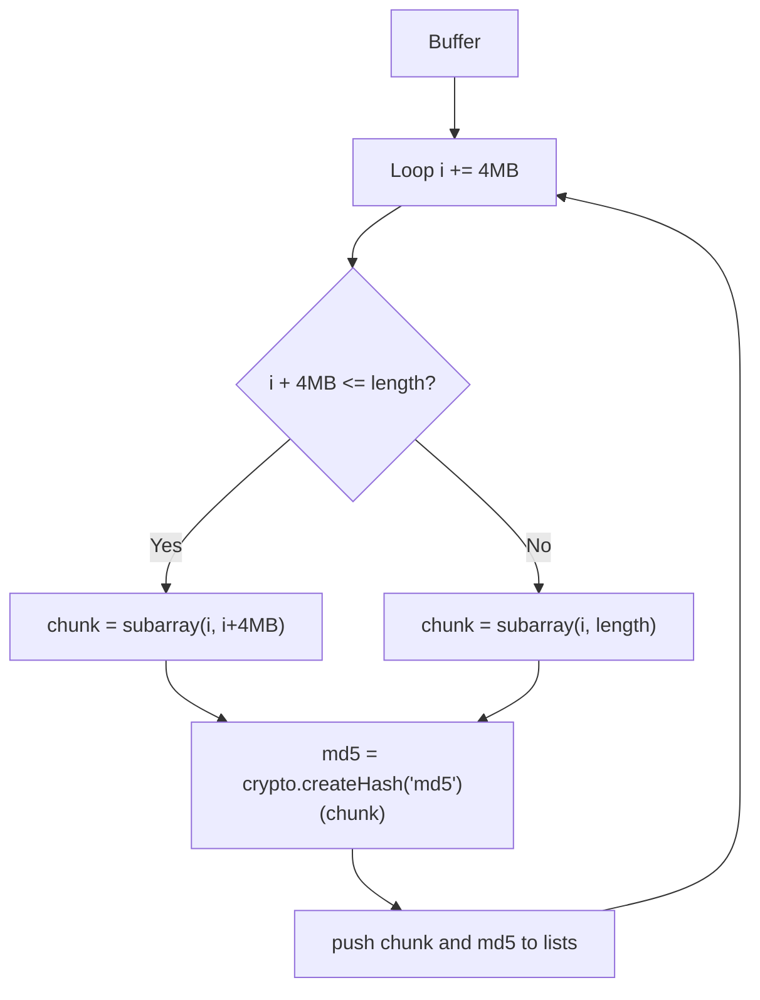
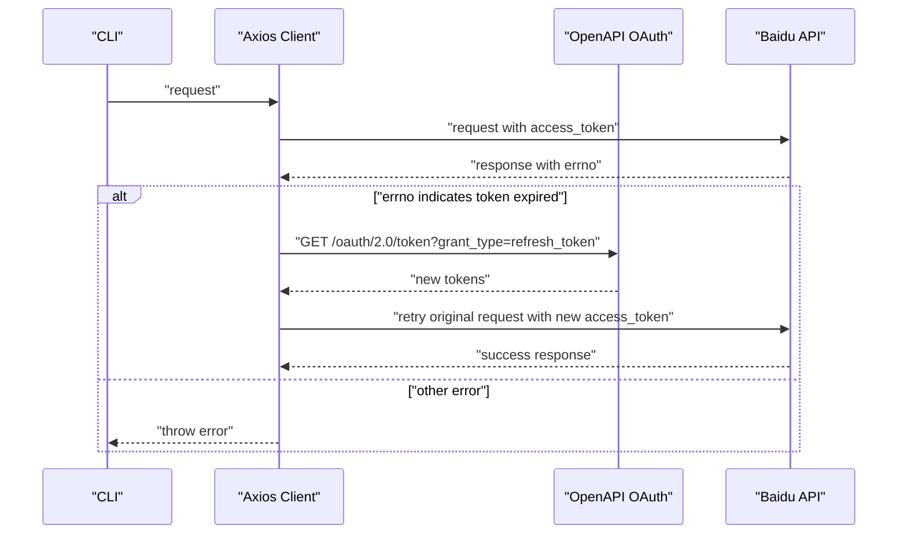
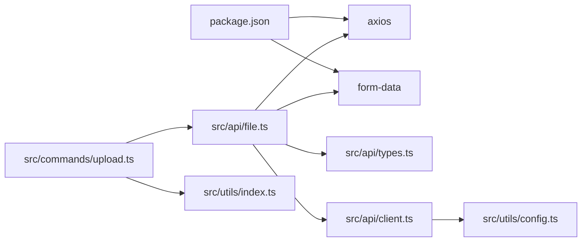

# Upload Mechanics

<cite>
**Referenced Files in This Document**
- [upload.ts](file://src/commands/upload.ts)
- [file.ts](file://src/api/file.ts)
- [types.ts](file://src/api/types.ts)
- [client.ts](file://src/api/client.ts)
- [index.ts](file://src/utils/index.ts)
- [config.ts](file://src/utils/config.ts)
- [README.md](file://README.md)
- [package.json](file://package.json)
</cite>

## Table of Contents
1. [Introduction](#introduction)
2. [Project Structure](#project-structure)
3. [Core Components](#core-components)
4. [Architecture Overview](#architecture-overview)
5. [Detailed Component Analysis](#detailed-component-analysis)
6. [Dependency Analysis](#dependency-analysis)
7. [Performance Considerations](#performance-considerations)
8. [Troubleshooting Guide](#troubleshooting-guide)
9. [Conclusion](#conclusion)
10. [Appendices](#appendices)

## Introduction
This document explains the upload mechanics of the Baidu Pan CLI tool, focusing on the chunked upload system with a fixed 4 MB chunk size strategy. It covers the complete workflow from file splitting to final file creation, including precreate initialization, missing chunk detection, MD5 verification, and error handling. It also provides practical examples, performance optimization tips, and best practices for managing upload failures and network interruptions.

## Project Structure
The upload functionality spans several modules:
- Command layer: parses CLI arguments and orchestrates the upload process
- API layer: wraps Baidu Pan REST endpoints for precreate, chunk upload, and file creation
- Utilities: file system helpers, path normalization, progress reporting, and MD5 calculation
- Authentication and client: manages access tokens, retries, and request/response interception

**Diagram sources**
- [upload.ts](file://src/commands/upload.ts#L1-L144)
- [file.ts](file://src/api/file.ts#L1-L201)
- [types.ts](file://src/api/types.ts#L1-L108)
- [client.ts](file://src/api/client.ts#L1-L171)
- [index.ts](file://src/utils/index.ts#L1-L110)
- [config.ts](file://src/utils/config.ts#L1-L62)

**Section sources**
- [upload.ts](file://src/commands/upload.ts#L1-L144)
- [file.ts](file://src/api/file.ts#L1-L201)
- [index.ts](file://src/utils/index.ts#L1-L110)
- [client.ts](file://src/api/client.ts#L1-L171)
- [types.ts](file://src/api/types.ts#L1-L108)
- [config.ts](file://src/utils/config.ts#L1-L62)
- [README.md](file://README.md#L1-L169)

## Core Components
- Chunked upload orchestration: splits files into 4 MB chunks, computes MD5 per chunk, initializes upload via precreate, uploads only missing chunks, and finalizes with createFile
- BaiduPanApi: encapsulates Baidu Pan REST endpoints for precreate, uploadChunk, and createFile
- MD5 and chunking utilities: calculates MD5 hashes and slices buffers into fixed-size chunks
- Progress reporting: displays a progress bar during chunk uploads
- Authentication and retry: automatic token refresh and request retry on token expiration

**Section sources**
- [upload.ts](file://src/commands/upload.ts#L98-L143)
- [file.ts](file://src/api/file.ts#L13-L201)
- [index.ts](file://src/utils/index.ts#L98-L110)
- [client.ts](file://src/api/client.ts#L112-L161)

## Architecture Overview
The upload workflow follows a three-phase process:
1. Precreate: initializes the upload session and returns the upload ID and a list of missing block indices
2. Chunk upload: iterates through missing blocks, uploading each chunk and collecting MD5 results
3. Create file: finalizes the upload by combining all uploaded chunks into the target file

**Diagram sources**
- [upload.ts](file://src/commands/upload.ts#L106-L143)
- [file.ts](file://src/api/file.ts#L79-L167)

## Detailed Component Analysis

### Chunked Upload Orchestration
The CLI command orchestrates the entire upload lifecycle:
- Reads input (file, directory, or stdin)
- Splits data into 4 MB chunks and computes MD5 per chunk
- Calls precreate to initialize the upload and determine missing blocks
- Uploads only missing blocks and collects MD5 results
- Finalizes the upload with createFile

**Diagram sources**
- [upload.ts](file://src/commands/upload.ts#L98-L143)
- [file.ts](file://src/api/file.ts#L187-L198)

**Section sources**
- [upload.ts](file://src/commands/upload.ts#L98-L143)

### BaiduPanApi: Precreate, Chunk Upload, and Create File
- Precreate: sends path, size, autoinit flag, block_list, and return type configuration; expects uploadid and block_list indicating missing chunks
- uploadChunk: constructs a multipart/form-data payload with the chunk data and uploads to the PCS endpoint with uploadid and partseq parameters
- createFile: finalizes the upload by combining all uploaded chunks into the target file

**Diagram sources**
- [file.ts](file://src/api/file.ts#L16-L175)
- [types.ts](file://src/api/types.ts#L52-L71)

**Section sources**
- [file.ts](file://src/api/file.ts#L79-L167)
- [types.ts](file://src/api/types.ts#L52-L71)

### MD5 and Chunking Utilities
- MD5 calculation: uses Node’s crypto module to compute hex-encoded MD5 of each chunk
- Chunk splitting: iterates over the buffer in 4 MB increments, slicing subarrays and computing MD5 for each

**Diagram sources**
- [file.ts](file://src/api/file.ts#L187-L198)

**Section sources**
- [file.ts](file://src/api/file.ts#L187-L198)

### Progress Reporting and Path Normalization
- Progress bar: prints a dynamic progress bar to stderr with percentage and counters
- Path normalization: ensures remote paths start with a leading slash

**Section sources**
- [index.ts](file://src/utils/index.ts#L98-L110)
- [index.ts](file://src/utils/index.ts#L28-L33)

### Authentication and Token Management
- Access token resolution: checks environment variables first, then falls back to local config
- Request interceptor: attaches access_token to requests and handles token expiration
- Response interceptor: throws errors for non-zero errno and maps known error codes
- Automatic token refresh: attempts to refresh expired tokens using refresh_token and app credentials

**Diagram sources**
- [client.ts](file://src/api/client.ts#L112-L161)
- [client.ts](file://src/api/client.ts#L63-L104)

**Section sources**
- [client.ts](file://src/api/client.ts#L15-L44)
- [client.ts](file://src/api/client.ts#L112-L161)
- [config.ts](file://src/utils/config.ts#L19-L54)

## Dependency Analysis
The upload mechanics depend on:
- Axios for HTTP requests and interceptors
- form-data for multipart/form-data payloads
- Node crypto for MD5 hashing
- Local configuration for tokens and credentials

**Diagram sources**
- [package.json](file://package.json#L49-L53)
- [upload.ts](file://src/commands/upload.ts#L1-L14)
- [file.ts](file://src/api/file.ts#L1-L11)
- [client.ts](file://src/api/client.ts#L1-L4)
- [config.ts](file://src/utils/config.ts#L1-L62)
- [index.ts](file://src/utils/index.ts#L1-L3)

**Section sources**
- [package.json](file://package.json#L49-L53)
- [upload.ts](file://src/commands/upload.ts#L1-L14)
- [file.ts](file://src/api/file.ts#L1-L11)

## Performance Considerations
- Fixed chunk size: 4 MB ensures predictable upload behavior and efficient missing chunk detection
- MD5 per chunk: enables fast verification and avoids redundant uploads
- Minimal overhead: only missing chunks are uploaded; already present chunks are skipped
- Streaming-friendly: chunked upload reduces memory pressure compared to uploading entire files at once
- Network resilience: automatic token refresh and request retry improve reliability under transient failures

[No sources needed since this section provides general guidance]

## Troubleshooting Guide
Common issues and resolutions:
- Access token errors: the client detects token expiration and attempts to refresh; ensure refresh_token and app credentials are configured
- API errors: non-zero errno values are mapped to descriptive messages; check error codes and adjust parameters accordingly
- Large file uploads: monitor progress and ensure sufficient disk space; consider splitting very large files manually if needed
- Network interruptions: the chunked approach allows resuming after partial uploads; re-run the upload command to detect and upload missing chunks

**Section sources**
- [client.ts](file://src/api/client.ts#L124-L150)
- [types.ts](file://src/api/types.ts#L99-L108)
- [README.md](file://README.md#L135-L154)

## Conclusion
The upload mechanics implement a robust, chunked upload strategy with MD5 verification and intelligent missing chunk detection. The precreate phase initializes the upload and identifies missing blocks, while the chunk upload phase efficiently transfers only required data. The createFile phase finalizes the operation and produces the target file. The system integrates seamlessly with Baidu Pan’s API and includes strong error handling and token management for reliable operation.

[No sources needed since this section summarizes without analyzing specific files]

## Appendices

### Upload Workflow Example: Large File
- Input: a large file larger than 4 MB
- Steps:
  1. Split into 4 MB chunks and compute MD5 list
  2. Call precreate; if return_type equals 2, skip chunk upload and finalize
  3. Otherwise, iterate through missing blocks and upload each chunk
  4. Collect MD5 results and call createFile to finalize

**Section sources**
- [upload.ts](file://src/commands/upload.ts#L106-L143)
- [file.ts](file://src/api/file.ts#L187-L198)

### Best Practices for Managing Failures and Network Interruptions
- Re-run the upload command to resume: the system detects missing chunks and re-uploads only those
- Monitor progress: use the progress bar to track upload status
- Ensure stable connectivity: minimize network interruptions during chunk uploads
- Verify MD5 correctness: rely on server-provided MD5 responses to confirm successful uploads

**Section sources**
- [upload.ts](file://src/commands/upload.ts#L123-L131)
- [file.ts](file://src/api/file.ts#L107-L138)
