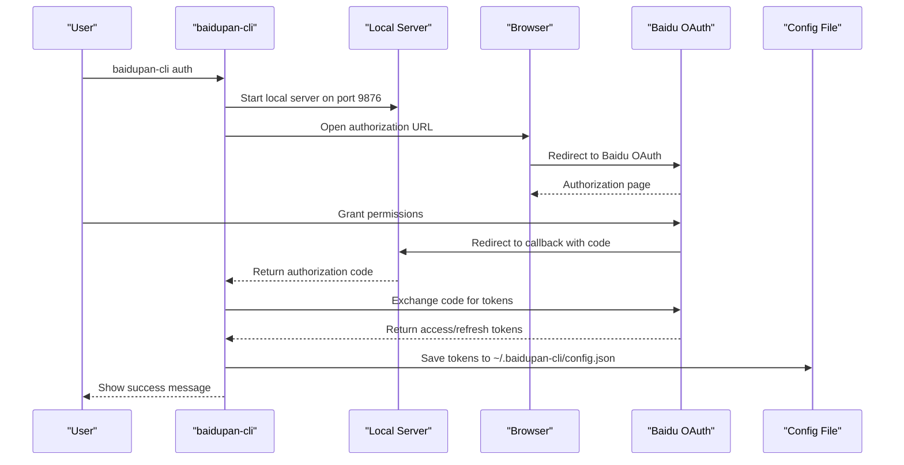
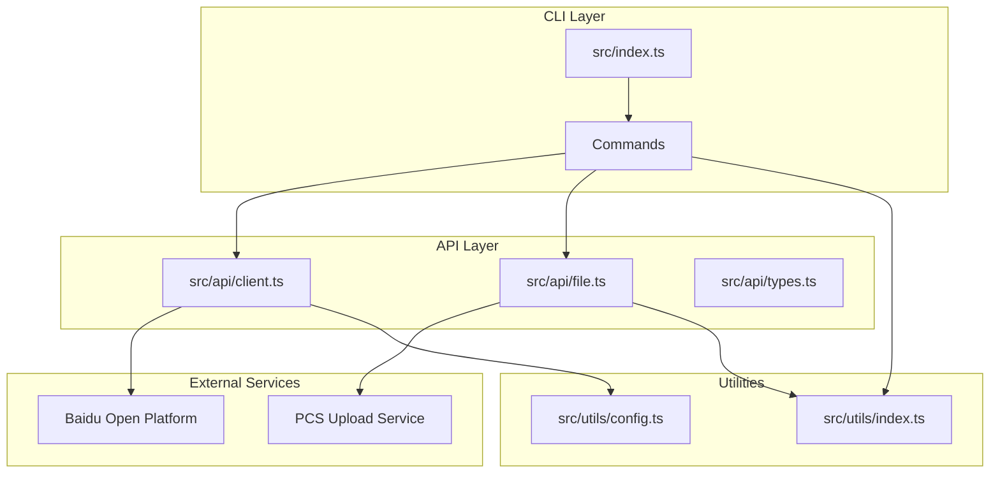

# Getting Started

<cite>
**Referenced Files in This Document**
- [package.json](file://package.json)
- [README.md](file://README.md)
- [src/index.ts](file://src/index.ts)
- [src/commands/auth.ts](file://src/commands/auth.ts)
- [src/api/client.ts](file://src/api/client.ts)
- [src/utils/config.ts](file://src/utils/config.ts)
- [src/api/file.ts](file://src/api/file.ts)
- [src/commands/list.ts](file://src/commands/list.ts)
- [src/commands/upload.ts](file://src/commands/upload.ts)
- [src/commands/download.ts](file://src/commands/download.ts)
- [src/utils/index.ts](file://src/utils/index.ts)
- [example/README.md](file://example/README.md)
</cite>

## Table of Contents
1. [Introduction](#introduction)
2. [Prerequisites](#prerequisites)
3. [Installation](#installation)
4. [First-Time Setup](#first-time-setup)
5. [OAuth Authentication Workflow](#oauth-authentication-workflow)
6. [Initial Configuration Commands](#initial-configuration-commands)
7. [Environment Variables](#environment-variables)
8. [Basic Usage Examples](#basic-usage-examples)
9. [Architecture Overview](#architecture-overview)
10. [Troubleshooting Guide](#troubleshooting-guide)
11. [Conclusion](#conclusion)

## Introduction
baidupan-cli is a command-line tool for managing Baidu Pan (Baidu NetDisk) files. It allows you to upload, download, list, and manage files directly from your terminal. The tool handles OAuth authentication, token management, and provides a simple interface for common file operations.

## Prerequisites
Before installing baidupan-cli, ensure you have:

- **Node.js**: Version 16 or higher (recommended: latest LTS)
- **npm** or **pnpm**: Package manager for installation
- **Internet access**: To connect with Baidu Open Platform APIs
- **Web browser**: Required for OAuth authorization flow

## Installation
Install baidupan-cli globally using either npm or pnpm:

### Using npm
```bash
npm install -g baidupan-cli
```

### Using pnpm
```bash
pnpm add -g baidupan-cli
```

Verify installation:
```bash
baidupan-cli --version
```

**Section sources**
- [package.json](file://package.json#L1-L81)
- [README.md](file://README.md#L7-L15)

## First-Time Setup
Before using baidupan-cli, you need to authorize it with your Baidu account. The tool requires OAuth credentials from Baidu Open Platform.

### Step 1: Obtain Baidu Developer Credentials
1. Visit the [Baidu Pan Open Platform](https://pan.baidu.com/union/console/applist)
2. Create a new application to get your `App Key` and `Secret Key`
3. Add the redirect URI: `http://localhost:9876/callback`

### Step 2: Run Authorization
You have two options for providing credentials:

#### Option A: Command Line Arguments
```bash
baidupan-cli auth -k <your-app-key> -s <your-secret-key>
```

#### Option B: Environment Variables
```bash
export BAIDU_APP_KEY=<your-app-key>
export BAIDU_SECRET_KEY=<your-secret-key>
baidupan-cli auth
```

**Section sources**
- [README.md](file://README.md#L17-L41)
- [src/commands/auth.ts](file://src/commands/auth.ts#L46-L63)

## OAuth Authentication Workflow
The authentication process follows these steps:



**Diagram sources**
- [src/commands/auth.ts](file://src/commands/auth.ts#L93-L159)
- [src/api/client.ts](file://src/api/client.ts#L112-L161)
- [src/utils/config.ts](file://src/utils/config.ts#L35-L45)

### Authentication Details
- **Default Port**: 9876 (configurable via `--port` flag)
- **Default Redirect Path**: `/callback`
- **Required Scopes**: `basic,netdisk`
- **Timeout**: 5 minutes for authorization

**Section sources**
- [src/commands/auth.ts](file://src/commands/auth.ts#L8-L11)
- [src/commands/auth.ts](file://src/commands/auth.ts#L130-L147)

## Initial Configuration Commands
After successful authentication, your tokens are automatically saved to the configuration file. Here are useful commands for initial setup:

### Verify Authentication
```bash
baidupan-cli list
```

### Configure Environment Variables (Optional)
```bash
export BAIDU_APP_KEY=<your-app-key>
export BAIDU_SECRET_KEY=<your-secret-key>
export BAIDU_ACCESS_TOKEN=<your-access-token>
export BAIDU_REFRESH_TOKEN=<your-refresh-token>
```

### Check Configuration Location
- **Windows**: `%USERPROFILE%\.baidupan-cli\config.json`
- **macOS/Linux**: `~/.baidupan-cli/config.json`

**Section sources**
- [README.md](file://README.md#L129-L133)
- [src/utils/config.ts](file://src/utils/config.ts#L5-L6)

## Environment Variables
The tool supports several environment variables for flexible configuration:

| Variable | Description | Required |
|----------|-------------|----------|
| `BAIDU_APP_KEY` | Baidu application key | Yes (for auth) |
| `BAIDU_SECRET_KEY` | Baidu application secret | Yes (for auth) |
| `BAIDU_ACCESS_TOKEN` | Access token for API calls | No (auto-managed) |
| `BAIDU_REFRESH_TOKEN` | Refresh token for auto-renewal | No (auto-managed) |

**Section sources**
- [README.md](file://README.md#L118-L127)
- [src/api/client.ts](file://src/api/client.ts#L15-L44)

## Basic Usage Examples
Once configured, you can use the following commands:

### List Files
```bash
# List root directory
baidupan-cli list

# List specific directory
baidupan-cli list /path/to/directory

# Sort by modification time (descending)
baidupan-cli list / -o time -d

# Output as JSON
baidupan-cli list / --json
```

### Upload Files
```bash
# Upload single file
baidupan-cli upload ./local-file.txt /remote-path/file.txt

# Upload directory
baidupan-cli upload ./local-directory /remote/path/

# Upload from stdin
echo "hello world" | baidupan-cli upload - /remote/hello.txt
```

### Download Files
```bash
# Download to current directory
baidupan-cli download /remote/file.txt

# Download to specific location
baidupan-cli download /remote/file.txt ./local-file.txt

# Download to directory
baidupan-cli download /remote/file.txt ./downloads/
```

**Section sources**
- [README.md](file://README.md#L43-L114)
- [src/commands/list.ts](file://src/commands/list.ts#L36-L79)
- [src/commands/upload.ts](file://src/commands/upload.ts#L33-L95)
- [src/commands/download.ts](file://src/commands/download.ts#L25-L102)

## Architecture Overview
The baidupan-cli follows a modular architecture with clear separation of concerns:



**Diagram sources**
- [src/index.ts](file://src/index.ts#L1-L26)
- [src/api/client.ts](file://src/api/client.ts#L1-L171)
- [src/api/file.ts](file://src/api/file.ts#L1-L201)
- [src/utils/config.ts](file://src/utils/config.ts#L1-L62)

### Command Structure
The CLI exposes the following commands:
- `auth`: OAuth authorization and token management
- `list`/`ls`: List directory contents
- `upload`/`up`: Upload files and directories
- `download`/`dl`: Download files

**Section sources**
- [src/index.ts](file://src/index.ts#L14-L22)

## Troubleshooting Guide

### Common Issues and Solutions

#### Port Conflicts
**Problem**: Authorization fails with "Failed to start server on port"
**Solution**: Change the default port using the `--port` flag
```bash
baidupan-cli auth --port 9877
```

#### Credential Problems
**Problem**: "App Key is required" or "Secret Key is required"
**Solution**: Ensure you've provided valid credentials
```bash
# Check current configuration
cat ~/.baidupan-cli/config.json

# Re-authenticate with correct credentials
baidupan-cli auth -k <correct-app-key> -s <correct-secret-key>
```

#### Network Issues
**Problem**: "Could not open browser automatically"
**Solution**: Manually open the authorization URL
```bash
# The tool will display the authorization URL in the console
# Copy and paste it into your browser manually
```

#### Token Expiration
**Problem**: API calls fail with token errors
**Solution**: The tool automatically refreshes tokens
```bash
# If manual refresh is needed, re-run authentication
baidupan-cli auth -k <app-key> -s <secret-key>
```

#### Permission Issues
**Problem**: "Access denied" or "Invalid access token"
**Solution**: Verify your Baidu account has sufficient permissions
- Check that your application has the correct scopes (`basic,netdisk`)
- Ensure your Baidu account isn't restricted
- Verify the redirect URI matches exactly what's configured

**Section sources**
- [src/commands/auth.ts](file://src/commands/auth.ts#L149-L157)
- [src/api/client.ts](file://src/api/client.ts#L63-L104)
- [README.md](file://README.md#L135-L154)

## Conclusion
baidupan-cli provides a powerful yet simple way to manage your Baidu Pan files from the command line. The OAuth authentication process is straightforward, and the tool handles token management automatically. With proper setup, you can efficiently upload, download, and organize your files without leaving the terminal.

For advanced use cases, consider setting up environment variables for automated scripts or integrating with backup solutions as shown in the example directory.