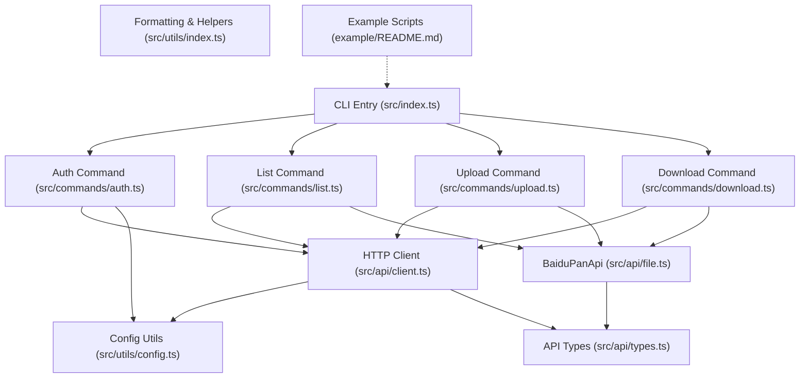
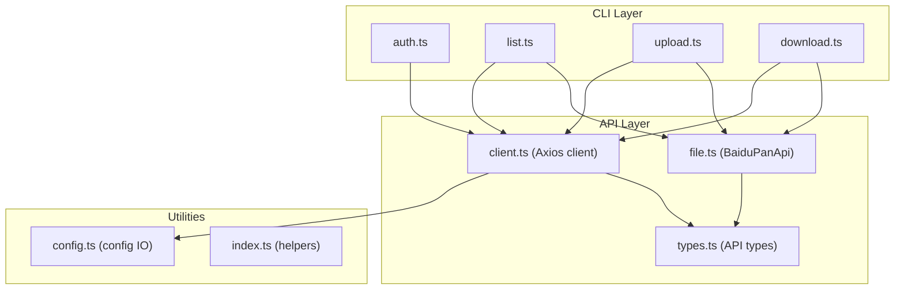
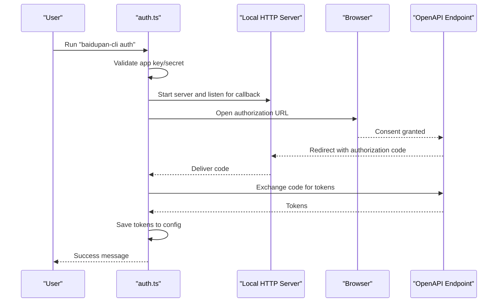
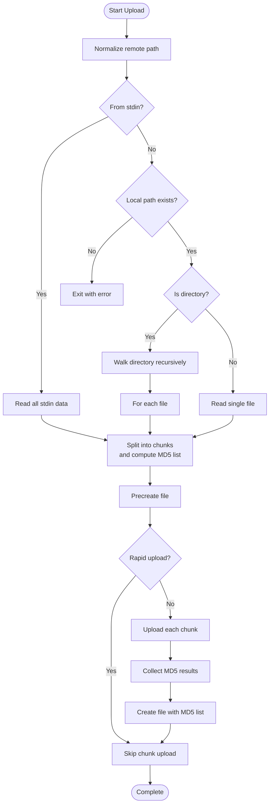
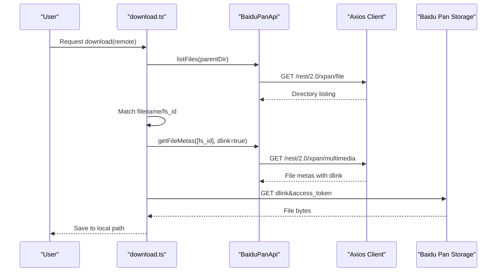
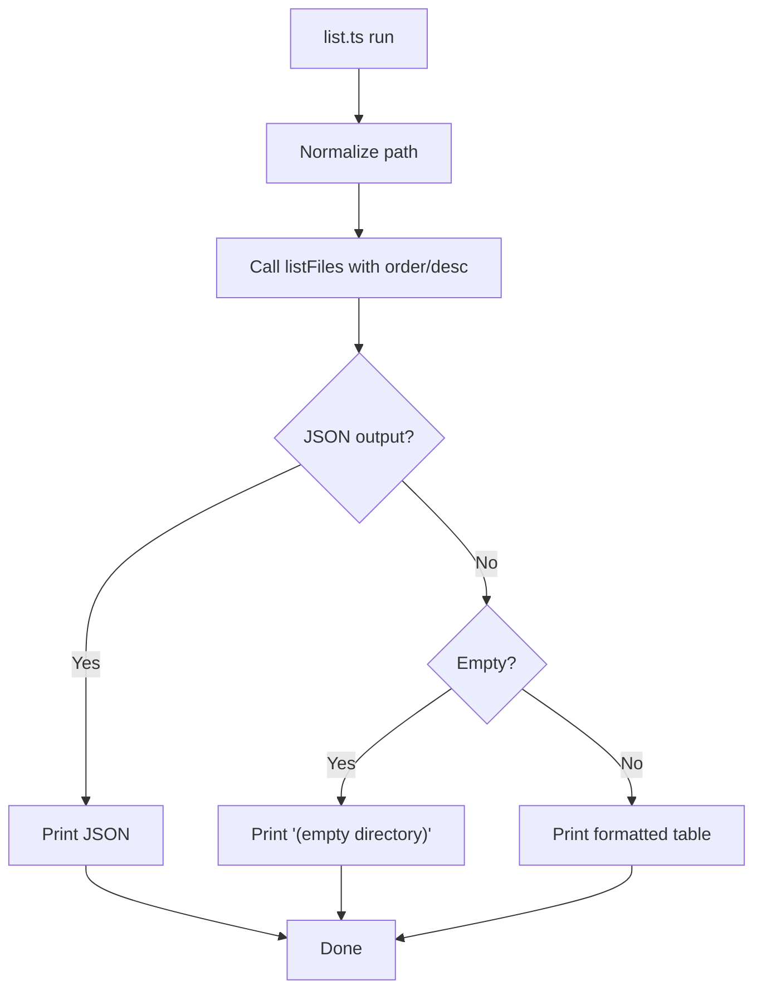
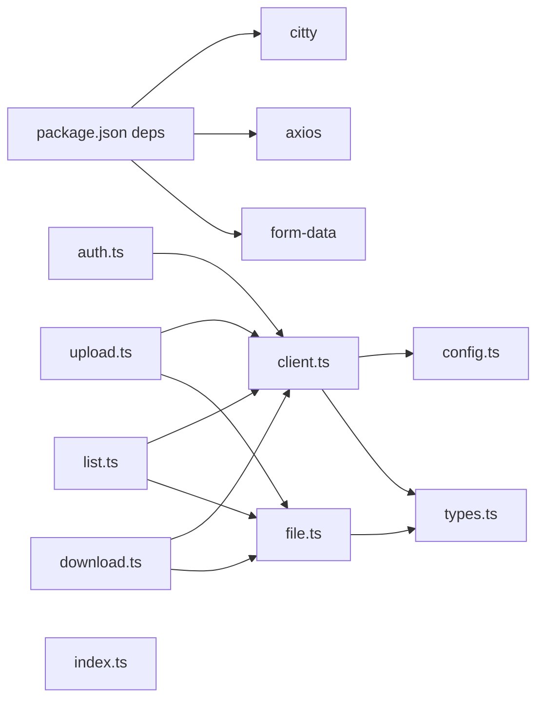

# Project Overview

<cite>
**Referenced Files in This Document**
- [README.md](file://README.md)
- [package.json](file://package.json)
- [src/index.ts](file://src/index.ts)
- [src/commands/auth.ts](file://src/commands/auth.ts)
- [src/commands/list.ts](file://src/commands/list.ts)
- [src/commands/upload.ts](file://src/commands/upload.ts)
- [src/commands/download.ts](file://src/commands/download.ts)
- [src/api/client.ts](file://src/api/client.ts)
- [src/api/file.ts](file://src/api/file.ts)
- [src/api/types.ts](file://src/api/types.ts)
- [src/utils/config.ts](file://src/utils/config.ts)
- [src/utils/index.ts](file://src/utils/index.ts)
- [example/README.md](file://example/README.md)
</cite>

## Table of Contents
1. [Introduction](#introduction)
2. [Project Structure](#project-structure)
3. [Core Components](#core-components)
4. [Architecture Overview](#architecture-overview)
5. [Detailed Component Analysis](#detailed-component-analysis)
6. [Dependency Analysis](#dependency-analysis)
7. [Performance Considerations](#performance-considerations)
8. [Troubleshooting Guide](#troubleshooting-guide)
9. [Conclusion](#conclusion)
10. [Appendices](#appendices)

## Introduction
baidupan-cli is a command-line interface designed to manage Baidu Pan (commonly referred to as Baidu Net Disk) cloud storage. It enables users to authenticate via OAuth 2.0, list directory contents, upload files and directories (including streaming from standard input), and download files. The tool emphasizes reliability for large files by implementing chunked upload with MD5-based block verification and supports automatic token refresh to minimize interruptions.

Target audience:
- Beginners: Users who want a simple, scriptable way to interact with Baidu Pan without a GUI.
- DevOps and power users: Teams automating backups, CI/CD integrations, and scheduled tasks using shell scripts and cron.
- Developers: Contributors who want to extend functionality or integrate Baidu Pan operations into larger systems.

Main benefits:
- Seamless OAuth 2.0 authorization with local callback handling and persistent token storage.
- Robust upload pipeline supporting chunked uploads, rapid upload detection, and progress reporting.
- Flexible listing with sorting and JSON output for scripting.
- Reliable download with metadata retrieval and progress feedback.
- Extensible architecture suitable for automation and integration.

## Project Structure
The project follows a modular, feature-based layout:
- src/index.ts defines the CLI entrypoint and registers subcommands.
- src/commands contains command implementations for auth, list, upload, and download.
- src/api encapsulates HTTP clients and Baidu Pan API abstractions.
- src/utils provides shared utilities for configuration, path normalization, and formatting.
- example includes real-world automation scenarios such as MongoDB backups.

**Diagram sources**
- [src/index.ts](file://src/index.ts#L1-L26)
- [src/commands/auth.ts](file://src/commands/auth.ts#L1-L258)
- [src/commands/list.ts](file://src/commands/list.ts#L1-L81)
- [src/commands/upload.ts](file://src/commands/upload.ts#L1-L144)
- [src/commands/download.ts](file://src/commands/download.ts#L1-L104)
- [src/api/client.ts](file://src/api/client.ts#L1-L171)
- [src/api/file.ts](file://src/api/file.ts#L1-L201)
- [src/api/types.ts](file://src/api/types.ts#L1-L108)
- [src/utils/config.ts](file://src/utils/config.ts#L1-L62)
- [src/utils/index.ts](file://src/utils/index.ts#L1-L110)
- [example/README.md](file://example/README.md#L1-L106)

**Section sources**
- [src/index.ts](file://src/index.ts#L1-L26)
- [package.json](file://package.json#L1-L81)

## Core Components
- CLI entrypoint and routing:
  - Registers subcommands and aliases, delegating to dedicated command modules.
- Authentication (OAuth 2.0):
  - Starts a local HTTP server to receive authorization callbacks, opens the browser for consent, exchanges the authorization code for tokens, and persists them to a secure config file.
- Listing:
  - Retrieves directory listings with optional sorting and JSON output.
- Uploading:
  - Supports single files, directories (recursive), and standard input streams. Implements chunked upload with MD5 calculation per chunk and precreate/create steps.
- Downloading:
  - Resolves file metadata to obtain a download link, streams content to disk, and reports progress.
- API layer:
  - Provides an Axios-based client with automatic token refresh and error handling, plus a typed wrapper around Baidu Pan endpoints.
- Utilities:
  - Path normalization, size/date formatting, recursive directory traversal, and progress rendering.

Practical examples (see also usage in README and example scripts):
- Authorize and persist tokens for local or remote use.
- List a directory with sorting and JSON output for parsing in scripts.
- Upload a directory tree or stream arbitrary data from stdin.
- Download a specific file to a chosen location with progress indication.

**Section sources**
- [src/index.ts](file://src/index.ts#L8-L23)
- [src/commands/auth.ts](file://src/commands/auth.ts#L19-L91)
- [src/commands/list.ts](file://src/commands/list.ts#L36-L80)
- [src/commands/upload.ts](file://src/commands/upload.ts#L33-L96)
- [src/commands/download.ts](file://src/commands/download.ts#L25-L103)
- [src/api/client.ts](file://src/api/client.ts#L112-L161)
- [src/api/file.ts](file://src/api/file.ts#L16-L175)
- [src/utils/index.ts](file://src/utils/index.ts#L27-L109)
- [README.md](file://README.md#L17-L168)
- [example/README.md](file://example/README.md#L1-L106)

## Architecture Overview
High-level design:
- CLI commands depend on a shared HTTP client configured with Baidu Pan endpoints.
- The client enforces access token presence and auto-refreshes expired tokens transparently.
- Commands orchestrate API calls to list, upload (precreate → chunk upload → create), and download files.
- Configuration utilities manage credentials and tokens in a secure local file.

**Diagram sources**
- [src/commands/auth.ts](file://src/commands/auth.ts#L1-L258)
- [src/commands/list.ts](file://src/commands/list.ts#L1-L81)
- [src/commands/upload.ts](file://src/commands/upload.ts#L1-L144)
- [src/commands/download.ts](file://src/commands/download.ts#L1-L104)
- [src/api/client.ts](file://src/api/client.ts#L1-L171)
- [src/api/file.ts](file://src/api/file.ts#L1-L201)
- [src/api/types.ts](file://src/api/types.ts#L1-L108)
- [src/utils/config.ts](file://src/utils/config.ts#L1-L62)
- [src/utils/index.ts](file://src/utils/index.ts#L1-L110)

## Detailed Component Analysis

### OAuth 2.0 Authorization Flow
The auth command implements a complete OAuth 2.0 flow:
- Validates app credentials from arguments or environment variables.
- Starts a local HTTP server to receive the authorization code callback.
- Opens the browser to the authorization endpoint with configured scopes.
- Exchanges the authorization code for tokens and saves them to the config file.
- Prints helpful messages for copying the config or setting environment variables.

**Diagram sources**
- [src/commands/auth.ts](file://src/commands/auth.ts#L46-L91)
- [src/commands/auth.ts](file://src/commands/auth.ts#L93-L159)
- [src/commands/auth.ts](file://src/commands/auth.ts#L161-L192)
- [src/commands/auth.ts](file://src/commands/auth.ts#L218-L257)
- [src/api/client.ts](file://src/api/client.ts#L163-L168)

**Section sources**
- [src/commands/auth.ts](file://src/commands/auth.ts#L19-L91)
- [src/commands/auth.ts](file://src/commands/auth.ts#L93-L159)
- [src/commands/auth.ts](file://src/commands/auth.ts#L161-L192)
- [src/commands/auth.ts](file://src/commands/auth.ts#L218-L257)
- [src/api/client.ts](file://src/api/client.ts#L163-L168)

### Chunked Upload Pipeline
The upload command orchestrates a three-stage process:
- Precreate: Determines whether a rapid upload is possible or prepares upload metadata and block list.
- Chunk upload: Iterates through required blocks, uploading each chunk and collecting MD5 results.
- Create: Finalizes the file creation using aggregated MD5s and metadata.

**Diagram sources**
- [src/commands/upload.ts](file://src/commands/upload.ts#L33-L96)
- [src/commands/upload.ts](file://src/commands/upload.ts#L98-L144)
- [src/api/file.ts](file://src/api/file.ts#L79-L102)
- [src/api/file.ts](file://src/api/file.ts#L107-L138)
- [src/api/file.ts](file://src/api/file.ts#L143-L167)
- [src/api/file.ts](file://src/api/file.ts#L187-L198)

**Section sources**
- [src/commands/upload.ts](file://src/commands/upload.ts#L33-L96)
- [src/commands/upload.ts](file://src/commands/upload.ts#L98-L144)
- [src/api/file.ts](file://src/api/file.ts#L16-L175)
- [src/api/file.ts](file://src/api/file.ts#L187-L198)

### Download Workflow
The download command:
- Resolves the remote path to a specific file by listing the parent directory and matching the filename.
- Retrieves file metadata to obtain a download link.
- Streams the download link (with access token) to disk and prints progress.

**Diagram sources**
- [src/commands/download.ts](file://src/commands/download.ts#L25-L103)
- [src/api/file.ts](file://src/api/file.ts#L42-L60)
- [src/api/file.ts](file://src/api/file.ts#L65-L74)

**Section sources**
- [src/commands/download.ts](file://src/commands/download.ts#L25-L103)
- [src/api/file.ts](file://src/api/file.ts#L42-L74)

### Listing and Sorting
The list command:
- Normalizes the requested directory path.
- Calls the API to list files with configurable order and direction.
- Outputs either a formatted table or JSON for machine consumption.

**Diagram sources**
- [src/commands/list.ts](file://src/commands/list.ts#L36-L80)
- [src/api/file.ts](file://src/api/file.ts#L42-L60)
- [src/utils/index.ts](file://src/utils/index.ts#L27-L23)

**Section sources**
- [src/commands/list.ts](file://src/commands/list.ts#L36-L80)
- [src/api/file.ts](file://src/api/file.ts#L42-L60)
- [src/utils/index.ts](file://src/utils/index.ts#L27-L23)

## Dependency Analysis
External libraries and roles:
- citty: CLI framework for defining commands and arguments.
- axios: HTTP client for API requests and downloads.
- form-data: Multipart/form-data support for chunked uploads.

Internal dependencies:
- Commands depend on the shared HTTP client and BaiduPanApi wrapper.
- The HTTP client depends on configuration utilities for credentials and token persistence.
- API types unify response structures and error codes.

**Diagram sources**
- [package.json](file://package.json#L49-L72)
- [src/commands/auth.ts](file://src/commands/auth.ts#L1-L10)
- [src/commands/list.ts](file://src/commands/list.ts#L1-L7)
- [src/commands/upload.ts](file://src/commands/upload.ts#L1-L15)
- [src/commands/download.ts](file://src/commands/download.ts#L1-L7)
- [src/api/client.ts](file://src/api/client.ts#L1-L7)
- [src/api/file.ts](file://src/api/file.ts#L1-L12)
- [src/api/types.ts](file://src/api/types.ts#L1-L10)
- [src/utils/config.ts](file://src/utils/config.ts#L1-L6)
- [src/utils/index.ts](file://src/utils/index.ts#L1-L3)

**Section sources**
- [package.json](file://package.json#L49-L72)
- [src/api/client.ts](file://src/api/client.ts#L112-L161)
- [src/api/file.ts](file://src/api/file.ts#L16-L175)
- [src/utils/config.ts](file://src/utils/config.ts#L1-L62)

## Performance Considerations
- Chunked upload:
  - Uses a fixed chunk size and MD5 per block to enable efficient resume and rapid upload detection.
- Progress reporting:
  - Uploads and downloads display progress bars to improve user experience.
- Token caching and refresh:
  - Access tokens are cached in memory and refreshed automatically when encountering expiration errors, minimizing retries and downtime.
- Streaming:
  - Downloads use streaming responses to avoid loading entire files into memory.
- Directory traversal:
  - Recursive directory scanning is synchronous; for very large trees, consider batching or limiting concurrency in higher-level scripts.

[No sources needed since this section provides general guidance]

## Troubleshooting Guide
Common issues and resolutions:
- Authorization failures:
  - Verify app credentials and ensure the redirect URI matches the configured value.
  - Confirm the local port is available and the browser opened successfully.
- Token problems:
  - Ensure the config file exists and contains valid tokens; the client will attempt to refresh automatically.
- Network connectivity:
  - Check reachability to Baidu Pan endpoints and avoid proxies blocking requests.
- Path and permissions:
  - Ensure remote paths start with a leading slash and that the account has permission to access the target directory.
- Large file uploads:
  - Expect longer upload times; the tool handles chunked uploads but network stability affects performance.

**Section sources**
- [src/commands/auth.ts](file://src/commands/auth.ts#L51-L63)
- [src/commands/auth.ts](file://src/commands/auth.ts#L149-L158)
- [src/api/client.ts](file://src/api/client.ts#L34-L37)
- [src/api/client.ts](file://src/api/client.ts#L63-L104)
- [README.md](file://README.md#L135-L154)

## Conclusion
baidupan-cli delivers a robust, script-friendly interface to Baidu Pan with OAuth 2.0 authentication, reliable chunked uploads, flexible listing, and dependable downloads. Its layered architecture separates concerns cleanly, enabling easy extension and automation. Beginners can quickly perform everyday tasks, while advanced users can integrate the tool into complex workflows and CI/CD pipelines.

[No sources needed since this section summarizes without analyzing specific files]

## Appendices

### Practical Use Cases
- One-time file transfer:
  - Upload a single file or an entire directory to Baidu Pan.
- Continuous backup:
  - Use example scripts to automate database backups and push artifacts to Baidu Pan periodically.
- CI/CD artifact publishing:
  - Integrate upload commands into build pipelines to publish artifacts securely.

**Section sources**
- [README.md](file://README.md#L72-L104)
- [README.md](file://README.md#L156-L168)
- [example/README.md](file://example/README.md#L11-L84)
