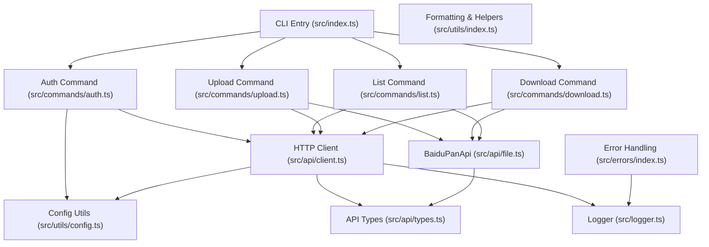
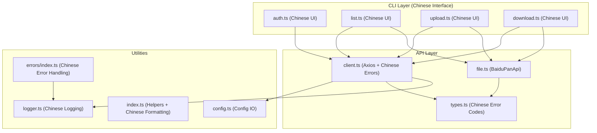
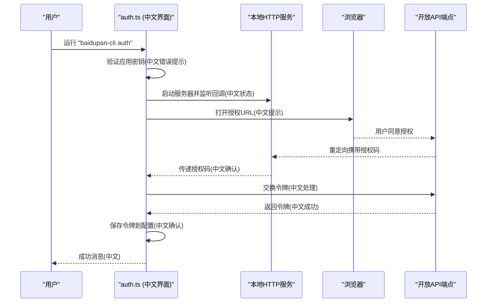
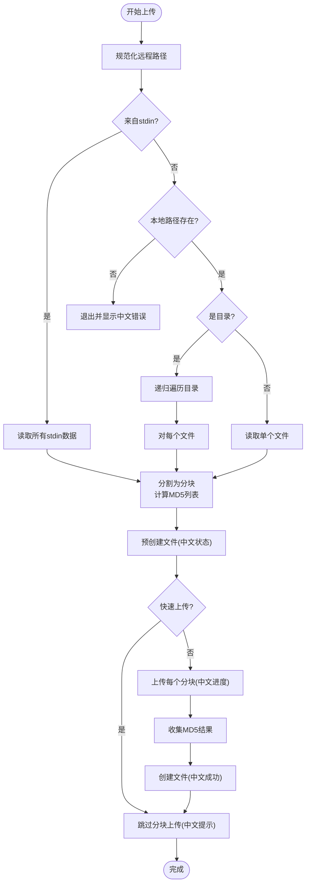
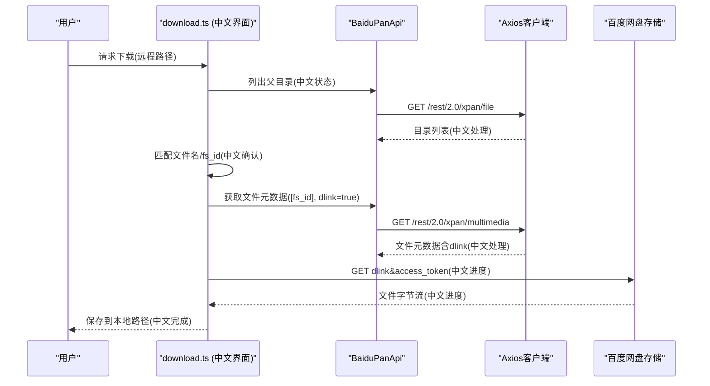
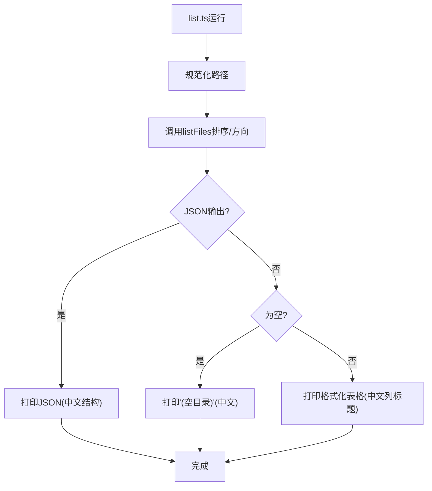
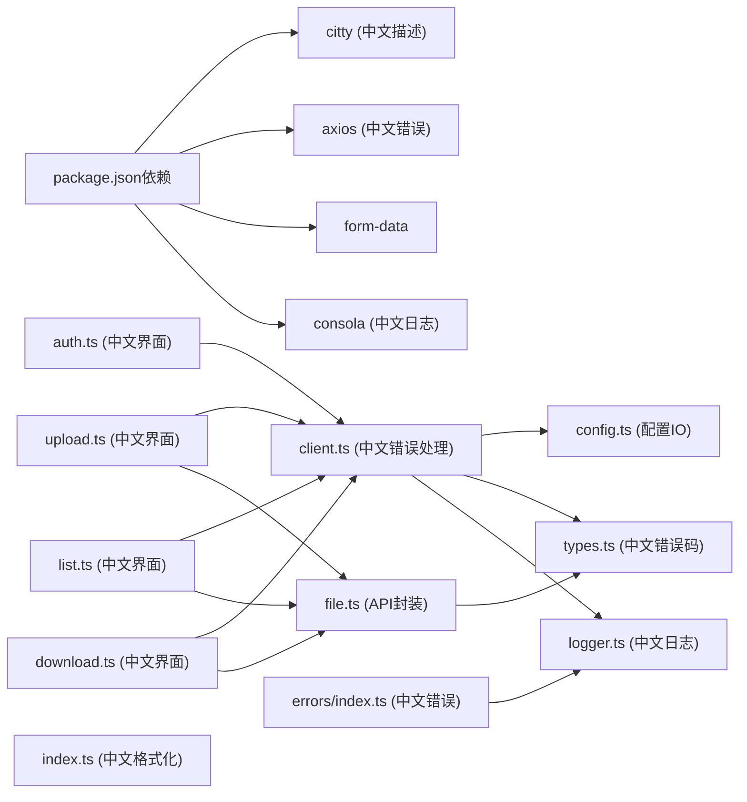

# Project Overview

<cite>
**Referenced Files in This Document**
- [README.md](file://README.md)
- [package.json](file://package.json)
- [src/index.ts](file://src/index.ts)
- [src/commands/auth.ts](file://src/commands/auth.ts)
- [src/commands/list.ts](file://src/commands/list.ts)
- [src/commands/upload.ts](file://src/commands/upload.ts)
- [src/commands/download.ts](file://src/commands/download.ts)
- [src/api/client.ts](file://src/api/client.ts)
- [src/api/file.ts](file://src/api/file.ts)
- [src/api/types.ts](file://src/api/types.ts)
- [src/utils/config.ts](file://src/utils/config.ts)
- [src/utils/index.ts](file://src/utils/index.ts)
- [src/logger.ts](file://src/logger.ts)
- [src/errors/index.ts](file://src/errors/index.ts)
- [src/errors/types.ts](file://src/errors/types.ts)
- [example/README.md](file://example/README.md)
</cite>

## Update Summary
**Changes Made**
- Updated target audience and positioning to reflect exclusive focus on Chinese-speaking users
- Enhanced Chinese localization emphasis throughout the document
- Added comprehensive coverage of Chinese user-facing messaging and error handling
- Updated architectural approach to highlight Chinese language support as a core feature
- Revised practical examples to demonstrate Chinese interface usage

## Table of Contents
1. [Introduction](#introduction)
2. [Project Structure](#project-structure)
3. [Core Components](#core-components)
4. [Architecture Overview](#architecture-overview)
5. [Detailed Component Analysis](#detailed-component-analysis)
6. [Dependency Analysis](#dependency-analysis)
7. [Performance Considerations](#performance-considerations)
8. [Troubleshooting Guide](#troubleshooting-guide)
9. [Conclusion](#conclusion)
10. [Appendices](#appendices)

## Introduction
baidupan-cli is a comprehensive command-line interface specifically designed for Chinese-speaking users to manage Baidu Pan (Baidu Netdisk) cloud storage. The tool provides a fully localized Chinese user experience with complete Chinese localization of all user-facing messages, error notifications, and command outputs. It enables seamless OAuth 2.0 authentication, directory listing with Chinese labels, file upload/download operations, and supports chunked upload with MD5-based block verification for reliable large file transfers.

**Strategic Focus**: The project has strategically shifted to serve exclusively the Chinese-speaking user base, with all interfaces, error messages, and documentation presented in Chinese to provide the most intuitive experience for Chinese users.

Target audience:
- **Chinese-speaking beginners**: Users seeking a straightforward, scriptable way to interact with Baidu Pan without GUI requirements
- **DevOps teams in China**: Teams automating backups, CI/CD integrations, and scheduled tasks using shell scripts and cron
- **Developers in mainland China**: Contributors extending functionality or integrating Baidu Pan operations into larger systems

Main benefits:
- **Complete Chinese localization**: All user-facing messages, error notifications, and command outputs are presented in Chinese
- **Seamless OAuth 2.0 authorization**: Localized authorization flow with Chinese prompts and status messages
- **Robust upload pipeline**: Supports chunked uploads, rapid upload detection, and progress reporting with Chinese status indicators
- **Flexible listing with Chinese formatting**: Directory listings with Chinese labels and JSON output for scripting
- **Reliable download with Chinese feedback**: Metadata retrieval and progress feedback in Chinese
- **Extensible architecture**: Suitable for automation and integration within Chinese tech ecosystems

**Section sources**
- [README.md](file://README.md#L1-L247)
- [src/commands/auth.ts](file://src/commands/auth.ts#L61-L66)
- [src/commands/auth.ts](file://src/commands/auth.ts#L180-L195)
- [src/commands/list.ts](file://src/commands/list.ts#L61-L74)
- [src/commands/upload.ts](file://src/commands/upload.ts#L108-L122)
- [src/commands/download.ts](file://src/commands/download.ts#L151-L158)

## Project Structure
The project follows a modular, feature-based layout optimized for Chinese user experience:
- **src/index.ts**: CLI entrypoint with Chinese command registration and routing
- **src/commands/**: Command implementations with fully localized Chinese interfaces
- **src/api/**: HTTP clients and Baidu Pan API abstractions with Chinese error handling
- **src/utils/**: Shared utilities for configuration, path normalization, and formatting
- **src/logger.ts**: Chinese-localized logging infrastructure
- **src/errors/**: Error classes with Chinese error messages
- **example/**: Real-world automation scenarios with Chinese documentation

**Diagram sources**
- [src/index.ts](file://src/index.ts#L1-L49)
- [src/commands/auth.ts](file://src/commands/auth.ts#L1-L196)
- [src/commands/list.ts](file://src/commands/list.ts#L1-L77)
- [src/commands/upload.ts](file://src/commands/upload.ts#L1-L164)
- [src/commands/download.ts](file://src/commands/download.ts#L1-L191)
- [src/api/client.ts](file://src/api/client.ts#L1-L72)
- [src/api/file.ts](file://src/api/file.ts#L1-L201)
- [src/api/types.ts](file://src/api/types.ts#L1-L102)
- [src/utils/config.ts](file://src/utils/config.ts#L1-L63)
- [src/utils/index.ts](file://src/utils/index.ts#L1-L111)
- [src/logger.ts](file://src/logger.ts#L1-L23)
- [src/errors/index.ts](file://src/errors/index.ts#L1-L23)

**Section sources**
- [src/index.ts](file://src/index.ts#L1-L49)
- [package.json](file://package.json#L1-L98)

## Core Components
- **CLI entrypoint and routing**: Registers subcommands with Chinese descriptions and delegates to dedicated command modules
- **Authentication (OAuth 2.0)**: Complete Chinese authorization flow with localized prompts, browser opening, and token persistence
- **Listing**: Directory listings with Chinese labels, sorting options, and JSON output for scripting
- **Uploading**: Single files, directories, and standard input streams with Chinese progress indicators and chunked upload support
- **Downloading**: File and directory downloads with Chinese status messages and progress feedback
- **API layer**: Axios-based client with automatic token refresh, Chinese error handling, and typed Baidu Pan endpoint wrappers
- **Utilities**: Path normalization, size/date formatting, recursive directory traversal, and Chinese progress rendering
- **Logging and error handling**: Fully localized logging infrastructure with Chinese error messages and status indicators

Practical examples (see also usage in README and example scripts):
- **Authorize and persist tokens**: Complete Chinese authorization flow with token saving
- **List directories**: Chinese-labeled directory listings with sorting and JSON output
- **Upload operations**: Directory trees and stdin streaming with Chinese progress feedback
- **Download workflows**: File and directory downloads with Chinese status messages

**Section sources**
- [src/index.ts](file://src/index.ts#L14-L46)
- [src/commands/auth.ts](file://src/commands/auth.ts#L38-L86)
- [src/commands/list.ts](file://src/commands/list.ts#L37-L75)
- [src/commands/upload.ts](file://src/commands/upload.ts#L43-L99)
- [src/commands/download.ts](file://src/commands/download.ts#L34-L68)
- [src/api/client.ts](file://src/api/client.ts#L10-L60)
- [src/api/file.ts](file://src/api/file.ts#L16-L175)
- [src/utils/index.ts](file://src/utils/index.ts#L27-L110)
- [README.md](file://README.md#L1-L247)
- [example/README.md](file://example/README.md#L1-L106)

## Architecture Overview
High-level design optimized for Chinese user experience:
- **CLI commands** depend on a shared HTTP client configured with Baidu Pan endpoints and Chinese localization
- **Client enforces** access token presence with Chinese error messages and auto-refreshes expired tokens transparently
- **Commands orchestrate** API calls with Chinese status indicators for list, upload (precreate → chunk upload → create), and download operations
- **Configuration utilities** manage credentials and tokens in secure local files with Chinese prompts
- **Logging infrastructure** provides Chinese status messages, warnings, and success notifications

**Diagram sources**
- [src/commands/auth.ts](file://src/commands/auth.ts#L1-L196)
- [src/commands/list.ts](file://src/commands/list.ts#L1-L77)
- [src/commands/upload.ts](file://src/commands/upload.ts#L1-L164)
- [src/commands/download.ts](file://src/commands/download.ts#L1-L191)
- [src/api/client.ts](file://src/api/client.ts#L1-L72)
- [src/api/file.ts](file://src/api/file.ts#L1-L201)
- [src/api/types.ts](file://src/api/types.ts#L93-L102)
- [src/utils/config.ts](file://src/utils/config.ts#L1-L63)
- [src/utils/index.ts](file://src/utils/index.ts#L1-L111)
- [src/logger.ts](file://src/logger.ts#L1-L23)
- [src/errors/index.ts](file://src/errors/index.ts#L1-L23)

## Detailed Component Analysis

### OAuth 2.0 Authorization Flow (Fully Chinese)
The auth command implements a complete Chinese OAuth 2.0 flow:
- Validates app credentials with Chinese error messages
- Starts local HTTP server with Chinese status indicators
- Opens browser to authorization endpoint with Chinese prompts
- Exchanges authorization code for tokens with Chinese success messages
- Saves tokens to config file with Chinese confirmation

**Diagram sources**
- [src/commands/auth.ts](file://src/commands/auth.ts#L44-L56)
- [src/commands/auth.ts](file://src/commands/auth.ts#L61-L66)
- [src/commands/auth.ts](file://src/commands/auth.ts#L71-L73)
- [src/commands/auth.ts](file://src/commands/auth.ts#L82-L85)
- [src/commands/auth.ts](file://src/commands/auth.ts#L180-L195)

**Section sources**
- [src/commands/auth.ts](file://src/commands/auth.ts#L38-L86)
- [src/commands/auth.ts](file://src/commands/auth.ts#L166-L195)
- [src/api/client.ts](file://src/api/client.ts#L28-L36)

### Chunked Upload Pipeline (Chinese Status Feedback)
The upload command orchestrates a three-stage process with comprehensive Chinese status indicators:
- **Precreate**: Determines rapid upload possibility or prepares upload metadata with Chinese progress
- **Chunk upload**: Iterates through required blocks with Chinese progress bars and MD5 collection
- **Create**: Finalizes file creation with Chinese success messages

**Diagram sources**
- [src/commands/upload.ts](file://src/commands/upload.ts#L52-L57)
- [src/commands/upload.ts](file://src/commands/upload.ts#L65-L89)
- [src/commands/upload.ts](file://src/commands/upload.ts#L116-L123)
- [src/commands/upload.ts](file://src/commands/upload.ts#L129-L151)
- [src/commands/upload.ts](file://src/commands/upload.ts#L154-L162)

**Section sources**
- [src/commands/upload.ts](file://src/commands/upload.ts#L102-L164)
- [src/api/file.ts](file://src/api/file.ts#L79-L102)
- [src/api/file.ts](file://src/api/file.ts#L143-L167)
- [src/api/file.ts](file://src/api/file.ts#L187-L198)

### Download Workflow (Chinese Progress Indicators)
The download command provides comprehensive Chinese status feedback:
- Resolves remote path with Chinese status messages
- Retrieves file metadata with Chinese prompts
- Streams downloads with Chinese progress indicators
- Handles directory downloads with Chinese success notifications

**Diagram sources**
- [src/commands/download.ts](file://src/commands/download.ts#L41-L54)
- [src/commands/download.ts](file://src/commands/download.ts#L150-L157)
- [src/commands/download.ts](file://src/commands/download.ts#L163-L185)

**Section sources**
- [src/commands/download.ts](file://src/commands/download.ts#L131-L191)
- [src/api/file.ts](file://src/api/file.ts#L65-L74)

### Listing and Sorting (Chinese Formatting)
The list command provides fully localized Chinese interface:
- Normalizes requested directory path with Chinese validation
- Calls API with configurable order and direction with Chinese prompts
- Outputs formatted tables with Chinese labels or JSON for machine consumption
- Handles empty directories with Chinese "(空目录)" message

**Diagram sources**
- [src/commands/list.ts](file://src/commands/list.ts#L41-L58)
- [src/commands/list.ts](file://src/commands/list.ts#L61-L71)

**Section sources**
- [src/commands/list.ts](file://src/commands/list.ts#L37-L75)
- [src/utils/index.ts](file://src/utils/index.ts#L27-L23)

## Dependency Analysis
External libraries and roles with Chinese localization considerations:
- **citty**: CLI framework for defining commands with Chinese descriptions and arguments
- **axios**: HTTP client for API requests and downloads with Chinese error handling
- **form-data**: Multipart/form-data support for chunked uploads
- **consola**: Logging infrastructure with Chinese status messages and formatting

Internal dependencies with Chinese focus:
- **Commands depend** on shared HTTP client and BaiduPanApi wrapper with Chinese error messages
- **HTTP client depends** on configuration utilities for credentials and token persistence with Chinese prompts
- **API types** unify response structures with Chinese error code descriptions
- **Error handling** provides Chinese error messages and status indicators

**Diagram sources**
- [package.json](file://package.json#L64-L89)
- [src/commands/auth.ts](file://src/commands/auth.ts#L1-L196)
- [src/commands/list.ts](file://src/commands/list.ts#L1-L77)
- [src/commands/upload.ts](file://src/commands/upload.ts#L1-L164)
- [src/commands/download.ts](file://src/commands/download.ts#L1-L191)
- [src/api/client.ts](file://src/api/client.ts#L1-L72)
- [src/api/file.ts](file://src/api/file.ts#L1-L201)
- [src/api/types.ts](file://src/api/types.ts#L93-L102)
- [src/utils/config.ts](file://src/utils/config.ts#L1-L63)
- [src/utils/index.ts](file://src/utils/index.ts#L1-L111)
- [src/logger.ts](file://src/logger.ts#L1-L23)
- [src/errors/index.ts](file://src/errors/index.ts#L1-L23)

**Section sources**
- [package.json](file://package.json#L64-L89)
- [src/api/client.ts](file://src/api/client.ts#L21-L50)
- [src/api/file.ts](file://src/api/file.ts#L16-L175)
- [src/utils/config.ts](file://src/utils/config.ts#L1-L63)
- [src/logger.ts](file://src/logger.ts#L1-L23)
- [src/errors/index.ts](file://src/errors/index.ts#L1-L23)

## Performance Considerations
- **Chunked upload**: Uses fixed chunk size with MD5 per block for efficient resume and rapid upload detection with Chinese progress feedback
- **Progress reporting**: Uploads and downloads display Chinese progress bars and status messages to enhance user experience
- **Token caching and refresh**: Access tokens cached in memory with automatic refresh and Chinese status messages when encountering expiration
- **Streaming**: Downloads use streaming responses with Chinese progress indicators to avoid loading entire files into memory
- **Directory traversal**: Recursive directory scanning is synchronous with Chinese progress indicators for very large trees

## Troubleshooting Guide
Common issues and resolutions with Chinese troubleshooting messages:
- **Authorization failures**: Verify app credentials and redirect URI match with Chinese error prompts; confirm local port availability and successful browser opening
- **Token problems**: Ensure config file exists with valid tokens; client attempts automatic refresh with Chinese status messages
- **Network connectivity**: Check Baidu Pan endpoint reachability with Chinese connection status; avoid proxies blocking requests
- **Path and permissions**: Ensure remote paths start with leading slash and account has permission; Chinese validation messages for path issues
- **Large file uploads**: Expect longer upload times with Chinese progress indicators; tool handles chunked uploads with stable network connection

**Section sources**
- [src/commands/auth.ts](file://src/commands/auth.ts#L44-L56)
- [src/commands/auth.ts](file://src/commands/auth.ts#L142-L164)
- [src/api/client.ts](file://src/api/client.ts#L28-L36)
- [src/api/client.ts](file://src/api/client.ts#L43-L48)
- [README.md](file://README.md#L226-L243)

## Conclusion
baidupan-cli delivers a robust, script-friendly interface to Baidu Pan with complete Chinese localization, OAuth 2.0 authentication, reliable chunked uploads, flexible listing, and dependable downloads. Its layered architecture separates concerns cleanly while providing a seamless Chinese user experience, enabling easy extension and automation. Beginners can quickly perform everyday tasks with Chinese prompts, while advanced users can integrate the tool into complex workflows and CI/CD pipelines within Chinese tech ecosystems.

## Appendices

### Practical Use Cases
- **One-time file transfer**: Upload single files or entire directories to Baidu Pan with Chinese progress feedback
- **Continuous backup**: Use example scripts to automate database backups and push artifacts to Baidu Pan with Chinese status messages
- **CI/CD artifact publishing**: Integrate upload commands into build pipelines to publish artifacts securely with Chinese logging

**Section sources**
- [README.md](file://README.md#L197-L247)
- [example/README.md](file://example/README.md#L1-L106)
