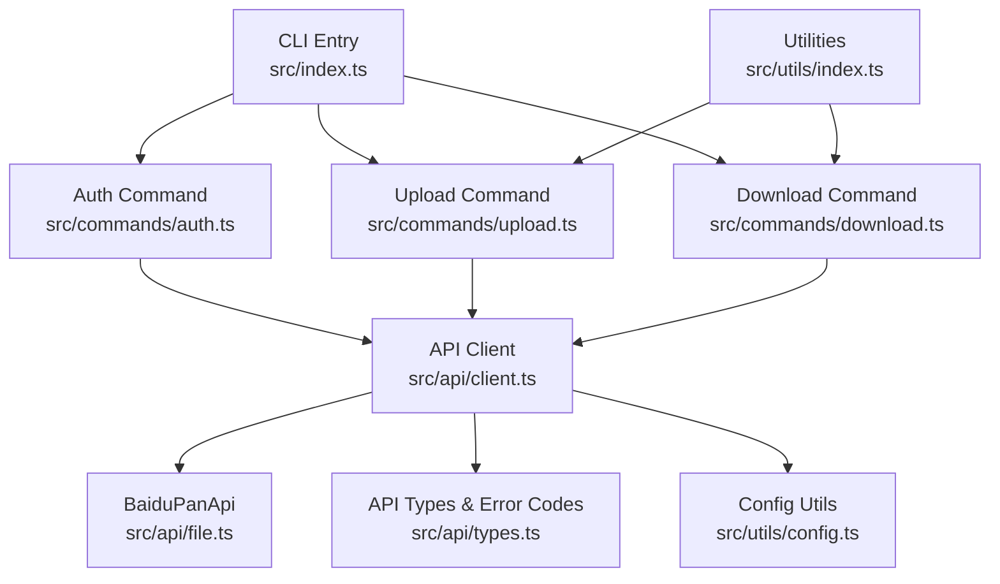
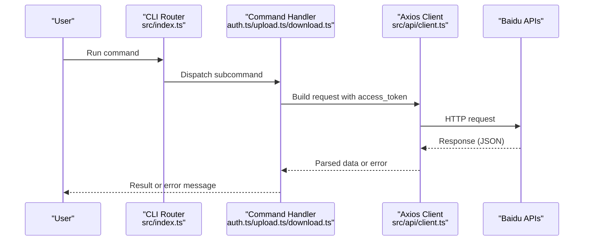
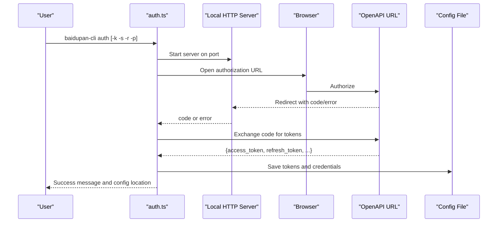
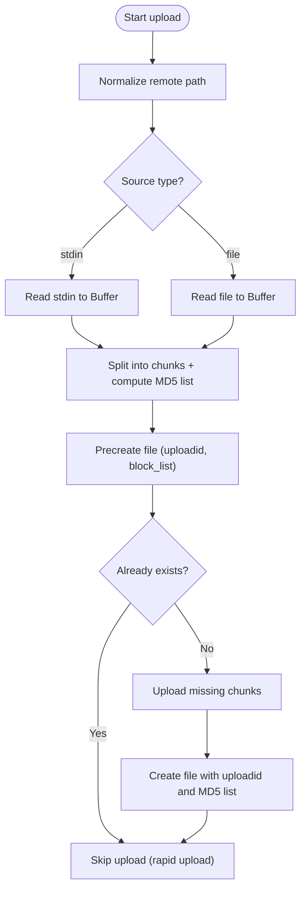
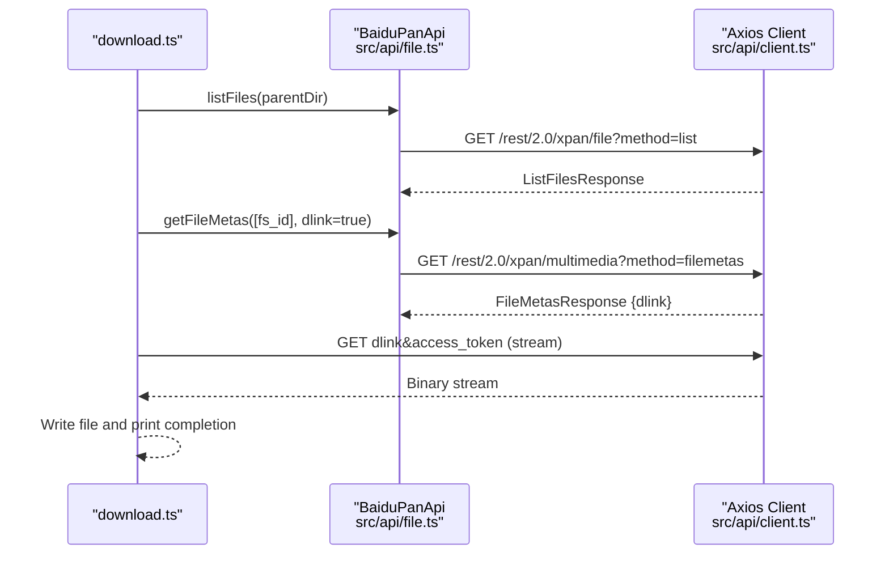
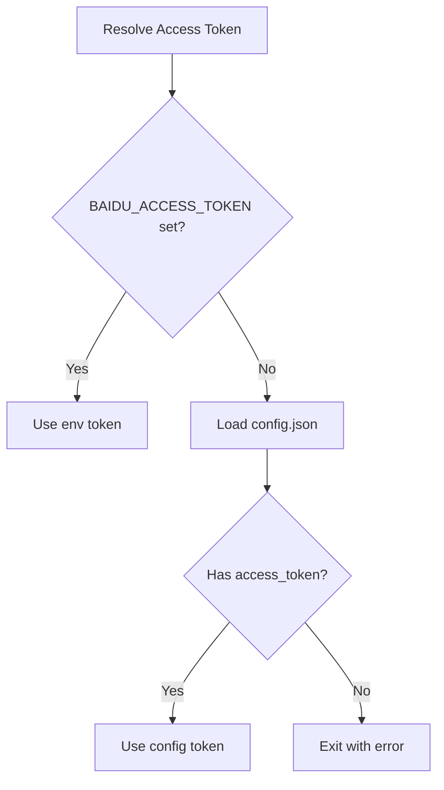
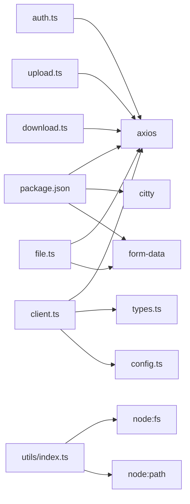

# Troubleshooting & FAQ

<cite>
**Referenced Files in This Document**
- [README.md](file://README.md)
- [src/index.ts](file://src/index.ts)
- [src/commands/auth.ts](file://src/commands/auth.ts)
- [src/commands/upload.ts](file://src/commands/upload.ts)
- [src/commands/download.ts](file://src/commands/download.ts)
- [src/api/client.ts](file://src/api/client.ts)
- [src/api/file.ts](file://src/api/file.ts)
- [src/api/types.ts](file://src/api/types.ts)
- [src/utils/config.ts](file://src/utils/config.ts)
- [src/utils/index.ts](file://src/utils/index.ts)
- [example/README.md](file://example/README.md)
- [package.json](file://package.json)
</cite>

## Table of Contents
1. [Introduction](#introduction)
2. [Project Structure](#project-structure)
3. [Core Components](#core-components)
4. [Architecture Overview](#architecture-overview)
5. [Detailed Component Analysis](#detailed-component-analysis)
6. [Dependency Analysis](#dependency-analysis)
7. [Performance Considerations](#performance-considerations)
8. [Troubleshooting Guide](#troubleshooting-guide)
9. [Conclusion](#conclusion)
10. [Appendices](#appendices)

## Introduction
This document provides a comprehensive troubleshooting guide for the Baidu Pan CLI tool. It focuses on diagnosing and resolving authentication issues (OAuth flow failures, credential errors, token expiration), file operation problems (upload/download failures, permission errors), configuration and environment issues (missing tokens, incorrect paths), and performance-related concerns (timeouts, retries, rate limits). It also includes diagnostic techniques, log analysis tips, and step-by-step resolution procedures, along with frequently asked questions.

## Project Structure
The CLI is organized around a command router and modularized modules for authentication, uploads, downloads, API clients, and utilities. Commands are registered centrally and executed via a command framework. API interactions are encapsulated in a typed client with automatic token refresh and error translation.

**Diagram sources**
- [src/index.ts](file://src/index.ts#L1-L26)
- [src/commands/auth.ts](file://src/commands/auth.ts#L1-L258)
- [src/commands/upload.ts](file://src/commands/upload.ts#L1-L144)
- [src/commands/download.ts](file://src/commands/download.ts#L1-L104)
- [src/api/client.ts](file://src/api/client.ts#L1-L171)
- [src/api/file.ts](file://src/api/file.ts#L1-L201)
- [src/api/types.ts](file://src/api/types.ts#L1-L108)
- [src/utils/config.ts](file://src/utils/config.ts#L1-L62)
- [src/utils/index.ts](file://src/utils/index.ts#L1-L110)

**Section sources**
- [src/index.ts](file://src/index.ts#L1-L26)
- [package.json](file://package.json#L1-L81)

## Core Components
- Authentication command orchestrates OAuth authorization, local callback server, token exchange, and persistent storage.
- Upload command handles stdin, directories, and single files; splits data into chunks and performs precreate, chunk upload, and create steps.
- Download command resolves remote file metadata, obtains a direct link, and streams to disk with progress reporting.
- API client manages access tokens, refreshes expired tokens, and translates API error codes into user-friendly messages.
- Utilities provide path normalization, recursive directory traversal, buffer I/O, and progress rendering.

**Section sources**
- [src/commands/auth.ts](file://src/commands/auth.ts#L1-L258)
- [src/commands/upload.ts](file://src/commands/upload.ts#L1-L144)
- [src/commands/download.ts](file://src/commands/download.ts#L1-L104)
- [src/api/client.ts](file://src/api/client.ts#L1-L171)
- [src/api/file.ts](file://src/api/file.ts#L1-L201)
- [src/utils/index.ts](file://src/utils/index.ts#L1-L110)

## Architecture Overview
The CLI uses a central command router and delegates work to specialized commands. API interactions are performed via an Axios-based client configured with interceptors for token injection and error handling. The client supports automatic token refresh and translates numeric error codes into readable messages.

**Diagram sources**
- [src/index.ts](file://src/index.ts#L1-L26)
- [src/commands/auth.ts](file://src/commands/auth.ts#L1-L258)
- [src/commands/upload.ts](file://src/commands/upload.ts#L1-L144)
- [src/commands/download.ts](file://src/commands/download.ts#L1-L104)
- [src/api/client.ts](file://src/api/client.ts#L112-L161)

## Detailed Component Analysis

### Authentication Flow (OAuth)
The auth command sets up a local HTTP server to receive the OAuth callback, opens a browser to the authorization endpoint, exchanges the authorization code for tokens, and persists them to a config file. It supports custom redirect URIs and ports and enforces a timeout for the authorization window.

**Diagram sources**
- [src/commands/auth.ts](file://src/commands/auth.ts#L93-L159)
- [src/commands/auth.ts](file://src/commands/auth.ts#L161-L192)
- [src/commands/auth.ts](file://src/commands/auth.ts#L218-L257)
- [src/api/client.ts](file://src/api/client.ts#L163-L168)

**Section sources**
- [src/commands/auth.ts](file://src/commands/auth.ts#L1-L258)
- [src/api/client.ts](file://src/api/client.ts#L163-L168)

### Upload Pipeline
The upload command normalizes the remote path, reads local data (file or stdin), splits into chunks, precreates the file, uploads missing chunks, and creates the final file. It reports progress and handles directory recursion.

**Diagram sources**
- [src/commands/upload.ts](file://src/commands/upload.ts#L98-L144)
- [src/api/file.ts](file://src/api/file.ts#L79-L102)
- [src/api/file.ts](file://src/api/file.ts#L107-L138)
- [src/api/file.ts](file://src/api/file.ts#L143-L167)

**Section sources**
- [src/commands/upload.ts](file://src/commands/upload.ts#L1-L144)
- [src/api/file.ts](file://src/api/file.ts#L1-L201)

### Download Pipeline
The download command lists the parent directory, finds the target file, retrieves metadata with a direct link, and writes the file to disk while streaming progress.

**Diagram sources**
- [src/commands/download.ts](file://src/commands/download.ts#L25-L102)
- [src/api/file.ts](file://src/api/file.ts#L42-L60)
- [src/api/file.ts](file://src/api/file.ts#L65-L74)
- [src/api/client.ts](file://src/api/client.ts#L112-L161)

**Section sources**
- [src/commands/download.ts](file://src/commands/download.ts#L1-L104)
- [src/api/file.ts](file://src/api/file.ts#L1-L201)

### Configuration and Environment Resolution
The client resolves credentials and tokens from environment variables first, then falls back to a local config file. Tokens are cached in memory and refreshed automatically when encountering token-related errors.

**Diagram sources**
- [src/api/client.ts](file://src/api/client.ts#L15-L37)
- [src/utils/config.ts](file://src/utils/config.ts#L19-L30)

**Section sources**
- [src/api/client.ts](file://src/api/client.ts#L1-L171)
- [src/utils/config.ts](file://src/utils/config.ts#L1-L62)

## Dependency Analysis
- The CLI depends on Axios for HTTP requests, Citty for command parsing, and Form Data for multipart uploads.
- Commands depend on the API client and shared utilities.
- The API client depends on typed responses and error code mappings.

**Diagram sources**
- [package.json](file://package.json#L49-L72)
- [src/commands/auth.ts](file://src/commands/auth.ts#L1-L10)
- [src/commands/upload.ts](file://src/commands/upload.ts#L1-L14)
- [src/commands/download.ts](file://src/commands/download.ts#L1-L7)
- [src/api/client.ts](file://src/api/client.ts#L1-L4)
- [src/api/file.ts](file://src/api/file.ts#L1-L11)
- [src/utils/index.ts](file://src/utils/index.ts#L1-L2)

**Section sources**
- [package.json](file://package.json#L1-L81)

## Performance Considerations
- Upload chunk size is fixed at 4 MB. Very large files will increase the number of chunk requests. Network stability affects throughput; consider retrying transient failures.
- The client sets a 30-second request timeout for most endpoints and a 10-second timeout for token exchange. Slow networks or proxies can cause timeouts.
- Rate limiting may trigger frequent request errors. The client does not implement retries for throttling; consider backing off and retrying manually.
- Progress reporting uses stderr to avoid interfering with stdout data streams.

[No sources needed since this section provides general guidance]

## Troubleshooting Guide

### Authentication Problems
Symptoms
- Authorization page opens but no callback arrives.
- “Access token not found” error.
- OAuth error returned with a message.
- Port already in use during authorization.

Root causes and resolutions
- Missing or invalid credentials:
  - Ensure App Key and Secret Key are correct and match the redirect URI configured in the Baidu Open Platform.
  - Verify the redirect URI matches the one used by the tool (default localhost and port).
  - Reference: [README.md](file://README.md#L135-L149), [src/commands/auth.ts](file://src/commands/auth.ts#L51-L63), [src/commands/auth.ts](file://src/commands/auth.ts#L65-L67)
- Port conflict:
  - Change the local port via the port option and ensure it is free.
  - Reference: [src/commands/auth.ts](file://src/commands/auth.ts#L40-L44), [src/commands/auth.ts](file://src/commands/auth.ts#L130-L157)
- Browser automation failure:
  - The tool attempts to open the browser automatically; if it fails, follow the printed authorization URL.
  - Reference: [src/commands/auth.ts](file://src/commands/auth.ts#L194-L216)
- Token retrieval failure:
  - The token exchange endpoint has a short timeout. Check network connectivity and try again.
  - Reference: [src/commands/auth.ts](file://src/commands/auth.ts#L167-L180), [src/api/client.ts](file://src/api/client.ts#L163-L168)
- Expired or missing tokens:
  - If the access token is missing or expired, the client exits with an error. Re-authenticate.
  - Reference: [src/api/client.ts](file://src/api/client.ts#L34-L37), [src/api/client.ts](file://src/api/client.ts#L106-L110)

Diagnostic steps
- Confirm environment variables or config file contain tokens and credentials.
  - Reference: [src/api/client.ts](file://src/api/client.ts#L15-L54), [src/utils/config.ts](file://src/utils/config.ts#L19-L30)
- Verify the config file location and permissions.
  - Reference: [src/utils/config.ts](file://src/utils/config.ts#L5-L6), [src/utils/config.ts](file://src/utils/config.ts#L35-L45)
- Manually test the authorization URL and token endpoint.
  - Reference: [src/api/client.ts](file://src/api/client.ts#L163-L168)

### Credential and Token Errors
Symptoms
- “Invalid access token” or “Access token expired” errors.
- API responses with numeric errno codes.

Resolutions
- Automatic refresh:
  - The client attempts to refresh the token using refresh_token and credentials. If successful, it retries the original request.
  - Reference: [src/api/client.ts](file://src/api/client.ts#L63-L104), [src/api/client.ts](file://src/api/client.ts#L134-L143)
- Manual re-authentication:
  - If refresh fails, re-run the auth command to obtain new tokens.
  - Reference: [src/commands/auth.ts](file://src/commands/auth.ts#L86-L89)
- Error code interpretation:
  - Numeric errno values are translated to readable messages.
  - Reference: [src/api/types.ts](file://src/api/types.ts#L99-L107), [src/api/client.ts](file://src/api/client.ts#L127-L129)

Diagnostic steps
- Check current token and expiry time in the config file.
  - Reference: [src/utils/config.ts](file://src/utils/config.ts#L20-L30), [src/commands/auth.ts](file://src/commands/auth.ts#L218-L228)
- Temporarily export environment variables to override config.
  - Reference: [README.md](file://README.md#L118-L127)

### Network Connectivity Issues
Symptoms
- Timeouts on token exchange or file operations.
- HTTP errors reported by the client.
- Download stalls or partial files.

Resolutions
- Increase timeouts or retry on transient failures.
  - The client sets default timeouts; slow networks may require manual intervention.
  - Reference: [src/api/client.ts](file://src/api/client.ts#L117-L122), [src/commands/auth.ts](file://src/commands/auth.ts#L175-L179)
- Disable proxy if applicable.
  - Both token exchange and file operations disable proxy by default.
  - Reference: [src/commands/auth.ts](file://src/commands/auth.ts#L179-L180), [src/commands/download.ts](file://src/commands/download.ts#L84-L85)

Diagnostic steps
- Test direct access to Baidu endpoints from your environment.
  - Reference: [src/api/client.ts](file://src/api/client.ts#L6-L7), [src/api/client.ts](file://src/api/client.ts#L163-L168)

### File Operation Problems
Symptoms
- Upload fails mid-way or returns rapid-upload duplicates.
- Download fails with “Could not get download link”.
- Permission errors when writing to disk.

Resolutions
- Upload failures:
  - Verify remote path normalization and existence of local files.
  - Check chunk upload results and MD5 list consistency.
  - Reference: [src/commands/upload.ts](file://src/commands/upload.ts#L49-L53), [src/commands/upload.ts](file://src/commands/upload.ts#L107-L114), [src/api/file.ts](file://src/api/file.ts#L107-L138)
- Download failures:
  - Ensure the file exists and is not a directory.
  - Confirm the metadata endpoint returns a download link.
  - Reference: [src/commands/download.ts](file://src/commands/download.ts#L43-L51), [src/commands/download.ts](file://src/commands/download.ts#L59-L62)
- Permission errors:
  - Ensure the destination path exists and is writable.
  - Reference: [src/commands/download.ts](file://src/commands/download.ts#L94-L96)

Diagnostic steps
- Normalize remote paths to ensure leading slash.
  - Reference: [src/utils/index.ts](file://src/utils/index.ts#L28-L33)
- List directory contents to confirm file presence.
  - Reference: [src/api/file.ts](file://src/api/file.ts#L42-L60)

### Configuration and Path Resolution Errors
Symptoms
- Config file not found or unreadable.
- Incorrect config path on different platforms.
- Misconfigured environment variables.

Resolutions
- Locate config file:
  - On Windows: under the user profile directory.
  - On macOS/Linux: under the home directory.
  - Reference: [README.md](file://README.md#L129-L133), [src/utils/config.ts](file://src/utils/config.ts#L5-L6)
- Fix permissions:
  - The config file is written with restrictive permissions.
  - Reference: [src/utils/config.ts](file://src/utils/config.ts#L40-L41)
- Set environment variables:
  - Export keys and tokens to override config.
  - Reference: [README.md](file://README.md#L118-L127)

Diagnostic steps
- Print the resolved config path and verify its contents.
  - Reference: [src/utils/config.ts](file://src/utils/config.ts#L59-L61), [src/commands/auth.ts](file://src/commands/auth.ts#L230-L238)

### Logging and Debugging Strategies
- Readiness checks:
  - Verify the config file exists and contains tokens.
  - Reference: [src/utils/config.ts](file://src/utils/config.ts#L20-L30)
- Token lifecycle:
  - Monitor token expiry and auto-refresh logs.
  - Reference: [src/commands/auth.ts](file://src/commands/auth.ts#L218-L228), [src/api/client.ts](file://src/api/client.ts#L71-L95)
- Error messages:
  - Pay attention to numeric errno codes and translated messages.
  - Reference: [src/api/types.ts](file://src/api/types.ts#L99-L107), [src/api/client.ts](file://src/api/client.ts#L127-L129)

### Performance and Timeout Issues
- Timeouts:
  - Token exchange timeout is short; network latency may cause failures.
  - Reference: [src/commands/auth.ts](file://src/commands/auth.ts#L175-L179)
- Large uploads:
  - Expect many chunk requests; ensure stable connection.
  - Reference: [src/api/file.ts](file://src/api/file.ts#L13-L14), [src/api/file.ts](file://src/api/file.ts#L187-L198)
- Rate limiting:
  - The client does not retry on throttling; consider manual backoff.
  - Reference: [src/api/types.ts](file://src/api/types.ts#L106-L107)

### Frequently Asked Questions
Q: How do I fix “Access token not found”?
- A: Run the auth command to obtain tokens, or set environment variables for tokens and credentials.
  - Reference: [src/api/client.ts](file://src/api/client.ts#L34-L37), [README.md](file://README.md#L118-L127)

Q: Why does authorization fail with a port error?
- A: Another service is using the default port. Change the port via the port option.
  - Reference: [src/commands/auth.ts](file://src/commands/auth.ts#L40-L44), [src/commands/auth.ts](file://src/commands/auth.ts#L130-L157)

Q: How do I handle “Access token expired”?
- A: The client attempts to refresh automatically. If it fails, re-authenticate.
  - Reference: [src/api/client.ts](file://src/api/client.ts#L63-L104), [src/commands/auth.ts](file://src/commands/auth.ts#L86-L89)

Q: My upload seems stuck. What should I check?
- A: Verify network stability, remote path normalization, and that the file does not already exist (rapid upload).
  - Reference: [src/commands/upload.ts](file://src/commands/upload.ts#L107-L114), [src/utils/index.ts](file://src/utils/index.ts#L28-L33)

Q: Why does download fail with “Could not get download link”?
- A: Confirm the file exists and is not a directory, then retry the metadata fetch.
  - Reference: [src/commands/download.ts](file://src/commands/download.ts#L43-L51), [src/commands/download.ts](file://src/commands/download.ts#L59-L62)

Q: Where is the config file stored?
- A: See the platform-specific path described in the documentation.
  - Reference: [README.md](file://README.md#L129-L133)

Q: How can I debug API errors?
- A: Look for numeric errno codes in error messages and consult the error code mapping.
  - Reference: [src/api/types.ts](file://src/api/types.ts#L99-L107), [src/api/client.ts](file://src/api/client.ts#L127-L129)

## Conclusion
This guide consolidates the most common issues and their solutions for the Baidu Pan CLI. By understanding the authentication flow, upload/download pipeline, configuration resolution, and error handling, you can systematically diagnose and resolve problems. Use the provided diagnostic steps and references to quickly locate root causes and apply targeted fixes.

## Appendices

### Error Code Interpretation
- 0: Success
- -6: Invalid access token
- -7: Access denied
- -9: File not found
- 2: Parameter error
- 111: Access token expired
- 31034: Request too frequent

**Section sources**
- [src/api/types.ts](file://src/api/types.ts#L99-L107)

### Example Script Troubleshooting
- Ensure Node.js and MongoDB tools are installed and available.
- Verify the CLI is configured and the config file exists.
- Check logs and cron setup for scheduled backups.
- Reference: [example/README.md](file://example/README.md#L97-L106)
