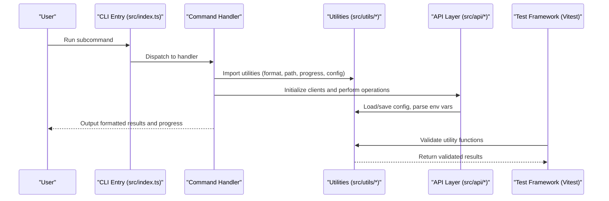
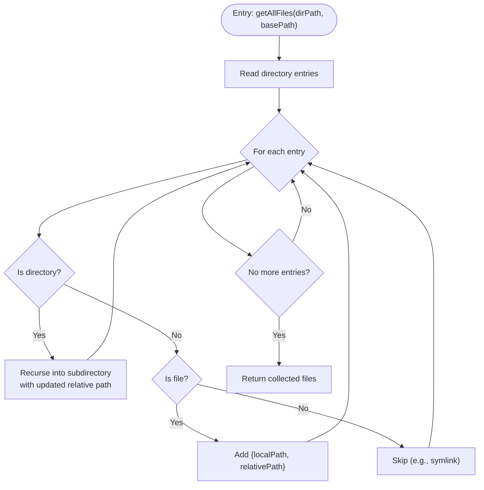
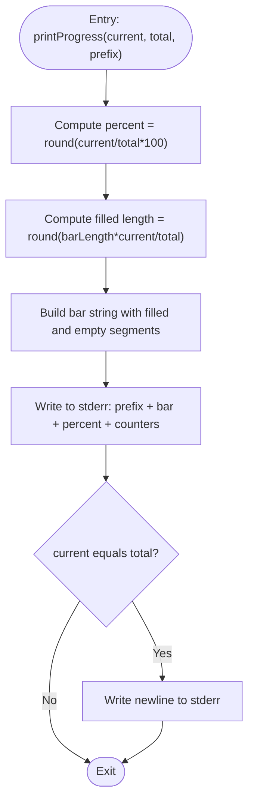
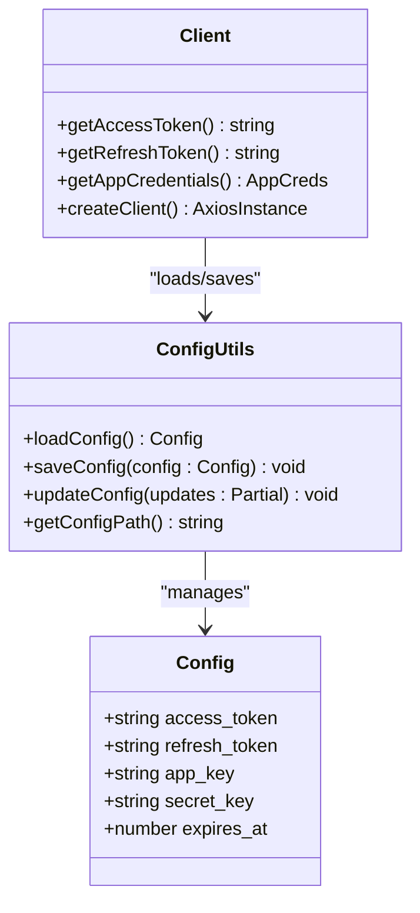
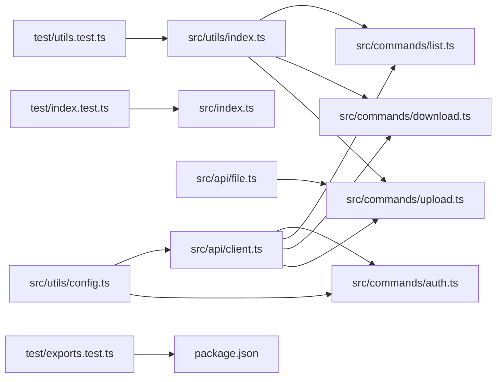

# Utility Functions

<cite>
**Referenced Files in This Document**
- [src/utils/index.ts](file://src/utils/index.ts)
- [src/utils/config.ts](file://src/utils/config.ts)
- [src/commands/upload.ts](file://src/commands/upload.ts)
- [src/commands/download.ts](file://src/commands/download.ts)
- [src/commands/list.ts](file://src/commands/list.ts)
- [src/commands/auth.ts](file://src/commands/auth.ts)
- [src/api/file.ts](file://src/api/file.ts)
- [src/api/client.ts](file://src/api/client.ts)
- [src/index.ts](file://src/index.ts)
- [test/utils.test.ts](file://test/utils.test.ts)
- [test/index.test.ts](file://test/index.test.ts)
- [test/exports.test.ts](file://test/exports.test.ts)
- [vitest.config.ts](file://vitest.config.ts)
- [package.json](file://package.json)
- [README.md](file://README.md)
</cite>

## Update Summary
**Changes Made**
- Added comprehensive unit testing framework documentation with Vitest configuration
- Updated testing guidelines and best practices for utility function validation
- Enhanced documentation to cover systematic testing approaches for critical utility functions
- Added testing patterns for formatSize, formatDate, and normalizePath functions

## Table of Contents
1. [Introduction](#introduction)
2. [Project Structure](#project-structure)
3. [Core Components](#core-components)
4. [Architecture Overview](#architecture-overview)
5. [Testing Framework](#testing-framework)
6. [Detailed Component Analysis](#detailed-component-analysis)
7. [Dependency Analysis](#dependency-analysis)
8. [Performance Considerations](#performance-considerations)
9. [Troubleshooting Guide](#troubleshooting-guide)
10. [Conclusion](#conclusion)
11. [Appendices](#appendices)

## Introduction
This document provides comprehensive documentation for the utility functions and helper modules in the project. It focuses on:
- File system utilities: path normalization, recursive directory traversal, and file metadata extraction helpers
- Formatting functions: human-readable sizes, timestamps, and progress display
- Progress tracking mechanisms and console output formatting
- Configuration utilities and environment variable parsing
- System integration helpers and extension patterns
- **Updated**: Comprehensive unit testing framework with systematic validation of critical utility functions
- Practical usage examples, integration patterns, and performance best practices

The utilities are primarily located under src/utils and are consumed by CLI commands and API modules to provide robust, user-friendly functionality. The testing framework ensures reliability and maintainability of these critical components.

## Project Structure
The utility modules are organized under src/utils and are imported by command handlers and API modules. The main CLI entry defines subcommands that orchestrate operations using these utilities. A comprehensive testing framework has been established to validate utility function behavior.

```mermaid
graph TB
subgraph "CLI Entry"
IDX["src/index.ts"]
end
subgraph "Commands"
CMD_UPLOAD["src/commands/upload.ts"]
CMD_DOWNLOAD["src/commands/download.ts"]
CMD_LIST["src/commands/list.ts"]
CMD_AUTH["src/commands/auth.ts"]
end
subgraph "Utilities"
UTIL_INDEX["src/utils/index.ts"]
UTIL_CONFIG["src/utils/config.ts"]
end
subgraph "API Layer"
API_CLIENT["src/api/client.ts"]
API_FILE["src/api/file.ts"]
end
subgraph "Testing Framework"
TEST_UTILS["test/utils.test.ts"]
TEST_INDEX["test/index.test.ts"]
TEST_EXPORTS["test/exports.test.ts"]
VITEST_CONFIG["vitest.config.ts"]
END
IDX --> CMD_UPLOAD
IDX --> CMD_DOWNLOAD
IDX --> CMD_LIST
IDX --> CMD_AUTH
CMD_UPLOAD --> UTIL_INDEX
CMD_UPLOAD --> API_FILE
CMD_DOWNLOAD --> UTIL_INDEX
CMD_DOWNLOAD --> API_CLIENT
CMD_LIST --> UTIL_INDEX
CMD_AUTH --> UTIL_CONFIG
CMD_UPLOAD --> API_CLIENT
CMD_DOWNLOAD --> API_CLIENT
CMD_LIST --> API_CLIENT
CMD_AUTH --> API_CLIENT
API_FILE --> UTIL_INDEX
API_CLIENT --> UTIL_CONFIG
TEST_UTILS --> UTIL_INDEX
TEST_INDEX --> IDX
TEST_EXPORTS --> PACKAGE["package.json"]
```

**Diagram sources**
- [src/index.ts](file://src/index.ts#L1-L26)
- [src/commands/upload.ts](file://src/commands/upload.ts#L1-L164)
- [src/commands/download.ts](file://src/commands/download.ts#L1-L191)
- [src/commands/list.ts](file://src/commands/list.ts#L1-L81)
- [src/commands/auth.ts](file://src/commands/auth.ts#L1-L258)
- [src/utils/index.ts](file://src/utils/index.ts#L1-L111)
- [src/utils/config.ts](file://src/utils/config.ts#L1-L62)
- [src/api/file.ts](file://src/api/file.ts#L1-L201)
- [src/api/client.ts](file://src/api/client.ts#L1-L171)
- [test/utils.test.ts](file://test/utils.test.ts#L1-L60)
- [test/index.test.ts](file://test/index.test.ts#L1-L8)
- [test/exports.test.ts](file://test/exports.test.ts#L1-L27)
- [vitest.config.ts](file://vitest.config.ts#L1-L12)

**Section sources**
- [src/index.ts](file://src/index.ts#L1-L26)
- [package.json](file://package.json#L1-L98)

## Core Components
This section documents the primary utility modules and their responsibilities.

- File system utilities
  - Path normalization for remote paths
  - Recursive directory traversal returning local and relative paths
  - Directory detection and file reading helpers
  - Standard input reading
- Formatting utilities
  - Human-readable size formatting with comprehensive unit testing
  - Timestamp formatting to locale string with validation
  - Progress bar printing to stderr with percentage and counters
- Configuration utilities
  - Loading, saving, updating, and querying configuration file paths
  - Structured configuration model for tokens and keys
- **Updated**: Testing framework
  - Systematic validation of utility functions using Vitest
  - Test coverage for formatSize, formatDate, and normalizePath functions
  - Comprehensive test scenarios including edge cases and boundary conditions

These utilities are used across commands to provide consistent behavior and user experience, with systematic testing ensuring reliability.

**Section sources**
- [src/utils/index.ts](file://src/utils/index.ts#L1-L111)
- [src/utils/config.ts](file://src/utils/config.ts#L1-L62)
- [test/utils.test.ts](file://test/utils.test.ts#L1-L60)

## Architecture Overview
The utilities integrate with commands and API modules to deliver cohesive functionality. Commands import utilities for formatting, path handling, and progress reporting, while API modules rely on utilities for configuration and token management. A comprehensive testing framework validates utility function behavior across the entire application stack.



**Diagram sources**
- [src/index.ts](file://src/index.ts#L1-L26)
- [src/commands/upload.ts](file://src/commands/upload.ts#L1-L164)
- [src/commands/download.ts](file://src/commands/download.ts#L1-L191)
- [src/commands/list.ts](file://src/commands/list.ts#L1-L81)
- [src/commands/auth.ts](file://src/commands/auth.ts#L1-L258)
- [src/utils/index.ts](file://src/utils/index.ts#L1-L111)
- [src/utils/config.ts](file://src/utils/config.ts#L1-L62)
- [src/api/client.ts](file://src/api/client.ts#L1-L171)
- [src/api/file.ts](file://src/api/file.ts#L1-L201)
- [test/utils.test.ts](file://test/utils.test.ts#L1-L60)

## Testing Framework
**Updated**: The project now includes a comprehensive unit testing framework using Vitest to ensure reliability of critical utility functions.

### Test Configuration
The testing framework is configured through vitest.config.ts with specialized settings for package exports validation and dependency management.

### Core Test Coverage
The testing framework systematically validates the following utility functions:

#### formatSize Function Testing
Comprehensive test coverage for size formatting across all units:
- Zero-byte handling ("0 B" formatting)
- Byte-level precision (500 B formatting)
- Kilobyte precision (1.0 KB, 1.5 KB)
- Megabyte precision (1.0 MB, 1.5 MB)
- Gigabyte precision (1.0 GB)
- Terabyte precision (1.0 TB)

#### formatDate Function Testing
Timestamp formatting validation with locale string conversion:
- Unix timestamp to localized date/time string
- Consistent string output regardless of system locale
- Type validation ensuring string return type

#### normalizePath Function Testing
Path normalization validation with edge case handling:
- Leading slash addition for relative paths
- Preservation of existing leading slashes
- Root path handling ("/")
- Single filename normalization

### Test Execution and Validation
Tests are executed using the Vitest framework with the following characteristics:
- Isolated test environments for each utility function
- Comprehensive edge case coverage
- Type safety validation
- Performance considerations for test execution

**Section sources**
- [test/utils.test.ts](file://test/utils.test.ts#L1-L60)
- [vitest.config.ts](file://vitest.config.ts#L1-L12)
- [package.json](file://package.json#L87-L89)

## Detailed Component Analysis

### File System Utilities
Responsibilities:
- Normalize remote paths to ensure leading slash
- Recursively enumerate files with both absolute and relative paths
- Detect directories and read files as buffers
- Read standard input streams asynchronously

Usage patterns:
- Path normalization ensures consistent remote path handling across commands
- Recursive traversal enables batch operations on directories
- Buffer reading and stdin support enable flexible input sources

Integration examples:
- Upload command normalizes remote path and traverses directories to upload files
- Download command uses path utilities to locate files and determine local save locations



**Diagram sources**
- [src/utils/index.ts](file://src/utils/index.ts#L39-L56)

**Section sources**
- [src/utils/index.ts](file://src/utils/index.ts#L39-L94)
- [src/commands/upload.ts](file://src/commands/upload.ts#L65-L89)

### Formatting Utilities
Responsibilities:
- Convert byte counts to human-readable size strings with comprehensive unit testing
- Format Unix timestamps to localized date/time strings with validation
- Render progress bars to stderr with percentage and counters

Usage patterns:
- Size formatting improves readability in listings and uploads
- Timestamp formatting aligns with user expectations
- Progress bars provide real-time feedback during long-running operations

Integration examples:
- List command formats sizes and timestamps for tabular output
- Upload command prints progress bars during chunked uploads
- Download command uses size formatting for progress display



**Diagram sources**
- [src/utils/index.ts](file://src/utils/index.ts#L99-L110)

**Section sources**
- [src/utils/index.ts](file://src/utils/index.ts#L7-L23)
- [src/commands/list.ts](file://src/commands/list.ts#L64-L70)
- [src/commands/upload.ts](file://src/commands/upload.ts#L142)
- [src/commands/download.ts](file://src/commands/download.ts#L176-L182)

### Progress Tracking and Console Output
Mechanisms:
- Progress printing to stderr to avoid interfering with stdout data
- Percentage calculation and bar construction for visual feedback
- Automatic newline on completion

Best practices:
- Use stderr for progress to keep stdout clean for data
- Keep bar length and precision balanced for readability
- Clear partial lines when progress completes

**Section sources**
- [src/utils/index.ts](file://src/utils/index.ts#L99-L110)
- [src/commands/upload.ts](file://src/commands/upload.ts#L142)
- [src/commands/download.ts](file://src/commands/download.ts#L176-L182)

### Configuration Utilities and Environment Variable Parsing
Responsibilities:
- Define configuration model for tokens and keys
- Load configuration from JSON file with safe parsing
- Save configuration with secure permissions and atomic writes
- Merge updates into existing configuration
- Provide configuration file path for diagnostics and copying

Environment variable parsing:
- Client module reads tokens and credentials from environment variables with fallback to config file
- Authentication command supports environment variables for app credentials

Integration examples:
- Auth command saves tokens and prints configuration location
- Client module refreshes tokens automatically and persists updates



**Diagram sources**
- [src/utils/config.ts](file://src/utils/config.ts#L8-L61)
- [src/api/client.ts](file://src/api/client.ts#L15-L104)

**Section sources**
- [src/utils/config.ts](file://src/utils/config.ts#L1-L62)
- [src/api/client.ts](file://src/api/client.ts#L15-L104)
- [src/commands/auth.ts](file://src/commands/auth.ts#L218-L257)

### System Integration Helpers
Capabilities:
- Cross-platform browser opening for OAuth flows
- Local HTTP server for OAuth callbacks
- Token refresh and persistence
- Chunked upload preparation and MD5 computation

Integration patterns:
- Commands depend on utilities for path handling and formatting
- API modules depend on configuration utilities for credentials
- Authentication command orchestrates browser and server interactions

**Section sources**
- [src/commands/auth.ts](file://src/commands/auth.ts#L93-L159)
- [src/commands/auth.ts](file://src/commands/auth.ts#L194-L216)
- [src/api/file.ts](file://src/api/file.ts#L187-L198)
- [src/api/client.ts](file://src/api/client.ts#L63-L104)

## Dependency Analysis
The utilities are consumed by commands and API modules, forming a layered architecture. The following diagram shows key dependencies:



**Diagram sources**
- [src/utils/index.ts](file://src/utils/index.ts#L1-L111)
- [src/utils/config.ts](file://src/utils/config.ts#L1-L62)
- [src/commands/upload.ts](file://src/commands/upload.ts#L1-L164)
- [src/commands/download.ts](file://src/commands/download.ts#L1-L191)
- [src/commands/list.ts](file://src/commands/list.ts#L1-L81)
- [src/commands/auth.ts](file://src/commands/auth.ts#L1-L258)
- [src/api/file.ts](file://src/api/file.ts#L1-L201)
- [src/api/client.ts](file://src/api/client.ts#L1-L171)
- [test/utils.test.ts](file://test/utils.test.ts#L1-L60)
- [test/index.test.ts](file://test/index.test.ts#L1-L8)
- [test/exports.test.ts](file://test/exports.test.ts#L1-L27)

**Section sources**
- [src/utils/index.ts](file://src/utils/index.ts#L1-L111)
- [src/utils/config.ts](file://src/utils/config.ts#L1-L62)
- [src/commands/upload.ts](file://src/commands/upload.ts#L8-L16)
- [src/commands/download.ts](file://src/commands/download.ts#L10)
- [src/commands/list.ts](file://src/commands/list.ts#L5)
- [src/commands/auth.ts](file://src/commands/auth.ts#L6)
- [src/api/file.ts](file://src/api/file.ts#L1-L201)
- [src/api/client.ts](file://src/api/client.ts#L1-L171)
- [test/utils.test.ts](file://test/utils.test.ts#L1-L60)

## Performance Considerations
- Recursive directory traversal
  - Complexity: O(n) where n is the number of entries
  - Consider memory usage for very large directory trees; streaming or batching could reduce peak memory
- Buffer operations
  - Reading entire files into memory can be memory-intensive for large files
  - For extremely large files, consider streaming APIs or chunked processing
- Progress rendering
  - Frequent stderr writes can impact performance; ensure minimal allocations in tight loops
- Configuration file I/O
  - JSON parsing and writing are lightweight but should be avoided in hot loops
- Network and API calls
  - Chunked uploads and retries add overhead; tune chunk size and retry policies appropriately
- **Updated**: Testing framework performance
  - Test isolation ensures reliable execution without performance degradation
  - Comprehensive test coverage validates utility functions efficiently

## Troubleshooting Guide
Common issues and resolutions:
- Remote path formatting
  - Ensure paths start with a leading slash; use the normalization utility to prevent errors
- Directory traversal
  - Verify directory existence and permissions; handle empty directories gracefully
- Progress display
  - Confirm stderr availability; avoid mixing progress with data output
- Configuration loading
  - Check configuration file path and permissions; ensure JSON validity
- Token refresh failures
  - Validate app credentials and network connectivity; confirm refresh token availability
- **Updated**: Testing framework issues
  - Run `pnpm test` to execute the complete test suite
  - Use `vitest` configuration for debugging test execution
  - Validate utility function behavior with comprehensive test scenarios

**Section sources**
- [src/utils/index.ts](file://src/utils/index.ts#L28-L34)
- [src/utils/index.ts](file://src/utils/index.ts#L39-L56)
- [src/utils/index.ts](file://src/utils/index.ts#L99-L110)
- [src/utils/config.ts](file://src/utils/config.ts#L19-L30)
- [src/api/client.ts](file://src/api/client.ts#L63-L104)
- [test/utils.test.ts](file://test/utils.test.ts#L1-L60)

## Conclusion
The utility modules provide essential building blocks for path handling, formatting, progress reporting, and configuration management. Their integration across commands and API modules ensures consistent behavior, improved user experience, and maintainable code. The newly established comprehensive testing framework with systematic validation of critical utility functions ensures reliability and maintainability. Following the best practices outlined here will help extend and optimize these utilities for future enhancements while maintaining high-quality standards through automated testing.

## Appendices

### Usage Examples and Extension Patterns
- Path normalization
  - Use for remote paths to ensure consistent formatting across commands
- Recursive directory traversal
  - Extend to filter by file type or size thresholds
- Progress tracking
  - Customize bar visuals and precision based on context
- Configuration management
  - Add migration logic for schema updates
  - Integrate with external credential stores if needed
- **Updated**: Testing patterns
  - Implement comprehensive test coverage for new utility functions
  - Use edge case testing for boundary conditions
  - Validate type safety and return values

**Section sources**
- [src/commands/upload.ts](file://src/commands/upload.ts#L65-L89)
- [src/commands/list.ts](file://src/commands/list.ts#L64-L70)
- [src/commands/download.ts](file://src/commands/download.ts#L148-L182)
- [src/utils/index.ts](file://src/utils/index.ts#L7-L110)
- [src/utils/config.ts](file://src/utils/config.ts#L19-L61)
- [test/utils.test.ts](file://test/utils.test.ts#L1-L60)

### Integration with Other System Components
- CLI entry dispatches subcommands that import utilities
- Commands depend on utilities for formatting and path handling
- API modules depend on configuration utilities for credentials
- Authentication command coordinates browser and server interactions
- **Updated**: Testing framework integrates with CI/CD pipelines
- **Updated**: Test coverage ensures reliable utility function behavior

**Section sources**
- [src/index.ts](file://src/index.ts#L8-L23)
- [src/commands/upload.ts](file://src/commands/upload.ts#L8-L16)
- [src/commands/download.ts](file://src/commands/download.ts#L10)
- [src/commands/list.ts](file://src/commands/list.ts#L5)
- [src/commands/auth.ts](file://src/commands/auth.ts#L6)
- [src/api/client.ts](file://src/api/client.ts#L1-L171)
- [src/api/file.ts](file://src/api/file.ts#L1-L201)
- [test/utils.test.ts](file://test/utils.test.ts#L1-L60)

### Testing Guidelines and Best Practices
**Updated**: Comprehensive testing framework guidelines for utility functions:

#### Test Organization
- Group related tests by function in separate describe blocks
- Use meaningful test names that describe expected behavior
- Organize tests in logical order from simple to complex scenarios

#### Edge Case Coverage
- Test boundary conditions (zero values, maximum values)
- Validate error handling and exception scenarios
- Test invalid input types and formats
- Ensure backward compatibility with existing functionality

#### Test Execution
- Run tests using `pnpm test` command
- Use Vitest's watch mode for development: `vitest --watch`
- Validate test coverage reports for comprehensive validation
- Monitor test performance and optimize slow test cases

#### Quality Assurance
- Maintain test isolation between test cases
- Use consistent mocking strategies for external dependencies
- Validate type safety and return value correctness
- Ensure tests pass consistently across different environments

**Section sources**
- [test/utils.test.ts](file://test/utils.test.ts#L1-L60)
- [vitest.config.ts](file://vitest.config.ts#L1-L12)
- [package.json](file://package.json#L60)
